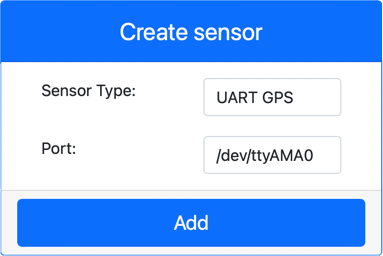

<!--
CO_OP_TRANSLATOR_METADATA:
{
  "original_hash": "64f18a8f8aaa1fef5e7320e0992d8b3a",
  "translation_date": "2025-08-25T22:57:22+00:00",
  "source_file": "3-transport/lessons/1-location-tracking/virtual-device-gps-sensor.md",
  "language_code": "pt"
}
-->
# Ler dados de GPS - Hardware Virtual IoT

Nesta parte da lição, irá adicionar um sensor GPS ao seu dispositivo IoT virtual e ler os valores dele.

## Hardware Virtual

O dispositivo IoT virtual usará um sensor GPS simulado que é acessível via UART através de uma porta serial.

Um sensor GPS físico terá uma antena para captar ondas de rádio dos satélites GPS e converter os sinais GPS em dados GPS. A versão virtual simula isso, permitindo que defina uma latitude e longitude, envie frases NMEA brutas ou carregue um ficheiro GPX com várias localizações que podem ser retornadas sequencialmente.

> 🎓 As frases NMEA serão abordadas mais tarde nesta lição.

### Adicionar o sensor ao CounterFit

Para usar um sensor GPS virtual, precisa de adicionar um à aplicação CounterFit.

#### Tarefa - adicionar o sensor ao CounterFit

Adicione o sensor GPS à aplicação CounterFit.

1. Crie uma nova aplicação Python no seu computador numa pasta chamada `gps-sensor` com um único ficheiro chamado `app.py` e um ambiente virtual Python, e adicione os pacotes pip do CounterFit.

    > ⚠️ Pode consultar [as instruções para criar e configurar um projeto Python do CounterFit na lição 1, se necessário](../../../1-getting-started/lessons/1-introduction-to-iot/virtual-device.md).

1. Instale um pacote Pip adicional para instalar um shim do CounterFit que pode comunicar com sensores baseados em UART através de uma ligação serial. Certifique-se de que está a instalar isto a partir de um terminal com o ambiente virtual ativado.

    ```sh
    pip install counterfit-shims-serial
    ```

1. Certifique-se de que a aplicação web do CounterFit está em execução.

1. Crie um sensor GPS:

    1. Na caixa *Create sensor* no painel *Sensors*, abra o menu suspenso *Sensor type* e selecione *UART GPS*.

    1. Deixe a *Port* definida como */dev/ttyAMA0*.

    1. Selecione o botão **Add** para criar o sensor GPS na porta `/dev/ttyAMA0`.

    

    O sensor GPS será criado e aparecerá na lista de sensores.

    

## Programar o sensor GPS

O dispositivo IoT virtual pode agora ser programado para usar o sensor GPS virtual.

### Tarefa - programar o sensor GPS

Programe a aplicação do sensor GPS.

1. Certifique-se de que a aplicação `gps-sensor` está aberta no VS Code.

1. Abra o ficheiro `app.py`.

1. Adicione o seguinte código no início do `app.py` para ligar a aplicação ao CounterFit:

    ```python
    from counterfit_connection import CounterFitConnection
    CounterFitConnection.init('127.0.0.1', 5000)
    ```

1. Adicione o seguinte código abaixo deste para importar algumas bibliotecas necessárias, incluindo a biblioteca para a porta serial do CounterFit:

    ```python
    import time
    import counterfit_shims_serial
    
    serial = counterfit_shims_serial.Serial('/dev/ttyAMA0')
    ```

    Este código importa o módulo `serial` do pacote Pip `counterfit_shims_serial`. Em seguida, liga-se à porta serial `/dev/ttyAMA0` - este é o endereço da porta serial que o sensor GPS virtual usa para a sua porta UART.

1. Adicione o seguinte código abaixo deste para ler da porta serial e imprimir os valores no terminal:

    ```python
    def print_gps_data(line):
        print(line.rstrip())
    
    while True:
        line = serial.readline().decode('utf-8')
    
        while len(line) > 0:
            print_gps_data(line)
            line = serial.readline().decode('utf-8')
    
        time.sleep(1)
    ```

    É definida uma função chamada `print_gps_data` que imprime no terminal a linha passada para ela.

    Em seguida, o código entra num loop infinito, lendo o máximo de linhas de texto possível da porta serial em cada iteração. Chama a função `print_gps_data` para cada linha.

    Depois de todos os dados serem lidos, o loop faz uma pausa de 1 segundo e tenta novamente.

1. Execute este código, garantindo que está a usar um terminal diferente daquele em que a aplicação CounterFit está a ser executada, para que a aplicação CounterFit continue em funcionamento.

1. Na aplicação CounterFit, altere o valor do sensor GPS. Pode fazer isso de uma das seguintes formas:

    * Defina a **Source** como `Lat/Lon` e configure uma latitude, longitude e número de satélites usados para obter a fixação GPS. Este valor será enviado apenas uma vez, por isso marque a caixa **Repeat** para que os dados sejam repetidos a cada segundo.

      

    * Defina a **Source** como `NMEA` e adicione algumas frases NMEA na caixa de texto. Todos estes valores serão enviados, com um atraso de 1 segundo antes de cada nova frase GGA (fixação de posição) poder ser lida.

      

      Pode usar uma ferramenta como [nmeagen.org](https://www.nmeagen.org) para gerar estas frases desenhando num mapa. Estes valores serão enviados apenas uma vez, por isso marque a caixa **Repeat** para que os dados sejam repetidos um segundo após todos terem sido enviados.

    * Defina a **Source** como ficheiro GPX e carregue um ficheiro GPX com localizações de trilhos. Pode descarregar ficheiros GPX de vários sites populares de mapas e caminhadas, como [AllTrails](https://www.alltrails.com/). Estes ficheiros contêm várias localizações GPS como um trilho, e o sensor GPS retornará cada nova localização em intervalos de 1 segundo.

      

      Estes valores serão enviados apenas uma vez, por isso marque a caixa **Repeat** para que os dados sejam repetidos um segundo após todos terem sido enviados.

    Depois de configurar as definições do GPS, selecione o botão **Set** para confirmar estes valores no sensor.

1. Verá a saída bruta do sensor GPS, algo como o seguinte:

    ```output
    $GNGGA,020604.001,4738.538654,N,12208.341758,W,1,3,,164.7,M,-17.1,M,,*67
    $GNGGA,020604.001,4738.538654,N,12208.341758,W,1,3,,164.7,M,-17.1,M,,*67
    ```

> 💁 Pode encontrar este código na pasta [code-gps/virtual-device](../../../../../3-transport/lessons/1-location-tracking/code-gps/virtual-device).

😀 O seu programa do sensor GPS foi um sucesso!

**Aviso Legal**:  
Este documento foi traduzido utilizando o serviço de tradução por IA [Co-op Translator](https://github.com/Azure/co-op-translator). Embora nos esforcemos para garantir a precisão, esteja ciente de que traduções automáticas podem conter erros ou imprecisões. O documento original na sua língua nativa deve ser considerado a fonte autoritária. Para informações críticas, recomenda-se a tradução profissional realizada por humanos. Não nos responsabilizamos por quaisquer mal-entendidos ou interpretações incorretas decorrentes do uso desta tradução.