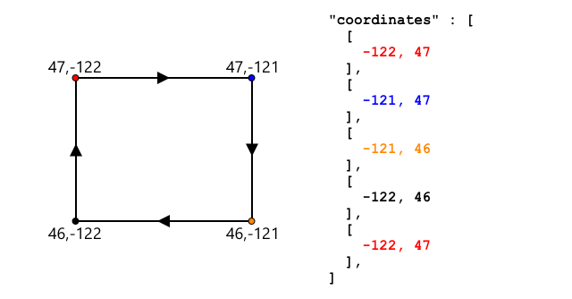

<!--
CO_OP_TRANSLATOR_METADATA:
{
  "original_hash": "078ae664c7b686bf069545e9a5fc95b2",
  "translation_date": "2025-08-25T22:52:40+00:00",
  "source_file": "3-transport/lessons/4-geofences/README.md",
  "language_code": "pt"
}
-->
# Geofences


> Ilustração por [Nitya Narasimhan](https://github.com/nitya). Clique na imagem para uma versão maior.

Este vídeo oferece uma visão geral sobre geofences e como utilizá-las no Azure Maps, tópicos que serão abordados nesta lição:

[](https://www.youtube.com/watch?v=nsrgYhaYNVY)

> 🎥 Clique na imagem acima para assistir ao vídeo

## Questionário pré-aula

[Questionário pré-aula](https://black-meadow-040d15503.1.azurestaticapps.net/quiz/27)

## Introdução

Nas últimas 3 lições, utilizou IoT para localizar os camiões que transportam os seus produtos da quinta para um centro de processamento. Capturou dados GPS, enviou-os para a cloud para armazenamento e visualizou-os num mapa. O próximo passo para aumentar a eficiência da sua cadeia de abastecimento é receber um alerta quando um camião estiver prestes a chegar ao centro de processamento, para que a equipa necessária para descarregar esteja pronta com empilhadoras e outros equipamentos assim que o veículo chegar. Desta forma, podem descarregar rapidamente e evitar custos adicionais com o camião e o motorista à espera.

Nesta lição, aprenderá sobre geofences - regiões geoespaciais definidas, como uma área dentro de um raio de 2 km de um centro de processamento, e como testar se coordenadas GPS estão dentro ou fora de uma geofence, para verificar se o sensor GPS chegou ou saiu de uma área.

Nesta lição, abordaremos:

* [O que são geofences](../../../../../3-transport/lessons/4-geofences)
* [Definir uma geofence](../../../../../3-transport/lessons/4-geofences)
* [Testar pontos contra uma geofence](../../../../../3-transport/lessons/4-geofences)
* [Usar geofences em código serverless](../../../../../3-transport/lessons/4-geofences)

> 🗑 Esta é a última lição deste projeto, por isso, após concluir esta lição e o exercício, não se esqueça de limpar os seus serviços na cloud. Precisará dos serviços para completar o exercício, então certifique-se de o concluir primeiro.
>
> Consulte [o guia para limpar o seu projeto](../../../clean-up.md) se necessário para obter instruções sobre como fazer isso.

## O que são Geofences

Uma geofence é um perímetro virtual para uma região geográfica do mundo real. Geofences podem ser círculos definidos como um ponto e um raio (por exemplo, um círculo de 100m de diâmetro em torno de um edifício) ou um polígono cobrindo uma área, como uma zona escolar, limites de uma cidade ou um campus universitário ou empresarial.


> 💁 Pode ser que já tenha usado geofences sem saber. Se já definiu um lembrete usando a aplicação de lembretes do iOS ou o Google Keep baseado numa localização, já utilizou uma geofence. Estas aplicações configuram uma geofence com base na localização fornecida e alertam-no quando o seu telemóvel entra na geofence.

Existem várias razões para querer saber se um veículo está dentro ou fora de uma geofence:

* Preparação para descarregar - receber uma notificação de que um veículo chegou ao local permite que a equipa esteja preparada para descarregar o veículo, reduzindo o tempo de espera. Isso pode permitir que o motorista faça mais entregas num dia com menos tempo de espera.
* Conformidade fiscal - alguns países, como a Nova Zelândia, cobram impostos rodoviários para veículos a diesel com base no peso do veículo apenas quando circulam em estradas públicas. Usar geofences permite rastrear a quilometragem percorrida em estradas públicas em oposição a estradas privadas, como em quintas ou áreas de exploração florestal.
* Monitorização de roubo - se um veículo deve permanecer apenas numa determinada área, como numa quinta, e sai da geofence, pode ter sido roubado.
* Conformidade de localização - algumas partes de um local de trabalho, quinta ou fábrica podem ser proibidas para certos veículos, como manter veículos que transportam fertilizantes artificiais e pesticidas afastados de campos que cultivam produtos orgânicos. Se uma geofence for violada, o veículo está fora de conformidade e o motorista pode ser notificado.

✅ Consegue pensar em outros usos para geofences?

O Azure Maps, o serviço que utilizou na última lição para visualizar dados GPS, permite definir geofences e testar se um ponto está dentro ou fora da geofence.

## Definir uma geofence

As geofences são definidas usando GeoJSON, o mesmo formato dos pontos adicionados ao mapa na lição anterior. Neste caso, em vez de ser uma `FeatureCollection` de valores `Point`, é uma `FeatureCollection` contendo um `Polygon`.

```json
{
   "type": "FeatureCollection",
   "features": [
     {
       "type": "Feature",
       "geometry": {
         "type": "Polygon",
         "coordinates": [
           [
             [
               -122.13393688201903,
               47.63829579223815
             ],
             [
               -122.13389128446579,
               47.63782047131512
             ],
             [
               -122.13240802288054,
               47.63783312249837
             ],
             [
               -122.13238388299942,
               47.63829037035086
             ],
             [
               -122.13393688201903,
               47.63829579223815
             ]
           ]
         ]
       },
       "properties": {
         "geometryId": "1"
       }
     }
   ]
}
```

Cada ponto no polígono é definido como um par de longitude e latitude num array, e esses pontos estão num array definido como `coordinates`. No caso de um `Point` na lição anterior, o `coordinates` era um array contendo 2 valores, latitude e longitude. Para um `Polygon`, é um array de arrays contendo 2 valores, longitude e latitude.

> 💁 Lembre-se, o GeoJSON usa `longitude, latitude` para pontos, e não `latitude, longitude`.

O array de coordenadas do polígono sempre tem 1 entrada a mais do que o número de pontos no polígono, sendo a última entrada igual à primeira, fechando o polígono. Por exemplo, para um retângulo, haveria 5 pontos.



Na imagem acima, há um retângulo. As coordenadas do polígono começam no canto superior esquerdo em 47,-122, depois movem-se para a direita até 47,-121, depois para baixo até 46,-121, depois para a esquerda até 46,-122, e finalmente de volta ao ponto inicial em 47,-122. Isso dá ao polígono 5 pontos - canto superior esquerdo, canto superior direito, canto inferior direito, canto inferior esquerdo e, por fim, o canto superior esquerdo para fechá-lo.

✅ Experimente criar um polígono GeoJSON em torno da sua casa ou escola. Use uma ferramenta como [GeoJSON.io](https://geojson.io/).

### Tarefa - definir uma geofence

Para usar uma geofence no Azure Maps, primeiro ela precisa ser carregada na sua conta do Azure Maps. Após o carregamento, receberá um ID único que poderá usar para testar um ponto contra a geofence. Para carregar geofences no Azure Maps, é necessário usar a API web do Azure Maps. Pode chamar a API web do Azure Maps usando uma ferramenta chamada [curl](https://curl.se).

> 🎓 Curl é uma ferramenta de linha de comando para fazer pedidos a endpoints web.

1. Se estiver a usar Linux, macOS ou uma versão recente do Windows 10, provavelmente já tem o curl instalado. Execute o seguinte no seu terminal ou linha de comando para verificar:

    ```sh
    curl --version
    ```

    Se não vir informações de versão para o curl, precisará instalá-lo a partir da [página de downloads do curl](https://curl.se/download.html).

    > 💁 Se tiver experiência com o Postman, pode usá-lo em vez disso, se preferir.

1. Crie um ficheiro GeoJSON contendo um polígono. Testará este ficheiro usando o seu sensor GPS, então crie um polígono em torno da sua localização atual. Pode criá-lo manualmente editando o exemplo de GeoJSON fornecido acima ou usar uma ferramenta como [GeoJSON.io](https://geojson.io/).

    O GeoJSON precisará conter uma `FeatureCollection`, contendo uma `Feature` com uma `geometry` do tipo `Polygon`.

    Também **DEVE** adicionar um elemento `properties` no mesmo nível do elemento `geometry`, e este deve conter um `geometryId`:

    ```json
    "properties": {
        "geometryId": "1"
    }
    ```

    Se usar o [GeoJSON.io](https://geojson.io/), terá de adicionar manualmente este item ao elemento `properties` vazio, seja após descarregar o ficheiro JSON ou no editor JSON da aplicação.

    Este `geometryId` deve ser único neste ficheiro. Pode carregar várias geofences como múltiplas `Features` na `FeatureCollection` no mesmo ficheiro GeoJSON, desde que cada uma tenha um `geometryId` diferente. Polígonos podem ter o mesmo `geometryId` se forem carregados a partir de um ficheiro diferente em momentos diferentes.

1. Guarde este ficheiro como `geofence.json` e navegue até onde ele está guardado no seu terminal ou consola.

1. Execute o seguinte comando curl para criar a GeoFence:

    ```sh
    curl --request POST 'https://atlas.microsoft.com/mapData/upload?api-version=1.0&dataFormat=geojson&subscription-key=<subscription_key>' \
         --header 'Content-Type: application/json' \
         --include \
         --data @geofence.json
    ```

    Substitua `<subscription_key>` na URL pela chave da API da sua conta do Azure Maps.

    A URL é usada para carregar dados do mapa através da API `https://atlas.microsoft.com/mapData/upload`. A chamada inclui um parâmetro `api-version` para especificar qual API do Azure Maps usar, permitindo que a API mude ao longo do tempo, mas mantendo a compatibilidade retroativa. O formato dos dados carregados é definido como `geojson`.

    Isso executará o pedido POST para a API de upload e retornará uma lista de cabeçalhos de resposta que inclui um cabeçalho chamado `location`.

    ```output
    content-type: application/json
    location: https://us.atlas.microsoft.com/mapData/operations/1560ced6-3a80-46f2-84b2-5b1531820eab?api-version=1.0
    x-ms-azuremaps-region: West US 2
    x-content-type-options: nosniff
    strict-transport-security: max-age=31536000; includeSubDomains
    x-cache: CONFIG_NOCACHE
    date: Sat, 22 May 2021 21:34:57 GMT
    content-length: 0
    ```

    > 🎓 Ao chamar um endpoint web, pode passar parâmetros para a chamada adicionando um `?` seguido de pares chave-valor como `chave=valor`, separando os pares chave-valor com um `&`.

1. O Azure Maps não processa isso imediatamente, então precisará verificar se o pedido de upload foi concluído usando a URL fornecida no cabeçalho `location`. Faça um pedido GET para esta localização para verificar o estado. Precisará adicionar a sua chave de subscrição ao final da URL `location`, adicionando `&subscription-key=<subscription_key>` ao final, substituindo `<subscription_key>` pela chave da API da sua conta do Azure Maps. Execute o seguinte comando:

    ```sh
    curl --request GET '<location>&subscription-key=<subscription_key>'
    ```

    Substitua `<location>` pelo valor do cabeçalho `location` e `<subscription_key>` pela chave da API da sua conta do Azure Maps.

1. Verifique o valor de `status` na resposta. Se não for `Succeeded`, espere um minuto e tente novamente.

1. Quando o estado retornar como `Succeeded`, veja o `resourceLocation` na resposta. Este contém detalhes sobre o ID único (conhecido como UDID) para o objeto GeoJSON. O UDID é o valor após `metadata/`, sem incluir o `api-version`. Por exemplo, se o `resourceLocation` fosse:

    ```json
    {
      "resourceLocation": "https://us.atlas.microsoft.com/mapData/metadata/7c3776eb-da87-4c52-ae83-caadf980323a?api-version=1.0"
    }
    ```

    Então o UDID seria `7c3776eb-da87-4c52-ae83-caadf980323a`.

    Guarde uma cópia deste UDID, pois precisará dele para testar a geofence.

## Testar pontos contra uma geofence

Depois de carregar o polígono no Azure Maps, pode testar um ponto para verificar se está dentro ou fora da geofence. Faz isso ao realizar um pedido à API web, passando o UDID da geofence e a latitude e longitude do ponto a ser testado.

Quando faz este pedido, também pode passar um valor chamado `searchBuffer`. Este valor indica à API do Maps o nível de precisão ao retornar os resultados. Isto é necessário porque o GPS não é perfeitamente preciso e, às vezes, as localizações podem estar deslocadas por metros ou mais. O padrão para o search buffer é 50m, mas pode definir valores de 0m a 500m.

Quando os resultados são retornados da chamada à API, uma das partes do resultado é a `distance`, medida até o ponto mais próximo na borda da geofence, com um valor positivo se o ponto estiver fora da geofence e negativo se estiver dentro. Se esta distância for menor que o search buffer, a distância real é retornada em metros; caso contrário, o valor será 999 ou -999. 999 significa que o ponto está fora da geofence por mais do que o search buffer, -999 significa que está dentro da geofence por mais do que o search buffer.


Na imagem acima, a geofence tem um search buffer de 50m.

* Um ponto no centro da geofence, bem dentro do search buffer, tem uma distância de **-999**.
* Um ponto bem fora do search buffer tem uma distância de **999**.
* Um ponto dentro da geofence e dentro do search buffer, a 6m da geofence, tem uma distância de **6m**.
* Um ponto fora da geofence e dentro do search buffer, a 39m da geofence, tem uma distância de **39m**.

É importante conhecer a distância até a borda da geofence e combinar esta informação com outros dados, como outras leituras GPS, velocidade e dados de estradas, ao tomar decisões baseadas na localização de um veículo.

Por exemplo, imagine leituras GPS mostrando que um veículo estava a conduzir numa estrada que passa ao lado de uma geofence. Se um único valor GPS for impreciso e colocar o veículo dentro da geofence, apesar de não haver acesso veicular, então este valor pode ser ignorado.


Na imagem acima, há uma geofence sobre parte do campus da Microsoft. A linha vermelha mostra um camião a conduzir ao longo da 520, com círculos a indicar as leituras de GPS. A maioria destas leituras são precisas e estão ao longo da 520, com uma leitura imprecisa dentro da geofence. Não há como essa leitura ser correta - não existem estradas para o camião desviar-se subitamente da 520 para o campus e depois voltar para a 520. O código que verifica esta geofence precisará de considerar as leituras anteriores antes de agir com base nos resultados do teste da geofence.

✅ Que dados adicionais seriam necessários para verificar se uma leitura de GPS pode ser considerada correta?

### Tarefa - testar pontos contra uma geofence

1. Comece por construir o URL para a consulta da API web. O formato é:

    ```output
    https://atlas.microsoft.com/spatial/geofence/json?api-version=1.0&deviceId=gps-sensor&subscription-key=<subscription-key>&udid=<UDID>&lat=<lat>&lon=<lon>
    ```

    Substitua `<subscription_key>` pela chave da API da sua conta do Azure Maps.

    Substitua `<UDID>` pelo UDID da geofence da tarefa anterior.

    Substitua `<lat>` e `<lon>` pela latitude e longitude que deseja testar.

    Este URL utiliza a API `https://atlas.microsoft.com/spatial/geofence/json` para consultar uma geofence definida usando GeoJSON. Ele direciona para a versão da API `1.0`. O parâmetro `deviceId` é obrigatório e deve ser o nome do dispositivo de onde vêm a latitude e longitude.

    O buffer de pesquisa padrão é de 50m, e pode alterá-lo passando um parâmetro adicional `searchBuffer=<distance>`, definindo `<distance>` como a distância do buffer de pesquisa em metros, de 0 a 500.

1. Use o curl para fazer uma solicitação GET para este URL:

    ```sh
    curl --request GET '<URL>'
    ```

    > 💁 Se receber um código de resposta `BadRequest`, com um erro de:
    >
    > ```output
    > Invalid GeoJSON: All feature properties should contain a geometryId, which is used for identifying the geofence.
    > ```
    >
    > então o seu GeoJSON está a faltar a secção `properties` com o `geometryId`. Será necessário corrigir o seu GeoJSON, depois repetir os passos acima para reenvia-lo e obter um novo UDID.

1. A resposta conterá uma lista de `geometries`, uma para cada polígono definido no GeoJSON usado para criar a geofence. Cada geometria tem 3 campos de interesse: `distance`, `nearestLat` e `nearestLon`.

    ```output
    {
        "geometries": [
            {
                "deviceId": "gps-sensor",
                "udId": "7c3776eb-da87-4c52-ae83-caadf980323a",
                "geometryId": "1",
                "distance": 999.0,
                "nearestLat": 47.645875,
                "nearestLon": -122.142713
            }
        ],
        "expiredGeofenceGeometryId": [],
        "invalidPeriodGeofenceGeometryId": []
    }
    ```

    * `nearestLat` e `nearestLon` são a latitude e longitude de um ponto na borda da geofence mais próximo da localização testada.

    * `distance` é a distância da localização testada ao ponto mais próximo na borda da geofence. Números negativos significam dentro da geofence, positivos fora. Este valor será inferior a 50 (o buffer de pesquisa padrão) ou 999.

1. Repita este processo várias vezes com localizações dentro e fora da geofence.

## Usar geofences a partir de código serverless

Agora pode adicionar um novo trigger à sua aplicação Functions para testar os dados de eventos GPS do IoT Hub contra a geofence.

### Grupos de consumidores

Como se lembrará de lições anteriores, o IoT Hub permite reproduzir eventos que foram recebidos pelo hub mas não processados. Mas o que aconteceria se múltiplos triggers estivessem conectados? Como saberá qual processou quais eventos?

A resposta é que não consegue! Em vez disso, pode definir múltiplas conexões separadas para ler eventos, e cada uma pode gerir a reprodução de mensagens não lidas. Estes são chamados de *grupos de consumidores*. Quando se conecta ao endpoint, pode especificar qual grupo de consumidores deseja usar. Cada componente da sua aplicação conectará a um grupo de consumidores diferente.


Em teoria, até 5 aplicações podem conectar-se a cada grupo de consumidores, e todas receberão mensagens quando estas chegarem. É uma boa prática ter apenas uma aplicação a aceder a cada grupo de consumidores para evitar processamento duplicado de mensagens e garantir que, ao reiniciar, todas as mensagens em fila sejam processadas corretamente. Por exemplo, se lançar a sua aplicação Functions localmente, bem como executá-la na cloud, ambas processariam mensagens, levando a blobs duplicados armazenados na conta de armazenamento.

Se revisar o ficheiro `function.json` para o trigger do IoT Hub que criou numa lição anterior, verá o grupo de consumidores na secção de ligação do trigger do Event Hub:

```json
"consumerGroup": "$Default"
```

Quando cria um IoT Hub, o grupo de consumidores `$Default` é criado por padrão. Se quiser adicionar um trigger adicional, pode fazê-lo usando um novo grupo de consumidores.

> 💁 Nesta lição, usará uma função diferente para testar a geofence daquela usada para armazenar os dados de GPS. Isto serve para mostrar como usar grupos de consumidores e separar o código para torná-lo mais fácil de ler e entender. Numa aplicação de produção, existem muitas formas de arquitetar isto - colocando ambos numa função, usando um trigger na conta de armazenamento para executar uma função para verificar a geofence, ou usando múltiplas funções. Não há uma 'maneira certa', depende do resto da sua aplicação e das suas necessidades.

### Tarefa - criar um novo grupo de consumidores

1. Execute o seguinte comando para criar um novo grupo de consumidores chamado `geofence` para o seu IoT Hub:

    ```sh
    az iot hub consumer-group create --name geofence \
                                     --hub-name <hub_name>
    ```

    Substitua `<hub_name>` pelo nome que usou para o seu IoT Hub.

1. Se quiser ver todos os grupos de consumidores de um IoT Hub, execute o seguinte comando:

    ```sh
    az iot hub consumer-group list --output table \
                                   --hub-name <hub_name>
    ```

    Substitua `<hub_name>` pelo nome que usou para o seu IoT Hub. Isto listará todos os grupos de consumidores.

    ```output
    Name      ResourceGroup
    --------  ---------------
    $Default  gps-sensor
    geofence  gps-sensor
    ```

> 💁 Quando executou o monitor de eventos do IoT Hub numa lição anterior, ele conectou-se ao grupo de consumidores `$Default`. Foi por isso que não conseguiu executar o monitor de eventos e um trigger de eventos ao mesmo tempo. Se quiser executar ambos, pode usar outros grupos de consumidores para todas as suas aplicações Functions e manter `$Default` para o monitor de eventos.

### Tarefa - criar um novo trigger do IoT Hub

1. Adicione um novo trigger de evento do IoT Hub à sua aplicação `gps-trigger` que criou numa lição anterior. Chame esta função de `geofence-trigger`.

    > ⚠️ Pode consultar [as instruções para criar um trigger de evento do IoT Hub no projeto 2, lição 5, se necessário](../../../2-farm/lessons/5-migrate-application-to-the-cloud/README.md#create-an-iot-hub-event-trigger).

1. Configure a string de conexão do IoT Hub no ficheiro `function.json`. O ficheiro `local.settings.json` é partilhado entre todos os triggers na aplicação Functions.

1. Atualize o valor de `consumerGroup` no ficheiro `function.json` para referenciar o novo grupo de consumidores `geofence`:

    ```json
    "consumerGroup": "geofence"
    ```

1. Precisará de usar a chave de subscrição da sua conta do Azure Maps neste trigger, então adicione uma nova entrada ao ficheiro `local.settings.json` chamada `MAPS_KEY`.

1. Execute a aplicação Functions para garantir que está a conectar e processar mensagens. O `iot-hub-trigger` da lição anterior também será executado e carregará blobs para o armazenamento.

    > Para evitar leituras duplicadas de GPS no armazenamento de blobs, pode parar a aplicação Functions que tem a correr na cloud. Para fazer isso, use o seguinte comando:
    >
    > ```sh
    > az functionapp stop --resource-group gps-sensor \
    >                     --name <functions_app_name>
    > ```
    >
    > Substitua `<functions_app_name>` pelo nome que usou para a sua aplicação Functions.
    >
    > Pode reiniciá-la mais tarde com o seguinte comando:
    >
    > ```sh
    > az functionapp start --resource-group gps-sensor \
    >                     --name <functions_app_name>
    > ```
    >
    > Substitua `<functions_app_name>` pelo nome que usou para a sua aplicação Functions.

### Tarefa - testar a geofence a partir do trigger

Anteriormente nesta lição, usou o curl para consultar uma geofence e verificar se um ponto estava dentro ou fora. Pode fazer uma solicitação web semelhante dentro do seu trigger.

1. Para consultar a geofence, precisa do seu UDID. Adicione uma nova entrada ao ficheiro `local.settings.json` chamada `GEOFENCE_UDID` com este valor.

1. Abra o ficheiro `__init__.py` do novo trigger `geofence-trigger`.

1. Adicione a seguinte importação ao topo do ficheiro:

    ```python
    import json
    import os
    import requests
    ```

    O pacote `requests` permite fazer chamadas à API web. O Azure Maps não tem um SDK para Python, por isso precisa de fazer chamadas à API web para usá-lo no código Python.

1. Adicione as seguintes 2 linhas ao início do método `main` para obter a chave de subscrição do Maps:

    ```python
    maps_key = os.environ['MAPS_KEY']
    geofence_udid = os.environ['GEOFENCE_UDID']    
    ```

1. Dentro do loop `for event in events`, adicione o seguinte para obter a latitude e longitude de cada evento:

    ```python
    event_body = json.loads(event.get_body().decode('utf-8'))
    lat = event_body['gps']['lat']
    lon = event_body['gps']['lon']
    ```

    Este código converte o JSON do corpo do evento num dicionário e extrai o `lat` e `lon` do campo `gps`.

1. Ao usar `requests`, em vez de construir um URL longo como fez com o curl, pode usar apenas a parte do URL e passar os parâmetros como um dicionário. Adicione o seguinte código para definir o URL a chamar e configurar os parâmetros:

    ```python
    url = 'https://atlas.microsoft.com/spatial/geofence/json'

    params = {
        'api-version': 1.0,
        'deviceId': 'gps-sensor',
        'subscription-key': maps_key,
        'udid' : geofence_udid,
        'lat' : lat,
        'lon' : lon
    }
    ```

    Os itens no dicionário `params` corresponderão aos pares chave-valor que usou ao chamar a API web via curl.

1. Adicione as seguintes linhas de código para chamar a API web:

    ```python
    response = requests.get(url, params=params)
    response_body = json.loads(response.text)
    ```

    Isto chama o URL com os parâmetros e obtém um objeto de resposta.

1. Adicione o seguinte código abaixo disto:

    ```python
    distance = response_body['geometries'][0]['distance']

    if distance == 999:
        logging.info('Point is outside geofence')
    elif distance > 0:
        logging.info(f'Point is just outside geofence by a distance of {distance}m')
    elif distance == -999:
        logging.info(f'Point is inside geofence')
    else:
        logging.info(f'Point is just inside geofence by a distance of {distance}m')
    ```

    Este código assume 1 geometria e extrai a distância dessa única geometria. Em seguida, regista mensagens diferentes com base na distância.

1. Execute este código. Verá na saída de registo se as coordenadas GPS estão dentro ou fora da geofence, com uma distância se o ponto estiver dentro de 50m. Experimente este código com diferentes geofences com base na localização do seu sensor GPS, tente mover o sensor (por exemplo, ligado ao WiFi de um telemóvel ou com coordenadas diferentes no dispositivo IoT virtual) para ver esta mudança.

1. Quando estiver pronto, implemente este código na sua aplicação Functions na cloud. Não se esqueça de implementar as novas Configurações de Aplicação.

    > ⚠️ Pode consultar [as instruções para carregar Configurações de Aplicação do projeto 2, lição 5, se necessário](../../../2-farm/lessons/5-migrate-application-to-the-cloud/README.md#task---upload-your-application-settings).

    > ⚠️ Pode consultar [as instruções para implementar a sua aplicação Functions do projeto 2, lição 5, se necessário](../../../2-farm/lessons/5-migrate-application-to-the-cloud/README.md#task---deploy-your-functions-app-to-the-cloud).

> 💁 Pode encontrar este código na pasta [code/functions](../../../../../3-transport/lessons/4-geofences/code/functions).

---

## 🚀 Desafio

Nesta lição, adicionou uma geofence usando um ficheiro GeoJSON com um único polígono. Pode carregar múltiplos polígonos ao mesmo tempo, desde que tenham valores `geometryId` diferentes na secção `properties`.

Tente carregar um ficheiro GeoJSON com múltiplos polígonos e ajuste o seu código para encontrar qual polígono as coordenadas GPS estão mais próximas ou dentro.

## Questionário pós-aula

[Questionário pós-aula](https://black-meadow-040d15503.1.azurestaticapps.net/quiz/28)

## Revisão e Autoestudo

* Leia mais sobre geofences e alguns dos seus casos de uso na [página de Geofencing na Wikipédia](https://en.wikipedia.org/wiki/Geo-fence).
* Leia mais sobre a API de geofencing do Azure Maps na [documentação Microsoft Azure Maps Spatial - Get Geofence](https://docs.microsoft.com/rest/api/maps/spatial/getgeofence?WT.mc_id=academic-17441-jabenn).
* Leia mais sobre grupos de consumidores na [documentação de recursos e terminologia no Azure Event Hubs - Event consumers](https://docs.microsoft.com/azure/event-hubs/event-hubs-features?WT.mc_id=academic-17441-jabenn#event-consumers).

## Tarefa

[Enviar notificações usando Twilio](assignment.md)

**Aviso Legal**:  
Este documento foi traduzido utilizando o serviço de tradução por IA [Co-op Translator](https://github.com/Azure/co-op-translator). Embora nos esforcemos para garantir a precisão, esteja ciente de que traduções automáticas podem conter erros ou imprecisões. O documento original na sua língua nativa deve ser considerado a fonte autoritária. Para informações críticas, recomenda-se a tradução profissional realizada por humanos. Não nos responsabilizamos por quaisquer mal-entendidos ou interpretações incorretas decorrentes do uso desta tradução.