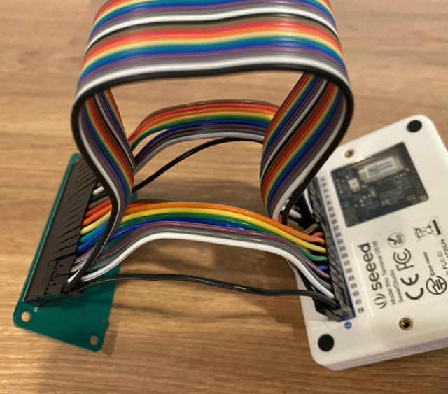

<!--
CO_OP_TRANSLATOR_METADATA:
{
  "original_hash": "93d352de36526b8990e41dd538100324",
  "translation_date": "2025-08-25T22:50:11+00:00",
  "source_file": "6-consumer/lessons/1-speech-recognition/wio-terminal-microphone.md",
  "language_code": "pt"
}
-->
# Configure o seu microfone e altifalantes - Wio Terminal

Nesta parte da lição, irá adicionar altifalantes ao seu Wio Terminal. O Wio Terminal já possui um microfone incorporado, que pode ser utilizado para captar voz.

## Hardware

O Wio Terminal já tem um microfone integrado, que pode ser usado para captar áudio para reconhecimento de voz.

Para adicionar um altifalante, pode usar o [ReSpeaker 2-Mics Pi Hat](https://www.seeedstudio.com/ReSpeaker-2-Mics-Pi-HAT.html). Este é um módulo externo que contém 2 microfones MEMS, bem como um conector para altifalantes e uma entrada para auscultadores.

Será necessário adicionar auscultadores, um altifalante com ficha de 3,5mm ou um altifalante com ligação JST, como o [Mono Enclosed Speaker - 2W 6 Ohm](https://www.seeedstudio.com/Mono-Enclosed-Speaker-2W-6-Ohm-p-2832.html).

Para ligar o ReSpeaker 2-Mics Pi Hat, irá precisar de cabos de ligação de 40 pinos (também conhecidos como macho-macho).

> 💁 Se estiver confortável com soldadura, pode usar o [40 Pin Raspberry Pi Hat Adapter Board For Wio Terminal](https://www.seeedstudio.com/40-Pin-Raspberry-Pi-Hat-Adapter-Board-For-Wio-Terminal-p-4730.html) para conectar o ReSpeaker.

Também irá precisar de um cartão SD para descarregar e reproduzir áudio. O Wio Terminal suporta apenas cartões SD até 16GB de capacidade, e estes devem estar formatados em FAT32 ou exFAT.

### Tarefa - ligar o ReSpeaker Pi Hat

1. Com o Wio Terminal desligado, conecte o ReSpeaker 2-Mics Pi Hat ao Wio Terminal usando os cabos de ligação e os conectores GPIO na parte traseira do Wio Terminal:

    Os pinos devem ser conectados desta forma:

    

1. Posicione o ReSpeaker e o Wio Terminal com os conectores GPIO voltados para cima e do lado esquerdo.

1. Comece pelo conector no canto superior esquerdo do GPIO do ReSpeaker. Ligue um cabo de ligação do conector superior esquerdo do ReSpeaker ao conector superior esquerdo do Wio Terminal.

1. Repita este processo ao longo dos conectores GPIO do lado esquerdo. Certifique-se de que os pinos estão bem encaixados.

    

    

    > 💁 Se os seus cabos de ligação estiverem agrupados em fitas, mantenha-os juntos - isso facilita garantir que todos os cabos estão conectados na ordem correta.

1. Repita o processo usando os conectores GPIO do lado direito do ReSpeaker e do Wio Terminal. Estes cabos devem passar por cima dos cabos já conectados.

    

    

    > 💁 Se os seus cabos de ligação estiverem agrupados em fitas, divida-os em duas fitas. Passe uma fita de cada lado dos cabos já existentes.

    > 💁 Pode usar fita adesiva para segurar os pinos em bloco e evitar que se soltem enquanto os conecta.
    >
    > 

1. Será necessário adicionar um altifalante.

    * Se estiver a usar um altifalante com cabo JST, conecte-o à porta JST no ReSpeaker.

      

    * Se estiver a usar um altifalante com ficha de 3,5mm ou auscultadores, insira-os na entrada de 3,5mm.

      

### Tarefa - configurar o cartão SD

1. Conecte o cartão SD ao seu computador, usando um leitor externo caso não tenha uma entrada para cartões SD.

1. Formate o cartão SD utilizando a ferramenta apropriada no seu computador, certificando-se de que usa o sistema de ficheiros FAT32 ou exFAT.

1. Insira o cartão SD na entrada de cartões SD no lado esquerdo do Wio Terminal, logo abaixo do botão de ligar/desligar. Certifique-se de que o cartão está completamente inserido e faz um clique - pode precisar de uma ferramenta fina ou outro cartão SD para ajudar a empurrá-lo completamente.

    

    > 💁 Para ejetar o cartão SD, precisa de empurrá-lo ligeiramente e ele será ejetado. Será necessário usar uma ferramenta fina, como uma chave de fendas de cabeça plana ou outro cartão SD.

**Aviso Legal**:  
Este documento foi traduzido utilizando o serviço de tradução por IA [Co-op Translator](https://github.com/Azure/co-op-translator). Embora nos esforcemos para garantir a precisão, tenha em atenção que traduções automáticas podem conter erros ou imprecisões. O documento original na sua língua nativa deve ser considerado a fonte autoritária. Para informações críticas, recomenda-se a tradução profissional realizada por humanos. Não nos responsabilizamos por quaisquer mal-entendidos ou interpretações incorretas decorrentes da utilização desta tradução.