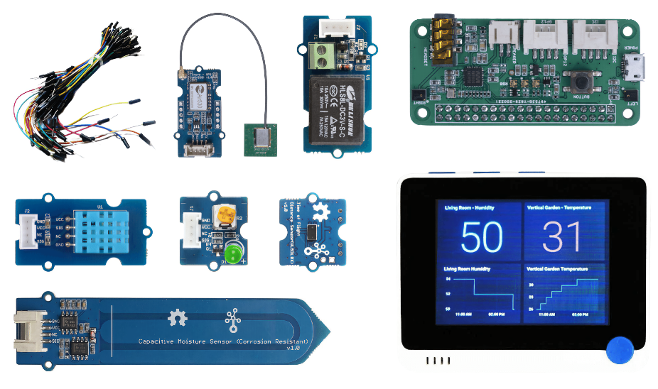

<!--
CO_OP_TRANSLATOR_METADATA:
{
  "original_hash": "3dce18fab38adf93ff30b8c221b1eec5",
  "translation_date": "2025-08-25T20:40:46+00:00",
  "source_file": "hardware.md",
  "language_code": "pt"
}
-->
# Hardware

O **T** em IoT significa **Things** (Coisas) e refere-se a dispositivos que interagem com o mundo à nossa volta. Cada projeto é baseado em hardware real disponível para estudantes e entusiastas. Temos duas opções de hardware IoT para usar, dependendo da preferência pessoal, conhecimento ou preferência de linguagem de programação, objetivos de aprendizagem e disponibilidade. Também fornecemos uma versão de 'hardware virtual' para aqueles que não têm acesso ao hardware ou que desejam aprender mais antes de fazer uma compra.

> 💁 Não é necessário comprar nenhum hardware IoT para concluir os exercícios. Pode fazer tudo utilizando hardware IoT virtual.

As opções de hardware físico são Arduino ou Raspberry Pi. Cada plataforma tem as suas vantagens e desvantagens, que são abordadas numa das lições iniciais. Se ainda não decidiu qual plataforma de hardware usar, pode consultar [a lição dois do primeiro projeto](./1-getting-started/lessons/2-deeper-dive/README.md) para decidir qual a plataforma de hardware que mais lhe interessa aprender.

O hardware específico foi escolhido para reduzir a complexidade das lições e exercícios. Embora outros hardwares possam funcionar, não podemos garantir que todos os exercícios serão suportados no seu dispositivo sem hardware adicional. Por exemplo, muitos dispositivos Arduino não têm WiFi, que é necessário para se conectar à nuvem - o terminal Wio foi escolhido porque já tem WiFi integrado.

Também precisará de alguns itens não técnicos, como terra ou uma planta em vaso, e frutas ou vegetais.

## Comprar os kits

A Seeed Studios gentilmente disponibilizou todo o hardware em kits fáceis de adquirir:

### Arduino - Wio Terminal

**[IoT para principiantes com Seeed e Microsoft - Kit Inicial Wio Terminal](https://www.seeedstudio.com/IoT-for-beginners-with-Seeed-and-Microsoft-Wio-Terminal-Starter-Kit-p-5006.html)**

### Raspberry Pi

**[IoT para principiantes com Seeed e Microsoft - Kit Inicial Raspberry Pi 4](https://www.seeedstudio.com/IoT-for-beginners-with-Seeed-and-Microsoft-Raspberry-Pi-Starter-Kit-p-5004.html)**

## Arduino

Todo o código para dispositivos Arduino está em C++. Para concluir todos os exercícios, precisará do seguinte:

### Hardware Arduino

* [Wio Terminal](https://www.seeedstudio.com/Wio-Terminal-p-4509.html)
* *Opcional* - Cabo USB-C ou adaptador USB-A para USB-C. O terminal Wio tem uma porta USB-C e vem com um cabo USB-C para USB-A. Se o seu PC ou Mac tiver apenas portas USB-C, precisará de um cabo USB-C ou de um adaptador USB-A para USB-C.

### Sensores e atuadores específicos do Arduino

Estes são específicos para o dispositivo Arduino Wio Terminal e não são relevantes para o uso do Raspberry Pi.

* [ArduCam Mini 2MP Plus - OV2640](https://www.arducam.com/product/arducam-2mp-spi-camera-b0067-arduino/)
* [ReSpeaker 2-Mics Pi HAT](https://www.seeedstudio.com/ReSpeaker-2-Mics-Pi-HAT.html)
* [Cabos jumper para breadboard](https://www.seeedstudio.com/Breadboard-Jumper-Wire-Pack-241mm-200mm-160mm-117m-p-234.html)
* Auscultadores ou outra coluna com uma entrada de 3,5 mm, ou uma coluna JST, como:
  * [Coluna Mono Enclosed - 2W 6 Ohm](https://www.seeedstudio.com/Mono-Enclosed-Speaker-2W-6-Ohm-p-2832.html)
* Cartão microSD de 16GB ou menos, juntamente com um conector para usar o cartão SD no seu computador, caso não tenha um integrado. **NOTA** - o terminal Wio suporta apenas cartões SD até 16GB, não suporta capacidades superiores.

## Raspberry Pi

Todo o código para dispositivos Raspberry Pi está em Python. Para concluir todos os exercícios, precisará do seguinte:

### Hardware Raspberry Pi

* [Raspberry Pi](https://www.raspberrypi.org/products/raspberry-pi-4-model-b/)
  > 💁 Versões a partir do Pi 2B devem funcionar com os exercícios destas lições. Se planeia executar o VS Code diretamente no Pi, então um Pi 4 com 2GB ou mais de RAM é necessário. Se vai aceder ao Pi remotamente, qualquer Pi 2B ou superior funcionará.
* Cartão microSD (Pode adquirir kits Raspberry Pi que já incluem um cartão microSD), juntamente com um conector para usar o cartão SD no seu computador, caso não tenha um integrado.
* Fonte de alimentação USB (Pode adquirir kits Raspberry Pi 4 que já incluem uma fonte de alimentação). Se estiver a usar um Raspberry Pi 4, precisará de uma fonte de alimentação USB-C; dispositivos anteriores precisam de uma fonte de alimentação micro-USB.

### Sensores e atuadores específicos do Raspberry Pi

Estes são específicos para o uso do Raspberry Pi e não são relevantes para o dispositivo Arduino.

* [Grove Pi base hat](https://www.seeedstudio.com/Grove-Base-Hat-for-Raspberry-Pi.html)
* [Módulo de câmara Raspberry Pi](https://www.raspberrypi.org/products/camera-module-v2/)
* Microfone e coluna:

  Use uma das seguintes opções (ou equivalente):
  * Qualquer microfone USB com qualquer coluna USB, ou coluna com cabo jack de 3,5 mm, ou saída de áudio HDMI se o seu Raspberry Pi estiver ligado a um monitor ou TV com colunas
  * Qualquer headset USB com microfone integrado
  * [ReSpeaker 2-Mics Pi HAT](https://www.seeedstudio.com/ReSpeaker-2-Mics-Pi-HAT.html) com
    * Auscultadores ou outra coluna com uma entrada de 3,5 mm, ou uma coluna JST, como:
    * [Coluna Mono Enclosed - 2W 6 Ohm](https://www.seeedstudio.com/Mono-Enclosed-Speaker-2W-6-Ohm-p-2832.html)
  * [Speakerphone USB](https://www.amazon.com/USB-Speakerphone-Conference-Business-Microphones/dp/B07Q3D7F8S/ref=sr_1_1?dchild=1&keywords=m0&qid=1614647389&sr=8-1)
* [Sensor de luz Grove](https://www.seeedstudio.com/Grove-Light-Sensor-v1-2-LS06-S-phototransistor.html)
* [Botão Grove](https://www.seeedstudio.com/Grove-Button.html)

## Sensores e atuadores

A maioria dos sensores e atuadores necessários são usados tanto nos percursos de aprendizagem do Arduino como do Raspberry Pi:

* [LED Grove](https://www.seeedstudio.com/Grove-LED-Pack-p-4364.html) x 2
* [Sensor de humidade e temperatura Grove](https://www.seeedstudio.com/Grove-Temperature-Humidity-Sensor-DHT11.html)
* [Sensor de humidade do solo capacitivo Grove](https://www.seeedstudio.com/Grove-Capacitive-Moisture-Sensor-Corrosion-Resistant.html)
* [Relé Grove](https://www.seeedstudio.com/Grove-Relay.html)
* [GPS Grove (Air530)](https://www.seeedstudio.com/Grove-GPS-Air530-p-4584.html)
* [Sensor de distância Time of Flight Grove](https://www.seeedstudio.com/Grove-Time-of-Flight-Distance-Sensor-VL53L0X.html)

## Hardware opcional

As lições sobre rega automatizada funcionam utilizando um relé. Como opção, pode ligar este relé a uma bomba de água alimentada por USB utilizando o hardware listado abaixo.

* [Bomba de água 6V](https://www.seeedstudio.com/6V-Mini-Water-Pump-p-1945.html)
* [Terminal USB](https://www.adafruit.com/product/3628)
* Tubos de silicone
* Fios vermelho e preto
* Pequena chave de fendas de cabeça plana

## Hardware virtual

A opção de hardware virtual fornecerá simuladores para os sensores e atuadores, implementados em Python. Dependendo da disponibilidade do seu hardware, pode executar isto no seu dispositivo de desenvolvimento normal, como um Mac, PC, ou executá-lo num Raspberry Pi e simular apenas o hardware que não possui. Por exemplo, se tiver a câmara Raspberry Pi mas não os sensores Grove, poderá executar o código do dispositivo virtual no seu Pi e simular os sensores Grove, mas usar uma câmara física.

O hardware virtual usará o [projeto CounterFit](https://github.com/CounterFit-IoT/CounterFit).

Para concluir estas lições, precisará de uma webcam, microfone e saída de áudio, como colunas ou auscultadores. Estes podem ser integrados ou externos e precisam de estar configurados para funcionar com o seu sistema operativo e disponíveis para uso em todas as aplicações.

**Aviso Legal**:  
Este documento foi traduzido utilizando o serviço de tradução por IA [Co-op Translator](https://github.com/Azure/co-op-translator). Embora nos esforcemos para garantir a precisão, é importante notar que traduções automáticas podem conter erros ou imprecisões. O documento original na sua língua nativa deve ser considerado a fonte autoritária. Para informações críticas, recomenda-se a tradução profissional realizada por humanos. Não nos responsabilizamos por quaisquer mal-entendidos ou interpretações incorretas decorrentes do uso desta tradução.