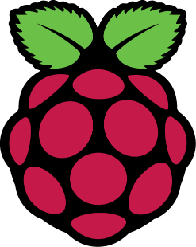

<!--
CO_OP_TRANSLATOR_METADATA:
{
  "original_hash": "9dd7f645ad1c6f20b72fee512987f772",
  "translation_date": "2025-08-28T09:59:55+00:00",
  "source_file": "1-getting-started/lessons/2-deeper-dive/README.md",
  "language_code": "ro"
}
-->
# O privire mai profundă asupra IoT

> Prezentare grafică realizată de [Nitya Narasimhan](https://github.com/nitya). Click pe imagine pentru o versiune mai mare.

Această lecție a fost predată ca parte a [seriei Hello IoT](https://youtube.com/playlist?list=PLmsFUfdnGr3xRts0TIwyaHyQuHaNQcb6-) de la [Microsoft Reactor](https://developer.microsoft.com/reactor/?WT.mc_id=academic-17441-jabenn). Lecția a fost predată în două videoclipuri - o lecție de o oră și o sesiune de o oră pentru aprofundarea unor părți ale lecției și răspunsuri la întrebări.

> 🎥 Click pe imaginile de mai sus pentru a viziona videoclipurile

## Chestionar înainte de lecție

[Chestionar înainte de lecție](https://black-meadow-040d15503.1.azurestaticapps.net/quiz/3)

## Introducere

Această lecție aprofundează unele dintre conceptele acoperite în lecția anterioară.

În această lecție vom acoperi:

* [Componentele unei aplicații IoT](../../../../../1-getting-started/lessons/2-deeper-dive)
* [Aprofundare în microcontrolere](../../../../../1-getting-started/lessons/2-deeper-dive)
* [Aprofundare în computerele cu o singură placă](../../../../../1-getting-started/lessons/2-deeper-dive)

## Componentele unei aplicații IoT

Cele două componente ale unei aplicații IoT sunt *Internetul* și *dispozitivul*. Să analizăm aceste două componente în detaliu.

### Dispozitivul

Partea **Dispozitiv** din IoT se referă la un aparat care poate interacționa cu lumea fizică. Aceste dispozitive sunt de obicei computere mici, cu preț redus, care funcționează la viteze reduse și consumă puțină energie - de exemplu, microcontrolere simple cu kilobytes de RAM (spre deosebire de gigabytes într-un PC) care funcționează la doar câteva sute de megahertz (spre deosebire de gigahertz într-un PC), dar consumă uneori atât de puțină energie încât pot funcționa săptămâni, luni sau chiar ani pe baterii.

Aceste dispozitive interacționează cu lumea fizică, fie prin utilizarea senzorilor pentru a colecta date din mediul înconjurător, fie prin controlarea ieșirilor sau actuatoarelor pentru a face modificări fizice. Exemplul tipic este un termostat inteligent - un dispozitiv care are un senzor de temperatură, un mijloc de setare a unei temperaturi dorite, cum ar fi un cadran sau un ecran tactil, și o conexiune la un sistem de încălzire sau răcire care poate fi activat atunci când temperatura detectată este în afara intervalului dorit. Senzorul de temperatură detectează că încăperea este prea rece, iar un actuator pornește încălzirea.

Există o gamă largă de lucruri care pot acționa ca dispozitive IoT, de la hardware dedicat care detectează un singur lucru, la dispozitive de uz general, chiar și smartphone-ul tău! Un smartphone poate folosi senzori pentru a detecta lumea din jurul său și actuatoare pentru a interacționa cu lumea - de exemplu, utilizând un senzor GPS pentru a detecta locația ta și un difuzor pentru a-ți oferi instrucțiuni de navigare către o destinație.

✅ Gândește-te la alte sisteme pe care le ai în jurul tău care citesc date de la un senzor și le folosesc pentru a lua decizii. Un exemplu ar fi termostatul unui cuptor. Poți găsi mai multe?

### Internetul

Partea **Internet** a unei aplicații IoT constă în aplicații la care dispozitivul IoT se poate conecta pentru a trimite și primi date, precum și alte aplicații care pot procesa datele de la dispozitivul IoT și pot ajuta la luarea deciziilor privind cererile de trimis către actuatoarele dispozitivului IoT.

Un scenariu tipic ar fi utilizarea unui serviciu cloud la care dispozitivul IoT se conectează, iar acest serviciu cloud gestionează lucruri precum securitatea, primirea mesajelor de la dispozitivul IoT și trimiterea mesajelor înapoi către dispozitiv. Acest serviciu cloud se conectează apoi la alte aplicații care pot procesa sau stoca datele senzorului sau pot folosi datele senzorului împreună cu datele din alte sisteme pentru a lua decizii.

Dispozitivele nu se conectează întotdeauna direct la Internet prin WiFi sau conexiuni cablate. Unele dispozitive folosesc rețele mesh pentru a comunica între ele prin tehnologii precum Bluetooth, conectându-se printr-un dispozitiv hub care are o conexiune la Internet.

În exemplul unui termostat inteligent, termostatul s-ar conecta folosind WiFi-ul de acasă la un serviciu cloud. Acesta ar trimite datele de temperatură către acest serviciu cloud, iar de acolo ar fi scrise într-o bază de date, permițând proprietarului să verifice temperaturile curente și anterioare folosind o aplicație de telefon. Un alt serviciu din cloud ar ști ce temperatură dorește proprietarul și ar trimite mesaje înapoi către dispozitivul IoT prin serviciul cloud pentru a spune sistemului de încălzire să se pornească sau să se oprească.

O versiune și mai inteligentă ar putea folosi AI în cloud cu date de la alți senzori conectați la alte dispozitive IoT, cum ar fi senzori de ocupare care detectează ce camere sunt utilizate, precum și date precum vremea și chiar calendarul tău, pentru a lua decizii privind setarea temperaturii într-un mod inteligent. De exemplu, ar putea opri încălzirea dacă citește din calendarul tău că ești în vacanță sau ar putea opri încălzirea pe baza utilizării camerelor, învățând din date pentru a fi din ce în ce mai precis în timp.

✅ Ce alte date ar putea ajuta un termostat conectat la Internet să fie mai inteligent?

### IoT la margine (Edge)

Deși litera I din IoT reprezintă Internet, aceste dispozitive nu trebuie să se conecteze la Internet. În unele cazuri, dispozitivele se pot conecta la dispozitive 'edge' - dispozitive gateway care funcționează pe rețeaua ta locală, ceea ce înseamnă că poți procesa datele fără a face o conexiune la Internet. Acest lucru poate fi mai rapid atunci când ai o cantitate mare de date sau o conexiune lentă la Internet, îți permite să funcționezi offline acolo unde conectivitatea la Internet nu este posibilă, cum ar fi pe un vas sau într-o zonă de dezastru în timpul unui răspuns umanitar, și îți permite să păstrezi datele private. Unele dispozitive vor conține cod de procesare creat folosind instrumente cloud și vor rula acest cod local pentru a colecta și răspunde la date fără a utiliza o conexiune la Internet pentru a lua o decizie.

Un exemplu este un dispozitiv inteligent pentru acasă, cum ar fi Apple HomePod, Amazon Alexa sau Google Home, care va asculta vocea ta folosind modele AI antrenate în cloud, dar care rulează local pe dispozitiv. Aceste dispozitive se vor 'activa' atunci când este rostit un anumit cuvânt sau frază și doar atunci vor trimite discursul tău prin Internet pentru procesare. Dispozitivul va înceta să trimită discursul la un moment potrivit, cum ar fi atunci când detectează o pauză în vorbirea ta. Tot ceea ce spui înainte de a activa dispozitivul cu cuvântul de activare și tot ceea ce spui după ce dispozitivul a încetat să asculte nu va fi trimis prin Internet către furnizorul dispozitivului și, prin urmare, va rămâne privat.

✅ Gândește-te la alte scenarii în care confidențialitatea este importantă, astfel încât procesarea datelor ar fi mai bine realizată la margine decât în cloud. Ca sugestie - gândește-te la dispozitive IoT cu camere sau alte dispozitive de imagistică.

### Securitatea IoT

Cu orice conexiune la Internet, securitatea este o considerație importantă. Există o glumă veche care spune că 'litera S din IoT reprezintă Securitate' - nu există 'S' în IoT, ceea ce implică că nu este sigur.

Dispozitivele IoT se conectează la un serviciu cloud și, prin urmare, sunt la fel de sigure precum acel serviciu cloud - dacă serviciul cloud permite conectarea oricărui dispozitiv, atunci pot fi trimise date malițioase sau pot avea loc atacuri de tip virus. Acest lucru poate avea consecințe foarte reale, deoarece dispozitivele IoT interacționează și controlează alte dispozitive. De exemplu, [viermele Stuxnet](https://wikipedia.org/wiki/Stuxnet) a manipulat valvele din centrifuge pentru a le deteriora. Hackerii au profitat, de asemenea, de [securitatea slabă pentru a accesa monitoare pentru bebeluși](https://www.npr.org/sections/thetwo-way/2018/06/05/617196788/s-c-mom-says-baby-monitor-was-hacked-experts-say-many-devices-are-vulnerable) și alte dispozitive de supraveghere pentru acasă.

> 💁 Uneori, dispozitivele IoT și dispozitivele edge funcționează pe o rețea complet izolată de Internet pentru a păstra datele private și sigure. Acest lucru este cunoscut sub numele de [air-gapping](https://wikipedia.org/wiki/Air_gap_(networking)).

## Aprofundare în microcontrolere

În lecția anterioară, am introdus microcontrolerele. Să le analizăm acum mai în detaliu.

### CPU

CPU-ul este 'creierul' microcontrolerului. Este procesorul care rulează codul tău și poate trimite și primi date de la orice dispozitiv conectat. CPU-urile pot conține unul sau mai multe nuclee - practic unul sau mai multe CPU-uri care pot lucra împreună pentru a rula codul tău.

CPU-urile se bazează pe un ceas care ticăie de milioane sau miliarde de ori pe secundă. Fiecare ticăit, sau ciclu, sincronizează acțiunile pe care CPU-ul le poate întreprinde. Cu fiecare ticăit, CPU-ul poate executa o instrucțiune dintr-un program, cum ar fi să preia date de la un dispozitiv extern sau să efectueze un calcul matematic. Acest ciclu regulat permite ca toate acțiunile să fie finalizate înainte ca următoarea instrucțiune să fie procesată.

Cu cât ciclul ceasului este mai rapid, cu atât mai multe instrucțiuni pot fi procesate pe secundă și, prin urmare, cu atât CPU-ul este mai rapid. Vitezele CPU-ului sunt măsurate în [Hertz (Hz)](https://wikipedia.org/wiki/Hertz), o unitate standard în care 1 Hz înseamnă un ciclu sau ticăit de ceas pe secundă.

> 🎓 Vitezele CPU-ului sunt adesea exprimate în MHz sau GHz. 1MHz înseamnă 1 milion de Hz, 1GHz înseamnă 1 miliard de Hz.

> 💁 CPU-urile execută programe folosind [ciclul fetch-decode-execute](https://wikipedia.org/wiki/Instruction_cycle). Pentru fiecare ticăit de ceas, CPU-ul va prelua următoarea instrucțiune din memorie, o va decoda, apoi o va executa, cum ar fi utilizarea unei unități logice aritmetice (ALU) pentru a aduna 2 numere. Unele execuții vor dura mai multe ticăituri pentru a rula, astfel încât următorul ciclu va rula la următorul ticăit după ce instrucțiunea a fost finalizată.

Microcontrolerele au viteze de ceas mult mai mici decât computerele desktop sau laptop, sau chiar decât majoritatea smartphone-urilor. De exemplu, Wio Terminal are un CPU care funcționează la 120MHz sau 120.000.000 de cicluri pe secundă.

✅ Un PC sau Mac mediu are un CPU cu mai multe nuclee care funcționează la mai mulți GigaHertz, ceea ce înseamnă că ceasul ticăie de miliarde de ori pe secundă. Cercetează viteza ceasului computerului tău și compară cât de multe ori este mai rapid decât Wio Terminal.

Fiecare ciclu de ceas consumă energie și generează căldură. Cu cât ticăiturile sunt mai rapide, cu atât mai multă energie este consumată și mai multă căldură este generată. PC-urile au radiatoare și ventilatoare pentru a elimina căldura, fără de care s-ar supraîncălzi și s-ar opri în câteva secunde. Microcontrolerele de obicei nu au niciunul dintre acestea, deoarece funcționează mult mai rece și, prin urmare, mult mai lent. PC-urile funcționează cu energie de la priză sau baterii mari pentru câteva ore, microcontrolerele pot funcționa zile, luni sau chiar ani cu baterii mici. Microcontrolerele pot avea, de asemenea, nuclee care funcționează la viteze diferite, trecând la nuclee mai lente și cu consum redus de energie atunci când cererea pe CPU este scăzută pentru a reduce consumul de energie.

> 💁 Unele PC-uri și Mac-uri adoptă același mix de nuclee rapide și cu consum mare de energie și nuclee mai lente și eficiente, trecând de la unul la altul pentru a economisi bateria. De exemplu, cipul M1 din cele mai recente laptopuri Apple poate comuta între 4 nuclee de performanță și 4 nuclee de eficiență pentru a optimiza durata bateriei sau viteza, în funcție de sarcina rulată.

✅ Fă puțină cercetare: Citește despre CPU-uri în [articolul Wikipedia despre CPU](https://wikipedia.org/wiki/Central_processing_unit)

#### Sarcină

Investighează Wio Terminal.

Dacă folosești un Wio Terminal pentru aceste lecții, încearcă să găsești CPU-ul. Găsește secțiunea *Hardware Overview* de pe [pagina produsului Wio Terminal](https://www.seeedstudio.com/Wio-Terminal-p-4509.html) pentru o imagine a componentelor interne și încearcă să găsești CPU-ul prin fereastra de plastic transparentă de pe spate.

### Memorie

Microcontrolerele au de obicei două tipuri de memorie - memorie de program și memorie cu acces aleator (RAM).

Memoria de program este non-volatilă, ceea ce înseamnă că ceea ce este scris în ea rămâne atunci când dispozitivul nu are energie. Aceasta este memoria care stochează codul programului tău.

RAM este memoria utilizată de program pentru a rula, conținând variabile alocate de programul tău și date colectate de la periferice. RAM este volatilă, iar când energia se întrerupe, conținutul este pierdut, resetând efectiv programul tău.
🎓 Memoria programului stochează codul tău și rămâne intactă chiar și atunci când nu există alimentare.
🎓 RAM-ul este utilizat pentru a rula programul tău și este resetat atunci când nu există alimentare

La fel ca în cazul CPU-ului, memoria unui microcontroler este de ordinul magnitudinii mai mică decât cea a unui PC sau Mac. Un PC tipic ar putea avea 8 Gigabytes (GB) de RAM, sau 8.000.000.000 de bytes, fiecare byte având suficient spațiu pentru a stoca o singură literă sau un număr de la 0 la 255. Un microcontroler ar avea doar Kilobytes (KB) de RAM, un kilobyte fiind 1.000 de bytes. Terminalul Wio menționat mai sus are 192KB de RAM, sau 192.000 de bytes - de peste 40.000 de ori mai puțin decât un PC mediu!

Diagrama de mai jos arată diferența relativă de dimensiune între 192KB și 8GB - punctul mic din centru reprezintă 192KB.

Spațiul de stocare pentru programe este, de asemenea, mai mic decât cel al unui PC. Un PC tipic ar putea avea un hard disk de 500GB pentru stocarea programelor, în timp ce un microcontroler ar putea avea doar kilobytes sau poate câțiva megabytes (MB) de stocare (1MB este 1.000KB, sau 1.000.000 de bytes). Terminalul Wio are 4MB de spațiu de stocare pentru programe.

✅ Fă puțină cercetare: Cât RAM și spațiu de stocare are computerul pe care îl folosești pentru a citi acest text? Cum se compară acesta cu un microcontroler?

### Intrare/Ieșire

Microcontrolerele au nevoie de conexiuni de intrare și ieșire (I/O) pentru a citi date de la senzori și a trimite semnale de control către actuatori. De obicei, ele conțin un număr de pini de intrare/ieșire generală (GPIO). Acești pini pot fi configurați în software pentru a fi de intrare (adică primesc un semnal) sau de ieșire (trimit un semnal).

🧠⬅️ Pinii de intrare sunt utilizați pentru a citi valori de la senzori

🧠➡️ Pinii de ieșire trimit instrucțiuni către actuatori

✅ Vei învăța mai multe despre acest subiect într-o lecție ulterioară.

#### Sarcină

Investighează terminalul Wio.

Dacă folosești un terminal Wio pentru aceste lecții, găsește pinii GPIO. Găsește secțiunea *Pinout diagram* de pe [pagina produsului Wio Terminal](https://www.seeedstudio.com/Wio-Terminal-p-4509.html) pentru a afla care pini sunt care. Terminalul Wio vine cu un autocolant pe care îl poți monta pe spate cu numerele pinilor, așa că adaugă-l acum dacă nu ai făcut-o deja.

### Dimensiunea fizică

Microcontrolerele sunt, de obicei, mici ca dimensiune, cel mai mic fiind un [Freescale Kinetis KL03 MCU suficient de mic pentru a încăpea în adâncitura unei mingi de golf](https://www.edn.com/tiny-arm-cortex-m0-based-mcu-shrinks-package/). Doar CPU-ul unui PC poate măsura 40mm x 40mm, și asta fără a include radiatoarele și ventilatoarele necesare pentru a asigura funcționarea CPU-ului mai mult de câteva secunde fără supraîncălzire, fiind considerabil mai mare decât un microcontroler complet. Kitul de dezvoltare al terminalului Wio, cu un microcontroler, carcasă, ecran și o gamă de conexiuni și componente, nu este mult mai mare decât un CPU Intel i9 gol și considerabil mai mic decât CPU-ul cu radiator și ventilator!

| Dispozitiv                        | Dimensiune            |
| --------------------------------- | --------------------- |
| Freescale Kinetis KL03            | 1.6mm x 2mm x 1mm     |
| Terminal Wio                      | 72mm x 57mm x 12mm    |
| Intel i9 CPU, radiator și ventilator | 136mm x 145mm x 103mm |

### Framework-uri și sisteme de operare

Datorită vitezei reduse și dimensiunii memoriei, microcontrolerele nu rulează un sistem de operare (OS) în sensul desktop al cuvântului. Sistemul de operare care face ca computerul tău să funcționeze (Windows, Linux sau macOS) necesită multă memorie și putere de procesare pentru a rula sarcini care sunt complet inutile pentru un microcontroler. Amintește-ți că microcontrolerele sunt, de obicei, programate pentru a îndeplini una sau mai multe sarcini foarte specifice, spre deosebire de un computer general, cum ar fi un PC sau Mac, care trebuie să suporte o interfață de utilizator, să redea muzică sau filme, să ofere instrumente pentru scrierea documentelor sau codului, să ruleze jocuri sau să navigheze pe Internet.

Pentru a programa un microcontroler fără un OS, ai nevoie de unele instrumente care să îți permită să construiești codul într-un mod în care microcontrolerul să îl poată rula, folosind API-uri care pot comunica cu orice periferice. Fiecare microcontroler este diferit, așa că producătorii sprijină, de obicei, framework-uri standard care îți permit să urmezi o 'rețetă' standard pentru a construi codul și a-l rula pe orice microcontroler care suportă acel framework.

Poți programa microcontrolere folosind un OS - adesea denumit sistem de operare în timp real (RTOS), deoarece acestea sunt concepute pentru a gestiona trimiterea datelor către și de la periferice în timp real. Aceste sisteme de operare sunt foarte ușoare și oferă funcții precum:

* Multi-threading, care permite codului tău să ruleze mai multe blocuri de cod în același timp, fie pe mai multe nuclee, fie pe rând pe un singur nucleu
* Networking pentru a permite comunicarea securizată prin Internet
* Componente de interfață grafică (GUI) pentru construirea interfețelor de utilizator (UI) pe dispozitive care au ecrane.

✅ Citește despre diferite RTOS-uri: [Azure RTOS](https://azure.microsoft.com/services/rtos/?WT.mc_id=academic-17441-jabenn), [FreeRTOS](https://www.freertos.org), [Zephyr](https://www.zephyrproject.org)

#### Arduino

[Arduino](https://www.arduino.cc) este probabil cel mai popular framework pentru microcontrolere, mai ales printre studenți, pasionați și creatori. Arduino este o platformă electronică open source care combină software și hardware. Poți cumpăra plăci compatibile Arduino de la Arduino sau de la alți producători, apoi să le programezi folosind framework-ul Arduino.

Plăcile Arduino sunt programate în C sau C++. Utilizarea C/C++ permite ca codul tău să fie compilat foarte mic și să ruleze rapid, ceva necesar pe un dispozitiv limitat, cum ar fi un microcontroler. Nucleul unei aplicații Arduino este denumit schiță (*sketch*) și este cod C/C++ cu 2 funcții - `setup` și `loop`. Când placa pornește, codul framework-ului Arduino va rula funcția `setup` o singură dată, apoi va rula funcția `loop` din nou și din nou, rulând-o continuu până când alimentarea este oprită.

Ai scrie codul de inițializare în funcția `setup`, cum ar fi conectarea la WiFi și servicii cloud sau inițializarea pinilor pentru intrare și ieșire. Codul din `loop` ar conține apoi procesarea, cum ar fi citirea de la un senzor și trimiterea valorii în cloud. De obicei, ai include o întârziere în fiecare buclă, de exemplu, dacă dorești ca datele senzorului să fie trimise doar la fiecare 10 secunde, ai adăuga o întârziere de 10 secunde la sfârșitul buclei, astfel încât microcontrolerul să poată dormi, economisind energie, apoi să ruleze bucla din nou când este necesar, 10 secunde mai târziu.

✅ Această arhitectură de program este cunoscută sub numele de *buclă de evenimente* sau *buclă de mesaje*. Multe aplicații folosesc acest model în fundal și este standardul pentru majoritatea aplicațiilor desktop care rulează pe OS-uri precum Windows, macOS sau Linux. Funcția `loop` ascultă mesaje de la componentele interfeței de utilizator, cum ar fi butoanele, sau dispozitivele precum tastatura, și răspunde la acestea. Poți citi mai multe în acest [articol despre bucla de evenimente](https://wikipedia.org/wiki/Event_loop).

Arduino oferă biblioteci standard pentru interacțiunea cu microcontrolerele și pinii I/O, cu implementări diferite în fundal pentru a rula pe diferite microcontrolere. De exemplu, funcția [`delay`](https://www.arduino.cc/reference/en/language/functions/time/delay/) va întrerupe programul pentru o perioadă de timp dată, iar funcția [`digitalRead`](https://www.arduino.cc/reference/en/language/functions/digital-io/digitalread/) va citi o valoare de `HIGH` sau `LOW` de la pinul dat, indiferent de placa pe care rulează codul. Aceste biblioteci standard înseamnă că codul Arduino scris pentru o placă poate fi recompilat pentru orice altă placă Arduino și va rula, presupunând că pinii sunt aceiași și plăcile suportă aceleași funcții.

Există un ecosistem vast de biblioteci Arduino de la terți care îți permit să adaugi funcții suplimentare proiectelor tale Arduino, cum ar fi utilizarea senzorilor și actuatorilor sau conectarea la servicii IoT în cloud.

##### Sarcină

Investighează terminalul Wio.

Dacă folosești un terminal Wio pentru aceste lecții, recitește codul pe care l-ai scris în lecția anterioară. Găsește funcțiile `setup` și `loop`. Monitorizează ieșirea serială pentru funcția `loop` care este apelată repetat. Încearcă să adaugi cod în funcția `setup` pentru a scrie pe portul serial și observă că acest cod este apelat o singură dată de fiecare dată când repornești. Încearcă să repornești dispozitivul cu comutatorul de alimentare de pe lateral pentru a arăta că acest cod este apelat de fiecare dată când dispozitivul repornește.

## Explorare mai profundă a computerelor cu o singură placă

În lecția anterioară, am introdus computerele cu o singură placă. Să le analizăm acum mai în detaliu.

### Raspberry Pi

[Fundația Raspberry Pi](https://www.raspberrypi.org) este o organizație caritabilă din Marea Britanie fondată în 2009 pentru a promova studiul informaticii, în special la nivel școlar. Ca parte a acestei misiuni, au dezvoltat un computer cu o singură placă, numit Raspberry Pi. Raspberry Pi-urile sunt disponibile în prezent în 3 variante - o versiune de dimensiune completă, mai micul Pi Zero și un modul de calcul care poate fi integrat în dispozitivul tău IoT final.

Ultima iterație a Raspberry Pi de dimensiune completă este Raspberry Pi 4B. Acesta are un CPU quad-core (4 nuclee) care rulează la 1.5GHz, 2, 4 sau 8GB de RAM, ethernet gigabit, WiFi, 2 porturi HDMI care suportă ecrane 4k, un port de ieșire audio și video compozit, porturi USB (2 USB 2.0, 2 USB 3.0), 40 de pini GPIO, un conector pentru cameră pentru un modul de cameră Raspberry Pi și un slot pentru card SD. Toate acestea pe o placă de 88mm x 58mm x 19.5mm, alimentată de o sursă de alimentare USB-C de 3A. Acestea încep de la 35 USD, mult mai ieftin decât un PC sau Mac.

> 💁 Există și un Pi400, un computer all-in-one cu un Pi4 integrat într-o tastatură.

Pi Zero este mult mai mic, cu o putere mai redusă. Are un CPU single-core de 1GHz, 512MB de RAM, WiFi (în modelul Zero W), un singur port HDMI, un port micro-USB, 40 de pini GPIO, un conector pentru cameră pentru un modul de cameră Raspberry Pi și un slot pentru card SD. Măsoară 65mm x 30mm x 5mm și consumă foarte puțină energie. Zero costă 5 USD, iar versiunea W cu WiFi costă 10 USD.

> 🎓 CPU-urile din ambele sunt procesoare ARM, spre deosebire de procesoarele Intel/AMD x86 sau x64 pe care le găsești în majoritatea PC-urilor și Mac-urilor. Acestea sunt similare cu CPU-urile pe care le găsești în unele microcontrolere, precum și în aproape toate telefoanele mobile, Microsoft Surface X și noile Mac-uri bazate pe Apple Silicon.

Toate variantele Raspberry Pi rulează o versiune de Debian Linux numită Raspberry Pi OS. Aceasta este disponibilă într-o versiune lite fără desktop, perfectă pentru proiecte 'headless' unde nu ai nevoie de ecran, sau o versiune completă cu un mediu desktop complet, cu browser web, aplicații de birou, instrumente de programare și jocuri. Deoarece OS-ul este o versiune de Debian Linux, poți instala orice aplicație sau instrument care rulează pe Debian și este construit pentru procesorul ARM din Pi.

#### Sarcină

Investighează Raspberry Pi.

Dacă folosești un Raspberry Pi pentru aceste lecții, citește despre diferitele componente hardware de pe placă.

* Poți găsi detalii despre procesoarele utilizate pe [pagina de documentație hardware Raspberry Pi](https://www.raspberrypi.org/documentation/hardware/raspberrypi/). Citește despre procesorul utilizat în Pi-ul pe care îl folosești.
* Localizează pinii GPIO. Citește mai multe despre ei pe [documentația GPIO Raspberry Pi](https://www.raspberrypi.org/documentation/hardware/raspberrypi/gpio/README.md). Folosește [Ghidul de utilizare a pinilor GPIO](https://www.raspberrypi.org/documentation/usage/gpio/README.md) pentru a identifica diferiții pini de pe Pi-ul tău.

### Programarea computerelor cu o singură placă

Computerele cu o singură placă sunt computere complete, care rulează un OS complet. Acest lucru înseamnă că există o gamă largă de limbaje de programare, framework-uri și instrumente pe care le poți folosi pentru a le programa, spre deosebire de microcontrolere care se bazează pe suportul plăcii în framework-uri precum Arduino. Majoritatea limbajelor de programare au biblioteci care pot accesa pinii GPIO pentru a trimite și primi date de la senzori și actuatori.

✅ Ce limbaje de programare cunoști? Sunt ele suportate pe Linux?

Cel mai comun limbaj de programare pentru construirea aplicațiilor IoT pe un Raspberry Pi este Python. Există un ecosistem vast de hardware conceput pentru Pi, iar aproape toate acestea includ codul necesar pentru utilizarea lor ca biblioteci Python. Unele dintre aceste ecosisteme se bazează pe 'hats' - denumite astfel deoarece stau deasupra Pi-ului ca o pălărie și se conectează cu un socket mare la cei 40 de pini GPIO. Aceste hats oferă capabilități suplimentare, cum ar fi ecrane, senzori, mașini telecomandate sau adaptoare pentru a permite conectarea senzorilor cu cabluri standardizate.
### Utilizarea calculatoarelor cu o singură placă în implementările profesionale IoT

Calculatoarele cu o singură placă sunt utilizate în implementările profesionale IoT, nu doar ca kituri pentru dezvoltatori. Ele pot oferi o modalitate puternică de a controla hardware-ul și de a rula sarcini complexe, cum ar fi modelele de învățare automată. De exemplu, există un [modul de calcul Raspberry Pi 4](https://www.raspberrypi.org/blog/raspberry-pi-compute-module-4/) care oferă toată puterea unui Raspberry Pi 4, dar într-un format compact și mai ieftin, fără majoritatea porturilor, conceput pentru a fi instalat în hardware personalizat.

---

## 🚀 Provocare

Provocarea din ultima lecție a fost să enumeri cât mai multe dispozitive IoT pe care le ai acasă, la școală sau la locul de muncă. Pentru fiecare dispozitiv din această listă, crezi că sunt construite pe baza microcontrolerelor, calculatoarelor cu o singură placă sau chiar o combinație a celor două?

## Test de verificare după lecție

[Test de verificare după lecție](https://black-meadow-040d15503.1.azurestaticapps.net/quiz/4)

## Recapitulare și studiu individual

* Citește [ghidul introductiv Arduino](https://www.arduino.cc/en/Guide/Introduction) pentru a înțelege mai bine platforma Arduino.
* Citește [introducerea în Raspberry Pi 4](https://www.raspberrypi.org/products/raspberry-pi-4-model-b/) pentru a afla mai multe despre Raspberry Pi.
* Află mai multe despre unele concepte și acronime în articolul [Ce sunt CPU-urile, MPU-urile, MCU-urile și GPU-urile din Electrical Engineering Journal](https://www.eejournal.com/article/what-the-faq-are-cpus-mpus-mcus-and-gpus/).

✅ Folosește aceste ghiduri, împreună cu costurile prezentate urmând linkurile din [ghidul hardware](../../../hardware.md), pentru a decide ce platformă hardware vrei să utilizezi sau dacă preferi să folosești un dispozitiv virtual.

## Temă

[Compară și contrastează microcontrolerele și calculatoarele cu o singură placă](assignment.md)

---

**Declinare de responsabilitate**:  
Acest document a fost tradus folosind serviciul de traducere AI [Co-op Translator](https://github.com/Azure/co-op-translator). Deși ne străduim să asigurăm acuratețea, vă rugăm să rețineți că traducerile automate pot conține erori sau inexactități. Documentul original în limba sa natală ar trebui considerat sursa autoritară. Pentru informații critice, se recomandă traducerea profesională realizată de un specialist. Nu ne asumăm responsabilitatea pentru eventualele neînțelegeri sau interpretări greșite care pot apărea din utilizarea acestei traduceri.