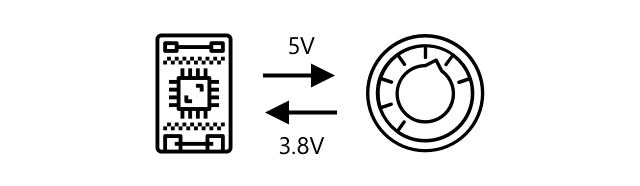

<!--
CO_OP_TRANSLATOR_METADATA:
{
  "original_hash": "e9ee00eb5fc55922a73762acc542166b",
  "translation_date": "2025-08-28T10:29:58+00:00",
  "source_file": "1-getting-started/lessons/3-sensors-and-actuators/README.md",
  "language_code": "ro"
}
-->
# Interacționează cu lumea fizică folosind senzori și actuatoare


> Prezentare grafică realizată de [Nitya Narasimhan](https://github.com/nitya). Click pe imagine pentru o versiune mai mare.

Această lecție a fost predată ca parte a seriei [Hello IoT](https://youtube.com/playlist?list=PLmsFUfdnGr3xRts0TIwyaHyQuHaNQcb6-) de la [Microsoft Reactor](https://developer.microsoft.com/reactor/?WT.mc_id=academic-17441-jabenn). Lecția a fost prezentată în două videoclipuri - o lecție de o oră și o sesiune de întrebări și răspunsuri de o oră, în care s-au aprofundat anumite părți ale lecției.

[](https://youtu.be/Lqalu1v6aF4)

[](https://youtu.be/qR3ekcMlLWA)

> 🎥 Click pe imaginile de mai sus pentru a viziona videoclipurile

## Chestionar înainte de lecție

[Chestionar înainte de lecție](https://black-meadow-040d15503.1.azurestaticapps.net/quiz/5)

## Introducere

Această lecție introduce două concepte importante pentru dispozitivul tău IoT - senzorii și actuatoarele. Vei lucra practic cu ambele, adăugând un senzor de lumină la proiectul tău IoT, apoi un LED controlat de nivelurile de lumină, construind astfel o lampă de veghe.

În această lecție vom acoperi:

* [Ce sunt senzorii?](../../../../../1-getting-started/lessons/3-sensors-and-actuators)
* [Cum se utilizează un senzor](../../../../../1-getting-started/lessons/3-sensors-and-actuators)
* [Tipuri de senzori](../../../../../1-getting-started/lessons/3-sensors-and-actuators)
* [Ce sunt actuatoarele?](../../../../../1-getting-started/lessons/3-sensors-and-actuators)
* [Cum se utilizează un actuator](../../../../../1-getting-started/lessons/3-sensors-and-actuators)
* [Tipuri de actuatoare](../../../../../1-getting-started/lessons/3-sensors-and-actuators)

## Ce sunt senzorii?

Senzorii sunt dispozitive hardware care percep lumea fizică - adică măsoară una sau mai multe proprietăți din jurul lor și trimit informațiile către un dispozitiv IoT. Senzorii acoperă o gamă largă de dispozitive, deoarece există multe lucruri care pot fi măsurate, de la proprietăți naturale precum temperatura aerului până la interacțiuni fizice precum mișcarea.

Câțiva senzori comuni includ:

* Senzori de temperatură - aceștia detectează temperatura aerului sau a mediului în care sunt imersați. Pentru pasionați și dezvoltatori, aceștia sunt adesea combinați cu senzori de presiune a aerului și umiditate într-un singur dispozitiv.
* Butoane - detectează când sunt apăsate.
* Senzori de lumină - detectează nivelurile de lumină și pot fi specifici pentru anumite culori, lumină UV, lumină IR sau lumină vizibilă generală.
* Camere - percep o reprezentare vizuală a lumii prin realizarea unei fotografii sau transmiterea unui videoclip.
* Accelerometre - detectează mișcarea în mai multe direcții.
* Microfoane - detectează sunetul, fie niveluri generale de sunet, fie sunet direcțional.

✅ Fă câteva cercetări. Ce senzori are telefonul tău?

Toți senzorii au un lucru în comun - transformă ceea ce percep într-un semnal electric care poate fi interpretat de un dispozitiv IoT. Modul în care acest semnal electric este interpretat depinde de senzor, precum și de protocolul de comunicare utilizat pentru a comunica cu dispozitivul IoT.

## Cum se utilizează un senzor

Urmează ghidul relevant de mai jos pentru a adăuga un senzor la dispozitivul tău IoT:

* [Arduino - Wio Terminal](wio-terminal-sensor.md)
* [Computer cu placă unică - Raspberry Pi](pi-sensor.md)
* [Computer cu placă unică - Dispozitiv virtual](virtual-device-sensor.md)

## Tipuri de senzori

Senzorii pot fi analogici sau digitali.

### Senzori analogici

Unii dintre cei mai simpli senzori sunt cei analogici. Acești senzori primesc o tensiune de la dispozitivul IoT, componentele senzorului ajustează această tensiune, iar tensiunea returnată de senzor este măsurată pentru a oferi valoarea senzorului.

> 🎓 Tensiunea este o măsură a forței cu care electricitatea este împinsă dintr-un loc în altul, cum ar fi de la borna pozitivă a unei baterii la borna negativă. De exemplu, o baterie standard AA are 1,5V (V este simbolul pentru volți) și poate împinge electricitatea cu o forță de 1,5V de la borna pozitivă la cea negativă. Diferite componente electrice necesită tensiuni diferite pentru a funcționa, de exemplu, un LED poate lumina cu între 2-3V, dar un bec cu filament de 100W ar avea nevoie de 240V. Poți citi mai multe despre tensiune pe [pagina de Wikipedia despre tensiune](https://wikipedia.org/wiki/Voltage).

Un exemplu este un potențiometru. Acesta este un buton rotativ care poate fi ajustat între două poziții, iar senzorul măsoară rotația.



Dispozitivul IoT va trimite un semnal electric către potențiometru la o anumită tensiune, cum ar fi 5 volți (5V). Pe măsură ce potențiometrul este ajustat, acesta modifică tensiunea care iese pe cealaltă parte. Imaginează-ți un potențiometru etichetat ca un buton care merge de la 0 la [11](https://wikipedia.org/wiki/Up_to_eleven), cum ar fi un buton de volum pe un amplificator. Când potențiometrul este în poziția complet oprită (0), 0V (0 volți) vor ieși. Când este în poziția complet pornită (11), 5V (5 volți) vor ieși.

> 🎓 Aceasta este o simplificare, iar tu poți citi mai multe despre potențiometre și rezistențe variabile pe [pagina de Wikipedia despre potențiometre](https://wikipedia.org/wiki/Potentiometer).

Tensiunea care iese din senzor este apoi citită de dispozitivul IoT, iar dispozitivul poate răspunde la aceasta. În funcție de senzor, această tensiune poate fi o valoare arbitrară sau poate corespunde unei unități standard. De exemplu, un senzor analogic de temperatură bazat pe un [termistor](https://wikipedia.org/wiki/Thermistor) își schimbă rezistența în funcție de temperatură. Tensiunea de ieșire poate fi apoi convertită într-o temperatură în Kelvin și, corespunzător, în °C sau °F, prin calcule în cod.

✅ Ce crezi că se întâmplă dacă senzorul returnează o tensiune mai mare decât cea trimisă (de exemplu, provenind dintr-o sursă de alimentare externă)? ⛔️ NU testa acest lucru.

#### Conversia analog-digital

Dispozitivele IoT sunt digitale - ele nu pot lucra cu valori analogice, ci doar cu 0 și 1. Aceasta înseamnă că valorile senzorilor analogici trebuie convertite într-un semnal digital înainte de a putea fi procesate. Multe dispozitive IoT au convertoare analog-digital (ADC-uri) pentru a converti intrările analogice în reprezentări digitale ale valorii lor. Senzorii pot funcționa și cu ADC-uri prin intermediul unei plăci de conectare. De exemplu, în ecosistemul Seeed Grove cu un Raspberry Pi, senzorii analogici se conectează la porturi specifice pe un 'hat' care se montează pe Pi, conectat la pini GPIO ai acestuia, iar acest hat are un ADC pentru a converti tensiunea într-un semnal digital care poate fi trimis prin pinii GPIO ai Pi-ului.

Imaginează-ți că ai un senzor analogic de lumină conectat la un dispozitiv IoT care folosește 3,3V și returnează o valoare de 1V. Acești 1V nu înseamnă nimic în lumea digitală, așa că trebuie să fie convertiți. Tensiunea va fi convertită într-o valoare analogică folosind o scală în funcție de dispozitiv și senzor. Un exemplu este senzorul de lumină Seeed Grove, care returnează valori de la 0 la 1.023. Pentru acest senzor care funcționează la 3,3V, o ieșire de 1V ar fi o valoare de 300. Un dispozitiv IoT nu poate gestiona 300 ca valoare analogică, așa că valoarea ar fi convertită în `0000000100101100`, reprezentarea binară a lui 300 de către hat-ul Grove. Aceasta ar fi apoi procesată de dispozitivul IoT.

✅ Dacă nu cunoști sistemul binar, fă câteva cercetări pentru a învăța cum sunt reprezentate numerele prin 0 și 1. [Lecția introductivă despre sistemul binar de la BBC Bitesize](https://www.bbc.co.uk/bitesize/guides/zwsbwmn/revision/1) este un loc excelent pentru a începe.

Din perspectiva codării, toate acestea sunt de obicei gestionate de bibliotecile care vin cu senzorii, așa că nu trebuie să te îngrijorezi de această conversie. Pentru senzorul de lumină Grove, ai folosi biblioteca Python și ai apela proprietatea `light`, sau ai folosi biblioteca Arduino și ai apela `analogRead` pentru a obține o valoare de 300.

### Senzori digitali

Senzorii digitali, la fel ca cei analogici, detectează lumea din jur folosind schimbări ale tensiunii electrice. Diferența este că aceștia emit un semnal digital, fie prin măsurarea a doar două stări, fie prin utilizarea unui ADC încorporat. Senzorii digitali devin din ce în ce mai comuni pentru a evita necesitatea utilizării unui ADC fie pe o placă de conectare, fie pe dispozitivul IoT în sine.

Cel mai simplu senzor digital este un buton sau un comutator. Acesta este un senzor cu două stări, pornit sau oprit.


Pinii de pe dispozitivele IoT, cum ar fi pinii GPIO, pot măsura direct acest semnal ca 0 sau 1. Dacă tensiunea trimisă este aceeași cu tensiunea returnată, valoarea citită este 1, altfel valoarea citită este 0. Nu este nevoie să se convertească semnalul, acesta poate fi doar 1 sau 0.

> 💁 Tensiunile nu sunt niciodată exacte, mai ales deoarece componentele unui senzor vor avea o anumită rezistență, așa că există de obicei o toleranță. De exemplu, pinii GPIO de pe un Raspberry Pi funcționează la 3,3V și citesc un semnal de retur peste 1,8V ca 1, sub 1,8V ca 0.

* 3,3V intră în buton. Butonul este oprit, deci ies 0V, oferind o valoare de 0.
* 3,3V intră în buton. Butonul este pornit, deci ies 3,3V, oferind o valoare de 1.

Senzorii digitali mai avansați citesc valori analogice, apoi le convertesc folosind ADC-uri încorporate în semnale digitale. De exemplu, un senzor digital de temperatură va folosi în continuare un termocuplu în același mod ca un senzor analogic și va măsura în continuare schimbarea tensiunii cauzată de rezistența termocuplului la temperatura curentă. În loc să returneze o valoare analogică și să se bazeze pe dispozitiv sau pe placa de conectare pentru a o converti într-un semnal digital, un ADC încorporat în senzor va converti valoarea și o va trimite ca o serie de 0 și 1 către dispozitivul IoT. Acești 0 și 1 sunt trimiși în același mod ca semnalul digital pentru un buton, cu 1 fiind tensiunea completă și 0 fiind 0V.


Trimiterea datelor digitale permite senzorilor să devină mai complecși și să trimită date mai detaliate, chiar și date criptate pentru senzori securizați. Un exemplu este o cameră. Aceasta este un senzor care capturează o imagine și o trimite ca date digitale care conțin acea imagine, de obicei într-un format comprimat precum JPEG, pentru a fi citită de dispozitivul IoT. Poate chiar să transmită video prin capturarea imaginilor și trimiterea fie a imaginii complete cadru cu cadru, fie a unui flux video comprimat.

## Ce sunt actuatoarele?

Actuatoarele sunt opusul senzorilor - ele transformă un semnal electric de la dispozitivul tău IoT într-o interacțiune cu lumea fizică, cum ar fi emiterea de lumină sau sunet, sau mișcarea unui motor.

Câteva actuatoare comune includ:

* LED - emit lumină atunci când sunt pornite.
* Difuzor - emit sunet pe baza semnalului trimis către ele, de la un simplu buzzer la un difuzor audio care poate reda muzică.
* Motor pas cu pas - transformă un semnal într-o rotație definită, cum ar fi rotirea unui cadran cu 90°.
* Releu - sunt comutatoare care pot fi pornite sau oprite printr-un semnal electric. Ele permit unei tensiuni mici de la un dispozitiv IoT să pornească tensiuni mai mari.
* Ecrane - sunt actuatoare mai complexe și afișează informații pe un afișaj cu mai multe segmente. Ecranele variază de la afișaje LED simple la monitoare video de înaltă rezoluție.

✅ Fă câteva cercetări. Ce actuatoare are telefonul tău?

## Cum se utilizează un actuator

Urmează ghidul relevant de mai jos pentru a adăuga un actuator la dispozitivul tău IoT, controlat de senzor, pentru a construi o lampă de veghe IoT. Aceasta va colecta nivelurile de lumină de la senzorul de lumină și va utiliza un actuator sub forma unui LED pentru a emite lumină atunci când nivelul de lumină detectat este prea scăzut.


* [Arduino - Wio Terminal](wio-terminal-actuator.md)
* [Computer cu placă unică - Raspberry Pi](pi-actuator.md)
* [Computer cu placă unică - Dispozitiv virtual](virtual-device-actuator.md)

## Tipuri de actuatoare

La fel ca senzorii, actuatoarele pot fi analogice sau digitale.

### Actuatoare analogice

Actuatoarele analogice primesc un semnal analogic și îl transformă într-un tip de interacțiune, unde interacțiunea se schimbă în funcție de tensiunea furnizată.

Un exemplu este o lumină reglabilă, cum ar fi cele pe care le-ai putea avea în casă. Cantitatea de tensiune furnizată luminii determină cât de strălucitoare este aceasta.


La fel ca în cazul senzorilor, dispozitivul IoT funcționează cu semnale digitale, nu analogice. Asta înseamnă că, pentru a trimite un semnal analogic, dispozitivul IoT are nevoie de un convertor digital-analogic (DAC), fie direct pe dispozitivul IoT, fie pe o placă de conectare. Acesta va converti 0-urile și 1-urile de la dispozitivul IoT într-o tensiune analogică pe care actuatorul o poate utiliza.

✅ Ce crezi că se întâmplă dacă dispozitivul IoT trimite o tensiune mai mare decât poate suporta actuatorul?
⛔️ NU testa acest lucru.

#### Modulația lățimii impulsului

O altă opțiune pentru a converti semnalele digitale de la un dispozitiv IoT într-un semnal analogic este modulația lățimii impulsului (PWM). Aceasta implică trimiterea multor impulsuri digitale scurte care acționează ca și cum ar fi un semnal analogic.

De exemplu, poți utiliza PWM pentru a controla viteza unui motor.

Imaginează-ți că controlezi un motor cu o alimentare de 5V. Trimiți un impuls scurt către motorul tău, comutând tensiunea la nivel înalt (5V) pentru două sutimi de secundă (0,02s). În acel timp, motorul poate efectua o zecime de rotație, sau 36°. Semnalul apoi se oprește pentru două sutimi de secundă (0,02s), trimițând un semnal scăzut (0V). Fiecare ciclu de pornire și oprire durează 0,04s. Ciclul se repetă.


Aceasta înseamnă că într-o secundă ai 25 de impulsuri de 5V de 0,02s care rotesc motorul, fiecare urmat de o pauză de 0,02s de 0V în care motorul nu se rotește. Fiecare impuls rotește motorul cu o zecime de rotație, ceea ce înseamnă că motorul completează 2,5 rotații pe secundă. Ai utilizat un semnal digital pentru a roti motorul la 2,5 rotații pe secundă, sau 150 [rotații pe minut](https://wikipedia.org/wiki/Revolutions_per_minute) (o măsură non-standard a vitezei de rotație).

```output
25 pulses per second x 0.1 rotations per pulse = 2.5 rotations per second
2.5 rotations per second x 60 seconds in a minute = 150rpm
```

> 🎓 Când un semnal PWM este activ pentru jumătate din timp și inactiv pentru cealaltă jumătate, se numește [ciclu de funcționare de 50%](https://wikipedia.org/wiki/Duty_cycle). Ciclurile de funcționare sunt măsurate ca procentul de timp în care semnalul este în stare activă comparativ cu starea inactivă.


Poți schimba viteza motorului modificând dimensiunea impulsurilor. De exemplu, cu același motor, poți păstra același timp de ciclu de 0,04s, cu impulsul activ redus la jumătate (0,01s), iar impulsul inactiv crescând la 0,03s. Ai același număr de impulsuri pe secundă (25), dar fiecare impuls activ este de jumătate din lungime. Un impuls de jumătate de lungime rotește motorul cu o douăzecime de rotație, iar la 25 de impulsuri pe secundă va completa 1,25 rotații pe secundă sau 75rpm. Prin modificarea vitezei impulsurilor unui semnal digital, ai înjumătățit viteza unui motor analogic.

```output
25 pulses per second x 0.05 rotations per pulse = 1.25 rotations per second
1.25 rotations per second x 60 seconds in a minute = 75rpm
```

✅ Cum ai menține rotația motorului lină, mai ales la viteze mici? Ai folosi un număr mic de impulsuri lungi cu pauze lungi sau multe impulsuri foarte scurte cu pauze foarte scurte?

> 💁 Unii senzori folosesc, de asemenea, PWM pentru a converti semnalele analogice în semnale digitale.

> 🎓 Poți citi mai multe despre modulația lățimii impulsului pe [pagina PWM de pe Wikipedia](https://wikipedia.org/wiki/Pulse-width_modulation).

### Actuatori digitali

Actuatorii digitali, la fel ca senzorii digitali, au fie două stări controlate de o tensiune înaltă sau joasă, fie au un DAC integrat, astfel încât pot converti un semnal digital într-unul analogic.

Un actuator digital simplu este un LED. Când un dispozitiv trimite un semnal digital de 1, se trimite o tensiune înaltă care aprinde LED-ul. Când se trimite un semnal digital de 0, tensiunea scade la 0V și LED-ul se stinge.


✅ Ce alți actuatori simpli cu 2 stări îți vin în minte? Un exemplu este un solenoid, care este un electromagnet ce poate fi activat pentru a face lucruri precum mișcarea unui șurub de ușă pentru a bloca/debloca o ușă.

Actuatorii digitali mai avansați, cum ar fi ecranele, necesită ca datele digitale să fie trimise în anumite formate. De obicei, vin cu biblioteci care fac mai ușoară trimiterea datelor corecte pentru a le controla.

---

## 🚀 Provocare

Provocarea din ultimele două lecții a fost să enumeri cât mai multe dispozitive IoT pe care le ai acasă, la școală sau la locul de muncă și să decizi dacă sunt construite în jurul microcontrolerelor sau al calculatoarelor pe o singură placă, sau chiar o combinație a acestora.

Pentru fiecare dispozitiv enumerat, ce senzori și actuatori sunt conectați la acestea? Care este scopul fiecărui senzor și actuator conectat la aceste dispozitive?

## Test de verificare după lecție

[Test de verificare după lecție](https://black-meadow-040d15503.1.azurestaticapps.net/quiz/6)

## Recapitulare și studiu individual

* Citește despre electricitate și circuite pe [ThingLearn](http://thinglearn.jenlooper.com/curriculum/).
* Citește despre diferitele tipuri de senzori de temperatură în [ghidul Seeed Studios pentru senzori de temperatură](https://www.seeedstudio.com/blog/2019/10/14/temperature-sensors-for-arduino-projects/).
* Citește despre LED-uri pe [pagina LED de pe Wikipedia](https://wikipedia.org/wiki/Light-emitting_diode).

## Temă

[Cercetează senzori și actuatori](assignment.md)

---

**Declinare de responsabilitate**:  
Acest document a fost tradus folosind serviciul de traducere AI [Co-op Translator](https://github.com/Azure/co-op-translator). Deși ne străduim să asigurăm acuratețea, vă rugăm să fiți conștienți că traducerile automate pot conține erori sau inexactități. Documentul original în limba sa natală ar trebui considerat sursa autoritară. Pentru informații critice, se recomandă traducerea profesională realizată de un specialist uman. Nu ne asumăm responsabilitatea pentru eventualele neînțelegeri sau interpretări greșite care pot apărea din utilizarea acestei traduceri.