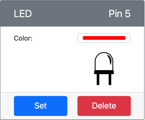

<!--
CO_OP_TRANSLATOR_METADATA:
{
  "original_hash": "9c640f93263fd9adbfda920739e09feb",
  "translation_date": "2025-08-28T10:33:09+00:00",
  "source_file": "1-getting-started/lessons/3-sensors-and-actuators/virtual-device-actuator.md",
  "language_code": "ro"
}
-->
# Construiește o lampă de veghe - Hardware IoT Virtual

În această parte a lecției, vei adăuga un LED dispozitivului tău IoT virtual și îl vei folosi pentru a crea o lampă de veghe.

## Hardware Virtual

Lampa de veghe necesită un singur actuator, creat în aplicația CounterFit.

Actuatorul este un **LED**. Într-un dispozitiv IoT fizic, acesta ar fi o [diodă emițătoare de lumină](https://wikipedia.org/wiki/Light-emitting_diode) care emite lumină atunci când curentul trece prin ea. Acesta este un actuator digital care are 2 stări: pornit și oprit. Trimiterea unei valori de 1 aprinde LED-ul, iar o valoare de 0 îl stinge.

Logica lămpii de veghe în pseudo-cod este:

```output
Check the light level.
If the light is less than 300
    Turn the LED on
Otherwise
    Turn the LED off
```

### Adaugă actuatorul în CounterFit

Pentru a utiliza un LED virtual, trebuie să îl adaugi în aplicația CounterFit.

#### Sarcină - adaugă actuatorul în CounterFit

Adaugă LED-ul în aplicația CounterFit.

1. Asigură-te că aplicația web CounterFit rulează din partea anterioară a acestui exercițiu. Dacă nu, pornește-o și re-adaugă senzorul de lumină.

1. Creează un LED:

    1. În caseta *Create actuator* din panoul *Actuator*, deschide meniul derulant *Actuator type* și selectează *LED*.

    1. Setează *Pin* la *5*.

    1. Selectează butonul **Add** pentru a crea LED-ul pe Pin 5.

    

    LED-ul va fi creat și va apărea în lista de actuatori.

    

    După ce LED-ul a fost creat, poți schimba culoarea folosind selectorul *Color*. Selectează butonul **Set** pentru a schimba culoarea după ce ai ales-o.

### Programează lampa de veghe

Acum lampa de veghe poate fi programată folosind senzorul de lumină și LED-ul din CounterFit.

#### Sarcină - programează lampa de veghe

Programează lampa de veghe.

1. Deschide proiectul lămpii de veghe în VS Code pe care l-ai creat în partea anterioară a acestui exercițiu. Închide și recreează terminalul pentru a te asigura că rulează folosind mediul virtual, dacă este necesar.

1. Deschide fișierul `app.py`.

1. Adaugă următorul cod în fișierul `app.py` pentru a importa o bibliotecă necesară. Acesta ar trebui adăugat în partea de sus, sub celelalte linii `import`.

    ```python
    from counterfit_shims_grove.grove_led import GroveLed
    ```

    Instrucțiunea `from counterfit_shims_grove.grove_led import GroveLed` importă `GroveLed` din bibliotecile Python CounterFit Grove shim. Această bibliotecă conține cod pentru a interacționa cu un LED creat în aplicația CounterFit.

1. Adaugă următorul cod după declarația `light_sensor` pentru a crea o instanță a clasei care gestionează LED-ul:

    ```python
    led = GroveLed(5)
    ```

    Linia `led = GroveLed(5)` creează o instanță a clasei `GroveLed`, conectându-se la pinul **5** - pinul CounterFit Grove la care este conectat LED-ul.

1. Adaugă o verificare în interiorul buclei `while`, înainte de `time.sleep`, pentru a verifica nivelurile de lumină și a aprinde sau stinge LED-ul:

    ```python
    if light < 300:
        led.on()
    else:
        led.off()
    ```

    Acest cod verifică valoarea `light`. Dacă aceasta este mai mică de 300, apelează metoda `on` a clasei `GroveLed`, care trimite o valoare digitală de 1 către LED, aprinzându-l. Dacă valoarea luminii este mai mare sau egală cu 300, apelează metoda `off`, trimițând o valoare digitală de 0 către LED, stingându-l.

    > 💁 Acest cod ar trebui să fie indentat la același nivel cu linia `print('Light level:', light)` pentru a fi în interiorul buclei while!

1. Din terminalul VS Code, rulează următoarea comandă pentru a rula aplicația Python:

    ```sh
    python3 app.py
    ```

    Valorile luminii vor fi afișate în consolă.

    ```output
    (.venv) ➜  GroveTest python3 app.py 
    Light level: 143
    Light level: 244
    Light level: 246
    Light level: 253
    ```

1. Schimbă setările *Value* sau *Random* pentru a varia nivelul de lumină peste și sub 300. LED-ul se va aprinde și stinge.


> 💁 Poți găsi acest cod în folderul [code-actuator/virtual-device](../../../../../1-getting-started/lessons/3-sensors-and-actuators/code-actuator/virtual-device).

😀 Programul tău pentru lampă de veghe a fost un succes!

---

**Declinare de responsabilitate**:  
Acest document a fost tradus folosind serviciul de traducere AI [Co-op Translator](https://github.com/Azure/co-op-translator). Deși ne străduim să asigurăm acuratețea, vă rugăm să fiți conștienți că traducerile automate pot conține erori sau inexactități. Documentul original în limba sa natală ar trebui considerat sursa autoritară. Pentru informații critice, se recomandă traducerea profesională realizată de un specialist uman. Nu ne asumăm responsabilitatea pentru eventualele neînțelegeri sau interpretări greșite care pot apărea din utilizarea acestei traduceri.