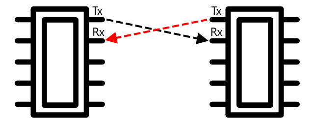

<!--
CO_OP_TRANSLATOR_METADATA:
{
  "original_hash": "4fb20273d299dc8d07a8f06c9cd0cdd9",
  "translation_date": "2025-08-28T10:59:09+00:00",
  "source_file": "2-farm/lessons/2-detect-soil-moisture/README.md",
  "language_code": "ro"
}
-->
C, pronunțat *I-squared-C*, este un protocol multi-controler, multi-periferic, în care orice dispozitiv conectat poate acționa ca un controler sau periferic comunicând prin intermediul magistralei I²C (numele pentru un sistem de comunicare care transferă date). Datele sunt trimise sub formă de pachete adresate, fiecare pachet conținând adresa dispozitivului conectat căruia îi este destinat.

> 💁 Acest model era denumit anterior master/slave, dar această terminologie este abandonată din cauza asocierii sale cu sclavia. [Asociația de Hardware Open Source a adoptat termenii controler/periferic](https://www.oshwa.org/a-resolution-to-redefine-spi-signal-names/), dar este posibil să mai întâlniți referințe la vechea terminologie.

Dispozitivele au o adresă utilizată atunci când se conectează la magistrala I²C, care este de obicei codificată în dispozitiv. De exemplu, fiecare tip de senzor Grove de la Seeed are aceeași adresă, astfel încât toți senzorii de lumină au aceeași adresă, toți butoanele au aceeași adresă, care este diferită de adresa senzorilor de lumină. Unele dispozitive au metode de a schimba adresa, prin modificarea setărilor jumper-ului sau prin lipirea unor pini împreună.

I²C are o magistrală formată din 2 fire principale, împreună cu 2 fire de alimentare:

| Fir | Nume | Descriere |
| ---- | --------- | ----------- |
| SDA | Date Seriale | Acest fir este utilizat pentru trimiterea datelor între dispozitive. |
| SCL | Ceas Serial | Acest fir trimite un semnal de ceas la o rată stabilită de controler. |
| VCC | Colector comun de tensiune | Alimentarea dispozitivelor. Acesta este conectat la firele SDA și SCL pentru a le furniza energie printr-un rezistor pull-up care oprește semnalul atunci când niciun dispozitiv nu este controler. |
| GND | Masă | Oferă o masă comună pentru circuitul electric. |

Pentru a trimite date, un dispozitiv va emite o condiție de start pentru a arăta că este pregătit să trimită date. Acesta va deveni apoi controlerul. Controlerul trimite adresa dispozitivului cu care dorește să comunice, împreună cu informația dacă dorește să citească sau să scrie date. După ce datele au fost transmise, controlerul trimite o condiție de stop pentru a indica faptul că a terminat. După aceasta, un alt dispozitiv poate deveni controler și poate trimite sau primi date.

2C are limite de viteză, cu 3 moduri diferite care funcționează la viteze fixe. Cel mai rapid este modul High Speed, cu o viteză maximă de 3,4 Mbps (megabiți pe secundă), deși foarte puține dispozitive suportă această viteză. De exemplu, Raspberry Pi este limitat la modul fast, la 400 Kbps (kilobiți pe secundă). Modul standard funcționează la 100 Kbps.

> 💠Dacă folosești un Raspberry Pi cu un Grove Base hat ca hardware IoT, vei putea vedea mai multe prize I2C pe placă pe care le poți utiliza pentru a comunica cu senzorii I2C. Senzorii analogici Grove folosesc, de asemenea, I2C cu un ADC pentru a trimite valori analogice ca date digitale, astfel încât senzorul de lumină pe care l-ai utilizat a simulat un pin analogic, cu valoarea transmisă prin I2C, deoarece Raspberry Pi suportă doar pini digitali.

### Receptor-transmițător asincron universal (UART)

UART implică un circuit fizic care permite comunicarea între două dispozitive. Fiecare dispozitiv are 2 pini de comunicare - transmitere (Tx) și recepție (Rx), cu pinul Tx al primului dispozitiv conectat la pinul Rx al celui de-al doilea și cu pinul Tx al celui de-al doilea dispozitiv conectat la pinul Rx al primului. Acest lucru permite trimiterea datelor în ambele direcții.

* Dispozitivul 1 transmite date de la pinul său Tx, care sunt recepționate de dispozitivul 2 pe pinul său Rx
* Dispozitivul 1 primește date pe pinul său Rx, care sunt transmise de dispozitivul 2 de la pinul său Tx

> 🎓 Datele sunt trimise câte un bit pe rând, iar acest lucru este cunoscut sub numele de comunicare *serială*. Majoritatea sistemelor de operare și microcontrolerelor au *porturi seriale*, adică conexiuni care pot trimite și primi date seriale disponibile pentru codul tău.

Dispozitivele UART au o [viteză de transmisie](https://wikipedia.org/wiki/Symbol_rate) (cunoscută și sub numele de rata simbolurilor), care este viteza cu care datele vor fi trimise și recepționate în biți pe secundă. O viteză comună este 9.600, ceea ce înseamnă că 9.600 de biți (0 și 1) de date sunt trimiși în fiecare secundă.

UART folosește biți de start și stop - adică trimite un bit de start pentru a indica faptul că urmează să trimită un octet (8 biți) de date, apoi un bit de stop după ce trimite cei 8 biți.

Viteza UART depinde de hardware, dar chiar și cele mai rapide implementări nu depășesc 6,5 Mbps (megabiți pe secundă, sau milioane de biți, 0 sau 1, trimiși pe secundă).

Poți utiliza UART prin pini GPIO - poți seta un pin ca Tx și altul ca Rx, apoi să le conectezi la un alt dispozitiv.

> 💁 Dacă folosești un Raspberry Pi cu un Grove Base hat ca hardware IoT, vei putea vedea o priză UART pe placă pe care o poți utiliza pentru a comunica cu senzorii care folosesc protocolul UART.

### Interfața serială periferică (SPI)

SPI este proiectată pentru comunicarea pe distanțe scurte, cum ar fi pe un microcontroler pentru a comunica cu un dispozitiv de stocare, cum ar fi memoria flash. Se bazează pe un model controler/periferic, cu un singur controler (de obicei procesorul dispozitivului IoT) care interacționează cu mai multe periferice. Controlerul controlează totul selectând un periferic și trimițând sau solicitând date.

> 💠La fel ca I2C, termenii controler și periferic sunt schimbări recente, așa că este posibil să vezi încă termenii mai vechi utilizați.

Controlerele SPI folosesc 3 fire, împreună cu 1 fir suplimentar per periferic. Perifericele folosesc 4 fire. Aceste fire sunt:

| Fir | Nume | Descriere |
| ---- | --------- | ----------- |
| COPI | Ieșire Controler, Intrare Periferic | Acest fir este pentru trimiterea datelor de la controler la periferic. |
| CIPO | Intrare Controler, Ieșire Periferic | Acest fir este pentru trimiterea datelor de la periferic la controler. |
| SCLK | Ceas Serial | Acest fir trimite un semnal de ceas la o rată stabilită de controler. |
| CS   | Selectare Cip | Controlerul are mai multe fire, câte unul pentru fiecare periferic, iar fiecare fir se conectează la firul CS al perifericului corespunzător. |

Firul CS este utilizat pentru a activa un singur periferic la un moment dat, comunicând prin firele COPI și CIPO. Când controlerul trebuie să schimbe perifericul, dezactivează firul CS conectat la perifericul activ curent, apoi activează firul conectat la perifericul cu care dorește să comunice următorul.

SPI este *full-duplex*, ceea ce înseamnă că controlerul poate trimite și primi date în același timp de la același periferic folosind firele COPI și CIPO. SPI folosește un semnal de ceas pe firul SCLK pentru a menține dispozitivele sincronizate, astfel încât, spre deosebire de trimiterea directă prin UART, nu are nevoie de biți de start și stop.

Nu există limite de viteză definite pentru SPI, implementările fiind adesea capabile să transmită mai mulți megabytes de date pe secundă.

Kiturile de dezvoltare IoT suportă adesea SPI prin câțiva pini GPIO. De exemplu, pe un Raspberry Pi poți utiliza pinii GPIO 19, 21, 23, 24 și 26 pentru SPI.

### Fără fir

Unii senzori pot comunica prin protocoale wireless standard, cum ar fi Bluetooth (în principal Bluetooth Low Energy, sau BLE), LoRaWAN (un protocol de rețea cu consum redus de energie și rază lungă) sau WiFi. Acestea permit utilizarea senzorilor la distanță, care nu sunt conectați fizic la un dispozitiv IoT.

Un exemplu este reprezentat de senzorii comerciali de umiditate a solului. Aceștia măsoară umiditatea solului într-un câmp, apoi trimit datele prin LoRaWAN către un dispozitiv hub, care va procesa datele sau le va trimite prin Internet. Acest lucru permite ca senzorul să fie departe de dispozitivul IoT care gestionează datele, reducând consumul de energie și necesitatea unor rețele WiFi mari sau a unor cabluri lungi.

BLE este popular pentru senzori avansați, cum ar fi brățările de fitness purtate la încheietură. Acestea combină mai mulți senzori și trimit datele senzorilor către un dispozitiv IoT, cum ar fi telefonul tău, prin BLE.

✅ Ai vreun senzor Bluetooth asupra ta, în casa ta sau la școală? Acestea ar putea include senzori de temperatură, senzori de prezență, dispozitive de urmărire sau dispozitive de fitness.

O metodă populară pentru conectarea dispozitivelor comerciale este Zigbee. Zigbee folosește WiFi pentru a forma rețele mesh între dispozitive, unde fiecare dispozitiv se conectează la cât mai multe dispozitive din apropiere, formând un număr mare de conexiuni, ca o pânză de păianjen. Când un dispozitiv dorește să trimită un mesaj pe Internet, îl poate trimite către dispozitivele cele mai apropiate, care apoi îl transmit mai departe către alte dispozitive din apropiere și așa mai departe, până ajunge la un coordonator și poate fi trimis pe Internet.

> 🐝 Numele Zigbee face referire la dansul de orientare al albinelor după întoarcerea lor la stup.

## Măsurarea nivelurilor de umiditate din sol

Poți măsura nivelul de umiditate din sol folosind un senzor de umiditate a solului, un dispozitiv IoT și o plantă de apartament sau o zonă de sol din apropiere.

### Sarcină - măsoară umiditatea solului

Parcurge ghidul relevant pentru a măsura umiditatea solului folosind dispozitivul tău IoT:

* [Arduino - Wio Terminal](wio-terminal-soil-moisture.md)
* [Computer cu o singură placă - Raspberry Pi](pi-soil-moisture.md)
* [Computer cu o singură placă - Dispozitiv virtual](virtual-device-soil-moisture.md)

## Calibrarea senzorilor

Senzorii se bazează pe măsurarea proprietăților electrice, cum ar fi rezistența sau capacitatea.

> 🎓 Rezistența, măsurată în ohmi (Ω), reprezintă cât de multă opoziție există față de curentul electric care trece printr-un material. Când o tensiune este aplicată unui material, cantitatea de curent care trece prin el depinde de rezistența materialului. Poți citi mai multe pe [pagina despre rezistența electrică de pe Wikipedia](https://wikipedia.org/wiki/Electrical_resistance_and_conductance).

> 🎓 Capacitatea, măsurată în farazi (F), reprezintă abilitatea unui component sau circuit de a colecta și stoca energie electrică. Poți citi mai multe despre capacitate pe [pagina despre capacitate de pe Wikipedia](https://wikipedia.org/wiki/Capacitance).

Aceste măsurători nu sunt întotdeauna utile - imaginează-ți un senzor de temperatură care îți oferă o măsurătoare de 22,5 KΩ! În schimb, valoarea măsurată trebuie convertită într-o unitate utilă prin calibrare - adică potrivirea valorilor măsurate cu cantitatea măsurată pentru a permite conversia noilor măsurători în unitatea corectă.

Unii senzori vin pre-calibrați. De exemplu, senzorul de temperatură pe care l-ai folosit în lecția anterioară era deja calibrat astfel încât să poată returna o măsurătoare a temperaturii în °C. În fabrică, primul senzor creat ar fi expus la o gamă de temperaturi cunoscute, iar rezistența măsurată. Aceasta ar fi apoi utilizată pentru a construi un calcul care poate converti din valoarea măsurată în Ω (unitatea de rezistență) în °C.

> 💁 Formula pentru calcularea rezistenței în funcție de temperatură se numește [ecuația Steinhart–Hart](https://wikipedia.org/wiki/Steinhart–Hart_equation).

### Calibrarea senzorului de umiditate a solului

Umiditatea solului este măsurată folosind conținutul gravimetric sau volumetric de apă.

* Gravimetric înseamnă greutatea apei într-o unitate de greutate a solului, măsurată ca numărul de kilograme de apă per kilogram de sol uscat
* Volumetric înseamnă volumul de apă într-o unitate de volum a solului, măsurată ca numărul de metri cubi de apă per metri cubi de sol uscat

> 🇺🇸 Pentru americani, datorită consistenței unităților, acestea pot fi măsurate în pounds în loc de kilograme sau în cubic feet în loc de metri cubi.

Senzorii de umiditate a solului măsoară rezistența sau capacitatea electrică - aceasta nu variază doar în funcție de umiditatea solului, ci și de tipul de sol, deoarece componentele din sol pot schimba caracteristicile electrice ale acestuia. Ideal, senzorii ar trebui calibrați - adică luarea măsurătorilor de la senzor și compararea lor cu măsurători obținute printr-o metodă mai științifică. De exemplu, un laborator poate calcula umiditatea gravimetrică a solului folosind mostre dintr-un câmp specific luate de câteva ori pe an, iar aceste valori pot fi utilizate pentru a calibra senzorul, potrivind citirea senzorului cu umiditatea gravimetrică a solului.

Graficul de mai sus arată cum să calibrezi un senzor. Tensiunea este capturată pentru o mostră de sol care este apoi măsurată într-un laborator prin compararea greutății umede cu greutatea uscată (măsurând greutatea umedă, apoi uscând-o într-un cuptor și măsurând greutatea uscată). Odată ce câteva măsurători au fost luate, acestea pot fi reprezentate pe un grafic, iar o linie poate fi ajustată punctelor. Această linie poate fi apoi utilizată pentru a converti citirile senzorului de umiditate a solului luate de un dispozitiv IoT în măsurători reale ale umidității solului.

💁 Pentru senzorii rezistivi de umiditate a solului, tensiunea crește pe măsură ce umiditatea solului crește. Pentru senzorii capacitivi de umiditate a solului, tensiunea scade pe măsură ce umiditatea solului crește, astfel încât graficele pentru aceștia ar avea o pantă descendentă, nu ascendentă.

Graficul de mai sus arată o citire a tensiunii de la un senzor de umiditate a solului, iar urmărind aceasta până la linia de pe grafic, umiditatea reală a solului poate fi calculată.

Această abordare înseamnă că fermierul trebuie să obțină doar câteva măsurători de laborator pentru un câmp, apoi poate utiliza dispozitive IoT pentru a măsura umiditatea solului - accelerând drastic timpul necesar pentru a lua măsurători.

---

## 🚀 Provocare

Senzorii rezistivi și cei capacitivi de umiditate a solului au o serie de diferențe. Care sunt aceste diferențe și care tip (dacă există) este cel mai potrivit pentru un fermier? Se schimbă acest răspuns între țările în curs de dezvoltare și cele dezvoltate?

## Chestionar post-lectură

[Chestionar post-lectură](https://black-meadow-040d15503.1.azurestaticapps.net/quiz/12)

## Recapitulare și studiu individual

Citește despre hardware-ul și protocoalele utilizate de senzori și actuatori:

* [Pagina Wikipedia despre GPIO](https://wikipedia.org/wiki/General-purpose_input/output)
* [Pagina Wikipedia despre UART](https://wikipedia.org/wiki/Universal_asynchronous_receiver-transmitter)
* [Pagina Wikipedia despre SPI](https://wikipedia.org/wiki/Serial_Peripheral_Interface)
* [Pagina Wikipedia despre I2C](https://wikipedia.org/wiki/I²C)
* [Pagina Wikipedia despre Zigbee](https://wikipedia.org/wiki/Zigbee)

## Temă

[Calibrează-ți senzorul](assignment.md)

---

**Declinare de responsabilitate**:  
Acest document a fost tradus folosind serviciul de traducere AI [Co-op Translator](https://github.com/Azure/co-op-translator). Deși ne străduim să asigurăm acuratețea, vă rugăm să rețineți că traducerile automate pot conține erori sau inexactități. Documentul original în limba sa natală ar trebui considerat sursa autoritară. Pentru informații critice, se recomandă traducerea profesională realizată de un specialist uman. Nu ne asumăm responsabilitatea pentru eventualele neînțelegeri sau interpretări greșite care pot apărea din utilizarea acestei traduceri.