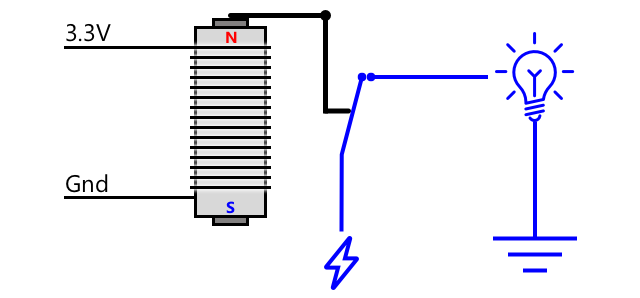

<!--
CO_OP_TRANSLATOR_METADATA:
{
  "original_hash": "f7bb24ba53fb627ddb38a8b24a05e594",
  "translation_date": "2025-08-28T11:37:48+00:00",
  "source_file": "2-farm/lessons/3-automated-plant-watering/README.md",
  "language_code": "ro"
}
-->
# Udare automată a plantelor


> Schiță realizată de [Nitya Narasimhan](https://github.com/nitya). Faceți clic pe imagine pentru o versiune mai mare.

Această lecție a fost predată ca parte a [Proiectului IoT pentru Începători 2 - Seria Agricultură Digitală](https://youtube.com/playlist?list=PLmsFUfdnGr3yCutmcVg6eAUEfsGiFXgcx) de la [Microsoft Reactor](https://developer.microsoft.com/reactor/?WT.mc_id=academic-17441-jabenn).

[](https://youtu.be/g9FfZwv9R58)

## Chestionar înainte de lecție

[Chestionar înainte de lecție](https://black-meadow-040d15503.1.azurestaticapps.net/quiz/13)

## Introducere

În lecția anterioară, ați învățat cum să monitorizați umiditatea solului. În această lecție, veți învăța cum să construiți componentele de bază ale unui sistem automat de udare care răspunde la nivelul de umiditate al solului. De asemenea, veți învăța despre sincronizare - cum senzorii pot avea nevoie de timp pentru a răspunde la schimbări și cum actuatoarele pot necesita timp pentru a modifica proprietățile măsurate de senzori.

În această lecție vom acoperi:

* [Controlul dispozitivelor de mare putere de pe un dispozitiv IoT de mică putere](../../../../../2-farm/lessons/3-automated-plant-watering)
* [Controlul unui releu](../../../../../2-farm/lessons/3-automated-plant-watering)
* [Controlul plantei prin MQTT](../../../../../2-farm/lessons/3-automated-plant-watering)
* [Sincronizarea senzorilor și actuatoarelor](../../../../../2-farm/lessons/3-automated-plant-watering)
* [Adăugarea sincronizării la serverul de control al plantei](../../../../../2-farm/lessons/3-automated-plant-watering)

## Controlul dispozitivelor de mare putere de pe un dispozitiv IoT de mică putere

Dispozitivele IoT folosesc o tensiune joasă. Deși aceasta este suficientă pentru senzori și actuatoare de mică putere, cum ar fi LED-urile, este prea mică pentru a controla hardware mai mare, cum ar fi o pompă de apă utilizată pentru irigații. Chiar și pompele mici, pe care le-ați putea folosi pentru plantele de apartament, consumă prea mult curent pentru un kit de dezvoltare IoT și ar putea arde placa.

> 🎓 Curentul, măsurat în Amperi (A), reprezintă cantitatea de electricitate care circulă printr-un circuit. Tensiunea oferă impulsul, iar curentul indică cât de mult este împins. Puteți citi mai multe despre curent pe [pagina despre curentul electric de pe Wikipedia](https://wikipedia.org/wiki/Electric_current).

Soluția este să conectați pompa la o sursă de alimentare externă și să folosiți un actuator pentru a porni pompa, similar cu modul în care aprindeți o lumină. Este nevoie de o cantitate mică de energie (sub formă de energie din corpul dumneavoastră) pentru ca degetul să apese pe un întrerupător, iar acest lucru conectează lumina la rețeaua electrică de 110V/240V.


> 🎓 [Electricitatea de rețea](https://wikipedia.org/wiki/Mains_electricity) se referă la electricitatea livrată în case și afaceri prin infrastructura națională în multe părți ale lumii.

✅ Dispozitivele IoT pot furniza, de obicei, 3.3V sau 5V, la mai puțin de 1 amper (1A) de curent. Comparați acest lucru cu electricitatea de rețea, care este cel mai adesea la 230V (120V în America de Nord și 100V în Japonia) și poate alimenta dispozitive care consumă 30A.

Există o serie de actuatoare care pot face acest lucru, inclusiv dispozitive mecanice pe care le puteți atașa la întrerupătoarele existente pentru a imita un deget care le pornește. Cel mai popular este un releu.

### Relee

Un releu este un întrerupător electromecanic care convertește un semnal electric într-o mișcare mecanică ce pornește un întrerupător. Elementul central al unui releu este un electromagnet.

> 🎓 [Electromagneții](https://wikipedia.org/wiki/Electromagnet) sunt magneți creați prin trecerea electricității printr-o bobină de sârmă. Când electricitatea este pornită, bobina devine magnetizată. Când electricitatea este oprită, bobina își pierde magnetismul.



Într-un releu, un circuit de control alimentează electromagnetul. Când electromagnetul este pornit, acesta trage o pârghie care mișcă un întrerupător, închizând un set de contacte și completând un circuit de ieșire.


Când circuitul de control este oprit, electromagnetul se oprește, eliberând pârghia și deschizând contactele, oprind circuitul de ieșire. Releele sunt actuatoare digitale - un semnal ridicat către releu îl pornește, un semnal scăzut îl oprește.

Circuitul de ieșire poate fi utilizat pentru a alimenta hardware suplimentar, cum ar fi un sistem de irigații. Dispozitivul IoT poate porni releul, completând circuitul de ieșire care alimentează sistemul de irigații, iar plantele sunt udate. Dispozitivul IoT poate apoi opri releul, întrerupând alimentarea sistemului de irigații și oprind apa.


În videoclipul de mai sus, un releu este pornit. Un LED de pe releu se aprinde pentru a indica faptul că este pornit (unele plăci de releu au LED-uri pentru a indica dacă releul este pornit sau oprit), iar alimentarea este trimisă către pompă, pornind-o și pompa apă către o plantă.

> 💁 Releele pot fi utilizate și pentru a comuta între două circuite de ieșire în loc să pornească sau să oprească unul. Pe măsură ce pârghia se mișcă, aceasta comută un întrerupător de la completarea unui circuit de ieșire la completarea unui alt circuit de ieșire, de obicei împărțind o conexiune comună de alimentare sau o conexiune comună la masă.

✅ Faceți câteva cercetări: Există mai multe tipuri de relee, cu diferențe precum dacă circuitul de control pornește sau oprește releul atunci când este aplicată alimentarea sau circuite multiple de ieșire. Aflați despre aceste tipuri diferite.

Când pârghia se mișcă, de obicei puteți auzi cum face contact cu electromagnetul printr-un clic bine definit.

> 💁 Un releu poate fi conectat astfel încât realizarea conexiunii să întrerupă de fapt alimentarea către releu, oprindu-l, ceea ce apoi trimite din nou alimentare către releu, pornindu-l din nou, și așa mai departe. Acest lucru înseamnă că releul va face clic foarte rapid, producând un zgomot de bâzâit. Așa funcționau unele dintre primele sonerii electrice utilizate la ușile electrice.

### Alimentarea releului

Electromagnetul nu are nevoie de multă putere pentru a se activa și a trage pârghia, acesta poate fi controlat folosind ieșirea de 3.3V sau 5V de la un kit de dezvoltare IoT. Circuitul de ieșire poate transporta mult mai multă putere, în funcție de releu, inclusiv tensiune de rețea sau chiar niveluri mai mari de putere pentru utilizare industrială. Astfel, un kit de dezvoltare IoT poate controla un sistem de irigații, de la o pompă mică pentru o singură plantă, până la un sistem industrial masiv pentru o fermă comercială întreagă.


Imaginea de mai sus arată un releu Grove. Circuitul de control se conectează la un dispozitiv IoT și pornește sau oprește releul folosind 3.3V sau 5V. Circuitul de ieșire are două terminale, oricare dintre ele poate fi alimentare sau masă. Circuitul de ieșire poate gestiona până la 250V la 10A, suficient pentru o gamă de dispozitive alimentate de la rețea. Puteți găsi relee care pot gestiona chiar și niveluri mai mari de putere.


În imaginea de mai sus, alimentarea este furnizată unei pompe printr-un releu. Există un fir roșu care conectează terminalul +5V al unei surse de alimentare USB la un terminal al circuitului de ieșire al releului și un alt fir roșu care conectează celălalt terminal al circuitului de ieșire la pompă. Un fir negru conectează pompa la masă pe sursa de alimentare USB. Când releul se pornește, acesta completează circuitul, trimițând 5V către pompă, pornind pompa.

## Controlul unui releu

Puteți controla un releu de pe kitul dumneavoastră de dezvoltare IoT.

### Sarcină - controlul unui releu

Parcurgeți ghidul relevant pentru a controla un releu folosind dispozitivul dumneavoastră IoT:

* [Arduino - Wio Terminal](wio-terminal-relay.md)
* [Computer cu o singură placă - Raspberry Pi](pi-relay.md)
* [Computer cu o singură placă - Dispozitiv virtual](virtual-device-relay.md)

## Controlul plantei prin MQTT

Până acum, releul dumneavoastră este controlat direct de dispozitivul IoT pe baza unei singure citiri a umidității solului. Într-un sistem de irigații comercial, logica de control va fi centralizată, permițând luarea deciziilor privind udarea pe baza datelor de la mai mulți senzori și permițând modificarea configurației într-un singur loc. Pentru a simula acest lucru, puteți controla releul prin MQTT.

### Sarcină - controlul releului prin MQTT

1. Adăugați bibliotecile/pachetele pip MQTT relevante și codul la proiectul `soil-moisture-sensor` pentru a vă conecta la MQTT. Denumiți ID-ul clientului ca `soilmoisturesensor_client` prefixat cu ID-ul dumneavoastră.

    > ⚠️ Puteți consulta [instrucțiunile pentru conectarea la MQTT în proiectul 1, lecția 4, dacă este necesar](../../../1-getting-started/lessons/4-connect-internet/README.md#connect-your-iot-device-to-mqtt).

1. Adăugați codul relevant al dispozitivului pentru a trimite telemetrie cu setările de umiditate a solului. Pentru mesajul de telemetrie, denumiți proprietatea `soil_moisture`.

    > ⚠️ Puteți consulta [instrucțiunile pentru trimiterea telemetriei către MQTT în proiectul 1, lecția 4, dacă este necesar](../../../1-getting-started/lessons/4-connect-internet/README.md#send-telemetry-from-your-iot-device).

1. Creați un cod de server local pentru a vă abona la telemetrie și pentru a trimite o comandă pentru a controla releul într-un folder numit `soil-moisture-sensor-server`. Denumiți proprietatea din mesajul de comandă `relay_on` și setați ID-ul clientului ca `soilmoisturesensor_server` prefixat cu ID-ul dumneavoastră. Păstrați aceeași structură ca și codul serverului pe care l-ați scris pentru proiectul 1, lecția 4, deoarece veți adăuga la acest cod mai târziu în această lecție.

    > ⚠️ Puteți consulta [instrucțiunile pentru trimiterea telemetriei către MQTT](../../../1-getting-started/lessons/4-connect-internet/README.md#write-the-server-code) și [trimiterea comenzilor prin MQTT](../../../1-getting-started/lessons/4-connect-internet/README.md#send-commands-to-the-mqtt-broker) în proiectul 1, lecția 4, dacă este necesar.

1. Adăugați codul relevant al dispozitivului pentru a controla releul din comenzile primite, folosind proprietatea `relay_on` din mesaj. Trimiteți `true` pentru `relay_on` dacă `soil_moisture` este mai mare de 450, altfel trimiteți `false`, la fel ca logica pe care ați adăugat-o anterior pentru dispozitivul IoT.

    > ⚠️ Puteți consulta [instrucțiunile pentru răspunsul la comenzile de la MQTT în proiectul 1, lecția 4, dacă este necesar](../../../1-getting-started/lessons/4-connect-internet/README.md#handle-commands-on-the-iot-device).

> 💁 Puteți găsi acest cod în folderul [code-mqtt](../../../../../2-farm/lessons/3-automated-plant-watering/code-mqtt).

Asigurați-vă că codul rulează pe dispozitivul și serverul local și testați-l modificând nivelurile de umiditate ale solului, fie prin schimbarea valorilor trimise de senzorul virtual, fie prin modificarea nivelurilor de umiditate ale solului prin adăugarea de apă sau scoaterea senzorului din sol.

## Sincronizarea senzorilor și actuatoarelor

În lecția 3, ați construit o lampă de noapte - un LED care se aprinde imediat ce un nivel scăzut de lumină este detectat de un senzor de lumină. Senzorul de lumină detecta o schimbare a nivelurilor de lumină instantaneu, iar dispozitivul putea răspunde rapid, fiind limitat doar de lungimea întârzierii din funcția `loop` sau `while True:`. Ca dezvoltator IoT, nu vă puteți baza întotdeauna pe un astfel de ciclu de feedback rapid.

### Sincronizarea pentru umiditatea solului

Dacă ați realizat lecția anterioară despre umiditatea solului folosind un senzor fizic, ați observat probabil că a durat câteva secunde până când citirea umidității solului a scăzut după ce ați udat planta. Acest lucru nu se întâmplă deoarece senzorul este lent, ci pentru că apa are nevoie de timp pentru a se infiltra în sol.
💁 Dacă ai udat prea aproape de senzor, este posibil să fi observat cum citirea a scăzut rapid, apoi a revenit - acest lucru se întâmplă deoarece apa din apropierea senzorului se răspândește în restul solului, reducând umiditatea solului în jurul senzorului.


În diagrama de mai sus, o citire a umidității solului indică 658. Planta este udată, dar această citire nu se schimbă imediat, deoarece apa nu a ajuns încă la senzor. Udarea poate chiar să se termine înainte ca apa să ajungă la senzor, iar valoarea scade pentru a reflecta noul nivel de umiditate.

Dacă ai scrie cod pentru a controla un sistem de irigare printr-un releu bazat pe nivelurile de umiditate ale solului, ar trebui să iei în considerare această întârziere și să construiești o sincronizare mai inteligentă în dispozitivul IoT.

✅ Ia un moment să te gândești cum ai putea face acest lucru.

### Controlul sincronizării senzorului și actuatorului

Imaginează-ți că ai fost însărcinat să construiești un sistem de irigare pentru o fermă. Pe baza tipului de sol, nivelul ideal de umiditate al solului pentru plantele cultivate a fost determinat să corespundă unei citiri de tensiune analogică de 400-450.

Ai putea programa dispozitivul în același mod ca o lampă de noapte - tot timpul cât senzorul citește peste 450, pornește un releu pentru a activa o pompă. Problema este că apa durează ceva timp să ajungă de la pompă, prin sol, la senzor. Senzorul va opri apa când detectează un nivel de 450, dar nivelul de apă va continua să scadă pe măsură ce apa pompată continuă să pătrundă în sol. Rezultatul final este risipa de apă și riscul de deteriorare a rădăcinilor.

✅ Amintește-ți - prea multă apă poate fi la fel de dăunătoare pentru plante ca prea puțină și reprezintă o risipă de resurse prețioase.

Soluția mai bună este să înțelegi că există o întârziere între activarea actuatorului și schimbarea proprietății citite de senzor. Aceasta înseamnă că nu doar senzorul ar trebui să aștepte un timp înainte de a măsura din nou valoarea, ci și actuatorul trebuie să se oprească pentru o perioadă înainte de următoarea măsurare a senzorului.

Cât timp ar trebui să fie activ releul de fiecare dată? Este mai bine să fii precaut și să activezi releul pentru o perioadă scurtă, apoi să aștepți ca apa să pătrundă, apoi să verifici din nou nivelurile de umiditate. La urma urmei, poți oricând să-l pornești din nou pentru a adăuga mai multă apă, dar nu poți elimina apa din sol.

> 💁 Acest tip de control al sincronizării este foarte specific dispozitivului IoT pe care îl construiești, proprietății pe care o măsori și senzorilor și actuatoarelor utilizate.


De exemplu, am o plantă de căpșuni cu un senzor de umiditate al solului și o pompă controlată de un releu. Am observat că atunci când adaug apă, durează aproximativ 20 de secunde pentru ca citirea umidității solului să se stabilizeze. Aceasta înseamnă că trebuie să opresc releul și să aștept 20 de secunde înainte de a verifica nivelurile de umiditate. Prefer să am prea puțină apă decât prea multă - pot oricând să pornesc pompa din nou, dar nu pot elimina apa din plantă.


Aceasta înseamnă că cel mai bun proces ar fi un ciclu de udare care arată astfel:

* Pornește pompa pentru 5 secunde
* Așteaptă 20 de secunde
* Verifică umiditatea solului
* Dacă nivelul este încă peste ceea ce este necesar, repetă pașii de mai sus

5 secunde ar putea fi prea mult pentru pompă, mai ales dacă nivelurile de umiditate sunt doar puțin peste nivelul necesar. Cel mai bun mod de a ști ce sincronizare să folosești este să încerci, apoi să ajustezi pe baza datelor senzorului, cu un ciclu constant de feedback. Acest lucru poate duce chiar la o sincronizare mai granulară, cum ar fi pornirea pompei pentru 1s pentru fiecare 100 peste nivelul necesar de umiditate al solului, în loc de 5 secunde fixe.

✅ Fă niște cercetări: Există alte considerații legate de sincronizare? Planta poate fi udată oricând nivelul de umiditate al solului este prea scăzut sau există momente specifice ale zilei care sunt bune sau rele pentru udarea plantelor?

> 💁 Predicțiile meteo pot fi, de asemenea, luate în considerare atunci când controlezi sistemele automate de udare pentru cultivarea în aer liber. Dacă se așteaptă ploaie, udarea poate fi amânată până după ce ploaia se termină. În acel moment, solul poate fi suficient de umed încât să nu mai necesite udare, mult mai eficient decât risipirea apei prin udare chiar înainte de ploaie.

## Adaugă sincronizare serverului de control al plantei

Codul serverului poate fi modificat pentru a adăuga control în jurul sincronizării ciclului de udare și a așteptării schimbării nivelurilor de umiditate ale solului. Logica serverului pentru controlul sincronizării releului este:

1. Mesaj de telemetrie primit
1. Verifică nivelul de umiditate al solului
1. Dacă este în regulă, nu face nimic. Dacă citirea este prea mare (ceea ce înseamnă că umiditatea solului este prea scăzută), atunci:
    1. Trimite o comandă pentru a porni releul
    1. Așteaptă 5 secunde
    1. Trimite o comandă pentru a opri releul
    1. Așteaptă 20 de secunde pentru ca nivelurile de umiditate ale solului să se stabilizeze

Ciclul de udare, procesul de la primirea mesajului de telemetrie până la pregătirea pentru procesarea din nou a nivelurilor de umiditate ale solului, durează aproximativ 25 de secunde. Trimitem nivelurile de umiditate ale solului la fiecare 10 secunde, astfel încât există o suprapunere în care un mesaj este primit în timp ce serverul așteaptă stabilizarea nivelurilor de umiditate ale solului, ceea ce ar putea începe un alt ciclu de udare.

Există două opțiuni pentru a rezolva acest lucru:

* Schimbă codul dispozitivului IoT pentru a trimite telemetrie doar o dată pe minut, astfel încât ciclul de udare să fie complet înainte de trimiterea următorului mesaj
* Dezabonează-te de la telemetrie în timpul ciclului de udare

Prima opțiune nu este întotdeauna o soluție bună pentru fermele mari. Fermierul ar putea dori să captureze nivelurile de umiditate ale solului în timp ce solul este udat pentru o analiză ulterioară, de exemplu pentru a fi conștient de fluxul de apă în diferite zone ale fermei pentru a ghida o udare mai țintită. A doua opțiune este mai bună - codul ignoră doar telemetria atunci când nu o poate folosi, dar telemetria este încă acolo pentru alte servicii care ar putea să se aboneze la ea.

> 💁 Datele IoT nu sunt trimise de la un singur dispozitiv la un singur serviciu, ci mai multe dispozitive pot trimite date către un broker, iar mai multe servicii pot asculta datele de la broker. De exemplu, un serviciu ar putea asculta datele de umiditate ale solului și să le stocheze într-o bază de date pentru analiză ulterioară. Un alt serviciu poate asculta aceeași telemetrie pentru a controla un sistem de irigare.

### Sarcină - adaugă sincronizare serverului de control al plantei

Actualizează codul serverului pentru a rula releul timp de 5 secunde, apoi așteaptă 20 de secunde.

1. Deschide folderul `soil-moisture-sensor-server` în VS Code dacă nu este deja deschis. Asigură-te că mediul virtual este activat.

1. Deschide fișierul `app.py`

1. Adaugă următorul cod în fișierul `app.py` sub importurile existente:

    ```python
    import threading
    ```

    Această instrucțiune importă `threading` din bibliotecile Python, permițând Python să execute alt cod în timp ce așteaptă.

1. Adaugă următorul cod înainte de funcția `handle_telemetry` care gestionează mesajele de telemetrie primite de codul serverului:

    ```python
    water_time = 5
    wait_time = 20
    ```

    Acesta definește cât timp să ruleze releul (`water_time`) și cât timp să aștepte după aceea pentru a verifica umiditatea solului (`wait_time`).

1. Sub acest cod, adaugă următorul:

    ```python
    def send_relay_command(client, state):
        command = { 'relay_on' : state }
        print("Sending message:", command)
        client.publish(server_command_topic, json.dumps(command))
    ```

    Acest cod definește o funcție numită `send_relay_command` care trimite o comandă prin MQTT pentru a controla releul. Telemetria este creată ca un dicționar, apoi convertită într-un șir JSON. Valoarea transmisă în `state` determină dacă releul ar trebui să fie pornit sau oprit.

1. După funcția `send_relay_code`, adaugă următorul cod:

    ```python
    def control_relay(client):
        print("Unsubscribing from telemetry")
        mqtt_client.unsubscribe(client_telemetry_topic)
    
        send_relay_command(client, True)
        time.sleep(water_time)
        send_relay_command(client, False)
    
        time.sleep(wait_time)
    
        print("Subscribing to telemetry")
        mqtt_client.subscribe(client_telemetry_topic)
    ```

    Acesta definește o funcție pentru a controla releul pe baza sincronizării necesare. Începe prin dezabonarea de la telemetrie, astfel încât mesajele de umiditate ale solului să nu fie procesate în timpul udării. Apoi trimite o comandă pentru a porni releul. Așteaptă `water_time` înainte de a trimite o comandă pentru a opri releul. În final, așteaptă ca nivelurile de umiditate ale solului să se stabilizeze timp de `wait_time` secunde. Apoi se re-abonează la telemetrie.

1. Schimbă funcția `handle_telemetry` cu următoarea:

    ```python
    def handle_telemetry(client, userdata, message):
        payload = json.loads(message.payload.decode())
        print("Message received:", payload)
    
        if payload['soil_moisture'] > 450:
            threading.Thread(target=control_relay, args=(client,)).start()
    ```

    Acest cod verifică nivelul de umiditate al solului. Dacă este mai mare de 450, solul are nevoie de udare, astfel încât apelează funcția `control_relay`. Această funcție rulează pe un fir separat, în fundal.

1. Asigură-te că dispozitivul IoT funcționează, apoi rulează acest cod. Schimbă nivelurile de umiditate ale solului și observă ce se întâmplă cu releul - ar trebui să se pornească timp de 5 secunde, apoi să rămână oprit cel puțin 20 de secunde, pornindu-se doar dacă nivelurile de umiditate ale solului nu sunt suficiente.

    ```output
    (.venv) ➜  soil-moisture-sensor-server ✗ python app.py
    Message received: {'soil_moisture': 457}
    Unsubscribing from telemetry
    Sending message: {'relay_on': True}
    Sending message: {'relay_on': False}
    Subscribing to telemetry
    Message received: {'soil_moisture': 302}
    ```

    Un mod bun de a testa acest lucru într-un sistem de irigare simulat este să folosești sol uscat, apoi să torni apă manual în timp ce releul este pornit, oprindu-te din turnat când releul se oprește.

> 💁 Poți găsi acest cod în folderul [code-timing](../../../../../2-farm/lessons/3-automated-plant-watering/code-timing).

> 💁 Dacă vrei să folosești o pompă pentru a construi un sistem de irigare real, poți folosi o [pompă de apă de 6V](https://www.seeedstudio.com/6V-Mini-Water-Pump-p-1945.html) cu o [sursă de alimentare USB](https://www.adafruit.com/product/3628). Asigură-te că alimentarea către sau de la pompă este conectată prin releu.

---

## 🚀 Provocare

Te poți gândi la alte dispozitive IoT sau electrice care au o problemă similară, în care durează ceva timp pentru ca rezultatele actuatorului să ajungă la senzor? Probabil ai câteva în casa sau școala ta.

* Ce proprietăți măsoară?
* Cât timp durează pentru ca proprietatea să se schimbe după utilizarea actuatorului?
* Este în regulă ca proprietatea să depășească valoarea necesară?
* Cum poate fi readusă la valoarea necesară, dacă este nevoie?

## Test după lecție

[Test după lecție](https://black-meadow-040d15503.1.azurestaticapps.net/quiz/14)

## Recapitulare și studiu individual

* Citește mai multe despre relee, inclusiv utilizarea lor istorică în centralele telefonice, pe [pagina Wikipedia despre relee](https://wikipedia.org/wiki/Relay).

## Temă

[Construiește un ciclu de udare mai eficient](assignment.md)

---

**Declinare de responsabilitate**:  
Acest document a fost tradus folosind serviciul de traducere AI [Co-op Translator](https://github.com/Azure/co-op-translator). Deși ne străduim să asigurăm acuratețea, vă rugăm să fiți conștienți că traducerile automate pot conține erori sau inexactități. Documentul original în limba sa natală ar trebui considerat sursa autoritară. Pentru informații critice, se recomandă traducerea profesională realizată de un specialist uman. Nu ne asumăm responsabilitatea pentru eventualele neînțelegeri sau interpretări greșite care pot apărea din utilizarea acestei traduceri.