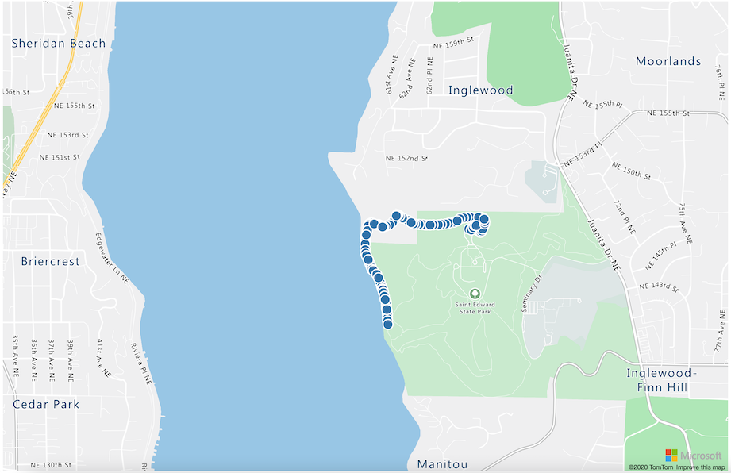

<!--
CO_OP_TRANSLATOR_METADATA:
{
  "original_hash": "9095c61445c2bca7245ef9b59a186a11",
  "translation_date": "2025-08-28T09:48:18+00:00",
  "source_file": "3-transport/lessons/3-visualize-location-data/README.md",
  "language_code": "ro"
}
-->
# Vizualizați datele de locație


> Prezentare grafică de [Nitya Narasimhan](https://github.com/nitya). Faceți clic pe imagine pentru o versiune mai mare.

Acest videoclip oferă o prezentare generală a Azure Maps cu IoT, un serviciu care va fi acoperit în această lecție.

[](https://www.youtube.com/watch?v=P5i2GFTtb2s)

> 🎥 Faceți clic pe imaginea de mai sus pentru a viziona videoclipul

## Chestionar înainte de lecție

[Chestionar înainte de lecție](https://black-meadow-040d15503.1.azurestaticapps.net/quiz/25)

## Introducere

În lecția anterioară, ați învățat cum să obțineți date GPS de la senzori pentru a le salva în cloud într-un container de stocare folosind cod serverless. Acum veți descoperi cum să vizualizați acele puncte pe o hartă Azure. Veți învăța cum să creați o hartă pe o pagină web, să aflați despre formatul de date GeoJSON și cum să îl utilizați pentru a plota toate punctele GPS capturate pe harta voastră.

În această lecție vom acoperi:

* [Ce este vizualizarea datelor](../../../../../3-transport/lessons/3-visualize-location-data)
* [Servicii de hărți](../../../../../3-transport/lessons/3-visualize-location-data)
* [Crearea unei resurse Azure Maps](../../../../../3-transport/lessons/3-visualize-location-data)
* [Afișarea unei hărți pe o pagină web](../../../../../3-transport/lessons/3-visualize-location-data)
* [Formatul GeoJSON](../../../../../3-transport/lessons/3-visualize-location-data)
* [Plotarea datelor GPS pe o hartă folosind GeoJSON](../../../../../3-transport/lessons/3-visualize-location-data)

> 💁 Această lecție va implica o mică cantitate de HTML și JavaScript. Dacă doriți să aflați mai multe despre dezvoltarea web folosind HTML și JavaScript, consultați [Dezvoltare web pentru începători](https://github.com/microsoft/Web-Dev-For-Beginners).

## Ce este vizualizarea datelor

Vizualizarea datelor, așa cum sugerează numele, se referă la reprezentarea datelor în moduri care le fac mai ușor de înțeles pentru oameni. Este asociată de obicei cu grafice și diagrame, dar reprezintă orice modalitate de a reprezenta datele vizual pentru a ajuta oamenii să le înțeleagă mai bine și să ia decizii.

Luând un exemplu simplu - în proiectul de fermă ați capturat setările de umiditate a solului. Un tabel cu datele de umiditate a solului capturate în fiecare oră pentru 1 iunie 2021 ar putea arăta astfel:

| Data             | Citire  |
| ---------------- | ------: |
| 01/06/2021 00:00 |     257 |
| 01/06/2021 01:00 |     268 |
| 01/06/2021 02:00 |     295 |
| 01/06/2021 03:00 |     305 |
| 01/06/2021 04:00 |     325 |
| 01/06/2021 05:00 |     359 |
| 01/06/2021 06:00 |     398 |
| 01/06/2021 07:00 |     410 |
| 01/06/2021 08:00 |     429 |
| 01/06/2021 09:00 |     451 |
| 01/06/2021 10:00 |     460 |
| 01/06/2021 11:00 |     452 |
| 01/06/2021 12:00 |     420 |
| 01/06/2021 13:00 |     408 |
| 01/06/2021 14:00 |     431 |
| 01/06/2021 15:00 |     462 |
| 01/06/2021 16:00 |     432 |
| 01/06/2021 17:00 |     402 |
| 01/06/2021 18:00 |     387 |
| 01/06/2021 19:00 |     360 |
| 01/06/2021 20:00 |     358 |
| 01/06/2021 21:00 |     354 |
| 01/06/2021 22:00 |     356 |
| 01/06/2021 23:00 |     362 |

Pentru un om, înțelegerea acestor date poate fi dificilă. Este un perete de numere fără sens. Ca prim pas pentru vizualizarea acestor date, ele pot fi reprezentate pe un grafic liniar:


Acesta poate fi îmbunătățit prin adăugarea unei linii care indică momentul în care sistemul automat de irigare a fost activat la o citire de umiditate a solului de 450:


Acest grafic arată foarte rapid nu doar nivelurile de umiditate ale solului, ci și punctele în care sistemul de irigare a fost activat.

Graficele nu sunt singurul instrument pentru vizualizarea datelor. Dispozitivele IoT care urmăresc condițiile meteorologice pot avea aplicații web sau mobile care vizualizează condițiile meteorologice folosind simboluri, cum ar fi un simbol de nor pentru zilele înnorate, un nor de ploaie pentru zilele ploioase și așa mai departe. Există o mulțime de modalități de a vizualiza datele, unele serioase, altele distractive.

✅ Gândiți-vă la modalitățile în care ați văzut datele vizualizate. Care metode au fost cele mai clare și v-au permis să luați decizii cel mai rapid?

Cele mai bune vizualizări permit oamenilor să ia decizii rapid. De exemplu, a avea un perete de indicatoare care arată tot felul de citiri de la mașinile industriale este greu de procesat, dar o lumină roșie intermitentă atunci când ceva nu funcționează permite unei persoane să ia o decizie. Uneori, cea mai bună vizualizare este o lumină intermitentă!

Când lucrați cu date GPS, cea mai clară vizualizare poate fi să plotați datele pe o hartă. O hartă care arată camioanele de livrare, de exemplu, poate ajuta lucrătorii de la o fabrică de procesare să vadă când vor ajunge camioanele. Dacă această hartă arată mai mult decât doar imagini ale camioanelor în locațiile lor actuale, dar oferă o idee despre conținutul unui camion, atunci lucrătorii de la fabrică pot planifica în consecință - dacă văd un camion frigorific aproape, știu să pregătească spațiu într-un frigider.

## Servicii de hărți

Lucrul cu hărți este un exercițiu interesant, iar opțiunile sunt numeroase, cum ar fi Bing Maps, Leaflet, Open Street Maps și Google Maps. În această lecție, veți învăța despre [Azure Maps](https://azure.microsoft.com/services/azure-maps/?WT.mc_id=academic-17441-jabenn) și cum pot afișa datele voastre GPS.


Azure Maps este "o colecție de servicii geospațiale și SDK-uri care utilizează date de cartografiere actualizate pentru a oferi context geografic aplicațiilor web și mobile." Dezvoltatorii sunt furnizați cu instrumente pentru a crea hărți frumoase, interactive, care pot face lucruri precum oferirea de rute de trafic recomandate, informații despre incidente de trafic, navigare interioară, capacități de căutare, informații despre altitudine, servicii meteorologice și multe altele.

✅ Experimentați cu câteva [exemple de cod pentru hărți](https://docs.microsoft.com/samples/browse?WT.mc_id=academic-17441-jabenn&products=azure-maps)

Puteți afișa hărțile ca o pânză goală, imagini satelitare, imagini satelitare cu drumuri suprapuse, diverse tipuri de hărți în tonuri de gri, hărți cu relief umbrit pentru a arăta altitudinea, hărți de noapte și o hartă cu contrast ridicat. Puteți obține actualizări în timp real pe hărțile voastre prin integrarea lor cu [Azure Event Grid](https://azure.microsoft.com/services/event-grid/?WT.mc_id=academic-17441-jabenn). Puteți controla comportamentul și aspectul hărților voastre activând diverse controale pentru a permite hărții să reacționeze la evenimente precum pinch, drag și click. Pentru a controla aspectul hărții, puteți adăuga straturi care includ bule, linii, poligoane, hărți de căldură și altele. Stilul hărții pe care îl implementați depinde de alegerea SDK-ului.

Puteți accesa API-urile Azure Maps utilizând [REST API](https://docs.microsoft.com/javascript/api/azure-maps-rest/?WT.mc_id=academic-17441-jabenn&view=azure-maps-typescript-latest), [Web SDK](https://docs.microsoft.com/azure/azure-maps/how-to-use-map-control?WT.mc_id=academic-17441-jabenn) sau, dacă construiți o aplicație mobilă, [Android SDK](https://docs.microsoft.com/azure/azure-maps/how-to-use-android-map-control-library?WT.mc_id=academic-17441-jabenn&pivots=programming-language-java-android).

În această lecție, veți utiliza Web SDK pentru a desena o hartă și a afișa traseul locațiilor GPS ale senzorului vostru.

## Crearea unei resurse Azure Maps

Primul pas este să creați un cont Azure Maps.

### Sarcină - creați o resursă Azure Maps

1. Rulați următoarea comandă din Terminal sau Command Prompt pentru a crea o resursă Azure Maps în grupul de resurse `gps-sensor`:

    ```sh
    az maps account create --name gps-sensor \
                           --resource-group gps-sensor \
                           --accept-tos \
                           --sku S1
    ```

    Aceasta va crea o resursă Azure Maps numită `gps-sensor`. Nivelul utilizat este `S1`, care este un nivel plătit ce include o gamă de funcții, dar cu un număr generos de apeluri gratuite.

    > 💁 Pentru a vedea costul utilizării Azure Maps, consultați [pagina de prețuri Azure Maps](https://azure.microsoft.com/pricing/details/azure-maps/?WT.mc_id=academic-17441-jabenn).

1. Veți avea nevoie de o cheie API pentru resursa de hărți. Utilizați următoarea comandă pentru a obține această cheie:

    ```sh
    az maps account keys list --name gps-sensor \
                              --resource-group gps-sensor \
                              --output table
    ```

    Luați o copie a valorii `PrimaryKey`.

## Afișarea unei hărți pe o pagină web

Acum puteți face următorul pas, care este să afișați harta pe o pagină web. Vom folosi doar un fișier `html` pentru mica voastră aplicație web; țineți cont că într-un mediu de producție sau echipă, aplicația voastră web va avea probabil mai multe componente!

### Sarcină - afișați o hartă pe o pagină web

1. Creați un fișier numit index.html într-un folder undeva pe computerul vostru local. Adăugați marcaj HTML pentru a ține o hartă:

    ```html
    <html>
    <head>
        <style>
            #myMap {
                width:100%;
                height:100%;
            }
        </style>
    </head>
    
    <body onload="init()">
        <div id="myMap"></div>
    </body>
    </html>
    ```

    Harta se va încărca în `div`-ul `myMap`. Câteva stiluri permit să se întindă pe lățimea și înălțimea paginii.

    > 🎓 un `div` este o secțiune a unei pagini web care poate fi numită și stilizată.

1. Sub eticheta de deschidere `<head>`, adăugați o foaie de stil externă pentru a controla afișarea hărții și un script extern din Web SDK pentru a gestiona comportamentul acesteia:

    ```html
    <link rel="stylesheet" href="https://atlas.microsoft.com/sdk/javascript/mapcontrol/2/atlas.min.css" type="text/css" />
    <script src="https://atlas.microsoft.com/sdk/javascript/mapcontrol/2/atlas.min.js"></script>
    ```

    Această foaie de stil conține setările pentru cum arată harta, iar fișierul script conține cod pentru a încărca harta. Adăugarea acestui cod este similară cu includerea fișierelor header C++ sau importarea modulelor Python.

1. Sub acel script, adăugați un bloc de script pentru a lansa harta.

    ```javascript
    <script type='text/javascript'>
        function init() {
            var map = new atlas.Map('myMap', {
                center: [-122.26473, 47.73444],
                zoom: 12,
                authOptions: {
                    authType: "subscriptionKey",
                    subscriptionKey: "<subscription_key>",

                }
            });
        }
    </script>
    ```

    Înlocuiți `<subscription_key>` cu cheia API pentru contul vostru Azure Maps.

    Dacă deschideți pagina `index.html` într-un browser web, ar trebui să vedeți o hartă încărcată, concentrată pe zona Seattle.

    

    ✅ Experimentați cu parametrii de zoom și centru pentru a schimba afișarea hărții. Puteți adăuga coordonate diferite corespunzătoare latitudinii și longitudinii datelor voastre pentru a re-centra harta.

> 💁 O modalitate mai bună de a lucra cu aplicații web local este să instalați [http-server](https://www.npmjs.com/package/http-server). Veți avea nevoie de [node.js](https://nodejs.org/) și [npm](https://www.npmjs.com/) instalate înainte de a utiliza acest instrument. Odată ce aceste instrumente sunt instalate, puteți naviga la locația fișierului vostru `index.html` și să tastați `http-server`. Aplicația web se va deschide pe un server web local [http://127.0.0.1:8080/](http://127.0.0.1:8080/).

## Formatul GeoJSON

Acum că aveți aplicația web configurată cu harta afișată, trebuie să extrageți datele GPS din contul vostru de stocare și să le afișați într-un strat de marcatori deasupra hărții. Înainte de a face asta, să analizăm formatul [GeoJSON](https://wikipedia.org/wiki/GeoJSON) necesar de Azure Maps.

[GeoJSON](https://geojson.org/) este un standard deschis de specificație JSON cu formatare specială concepută pentru a gestiona datele specifice geografiei. Puteți învăța despre el testând datele de exemplu folosind [geojson.io](https://geojson.io), care este de asemenea un instrument util pentru a depana fișierele GeoJSON.

Datele GeoJSON de exemplu arată astfel:

```json
{
  "type": "FeatureCollection",
  "features": [
    {
      "type": "Feature",
      "geometry": {
        "type": "Point",
        "coordinates": [
          -2.10237979888916,
          57.164918677004714
        ]
      }
    }
  ]
}
```

De interes deosebit este modul în care datele sunt structurate ca un `Feature` în cadrul unui `FeatureCollection`. În cadrul acelui obiect se găsește `geometry` cu `coordinates` care indică latitudinea și longitudinea.

✅ Când construiți GeoJSON-ul vostru, acordați atenție ordinii `latitude` și `longitude` în obiect, altfel punctele voastre nu vor apărea unde ar trebui! GeoJSON așteaptă date în ordinea `lon,lat` pentru puncte, nu `lat,lon`.

`Geometry` poate avea diferite tipuri, cum ar fi un singur punct sau un poligon. În acest exemplu, este un punct cu două coordonate specificate, longitudinea și latitudinea.
✅ Azure Maps acceptă GeoJSON standard, plus câteva [funcționalități extinse](https://docs.microsoft.com/azure/azure-maps/extend-geojson?WT.mc_id=academic-17441-jabenn), inclusiv abilitatea de a desena cercuri și alte geometriei.

## Plotează date GPS pe o hartă folosind GeoJSON

Acum ești pregătit să utilizezi datele din spațiul de stocare pe care l-ai construit în lecția anterioară. Ca o reamintire, acestea sunt stocate sub formă de fișiere în blob storage, așa că va trebui să recuperezi fișierele și să le analizezi pentru ca Azure Maps să poată folosi datele.

### Sarcină - configurează spațiul de stocare pentru a fi accesat dintr-o pagină web

Dacă faci o cerere către spațiul de stocare pentru a prelua datele, s-ar putea să fii surprins să vezi erori apărând în consola browserului tău. Acest lucru se întâmplă deoarece trebuie să setezi permisiuni pentru [CORS](https://developer.mozilla.org/docs/Web/HTTP/CORS) pe acest spațiu de stocare pentru a permite aplicațiilor web externe să citească datele.

> 🎓 CORS înseamnă "Cross-Origin Resource Sharing" și, de obicei, trebuie setat explicit în Azure din motive de securitate. Acesta împiedică site-urile neașteptate să acceseze datele tale.

1. Rulează următoarea comandă pentru a activa CORS:

    ```sh
    az storage cors add --methods GET \
                        --origins "*" \
                        --services b \
                        --account-name <storage_name> \
                        --account-key <key1>
    ```

    Înlocuiește `<storage_name>` cu numele contului tău de stocare. Înlocuiește `<key1>` cu cheia contului tău de stocare.

    Această comandă permite oricărui site web (caracterul wildcard `*` înseamnă orice) să facă o cerere *GET*, adică să obțină date, din contul tău de stocare. `--services b` înseamnă că această setare se aplică doar pentru blobs.

### Sarcină - încarcă datele GPS din spațiul de stocare

1. Înlocuiește întregul conținut al funcției `init` cu următorul cod:

    ```javascript
    fetch("https://<storage_name>.blob.core.windows.net/gps-data/?restype=container&comp=list")
        .then(response => response.text())
        .then(str => new window.DOMParser().parseFromString(str, "text/xml"))
        .then(xml => {
            let blobList = Array.from(xml.querySelectorAll("Url"));
                blobList.forEach(async blobUrl => {
                    loadJSON(blobUrl.innerHTML)                
        });
    })
    .then( response => {
        map = new atlas.Map('myMap', {
            center: [-122.26473, 47.73444],
            zoom: 14,
            authOptions: {
                authType: "subscriptionKey",
                subscriptionKey: "<subscription_key>",
    
            }
        });
        map.events.add('ready', function () {
            var source = new atlas.source.DataSource();
            map.sources.add(source);
            map.layers.add(new atlas.layer.BubbleLayer(source));
            source.add(features);
        })
    })
    ```

    Înlocuiește `<storage_name>` cu numele contului tău de stocare. Înlocuiește `<subscription_key>` cu cheia API pentru contul tău Azure Maps.

    Se întâmplă mai multe lucruri aici. Mai întâi, codul preia datele GPS din containerul blob folosind un endpoint URL construit cu numele contului tău de stocare. Acest URL recuperează din `gps-data`, indicând că tipul resursei este un container (`restype=container`), și listează informații despre toate blob-urile. Această listă nu va returna blob-urile în sine, ci va returna un URL pentru fiecare blob care poate fi folosit pentru a încărca datele blob-ului.

    > 💁 Poți introduce acest URL în browserul tău pentru a vedea detalii despre toate blob-urile din containerul tău. Fiecare element va avea o proprietate `Url` pe care o poți încărca și în browser pentru a vedea conținutul blob-ului.

    Acest cod apoi încarcă fiecare blob, apelând o funcție `loadJSON`, care va fi creată în pasul următor. Apoi creează controlul hărții și adaugă cod la evenimentul `ready`. Acest eveniment este apelat când harta este afișată pe pagina web.

    Evenimentul `ready` creează o sursă de date Azure Maps - un container care conține date GeoJSON ce vor fi populate ulterior. Această sursă de date este apoi folosită pentru a crea un strat de bule - adică un set de cercuri pe hartă centrate pe fiecare punct din GeoJSON.

1. Adaugă funcția `loadJSON` în blocul tău de script, sub funcția `init`:

    ```javascript
    var map, features;

    function loadJSON(file) {
        var xhr = new XMLHttpRequest();
        features = [];
        xhr.onreadystatechange = function () {
            if (xhr.readyState === XMLHttpRequest.DONE) {
                if (xhr.status === 200) {
                    gps = JSON.parse(xhr.responseText)
                    features.push(
                        new atlas.data.Feature(new atlas.data.Point([parseFloat(gps.gps.lon), parseFloat(gps.gps.lat)]))
                    )
                }
            }
        };
        xhr.open("GET", file, true);
        xhr.send();
    }    
    ```

    Această funcție este apelată de rutina de preluare pentru a analiza datele JSON și a le converti pentru a fi citite ca coordonate longitudine și latitudine în format GeoJSON.
    După ce sunt analizate, datele sunt setate ca parte a unui `Feature` GeoJSON. Harta va fi inițializată și mici bule vor apărea de-a lungul traseului pe care datele tale îl plotează:

1. Încarcă pagina HTML în browserul tău. Aceasta va încărca harta, apoi va încărca toate datele GPS din spațiul de stocare și le va plota pe hartă.

    

> 💁 Poți găsi acest cod în [code](../../../../../3-transport/lessons/3-visualize-location-data/code) folder.

---

## 🚀 Provocare

Este plăcut să poți afișa date statice pe o hartă sub formă de marcatori. Poți îmbunătăți această aplicație web pentru a adăuga animație și a arăta traseul markerilor în timp, folosind fișierele JSON cu timestamp? Iată [câteva exemple](https://azuremapscodesamples.azurewebsites.net/) de utilizare a animației în hărți.

## Test de verificare după lecție

[Test de verificare după lecție](https://black-meadow-040d15503.1.azurestaticapps.net/quiz/26)

## Recapitulare și studiu individual

Azure Maps este deosebit de util pentru lucrul cu dispozitive IoT.

* Cercetează câteva dintre utilizările în [documentația Azure Maps pe Microsoft docs](https://docs.microsoft.com/azure/azure-maps/tutorial-iot-hub-maps?WT.mc_id=academic-17441-jabenn).
* Aprofundează-ți cunoștințele despre crearea hărților și punctelor de referință cu [modulul de învățare ghidat "creați prima aplicație de găsire a traseului cu Azure Maps" pe Microsoft Learn](https://docs.microsoft.com/learn/modules/create-your-first-app-with-azure-maps/?WT.mc_id=academic-17441-jabenn).

## Temă

[Deploiază aplicația ta](assignment.md)

---

**Declinare de responsabilitate**:  
Acest document a fost tradus folosind serviciul de traducere AI [Co-op Translator](https://github.com/Azure/co-op-translator). Deși ne străduim să asigurăm acuratețea, vă rugăm să fiți conștienți că traducerile automate pot conține erori sau inexactități. Documentul original în limba sa natală ar trebui considerat sursa autoritară. Pentru informații critice, se recomandă traducerea profesională realizată de un specialist uman. Nu ne asumăm responsabilitatea pentru eventualele neînțelegeri sau interpretări greșite care pot apărea din utilizarea acestei traduceri.