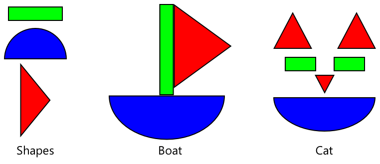

<!--
CO_OP_TRANSLATOR_METADATA:
{
  "original_hash": "f5e63c916d2dd97d58be12aaf76bd9f1",
  "translation_date": "2025-08-28T08:17:53+00:00",
  "source_file": "4-manufacturing/lessons/1-train-fruit-detector/README.md",
  "language_code": "ro"
}
-->
# Antrenează un detector de calitate a fructelor


> Prezentare grafică de [Nitya Narasimhan](https://github.com/nitya). Click pe imagine pentru o versiune mai mare.

Acest videoclip oferă o prezentare generală a serviciului Azure Custom Vision, un serviciu care va fi acoperit în această lecție.

[](https://www.youtube.com/watch?v=TETcDLJlWR4)

> 🎥 Click pe imaginea de mai sus pentru a urmări videoclipul

## Chestionar înainte de lecție

[Chestionar înainte de lecție](https://black-meadow-040d15503.1.azurestaticapps.net/quiz/29)

## Introducere

Creșterea recentă a Inteligenței Artificiale (AI) și a Învățării Automate (ML) oferă o gamă largă de capabilități dezvoltatorilor de astăzi. Modelele ML pot fi antrenate să recunoască diferite lucruri în imagini, inclusiv fructele necoapte, iar acest lucru poate fi utilizat în dispozitive IoT pentru a ajuta la sortarea produselor fie în timpul recoltării, fie în timpul procesării în fabrici sau depozite.

În această lecție vei învăța despre clasificarea imaginilor - utilizarea modelelor ML pentru a distinge între imagini cu lucruri diferite. Vei învăța cum să antrenezi un clasificator de imagini pentru a distinge între fructele bune și cele de calitate slabă, fie că sunt prea coapte, lovite sau stricate.

În această lecție vom acoperi:

* [Utilizarea AI și ML pentru sortarea alimentelor](../../../../../4-manufacturing/lessons/1-train-fruit-detector)
* [Clasificarea imaginilor prin Învățare Automată](../../../../../4-manufacturing/lessons/1-train-fruit-detector)
* [Antrenarea unui clasificator de imagini](../../../../../4-manufacturing/lessons/1-train-fruit-detector)
* [Testarea clasificatorului de imagini](../../../../../4-manufacturing/lessons/1-train-fruit-detector)
* [Reantrenarea clasificatorului de imagini](../../../../../4-manufacturing/lessons/1-train-fruit-detector)

## Utilizarea AI și ML pentru sortarea alimentelor

Hrănirea populației globale este dificilă, mai ales la un preț care să facă alimentele accesibile pentru toți. Unul dintre cele mai mari costuri este cel al forței de muncă, așa că fermierii se îndreaptă din ce în ce mai mult către automatizare și instrumente precum IoT pentru a reduce costurile cu forța de muncă. Recoltarea manuală este intensivă din punct de vedere al muncii (și adesea o muncă istovitoare) și este înlocuită de mașini, mai ales în țările mai bogate. În ciuda economiilor de costuri obținute prin utilizarea mașinilor pentru recoltare, există un dezavantaj - capacitatea de a sorta alimentele în timpul recoltării.

Nu toate culturile se coc uniform. Roșiile, de exemplu, pot avea încă fructe verzi pe viță atunci când majoritatea sunt gata de recoltare. Deși este o risipă să recoltezi aceste fructe prea devreme, este mai ieftin și mai ușor pentru fermier să recolteze totul folosind mașini și să elimine ulterior produsele necoapte.

✅ Uită-te la diferite fructe sau legume, fie că cresc în fermele sau grădinile din apropierea ta, fie în magazine. Sunt toate la același nivel de coacere sau observi variații?

Creșterea recoltării automatizate a mutat sortarea produselor din timpul recoltării în fabrici. Alimentele circulau pe benzi transportoare lungi, cu echipe de oameni care verificau produsele și eliminau orice nu corespundea standardelor de calitate necesare. Recoltarea era mai ieftină datorită mașinilor, dar exista încă un cost pentru sortarea manuală a alimentelor.


Evoluția următoare a fost utilizarea mașinilor pentru sortare, fie integrate în combinele de recoltare, fie în fabricile de procesare. Prima generație a acestor mașini folosea senzori optici pentru a detecta culorile, controlând actuatoare care împingeau roșiile verzi într-un coș de deșeuri folosind pârghii sau jeturi de aer, lăsând roșiile roșii să continue pe o rețea de benzi transportoare.

În acest videoclip, pe măsură ce roșiile cad de pe o bandă transportoare pe alta, roșiile verzi sunt detectate și aruncate într-un coș folosind pârghii.

✅ Ce condiții ar fi necesare într-o fabrică sau pe câmp pentru ca acești senzori optici să funcționeze corect?

Cele mai recente evoluții ale acestor mașini de sortare profită de AI și ML, utilizând modele antrenate să distingă produsele bune de cele rele, nu doar prin diferențe evidente de culoare, cum ar fi roșiile verzi vs roșiile roșii, ci și prin diferențe mai subtile de aspect care pot indica boli sau lovituri.

## Clasificarea imaginilor prin Învățare Automată

Programarea tradițională presupune să iei date, să aplici un algoritm asupra lor și să obții un rezultat. De exemplu, în proiectul anterior ai luat coordonate GPS și o geofence, ai aplicat un algoritm furnizat de Azure Maps și ai obținut un rezultat care indica dacă punctul era în interiorul sau în afara geofence-ului. Introduci mai multe date, obții mai multe rezultate.


Învățarea automată schimbă acest proces - începi cu date și rezultate cunoscute, iar algoritmul de învățare automată învață din date. Poți apoi să iei acest algoritm antrenat, numit *model de învățare automată* sau *model*, și să introduci date noi pentru a obține rezultate noi.

> 🎓 Procesul prin care un algoritm de învățare automată învață din date se numește *antrenare*. Datele de intrare și rezultatele cunoscute se numesc *date de antrenare*.

De exemplu, ai putea oferi unui model milioane de imagini cu banane necoapte ca date de intrare pentru antrenare, cu rezultatul de antrenare setat ca `necoapte`, și milioane de imagini cu banane coapte ca date de antrenare cu rezultatul setat ca `coapte`. Algoritmul ML va crea apoi un model bazat pe aceste date. Apoi îi oferi acestui model o imagine nouă cu o banană, iar el va prezice dacă imaginea nouă este o banană coaptă sau necoaptă.

> 🎓 Rezultatele modelelor ML se numesc *predicții*


Modelele ML nu oferă un răspuns binar, ci oferă probabilități. De exemplu, un model poate primi o imagine cu o banană și poate prezice `coaptă` cu 99.7% și `necoaptă` cu 0.3%. Codul tău ar alege apoi cea mai bună predicție și ar decide că banana este coaptă.

Modelul ML utilizat pentru a detecta imagini de acest tip se numește *clasificator de imagini* - primește imagini etichetate și apoi clasifică imagini noi pe baza acestor etichete.

> 💁 Aceasta este o simplificare excesivă, iar există multe alte moduri de a antrena modele care nu necesită întotdeauna rezultate etichetate, cum ar fi învățarea nesupravegheată. Dacă vrei să afli mai multe despre ML, consultă [ML pentru începători, un curriculum de 24 de lecții despre Învățarea Automată](https://aka.ms/ML-beginners).

## Antrenarea unui clasificator de imagini

Pentru a antrena cu succes un clasificator de imagini, ai nevoie de milioane de imagini. Totuși, odată ce ai un clasificator de imagini antrenat pe milioane sau miliarde de imagini diverse, îl poți reutiliza și reantrena folosind un set mic de imagini și obține rezultate excelente, utilizând un proces numit *transfer de învățare*.

> 🎓 Transferul de învățare este procesul prin care transferi învățarea unui model ML existent către un nou model bazat pe date noi.

Odată ce un clasificator de imagini a fost antrenat pentru o gamă largă de imagini, structura sa internă este excelentă la recunoașterea formelor, culorilor și modelelor. Transferul de învățare permite modelului să folosească ceea ce a învățat deja despre recunoașterea părților unei imagini și să folosească acest lucru pentru a recunoaște imagini noi.



Poți considera acest lucru ca fiind similar cu cărțile pentru copii despre forme, unde odată ce poți recunoaște un semicerc, un dreptunghi și un triunghi, poți recunoaște o barcă cu pânze sau o pisică, în funcție de configurația acestor forme. Clasificatorul de imagini poate recunoaște formele, iar transferul de învățare îl învață ce combinație formează o barcă sau o pisică - sau o banană coaptă.

Există o gamă largă de instrumente care te pot ajuta să faci acest lucru, inclusiv servicii bazate pe cloud care te pot ajuta să îți antrenezi modelul și să îl utilizezi prin intermediul API-urilor web.

> 💁 Antrenarea acestor modele necesită multă putere de calcul, de obicei prin intermediul Unităților de Procesare Grafică (GPU). Același hardware specializat care face ca jocurile de pe Xbox-ul tău să arate uimitor poate fi folosit și pentru a antrena modele de învățare automată. Prin utilizarea cloud-ului, poți închiria timp pe computere puternice cu GPU-uri pentru a antrena aceste modele, având acces la puterea de calcul necesară doar pentru perioada de timp de care ai nevoie.

## Custom Vision

Custom Vision este un instrument bazat pe cloud pentru antrenarea clasificatorilor de imagini. Acesta îți permite să antrenezi un clasificator folosind doar un număr mic de imagini. Poți încărca imagini printr-un portal web, API web sau un SDK, oferind fiecărei imagini o *etichetă* care reprezintă clasificarea acelei imagini. Apoi antrenezi modelul și îl testezi pentru a vedea cât de bine funcționează. Odată ce ești mulțumit de model, poți publica versiuni ale acestuia care pot fi accesate printr-un API web sau un SDK.


> 💁 Poți antrena un model Custom Vision cu doar 5 imagini pe clasificare, dar mai multe imagini sunt mai bune. Poți obține rezultate mai bune cu cel puțin 30 de imagini.

Custom Vision face parte dintr-o gamă de instrumente AI de la Microsoft numite Cognitive Services. Acestea sunt instrumente AI care pot fi utilizate fie fără nicio pregătire, fie cu o cantitate mică de pregătire. Ele includ recunoașterea și traducerea vorbirii, înțelegerea limbajului și analiza imaginilor. Acestea sunt disponibile cu un nivel gratuit ca servicii în Azure.

> 💁 Nivelul gratuit este mai mult decât suficient pentru a crea un model, a-l antrena și a-l utiliza pentru lucrări de dezvoltare. Poți citi despre limitele nivelului gratuit pe [pagina Limits and quotas pentru Custom Vision din documentația Microsoft](https://docs.microsoft.com/azure/cognitive-services/custom-vision-service/limits-and-quotas?WT.mc_id=academic-17441-jabenn).

### Sarcină - creează o resursă Cognitive Services

Pentru a utiliza Custom Vision, mai întâi trebuie să creezi două resurse Cognitive Services în Azure folosind Azure CLI, una pentru antrenarea Custom Vision și alta pentru predicția Custom Vision.

1. Creează un Resource Group pentru acest proiect numit `fruit-quality-detector`.

1. Folosește următoarea comandă pentru a crea o resursă gratuită de antrenare Custom Vision:

    ```sh
    az cognitiveservices account create --name fruit-quality-detector-training \
                                        --resource-group fruit-quality-detector \
                                        --kind CustomVision.Training \
                                        --sku F0 \
                                        --yes \
                                        --location <location>
    ```

    Înlocuiește `<location>` cu locația pe care ai utilizat-o atunci când ai creat Resource Group.

    Aceasta va crea o resursă de antrenare Custom Vision în Resource Group-ul tău. Se va numi `fruit-quality-detector-training` și va utiliza SKU-ul `F0`, care este nivelul gratuit. Opțiunea `--yes` înseamnă că ești de acord cu termenii și condițiile serviciilor cognitive.

> 💁 Folosește SKU-ul `S0` dacă ai deja un cont gratuit care utilizează oricare dintre serviciile Cognitive Services.

1. Folosește următoarea comandă pentru a crea o resursă gratuită de predicție Custom Vision:

    ```sh
    az cognitiveservices account create --name fruit-quality-detector-prediction \
                                        --resource-group fruit-quality-detector \
                                        --kind CustomVision.Prediction \
                                        --sku F0 \
                                        --yes \
                                        --location <location>
    ```

    Înlocuiește `<location>` cu locația pe care ai utilizat-o atunci când ai creat Resource Group.

    Aceasta va crea o resursă de predicție Custom Vision în Resource Group-ul tău. Se va numi `fruit-quality-detector-prediction` și va utiliza SKU-ul `F0`, care este nivelul gratuit. Opțiunea `--yes` înseamnă că ești de acord cu termenii și condițiile serviciilor cognitive.

### Sarcină - creează un proiect de clasificator de imagini

1. Accesează portalul Custom Vision la [CustomVision.ai](https://customvision.ai) și autentifică-te cu contul Microsoft pe care l-ai utilizat pentru contul tău Azure.

1. Urmează [secțiunea de creare a unui proiect nou din ghidul rapid pentru construirea unui clasificator din documentația Microsoft](https://docs.microsoft.com/azure/cognitive-services/custom-vision-service/getting-started-build-a-classifier?WT.mc_id=academic-17441-jabenn#create-a-new-project) pentru a crea un nou proiect Custom Vision. Interfața utilizatorului poate suferi modificări, iar această documentație este întotdeauna cea mai actualizată referință.

    Denumește proiectul tău `fruit-quality-detector`.

    Când creezi proiectul, asigură-te că utilizezi resursa `fruit-quality-detector-training` pe care ai creat-o anterior. Folosește un tip de proiect *Classification*, un tip de clasificare *Multiclass* și domeniul *Food*.

    

✅ Acordă-ți timp pentru a explora interfața utilizatorului Custom Vision pentru clasificatorul tău de imagini.

### Sarcină - antrenează proiectul tău de clasificator de imagini

Pentru a antrena un clasificator de imagini, vei avea nevoie de mai multe imagini cu fructe, atât de calitate bună, cât și de calitate slabă, pentru a le eticheta ca fiind bune sau rele, cum ar fi o banană coaptă și una prea coaptă.
💁 Aceste clasificatoare pot clasifica imagini cu orice, așa că, dacă nu ai la îndemână fructe de calități diferite, poți folosi două tipuri diferite de fructe sau chiar pisici și câini!
Imaginile ar trebui să conțină doar fructul, fie cu un fundal consistent, fie cu o varietate largă de fundaluri. Asigurați-vă că nu există nimic în fundal care să indice dacă fructul este copt sau necopt.

> 💁 Este important să nu existe fundaluri specifice sau obiecte care nu sunt legate de ceea ce este clasificat pentru fiecare etichetă, altfel clasificatorul ar putea clasifica doar pe baza fundalului. A existat un clasificator pentru cancerul de piele care a fost antrenat pe imagini cu alunițe normale și canceroase, iar cele canceroase aveau toate rigle lângă ele pentru a măsura dimensiunea. S-a dovedit că clasificatorul era aproape 100% precis în identificarea riglelor din imagini, nu a alunițelor canceroase.

Clasificatoarele de imagini funcționează la o rezoluție foarte mică. De exemplu, Custom Vision poate accepta imagini de antrenament și predicție de până la 10240x10240, dar antrenează și rulează modelul pe imagini la 227x227. Imaginile mai mari sunt micșorate la această dimensiune, așa că asigurați-vă că obiectul pe care îl clasificați ocupă o parte mare din imagine, altfel ar putea fi prea mic în imaginea redimensionată utilizată de clasificator.

1. Adunați imagini pentru clasificatorul dvs. Veți avea nevoie de cel puțin 5 imagini pentru fiecare etichetă pentru a antrena clasificatorul, dar cu cât mai multe, cu atât mai bine. Veți avea nevoie și de câteva imagini suplimentare pentru a testa clasificatorul. Aceste imagini ar trebui să fie diferite, dar să reprezinte același lucru. De exemplu:

    * Folosind 2 banane coapte, faceți câteva poze cu fiecare din unghiuri diferite, realizând cel puțin 7 poze (5 pentru antrenament, 2 pentru testare), dar ideal mai multe.

        

    * Repetați același proces folosind 2 banane necoapte.

    Ar trebui să aveți cel puțin 10 imagini pentru antrenament, cu cel puțin 5 coapte și 5 necoapte, și 4 imagini pentru testare, 2 coapte și 2 necoapte. Imaginile dvs. ar trebui să fie în format png sau jpeg, mai mici de 6MB. Dacă le creați, de exemplu, cu un iPhone, acestea ar putea fi imagini HEIC de înaltă rezoluție, așa că va trebui să fie convertite și, posibil, micșorate. Cu cât mai multe imagini, cu atât mai bine, și ar trebui să aveți un număr similar de imagini coapte și necoapte.

    Dacă nu aveți atât fructe coapte, cât și necoapte, puteți folosi fructe diferite sau orice alte două obiecte disponibile. De asemenea, puteți găsi câteva imagini exemplu în folderul [images](../../../../../4-manufacturing/lessons/1-train-fruit-detector/images) cu banane coapte și necoapte pe care le puteți utiliza.

1. Urmați secțiunea [upload and tag images din ghidul rapid pentru construirea unui clasificator din documentația Microsoft](https://docs.microsoft.com/azure/cognitive-services/custom-vision-service/getting-started-build-a-classifier?WT.mc_id=academic-17441-jabenn#upload-and-tag-images) pentru a încărca imaginile de antrenament. Etichetați fructele coapte ca `ripe` și cele necoapte ca `unripe`.

    

1. Urmați secțiunea [train the classifier din ghidul rapid pentru construirea unui clasificator din documentația Microsoft](https://docs.microsoft.com/azure/cognitive-services/custom-vision-service/getting-started-build-a-classifier?WT.mc_id=academic-17441-jabenn#train-the-classifier) pentru a antrena clasificatorul de imagini pe imaginile încărcate.

    Vi se va oferi o opțiune de tip de antrenament. Selectați **Quick Training**.

Clasificatorul va începe antrenamentul. Acesta va dura câteva minute pentru a se finaliza.

> 🍌 Dacă decideți să mâncați fructele în timp ce clasificatorul se antrenează, asigurați-vă mai întâi că aveți suficiente imagini pentru testare!

## Testați clasificatorul de imagini

După ce clasificatorul este antrenat, îl puteți testa oferindu-i o imagine nouă pentru clasificare.

### Sarcină - testați clasificatorul de imagini

1. Urmați secțiunea [test your model din documentația Microsoft](https://docs.microsoft.com/azure/cognitive-services/custom-vision-service/test-your-model?WT.mc_id=academic-17441-jabenn#test-your-model) pentru a testa clasificatorul de imagini. Utilizați imaginile de testare create anterior, nu pe cele utilizate pentru antrenament.

    

1. Încercați toate imaginile de testare pe care le aveți și observați probabilitățile.

## Reantrenați clasificatorul de imagini

Când testați clasificatorul, este posibil să nu obțineți rezultatele așteptate. Clasificatoarele de imagini folosesc învățarea automată pentru a face predicții despre ceea ce este într-o imagine, pe baza probabilităților că anumite caracteristici ale unei imagini corespund unei anumite etichete. Nu înțelege ce este în imagine - nu știe ce este o banană sau ce face ca o banană să fie o banană și nu o barcă. Puteți îmbunătăți clasificatorul reantrenându-l cu imaginile pe care le clasifică greșit.

De fiecare dată când faceți o predicție folosind opțiunea de testare rapidă, imaginea și rezultatele sunt stocate. Puteți utiliza aceste imagini pentru a reantrena modelul.

### Sarcină - reantrenați clasificatorul de imagini

1. Urmați secțiunea [use the predicted image for training din documentația Microsoft](https://docs.microsoft.com/azure/cognitive-services/custom-vision-service/test-your-model?WT.mc_id=academic-17441-jabenn#use-the-predicted-image-for-training) pentru a reantrena modelul, utilizând eticheta corectă pentru fiecare imagine.

1. După ce modelul a fost reantrenat, testați-l pe imagini noi.

---

## 🚀 Provocare

Ce credeți că s-ar întâmpla dacă ați folosi o imagine cu o căpșună pentru un model antrenat pe banane, sau o imagine cu o banană gonflabilă, sau o persoană într-un costum de banană, sau chiar un personaj galben de desene animate, cum ar fi cineva din Familia Simpson?

Încercați și vedeți care sunt predicțiile. Puteți găsi imagini pentru a încerca folosind [Bing Image search](https://www.bing.com/images/trending).

## Chestionar post-lectură

[Chestionar post-lectură](https://black-meadow-040d15503.1.azurestaticapps.net/quiz/30)

## Recapitulare și studiu individual

* Când ați antrenat clasificatorul, ați văzut valori pentru *Precizie*, *Recall* și *AP* care evaluează modelul creat. Citiți despre ce înseamnă aceste valori utilizând secțiunea [evaluate the classifier din ghidul rapid pentru construirea unui clasificator din documentația Microsoft](https://docs.microsoft.com/azure/cognitive-services/custom-vision-service/getting-started-build-a-classifier?WT.mc_id=academic-17441-jabenn#evaluate-the-classifier)
* Citiți despre cum să îmbunătățiți clasificatorul din secțiunea [how to improve your Custom Vision model din documentația Microsoft](https://docs.microsoft.com/azure/cognitive-services/custom-vision-service/getting-started-improving-your-classifier?WT.mc_id=academic-17441-jabenn)

## Temă

[Antrenați clasificatorul pentru mai multe fructe și legume](assignment.md)

---

**Declinarea responsabilității**:  
Acest document a fost tradus utilizând serviciul de traducere AI [Co-op Translator](https://github.com/Azure/co-op-translator). Deși depunem eforturi pentru a asigura acuratețea, vă rugăm să aveți în vedere că traducerile automate pot conține erori sau inexactități. Documentul original în limba sa nativă ar trebui considerat sursa autoritară. Pentru informații critice, se recomandă traducerea profesională realizată de un specialist uman. Nu ne asumăm răspunderea pentru eventualele neînțelegeri sau interpretări greșite care pot apărea din utilizarea acestei traduceri.