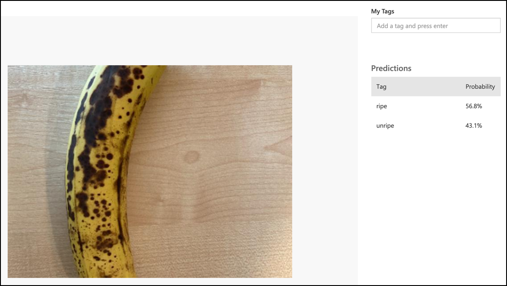

<!--
CO_OP_TRANSLATOR_METADATA:
{
  "original_hash": "e5896207b304ce1abaf065b8acc0cc79",
  "translation_date": "2025-08-28T08:47:51+00:00",
  "source_file": "4-manufacturing/lessons/2-check-fruit-from-device/single-board-computer-classify-image.md",
  "language_code": "ro"
}
-->
# Clasificarea unei imagini - Hardware IoT virtual și Raspberry Pi

În această parte a lecției, vei trimite imaginea capturată de cameră către serviciul Custom Vision pentru a o clasifica.

## Trimiterea imaginilor către Custom Vision

Serviciul Custom Vision are un SDK Python pe care îl poți folosi pentru a clasifica imagini.

### Sarcină - trimiterea imaginilor către Custom Vision

1. Deschide folderul `fruit-quality-detector` în VS Code. Dacă folosești un dispozitiv IoT virtual, asigură-te că mediul virtual este activ în terminal.

1. SDK-ul Python pentru trimiterea imaginilor către Custom Vision este disponibil ca un pachet Pip. Instalează-l cu următoarea comandă:

    ```sh
    pip3 install azure-cognitiveservices-vision-customvision
    ```

1. Adaugă următoarele declarații de import în partea de sus a fișierului `app.py`:

    ```python
    from msrest.authentication import ApiKeyCredentials
    from azure.cognitiveservices.vision.customvision.prediction import CustomVisionPredictionClient
    ```

    Acestea aduc câteva module din bibliotecile Custom Vision, unul pentru autentificare cu cheia de predicție și altul pentru a furniza o clasă client de predicție care poate apela Custom Vision.

1. Adaugă următorul cod la sfârșitul fișierului:

    ```python
    prediction_url = '<prediction_url>'
    prediction_key = '<prediction key>'
    ```

    Înlocuiește `<prediction_url>` cu URL-ul pe care l-ai copiat din dialogul *Prediction URL* mai devreme în această lecție. Înlocuiește `<prediction key>` cu cheia de predicție pe care ai copiat-o din același dialog.

1. URL-ul de predicție furnizat de dialogul *Prediction URL* este conceput pentru a fi utilizat atunci când se apelează direct endpoint-ul REST. SDK-ul Python folosește părți ale URL-ului în locuri diferite. Adaugă următorul cod pentru a descompune acest URL în părțile necesare:

    ```python
    parts = prediction_url.split('/')
    endpoint = 'https://' + parts[2]
    project_id = parts[6]
    iteration_name = parts[9]
    ```

    Acest cod împarte URL-ul, extrăgând endpoint-ul `https://<location>.api.cognitive.microsoft.com`, ID-ul proiectului și numele iterației publicate.

1. Creează un obiect predictor pentru a efectua predicția cu următorul cod:

    ```python
    prediction_credentials = ApiKeyCredentials(in_headers={"Prediction-key": prediction_key})
    predictor = CustomVisionPredictionClient(endpoint, prediction_credentials)
    ```

    `prediction_credentials` înfășoară cheia de predicție. Acestea sunt apoi utilizate pentru a crea un obiect client de predicție care indică endpoint-ul.

1. Trimite imaginea către Custom Vision folosind următorul cod:

    ```python
    image.seek(0)
    results = predictor.classify_image(project_id, iteration_name, image)
    ```

    Acest cod derulează imaginea înapoi la început, apoi o trimite către clientul de predicție.

1. În cele din urmă, afișează rezultatele cu următorul cod:

    ```python
    for prediction in results.predictions:
        print(f'{prediction.tag_name}:\t{prediction.probability * 100:.2f}%')
    ```

    Acest cod va parcurge toate predicțiile care au fost returnate și le va afișa în terminal. Probabilitățile returnate sunt numere în virgulă mobilă între 0-1, unde 0 reprezintă o șansă de 0% de a se potrivi cu eticheta, iar 1 reprezintă o șansă de 100%.

    > 💁 Clasificatorii de imagini vor returna procentele pentru toate etichetele care au fost utilizate. Fiecare etichetă va avea o probabilitate ca imaginea să se potrivească cu acea etichetă.

1. Rulează codul, cu camera îndreptată spre niște fructe, sau un set de imagini adecvat, sau fructe vizibile pe webcam-ul tău dacă folosești hardware IoT virtual. Vei vedea rezultatul în consolă:

    ```output
    (.venv) ➜  fruit-quality-detector python app.py
    ripe:   56.84%
    unripe: 43.16%
    ```

    Vei putea vedea imaginea capturată și aceste valori în fila **Predictions** din Custom Vision.

    

> 💁 Poți găsi acest cod în folderul [code-classify/pi](../../../../../4-manufacturing/lessons/2-check-fruit-from-device/code-classify/pi) sau [code-classify/virtual-iot-device](../../../../../4-manufacturing/lessons/2-check-fruit-from-device/code-classify/virtual-iot-device).

😀 Programul tău de clasificare a calității fructelor a fost un succes!

---

**Declinarea responsabilității**:  
Acest document a fost tradus folosind serviciul de traducere AI [Co-op Translator](https://github.com/Azure/co-op-translator). Deși ne străduim să asigurăm acuratețea, vă rugăm să rețineți că traducerile automate pot conține erori sau inexactități. Documentul original în limba sa natală ar trebui considerat sursa autoritară. Pentru informații critice, se recomandă traducerea profesională realizată de un specialist uman. Nu ne asumăm răspunderea pentru eventualele neînțelegeri sau interpretări greșite care pot apărea din utilizarea acestei traduceri.