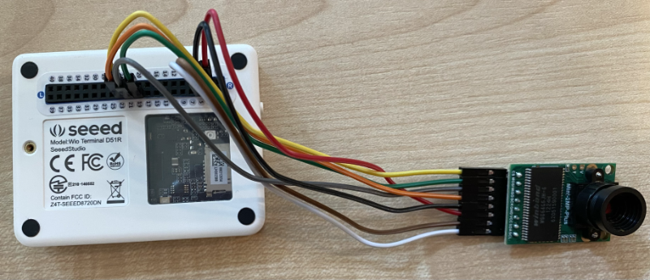

<!--
CO_OP_TRANSLATOR_METADATA:
{
  "original_hash": "160be8c0f558687f6686dca64f10f739",
  "translation_date": "2025-08-28T08:45:08+00:00",
  "source_file": "4-manufacturing/lessons/2-check-fruit-from-device/wio-terminal-camera.md",
  "language_code": "ro"
}
-->
# Capturează o imagine - Wio Terminal

În această parte a lecției, vei adăuga o cameră la Wio Terminal și vei captura imagini cu aceasta.

## Hardware

Wio Terminal are nevoie de o cameră.

Camera pe care o vei folosi este un [ArduCam Mini 2MP Plus](https://www.arducam.com/product/arducam-2mp-spi-camera-b0067-arduino/). Aceasta este o cameră de 2 megapixeli bazată pe senzorul de imagine OV2640. Comunică printr-o interfață SPI pentru a captura imagini și folosește I2C pentru a configura senzorul.

## Conectează camera

ArduCam nu are un socket Grove, ci se conectează la magistralele SPI și I2C prin intermediul pinilor GPIO de pe Wio Terminal.

### Sarcină - conectează camera

Conectează camera.


1. Pinii de la baza ArduCam trebuie conectați la pinii GPIO de pe Wio Terminal. Pentru a găsi mai ușor pinii corecți, atașează autocolantul pentru pini GPIO care vine cu Wio Terminal în jurul pinilor:

    

1. Folosind fire jumper, realizează următoarele conexiuni:

    | Pin ArduCAM | Pin Wio Terminal | Descriere                                |
    | ----------- | ---------------- | ---------------------------------------- |
    | CS          | 24 (SPI_CS)      | Selectare cip SPI                        |
    | MOSI        | 19 (SPI_MOSI)    | Ieșire controler SPI, Intrare periferică |
    | MISO        | 21 (SPI_MISO)    | Intrare controler SPI, Ieșire periferică |
    | SCK         | 23 (SPI_SCLK)    | Ceas serial SPI                          |
    | GND         | 6 (GND)          | Masă - 0V                                |
    | VCC         | 4 (5V)           | Alimentare 5V                            |
    | SDA         | 3 (I2C1_SDA)     | Date serial I2C                          |
    | SCL         | 5 (I2C1_SCL)     | Ceas serial I2C                          |

    

    Conexiunile GND și VCC furnizează o alimentare de 5V pentru ArduCam. Aceasta funcționează la 5V, spre deosebire de senzorii Grove care funcționează la 3V. Această alimentare provine direct de la conexiunea USB-C care alimentează dispozitivul.

    > 💁 Pentru conexiunea SPI, etichetele pinilor de pe ArduCam și numele pinilor Wio Terminal folosiți în cod încă utilizează convenția veche de denumire. Instrucțiunile din această lecție vor folosi noua convenție de denumire, cu excepția cazurilor în care numele pinilor sunt utilizate în cod.

1. Acum poți conecta Wio Terminal la computerul tău.

## Programează dispozitivul pentru a se conecta la cameră

Wio Terminal poate fi acum programat pentru a utiliza camera ArduCAM atașată.

### Sarcină - programează dispozitivul pentru a se conecta la cameră

1. Creează un proiect nou pentru Wio Terminal folosind PlatformIO. Denumește acest proiect `fruit-quality-detector`. Adaugă cod în funcția `setup` pentru a configura portul serial.

1. Adaugă cod pentru a te conecta la WiFi, cu datele tale de autentificare WiFi într-un fișier numit `config.h`. Nu uita să adaugi bibliotecile necesare în fișierul `platformio.ini`.

1. Biblioteca ArduCam nu este disponibilă ca bibliotecă Arduino care poate fi instalată din fișierul `platformio.ini`. În schimb, va trebui să fie instalată din sursă de pe pagina lor GitHub. Poți obține aceasta fie:

    * Clonând repo-ul de la [https://github.com/ArduCAM/Arduino.git](https://github.com/ArduCAM/Arduino.git)
    * Accesând repo-ul pe GitHub la [github.com/ArduCAM/Arduino](https://github.com/ArduCAM/Arduino) și descărcând codul ca zip din butonul **Code**

1. Ai nevoie doar de folderul `ArduCAM` din acest cod. Copiază întregul folder în folderul `lib` din proiectul tău.

    > ⚠️ Întregul folder trebuie copiat, astfel încât codul să fie în `lib/ArduCam`. Nu copia doar conținutul folderului `ArduCam` în folderul `lib`, ci copiază întregul folder.

1. Codul bibliotecii ArduCam funcționează pentru mai multe tipuri de camere. Tipul de cameră pe care dorești să-l folosești este configurat folosind flag-uri de compilator - acest lucru menține biblioteca construită cât mai mică posibil prin eliminarea codului pentru camerele pe care nu le folosești. Pentru a configura biblioteca pentru camera OV2640, adaugă următoarele la sfârșitul fișierului `platformio.ini`:

    ```ini
    build_flags =
        -DARDUCAM_SHIELD_V2
        -DOV2640_CAM
    ```

    Acest lucru setează 2 flag-uri de compilator:

      * `ARDUCAM_SHIELD_V2` pentru a informa biblioteca că camera este pe o placă Arduino, cunoscută ca shield.
      * `OV2640_CAM` pentru a informa biblioteca să includă doar cod pentru camera OV2640.

1. Adaugă un fișier header în folderul `src` numit `camera.h`. Acesta va conține cod pentru a comunica cu camera. Adaugă următorul cod în acest fișier:

    ```cpp
    #pragma once
    
    #include <ArduCAM.h>
    #include <Wire.h>
    
    class Camera
    {
    public:
        Camera(int format, int image_size) : _arducam(OV2640, PIN_SPI_SS)
        {
            _format = format;
            _image_size = image_size;
        }
    
        bool init()
        {
            // Reset the CPLD
            _arducam.write_reg(0x07, 0x80);
            delay(100);
    
            _arducam.write_reg(0x07, 0x00);
            delay(100);
    
            // Check if the ArduCAM SPI bus is OK
            _arducam.write_reg(ARDUCHIP_TEST1, 0x55);
            if (_arducam.read_reg(ARDUCHIP_TEST1) != 0x55)
            {
                return false;
            }
                
            // Change MCU mode
            _arducam.set_mode(MCU2LCD_MODE);
    
            uint8_t vid, pid;
    
            // Check if the camera module type is OV2640
            _arducam.wrSensorReg8_8(0xff, 0x01);
            _arducam.rdSensorReg8_8(OV2640_CHIPID_HIGH, &vid);
            _arducam.rdSensorReg8_8(OV2640_CHIPID_LOW, &pid);
            if ((vid != 0x26) && ((pid != 0x41) || (pid != 0x42)))
            {
                return false;
            }
            
            _arducam.set_format(_format);
            _arducam.InitCAM();
            _arducam.OV2640_set_JPEG_size(_image_size);
            _arducam.OV2640_set_Light_Mode(Auto);
            _arducam.OV2640_set_Special_effects(Normal);
            delay(1000);
    
            return true;
        }
    
        void startCapture()
        {
            _arducam.flush_fifo();
            _arducam.clear_fifo_flag();
            _arducam.start_capture();
        }
    
        bool captureReady()
        {
            return _arducam.get_bit(ARDUCHIP_TRIG, CAP_DONE_MASK);
        }
    
        bool readImageToBuffer(byte **buffer, uint32_t &buffer_length)
        {
            if (!captureReady()) return false;
    
            // Get the image file length
            uint32_t length = _arducam.read_fifo_length();
            buffer_length = length;
    
            if (length >= MAX_FIFO_SIZE)
            {
                return false;
            }
            if (length == 0)
            {
                return false;
            }
    
            // create the buffer
            byte *buf = new byte[length];
    
            uint8_t temp = 0, temp_last = 0;
            int i = 0;
            uint32_t buffer_pos = 0;
            bool is_header = false;
    
            _arducam.CS_LOW();
            _arducam.set_fifo_burst();
            
            while (length--)
            {
                temp_last = temp;
                temp = SPI.transfer(0x00);
                //Read JPEG data from FIFO
                if ((temp == 0xD9) && (temp_last == 0xFF)) //If find the end ,break while,
                {
                    buf[buffer_pos] = temp;
    
                    buffer_pos++;
                    i++;
                    
                    _arducam.CS_HIGH();
                }
                if (is_header == true)
                {
                    //Write image data to buffer if not full
                    if (i < 256)
                    {
                        buf[buffer_pos] = temp;
                        buffer_pos++;
                        i++;
                    }
                    else
                    {
                        _arducam.CS_HIGH();
    
                        i = 0;
                        buf[buffer_pos] = temp;
    
                        buffer_pos++;
                        i++;
    
                        _arducam.CS_LOW();
                        _arducam.set_fifo_burst();
                    }
                }
                else if ((temp == 0xD8) & (temp_last == 0xFF))
                {
                    is_header = true;
    
                    buf[buffer_pos] = temp_last;
                    buffer_pos++;
                    i++;
    
                    buf[buffer_pos] = temp;
                    buffer_pos++;
                    i++;
                }
            }
            
            _arducam.clear_fifo_flag();
    
            _arducam.set_format(_format);
            _arducam.InitCAM();
            _arducam.OV2640_set_JPEG_size(_image_size);
    
            // return the buffer
            *buffer = buf;
        }
    
    private:
        ArduCAM _arducam;
        int _format;
        int _image_size;
    };
    ```

    Acesta este un cod de nivel scăzut care configurează camera folosind bibliotecile ArduCam și extrage imaginile atunci când este necesar folosind magistrala SPI. Acest cod este foarte specific pentru ArduCam, așa că nu trebuie să te îngrijorezi de cum funcționează în acest moment.

1. În `main.cpp`, adaugă următorul cod sub celelalte declarații `include` pentru a include acest fișier nou și pentru a crea o instanță a clasei camera:

    ```cpp
    #include "camera.h"

    Camera camera = Camera(JPEG, OV2640_640x480);
    ```

    Acest lucru creează o `Camera` care salvează imaginile ca JPEG-uri la o rezoluție de 640x480. Deși sunt suportate rezoluții mai mari (până la 3280x2464), clasificatorul de imagini funcționează pe imagini mult mai mici (227x227), așa că nu este nevoie să capturezi și să trimiți imagini mai mari.

1. Adaugă următorul cod sub acesta pentru a defini o funcție care configurează camera:

    ```cpp
    void setupCamera()
    {
        pinMode(PIN_SPI_SS, OUTPUT);
        digitalWrite(PIN_SPI_SS, HIGH);
    
        Wire.begin();
        SPI.begin();
    
        if (!camera.init())
        {
            Serial.println("Error setting up the camera!");
        }
    }
    ```

    Această funcție `setupCamera` începe prin a configura pinul de selectare a cipului SPI (`PIN_SPI_SS`) ca fiind ridicat, făcând din Wio Terminal controlerul SPI. Apoi pornește magistralele I2C și SPI. În final, inițializează clasa camerei, care configurează setările senzorului camerei și se asigură că totul este conectat corect.

1. Apelează această funcție la sfârșitul funcției `setup`:

    ```cpp
    setupCamera();
    ```

1. Construiește și încarcă acest cod și verifică ieșirea din monitorul serial. Dacă vezi `Error setting up the camera!`, verifică cablajul pentru a te asigura că toate cablurile conectează pinii corecți de pe ArduCam la pinii GPIO corecți de pe Wio Terminal și că toate firele jumper sunt bine fixate.

## Capturează o imagine

Wio Terminal poate fi acum programat pentru a captura o imagine atunci când un buton este apăsat.

### Sarcină - capturează o imagine

1. Microcontrolerele rulează codul tău continuu, așa că nu este ușor să declanșezi ceva precum realizarea unei fotografii fără a reacționa la un senzor. Wio Terminal are butoane, așa că camera poate fi configurată să fie declanșată de unul dintre butoane. Adaugă următorul cod la sfârșitul funcției `setup` pentru a configura butonul C (unul dintre cele trei butoane de sus, cel mai apropiat de comutatorul de alimentare).

    

    ```cpp
    pinMode(WIO_KEY_C, INPUT_PULLUP);
    ```

    Modul `INPUT_PULLUP` inversează practic un semnal de intrare. De exemplu, în mod normal, un buton ar trimite un semnal scăzut când nu este apăsat și un semnal ridicat când este apăsat. Când este setat la `INPUT_PULLUP`, trimite un semnal ridicat când nu este apăsat și un semnal scăzut când este apăsat.

1. Adaugă o funcție goală pentru a răspunde la apăsarea butonului înainte de funcția `loop`:

    ```cpp
    void buttonPressed()
    {
        
    }
    ```

1. Apelează această funcție în metoda `loop` când butonul este apăsat:

    ```cpp
    void loop()
    {
        if (digitalRead(WIO_KEY_C) == LOW)
        {
            buttonPressed();
            delay(2000);
        }
    
        delay(200);
    }
    ```

    Acest cod verifică dacă butonul este apăsat. Dacă este apăsat, funcția `buttonPressed` este apelată, iar bucla întârzie 2 secunde. Acest lucru permite timp pentru ca butonul să fie eliberat, astfel încât o apăsare lungă să nu fie înregistrată de două ori.

    > 💁 Butonul de pe Wio Terminal este setat la `INPUT_PULLUP`, așa că trimite un semnal ridicat când nu este apăsat și un semnal scăzut când este apăsat.

1. Adaugă următorul cod în funcția `buttonPressed`:

    ```cpp
    camera.startCapture();
 
    while (!camera.captureReady())
        delay(100);

    Serial.println("Image captured");

    byte *buffer;
    uint32_t length;

    if (camera.readImageToBuffer(&buffer, length))
    {
        Serial.print("Image read to buffer with length ");
        Serial.println(length);

        delete(buffer);
    }
    ```

    Acest cod începe capturarea camerei apelând `startCapture`. Hardware-ul camerei nu funcționează returnând datele atunci când le soliciți, ci trimiți o instrucțiune pentru a începe capturarea, iar camera va lucra în fundal pentru a captura imaginea, a o converti într-un JPEG și a o stoca într-un buffer local pe camera însăși. Apelul `captureReady` verifică apoi dacă capturarea imaginii s-a terminat.

    Odată ce capturarea s-a terminat, datele imaginii sunt copiate din buffer-ul de pe cameră într-un buffer local (un array de octeți) cu apelul `readImageToBuffer`. Lungimea buffer-ului este apoi trimisă la monitorul serial.

1. Construiește și încarcă acest cod și verifică ieșirea pe monitorul serial. De fiecare dată când apeși butonul C, o imagine va fi capturată și vei vedea dimensiunea imaginii trimisă la monitorul serial.

    ```output
    Connecting to WiFi..
    Connected!
    Image captured
    Image read to buffer with length 9224
    Image captured
    Image read to buffer with length 11272
    ```

    Imaginile diferite vor avea dimensiuni diferite. Acestea sunt comprimate ca JPEG-uri, iar dimensiunea unui fișier JPEG pentru o rezoluție dată depinde de ceea ce este în imagine.

> 💁 Poți găsi acest cod în folderul [code-camera/wio-terminal](../../../../../4-manufacturing/lessons/2-check-fruit-from-device/code-camera/wio-terminal).

😀 Ai capturat cu succes imagini cu Wio Terminal.

## Opțional - verifică imaginile camerei folosind un card SD

Cel mai simplu mod de a vedea imaginile capturate de cameră este să le scrii pe un card SD în Wio Terminal și apoi să le vizualizezi pe computerul tău. Realizează acest pas dacă ai un card microSD de rezervă și un slot pentru card microSD pe computerul tău sau un adaptor.

Wio Terminal suportă doar carduri microSD de până la 16GB. Dacă ai un card SD mai mare, acesta nu va funcționa.

### Sarcină - verifică imaginile camerei folosind un card SD

1. Formatează un card microSD ca FAT32 sau exFAT folosind aplicațiile relevante de pe computerul tău (Disk Utility pe macOS, File Explorer pe Windows sau folosind instrumente de linie de comandă pe Linux).

1. Introdu cardul microSD în slotul de sub comutatorul de alimentare. Asigură-te că este complet introdus până când face clic și rămâne în poziție; poate fi necesar să-l împingi folosind o unghie sau un instrument subțire.

1. Adaugă următoarele declarații `include` în partea de sus a fișierului `main.cpp`:

    ```cpp
    #include "SD/Seeed_SD.h"
    #include <Seeed_FS.h>
    ```

1. Adaugă următoarea funcție înainte de funcția `setup`:

    ```cpp
    void setupSDCard()
    {
        while (!SD.begin(SDCARD_SS_PIN, SDCARD_SPI))
        {
            Serial.println("SD Card Error");
        }
    }
    ```

    Aceasta configurează cardul SD folosind magistrala SPI.

1. Apelează această funcție din funcția `setup`:

    ```cpp
    setupSDCard();
    ```

1. Adaugă următorul cod deasupra funcției `buttonPressed`:

    ```cpp
    int fileNum = 1;

    void saveToSDCard(byte *buffer, uint32_t length)
    {
        char buff[16];
        sprintf(buff, "%d.jpg", fileNum);
        fileNum++;
    
        File outFile = SD.open(buff, FILE_WRITE );
        outFile.write(buffer, length);
        outFile.close();

        Serial.print("Image written to file ");
        Serial.println(buff);
    }
    ```

    Aceasta definește o variabilă globală pentru numărul fișierului. Aceasta este utilizată pentru numele fișierelor de imagine, astfel încât să poată fi capturate mai multe imagini cu nume de fișiere incrementate - `1.jpg`, `2.jpg` și așa mai departe.

    Apoi definește funcția `saveToSDCard`, care primește un buffer de date de tip octet și lungimea buffer-ului. Se creează un nume de fișier folosind numărul fișierului, iar numărul fișierului este incrementat pentru următorul fișier. Datele binare din buffer sunt apoi scrise în fișier.

1. Apelează funcția `saveToSDCard` din funcția `buttonPressed`. Apelul ar trebui să fie **înainte** ca buffer-ul să fie șters:

    ```cpp
    Serial.print("Image read to buffer with length ");
    Serial.println(length);

    saveToSDCard(buffer, length);
    
    delete(buffer);
    ```

1. Construiește și încarcă acest cod și verifică ieșirea pe monitorul serial. De fiecare dată când apeși butonul C, o imagine va fi capturată și salvată pe cardul SD.

    ```output
    Connecting to WiFi..
    Connected!
    Image captured
    Image read to buffer with length 16392
    Image written to file 1.jpg
    Image captured
    Image read to buffer with length 14344
    Image written to file 2.jpg
    ```

1. Oprește alimentarea cardului microSD și scoate-l împingându-l ușor și eliberându-l, iar acesta va ieși. Poate fi necesar să folosești un instrument subțire pentru a face acest lucru. Conectează cardul microSD la computerul tău pentru a vizualiza imaginile.

    
💁 Poate fi nevoie de câteva imagini pentru ca balansul de alb al camerei să se ajusteze. Vei observa acest lucru pe baza culorii imaginilor capturate, primele câteva pot părea cu o culoare nepotrivită. Poți rezolva întotdeauna acest lucru modificând codul pentru a captura câteva imagini care sunt ignorate în funcția `setup`.


---

**Declinarea responsabilității**:  
Acest document a fost tradus folosind serviciul de traducere AI [Co-op Translator](https://github.com/Azure/co-op-translator). Deși ne străduim să asigurăm acuratețea, vă rugăm să rețineți că traducerile automate pot conține erori sau inexactități. Documentul original în limba sa natală ar trebui considerat sursa autoritară. Pentru informații critice, se recomandă traducerea profesională realizată de un specialist uman. Nu ne asumăm răspunderea pentru eventualele neînțelegeri sau interpretări greșite care pot apărea din utilizarea acestei traduceri.