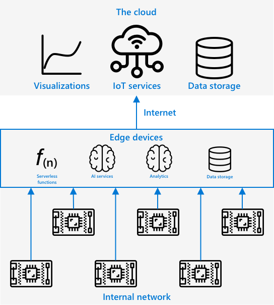

<!--
CO_OP_TRANSLATOR_METADATA:
{
  "original_hash": "2625af24587465c5547ae33d6cc000a5",
  "translation_date": "2025-08-28T08:31:20+00:00",
  "source_file": "4-manufacturing/lessons/3-run-fruit-detector-edge/README.md",
  "language_code": "ro"
}
-->
# Rulează detectorul de fructe la margine


> Prezentare grafică realizată de [Nitya Narasimhan](https://github.com/nitya). Click pe imagine pentru o versiune mai mare.

Acest videoclip oferă o prezentare generală despre rularea clasificatorilor de imagini pe dispozitive IoT, subiectul abordat în această lecție.

[](https://www.youtube.com/watch?v=_K5fqGLO8us)

## Chestionar înainte de lecție

[Chestionar înainte de lecție](https://black-meadow-040d15503.1.azurestaticapps.net/quiz/33)

## Introducere

În lecția anterioară, ai utilizat clasificatorul de imagini pentru a clasifica fructele coapte și necoapte, trimițând o imagine capturată de camera dispozitivului tău IoT prin internet către un serviciu cloud. Aceste apeluri necesită timp, costă bani și, în funcție de tipul de date utilizate, pot avea implicații asupra confidențialității.

În această lecție vei învăța cum să rulezi modele de învățare automată (ML) la margine - pe dispozitive IoT care funcționează pe propria ta rețea, în loc să fie în cloud. Vei învăța avantajele și dezavantajele calculului la margine comparativ cu cel în cloud, cum să implementezi modelul AI la margine și cum să îl accesezi de pe dispozitivul tău IoT.

În această lecție vom acoperi:

* [Calculul la margine](../../../../../4-manufacturing/lessons/3-run-fruit-detector-edge)
* [Azure IoT Edge](../../../../../4-manufacturing/lessons/3-run-fruit-detector-edge)
* [Înregistrarea unui dispozitiv IoT Edge](../../../../../4-manufacturing/lessons/3-run-fruit-detector-edge)
* [Configurarea unui dispozitiv IoT Edge](../../../../../4-manufacturing/lessons/3-run-fruit-detector-edge)
* [Exportarea modelului](../../../../../4-manufacturing/lessons/3-run-fruit-detector-edge)
* [Pregătirea containerului pentru implementare](../../../../../4-manufacturing/lessons/3-run-fruit-detector-edge)
* [Implementarea containerului](../../../../../4-manufacturing/lessons/3-run-fruit-detector-edge)
* [Utilizarea dispozitivului IoT Edge](../../../../../4-manufacturing/lessons/3-run-fruit-detector-edge)

## Calculul la margine

Calculul la margine presupune utilizarea unor computere care procesează datele IoT cât mai aproape de locul unde sunt generate. În loc ca acest proces să aibă loc în cloud, el este mutat la marginea cloud-ului - în rețeaua ta internă.


În lecțiile de până acum, ai avut dispozitive care colectează date și le trimit în cloud pentru a fi analizate, rulând funcții serverless sau modele AI în cloud.



Calculul la margine presupune mutarea unor servicii cloud pe computere care rulează în aceeași rețea cu dispozitivele IoT, comunicând cu cloud-ul doar dacă este necesar. De exemplu, poți rula modele AI pe dispozitivele de margine pentru a analiza gradul de coacere al fructelor și să trimiți în cloud doar analizele, cum ar fi numărul de fructe coapte versus necoapte.

✅ Gândește-te la aplicațiile IoT pe care le-ai construit până acum. Ce părți ale acestora ar putea fi mutate la margine?

### Avantaje

Avantajele calculului la margine sunt:

1. **Viteză** - calculul la margine este ideal pentru datele sensibile la timp, deoarece acțiunile sunt realizate în aceeași rețea cu dispozitivul, în loc să facă apeluri prin internet. Acest lucru permite viteze mai mari, deoarece rețelele interne pot funcționa la viteze semnificativ mai mari decât conexiunile la internet, iar datele parcurg o distanță mult mai scurtă.

    > 💁 Deși cablurile optice sunt utilizate pentru conexiunile la internet, permițând datelor să călătorească cu viteza luminii, poate dura timp pentru ca datele să traverseze globul până la furnizorii de cloud. De exemplu, dacă trimiți date din Europa către servicii cloud din SUA, durează cel puțin 28ms pentru ca datele să traverseze Atlanticul printr-un cablu optic, fără a lua în calcul timpul necesar pentru a ajunge la cablul transatlantic, conversia semnalelor electrice în semnale de lumină și invers, și transferul către furnizorul de cloud.

    Calculul la margine necesită, de asemenea, mai puțin trafic de rețea, reducând riscul ca datele tale să fie încetinite din cauza congestiei pe lățimea de bandă limitată a unei conexiuni la internet.

1. **Accesibilitate în zone izolate** - calculul la margine funcționează atunci când ai conectivitate limitată sau inexistentă, sau când conectivitatea este prea costisitoare pentru a fi utilizată continuu. De exemplu, în zonele afectate de dezastre umanitare, unde infrastructura este limitată, sau în țările în curs de dezvoltare.

1. **Costuri mai mici** - colectarea, stocarea, analiza și declanșarea acțiunilor pe dispozitivele de margine reduc utilizarea serviciilor cloud, ceea ce poate reduce costul total al aplicației tale IoT. În ultimul timp, au apărut dispozitive concepute pentru calculul la margine, cum ar fi plăcile de accelerare AI, precum [Jetson Nano de la NVIDIA](https://developer.nvidia.com/embedded/jetson-nano-developer-kit), care pot rula sarcini AI folosind hardware bazat pe GPU pe dispozitive care costă mai puțin de 100 USD.

1. **Confidențialitate și securitate** - cu calculul la margine, datele rămân în rețeaua ta și nu sunt încărcate în cloud. Acest lucru este adesea preferat pentru informațiile sensibile și identificabile personal, mai ales pentru că datele nu trebuie stocate după ce au fost analizate, reducând semnificativ riscul scurgerilor de date. Exemple includ datele medicale și imaginile de pe camerele de securitate.

1. **Gestionarea dispozitivelor nesigure** - dacă ai dispozitive cu vulnerabilități de securitate cunoscute pe care nu dorești să le conectezi direct la rețea sau la internet, le poți conecta la o rețea separată printr-un dispozitiv gateway IoT Edge. Acest dispozitiv de margine poate avea, de asemenea, o conexiune la rețeaua ta mai largă sau la internet și poate gestiona fluxurile de date între ele.

1. **Suport pentru dispozitive incompatibile** - dacă ai dispozitive care nu se pot conecta la IoT Hub, de exemplu dispozitive care pot utiliza doar conexiuni HTTP sau care au doar Bluetooth, poți utiliza un dispozitiv IoT Edge ca dispozitiv gateway, redirecționând mesajele către IoT Hub.

✅ Fă niște cercetări: Ce alte avantaje ar putea avea calculul la margine?

### Dezavantaje

Există și dezavantaje ale calculului la margine, unde cloud-ul poate fi o opțiune preferată:

1. **Scalabilitate și flexibilitate** - calculul în cloud poate ajusta resursele în timp real, adăugând sau reducând servere și alte resurse. Adăugarea mai multor computere la margine necesită adăugarea manuală a dispozitivelor.

1. **Fiabilitate și reziliență** - calculul în cloud oferă multiple servere, adesea în locații multiple, pentru redundanță și recuperare în caz de dezastru. Pentru a avea același nivel de redundanță la margine sunt necesare investiții mari și multă muncă de configurare.

1. **Întreținere** - furnizorii de servicii cloud oferă întreținere și actualizări ale sistemului.

✅ Fă niște cercetări: Ce alte dezavantaje ar putea avea calculul la margine?

Dezavantajele sunt, în esență, opusul avantajelor utilizării cloud-ului - trebuie să construiești și să gestionezi aceste dispozitive singur, în loc să te bazezi pe expertiza și scalabilitatea furnizorilor de cloud.

Unele riscuri sunt atenuate prin natura calculului la margine. De exemplu, dacă ai un dispozitiv de margine care rulează într-o fabrică și colectează date de la utilaje, nu trebuie să te gândești la anumite scenarii de recuperare în caz de dezastru. Dacă alimentarea fabricii este întreruptă, nu ai nevoie de un dispozitiv de margine de rezervă, deoarece și utilajele care generează datele procesate de dispozitivul de margine vor fi fără energie.

Pentru sistemele IoT, vei dori adesea o combinație între calculul în cloud și cel la margine, utilizând fiecare serviciu în funcție de nevoile sistemului, ale clienților și ale celor care îl întrețin.

## Azure IoT Edge


Azure IoT Edge este un serviciu care te poate ajuta să muți sarcinile de lucru din cloud la margine. Configurezi un dispozitiv ca dispozitiv de margine și, din cloud, poți implementa cod pe acel dispozitiv de margine. Acest lucru îți permite să combini capabilitățile cloud-ului și ale marginii.

> 🎓 *Sarcinile de lucru* reprezintă un termen pentru orice serviciu care efectuează un anumit tip de muncă, cum ar fi modelele AI, aplicațiile sau funcțiile serverless.

De exemplu, poți antrena un clasificator de imagini în cloud, apoi să îl implementezi pe un dispozitiv de margine. Dispozitivul tău IoT trimite apoi imagini către dispozitivul de margine pentru clasificare, în loc să trimită imaginile prin internet. Dacă trebuie să implementezi o nouă versiune a modelului, îl poți antrena în cloud și utiliza IoT Edge pentru a actualiza modelul pe dispozitivul de margine.

> 🎓 Software-ul implementat pe IoT Edge este cunoscut sub numele de *module*. În mod implicit, IoT Edge rulează module care comunică cu IoT Hub, cum ar fi modulele `edgeAgent` și `edgeHub`. Când implementezi un clasificator de imagini, acesta este implementat ca un modul suplimentar.

IoT Edge este integrat în IoT Hub, astfel încât poți gestiona dispozitivele de margine utilizând același serviciu pe care l-ai folosi pentru a gestiona dispozitivele IoT, cu același nivel de securitate.

IoT Edge rulează cod din *containere* - aplicații autonome care sunt rulate izolat de restul aplicațiilor de pe computerul tău. Când rulezi un container, acesta funcționează ca un computer separat care rulează în interiorul computerului tău, cu propriul său software, servicii și aplicații. De cele mai multe ori, containerele nu pot accesa nimic de pe computerul tău decât dacă alegi să partajezi, de exemplu, un folder cu containerul. Containerul expune apoi servicii printr-un port deschis la care te poți conecta sau pe care îl poți expune rețelei tale.


De exemplu, poți avea un container cu un site web care rulează pe portul 80, portul HTTP implicit, și îl poți expune de pe computerul tău tot pe portul 80.

✅ Fă niște cercetări: Citește despre containere și servicii precum Docker sau Moby.

Poți utiliza Custom Vision pentru a descărca clasificatori de imagini și a-i implementa ca containere, fie direct pe un dispozitiv, fie prin IoT Edge. Odată ce rulează într-un container, pot fi accesați utilizând același API REST ca versiunea cloud, dar cu endpoint-ul indicând către dispozitivul de margine care rulează containerul.

## Înregistrarea unui dispozitiv IoT Edge

Pentru a utiliza un dispozitiv IoT Edge, acesta trebuie să fie înregistrat în IoT Hub.

### Sarcină - Înregistrează un dispozitiv IoT Edge

1. Creează un IoT Hub în grupul de resurse `fruit-quality-detector`. Dă-i un nume unic bazat pe `fruit-quality-detector`.

1. Înregistrează un dispozitiv IoT Edge numit `fruit-quality-detector-edge` în IoT Hub-ul tău. Comanda pentru a face acest lucru este similară cu cea utilizată pentru a înregistra un dispozitiv non-edge, cu excepția faptului că trebuie să adaugi flag-ul `--edge-enabled`.

    ```sh
    az iot hub device-identity create --edge-enabled \
                                      --device-id fruit-quality-detector-edge \
                                      --hub-name <hub_name>
    ```

    Înlocuiește `<hub_name>` cu numele IoT Hub-ului tău.

1. Obține șirul de conexiune pentru dispozitivul tău utilizând următoarea comandă:

    ```sh
    az iot hub device-identity connection-string show --device-id fruit-quality-detector-edge \
                                                      --output table \
                                                      --hub-name <hub_name>
    ```

    Înlocuiește `<hub_name>` cu numele IoT Hub-ului tău.

    Copiază șirul de conexiune afișat în output.

## Configurarea unui dispozitiv IoT Edge

După ce ai creat înregistrarea dispozitivului de margine în IoT Hub, poți configura dispozitivul de margine.

### Sarcină - Instalează și pornește IoT Edge Runtime

**IoT Edge runtime rulează doar containere Linux.** Poate fi rulat pe Linux sau pe Windows utilizând mașini virtuale Linux.

* Dacă utilizezi un Raspberry Pi ca dispozitiv IoT, acesta rulează o versiune suportată de Linux și poate găzdui IoT Edge runtime. Urmează ghidul [instalare Azure IoT Edge pentru Linux pe Microsoft docs](https://docs.microsoft.com/azure/iot-edge/how-to-install-iot-edge?WT.mc_id=academic-17441-jabenn) pentru a instala IoT Edge și a seta șirul de conexiune.

    > 💁 Reține, Raspberry Pi OS este o variantă a Debian Linux.

* Dacă nu utilizezi un Raspberry Pi, dar ai un computer Linux, poți rula IoT Edge runtime. Urmează ghidul [instalare Azure IoT Edge pentru Linux pe Microsoft docs](https://docs.microsoft.com/azure/iot-edge/how-to-install-iot-edge?WT.mc_id=academic-17441-jabenn) pentru a instala IoT Edge și a seta șirul de conexiune.

* Dacă utilizezi Windows, poți instala IoT Edge runtime într-o mașină virtuală Linux urmând secțiunea [instalare și pornire IoT Edge runtime din ghidul rapid pentru implementarea primului modul IoT Edge pe un dispozitiv Windows pe Microsoft docs](https://docs.microsoft.com/azure/iot-edge/quickstart?WT.mc_id=academic-17441-jabenn#install-and-start-the-iot-edge-runtime). Te poți opri când ajungi la secțiunea *Deploy a module*.

* Dacă utilizezi macOS, poți crea o mașină virtuală (VM) în cloud pentru a o utiliza ca dispozitiv IoT Edge. Acestea sunt computere pe care le poți crea în cloud și accesa prin internet. Poți crea o mașină virtuală Linux care are IoT Edge instalat. Urmează ghidul [creare mașină virtuală care rulează IoT Edge](vm-iotedge.md) pentru instrucțiuni despre cum să faci acest lucru.

## Exportarea modelului

Pentru a rula clasificatorul la margine, acesta trebuie exportat din Custom Vision. Custom Vision poate genera două tipuri de modele - modele standard și modele compacte. Modelele compacte utilizează diverse tehnici pentru a reduce dimensiunea modelului, făcându-l suficient de mic pentru a fi descărcat și implementat pe dispozitive IoT.

Când ai creat clasificatorul de imagini, ai utilizat domeniul *Food*, o versiune a modelului optimizată pentru antrenarea pe imagini cu alimente. În Custom Vision, poți schimba domeniul proiectului tău, utilizând datele de antrenament pentru a antrena un nou model cu noul domeniu. Toate domeniile suportate de Custom Vision sunt disponibile atât ca standard, cât și ca compacte.

### Sarcină - Antrenează modelul utilizând domeniul Food (compact)
1. Accesează portalul Custom Vision la [CustomVision.ai](https://customvision.ai) și autentifică-te dacă nu l-ai deschis deja. Apoi deschide proiectul tău `fruit-quality-detector`.

1. Selectează butonul **Settings** (pictograma ⚙).

1. În lista *Domains*, selectează *Food (compact)*.

1. Sub *Export Capabilities*, asigură-te că este selectată opțiunea *Basic platforms (Tensorflow, CoreML, ONNX, ...)*.

1. La finalul paginii Settings, selectează **Save Changes**.

1. Reantrenează modelul folosind butonul **Train**, alegând opțiunea *Quick training*.

### Sarcină - exportă modelul tău

După ce modelul a fost antrenat, trebuie exportat ca un container.

1. Selectează fila **Performance** și găsește cea mai recentă iterație antrenată folosind domeniul compact.

1. Selectează butonul **Export** din partea de sus.

1. Selectează **DockerFile**, apoi alege o versiune care se potrivește cu dispozitivul tău edge:

    * Dacă rulezi IoT Edge pe un computer Linux, un computer Windows sau o mașină virtuală, selectează versiunea *Linux*.
    * Dacă rulezi IoT Edge pe un Raspberry Pi, selectează versiunea *ARM (Raspberry Pi 3)*.

    
> 🎓 Docker este unul dintre cele mai populare instrumente pentru gestionarea containerelor, iar un DockerFile este un set de instrucțiuni despre cum să configurezi containerul.

1. Selectează **Export** pentru a permite Custom Vision să creeze fișierele relevante, apoi **Download** pentru a le descărca într-un fișier zip.

1. Salvează fișierele pe computerul tău, apoi dezarhivează folderul.

## Pregătește containerul pentru implementare


După ce ai descărcat modelul, acesta trebuie construit într-un container, apoi încărcat într-un registry de containere - o locație online unde poți stoca containere. IoT Edge poate apoi descărca containerul din registry și îl poate implementa pe dispozitivul tău.


Registry-ul de containere pe care îl vei folosi pentru această lecție este Azure Container Registry. Acesta nu este un serviciu gratuit, așa că pentru a economisi bani, asigură-te că [îți cureți proiectul](../../../clean-up.md) după ce ai terminat.

> 💁 Poți vedea costurile utilizării unui Azure Container Registry pe [pagina de prețuri Azure Container Registry](https://azure.microsoft.com/pricing/details/container-registry/?WT.mc_id=academic-17441-jabenn).

### Sarcină - instalează Docker

Pentru a construi și implementa clasificatorul, este posibil să fie nevoie să instalezi [Docker](https://www.docker.com/).

Va trebui să faci acest lucru doar dacă intenționezi să construiești containerul pe un dispozitiv diferit de cel pe care ai instalat IoT Edge - deoarece, ca parte a instalării IoT Edge, Docker este instalat pentru tine.

1. Dacă construiești containerul Docker pe un dispozitiv diferit de dispozitivul IoT Edge, urmează instrucțiunile de instalare Docker de pe [pagina de instalare Docker](https://www.docker.com/products/docker-desktop) pentru a instala Docker Desktop sau motorul Docker. Asigură-te că rulează după instalare.

### Sarcină - creează o resursă de registry de containere

1. Rulează următoarea comandă din Terminal sau Command Prompt pentru a crea o resursă Azure Container Registry:

    ```sh
    az acr create --resource-group fruit-quality-detector \
                  --sku Basic \
                  --name <Container registry name>
    ```

    Înlocuiește `<Container registry name>` cu un nume unic pentru registry-ul tău de containere, folosind doar litere și cifre. Bazează-te pe `fruitqualitydetector`. Acest nume devine parte a URL-ului pentru a accesa registry-ul, așa că trebuie să fie unic la nivel global.

1. Autentifică-te în Azure Container Registry cu următoarea comandă:

    ```sh
    az acr login --name <Container registry name>
    ```

    Înlocuiește `<Container registry name>` cu numele pe care l-ai folosit pentru registry-ul tău de containere.

1. Activează modul de administrare pentru registry-ul de containere pentru a putea genera o parolă cu următoarea comandă:

    ```sh
    az acr update --admin-enabled true \
                 --name <Container registry name>
    ```

    Înlocuiește `<Container registry name>` cu numele pe care l-ai folosit pentru registry-ul tău de containere.

1. Generează parole pentru registry-ul tău de containere cu următoarea comandă:

    ```sh
     az acr credential renew --password-name password \
                             --output table \
                             --name <Container registry name>
    ```

    Înlocuiește `<Container registry name>` cu numele pe care l-ai folosit pentru registry-ul tău de containere.

    Notează valoarea `PASSWORD`, deoarece vei avea nevoie de aceasta mai târziu.

### Sarcină - construiește containerul tău

Ceea ce ai descărcat din Custom Vision a fost un DockerFile care conține instrucțiuni despre cum ar trebui construit containerul, împreună cu codul aplicației care va rula în interiorul containerului pentru a găzdui modelul tău Custom Vision, împreună cu un REST API pentru a-l apela. Poți folosi Docker pentru a construi un container etichetat din DockerFile, apoi să-l încarci în registry-ul tău de containere.

> 🎓 Containerele primesc o etichetă care definește un nume și o versiune pentru ele. Când trebuie să actualizezi un container, îl poți construi cu aceeași etichetă, dar cu o versiune mai nouă.

1. Deschide terminalul sau Command Prompt și navighează la modelul dezarhivat pe care l-ai descărcat din Custom Vision.

1. Rulează următoarea comandă pentru a construi și eticheta imaginea:

    ```sh
    docker build --platform <platform> -t <Container registry name>.azurecr.io/classifier:v1 .
    ```

    Înlocuiește `<platform>` cu platforma pe care va rula acest container. Dacă rulezi IoT Edge pe un Raspberry Pi, setează acest câmp la `linux/armhf`, altfel setează-l la `linux/amd64`.

    > 💁 Dacă rulezi această comandă de pe dispozitivul pe care rulezi IoT Edge, cum ar fi de pe Raspberry Pi-ul tău, poți omite partea `--platform <platform>` deoarece implicit se folosește platforma curentă.

    Înlocuiește `<Container registry name>` cu numele pe care l-ai folosit pentru registry-ul tău de containere.

    > 💁 Dacă rulezi pe Linux sau Raspberry Pi OS, este posibil să fie nevoie să folosești `sudo` pentru a rula această comandă.

    Docker va construi imaginea, configurând tot software-ul necesar. Imaginea va fi apoi etichetată ca `classifier:v1`.

    ```output
    ➜  d4ccc45da0bb478bad287128e1274c3c.DockerFile.Linux docker build --platform linux/amd64 -t  fruitqualitydetectorjimb.azurecr.io/classifier:v1 .
    [+] Building 102.4s (11/11) FINISHED
     => [internal] load build definition from Dockerfile
     => => transferring dockerfile: 131B
     => [internal] load .dockerignore
     => => transferring context: 2B
     => [internal] load metadata for docker.io/library/python:3.7-slim
     => [internal] load build context
     => => transferring context: 905B
     => [1/6] FROM docker.io/library/python:3.7-slim@sha256:b21b91c9618e951a8cbca5b696424fa5e820800a88b7e7afd66bba0441a764d6
     => => resolve docker.io/library/python:3.7-slim@sha256:b21b91c9618e951a8cbca5b696424fa5e820800a88b7e7afd66bba0441a764d6
     => => sha256:b4d181a07f8025e00e0cb28f1cc14613da2ce26450b80c54aea537fa93cf3bda 27.15MB / 27.15MB
     => => sha256:de8ecf497b753094723ccf9cea8a46076e7cb845f333df99a6f4f397c93c6ea9 2.77MB / 2.77MB
     => => sha256:707b80804672b7c5d8f21e37c8396f319151e1298d976186b4f3b76ead9f10c8 10.06MB / 10.06MB
     => => sha256:b21b91c9618e951a8cbca5b696424fa5e820800a88b7e7afd66bba0441a764d6 1.86kB / 1.86kB
     => => sha256:44073386687709c437586676b572ff45128ff1f1570153c2f727140d4a9accad 1.37kB / 1.37kB
     => => sha256:3d94f0f2ca798607808b771a7766f47ae62a26f820e871dd488baeccc69838d1 8.31kB / 8.31kB
     => => sha256:283715715396fd56d0e90355125fd4ec57b4f0773f306fcd5fa353b998beeb41 233B / 233B
     => => sha256:8353afd48f6b84c3603ea49d204bdcf2a1daada15f5d6cad9cc916e186610a9f 2.64MB / 2.64MB
     => => extracting sha256:b4d181a07f8025e00e0cb28f1cc14613da2ce26450b80c54aea537fa93cf3bda
     => => extracting sha256:de8ecf497b753094723ccf9cea8a46076e7cb845f333df99a6f4f397c93c6ea9
     => => extracting sha256:707b80804672b7c5d8f21e37c8396f319151e1298d976186b4f3b76ead9f10c8
     => => extracting sha256:283715715396fd56d0e90355125fd4ec57b4f0773f306fcd5fa353b998beeb41
     => => extracting sha256:8353afd48f6b84c3603ea49d204bdcf2a1daada15f5d6cad9cc916e186610a9f
     => [2/6] RUN pip install -U pip
     => [3/6] RUN pip install --no-cache-dir numpy~=1.17.5 tensorflow~=2.0.2 flask~=1.1.2 pillow~=7.2.0
     => [4/6] RUN pip install --no-cache-dir mscviplib==2.200731.16
     => [5/6] COPY app /app
     => [6/6] WORKDIR /app
     => exporting to image
     => => exporting layers
     => => writing image sha256:1846b6f134431f78507ba7c079358ed66d944c0e185ab53428276bd822400386
     => => naming to fruitqualitydetectorjimb.azurecr.io/classifier:v1
    ```

### Sarcină - încarcă containerul în registry-ul tău de containere

1. Folosește următoarea comandă pentru a încărca containerul în registry-ul tău de containere:

    ```sh
    docker push <Container registry name>.azurecr.io/classifier:v1
    ```

    Înlocuiește `<Container registry name>` cu numele pe care l-ai folosit pentru registry-ul tău de containere.

    > 💁 Dacă rulezi pe Linux, este posibil să fie nevoie să folosești `sudo` pentru a rula această comandă.

    Containerul va fi încărcat în registry-ul de containere.

    ```output
    ➜  d4ccc45da0bb478bad287128e1274c3c.DockerFile.Linux docker push fruitqualitydetectorjimb.azurecr.io/classifier:v1
    The push refers to repository [fruitqualitydetectorjimb.azurecr.io/classifier]
    5f70bf18a086: Pushed 
    8a1ba9294a22: Pushed 
    56cf27184a76: Pushed 
    b32154f3f5dd: Pushed 
    36103e9a3104: Pushed 
    e2abb3cacca0: Pushed 
    4213fd357bbe: Pushed 
    7ea163ba4dce: Pushed 
    537313a13d90: Pushed 
    764055ebc9a7: Pushed 
    v1: digest: sha256:ea7894652e610de83a5a9e429618e763b8904284253f4fa0c9f65f0df3a5ded8 size: 2423
    ```

1. Pentru a verifica încărcarea, poți lista containerele din registry-ul tău cu următoarea comandă:

    ```sh
    az acr repository list --output table \
                           --name <Container registry name> 
    ```

    Înlocuiește `<Container registry name>` cu numele pe care l-ai folosit pentru registry-ul tău de containere.

    ```output
    ➜  d4ccc45da0bb478bad287128e1274c3c.DockerFile.Linux az acr repository list --name fruitqualitydetectorjimb --output table
    Result
    ----------
    classifier
    ```

    Vei vedea clasificatorul tău listat în rezultat.

## Implementează containerul tău

Containerul tău poate fi acum implementat pe dispozitivul IoT Edge. Pentru a-l implementa, trebuie să definești un manifest de implementare - un document JSON care listează modulele care vor fi implementate pe dispozitivul edge.

### Sarcină - creează manifestul de implementare

1. Creează un fișier nou numit `deployment.json` undeva pe computerul tău.

1. Adaugă următorul conținut în acest fișier:

    ```json
    {
        "content": {
            "modulesContent": {
                "$edgeAgent": {
                    "properties.desired": {
                        "schemaVersion": "1.1",
                        "runtime": {
                            "type": "docker",
                            "settings": {
                                "minDockerVersion": "v1.25",
                                "loggingOptions": "",
                                "registryCredentials": {
                                    "ClassifierRegistry": {
                                        "username": "<Container registry name>",
                                        "password": "<Container registry password>",
                                        "address": "<Container registry name>.azurecr.io"
                                      }
                                }
                            }
                        },
                        "systemModules": {
                            "edgeAgent": {
                                "type": "docker",
                                "settings": {
                                    "image": "mcr.microsoft.com/azureiotedge-agent:1.1",
                                    "createOptions": "{}"
                                }
                            },
                            "edgeHub": {
                                "type": "docker",
                                "status": "running",
                                "restartPolicy": "always",
                                "settings": {
                                    "image": "mcr.microsoft.com/azureiotedge-hub:1.1",
                                    "createOptions": "{\"HostConfig\":{\"PortBindings\":{\"5671/tcp\":[{\"HostPort\":\"5671\"}],\"8883/tcp\":[{\"HostPort\":\"8883\"}],\"443/tcp\":[{\"HostPort\":\"443\"}]}}}"
                                }
                            }
                        },
                        "modules": {
                            "ImageClassifier": {
                                "version": "1.0",
                                "type": "docker",
                                "status": "running",
                                "restartPolicy": "always",
                                "settings": {
                                    "image": "<Container registry name>.azurecr.io/classifier:v1",
                                    "createOptions": "{\"ExposedPorts\": {\"80/tcp\": {}},\"HostConfig\": {\"PortBindings\": {\"80/tcp\": [{\"HostPort\": \"80\"}]}}}"
                                }
                            }
                        }
                    }
                },
                "$edgeHub": {
                    "properties.desired": {
                        "schemaVersion": "1.1",
                        "routes": {
                            "upstream": "FROM /messages/* INTO $upstream"
                        },
                        "storeAndForwardConfiguration": {
                            "timeToLiveSecs": 7200
                        }
                    }
                }
            }
        }
    }
    ```

    > 💁 Poți găsi acest fișier în folderul [code-deployment/deployment](../../../../../4-manufacturing/lessons/3-run-fruit-detector-edge/code-deployment/deployment).

    Înlocuiește cele trei instanțe ale `<Container registry name>` cu numele pe care l-ai folosit pentru registry-ul tău de containere. Una este în secțiunea `ImageClassifier` a modulului, celelalte două sunt în secțiunea `registryCredentials`.

    Înlocuiește `<Container registry password>` în secțiunea `registryCredentials` cu parola registry-ului tău de containere.

1. Din folderul care conține manifestul de implementare, rulează următoarea comandă:

    ```sh
    az iot edge set-modules --device-id fruit-quality-detector-edge \
                            --content deployment.json \
                            --hub-name <hub_name>
    ```

    Înlocuiește `<hub_name>` cu numele IoT Hub-ului tău.

    Modulul clasificatorului de imagini va fi implementat pe dispozitivul tău edge.

### Sarcină - verifică dacă clasificatorul rulează

1. Conectează-te la dispozitivul IoT Edge:

    * Dacă folosești un Raspberry Pi pentru a rula IoT Edge, conectează-te folosind ssh fie din terminalul tău, fie printr-o sesiune SSH remote în VS Code.
    * Dacă rulezi IoT Edge într-un container Linux pe Windows, urmează pașii din [ghidul de verificare a configurării reușite](https://docs.microsoft.com/azure/iot-edge/how-to-install-iot-edge-on-windows?WT.mc_id=academic-17441-jabenn&view=iotedge-2018-06&tabs=powershell#verify-successful-configuration) pentru a te conecta la dispozitivul IoT Edge.
    * Dacă rulezi IoT Edge pe o mașină virtuală, poți să te conectezi prin SSH la mașină folosind `adminUsername` și `password` pe care le-ai setat când ai creat VM-ul, și folosind fie adresa IP, fie numele DNS:

        ```sh
        ssh <adminUsername>@<IP address>
        ```

        Sau:

        ```sh
        ssh <adminUsername>@<DNS Name>
        ```

        Introdu parola ta când ți se cere.

1. Odată conectat, rulează următoarea comandă pentru a obține lista modulelor IoT Edge:

    ```sh
    iotedge list
    ```

    > 💁 Este posibil să fie nevoie să rulezi această comandă cu `sudo`.

    Vei vedea modulele care rulează:

    ```output
    jim@fruit-quality-detector-jimb:~$ iotedge list
    NAME             STATUS           DESCRIPTION      CONFIG
    ImageClassifier  running          Up 42 minutes    fruitqualitydetectorjimb.azurecr.io/classifier:v1
    edgeAgent        running          Up 42 minutes    mcr.microsoft.com/azureiotedge-agent:1.1
    edgeHub          running          Up 42 minutes    mcr.microsoft.com/azureiotedge-hub:1.1
    ```

1. Verifică logurile pentru modulul clasificatorului de imagini cu următoarea comandă:

    ```sh
    iotedge logs ImageClassifier
    ```

    > 💁 Este posibil să fie nevoie să rulezi această comandă cu `sudo`.

    ```output
    jim@fruit-quality-detector-jimb:~$ iotedge logs ImageClassifier
    2021-07-05 20:30:15.387144: I tensorflow/core/platform/cpu_feature_guard.cc:142] Your CPU supports instructions that this TensorFlow binary was not compiled to use: AVX2 FMA
    2021-07-05 20:30:15.392185: I tensorflow/core/platform/profile_utils/cpu_utils.cc:94] CPU Frequency: 2394450000 Hz
    2021-07-05 20:30:15.392712: I tensorflow/compiler/xla/service/service.cc:168] XLA service 0x55ed9ac83470 executing computations on platform Host. Devices:
    2021-07-05 20:30:15.392806: I tensorflow/compiler/xla/service/service.cc:175]   StreamExecutor device (0): Host, Default Version
    Loading model...Success!
    Loading labels...2 found. Success!
     * Serving Flask app "app" (lazy loading)
     * Environment: production
       WARNING: This is a development server. Do not use it in a production deployment.
       Use a production WSGI server instead.
     * Debug mode: off
     * Running on http://0.0.0.0:80/ (Press CTRL+C to quit)
    ```

### Sarcină - testează clasificatorul de imagini

1. Poți folosi CURL pentru a testa clasificatorul de imagini utilizând adresa IP sau numele gazdei computerului care rulează agentul IoT Edge. Găsește adresa IP:

    * Dacă ești pe aceeași mașină pe care rulează IoT Edge, poți folosi `localhost` ca nume al gazdei.
    * Dacă folosești un VM, poți folosi fie adresa IP, fie numele DNS al VM-ului.
    * În caz contrar, poți obține adresa IP a mașinii care rulează IoT Edge:
      * Pe Windows 10, urmează [ghidul pentru a găsi adresa IP](https://support.microsoft.com/windows/find-your-ip-address-f21a9bbc-c582-55cd-35e0-73431160a1b9?WT.mc_id=academic-17441-jabenn).
      * Pe macOS, urmează [ghidul pentru a găsi adresa IP pe un Mac](https://www.hellotech.com/guide/for/how-to-find-ip-address-on-mac).
      * Pe Linux, urmează secțiunea despre găsirea adresei IP private din [ghidul pentru a găsi adresa IP în Linux](https://opensource.com/article/18/5/how-find-ip-address-linux).

1. Poți testa containerul cu un fișier local rulând următoarea comandă curl:

    ```sh
    curl --location \
         --request POST 'http://<IP address or name>/image' \
         --header 'Content-Type: image/png' \
         --data-binary '@<file_Name>' 
    ```

    Înlocuiește `<IP address or name>` cu adresa IP sau numele gazdei computerului care rulează IoT Edge. Înlocuiește `<file_Name>` cu numele fișierului de testat.

    Vei vedea rezultatele predicției în output:

    ```output
    {
        "created": "2021-07-05T21:44:39.573181",
        "id": "",
        "iteration": "",
        "predictions": [
            {
                "boundingBox": null,
                "probability": 0.9995615482330322,
                "tagId": "",
                "tagName": "ripe"
            },
            {
                "boundingBox": null,
                "probability": 0.0004384400090202689,
                "tagId": "",
                "tagName": "unripe"
            }
        ],
        "project": ""
    }
    ```

    > 💁 Nu este nevoie să furnizezi o cheie de predicție aici, deoarece nu folosești o resursă Azure. În schimb, securitatea ar fi configurată pe rețeaua internă pe baza nevoilor interne de securitate, mai degrabă decât să se bazeze pe un endpoint public și o cheie API.

## Folosește dispozitivul tău IoT Edge

Acum că clasificatorul tău de imagini a fost implementat pe un dispozitiv IoT Edge, îl poți folosi de pe dispozitivul tău IoT.

### Sarcină - folosește dispozitivul tău IoT Edge

Parcurge ghidul relevant pentru a clasifica imagini folosind clasificatorul IoT Edge:

* [Arduino - Wio Terminal](wio-terminal.md)
* [Single-board computer - Raspberry Pi/Virtual IoT device](single-board-computer.md)

### Reantrenarea modelului

Unul dintre dezavantajele rulării clasificatoarelor de imagini pe IoT Edge este că acestea nu sunt conectate la proiectul tău Custom Vision. Dacă te uiți la fila **Predictions** din Custom Vision, nu vei vedea imaginile clasificate folosind clasificatorul bazat pe Edge.

Acesta este comportamentul așteptat - imaginile nu sunt trimise în cloud pentru clasificare, așa că nu vor fi disponibile în cloud. Unul dintre avantajele utilizării IoT Edge este confidențialitatea, asigurându-te că imaginile nu părăsesc rețeaua ta, altul este posibilitatea de a lucra offline, fără a depinde de încărcarea imaginilor atunci când dispozitivul nu are conexiune la internet. Dezavantajul este îmbunătățirea modelului - ar trebui să implementezi o altă metodă de stocare a imaginilor care pot fi reclasificate manual pentru a îmbunătăți și reantrena clasificatorul de imagini.

✅ Gândește-te la modalități de a încărca imagini pentru a reantrena clasificatorul.

---

## 🚀 Provocare

Rularea modelelor AI pe dispozitive edge poate fi mai rapidă decât în cloud - saltul de rețea este mai scurt. Totuși, poate fi și mai lentă, deoarece hardware-ul care rulează modelul poate să nu fie la fel de puternic ca cel din cloud.

Fă câteva măsurători și compară dacă apelul către dispozitivul tău edge este mai rapid sau mai lent decât apelul către cloud? Gândește-te la motivele care explică diferența sau lipsa diferenței. Cercetează modalități de a rula modele AI mai rapid pe edge folosind hardware specializat.

## Chestionar post-lectură

[Chestionar post-lectură](https://black-meadow-040d15503.1.azurestaticapps.net/quiz/34)

## Recapitulare și studiu individual

* Citește mai multe despre containere pe [pagina despre virtualizarea la nivel de OS pe Wikipedia](https://wikipedia.org/wiki/OS-level_virtualization).
* Citește mai multe despre edge computing, cu un accent pe modul în care 5G poate ajuta la extinderea edge computing, în [articolul despre ce este edge computing și de ce contează pe NetworkWorld](https://www.networkworld.com/article/3224893/what-is-edge-computing-and-how-its-changing-the-network.html)
* Află mai multe despre rularea serviciilor AI în IoT Edge urmărind [episodul despre cum să utilizezi Azure IoT Edge pe un serviciu AI pre-construit pe Edge pentru detectarea limbajului din seria Learn Live pe Microsoft Channel9](https://channel9.msdn.com/Shows/Learn-Live/Sharpen-Your-AI-Edge-Skills-Episode-4-Learn-How-to-Use-Azure-IoT-Edge-on-a-Pre-Built-AI-Service-on-t?WT.mc_id=academic-17441-jabenn)

## Temă

[Rularea altor servicii pe edge](assignment.md)

---

**Declinarea responsabilității**:  
Acest document a fost tradus folosind serviciul de traducere AI [Co-op Translator](https://github.com/Azure/co-op-translator). Deși ne străduim să asigurăm acuratețea, vă rugăm să rețineți că traducerile automate pot conține erori sau inexactități. Documentul original în limba sa natală ar trebui considerat sursa autoritară. Pentru informații critice, se recomandă traducerea profesională realizată de un specialist uman. Nu ne asumăm răspunderea pentru eventualele neînțelegeri sau interpretări greșite care pot apărea din utilizarea acestei traduceri.