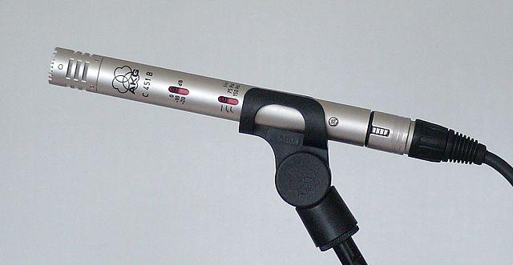

<!--
CO_OP_TRANSLATOR_METADATA:
{
  "original_hash": "6d6aa1be033625d201a190fc9c5cbfb4",
  "translation_date": "2025-08-28T09:08:19+00:00",
  "source_file": "6-consumer/lessons/1-speech-recognition/README.md",
  "language_code": "ro"
}
-->
# Recunoașterea vorbirii cu un dispozitiv IoT


> Prezentare grafică realizată de [Nitya Narasimhan](https://github.com/nitya). Click pe imagine pentru o versiune mai mare.

Acest videoclip oferă o prezentare generală a serviciului de vorbire Azure, un subiect care va fi abordat în această lecție:

[](https://www.youtube.com/watch?v=iW0Fw0l3mrA)

> 🎥 Click pe imaginea de mai sus pentru a viziona videoclipul

## Chestionar înainte de lecție

[Chestionar înainte de lecție](https://black-meadow-040d15503.1.azurestaticapps.net/quiz/41)

## Introducere

„Alexa, setează un cronometru de 12 minute”

„Alexa, care este statusul cronometrului?”

„Alexa, setează un cronometru de 8 minute numit broccoli la aburi”

Dispozitivele inteligente devin din ce în ce mai răspândite. Nu doar ca difuzoare inteligente precum HomePods, Echos și Google Homes, ci și integrate în telefoanele noastre, ceasuri, și chiar în corpuri de iluminat și termostate.

> 💁 Am cel puțin 19 dispozitive în casa mea care au asistenți vocali, și acestea sunt doar cele de care știu!

Controlul vocal crește accesibilitatea, permițând persoanelor cu mobilitate limitată să interacționeze cu dispozitivele. Fie că este vorba de o dizabilitate permanentă, cum ar fi lipsa brațelor, sau de dizabilități temporare, cum ar fi brațe fracturate, sau pur și simplu având mâinile ocupate cu cumpărături sau copii mici, posibilitatea de a controla casa prin voce în loc de mâini deschide o lume de accesibilitate. Strigând „Hei Siri, închide ușa garajului” în timp ce te ocupi de schimbarea unui bebeluș și de un copil neastâmpărat poate fi o mică, dar eficientă îmbunătățire a vieții.

Unul dintre cele mai populare utilizări ale asistenților vocali este setarea cronometrului, în special a cronometrului de bucătărie. Posibilitatea de a seta mai multe cronometre doar prin voce este de mare ajutor în bucătărie - nu mai este nevoie să te oprești din frământarea aluatului, amestecarea supei sau curățarea mâinilor de umplutura pentru găluște pentru a folosi un cronometru fizic.

În această lecție vei învăța cum să integrezi recunoașterea vocală în dispozitive IoT. Vei învăța despre microfoane ca senzori, cum să captezi audio de la un microfon atașat unui dispozitiv IoT și cum să folosești AI pentru a converti ceea ce se aude în text. Pe parcursul acestui proiect vei construi un cronometru inteligent de bucătărie, capabil să seteze cronometre folosind vocea, în mai multe limbi.

În această lecție vom acoperi:

* [Microfoane](../../../../../6-consumer/lessons/1-speech-recognition)
* [Capturarea audio de la dispozitivul IoT](../../../../../6-consumer/lessons/1-speech-recognition)
* [Vorbire în text](../../../../../6-consumer/lessons/1-speech-recognition)
* [Convertirea vorbirii în text](../../../../../6-consumer/lessons/1-speech-recognition)

## Microfoane

Microfoanele sunt senzori analogici care transformă undele sonore în semnale electrice. Vibrațiile din aer determină componentele microfonului să se miște în cantități foarte mici, ceea ce provoacă modificări minuscule ale semnalelor electrice. Aceste modificări sunt amplificate pentru a genera un semnal electric.

### Tipuri de microfoane

Microfoanele vin într-o varietate de tipuri:

* Dinamic - Microfoanele dinamice au un magnet atașat la o diafragmă mobilă care se mișcă într-o bobină de sârmă, creând un curent electric. Acesta este opusul majorității difuzoarelor, care folosesc un curent electric pentru a mișca un magnet într-o bobină de sârmă, mișcând o diafragmă pentru a crea sunet. Acest lucru înseamnă că difuzoarele pot fi folosite ca microfoane dinamice, iar microfoanele dinamice pot fi folosite ca difuzoare. În dispozitive precum interfoanele, unde utilizatorul fie ascultă, fie vorbește, dar nu ambele simultan, un singur dispozitiv poate funcționa atât ca difuzor, cât și ca microfon.

    Microfoanele dinamice nu au nevoie de alimentare pentru a funcționa, semnalul electric este creat în întregime de microfon.

    

* Ribbon - Microfoanele cu panglică sunt similare cu microfoanele dinamice, cu excepția faptului că au o panglică metalică în loc de diafragmă. Această panglică se mișcă într-un câmp magnetic, generând un curent electric. La fel ca microfoanele dinamice, microfoanele cu panglică nu au nevoie de alimentare pentru a funcționa.

    

* Condensator - Microfoanele cu condensator au o diafragmă metalică subțire și o placă metalică fixă. Electricitatea este aplicată ambelor, iar pe măsură ce diafragma vibrează, sarcina statică dintre plăci se modifică, generând un semnal. Microfoanele cu condensator au nevoie de alimentare pentru a funcționa - numită *Phantom power*.

    

* MEMS - Microfoanele cu sisteme microelectromecanice, sau MEMS, sunt microfoane pe un cip. Acestea au o diafragmă sensibilă la presiune gravată pe un cip de siliciu și funcționează similar cu un microfon cu condensator. Aceste microfoane pot fi foarte mici și integrate în circuite.

    

    În imaginea de mai sus, cipul marcat **LEFT** este un microfon MEMS, cu o diafragmă minusculă mai mică de un milimetru lățime.

✅ Fă niște cercetări: Ce microfoane ai în jurul tău - fie în computerul tău, telefonul tău, căștile tale sau în alte dispozitive. Ce tip de microfoane sunt?

### Audio digital

Audio-ul este un semnal analogic care transportă informații foarte detaliate. Pentru a converti acest semnal în digital, audio-ul trebuie să fie eșantionat de mii de ori pe secundă.

> 🎓 Eșantionarea înseamnă convertirea semnalului audio într-o valoare digitală care reprezintă semnalul în acel moment.


Audio-ul digital este eșantionat folosind Modularea Codului de Puls, sau PCM. PCM implică citirea tensiunii semnalului și selectarea celei mai apropiate valori discrete de acea tensiune folosind o dimensiune definită.

> 💁 Poți considera PCM ca versiunea senzorului pentru modularea lățimii pulsului, sau PWM (PWM a fost acoperit în [lecția 3 a proiectului introductiv](../../../1-getting-started/lessons/3-sensors-and-actuators/README.md#pulse-width-modulation)). PCM implică convertirea unui semnal analogic în digital, PWM implică convertirea unui semnal digital în analogic.

De exemplu, majoritatea serviciilor de streaming muzical oferă audio de 16 biți sau 24 biți. Aceasta înseamnă că transformă tensiunea într-o valoare care se încadrează într-un întreg de 16 biți sau 24 biți. Audio-ul de 16 biți se încadrează într-un număr cuprins între -32.768 și 32.767, iar cel de 24 biți între −8.388.608 și 8.388.607. Cu cât sunt mai mulți biți, cu atât eșantionul este mai apropiat de ceea ce auzim cu urechile noastre.

> 💁 Poate ai auzit de audio de 8 biți, adesea denumit LoFi. Acesta este audio eșantionat folosind doar 8 biți, deci -128 până la 127. Primele computere audio erau limitate la 8 biți din cauza limitărilor hardware, așa că acest tip de audio este adesea întâlnit în jocurile retro.

Aceste eșantioane sunt luate de mii de ori pe secundă, folosind rate de eșantionare bine definite, măsurate în KHz (mii de citiri pe secundă). Serviciile de streaming muzical folosesc 48KHz pentru majoritatea audio-ului, dar unele audio „lossless” folosesc până la 96KHz sau chiar 192KHz. Cu cât rata de eșantionare este mai mare, cu atât audio-ul este mai apropiat de original, până la un punct. Există dezbateri dacă oamenii pot face diferența peste 48KHz.

✅ Fă niște cercetări: Dacă folosești un serviciu de streaming muzical, ce rată de eșantionare și dimensiune folosește? Dacă folosești CD-uri, care este rata de eșantionare și dimensiunea audio-ului de pe CD?

Există o serie de formate diferite pentru datele audio. Probabil ai auzit de fișiere mp3 - date audio comprimate pentru a fi mai mici fără a pierde calitatea. Audio-ul necomprimat este adesea stocat ca fișier WAV - acesta este un fișier cu 44 de octeți de informații de antet, urmat de date audio brute. Antetul conține informații precum rata de eșantionare (de exemplu 16000 pentru 16KHz) și dimensiunea eșantionului (16 pentru 16 biți), și numărul de canale. După antet, fișierul WAV conține datele audio brute.

> 🎓 Canalele se referă la câte fluxuri audio diferite compun audio-ul. De exemplu, pentru audio stereo cu stânga și dreapta, ar fi 2 canale. Pentru sunet surround 7.1 pentru un sistem home theater, ar fi 8.

### Dimensiunea datelor audio

Datele audio sunt relativ mari. De exemplu, capturarea audio necomprimat de 16 biți la 16KHz (o rată suficient de bună pentru utilizarea cu un model de vorbire în text) necesită 32KB de date pentru fiecare secundă de audio:

* 16 biți înseamnă 2 octeți pe eșantion (1 octet are 8 biți).
* 16KHz înseamnă 16.000 de eșantioane pe secundă.
* 16.000 x 2 octeți = 32.000 octeți pe secundă.

Acest lucru pare o cantitate mică de date, dar dacă folosești un microcontroler cu memorie limitată, aceasta poate fi mult. De exemplu, Wio Terminal are 192KB de memorie, și aceasta trebuie să stocheze codul programului și variabilele. Chiar dacă codul programului tău ar fi foarte mic, nu ai putea captura mai mult de 5 secunde de audio.

Microcontrolerele pot accesa stocare suplimentară, cum ar fi carduri SD sau memorie flash. Când construiești un dispozitiv IoT care capturează audio, va trebui să te asiguri nu doar că ai stocare suplimentară, ci și că codul tău scrie audio-ul capturat de microfon direct în acea stocare, iar când îl trimiți în cloud, îl transmiți din stocare către cererea web. Astfel, poți evita epuizarea memoriei încercând să ții întregul bloc de date audio în memorie simultan.

## Capturarea audio de la dispozitivul IoT

Dispozitivul tău IoT poate fi conectat la un microfon pentru a captura audio, pregătit pentru conversia în text. De asemenea, poate fi conectat la difuzoare pentru a reda audio. În lecțiile ulterioare, acest lucru va fi folosit pentru a oferi feedback audio, dar este util să configurezi difuzoarele acum pentru a testa microfonul.

### Sarcină - configurează microfonul și difuzoarele

Parcurge ghidul relevant pentru a configura microfonul și difuzoarele pentru dispozitivul tău IoT:

* [Arduino - Wio Terminal](wio-terminal-microphone.md)
* [Computer cu placă unică - Raspberry Pi](pi-microphone.md)
* [Computer cu placă unică - Dispozitiv virtual](virtual-device-microphone.md)

### Sarcină - capturează audio

Parcurge ghidul relevant pentru a captura audio pe dispozitivul tău IoT:

* [Arduino - Wio Terminal](wio-terminal-audio.md)
* [Computer cu placă unică - Raspberry Pi](pi-audio.md)
* [Computer cu placă unică - Dispozitiv virtual](virtual-device-audio.md)

## Vorbire în text

Vorbirea în text, sau recunoașterea vorbirii, implică utilizarea AI pentru a converti cuvintele dintr-un semnal audio în text.

### Modele de recunoaștere a vorbirii

Pentru a converti vorbirea în text, eșantioanele din semnalul audio sunt grupate și introduse într-un model de învățare automată bazat pe o rețea neuronală recurentă (RNN). Acesta este un tip de model de învățare automată care poate folosi datele anterioare pentru a lua o decizie despre datele primite. De exemplu, RNN-ul ar putea detecta un bloc de eșantioane audio ca sunetul „Hel”, iar când primește altul pe care îl consideră sunetul „lo”, poate combina acest lucru cu sunetul anterior, găsi că „Hello” este un cuvânt valid și selecta acest rezultat.

Modelele de învățare automată acceptă întotdeauna date de aceeași dimensiune de fiecare dată. Clasificatorul de imagini pe care l-ai construit într-o lecție anterioară redimensionează imaginile la o dimensiune fixă și le procesează. La fel și modelele de vorbire, trebuie să proceseze blocuri audio de dimensiuni fixe. Modelele de vorbire trebuie să fie capabile să combine rezultatele mai multor predicții pentru a obține răspunsul, pentru a permite distingerea între „Hi” și „Highway” sau „flock” și „floccinaucinihilipilification”.

Modelele de vorbire sunt, de asemenea, suficient de avansate pentru a înțelege contextul și pot corecta cuvintele detectate pe măsură ce sunt procesate mai multe sunete. De exemplu, dacă spui „Am fost la magazin să iau două banane și un măr, de asemenea”, ai folosi trei cuvinte care sună la fel, dar sunt scrise diferit - to, two și too. Modelele de vorbire pot înțelege contextul și pot folosi ortografia corespunzătoare a cuvântului.
💁 Unele servicii de vorbire permit personalizarea pentru a funcționa mai bine în medii zgomotoase, cum ar fi fabricile, sau cu termeni specifici industriei, cum ar fi denumirile chimice. Aceste personalizări sunt antrenate prin furnizarea de mostre audio și o transcriere, și funcționează folosind învățarea prin transfer, la fel cum ai antrenat un clasificator de imagini folosind doar câteva imagini într-o lecție anterioară.
### Confidențialitate

Când folosești funcția de conversie a vorbirii în text pe un dispozitiv IoT destinat consumatorilor, confidențialitatea este extrem de importantă. Aceste dispozitive ascultă continuu audio, iar ca utilizator, nu îți dorești ca tot ce spui să fie trimis în cloud și transformat în text. Nu doar că acest lucru ar consuma multă lățime de bandă a internetului, dar are și implicații majore asupra confidențialității, mai ales când unii producători de dispozitive inteligente selectează aleatoriu fragmente audio pentru [validare umană în raport cu textul generat, pentru a îmbunătăți modelul lor](https://www.theverge.com/2019/4/10/18305378/amazon-alexa-ai-voice-assistant-annotation-listen-private-recordings).

Îți dorești ca dispozitivul inteligent să trimită audio în cloud pentru procesare doar atunci când îl folosești, nu atunci când detectează sunete în casa ta, sunete care ar putea include întâlniri private sau interacțiuni intime. Modul în care funcționează majoritatea dispozitivelor inteligente este printr-un *cuvânt de activare*, o frază cheie precum „Alexa”, „Hey Siri” sau „OK Google”, care determină dispozitivul să „se trezească” și să asculte ceea ce spui până detectează o pauză în vorbire, indicând că ai terminat de vorbit cu dispozitivul.

> 🎓 Detectarea cuvântului de activare este cunoscută și sub denumirea de *Keyword spotting* sau *Keyword recognition*.

Aceste cuvinte de activare sunt detectate pe dispozitiv, nu în cloud. Dispozitivele inteligente au modele AI mici care rulează pe dispozitiv și ascultă cuvântul de activare, iar când acesta este detectat, încep să transmită audio în cloud pentru recunoaștere. Aceste modele sunt foarte specializate și ascultă doar cuvântul de activare.

> 💁 Unele companii de tehnologie adaugă mai multă confidențialitate dispozitivelor lor și realizează o parte din conversia vorbirii în text direct pe dispozitiv. Apple a anunțat că, în cadrul actualizărilor iOS și macOS din 2021, va susține conversia vorbirii în text pe dispozitiv și va putea gestiona multe cereri fără a fi nevoie de utilizarea cloud-ului. Acest lucru este posibil datorită procesorului puternic din dispozitivele lor, care poate rula modele ML.

✅ Care crezi că sunt implicațiile etice și de confidențialitate ale stocării audio trimis în cloud? Ar trebui acest audio să fie stocat, și dacă da, cum? Crezi că utilizarea înregistrărilor pentru aplicarea legii este un compromis bun pentru pierderea confidențialității?

Detectarea cuvântului de activare folosește de obicei o tehnică cunoscută sub numele de TinyML, care presupune convertirea modelelor ML pentru a putea rula pe microcontrolere. Aceste modele sunt mici ca dimensiune și consumă foarte puțină energie pentru a funcționa.

Pentru a evita complexitatea antrenării și utilizării unui model de cuvânt de activare, cronometrul inteligent pe care îl construiești în această lecție va folosi un buton pentru a activa recunoașterea vorbirii.

> 💁 Dacă vrei să încerci să creezi un model de detectare a cuvântului de activare care să ruleze pe Wio Terminal sau Raspberry Pi, consultă acest [tutorial despre răspunsul la vocea ta de la Edge Impulse](https://docs.edgeimpulse.com/docs/responding-to-your-voice). Dacă vrei să folosești computerul pentru acest lucru, poți încerca [ghidul rapid pentru cuvinte cheie personalizate pe Microsoft Docs](https://docs.microsoft.com/azure/cognitive-services/speech-service/keyword-recognition-overview?WT.mc_id=academic-17441-jabenn).

## Conversia vorbirii în text


La fel ca în cazul clasificării imaginilor dintr-un proiect anterior, există servicii AI predefinite care pot lua vorbirea ca fișier audio și o pot converti în text. Un astfel de serviciu este Speech Service, parte din Cognitive Services, servicii AI predefinite pe care le poți folosi în aplicațiile tale.

### Sarcină - configurarea unei resurse AI pentru vorbire

1. Creează un grup de resurse pentru acest proiect numit `smart-timer`.

1. Folosește următoarea comandă pentru a crea o resursă de vorbire gratuită:

    ```sh
    az cognitiveservices account create --name smart-timer \
                                        --resource-group smart-timer \
                                        --kind SpeechServices \
                                        --sku F0 \
                                        --yes \
                                        --location <location>
    ```

    Înlocuiește `<location>` cu locația pe care ai folosit-o când ai creat grupul de resurse.

1. Vei avea nevoie de o cheie API pentru a accesa resursa de vorbire din codul tău. Rulează următoarea comandă pentru a obține cheia:

    ```sh
    az cognitiveservices account keys list --name smart-timer \
                                           --resource-group smart-timer \
                                           --output table
    ```

    Copiază una dintre chei.

### Sarcină - conversia vorbirii în text

Parcurge ghidul relevant pentru a converti vorbirea în text pe dispozitivul tău IoT:

* [Arduino - Wio Terminal](wio-terminal-speech-to-text.md)
* [Computer cu o singură placă - Raspberry Pi](pi-speech-to-text.md)
* [Computer cu o singură placă - Dispozitiv virtual](virtual-device-speech-to-text.md)

---

## 🚀 Provocare

Recunoașterea vorbirii există de mult timp și se îmbunătățește continuu. Cercetează capacitățile actuale și compară modul în care acestea au evoluat de-a lungul timpului, inclusiv cât de precise sunt transcrierile realizate de mașini comparativ cu cele realizate de oameni.

Ce crezi că rezervă viitorul pentru recunoașterea vorbirii?

## Test de verificare după lecție

[Test de verificare după lecție](https://black-meadow-040d15503.1.azurestaticapps.net/quiz/42)

## Recapitulare și studiu individual

* Citește despre diferitele tipuri de microfoane și modul în care funcționează în articolul [care este diferența dintre microfoanele dinamice și cele cu condensator pe Musician's HQ](https://musicianshq.com/whats-the-difference-between-dynamic-and-condenser-microphones/).
* Citește mai multe despre serviciul de vorbire din Cognitive Services în [documentația serviciului de vorbire pe Microsoft Docs](https://docs.microsoft.com/azure/cognitive-services/speech-service/?WT.mc_id=academic-17441-jabenn).
* Citește despre detectarea cuvintelor cheie în [documentația despre recunoașterea cuvintelor cheie pe Microsoft Docs](https://docs.microsoft.com/azure/cognitive-services/speech-service/keyword-recognition-overview?WT.mc_id=academic-17441-jabenn).

## Temă

[](assignment.md)

---

**Declinare de responsabilitate**:  
Acest document a fost tradus folosind serviciul de traducere AI [Co-op Translator](https://github.com/Azure/co-op-translator). Deși ne străduim să asigurăm acuratețea, vă rugăm să rețineți că traducerile automate pot conține erori sau inexactități. Documentul original în limba sa natală ar trebui considerat sursa autoritară. Pentru informații critice, se recomandă traducerea profesională realizată de un specialist. Nu ne asumăm responsabilitatea pentru eventualele neînțelegeri sau interpretări greșite care pot apărea din utilizarea acestei traduceri.