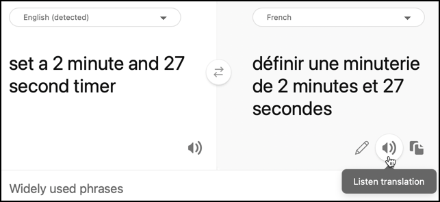

<!--
CO_OP_TRANSLATOR_METADATA:
{
  "original_hash": "5f6c164e349f8989959e02a90f37908d",
  "translation_date": "2025-08-28T09:26:49+00:00",
  "source_file": "6-consumer/lessons/4-multiple-language-support/wio-terminal-translate-speech.md",
  "language_code": "ro"
}
-->
# Traduce discursul - Wio Terminal

În această parte a lecției, vei scrie cod pentru a traduce text folosind serviciul de traducere.

## Convertește textul în discurs folosind serviciul de traducere

API-ul REST al serviciului de discurs nu suportă traduceri directe, însă poți folosi serviciul Translator pentru a traduce textul generat de serviciul de conversie din discurs în text, precum și textul răspunsului vorbit. Acest serviciu are un API REST pe care îl poți folosi pentru a traduce textul, dar pentru a-l face mai ușor de utilizat, acesta va fi încorporat într-un alt declanșator HTTP în aplicația ta de funcții.

### Sarcină - creează o funcție serverless pentru a traduce text

1. Deschide proiectul `smart-timer-trigger` în VS Code și deschide terminalul, asigurându-te că mediul virtual este activat. Dacă nu, închide și recreează terminalul.

1. Deschide fișierul `local.settings.json` și adaugă setările pentru cheia API și locația serviciului de traducere:

    ```json
    "TRANSLATOR_KEY": "<key>",
    "TRANSLATOR_LOCATION": "<location>"
    ```

    Înlocuiește `<key>` cu cheia API pentru resursa serviciului de traducere. Înlocuiește `<location>` cu locația pe care ai folosit-o când ai creat resursa serviciului de traducere.

1. Adaugă un nou declanșator HTTP în această aplicație numit `translate-text` folosind următoarea comandă din terminalul VS Code, în folderul rădăcină al proiectului aplicației de funcții:

    ```sh
    func new --name translate-text --template "HTTP trigger"
    ```

    Aceasta va crea un declanșator HTTP numit `translate-text`.

1. Înlocuiește conținutul fișierului `__init__.py` din folderul `translate-text` cu următorul:

    ```python
    import logging
    import os
    import requests
    
    import azure.functions as func
    
    location = os.environ['TRANSLATOR_LOCATION']
    translator_key = os.environ['TRANSLATOR_KEY']
    
    def main(req: func.HttpRequest) -> func.HttpResponse:
        req_body = req.get_json()
        from_language = req_body['from_language']
        to_language = req_body['to_language']
        text = req_body['text']
        
        logging.info(f'Translating {text} from {from_language} to {to_language}')
    
        url = f'https://api.cognitive.microsofttranslator.com/translate?api-version=3.0'
    
        headers = {
            'Ocp-Apim-Subscription-Key': translator_key,
            'Ocp-Apim-Subscription-Region': location,
            'Content-type': 'application/json'
        }
    
        params = {
            'from': from_language,
            'to': to_language
        }
    
        body = [{
            'text' : text
        }]
        
        response = requests.post(url, headers=headers, params=params, json=body)
        return func.HttpResponse(response.json()[0]['translations'][0]['text'])
    ```

    Acest cod extrage textul și limbile din cererea HTTP. Apoi face o cerere către API-ul REST al serviciului de traducere, trecând limbile ca parametri pentru URL și textul de tradus ca corp. În final, traducerea este returnată.

1. Rulează aplicația de funcții local. Poți apoi să o testezi folosind un instrument precum curl, la fel cum ai testat declanșatorul HTTP `text-to-timer`. Asigură-te că transmiți textul de tradus și limbile ca un corp JSON:

    ```json
    {
        "text": "Définir une minuterie de 30 secondes",
        "from_language": "fr-FR",
        "to_language": "en-US"
    }
    ```

    Acest exemplu traduce *Définir une minuterie de 30 secondes* din franceză în engleza americană. Va returna *Set a 30-second timer*.

> 💁 Poți găsi acest cod în folderul [code/functions](../../../../../6-consumer/lessons/4-multiple-language-support/code/functions).

### Sarcină - folosește funcția de traducere pentru a traduce text

1. Deschide proiectul `smart-timer` în VS Code dacă nu este deja deschis.

1. Cronometrul inteligent va avea setate 2 limbi - limba serverului care a fost folosit pentru a antrena LUIS (aceeași limbă este folosită și pentru a construi mesajele adresate utilizatorului) și limba vorbită de utilizator. Actualizează constanta `LANGUAGE` din fișierul header `config.h` pentru a fi limba care va fi vorbită de utilizator și adaugă o nouă constantă numită `SERVER_LANGUAGE` pentru limba folosită pentru a antrena LUIS:

    ```cpp
    const char *LANGUAGE = "<user language>";
    const char *SERVER_LANGUAGE = "<server language>";
    ```

    Înlocuiește `<user language>` cu numele localizării pentru limba în care vei vorbi, de exemplu `fr-FR` pentru franceză sau `zn-HK` pentru cantoneză.

    Înlocuiește `<server language>` cu numele localizării pentru limba folosită pentru a antrena LUIS.

    Poți găsi o listă a limbilor suportate și a numelor lor de localizare în [documentația despre suportul pentru limbă și voce pe Microsoft docs](https://docs.microsoft.com/azure/cognitive-services/speech-service/language-support?WT.mc_id=academic-17441-jabenn#speech-to-text).

    > 💁 Dacă nu vorbești mai multe limbi, poți folosi un serviciu precum [Bing Translate](https://www.bing.com/translator) sau [Google Translate](https://translate.google.com) pentru a traduce din limba ta preferată într-o limbă la alegerea ta. Aceste servicii pot reda audio textul tradus.
    >
    > De exemplu, dacă antrenezi LUIS în engleză, dar vrei să folosești franceza ca limbă a utilizatorului, poți traduce propoziții precum "set a 2 minute and 27 second timer" din engleză în franceză folosind Bing Translate, apoi folosește butonul **Listen translation** pentru a reda traducerea în microfonul tău.
    >
    > 

1. Adaugă cheia API și locația serviciului de traducere sub `SPEECH_LOCATION`:

    ```cpp
    const char *TRANSLATOR_API_KEY = "<KEY>";
    const char *TRANSLATOR_LOCATION = "<LOCATION>";
    ```

    Înlocuiește `<KEY>` cu cheia API pentru resursa serviciului de traducere. Înlocuiește `<LOCATION>` cu locația pe care ai folosit-o când ai creat resursa serviciului de traducere.

1. Adaugă URL-ul declanșatorului de traducere sub `VOICE_URL`:

    ```cpp
    const char *TRANSLATE_FUNCTION_URL = "<URL>";
    ```

    Înlocuiește `<URL>` cu URL-ul pentru declanșatorul HTTP `translate-text` din aplicația ta de funcții. Acesta va fi același cu valoarea pentru `TEXT_TO_TIMER_FUNCTION_URL`, exceptând faptul că numele funcției va fi `translate-text` în loc de `text-to-timer`.

1. Adaugă un nou fișier în folderul `src` numit `text_translator.h`.

1. Acest nou fișier header `text_translator.h` va conține o clasă pentru a traduce text. Adaugă următorul cod în acest fișier pentru a declara această clasă:

    ```cpp
    #pragma once
    
    #include <Arduino.h>
    #include <ArduinoJson.h>
    #include <HTTPClient.h>
    #include <WiFiClient.h>
    
    #include "config.h"
    
    class TextTranslator
    {
    public:   
    private:
        WiFiClient _client;
    };
    
    TextTranslator textTranslator;
    ```

    Aceasta declară clasa `TextTranslator`, împreună cu o instanță a acestei clase. Clasa are un singur câmp pentru clientul WiFi.

1. În secțiunea `public` a acestei clase, adaugă o metodă pentru a traduce text:

    ```cpp
    String translateText(String text, String from_language, String to_language)
    {
    }
    ```

    Această metodă ia limba din care se traduce și limba în care se traduce. Când se gestionează discursul, acesta va fi tradus din limba utilizatorului în limba serverului LUIS, iar când se oferă răspunsuri, va fi tradus din limba serverului LUIS în limba utilizatorului.

1. În această metodă, adaugă cod pentru a construi un corp JSON care conține textul de tradus și limbile:

    ```cpp
    DynamicJsonDocument doc(1024);
    doc["text"] = text;
    doc["from_language"] = from_language;
    doc["to_language"] = to_language;

    String body;
    serializeJson(doc, body);

    Serial.print("Translating ");
    Serial.print(text);
    Serial.print(" from ");
    Serial.print(from_language);
    Serial.print(" to ");
    Serial.print(to_language);
    ```

1. Sub acest cod, adaugă următorul cod pentru a trimite corpul către aplicația de funcții serverless:

    ```cpp
    HTTPClient httpClient;
    httpClient.begin(_client, TRANSLATE_FUNCTION_URL);

    int httpResponseCode = httpClient.POST(body);
    ```

1. Apoi, adaugă cod pentru a obține răspunsul:

    ```cpp
    String translated_text = "";

    if (httpResponseCode == 200)
    {
        translated_text = httpClient.getString();
        Serial.print("Translated: ");
        Serial.println(translated_text);
    }
    else
    {
        Serial.print("Failed to translate text - error ");
        Serial.println(httpResponseCode);
    }
    ```

1. În final, adaugă cod pentru a închide conexiunea și a returna textul tradus:

    ```cpp
    httpClient.end();

    return translated_text;
    ```

### Sarcină - traduce discursul recunoscut și răspunsurile

1. Deschide fișierul `main.cpp`.

1. Adaugă o directivă include în partea de sus a fișierului pentru fișierul header al clasei `TextTranslator`:

    ```cpp
    #include "text_translator.h"
    ```

1. Textul care este spus când un cronometru este setat sau expiră trebuie tradus. Pentru a face acest lucru, adaugă următorul cod ca primă linie a funcției `say`:

    ```cpp
    text = textTranslator.translateText(text, LANGUAGE, SERVER_LANGUAGE);
    ```

    Acesta va traduce textul în limba utilizatorului.

1. În funcția `processAudio`, textul este preluat din audio capturat cu apelul `String text = speechToText.convertSpeechToText();`. După acest apel, traduce textul:

    ```cpp
    String text = speechToText.convertSpeechToText();
    text = textTranslator.translateText(text, LANGUAGE, SERVER_LANGUAGE);
    ```

    Acesta va traduce textul din limba utilizatorului în limba folosită pe server.

1. Construiește acest cod, încarcă-l pe Wio Terminal și testează-l prin monitorul serial. Odată ce vezi `Ready` în monitorul serial, apasă butonul C (cel din partea stângă, cel mai aproape de comutatorul de alimentare) și vorbește. Asigură-te că aplicația de funcții rulează și solicită un cronometru în limba utilizatorului, fie vorbind în acea limbă, fie folosind o aplicație de traducere.

    ```output
    Connecting to WiFi..
    Connected!
    Got access token.
    Ready.
    Starting recording...
    Finished recording
    Sending speech...
    Speech sent!
    {"RecognitionStatus":"Success","DisplayText":"Définir une minuterie de 2 minutes 27 secondes.","Offset":9600000,"Duration":40400000}
    Translating Définir une minuterie de 2 minutes 27 secondes. from fr-FR to en-US
    Translated: Set a timer of 2 minutes 27 seconds.
    Set a timer of 2 minutes 27 seconds.
    {"seconds": 147}
    Translating 2 minute 27 second timer started. from en-US to fr-FR
    Translated: 2 minute 27 seconde minute a commencé.
    2 minute 27 seconde minute a commencé.
    Translating Times up on your 2 minute 27 second timer. from en-US to fr-FR
    Translated: Chronométrant votre minuterie de 2 minutes 27 secondes.
    Chronométrant votre minuterie de 2 minutes 27 secondes.
    ```

> 💁 Poți găsi acest cod în folderul [code/wio-terminal](../../../../../6-consumer/lessons/4-multiple-language-support/code/wio-terminal).

😀 Programul tău de cronometru multilingv a fost un succes!

---

**Declinarea responsabilității**:  
Acest document a fost tradus folosind serviciul de traducere AI [Co-op Translator](https://github.com/Azure/co-op-translator). Deși depunem eforturi pentru a asigura acuratețea, vă rugăm să rețineți că traducerile automate pot conține erori sau inexactități. Documentul original în limba sa nativă ar trebui considerat sursa autoritară. Pentru informații critice, se recomandă traducerea realizată de un profesionist uman. Nu ne asumăm răspunderea pentru eventualele neînțelegeri sau interpretări greșite care pot apărea din utilizarea acestei traduceri.