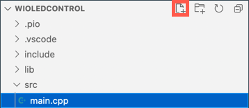

<!--
CO_OP_TRANSLATOR_METADATA:
{
  "original_hash": "d6faf0e8d3c2d6d20c0aef2a305dab18",
  "translation_date": "2025-08-26T23:19:22+00:00",
  "source_file": "1-getting-started/lessons/4-connect-internet/wio-terminal-mqtt.md",
  "language_code": "ru"
}
-->
# Управляйте ночником через Интернет - Wio Terminal

Устройство IoT должно быть запрограммировано для связи с *test.mosquitto.org* с использованием MQTT, чтобы отправлять телеметрические данные с показаниями датчика света и получать команды для управления светодиодом.

В этой части урока вы подключите ваш Wio Terminal к MQTT-брокеру.

## Установите библиотеки WiFi и MQTT для Arduino

Чтобы взаимодействовать с MQTT-брокером, необходимо установить несколько библиотек Arduino, которые позволят использовать WiFi-чип в Wio Terminal и работать с MQTT. При разработке для устройств Arduino можно использовать широкий спектр библиотек с открытым исходным кодом, которые реализуют множество функций. Seeed публикует библиотеки для Wio Terminal, позволяющие ему подключаться к WiFi. Другие разработчики публикуют библиотеки для работы с MQTT-брокерами, и вы будете использовать их с вашим устройством.

Эти библиотеки предоставляются в виде исходного кода, который можно автоматически импортировать в PlatformIO и компилировать для вашего устройства. Таким образом, библиотеки Arduino будут работать на любом устройстве, поддерживающем фреймворк Arduino, при условии, что устройство имеет необходимое оборудование для работы с библиотекой. Некоторые библиотеки, такие как WiFi-библиотеки от Seeed, специфичны для определенного оборудования.

Библиотеки можно устанавливать глобально и компилировать при необходимости или добавлять в конкретный проект. Для этого задания библиотеки будут установлены в проект.

✅ Вы можете узнать больше о управлении библиотеками и о том, как находить и устанавливать их, в [документации PlatformIO о библиотеках](https://docs.platformio.org/en/latest/librarymanager/index.html).

### Задание - установка библиотек WiFi и MQTT для Arduino

Установите библиотеки Arduino.

1. Откройте проект ночника в VS Code.

1. Добавьте следующее в конец файла `platformio.ini`:

    ```ini
    lib_deps =
        seeed-studio/Seeed Arduino rpcWiFi @ 1.0.5
        seeed-studio/Seeed Arduino FS @ 2.1.1
        seeed-studio/Seeed Arduino SFUD @ 2.0.2
        seeed-studio/Seeed Arduino rpcUnified @ 2.1.3
        seeed-studio/Seeed_Arduino_mbedtls @ 3.0.1
    ```

    Это импортирует WiFi-библиотеки от Seeed. Синтаксис `@ <number>` указывает на конкретную версию библиотеки.

    > 💁 Вы можете удалить `@ <number>`, чтобы всегда использовать последнюю версию библиотек, но нет гарантии, что более поздние версии будут работать с приведенным ниже кодом. Код здесь был протестирован с этой версией библиотек.

    Это все, что нужно сделать для добавления библиотек. При следующей сборке проекта PlatformIO загрузит исходный код этих библиотек и скомпилирует его в ваш проект.

1. Добавьте следующее в `lib_deps`:

    ```ini
    knolleary/PubSubClient @ 2.8
    ```

    Это импортирует [PubSubClient](https://github.com/knolleary/pubsubclient), клиент MQTT для Arduino.

## Подключение к WiFi

Теперь Wio Terminal можно подключить к WiFi.

### Задание - подключение к WiFi

Подключите Wio Terminal к WiFi.

1. Создайте новый файл в папке `src` с именем `config.h`. Вы можете сделать это, выбрав папку `src` или файл `main.cpp` внутри нее и нажав кнопку **New file** в проводнике. Эта кнопка появляется только тогда, когда курсор находится над проводником.

    

1. Добавьте следующий код в этот файл, чтобы определить константы для ваших учетных данных WiFi:

    ```cpp
    #pragma once

    #include <string>
    
    using namespace std;
    
    // WiFi credentials
    const char *SSID = "<SSID>";
    const char *PASSWORD = "<PASSWORD>";
    ```

    Замените `<SSID>` на SSID вашей сети WiFi. Замените `<PASSWORD>` на пароль вашей сети WiFi.

1. Откройте файл `main.cpp`.

1. Добавьте следующие директивы `#include` в начало файла:

    ```cpp
    #include <PubSubClient.h>
    #include <rpcWiFi.h>
    #include <SPI.h>
    
    #include "config.h"
    ```

    Это включает заголовочные файлы для библиотек, которые вы добавили ранее, а также файл конфигурации. Эти заголовочные файлы необходимы, чтобы PlatformIO включил код из библиотек. Без явного включения этих заголовочных файлов часть кода не будет скомпилирована, и вы получите ошибки компиляции.

1. Добавьте следующий код выше функции `setup`:

    ```cpp
    void connectWiFi()
    {
        while (WiFi.status() != WL_CONNECTED)
        {
            Serial.println("Connecting to WiFi..");
            WiFi.begin(SSID, PASSWORD);
            delay(500);
        }
    
        Serial.println("Connected!");
    }
    ```

    Этот код выполняет цикл, пока устройство не подключено к WiFi, и пытается подключиться, используя SSID и пароль из файла конфигурации.

1. Добавьте вызов этой функции в конце функции `setup`, после настройки пинов.

    ```cpp
    connectWiFi();
    ```

1. Загрузите этот код на ваше устройство, чтобы проверить, работает ли подключение к WiFi. Вы должны увидеть это в серийном мониторе.

    ```output
    > Executing task: platformio device monitor <
    
    --- Available filters and text transformations: colorize, debug, default, direct, hexlify, log2file, nocontrol, printable, send_on_enter, time
    --- More details at http://bit.ly/pio-monitor-filters
    --- Miniterm on /dev/cu.usbmodem1101  9600,8,N,1 ---
    --- Quit: Ctrl+C | Menu: Ctrl+T | Help: Ctrl+T followed by Ctrl+H ---
    Connecting to WiFi..
    Connected!
    ```

## Подключение к MQTT

После подключения Wio Terminal к WiFi его можно подключить к MQTT-брокеру.

### Задание - подключение к MQTT

Подключите устройство к MQTT-брокеру.

1. Добавьте следующий код в конец файла `config.h`, чтобы определить параметры подключения к MQTT-брокеру:

    ```cpp
    // MQTT settings
    const string ID = "<ID>";
    
    const string BROKER = "test.mosquitto.org";
    const string CLIENT_NAME = ID + "nightlight_client";
    ```

    Замените `<ID>` на уникальный идентификатор, который будет использоваться как имя клиента устройства, а позже — для тем, которые это устройство публикует и на которые подписывается. Брокер *test.mosquitto.org* является публичным и используется многими людьми, включая других студентов, работающих над этим заданием. Уникальное имя клиента MQTT и имена тем гарантируют, что ваш код не будет конфликтовать с кодом других пользователей. Вам также понадобится этот идентификатор при создании серверного кода позже в этом задании.

    > 💁 Вы можете использовать сайт, такой как [GUIDGen](https://www.guidgen.com), чтобы сгенерировать уникальный идентификатор.

    `BROKER` — это URL MQTT-брокера.

    `CLIENT_NAME` — уникальное имя для клиента MQTT на брокере.

1. Откройте файл `main.cpp` и добавьте следующий код ниже функции `connectWiFi` и выше функции `setup`:

    ```cpp
    WiFiClient wioClient;
    PubSubClient client(wioClient);
    ```

    Этот код создает WiFi-клиент с использованием WiFi-библиотек Wio Terminal и использует его для создания клиента MQTT.

1. Ниже этого кода добавьте следующее:

    ```cpp
    void reconnectMQTTClient()
    {
        while (!client.connected())
        {
            Serial.print("Attempting MQTT connection...");
    
            if (client.connect(CLIENT_NAME.c_str()))
            {
                Serial.println("connected");
            }
            else
            {
                Serial.print("Retying in 5 seconds - failed, rc=");
                Serial.println(client.state());
                
                delay(5000);
            }
        }
    }
    ```

    Эта функция проверяет подключение к MQTT-брокеру и переподключается, если оно отсутствует. Она выполняет цикл, пока устройство не подключено, и пытается подключиться, используя уникальное имя клиента, определенное в файле конфигурации.

    Если подключение не удалось, повторная попытка выполняется через 5 секунд.

1. Добавьте следующий код ниже функции `reconnectMQTTClient`:

    ```cpp
    void createMQTTClient()
    {
        client.setServer(BROKER.c_str(), 1883);
        reconnectMQTTClient();
    }
    ```

    Этот код устанавливает MQTT-брокер для клиента, а также задает обратный вызов при получении сообщения. Затем он пытается подключиться к брокеру.

1. Вызовите функцию `createMQTTClient` в функции `setup` после подключения к WiFi.

1. Замените всю функцию `loop` следующим кодом:

    ```cpp
    void loop()
    {
        reconnectMQTTClient();
        client.loop();
    
        delay(2000);
    }
    ```

    Этот код начинает с переподключения к MQTT-брокеру. Эти соединения могут легко разрываться, поэтому стоит регулярно проверять и переподключаться при необходимости. Затем он вызывает метод `loop` клиента MQTT для обработки любых сообщений, поступающих по подписанной теме. Это приложение однопоточное, поэтому сообщения не могут быть получены в фоновом потоке, и необходимо выделить время на основном потоке для обработки ожидающих сообщений.

    Наконец, задержка в 2 секунды гарантирует, что уровни освещенности не отправляются слишком часто, что снижает энергопотребление устройства.

1. Загрузите код на ваш Wio Terminal и используйте серийный монитор, чтобы увидеть, как устройство подключается к WiFi и MQTT.

    ```output
    > Executing task: platformio device monitor <
    
    source /Users/jimbennett/GitHub/IoT-For-Beginners/1-getting-started/lessons/4-connect-internet/code-mqtt/wio-terminal/nightlight/.venv/bin/activate
    --- Available filters and text transformations: colorize, debug, default, direct, hexlify, log2file, nocontrol, printable, send_on_enter, time
    --- More details at http://bit.ly/pio-monitor-filters
    --- Miniterm on /dev/cu.usbmodem1201  9600,8,N,1 ---
    --- Quit: Ctrl+C | Menu: Ctrl+T | Help: Ctrl+T followed by Ctrl+H ---
    Connecting to WiFi..
    Connected!
    Attempting MQTT connection...connected
    ```

> 💁 Вы можете найти этот код в папке [code-mqtt/wio-terminal](../../../../../1-getting-started/lessons/4-connect-internet/code-mqtt/wio-terminal).

😀 Вы успешно подключили ваше устройство к MQTT-брокеру.

---

**Отказ от ответственности**:  
Этот документ был переведен с помощью сервиса автоматического перевода [Co-op Translator](https://github.com/Azure/co-op-translator). Несмотря на наши усилия обеспечить точность, автоматические переводы могут содержать ошибки или неточности. Оригинальный документ на его родном языке следует считать авторитетным источником. Для получения критически важной информации рекомендуется профессиональный перевод человеком. Мы не несем ответственности за любые недоразумения или неправильные интерпретации, возникшие в результате использования данного перевода.