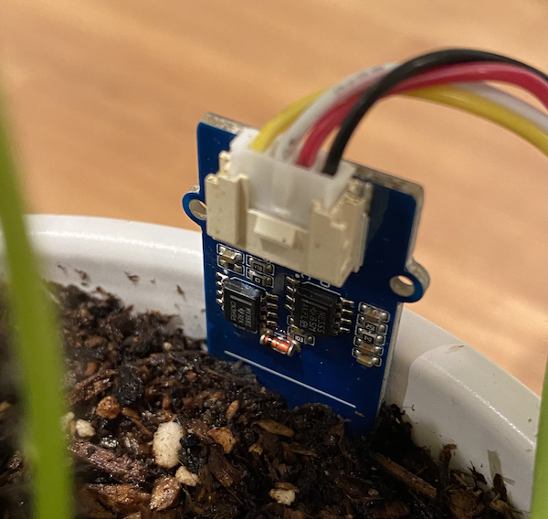

<!--
CO_OP_TRANSLATOR_METADATA:
{
  "original_hash": "0d55caa8c23d73635b7559102cd17b8a",
  "translation_date": "2025-08-26T22:48:51+00:00",
  "source_file": "2-farm/lessons/2-detect-soil-moisture/wio-terminal-soil-moisture.md",
  "language_code": "ru"
}
-->
# Измерение влажности почвы - Wio Terminal

В этой части урока вы добавите емкостный датчик влажности почвы к вашему Wio Terminal и будете считывать значения с него.

## Оборудование

Для Wio Terminal потребуется емкостный датчик влажности почвы.

Датчик, который вы будете использовать, — это [емкостный датчик влажности почвы](https://www.seeedstudio.com/Grove-Capacitive-Moisture-Sensor-Corrosion-Resistant.html), который измеряет влажность почвы, определяя её емкость — свойство, изменяющееся в зависимости от уровня влажности. С увеличением влажности почвы напряжение уменьшается.

Это аналоговый датчик, который подключается к аналоговым выводам Wio Terminal, используя встроенный АЦП для создания значения в диапазоне от 0 до 1023.

### Подключение датчика влажности почвы

Емкостный датчик влажности почвы Grove можно подключить к настраиваемому аналоговому/цифровому порту Wio Terminal.

#### Задача - подключить датчик влажности почвы

Подключите датчик влажности почвы.


1. Вставьте один конец кабеля Grove в разъем на датчике влажности почвы. Кабель вставляется только в одном направлении.

1. Отключив Wio Terminal от компьютера или другого источника питания, подключите другой конец кабеля Grove к правому разъему Grove на Wio Terminal, если смотреть на экран. Это разъем, который находится дальше всего от кнопки питания.


1. Вставьте датчик влажности почвы в почву. На датчике есть «линия максимального уровня» — белая линия, проходящая через датчик. Вставьте датчик до этой линии, но не глубже.



1. Теперь вы можете подключить Wio Terminal к вашему компьютеру.

## Программирование датчика влажности почвы

Теперь Wio Terminal можно запрограммировать для работы с подключенным датчиком влажности почвы.

### Задача - запрограммировать датчик влажности почвы

Программируйте устройство.

1. Создайте новый проект для Wio Terminal, используя PlatformIO. Назовите проект `soil-moisture-sensor`. Добавьте код в функцию `setup` для настройки последовательного порта.

    > ⚠️ Вы можете обратиться к [инструкции по созданию проекта PlatformIO в проекте 1, уроке 1, если потребуется](../../../1-getting-started/lessons/1-introduction-to-iot/wio-terminal.md#create-a-platformio-project).

1. Для этого датчика нет библиотеки, поэтому вы можете считывать данные с аналогового вывода, используя встроенную функцию Arduino [`analogRead`](https://www.arduino.cc/reference/en/language/functions/analog-io/analogread/). Начните с настройки аналогового вывода для ввода, чтобы можно было считывать значения, добавив следующий код в функцию `setup`.

    ```cpp
    pinMode(A0, INPUT);
    ```

    Этот код устанавливает вывод `A0`, комбинированный аналоговый/цифровой вывод, как входной вывод, с которого можно считывать напряжение.

1. Добавьте следующий код в функцию `loop` для считывания напряжения с этого вывода:

    ```cpp
    int soil_moisture = analogRead(A0);
    ```

1. Под этим кодом добавьте следующий код для вывода значения в последовательный порт:

    ```cpp
    Serial.print("Soil Moisture: ");
    Serial.println(soil_moisture);
    ```

1. В конце добавьте задержку на 10 секунд:

    ```cpp
    delay(10000);
    ```

1. Соберите и загрузите код на Wio Terminal.

    > ⚠️ Вы можете обратиться к [инструкции по созданию проекта PlatformIO в проекте 1, уроке 1, если потребуется](../../../1-getting-started/lessons/1-introduction-to-iot/wio-terminal.md#write-the-hello-world-app).

1. После загрузки вы можете наблюдать за влажностью почвы, используя последовательный монитор. Добавьте немного воды в почву или извлеките датчик из почвы и посмотрите, как изменяется значение.

    ```output
    > Executing task: platformio device monitor <
    
    --- Available filters and text transformations: colorize, debug, default, direct, hexlify, log2file, nocontrol, printable, send_on_enter, time
    --- More details at http://bit.ly/pio-monitor-filters
    --- Miniterm on /dev/cu.usbmodem1201  9600,8,N,1 ---
    --- Quit: Ctrl+C | Menu: Ctrl+T | Help: Ctrl+T followed by Ctrl+H ---
    Soil Moisture: 526
    Soil Moisture: 529
    Soil Moisture: 521
    Soil Moisture: 494
    Soil Moisture: 454
    Soil Moisture: 456
    Soil Moisture: 395
    Soil Moisture: 388
    Soil Moisture: 394
    Soil Moisture: 391
    ```

    В приведенном выше примере выходных данных видно, как напряжение падает при добавлении воды.

> 💁 Вы можете найти этот код в папке [code/wio-terminal](../../../../../2-farm/lessons/2-detect-soil-moisture/code/wio-terminal).

😀 Программа для датчика влажности почвы успешно завершена!

---

**Отказ от ответственности**:  
Этот документ был переведен с помощью сервиса автоматического перевода [Co-op Translator](https://github.com/Azure/co-op-translator). Хотя мы стремимся к точности, пожалуйста, учитывайте, что автоматические переводы могут содержать ошибки или неточности. Оригинальный документ на его исходном языке следует считать авторитетным источником. Для получения критически важной информации рекомендуется профессиональный перевод человеком. Мы не несем ответственности за любые недоразумения или неправильные интерпретации, возникающие в результате использования данного перевода.