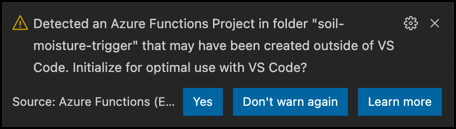

<!--
CO_OP_TRANSLATOR_METADATA:
{
  "original_hash": "5f2d2f4a5a023c93ab34a0cc5b47c0c4",
  "translation_date": "2025-08-26T22:31:24+00:00",
  "source_file": "2-farm/lessons/5-migrate-application-to-the-cloud/README.md",
  "language_code": "ru"
}
-->
# Перенос логики вашего приложения в облако


> Скетчноут от [Nitya Narasimhan](https://github.com/nitya). Нажмите на изображение, чтобы увидеть его в большем размере.

Этот урок был частью [Проекта 2 для начинающих в IoT - серия о цифровом сельском хозяйстве](https://youtube.com/playlist?list=PLmsFUfdnGr3yCutmcVg6eAUEfsGiFXgcx) от [Microsoft Reactor](https://developer.microsoft.com/reactor/?WT.mc_id=academic-17441-jabenn).

[](https://youtu.be/VVZDcs5u1_I)

## Викторина перед лекцией

[Викторина перед лекцией](https://black-meadow-040d15503.1.azurestaticapps.net/quiz/17)

## Введение

В прошлом уроке вы узнали, как подключить мониторинг влажности почвы и управление реле вашего растения к облачному IoT-сервису. Следующий шаг — перенести серверный код, который управляет временем работы реле, в облако. В этом уроке вы узнаете, как это сделать с помощью серверless-функций.

В этом уроке мы рассмотрим:

* [Что такое серверless?](../../../../../2-farm/lessons/5-migrate-application-to-the-cloud)
* [Создание серверless-приложения](../../../../../2-farm/lessons/5-migrate-application-to-the-cloud)
* [Создание триггера событий IoT Hub](../../../../../2-farm/lessons/5-migrate-application-to-the-cloud)
* [Отправка запросов на прямые методы из серверless-кода](../../../../../2-farm/lessons/5-migrate-application-to-the-cloud)
* [Развертывание серверless-кода в облаке](../../../../../2-farm/lessons/5-migrate-application-to-the-cloud)

## Что такое серверless?

Серверless, или серверless-вычисления, предполагает создание небольших блоков кода, которые выполняются в облаке в ответ на различные события. Когда событие происходит, ваш код запускается и получает данные о событии. Эти события могут быть вызваны различными источниками, включая веб-запросы, сообщения в очереди, изменения данных в базе данных или сообщения, отправленные IoT-устройствами в IoT-сервис.


> 💁 Если вы раньше использовали триггеры базы данных, вы можете представить это как аналогичное явление: код запускается в ответ на событие, например, добавление строки.


Ваш код выполняется только тогда, когда происходит событие, в остальное время он не активен. Событие происходит, ваш код загружается и выполняется. Это делает серверless очень масштабируемым — если множество событий происходит одновременно, облачный провайдер может запустить вашу функцию столько раз, сколько нужно, на доступных серверах. Недостаток в том, что если вам нужно делиться информацией между событиями, её нужно сохранять, например, в базе данных, а не в оперативной памяти.

Ваш код пишется в виде функции, которая принимает данные о событии в качестве параметра. Для написания серверless-функций можно использовать широкий спектр языков программирования.

> 🎓 Серверless также называют "Функции как услуга" (FaaS), так как каждый триггер события реализуется как функция в коде.

Несмотря на название, серверless всё же использует серверы. Название связано с тем, что разработчику не нужно заботиться о серверах, необходимых для выполнения кода, — всё, что важно, это то, что код выполняется в ответ на событие. Облачный провайдер управляет серверless-**средой выполнения**, которая распределяет серверы, сеть, хранилище, процессор, память и всё остальное, что нужно для выполнения вашего кода. В этой модели вы не платите за серверы, так как их нет. Вместо этого вы платите за время выполнения вашего кода и объём используемой памяти.

> 💰 Серверless — один из самых дешёвых способов выполнения кода в облаке. Например, на момент написания один из облачных провайдеров позволяет всем вашим серверless-функциям выполняться до 1 000 000 раз в месяц бесплатно, а затем взимает $0,20 за каждые 1 000 000 выполнений. Когда ваш код не выполняется, вы ничего не платите.

Для разработчиков IoT серверless-модель идеальна. Вы можете написать функцию, которая вызывается в ответ на сообщения, отправленные любым IoT-устройством, подключённым к вашему облачному IoT-сервису. Ваш код будет обрабатывать все отправленные сообщения, но будет выполняться только тогда, когда это необходимо.

✅ Вспомните код, который вы писали как серверный код для прослушивания сообщений через MQTT. Как, по вашему мнению, он может работать в облаке с использованием серверless? Как вы думаете, какие изменения нужно внести в код, чтобы поддерживать серверless-вычисления?

> 💁 Серверless-модель распространяется и на другие облачные сервисы, помимо выполнения кода. Например, в облаке доступны серверless-базы данных с моделью оплаты за запросы, такие как выборка или вставка данных, обычно с учётом объёма работы, необходимого для выполнения запроса. Например, выборка одной строки по первичному ключу будет стоить меньше, чем сложная операция с объединением множества таблиц и возвратом тысяч строк.

## Создание серверless-приложения

Сервис серверless-вычислений от Microsoft называется Azure Functions.


Короткое видео ниже даёт обзор Azure Functions.

[](https://www.youtube.com/watch?v=8-jz5f_JyEQ)

> 🎥 Нажмите на изображение выше, чтобы посмотреть видео.

✅ Найдите время, чтобы изучить обзор Azure Functions в [документации Microsoft Azure Functions](https://docs.microsoft.com/azure/azure-functions/functions-overview?WT.mc_id=academic-17441-jabenn).

Для написания Azure Functions вы начинаете с приложения Azure Functions на выбранном вами языке. Azure Functions поддерживает Python, JavaScript, TypeScript, C#, F#, Java и Powershell. В этом уроке вы научитесь писать приложение Azure Functions на Python.

> 💁 Azure Functions также поддерживает пользовательские обработчики, что позволяет писать функции на любом языке, поддерживающем HTTP-запросы, включая такие старые языки, как COBOL.

Приложения функций состоят из одного или нескольких *триггеров* — функций, которые реагируют на события. В одном приложении функций может быть несколько триггеров, которые используют общую конфигурацию. Например, в конфигурационном файле вашего приложения функций можно указать данные подключения к IoT Hub, и все функции в приложении смогут использовать их для подключения и прослушивания событий.

### Задача — установка инструментов Azure Functions

> На момент написания инструменты для работы с Azure Functions не полностью поддерживают проекты на Python на компьютерах с Apple Silicon. Вам потребуется использовать Mac с процессором Intel, ПК с Windows или ПК с Linux.

Одной из замечательных особенностей Azure Functions является возможность их локального выполнения. То же самое среда выполнения, что используется в облаке, может быть запущена на вашем компьютере, что позволяет писать код, реагирующий на сообщения IoT, и запускать его локально. Вы даже можете отлаживать ваш код во время обработки событий. После того как вы будете довольны своим кодом, его можно развернуть в облаке.

Инструменты Azure Functions доступны в виде CLI, известного как Azure Functions Core Tools.

1. Установите Azure Functions Core Tools, следуя инструкциям в [документации Azure Functions Core Tools](https://docs.microsoft.com/azure/azure-functions/functions-run-local?WT.mc_id=academic-17441-jabenn).

1. Установите расширение Azure Functions для VS Code. Это расширение предоставляет поддержку для создания, отладки и развертывания Azure Functions. Ознакомьтесь с [документацией по расширению Azure Functions](https://marketplace.visualstudio.com/items?WT.mc_id=academic-17441-jabenn&itemName=ms-azuretools.vscode-azurefunctions) для инструкций по установке этого расширения в VS Code.

При развертывании приложения Azure Functions в облаке ему потребуется небольшое количество облачного хранилища для хранения таких вещей, как файлы приложения и файлы журналов. Когда вы запускаете приложение функций локально, оно всё равно должно подключаться к облачному хранилищу, но вместо использования реального облачного хранилища вы можете использовать эмулятор хранилища под названием [Azurite](https://github.com/Azure/Azurite). Он работает локально, но ведёт себя как облачное хранилище.

> 🎓 В Azure хранилище, которое использует Azure Functions, называется Azure Storage Account. Эти аккаунты могут хранить файлы, блобы, данные в таблицах или данные в очередях. Один аккаунт хранилища можно использовать для множества приложений, таких как приложение функций и веб-приложение.

1. Azurite — это приложение на Node.js, поэтому вам нужно установить Node.js. Вы можете найти инструкции по загрузке и установке на [веб-сайте Node.js](https://nodejs.org/). Если вы используете Mac, вы также можете установить его через [Homebrew](https://formulae.brew.sh/formula/node).

1. Установите Azurite с помощью следующей команды (`npm` — это инструмент, который устанавливается вместе с Node.js):

    ```sh
    npm install -g azurite
    ```

1. Создайте папку с именем `azurite` для использования Azurite для хранения данных:

    ```sh
    mkdir azurite
    ```

1. Запустите Azurite, передав ему эту новую папку:

    ```sh
    azurite --location azurite
    ```

    Эмулятор хранилища Azurite запустится и будет готов для подключения локальной среды выполнения функций.

    ```output
    ➜  ~ azurite --location azurite  
    Azurite Blob service is starting at http://127.0.0.1:10000
    Azurite Blob service is successfully listening at http://127.0.0.1:10000
    Azurite Queue service is starting at http://127.0.0.1:10001
    Azurite Queue service is successfully listening at http://127.0.0.1:10001
    Azurite Table service is starting at http://127.0.0.1:10002
    Azurite Table service is successfully listening at http://127.0.0.1:10002
    ```

### Задача — создание проекта Azure Functions

CLI Azure Functions можно использовать для создания нового приложения функций.

1. Создайте папку для вашего приложения функций и перейдите в неё. Назовите её `soil-moisture-trigger`.

    ```sh
    mkdir soil-moisture-trigger
    cd soil-moisture-trigger
    ```

1. Создайте виртуальное окружение Python внутри этой папки:

    ```sh
    python3 -m venv .venv
    ```

1. Активируйте виртуальное окружение:

    * На Windows:
        * Если вы используете Command Prompt или Command Prompt через Windows Terminal, выполните:

            ```cmd
            .venv\Scripts\activate.bat
            ```

        * Если вы используете PowerShell, выполните:

            ```powershell
            .\.venv\Scripts\Activate.ps1
            ```

    * На macOS или Linux выполните:

        ```cmd
        source ./.venv/bin/activate
        ```

    > 💁 Эти команды должны выполняться из того же местоположения, где вы создали виртуальное окружение. Вам никогда не нужно заходить в папку `.venv`, вы всегда должны выполнять команду активации и любые команды для установки пакетов или запуска кода из папки, где вы создали виртуальное окружение.

1. Выполните следующую команду, чтобы создать приложение функций в этой папке:

    ```sh
    func init --worker-runtime python soil-moisture-trigger
    ```

    Это создаст три файла в текущей папке:

    * `host.json` — этот JSON-документ содержит настройки вашего приложения функций. Вам не нужно будет изменять эти настройки.
    * `local.settings.json` — этот JSON-документ содержит настройки, которые ваше приложение будет использовать при локальном запуске, такие как строки подключения к вашему IoT Hub. Эти настройки только локальные и не должны добавляться в систему контроля версий. При развертывании приложения в облаке эти настройки не развертываются, вместо этого ваши настройки загружаются из настроек приложения. Это будет рассмотрено позже в этом уроке.
    * `requirements.txt` — это [файл требований Pip](https://pip.pypa.io/en/stable/user_guide/#requirements-files), который содержит пакеты Pip, необходимые для работы вашего приложения функций.

1. Файл `local.settings.json` содержит настройку для аккаунта хранилища, который будет использовать приложение функций. По умолчанию это пустая настройка, поэтому её нужно задать. Чтобы подключиться к локальному эмулятору хранилища Azurite, установите это значение следующим образом:

    ```json
    "AzureWebJobsStorage": "UseDevelopmentStorage=true",
    ```

1. Установите необходимые пакеты Pip, используя файл требований:

    ```sh
    pip install -r requirements.txt
    ```

    > 💁 Необходимые пакеты Pip должны быть в этом файле, чтобы при развертывании приложения функций в облаке среда выполнения могла гарантировать установку правильных пакетов.

1. Чтобы проверить, всё ли работает правильно, вы можете запустить среду выполнения функций. Выполните следующую команду:

    ```sh
    func start
    ```

    Вы увидите, как среда выполнения запускается и сообщает, что не нашла никаких функций (триггеров).

    ```output
    (.venv) ➜  soil-moisture-trigger func start
    Found Python version 3.9.1 (python3).
    
    Azure Functions Core Tools
    Core Tools Version:       3.0.3442 Commit hash: 6bfab24b2743f8421475d996402c398d2fe4a9e0  (64-bit)
    Function Runtime Version: 3.0.15417.0
    
    [2021-05-05T01:24:46.795Z] No job functions found.
    ```
> ⚠️ Если вы получите уведомление от брандмауэра, предоставьте доступ, так как приложению `func` необходимо иметь возможность читать и записывать данные в вашу сеть.
> ⚠️ Если вы используете macOS, в выводе могут появляться предупреждения:
>
> ```output
    > (.venv) ➜  soil-moisture-trigger func start
    > Found Python version 3.9.1 (python3).
    >
    > Azure Functions Core Tools
    > Core Tools Version:       3.0.3442 Commit hash: 6bfab24b2743f8421475d996402c398d2fe4a9e0  (64-bit)
    > Function Runtime Version: 3.0.15417.0
    >
    > [2021-06-16T08:18:28.315Z] Cannot create directory for shared memory usage: /dev/shm/AzureFunctions
    > [2021-06-16T08:18:28.316Z] System.IO.FileSystem: Access to the path '/dev/shm/AzureFunctions' is denied. Operation not permitted.
    > [2021-06-16T08:18:30.361Z] No job functions found.
    > ```
>
> Вы можете игнорировать их, если приложение Functions запускается корректно и отображает работающие функции. Как упомянуто в [этом вопросе на Microsoft Docs Q&A](https://docs.microsoft.com/answers/questions/396617/azure-functions-core-tools-error-osx-devshmazurefu.html?WT.mc_id=academic-17441-jabenn), их можно не учитывать.

1. Остановите приложение Functions, нажав `ctrl+c`.

1. Откройте текущую папку в VS Code, либо запустив VS Code и открыв эту папку, либо выполнив следующую команду:

    ```sh
    code .
    ```

    VS Code обнаружит ваш проект Functions и покажет уведомление:

    ```output
    Detected an Azure Functions Project in folder "soil-moisture-trigger" that may have been created outside of
    VS Code. Initialize for optimal use with VS Code?
    ```

    

    Выберите **Yes** в этом уведомлении.

1. Убедитесь, что виртуальная среда Python запущена в терминале VS Code. При необходимости завершите её и перезапустите.

## Создание триггера событий IoT Hub

Приложение Functions является оболочкой для вашего серверного кода. Чтобы реагировать на события IoT Hub, вы можете добавить триггер IoT Hub в это приложение. Этот триггер должен подключиться к потоку сообщений, отправляемых в IoT Hub, и реагировать на них. Для получения этого потока сообщений ваш триггер должен подключиться к *совместимому с Event Hub конечному пункту* IoT Hub.

IoT Hub основан на другой службе Azure под названием Azure Event Hubs. Event Hubs — это служба, которая позволяет отправлять и получать сообщения, а IoT Hub расширяет её, добавляя функции для IoT-устройств. Подключение для чтения сообщений из IoT Hub осуществляется так же, как если бы вы использовали Event Hubs.

✅ Изучите: Прочитайте обзор Event Hubs в [документации Azure Event Hubs](https://docs.microsoft.com/azure/event-hubs/event-hubs-about?WT.mc_id=academic-17441-jabenn). Как базовые функции Event Hubs сравниваются с IoT Hub?

Для подключения IoT-устройства к IoT Hub необходимо использовать секретный ключ, который гарантирует, что только разрешённые устройства могут подключаться. То же самое относится и к подключению для чтения сообщений: вашему коду потребуется строка подключения, содержащая секретный ключ и данные о IoT Hub.

> 💁 Строка подключения по умолчанию, которую вы получаете, имеет разрешения **iothubowner**, что даёт любому коду, использующему её, полный доступ к IoT Hub. В идеале следует подключаться с минимально необходимым уровнем разрешений. Это будет рассмотрено в следующем уроке.

После подключения триггера код внутри функции будет вызываться для каждого сообщения, отправленного в IoT Hub, независимо от того, какое устройство его отправило. Сообщение будет передано в функцию в качестве параметра.

### Задача — получить строку подключения совместимого с Event Hub конечного пункта

1. В терминале VS Code выполните следующую команду, чтобы получить строку подключения для совместимого с Event Hub конечного пункта IoT Hub:

    ```sh
    az iot hub connection-string show --default-eventhub \
                                      --output table \
                                      --hub-name <hub_name>
    ```

    Замените `<hub_name>` на имя, которое вы использовали для вашего IoT Hub.

1. В VS Code откройте файл `local.settings.json`. Добавьте следующее значение в секцию `Values`:

    ```json
    "IOT_HUB_CONNECTION_STRING": "<connection string>"
    ```

    Замените `<connection string>` на значение из предыдущего шага. Вам нужно будет добавить запятую после предыдущей строки, чтобы это был корректный JSON.

### Задача — создать триггер событий

Теперь вы готовы создать триггер событий.

1. В терминале VS Code выполните следующую команду из папки `soil-moisture-trigger`:

    ```sh
    func new --name iot-hub-trigger --template "Azure Event Hub trigger"
    ```

    Это создаст новую функцию с именем `iot-hub-trigger`. Триггер подключится к совместимому с Event Hub конечному пункту IoT Hub, так как специфического триггера для IoT Hub не существует.

Это создаст папку внутри папки `soil-moisture-trigger` с именем `iot-hub-trigger`, которая будет содержать эту функцию. В этой папке будут следующие файлы:

* `__init__.py` — это файл кода Python, содержащий триггер, с использованием стандартного соглашения об именах файлов Python, чтобы сделать эту папку модулем Python.

    Этот файл будет содержать следующий код:

    ```python
    import logging

    import azure.functions as func


    def main(event: func.EventHubEvent):
        logging.info('Python EventHub trigger processed an event: %s',
                    event.get_body().decode('utf-8'))
    ```

    Основой триггера является функция `main`. Именно эта функция вызывается для обработки событий из IoT Hub. У этой функции есть параметр `event`, который содержит объект `EventHubEvent`. Каждый раз, когда сообщение отправляется в IoT Hub, эта функция вызывается с передачей этого сообщения в качестве `event`, а также свойств, аналогичных аннотациям, которые вы видели в прошлом уроке.

    Основная часть этой функции записывает событие в журнал.

* `function.json` — этот файл содержит конфигурацию для триггера. Основная конфигурация находится в секции `bindings`. Binding — это термин для обозначения соединения между Azure Functions и другими службами Azure. У этой функции есть входной binding для Event Hub — она подключается к Event Hub и получает данные.

    > 💁 Вы также можете использовать выходные bindings, чтобы результат работы функции отправлялся в другую службу. Например, вы можете добавить выходной binding для базы данных, и событие IoT Hub из функции будет автоматически вставлено в базу данных.

    ✅ Изучите: Прочитайте о bindings в [документации Azure Functions о триггерах и bindings](https://docs.microsoft.com/azure/azure-functions/functions-triggers-bindings?WT.mc_id=academic-17441-jabenn&tabs=python).

    Секция `bindings` включает конфигурацию для binding. Интересующие значения:

  * `"type": "eventHubTrigger"` — указывает функции, что она должна слушать события из Event Hub
  * `"name": "events"` — имя параметра для событий Event Hub. Это соответствует имени параметра в функции `main` в коде Python.
  * `"direction": "in"` — это входной binding, данные из Event Hub поступают в функцию
  * `"connection": ""` — определяет имя настройки для чтения строки подключения. При локальном запуске эта настройка будет прочитана из файла `local.settings.json`.

    > 💁 Строка подключения не может храниться в файле `function.json`, она должна считываться из настроек. Это сделано для предотвращения случайного раскрытия строки подключения.

1. Из-за [ошибки в шаблоне Azure Functions](https://github.com/Azure/azure-functions-templates/issues/1250) значение поля `cardinality` в `function.json` некорректно. Обновите это поле с `many` на `one`:

    ```json
    "cardinality": "one",
    ```

1. Обновите значение `"connection"` в файле `function.json`, чтобы оно указывало на новое значение, добавленное в файл `local.settings.json`:

    ```json
    "connection": "IOT_HUB_CONNECTION_STRING",
    ```

    > 💁 Помните — это должно указывать на настройку, а не содержать фактическую строку подключения.

1. Строка подключения содержит значение `eventHubName`, поэтому значение для этого поля в файле `function.json` нужно очистить. Обновите это значение на пустую строку:

    ```json
    "eventHubName": "",
    ```

### Задача — запустить триггер событий

1. Убедитесь, что монитор событий IoT Hub не запущен. Если он работает одновременно с приложением Functions, приложение Functions не сможет подключиться и обрабатывать события.

    > 💁 Несколько приложений могут подключаться к конечным пунктам IoT Hub, используя разные *группы потребителей*. Это будет рассмотрено в следующем уроке.

1. Чтобы запустить приложение Functions, выполните следующую команду в терминале VS Code:

    ```sh
    func start
    ```

    Приложение Functions запустится и обнаружит функцию `iot-hub-trigger`. Оно начнёт обрабатывать все события, которые были отправлены в IoT Hub за последний день.

    ```output
    (.venv) ➜  soil-moisture-trigger func start
    Found Python version 3.9.1 (python3).
    
    Azure Functions Core Tools
    Core Tools Version:       3.0.3442 Commit hash: 6bfab24b2743f8421475d996402c398d2fe4a9e0  (64-bit)
    Function Runtime Version: 3.0.15417.0
    
    Functions:
    
            iot-hub-trigger: eventHubTrigger
    
    For detailed output, run func with --verbose flag.
    [2021-05-05T02:44:07.517Z] Worker process started and initialized.
    [2021-05-05T02:44:09.202Z] Executing 'Functions.iot-hub-trigger' (Reason='(null)', Id=802803a5-eae9-4401-a1f4-176631456ce4)
    [2021-05-05T02:44:09.205Z] Trigger Details: PartitionId: 0, Offset: 1011240-1011632, EnqueueTimeUtc: 2021-05-04T19:04:04.2030000Z-2021-05-04T19:04:04.3900000Z, SequenceNumber: 2546-2547, Count: 2
    [2021-05-05T02:44:09.352Z] Python EventHub trigger processed an event: {"soil_moisture":628}
    [2021-05-05T02:44:09.354Z] Python EventHub trigger processed an event: {"soil_moisture":624}
    [2021-05-05T02:44:09.395Z] Executed 'Functions.iot-hub-trigger' (Succeeded, Id=802803a5-eae9-4401-a1f4-176631456ce4, Duration=245ms)
    ```

    Каждый вызов функции будет окружён блоками `Executing 'Functions.iot-hub-trigger'`/`Executed 'Functions.iot-hub-trigger'` в выводе, чтобы вы могли видеть, сколько сообщений было обработано в каждом вызове функции.

1. Убедитесь, что ваше IoT-устройство работает. Вы увидите новые сообщения о влажности почвы, появляющиеся в приложении Functions.

1. Остановите и перезапустите приложение Functions. Вы увидите, что оно больше не будет обрабатывать предыдущие сообщения, а только новые.

> 💁 VS Code также поддерживает отладку ваших функций. Вы можете установить точки останова, щёлкнув на границе рядом с началом строки кода, или поставив курсор на строку кода и выбрав *Run -> Toggle breakpoint*, или нажав `F9`. Вы можете запустить отладчик, выбрав *Run -> Start debugging*, нажав `F5`, или выбрав панель *Run and debug* и нажав кнопку **Start debugging**. Таким образом, вы сможете увидеть детали обрабатываемых событий.

#### Устранение неполадок

* Если вы получаете следующую ошибку:

    ```output
    The listener for function 'Functions.iot-hub-trigger' was unable to start. Microsoft.WindowsAzure.Storage: Connection refused. System.Net.Http: Connection refused. System.Private.CoreLib: Connection refused.
    ```

    Проверьте, запущен ли Azurite, и установлено ли значение `AzureWebJobsStorage` в файле `local.settings.json` на `UseDevelopmentStorage=true`.

* Если вы получаете следующую ошибку:

    ```output
    System.Private.CoreLib: Exception while executing function: Functions.iot-hub-trigger. System.Private.CoreLib: Result: Failure Exception: AttributeError: 'list' object has no attribute 'get_body'
    ```

    Проверьте, что вы установили значение `cardinality` в файле `function.json` на `one`.

* Если вы получаете следующую ошибку:

    ```output
    Azure.Messaging.EventHubs: The path to an Event Hub may be specified as part of the connection string or as a separate value, but not both.  Please verify that your connection string does not have the `EntityPath` token if you are passing an explicit Event Hub name. (Parameter 'connectionString').
    ```

    Проверьте, что вы установили значение `eventHubName` в файле `function.json` на пустую строку.

## Отправка запросов на выполнение методов напрямую из серверного кода

До сих пор ваше приложение Functions слушало сообщения из IoT Hub, используя совместимый с Event Hub конечный пункт. Теперь вам нужно отправлять команды на IoT-устройство. Это делается через другое подключение к IoT Hub с использованием *Registry Manager*. Registry Manager — это инструмент, который позволяет видеть зарегистрированные устройства в IoT Hub и взаимодействовать с ними, отправляя сообщения из облака на устройство, запросы на выполнение методов напрямую или обновляя двойник устройства. Вы также можете использовать его для регистрации, обновления или удаления IoT-устройств из IoT Hub.

Для подключения к Registry Manager вам потребуется строка подключения.

### Задача — получить строку подключения для Registry Manager

1. Чтобы получить строку подключения, выполните следующую команду:

    ```sh
    az iot hub connection-string show --policy-name service \
                                      --output table \
                                      --hub-name <hub_name>
    ```

    Замените `<hub_name>` на имя, которое вы использовали для вашего IoT Hub.

    Строка подключения запрашивается для политики *ServiceConnect* с использованием параметра `--policy-name service`. При запросе строки подключения вы можете указать, какие разрешения она будет предоставлять. Политика ServiceConnect позволяет вашему коду подключаться и отправлять сообщения на IoT-устройства.

    ✅ Изучите: Прочитайте о различных политиках в [документации о разрешениях IoT Hub](https://docs.microsoft.com/azure/iot-hub/iot-hub-devguide-security#iot-hub-permissions?WT.mc_id=academic-17441-jabenn)

1. В VS Code откройте файл `local.settings.json`. Добавьте следующее значение в секцию `Values`:

    ```json
    "REGISTRY_MANAGER_CONNECTION_STRING": "<connection string>"
    ```

    Замените `<connection string>` на значение из предыдущего шага. Вам нужно будет добавить запятую после предыдущей строки, чтобы это был корректный JSON.

### Задача — отправить запрос на выполнение метода напрямую на устройство

1. SDK для Registry Manager доступен через пакет Pip. Добавьте следующую строку в файл `requirements.txt`, чтобы добавить зависимость от этого пакета:

    ```sh
    azure-iot-hub
    ```

1. Убедитесь, что в терминале VS Code активирована виртуальная среда, и выполните следующую команду для установки пакетов Pip:

    ```sh
    pip install -r requirements.txt
    ```

1. Добавьте следующие импорты в файл `__init__.py`:

    ```python
    import json
    import os
    from azure.iot.hub import IoTHubRegistryManager
    from azure.iot.hub.models import CloudToDeviceMethod
    ```

    Это импортирует системные библиотеки, а также библиотеки для взаимодействия с Registry Manager и отправки запросов на выполнение методов напрямую.

1. Удалите код из функции `main`, но оставьте саму функцию.

1. В функции `main` добавьте следующий код:

    ```python
    body = json.loads(event.get_body().decode('utf-8'))
    device_id = event.iothub_metadata['connection-device-id']

    logging.info(f'Received message: {body} from {device_id}')
    ```

    Этот код извлекает тело события, которое содержит JSON-сообщение, отправленное IoT-устройством.

    Затем он получает идентификатор устройства из аннотаций, переданных с сообщением. Тело события содержит сообщение, отправленное в качестве телеметрии, а словарь `iothub_metadata` содержит свойства, установленные IoT Hub, такие как идентификатор устройства-отправителя и время отправки сообщения.

    Эта информация записывается в журнал. Вы увидите эти записи в терминале при локальном запуске приложения Functions.

1. Ниже добавьте следующий код:

    ```python
    soil_moisture = body['soil_moisture']

    if soil_moisture > 450:
        direct_method = CloudToDeviceMethod(method_name='relay_on', payload='{}')
    else:
        direct_method = CloudToDeviceMethod(method_name='relay_off', payload='{}')
    ```

    Этот код получает значение влажности почвы из сообщения. Затем он проверяет влажность почвы и, в зависимости от значения, создаёт вспомогательный класс для запроса на выполнение метода напрямую `relay_on` или `relay_off`. Запрос метода не требует полезной нагрузки, поэтому отправляется пустой JSON-документ.

1. Ниже добавьте следующий код:

    ```python
    logging.info(f'Sending direct method request for {direct_method.method_name} for device {device_id}')

    registry_manager_connection_string = os.environ['REGISTRY_MANAGER_CONNECTION_STRING']
    registry_manager = IoTHubRegistryManager(registry_manager_connection_string)
    ```
Этот код загружает `REGISTRY_MANAGER_CONNECTION_STRING` из файла `local.settings.json`. Значения из этого файла доступны как переменные окружения, и их можно считать с помощью функции `os.environ`, которая возвращает словарь всех переменных окружения.

> 💁 Когда этот код разворачивается в облаке, значения из файла `local.settings.json` устанавливаются как *Application Settings* (настройки приложения), и их можно считать из переменных окружения.

Затем код создает экземпляр вспомогательного класса Registry Manager, используя строку подключения.

1. Добавьте следующий код ниже:

    ```python
    registry_manager.invoke_device_method(device_id, direct_method)

    logging.info('Direct method request sent!')
    ```

    Этот код указывает менеджеру реестра отправить запрос на выполнение метода напрямую устройству, которое отправило телеметрию.

    > 💁 В версиях приложения, которые вы создавали в предыдущих уроках с использованием MQTT, команды управления реле отправлялись всем устройствам. Код предполагал, что у вас будет только одно устройство. Эта версия кода отправляет запрос на выполнение метода только одному устройству, что позволяет работать с несколькими наборами датчиков влажности и реле, отправляя правильный запрос правильному устройству.

1. Запустите приложение Functions и убедитесь, что ваше IoT-устройство отправляет данные. Вы увидите, как сообщения обрабатываются, а запросы на выполнение метода отправляются. Перемещайте датчик влажности почвы внутрь и наружу почвы, чтобы увидеть изменения значений и включение/выключение реле.

> 💁 Вы можете найти этот код в папке [code/functions](../../../../../2-farm/lessons/5-migrate-application-to-the-cloud/code/functions).

## Развертывание вашего серверлесс-кода в облаке

Ваш код теперь работает локально, поэтому следующим шагом будет развертывание приложения Functions в облаке.

### Задача - создание облачных ресурсов

Ваше приложение Functions должно быть развернуто в ресурсе Functions App в Azure, который находится внутри группы ресурсов, созданной для вашего IoT Hub. Вам также потребуется учетная запись хранилища, созданная в Azure, чтобы заменить эмулированное хранилище, работающее локально.

1. Выполните следующую команду для создания учетной записи хранилища:

    ```sh
    az storage account create --resource-group soil-moisture-sensor \
                              --sku Standard_LRS \
                              --name <storage_name> 
    ```

    Замените `<storage_name>` на имя для вашей учетной записи хранилища. Это имя должно быть уникальным в глобальном масштабе, так как оно является частью URL-адреса, используемого для доступа к учетной записи хранилища. Вы можете использовать только строчные буквы и цифры, без других символов, и длина имени ограничена 24 символами. Используйте что-то вроде `sms` и добавьте уникальный идентификатор, например случайные слова или ваше имя.

    Параметр `--sku Standard_LRS` выбирает уровень ценообразования, устанавливая самый дешевый общий аккаунт. Бесплатного уровня хранилища нет, и вы платите за то, что используете. Затраты относительно низкие, с самой дорогой памятью менее 0,05 доллара США в месяц за гигабайт.

    ✅ Ознакомьтесь с ценами на странице [ценообразования учетной записи хранилища Azure](https://azure.microsoft.com/pricing/details/storage/?WT.mc_id=academic-17441-jabenn).

1. Выполните следующую команду для создания приложения Functions:

    ```sh
    az functionapp create --resource-group soil-moisture-sensor \
                          --runtime python \
                          --functions-version 3 \
                          --os-type Linux \
                          --consumption-plan-location <location> \
                          --storage-account <storage_name> \
                          --name <functions_app_name>
    ```

    Замените `<location>` на местоположение, которое вы использовали при создании группы ресурсов в предыдущем уроке.

    Замените `<storage_name>` на имя учетной записи хранилища, созданной на предыдущем шаге.

    Замените `<functions_app_name>` на уникальное имя для вашего приложения Functions. Это имя должно быть уникальным в глобальном масштабе, так как оно является частью URL-адреса, который можно использовать для доступа к приложению Functions. Используйте что-то вроде `soil-moisture-sensor-` и добавьте уникальный идентификатор, например случайные слова или ваше имя.

    Параметр `--functions-version 3` устанавливает версию Azure Functions. Версия 3 является последней.

    Параметр `--os-type Linux` указывает среде выполнения Functions использовать Linux в качестве операционной системы для размещения этих функций. Functions могут размещаться на Linux или Windows в зависимости от используемого языка программирования. Приложения на Python поддерживаются только на Linux.

### Задача - загрузка настроек приложения

При разработке вашего приложения Functions вы сохраняли некоторые настройки в файле `local.settings.json` для строк подключения к вашему IoT Hub. Эти настройки необходимо записать в Application Settings вашего приложения Functions в Azure, чтобы их мог использовать ваш код.

> 🎓 Файл `local.settings.json` предназначен только для локальных настроек разработки, и его не следует добавлять в систему контроля версий, такую как GitHub. При развертывании в облаке используются Application Settings. Application Settings — это пары ключ/значение, размещенные в облаке, которые считываются из переменных окружения либо в вашем коде, либо средой выполнения при подключении вашего кода к IoT Hub.

1. Выполните следующую команду, чтобы установить настройку `IOT_HUB_CONNECTION_STRING` в Application Settings приложения Functions:

    ```sh
    az functionapp config appsettings set --resource-group soil-moisture-sensor \
                                          --name <functions_app_name> \
                                          --settings "IOT_HUB_CONNECTION_STRING=<connection string>"
    ```

    Замените `<functions_app_name>` на имя, которое вы использовали для вашего приложения Functions.

    Замените `<connection string>` на значение `IOT_HUB_CONNECTION_STRING` из вашего файла `local.settings.json`.

1. Повторите шаг выше, но установите значение `REGISTRY_MANAGER_CONNECTION_STRING` в соответствующее значение из вашего файла `local.settings.json`.

Когда вы выполните эти команды, они также выведут список всех Application Settings для приложения Functions. Вы можете использовать это, чтобы проверить, что ваши значения установлены правильно.

> 💁 Вы увидите значение, уже установленное для `AzureWebJobsStorage`. В вашем файле `local.settings.json` это значение было установлено для использования локального эмулятора хранилища. Когда вы создаете приложение Functions, вы передаете учетную запись хранилища в качестве параметра, и это значение устанавливается автоматически.

### Задача - развертывание вашего приложения Functions в облаке

Теперь, когда приложение Functions готово, ваш код можно развернуть.

1. Выполните следующую команду из терминала VS Code, чтобы опубликовать ваше приложение Functions:

    ```sh
    func azure functionapp publish <functions_app_name>
    ```

    Замените `<functions_app_name>` на имя, которое вы использовали для вашего приложения Functions.

Код будет упакован и отправлен в приложение Functions, где он будет развернут и запущен. Будет много вывода в консоль, заканчивающегося подтверждением развертывания и списком развернутых функций. В данном случае список будет содержать только триггер.

```output
Deployment successful.
Remote build succeeded!
Syncing triggers...
Functions in soil-moisture-sensor:
    iot-hub-trigger - [eventHubTrigger]
```

Убедитесь, что ваше IoT-устройство работает. Изменяйте уровень влажности, регулируя влажность почвы или перемещая датчик внутрь и наружу почвы. Вы увидите, как реле включается и выключается в зависимости от изменения влажности почвы.

---

## 🚀 Задание

В предыдущем уроке вы управляли временем работы реле, отписываясь от сообщений MQTT, пока реле было включено, и в течение короткого времени после его выключения. Здесь вы не можете использовать этот метод — вы не можете отписаться от триггера IoT Hub.

Подумайте о различных способах, которыми вы могли бы справиться с этим в вашем приложении Functions.

## Викторина после лекции

[Викторина после лекции](https://black-meadow-040d15503.1.azurestaticapps.net/quiz/18)

## Обзор и самостоятельное изучение

* Ознакомьтесь с серверлесс-вычислениями на странице [Serverless Computing в Википедии](https://wikipedia.org/wiki/Serverless_computing).
* Прочитайте о применении серверлесс в Azure, включая дополнительные примеры, в [посте блога Azure "Go serverless for your IoT needs"](https://azure.microsoft.com/blog/go-serverless-for-your-iot-needs/?WT.mc_id=academic-17441-jabenn).
* Узнайте больше об Azure Functions на [YouTube-канале Azure Functions](https://www.youtube.com/c/AzureFunctions).

## Задание

[Добавьте ручное управление реле](assignment.md)

---

**Отказ от ответственности**:  
Этот документ был переведен с помощью сервиса автоматического перевода [Co-op Translator](https://github.com/Azure/co-op-translator). Несмотря на наши усилия обеспечить точность, автоматические переводы могут содержать ошибки или неточности. Оригинальный документ на его родном языке следует считать авторитетным источником. Для получения критически важной информации рекомендуется профессиональный перевод человеком. Мы не несем ответственности за любые недоразумения или неправильные интерпретации, возникшие в результате использования данного перевода.