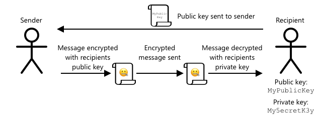

<!--
CO_OP_TRANSLATOR_METADATA:
{
  "original_hash": "81c437c568eee1b0dda1f04e88150d37",
  "translation_date": "2025-08-26T23:02:01+00:00",
  "source_file": "2-farm/lessons/6-keep-your-plant-secure/README.md",
  "language_code": "ru"
}
-->
# Держите ваше устройство в безопасности


> Скетчноут от [Nitya Narasimhan](https://github.com/nitya). Нажмите на изображение, чтобы увидеть его в большем размере.

## Тест перед лекцией

[Тест перед лекцией](https://black-meadow-040d15503.1.azurestaticapps.net/quiz/19)

## Введение

В предыдущих уроках вы создали IoT-устройство для мониторинга почвы и подключили его к облаку. Но что, если хакеры, работающие на конкурирующего фермера, захватят контроль над вашими IoT-устройствами? Что, если они отправят ложные данные о высокой влажности почвы, чтобы ваши растения никогда не поливались, или включат систему полива на постоянную работу, что приведет к гибели растений от переувлажнения и огромным расходам на воду?

В этом уроке вы узнаете, как защитить IoT-устройства. Поскольку это последний урок в этом проекте, вы также научитесь очищать свои облачные ресурсы, чтобы минимизировать возможные расходы.

В этом уроке мы рассмотрим:

* [Почему нужно защищать IoT-устройства?](../../../../../2-farm/lessons/6-keep-your-plant-secure)
* [Криптография](../../../../../2-farm/lessons/6-keep-your-plant-secure)
* [Как защитить свои IoT-устройства](../../../../../2-farm/lessons/6-keep-your-plant-secure)
* [Создание и использование сертификата X.509](../../../../../2-farm/lessons/6-keep-your-plant-secure)

> 🗑 Это последний урок в этом проекте, поэтому после завершения урока и выполнения задания не забудьте очистить свои облачные сервисы. Они понадобятся вам для выполнения задания, поэтому сначала убедитесь, что задание завершено.
>
> При необходимости обратитесь к [руководству по очистке проекта](../../../clean-up.md) для получения инструкций.

## Почему нужно защищать IoT-устройства?

Безопасность IoT предполагает, что только ожидаемые устройства могут подключаться к вашему облачному IoT-сервису и отправлять телеметрию, а только ваш облачный сервис может отправлять команды вашим устройствам. Данные IoT также могут быть личными, включая медицинскую или интимную информацию, поэтому вся ваша система должна учитывать безопасность, чтобы предотвратить утечку этих данных.

Если ваше IoT-приложение не защищено, возможны следующие риски:

* Поддельное устройство может отправлять некорректные данные, из-за чего ваше приложение будет работать неправильно. Например, оно может отправлять постоянные данные о высокой влажности почвы, из-за чего система полива никогда не включится, и ваши растения погибнут от недостатка воды.
* Неавторизованные пользователи могут читать данные с IoT-устройств, включая личные или критически важные для бизнеса данные.
* Хакеры могут отправлять команды для управления устройством таким образом, который может повредить устройство или подключенное оборудование.
* Подключившись к IoT-устройству, хакеры могут использовать его для доступа к другим сетям и получения доступа к частным системам.
* Злоумышленники могут получить доступ к личным данным и использовать их для шантажа.

Эти сценарии реальны и происходят постоянно. Некоторые примеры уже были приведены в предыдущих уроках, но вот еще несколько:

* В 2018 году хакеры использовали открытую точку доступа Wi-Fi на термостате аквариума, чтобы получить доступ к сети казино и украсть данные. [The Hacker News - Казино взломано через термометр аквариума, подключенный к Интернету](https://thehackernews.com/2018/04/iot-hacking-thermometer.html)
* В 2016 году ботнет Mirai запустил атаку типа "отказ в обслуживании" (DDoS) на компанию Dyn, провайдера интернет-услуг, что привело к отключению значительной части Интернета. Этот ботнет использовал вредоносное ПО для подключения к IoT-устройствам, таким как видеорегистраторы и камеры, которые использовали стандартные имена пользователей и пароли. [The Guardian - Атака DDoS, нарушившая работу Интернета, была крупнейшей в истории, говорят эксперты](https://www.theguardian.com/technology/2016/oct/26/ddos-attack-dyn-mirai-botnet)
* Компания Spiral Toys оставила базу данных пользователей своих игрушек CloudPets открытой для доступа через Интернет. [Troy Hunt - Данные пользователей игрушек CloudPets утекли и были выкуплены, обнажив голосовые сообщения детей](https://www.troyhunt.com/data-from-connected-cloudpets-teddy-bears-leaked-and-ransomed-exposing-kids-voice-messages/).
* Приложение Strava показывало маршруты бегунов, позволяя незнакомцам узнать, где вы живете. [Kim Komando - Фитнес-приложение может привести незнакомца прямо к вашему дому — измените эту настройку](https://www.komando.com/security-privacy/strava-fitness-app-privacy/755349/).

✅ Проведите исследование: Найдите больше примеров взломов IoT и утечек данных IoT, особенно с личными устройствами, такими как зубные щетки или весы, подключенные к Интернету. Подумайте о том, какое влияние эти взломы могут оказать на жертв или клиентов.

> 💁 Безопасность — это огромная тема, и в этом уроке мы затронем только основы, связанные с подключением вашего устройства к облаку. Мы не будем рассматривать такие темы, как мониторинг изменений данных при передаче, взлом устройств напрямую или изменения конфигурации устройств. Угроза взлома IoT настолько велика, что были разработаны инструменты, такие как [Azure Defender for IoT](https://azure.microsoft.com/services/azure-defender-for-iot/?WT.mc_id=academic-17441-jabenn). Эти инструменты аналогичны антивирусным и защитным программам, которые вы можете использовать на своем компьютере, но предназначены для небольших, маломощных IoT-устройств.

## Криптография

Когда устройство подключается к IoT-сервису, оно использует идентификатор для своей идентификации. Проблема в том, что этот идентификатор можно клонировать — хакер может настроить вредоносное устройство, которое использует тот же идентификатор, что и настоящее устройство, но отправляет ложные данные.


Решение этой проблемы заключается в преобразовании отправляемых данных в зашифрованный формат с использованием некоторого значения, известного только устройству и облаку. Этот процесс называется *шифрованием*, а значение, используемое для шифрования данных, называется *ключом шифрования*.


Облачный сервис может затем преобразовать данные обратно в читаемый формат, используя процесс, называемый *дешифрованием*, с использованием либо того же ключа шифрования, либо *ключа дешифрования*. Если зашифрованное сообщение не может быть расшифровано ключом, устройство считается взломанным, и сообщение отклоняется.

Техника шифрования и дешифрования называется *криптографией*.

### Ранняя криптография

Самые ранние виды криптографии — это шифры подстановки, которые появились около 3 500 лет назад. Шифры подстановки включают замену одной буквы на другую. Например, [шифр Цезаря](https://wikipedia.org/wiki/Caesar_cipher) предполагает сдвиг алфавита на определенное количество позиций, известное только отправителю и получателю зашифрованного сообщения.

[Шифр Виженера](https://wikipedia.org/wiki/Vigenère_cipher) пошел дальше, используя слова для шифрования текста, так что каждая буква в исходном тексте сдвигалась на разное количество позиций, а не всегда на одно и то же.

Криптография использовалась для самых разных целей, таких как защита рецепта глазури гончара в древней Месопотамии, написание секретных любовных записок в Индии или сохранение в тайне древнеегипетских магических заклинаний.

### Современная криптография

Современная криптография гораздо более сложна, что делает ее гораздо труднее взломать по сравнению с ранними методами. Она использует сложные математические алгоритмы для шифрования данных, с таким количеством возможных ключей, что атаки методом перебора становятся невозможными.

Криптография используется во многих аспектах для обеспечения безопасности коммуникаций. Например, если вы читаете эту страницу на GitHub, вы можете заметить, что адрес сайта начинается с *HTTPS*, что означает, что связь между вашим браузером и серверами GitHub зашифрована. Даже если кто-то сможет перехватить интернет-трафик между вашим браузером и GitHub, он не сможет прочитать данные, так как они зашифрованы. Ваш компьютер может даже зашифровать все данные на жестком диске, чтобы в случае кражи никто не смог прочитать ваши данные без пароля.

> 🎓 HTTPS расшифровывается как HyperText Transfer Protocol **Secure**

К сожалению, не все устройства защищены. Некоторые из них вообще не имеют защиты, другие используют легко взламываемые ключи, а иногда все устройства одного типа используют один и тот же ключ. Известны случаи, когда очень личные IoT-устройства имели одинаковый пароль для подключения через Wi-Fi или Bluetooth. Если вы можете подключиться к своему устройству, вы можете подключиться и к чужому. После подключения можно получить доступ к очень личным данным или управлять чужим устройством.

> 💁 Несмотря на сложность современной криптографии и утверждения, что взлом шифрования может занять миллиарды лет, развитие квантовых вычислений открывает возможность взлома всех известных методов шифрования за очень короткое время!

### Симметричные и асимметричные ключи

Шифрование бывает двух типов — симметричное и асимметричное.

**Симметричное** шифрование использует один и тот же ключ для шифрования и дешифрования данных. И отправитель, и получатель должны знать этот ключ. Это менее безопасный тип, так как ключ необходимо каким-то образом передать. Например, отправитель может сначала отправить получателю ключ.


Если ключ будет украден при передаче или если отправитель или получатель будут взломаны, и ключ станет известен, шифрование можно будет взломать.


**Асимметричное** шифрование использует два ключа — ключ шифрования и ключ дешифрования, которые называются парой открытого и закрытого ключей. Открытый ключ используется для шифрования сообщения, но не может быть использован для его дешифрования, а закрытый ключ используется для дешифрования сообщения, но не может быть использован для его шифрования.



Получатель делится своим открытым ключом, и отправитель использует его для шифрования сообщения. После отправки сообщения получатель расшифровывает его с помощью своего закрытого ключа. Асимметричное шифрование более безопасно, так как закрытый ключ остается у получателя и никогда не передается. Открытый ключ может быть доступен всем, так как он используется только для шифрования сообщений.

Симметричное шифрование быстрее, чем асимметричное, но асимметричное более безопасно. Некоторые системы используют оба типа — асимметричное шифрование для шифрования и передачи симметричного ключа, а затем симметричное шифрование для шифрования всех данных. Это делает передачу симметричного ключа между отправителем и получателем более безопасной, а шифрование и дешифрование данных — более быстрым.

## Как защитить свои IoT-устройства

IoT-устройства можно защитить с помощью симметричного или асимметричного шифрования. Симметричное шифрование проще, но менее безопасно.

### Симметричные ключи

Когда вы настраивали свое IoT-устройство для взаимодействия с IoT Hub, вы использовали строку подключения. Пример строки подключения:

```output
HostName=soil-moisture-sensor.azure-devices.net;DeviceId=soil-moisture-sensor;SharedAccessKey=Bhry+ind7kKEIDxubK61RiEHHRTrPl7HUow8cEm/mU0=
```

Эта строка подключения состоит из трех частей, разделенных точками с запятой, каждая из которых представляет собой ключ и значение:

| Ключ | Значение | Описание |
| --- | ----- | ----------- |
| HostName | `soil-moisture-sensor.azure-devices.net` | URL-адрес IoT Hub |
| DeviceId | `soil-moisture-sensor` | Уникальный идентификатор устройства |
| SharedAccessKey | `Bhry+ind7kKEIDxubK61RiEHHRTrPl7HUow8cEm/mU0=` | Симметричный ключ, известный устройству и IoT Hub |

Последняя часть этой строки подключения, `SharedAccessKey`, — это симметричный ключ, известный как устройству, так и IoT Hub. Этот ключ никогда не передается от устройства в облако или из облака на устройство. Вместо этого он используется для шифрования отправляемых или получаемых данных.

✅ Проведите эксперимент. Как вы думаете, что произойдет, если вы измените часть `SharedAccessKey` в строке подключения при подключении вашего IoT-устройства? Попробуйте это сделать.

Когда устройство впервые пытается подключиться, оно отправляет токен общего доступа (SAS), состоящий из URL-адреса IoT Hub, временной метки, когда токен истечет (обычно через 1 день с текущего времени), и подписи. Эта подпись состоит из URL-адреса и времени истечения, зашифрованных с использованием общего ключа доступа из строки подключения.

IoT Hub расшифровывает эту подпись с помощью общего ключа доступа, и если расшифрованное значение совпадает с URL-адресом и временем истечения, устройству разрешается подключиться. Также проверяется, что текущее время меньше времени истечения, чтобы предотвратить использование токена общего доступа реального устройства вредоносным устройством.

Это элегантный способ проверки подлинности устройства. Отправляя известные данные как в расшифрованном, так и в зашифрованном виде, сервер может убедиться, что отправитель является правильным устройством, проверяя, совпадает ли результат расшифровки зашифрованных данных с расшифрованной версией, которая была отправлена. Если совпадает, значит, и отправитель, и получатель имеют один и тот же симметричный ключ шифрования.
💁 Поскольку срок действия истекает, вашему IoT-устройству необходимо знать точное время, которое обычно считывается с сервера [NTP](https://wikipedia.org/wiki/Network_Time_Protocol). Если время будет неточным, соединение не удастся установить.
После подключения все данные, отправляемые в IoT Hub с устройства или на устройство из IoT Hub, будут зашифрованы с использованием общего ключа доступа.

✅ Как вы думаете, что произойдет, если несколько устройств будут использовать одну и ту же строку подключения?

> 💁 Хранить этот ключ в коде — плохая практика безопасности. Если хакер получит ваш исходный код, он сможет получить ваш ключ. Кроме того, это усложняет выпуск кода, так как вам придется перекомпилировать его с обновленным ключом для каждого устройства. Лучше загружать этот ключ из аппаратного модуля безопасности — чипа на IoT-устройстве, который хранит зашифрованные значения, доступные вашему коду.
>
> При изучении IoT часто проще поместить ключ в код, как вы сделали в предыдущем уроке, но необходимо убедиться, что этот ключ не попадает в публичные системы контроля версий.

Устройства имеют 2 ключа и 2 соответствующие строки подключения. Это позволяет вам менять ключи — то есть переключаться с одного ключа на другой, если первый был скомпрометирован, и заново генерировать первый ключ.

### X.509 сертификаты

Когда вы используете асимметричное шифрование с парой открытого/закрытого ключей, вам нужно предоставить ваш открытый ключ всем, кто хочет отправить вам данные. Проблема в том, как получатель вашего ключа может быть уверен, что это действительно ваш открытый ключ, а не ключ кого-то, кто притворяется вами? Вместо предоставления ключа вы можете предоставить ваш открытый ключ внутри сертификата, который был проверен доверенной третьей стороной, называемой X.509 сертификатом.

X.509 сертификаты — это цифровые документы, содержащие открытую часть пары открытого/закрытого ключей. Обычно они выдаются одной из множества доверенных организаций, называемых [центрами сертификации](https://wikipedia.org/wiki/Certificate_authority) (CA), и подписываются цифровой подписью CA, чтобы указать, что ключ действителен и принадлежит вам. Вы доверяете сертификату и тому, что открытый ключ принадлежит тому, кто указан в сертификате, потому что вы доверяете CA, так же как вы доверяете паспорту или водительскому удостоверению, потому что доверяете стране, которая их выдала. Сертификаты стоят денег, поэтому вы также можете «самоподписать» — то есть создать сертификат самостоятельно, подписанный вами, для тестирования.

> 💁 Никогда не используйте самоподписанный сертификат для выпуска в продакшн.

Эти сертификаты содержат ряд полей, включая информацию о том, кому принадлежит открытый ключ, данные CA, который его выдал, срок действия сертификата и сам открытый ключ. Перед использованием сертификата рекомендуется проверить его, убедившись, что он был подписан оригинальным CA.

✅ Вы можете ознакомиться с полным списком полей сертификата в [учебнике Microsoft Understanding X.509 Public Key Certificates](https://docs.microsoft.com/azure/iot-hub/tutorial-x509-certificates?WT.mc_id=academic-17441-jabenn#certificate-fields).

При использовании X.509 сертификатов и отправитель, и получатель имеют свои собственные открытые и закрытые ключи, а также X.509 сертификаты, содержащие открытый ключ. Затем они обмениваются X.509 сертификатами, используя открытые ключи друг друга для шифрования данных, которые они отправляют, и свои закрытые ключи для расшифровки данных, которые они получают.


Одним из больших преимуществ использования X.509 сертификатов является то, что их можно использовать на нескольких устройствах. Вы можете создать один сертификат, загрузить его в IoT Hub и использовать его для всех ваших устройств. Каждое устройство должно знать только закрытый ключ, чтобы расшифровывать сообщения, которые оно получает от IoT Hub.

Сертификат, используемый вашим устройством для шифрования сообщений, отправляемых в IoT Hub, публикуется Microsoft. Это тот же сертификат, который используется многими сервисами Azure и иногда встроен в SDK.

> 💁 Помните, что открытый ключ — это просто открытый ключ. Открытый ключ Azure можно использовать только для шифрования данных, отправляемых в Azure, а не для их расшифровки, поэтому его можно распространять повсеместно, включая исходный код. Например, вы можете увидеть его в [исходном коде Azure IoT C SDK](https://github.com/Azure/azure-iot-sdk-c/blob/master/certs/certs.c).

✅ С X.509 сертификатами связано много терминов. Вы можете ознакомиться с определениями некоторых из них в [руководстве для новичков по терминам X.509 сертификатов](https://techcommunity.microsoft.com/t5/internet-of-things/the-layman-s-guide-to-x-509-certificate-jargon/ba-p/2203540?WT.mc_id=academic-17441-jabenn).

## Генерация и использование X.509 сертификата

Шаги для генерации X.509 сертификата:

1. Создайте пару открытого/закрытого ключей. Один из самых широко используемых алгоритмов для генерации пары ключей называется [Rivest–Shamir–Adleman](https://wikipedia.org/wiki/RSA_(cryptosystem)) (RSA).

1. Отправьте открытый ключ с сопутствующими данными для подписания, либо в CA, либо для самоподписания.

Azure CLI имеет команды для создания новой идентичности устройства в IoT Hub, автоматической генерации пары ключей и создания самоподписанного сертификата.

> 💁 Если вы хотите увидеть шаги более подробно, вместо использования Azure CLI, вы можете найти их в [учебнике по использованию OpenSSL для создания самоподписанных сертификатов в документации Microsoft IoT Hub](https://docs.microsoft.com/azure/iot-hub/tutorial-x509-self-sign?WT.mc_id=academic-17441-jabenn).

### Задача — создать идентичность устройства с использованием X.509 сертификата

1. Выполните следующую команду, чтобы зарегистрировать новую идентичность устройства, автоматически сгенерировав ключи и сертификаты:

    ```sh
    az iot hub device-identity create --device-id soil-moisture-sensor-x509 \
                                      --am x509_thumbprint \
                                      --output-dir . \
                                      --hub-name <hub_name>
    ```

    Замените `<hub_name>` на имя, которое вы использовали для вашего IoT Hub.

    Это создаст устройство с идентификатором `soil-moisture-sensor-x509`, чтобы отличить его от идентичности устройства, созданной в предыдущем уроке. Эта команда также создаст 2 файла в текущем каталоге:

    * `soil-moisture-sensor-x509-key.pem` — этот файл содержит закрытый ключ устройства.
    * `soil-moisture-sensor-x509-cert.pem` — это файл X.509 сертификата устройства.

    Храните эти файлы в безопасности! Файл с закрытым ключом не должен попадать в публичные системы контроля версий.

### Задача — использовать X.509 сертификат в коде вашего устройства

Пройдите соответствующее руководство, чтобы подключить ваше IoT-устройство к облаку с использованием X.509 сертификата:

* [Arduino - Wio Terminal](wio-terminal-x509.md)
* [Одноплатный компьютер - Raspberry Pi/виртуальное IoT-устройство](single-board-computer-x509.md)

---

## 🚀 Челлендж

Существует несколько способов создания, управления и удаления сервисов Azure, таких как Resource Groups и IoT Hubs. Один из них — [Azure Portal](https://portal.azure.com?WT.mc_id=academic-17441-jabenn) — веб-интерфейс, который предоставляет GUI для управления вашими сервисами Azure.

Перейдите на [portal.azure.com](https://portal.azure.com?WT.mc_id=academic-17441-jabenn) и изучите портал. Попробуйте создать IoT Hub через портал, а затем удалить его.

**Подсказка** — при создании сервисов через портал вам не нужно заранее создавать Resource Group, она может быть создана во время создания сервиса. Убедитесь, что вы удалили ее, когда закончите!

Вы можете найти множество документации, учебников и руководств по Azure Portal в [документации Azure Portal](https://docs.microsoft.com/azure/azure-portal/?WT.mc_id=academic-17441-jabenn).

## Викторина после лекции

[Викторина после лекции](https://black-meadow-040d15503.1.azurestaticapps.net/quiz/20)

## Обзор и самостоятельное изучение

* Ознакомьтесь с историей криптографии на [странице истории криптографии в Википедии](https://wikipedia.org/wiki/History_of_cryptography).
* Узнайте больше о X.509 сертификатах на [странице X.509 в Википедии](https://wikipedia.org/wiki/X.509).

## Задание

[Создайте новое IoT-устройство](assignment.md)

---

**Отказ от ответственности**:  
Этот документ был переведен с помощью сервиса автоматического перевода [Co-op Translator](https://github.com/Azure/co-op-translator). Хотя мы стремимся к точности, пожалуйста, учитывайте, что автоматические переводы могут содержать ошибки или неточности. Оригинальный документ на его родном языке следует считать авторитетным источником. Для получения критически важной информации рекомендуется профессиональный перевод человеком. Мы не несем ответственности за любые недоразумения или неправильные интерпретации, возникающие в результате использования данного перевода.