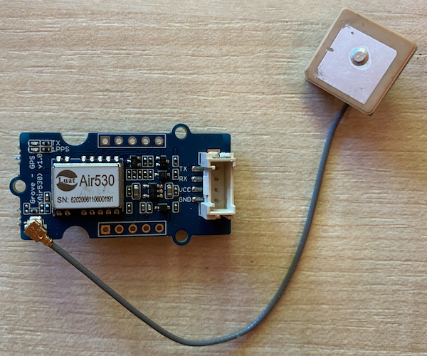

<!--
CO_OP_TRANSLATOR_METADATA:
{
  "original_hash": "3b2448c7ab4e9673e77e35a50c5e350d",
  "translation_date": "2025-08-27T00:50:18+00:00",
  "source_file": "3-transport/lessons/1-location-tracking/pi-gps-sensor.md",
  "language_code": "ru"
}
-->
# Чтение данных GPS - Raspberry Pi

В этой части урока вы добавите GPS-датчик к вашему Raspberry Pi и будете считывать данные с него.

## Оборудование

Для Raspberry Pi требуется GPS-датчик.

Датчик, который вы будете использовать, — это [Grove GPS Air530 sensor](https://www.seeedstudio.com/Grove-GPS-Air530-p-4584.html). Этот датчик может подключаться к нескольким GPS-системам для быстрого и точного определения местоположения. Датчик состоит из двух частей: основной электроники датчика и внешней антенны, подключенной тонким проводом для приема радиоволн от спутников.

Это датчик UART, который передает данные GPS через UART.

## Подключение GPS-датчика

Датчик Grove GPS можно подключить к Raspberry Pi.

### Задание - подключить GPS-датчик

Подключите GPS-датчик.



1. Вставьте один конец кабеля Grove в разъем на GPS-датчике. Он вставляется только в одном направлении.

1. При выключенном Raspberry Pi подключите другой конец кабеля Grove к разъему UART, обозначенному как **UART**, на Grove Base Hat, установленном на Pi. Этот разъем находится в среднем ряду, на стороне, ближайшей к слоту для SD-карты, противоположной USB-портам и разъему Ethernet.

    

1. Разместите GPS-датчик так, чтобы подключенная антенна имела видимость неба — лучше всего рядом с открытым окном или на улице. Чем меньше препятствий для антенны, тем легче получить четкий сигнал.

## Программирование GPS-датчика

Теперь Raspberry Pi можно запрограммировать для работы с подключенным GPS-датчиком.

### Задание - запрограммировать GPS-датчик

Программируйте устройство.

1. Включите Pi и дождитесь его загрузки.

1. У GPS-датчика есть два светодиода: синий светодиод мигает при передаче данных, а зеленый светодиод мигает каждую секунду при получении данных от спутников. Убедитесь, что синий светодиод мигает при включении Pi. Через несколько минут начнет мигать зеленый светодиод — если этого не происходит, возможно, потребуется изменить положение антенны.

1. Запустите VS Code, либо непосредственно на Pi, либо подключитесь через расширение Remote SSH.

    > ⚠️ Вы можете обратиться к [инструкциям по настройке и запуску VS Code в уроке 1, если это необходимо](../../../1-getting-started/lessons/1-introduction-to-iot/pi.md).

1. В более новых версиях Raspberry Pi, поддерживающих Bluetooth, возникает конфликт между последовательным портом, используемым для Bluetooth, и портом, используемым для Grove UART. Чтобы устранить это, выполните следующие действия:

    1. В терминале VS Code отредактируйте файл `/boot/config.txt`, используя `nano`, встроенный текстовый редактор терминала, с помощью следующей команды:

        ```sh
        sudo nano /boot/config.txt
        ```

        > Этот файл нельзя редактировать через VS Code, так как для этого требуются права `sudo`, повышенные разрешения. VS Code не работает с такими разрешениями.

    1. Используйте клавиши курсора, чтобы перейти в конец файла, затем скопируйте приведенный ниже код и вставьте его в конец файла:

        ```ini
        dtoverlay=pi3-miniuart-bt
        dtoverlay=pi3-disable-bt
        enable_uart=1
        ```

        Вы можете вставить текст, используя стандартные сочетания клавиш для вашего устройства (`Ctrl+v` на Windows, Linux или Raspberry Pi OS, `Cmd+v` на macOS).

    1. Сохраните файл и выйдите из nano, нажав `Ctrl+x`. Нажмите `y`, когда вас спросят, хотите ли вы сохранить измененный буфер, затем нажмите `Enter`, чтобы подтвердить перезапись `/boot/config.txt`.

        > Если вы допустили ошибку, вы можете выйти без сохранения, а затем повторить эти шаги.

    1. Отредактируйте файл `/boot/cmdline.txt` в nano с помощью следующей команды:

        ```sh
        sudo nano /boot/cmdline.txt
        ```

    1. Этот файл содержит несколько пар ключ/значение, разделенных пробелами. Удалите любые пары ключ/значение для ключа `console`. Они, вероятно, будут выглядеть примерно так:

        ```output
        console=serial0,115200 console=tty1 
        ```

        Вы можете перейти к этим записям, используя клавиши курсора, затем удалить их с помощью клавиш `del` или `backspace`.

        Например, если ваш исходный файл выглядит так:

        ```output
        console=serial0,115200 console=tty1 root=PARTUUID=058e2867-02 rootfstype=ext4 elevator=deadline fsck.repair=yes rootwait
        ```

        Новая версия будет выглядеть так:

        ```output
        root=PARTUUID=058e2867-02 rootfstype=ext4 elevator=deadline fsck.repair=yes rootwait
        ```

    1. Следуйте приведенным выше шагам, чтобы сохранить файл и выйти из nano.

    1. Перезагрузите Pi, затем снова подключитесь в VS Code после перезагрузки Pi.

1. В терминале создайте новую папку в домашнем каталоге пользователя `pi` с именем `gps-sensor`. Создайте файл в этой папке с именем `app.py`.

1. Откройте эту папку в VS Code.

1. Модуль GPS отправляет данные UART через последовательный порт. Установите пакет `pyserial` через Pip для взаимодействия с последовательным портом из вашего Python-кода:

    ```sh
    pip3 install pyserial
    ```

1. Добавьте следующий код в ваш файл `app.py`:

    ```python
    import time
    import serial
    
    serial = serial.Serial('/dev/ttyAMA0', 9600, timeout=1)
    serial.reset_input_buffer()
    serial.flush()
    
    def print_gps_data(line):
        print(line.rstrip())
    
    while True:
        line = serial.readline().decode('utf-8')
    
        while len(line) > 0:
            print_gps_data(line)
            line = serial.readline().decode('utf-8')
    
        time.sleep(1)
    ```

    Этот код импортирует модуль `serial` из пакета `pyserial`. Затем он подключается к последовательному порту `/dev/ttyAMA0` — это адрес последовательного порта, который Grove Pi Base Hat использует для своего UART-порта. Затем он очищает любые существующие данные из этого последовательного соединения.

    Далее определяется функция `print_gps_data`, которая выводит переданную ей строку в консоль.

    Затем код выполняет бесконечный цикл, считывая столько строк текста, сколько возможно, из последовательного порта в каждом цикле. Он вызывает функцию `print_gps_data` для каждой строки.

    После того как все данные считаны, цикл засыпает на 1 секунду, затем повторяет попытку.

1. Запустите этот код. Вы увидите необработанный вывод от GPS-датчика, что-то вроде следующего:

    ```output
    $GNGGA,020604.001,4738.538654,N,12208.341758,W,1,3,,164.7,M,-17.1,M,,*67
    $GPGSA,A,1,,,,,,,,,,,,,,,*1E
    $BDGSA,A,1,,,,,,,,,,,,,,,*0F
    $GPGSV,1,1,00*79
    $BDGSV,1,1,00*68
    ```

    > Если вы получите одну из следующих ошибок при остановке и повторном запуске вашего кода, добавьте блок `try - except` в ваш цикл while.

      ```output
      UnicodeDecodeError: 'utf-8' codec can't decode byte 0x93 in position 0: invalid start byte
      UnicodeDecodeError: 'utf-8' codec can't decode byte 0xf1 in position 0: invalid continuation byte
      ```

    ```python
    while True:
        try:
            line = serial.readline().decode('utf-8')
              
            while len(line) > 0:
                print_gps_data()
                line = serial.readline().decode('utf-8')
      
        # There's a random chance the first byte being read is part way through a character.
        # Read another full line and continue.

        except UnicodeDecodeError:
            line = serial.readline().decode('utf-8')

    time.sleep(1)
    ```

> 💁 Вы можете найти этот код в папке [code-gps/pi](../../../../../3-transport/lessons/1-location-tracking/code-gps/pi).

😀 Программа для вашего GPS-датчика успешно выполнена!

---

**Отказ от ответственности**:  
Этот документ был переведен с помощью сервиса автоматического перевода [Co-op Translator](https://github.com/Azure/co-op-translator). Несмотря на наши усилия обеспечить точность, автоматические переводы могут содержать ошибки или неточности. Оригинальный документ на его родном языке следует считать авторитетным источником. Для получения критически важной информации рекомендуется профессиональный перевод человеком. Мы не несем ответственности за любые недоразумения или неправильные интерпретации, возникающие в результате использования данного перевода.