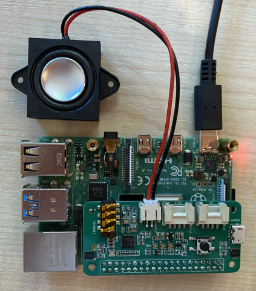

<!--
CO_OP_TRANSLATOR_METADATA:
{
  "original_hash": "7e45d884493c5222348b43fbc4481b6a",
  "translation_date": "2025-08-27T00:29:45+00:00",
  "source_file": "6-consumer/lessons/1-speech-recognition/pi-microphone.md",
  "language_code": "ru"
}
-->
# Настройка микрофона и динамиков - Raspberry Pi

В этой части урока вы подключите микрофон и динамики к вашему Raspberry Pi.

## Оборудование

Для Raspberry Pi требуется микрофон.

Встроенного микрофона у Raspberry Pi нет, поэтому вам нужно будет подключить внешний микрофон. Это можно сделать несколькими способами:

* USB-микрофон
* USB-гарнитура
* USB-спикерфон
* USB-аудиоадаптер и микрофон с разъемом 3,5 мм
* [ReSpeaker 2-Mics Pi HAT](https://www.seeedstudio.com/ReSpeaker-2-Mics-Pi-HAT.html)

> 💁 Не все Bluetooth-микрофоны поддерживаются Raspberry Pi, поэтому, если у вас есть Bluetooth-микрофон или гарнитура, могут возникнуть проблемы с подключением или записью звука.

Raspberry Pi оснащен разъемом для наушников 3,5 мм. Вы можете использовать его для подключения наушников, гарнитуры или динамика. Также можно подключить динамики с помощью:

* HDMI-аудио через монитор или телевизор
* USB-динамиков
* USB-гарнитуры
* USB-спикерфона
* [ReSpeaker 2-Mics Pi HAT](https://www.seeedstudio.com/ReSpeaker-2-Mics-Pi-HAT.html) с подключенным динамиком через разъем 3,5 мм или порт JST

## Подключение и настройка микрофона и динамиков

Микрофон и динамики необходимо подключить и настроить.

### Задача - подключение и настройка микрофона

1. Подключите микрофон подходящим способом. Например, подключите его через один из USB-портов.

1. Если вы используете ReSpeaker 2-Mics Pi HAT, вы можете снять базовую плату Grove, а затем установить плату ReSpeaker на её место.

    

    Позже в этом уроке вам понадобится кнопка Grove, но она уже встроена в эту плату, поэтому базовая плата Grove не нужна.

    После установки платы вам потребуется установить драйверы. Ознакомьтесь с [инструкциями по началу работы от Seeed](https://wiki.seeedstudio.com/ReSpeaker_2_Mics_Pi_HAT_Raspberry/#getting-started) для установки драйверов.

    > ⚠️ В инструкциях используется `git` для клонирования репозитория. Если `git` не установлен на вашем Raspberry Pi, вы можете установить его, выполнив следующую команду:
    >
    > ```sh
    > sudo apt install git --yes
    > ```

1. Выполните следующую команду в терминале на Raspberry Pi или через удаленный сеанс SSH в VS Code, чтобы увидеть информацию о подключенном микрофоне:

    ```sh
    arecord -l
    ```

    Вы увидите список подключенных микрофонов. Он будет выглядеть примерно так:

    ```output
    pi@raspberrypi:~ $ arecord -l
    **** List of CAPTURE Hardware Devices ****
    card 1: M0 [eMeet M0], device 0: USB Audio [USB Audio]
      Subdevices: 1/1
      Subdevice #0: subdevice #0
    ```

    Если у вас подключен только один микрофон, вы увидите только одну запись. Настройка микрофонов в Linux может быть сложной, поэтому проще использовать только один микрофон и отключить все остальные.

    Запишите номер карты, так как он понадобится вам позже. В приведенном выше выводе номер карты — 1.

### Задача - подключение и настройка динамика

1. Подключите динамики подходящим способом.

1. Выполните следующую команду в терминале на Raspberry Pi или через удаленный сеанс SSH в VS Code, чтобы увидеть информацию о подключенных динамиках:

    ```sh
    aplay -l
    ```

    Вы увидите список подключенных динамиков. Он будет выглядеть примерно так:

    ```output
    pi@raspberrypi:~ $ aplay -l
    **** List of PLAYBACK Hardware Devices ****
    card 0: Headphones [bcm2835 Headphones], device 0: bcm2835 Headphones [bcm2835 Headphones]
      Subdevices: 8/8
      Subdevice #0: subdevice #0
      Subdevice #1: subdevice #1
      Subdevice #2: subdevice #2
      Subdevice #3: subdevice #3
      Subdevice #4: subdevice #4
      Subdevice #5: subdevice #5
      Subdevice #6: subdevice #6
      Subdevice #7: subdevice #7
    card 1: M0 [eMeet M0], device 0: USB Audio [USB Audio]
      Subdevices: 1/1
      Subdevice #0: subdevice #0
    ```

    Вы всегда увидите `card 0: Headphones`, так как это встроенный разъем для наушников. Если вы добавили дополнительные динамики, например USB-динамик, они также будут отображены в списке.

1. Если вы используете дополнительный динамик, а не динамик или наушники, подключенные к встроенному разъему для наушников, вам нужно настроить его как устройство по умолчанию. Для этого выполните следующую команду:

    ```sh
    sudo nano /usr/share/alsa/alsa.conf
    ```

    Эта команда откроет файл конфигурации в `nano`, текстовом редакторе для терминала. Прокрутите вниз с помощью стрелок на клавиатуре, пока не найдете следующую строку:

    ```output
    defaults.pcm.card 0
    ```

    Измените значение с `0` на номер карты, которую вы хотите использовать, из списка, полученного с помощью команды `aplay -l`. Например, в приведенном выше выводе есть вторая звуковая карта с названием `card 1: M0 [eMeet M0], device 0: USB Audio [USB Audio]`, использующая карту 1. Чтобы использовать её, я бы обновил строку следующим образом:

    ```output
    defaults.pcm.card 1
    ```

    Установите это значение на соответствующий номер карты. Вы можете переместиться к числу с помощью стрелок на клавиатуре, затем удалить и ввести новое число, как при редактировании обычного текстового файла.

1. Сохраните изменения и закройте файл, нажав `Ctrl+x`. Нажмите `y`, чтобы сохранить файл, затем `Enter`, чтобы подтвердить имя файла.

### Задача - тестирование микрофона и динамика

1. Выполните следующую команду, чтобы записать 5 секунд аудио через микрофон:

    ```sh
    arecord --format=S16_LE --duration=5 --rate=16000 --file-type=wav out.wav
    ```

    Пока выполняется эта команда, создавайте шум в микрофон, например, говорите, пойте, битбоксьте, играйте на инструменте или делайте что угодно на ваш вкус.

1. Через 5 секунд запись остановится. Выполните следующую команду, чтобы воспроизвести аудио:

    ```sh
    aplay --format=S16_LE --rate=16000 out.wav
    ```

    Вы услышите воспроизведение аудио через динамики. При необходимости отрегулируйте громкость на динамике.

1. Если вам нужно отрегулировать громкость встроенного микрофонного порта или усиление микрофона, вы можете использовать утилиту `alsamixer`. Подробнее об этой утилите можно прочитать на [странице man для alsamixer](https://linux.die.net/man/1/alsamixer).

1. Если при воспроизведении аудио возникают ошибки, проверьте карту, которую вы указали как `defaults.pcm.card` в файле `alsa.conf`.

---

**Отказ от ответственности**:  
Этот документ был переведен с помощью сервиса автоматического перевода [Co-op Translator](https://github.com/Azure/co-op-translator). Хотя мы стремимся к точности, пожалуйста, учитывайте, что автоматические переводы могут содержать ошибки или неточности. Оригинальный документ на его родном языке следует считать авторитетным источником. Для получения критически важной информации рекомендуется профессиональный перевод человеком. Мы не несем ответственности за любые недоразумения или неправильные интерпретации, возникающие в результате использования данного перевода.