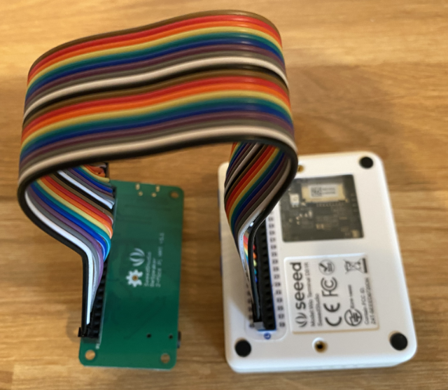

<!--
CO_OP_TRANSLATOR_METADATA:
{
  "original_hash": "93d352de36526b8990e41dd538100324",
  "translation_date": "2025-08-27T00:31:09+00:00",
  "source_file": "6-consumer/lessons/1-speech-recognition/wio-terminal-microphone.md",
  "language_code": "ru"
}
-->
# Настройка микрофона и динамиков - Wio Terminal

В этой части урока вы добавите динамики к вашему Wio Terminal. Wio Terminal уже оснащен встроенным микрофоном, который можно использовать для записи речи.

## Оборудование

Wio Terminal уже имеет встроенный микрофон, который можно использовать для записи звука для распознавания речи.

Чтобы добавить динамик, вы можете использовать [ReSpeaker 2-Mics Pi Hat](https://www.seeedstudio.com/ReSpeaker-2-Mics-Pi-HAT.html). Это внешняя плата, которая содержит 2 MEMS-микрофона, а также разъем для подключения динамика и гнездо для наушников.

Вам потребуется подключить либо наушники, либо динамик с разъемом 3.5 мм, либо динамик с JST-разъемом, например, [Mono Enclosed Speaker - 2W 6 Ohm](https://www.seeedstudio.com/Mono-Enclosed-Speaker-2W-6-Ohm-p-2832.html).

Для подключения ReSpeaker 2-Mics Pi Hat вам понадобятся 40 проводов типа "пин-к-пин" (их также называют "мужской-мужской").

> 💁 Если вы умеете паять, вы можете использовать [40 Pin Raspberry Pi Hat Adapter Board For Wio Terminal](https://www.seeedstudio.com/40-Pin-Raspberry-Pi-Hat-Adapter-Board-For-Wio-Terminal-p-4730.html) для подключения ReSpeaker.

Также вам понадобится SD-карта для загрузки и воспроизведения аудио. Wio Terminal поддерживает только SD-карты объемом до 16 ГБ, которые должны быть отформатированы в FAT32 или exFAT.

### Задача - подключение ReSpeaker Pi Hat

1. При выключенном Wio Terminal подключите ReSpeaker 2-Mics Pi Hat к Wio Terminal с помощью проводов "пин-к-пин" и GPIO-разъемов на задней стороне Wio Terminal:

    Пины должны быть подключены следующим образом:

    

1. Разместите ReSpeaker и Wio Terminal так, чтобы GPIO-разъемы были направлены вверх и находились с левой стороны.

1. Начните с верхнего левого разъема GPIO на ReSpeaker. Подключите провод "пин-к-пин" от верхнего левого разъема ReSpeaker к верхнему левому разъему Wio Terminal.

1. Повторите это для всех разъемов на левой стороне GPIO. Убедитесь, что провода надежно закреплены.

    

    

    > 💁 Если ваши провода соединены в ленты, держите их вместе — это облегчит проверку правильности подключения всех проводов.

1. Повторите процесс для правой стороны GPIO-разъемов на ReSpeaker и Wio Terminal. Эти провода должны проходить вокруг уже подключенных проводов.

    

    

    > 💁 Если ваши провода соединены в ленты, разделите их на две ленты. Пропустите одну с каждой стороны уже подключенных проводов.

    > 💁 Вы можете использовать скотч, чтобы закрепить пины в блоке и предотвратить их выпадение во время подключения.
    >
    > 

1. Вам нужно будет подключить динамик.

    * Если вы используете динамик с JST-кабелем, подключите его к JST-разъему на ReSpeaker.

      

    * Если вы используете динамик с разъемом 3.5 мм или наушники, вставьте их в гнездо 3.5 мм.

      

### Задача - настройка SD-карты

1. Подключите SD-карту к вашему компьютеру, используя внешний картридер, если у вас нет встроенного слота для SD-карт.

1. Отформатируйте SD-карту с помощью подходящего инструмента на вашем компьютере, убедившись, что используется файловая система FAT32 или exFAT.

1. Вставьте SD-карту в слот для SD-карт на левой стороне Wio Terminal, прямо под кнопкой питания. Убедитесь, что карта вставлена до конца и зафиксирована — возможно, вам понадобится тонкий инструмент или другая SD-карта, чтобы помочь вставить ее полностью.

    

    > 💁 Чтобы извлечь SD-карту, нужно слегка нажать на нее, и она выскочит. Для этого вам понадобится тонкий инструмент, например, плоская отвертка или другая SD-карта.

---

**Отказ от ответственности**:  
Этот документ был переведен с помощью сервиса автоматического перевода [Co-op Translator](https://github.com/Azure/co-op-translator). Несмотря на наши усилия обеспечить точность, автоматические переводы могут содержать ошибки или неточности. Оригинальный документ на его родном языке следует считать авторитетным источником. Для получения критически важной информации рекомендуется профессиональный перевод человеком. Мы не несем ответственности за любые недоразумения или неправильные интерпретации, возникающие в результате использования данного перевода.