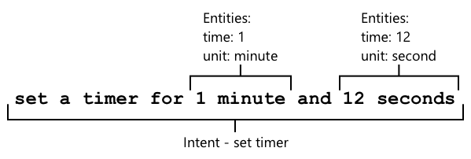

<!--
CO_OP_TRANSLATOR_METADATA:
{
  "original_hash": "6f4ba69d77f16c4a5110623a96a215c3",
  "translation_date": "2025-08-26T23:59:24+00:00",
  "source_file": "6-consumer/lessons/2-language-understanding/README.md",
  "language_code": "ru"
}
-->
# Понять язык


> Скетчноут от [Nitya Narasimhan](https://github.com/nitya). Нажмите на изображение, чтобы увидеть его в большем размере.

## Викторина перед лекцией

[Викторина перед лекцией](https://black-meadow-040d15503.1.azurestaticapps.net/quiz/43)

## Введение

В прошлом уроке вы преобразовали речь в текст. Чтобы использовать это для программирования умного таймера, вашему коду нужно будет понять, что было сказано. Можно предположить, что пользователь будет произносить фиксированную фразу, например, "Установи таймер на 3 минуты", и анализировать это выражение, чтобы определить, на сколько времени должен быть установлен таймер. Однако это не очень удобно для пользователя. Если пользователь скажет "Установи таймер на 3 минуты", вы или я поймем, что он имеет в виду, но ваш код этого не поймет, так как он ожидает фиксированную фразу.

Именно здесь на помощь приходит понимание языка, использование моделей ИИ для интерпретации текста и извлечения необходимых деталей. Например, модель сможет понять, что и "Установи таймер на 3 минуты", и "Установи таймер на 3 минуты" означают необходимость установить таймер на 3 минуты.

В этом уроке вы узнаете о моделях понимания языка, как их создавать, обучать и использовать в своем коде.

В этом уроке мы рассмотрим:

* [Понимание языка](../../../../../6-consumer/lessons/2-language-understanding)
* [Создание модели понимания языка](../../../../../6-consumer/lessons/2-language-understanding)
* [Интенты и сущности](../../../../../6-consumer/lessons/2-language-understanding)
* [Использование модели понимания языка](../../../../../6-consumer/lessons/2-language-understanding)

## Понимание языка

Люди используют язык для общения уже сотни тысяч лет. Мы общаемся словами, звуками или действиями и понимаем, что сказано, как значение слов, звуков или действий, так и их контекст. Мы понимаем искренность и сарказм, позволяя одним и тем же словам означать разные вещи в зависимости от тона голоса.

✅ Подумайте о некоторых разговорах, которые вы вели недавно. Насколько сложно было бы компьютеру понять эти разговоры из-за необходимости учитывать контекст?

Понимание языка, также называемое пониманием естественного языка, является частью области искусственного интеллекта, называемой обработкой естественного языка (или NLP), и связано с чтением и пониманием текста, попыткой понять детали слов или предложений. Если вы используете голосового помощника, такого как Alexa или Siri, вы уже сталкивались с сервисами понимания языка. Это те самые ИИ-сервисы, которые превращают "Алекса, включи последний альбом Тейлор Свифт" в танцы моей дочери под любимую музыку в гостиной.

> 💁 Несмотря на все достижения, компьютеры все еще далеки от полного понимания текста. Когда мы говорим о понимании языка компьютерами, мы имеем в виду нечто гораздо менее сложное, чем человеческое общение. Речь идет о том, чтобы взять слова и извлечь ключевые детали.

Как люди, мы понимаем язык, не задумываясь об этом. Если я попрошу другого человека "включить последний альбом Тейлор Свифт", он инстинктивно поймет, что я имею в виду. Для компьютера это сложнее. Ему нужно будет взять слова, преобразованные из речи в текст, и определить следующие детали:

* Нужно воспроизвести музыку
* Музыка принадлежит артисту Тейлор Свифт
* Речь идет о целом альбоме, состоящем из нескольких треков в определенном порядке
* У Тейлор Свифт много альбомов, поэтому их нужно отсортировать по хронологическому порядку, и требуется самый последний из них

✅ Подумайте о других предложениях, которые вы произносили, делая запросы, например, заказывая кофе или прося члена семьи передать вам что-то. Попробуйте разбить их на части информации, которые компьютер должен был бы извлечь, чтобы понять предложение.

Модели понимания языка — это модели ИИ, которые обучены извлекать определенные детали из текста, а затем дообучаются для выполнения конкретных задач с использованием переноса обучения, так же как вы обучали модель Custom Vision, используя небольшой набор изображений. Вы можете взять модель и обучить ее на тексте, который вы хотите, чтобы она понимала.

## Создание модели понимания языка


Вы можете создавать модели понимания языка с помощью LUIS, сервиса понимания языка от Microsoft, который является частью Cognitive Services.

### Задача — создать ресурс для авторинга

Чтобы использовать LUIS, вам нужно создать ресурс для авторинга.

1. Используйте следующую команду, чтобы создать ресурс для авторинга в вашей группе ресурсов `smart-timer`:

    ```python
    az cognitiveservices account create --name smart-timer-luis-authoring \
                                        --resource-group smart-timer \
                                        --kind LUIS.Authoring \
                                        --sku F0 \
                                        --yes \
                                        --location <location>
    ```

    Замените `<location>` на местоположение, которое вы использовали при создании группы ресурсов.

    > ⚠️ LUIS недоступен во всех регионах, поэтому если вы получите следующую ошибку:
    >
    > ```output
    > InvalidApiSetId: The account type 'LUIS.Authoring' is either invalid or unavailable in given region.
    > ```
    >
    > выберите другой регион.

    Это создаст бесплатный ресурс для авторинга LUIS.

### Задача — создать приложение для понимания языка

1. Откройте портал LUIS по адресу [luis.ai](https://luis.ai?WT.mc_id=academic-17441-jabenn) в вашем браузере и войдите в систему, используя ту же учетную запись, которую вы использовали для Azure.

1. Следуйте инструкциям в диалоговом окне, чтобы выбрать вашу подписку Azure, затем выберите только что созданный ресурс `smart-timer-luis-authoring`.

1. В списке *Conversation apps* выберите кнопку **New app**, чтобы создать новое приложение. Назовите новое приложение `smart-timer` и установите *Culture* на ваш язык.

    > 💁 Существует поле для ресурса прогнозирования. Вы можете создать второй ресурс только для прогнозирования, но бесплатный ресурс для авторинга позволяет выполнять 1 000 прогнозов в месяц, чего должно быть достаточно для разработки, поэтому это поле можно оставить пустым.

1. Прочитайте руководство, которое появится после создания приложения, чтобы понять шаги, которые нужно выполнить для обучения модели понимания языка. Закройте руководство, когда закончите.

## Интенты и сущности

Понимание языка основывается на *интентах* и *сущностях*. Интенты — это намерения слов, например, воспроизведение музыки, установка таймера или заказ еды. Сущности — это то, к чему относится намерение, например, альбом, продолжительность таймера или тип еды. Каждое предложение, которое интерпретирует модель, должно иметь как минимум один интент и, возможно, одну или несколько сущностей.

Некоторые примеры:

| Предложение                                         | Интент           | Сущности                                   |
| --------------------------------------------------- | ---------------- | ------------------------------------------ |
| "Включи последний альбом Тейлор Свифт"             | *воспроизвести музыку* | *последний альбом Тейлор Свифт*         |
| "Установи таймер на 3 минуты"                      | *установить таймер* | *3 минуты*                                |
| "Отмени мой таймер"                                | *отменить таймер* | Нет                                       |
| "Закажи 3 большие пиццы с ананасом и салат Цезарь" | *заказать еду*    | *3 большие пиццы с ананасом*, *салат Цезарь* |

✅ С предложениями, которые вы придумали ранее, определите интент и любые сущности в этих предложениях.

Чтобы обучить LUIS, сначала нужно задать сущности. Это могут быть фиксированные списки терминов или данные, извлеченные из текста. Например, вы можете предоставить фиксированный список блюд из вашего меню с вариантами (или синонимами) для каждого слова, такими как *баклажан* и *аубергин* как варианты *аубергина*. LUIS также имеет встроенные сущности, которые можно использовать, например, числа и местоположения.

Для установки таймера вы можете создать одну сущность, используя встроенные числовые сущности для времени, и другую для единиц измерения, таких как минуты и секунды. Каждая единица будет иметь несколько вариантов, чтобы охватить формы единственного и множественного числа — например, минута и минуты.

После определения сущностей создаются интенты. Они изучаются моделью на основе примеров предложений, которые вы предоставляете (известных как высказывания). Например, для интента *установить таймер* вы можете предоставить следующие предложения:

* `установи таймер на 1 секунду`
* `установи таймер на 1 минуту и 12 секунд`
* `установи таймер на 3 минуты`
* `установи таймер на 9 минут 30 секунд`

Затем вы указываете LUIS, какие части этих предложений соответствуют сущностям:



Предложение `установи таймер на 1 минуту и 12 секунд` имеет интент `установить таймер`. Оно также содержит 2 сущности с 2 значениями каждая:

|            | время | единица   |
| ---------- | ---: | --------- |
| 1 минута   | 1    | минута    |
| 12 секунд  | 12   | секунда   |

Чтобы обучить хорошую модель, вам нужен широкий спектр различных примеров предложений, чтобы охватить множество способов, которыми кто-то может попросить одно и то же.

> 💁 Как и в случае с любой моделью ИИ, чем больше данных и чем точнее данные, которые вы используете для обучения, тем лучше будет модель.

✅ Подумайте о различных способах, которыми вы могли бы попросить одно и то же, и которые человек понял бы.

### Задача — добавить сущности в модели понимания языка

Для таймера вам нужно добавить 2 сущности — одну для единицы времени (минуты или секунды) и одну для количества минут или секунд.

Инструкции по использованию портала LUIS можно найти в [Quickstart: Build your app in LUIS portal documentation on Microsoft docs](https://docs.microsoft.com/azure/cognitive-services/luis/luis-get-started-create-app?WT.mc_id=academic-17441-jabenn).

1. На портале LUIS выберите вкладку *Entities* и добавьте встроенную сущность *number*, выбрав кнопку **Add prebuilt entity**, а затем выбрав *number* из списка.

1. Создайте новую сущность для единицы времени, используя кнопку **Create**. Назовите сущность `time unit` и установите тип *List*. Добавьте значения для `minute` и `second` в список *Normalized values*, добавив формы единственного и множественного числа в список *synonyms*. Нажимайте `return` после добавления каждого синонима, чтобы добавить его в список.

    | Нормализованное значение | Синонимы        |
    | ------------------------ | --------------- |
    | minute                   | минута, минуты  |
    | second                   | секунда, секунды|

### Задача — добавить интенты в модели понимания языка

1. На вкладке *Intents* выберите кнопку **Create**, чтобы создать новый интент. Назовите этот интент `set timer`.

1. Введите примеры различных способов установки таймера, используя как минуты, так и секунды, а также их комбинации. Примеры могут быть такими:

    * `установи таймер на 1 секунду`
    * `установи таймер на 4 минуты`
    * `установи таймер на четыре минуты шесть секунд`
    * `установи таймер на 9 минут 30 секунд`
    * `установи таймер на 1 минуту и 12 секунд`
    * `установи таймер на 3 минуты`
    * `установи таймер на 3 минуты и 1 секунду`
    * `установи таймер на три минуты и одну секунду`
    * `установи таймер на 1 минуту и 1 секунду`
    * `установи таймер на 30 секунд`
    * `установи таймер на 1 секунду`

    Перемешивайте числа в виде слов и цифр, чтобы модель научилась обрабатывать оба варианта.

1. По мере ввода каждого примера LUIS начнет обнаруживать сущности, подчеркивая и помечая найденные.

    

### Задача — обучить и протестировать модель

1. После настройки сущностей и интентов вы можете обучить модель, используя кнопку **Train** в верхнем меню. Выберите эту кнопку, и модель должна обучиться за несколько секунд. Кнопка будет неактивна во время обучения и снова станет доступной после завершения.

1. Выберите кнопку **Test** в верхнем меню, чтобы протестировать модель понимания языка. Введите текст, например, `установи таймер на 5 минут и 4 секунды`, и нажмите Return. Предложение появится в поле под текстовым полем, в которое вы его ввели, а ниже будет указан *top intent* — интент, который был определен с наибольшей вероятностью. Это должен быть `set timer`. Название интента будет сопровождаться вероятностью того, что определенный интент является правильным.

1. Выберите опцию **Inspect**, чтобы увидеть подробный анализ результатов. Вы увидите интент с наивысшим баллом и его процентную вероятность, а также списки обнаруженных сущностей.

1. Закройте панель *Test*, когда закончите тестирование.

### Задача — опубликовать модель

Чтобы использовать эту модель в коде, ее нужно опубликовать. При публикации из LUIS вы можете опубликовать модель либо в тестовой среде (staging), либо в производственной среде (production). Для этого урока подойдет тестовая среда.

1. На портале LUIS выберите кнопку **Publish** в верхнем меню.

1. Убедитесь, что выбрана опция *Staging slot*, затем нажмите **Done**. Вы увидите уведомление, когда приложение будет опубликовано.

1. Вы можете протестировать это с помощью curl. Чтобы создать команду curl, вам понадобятся три значения — endpoint, идентификатор приложения (App ID) и ключ API. Эти данные можно найти на вкладке **MANAGE**, которую можно выбрать в верхнем меню.

    1. В разделе *Settings* скопируйте App ID.
1. В разделе *Azure Resources* выберите *Authoring Resource* и скопируйте *Primary Key* и *Endpoint URL*.

1. Выполните следующую команду curl в командной строке или терминале:

    ```sh
    curl "<endpoint url>/luis/prediction/v3.0/apps/<app id>/slots/staging/predict" \
          --request GET \
          --get \
          --data "subscription-key=<primary key>" \
          --data "verbose=false" \
          --data "show-all-intents=true" \
          --data-urlencode "query=<sentence>"
    ```

    Замените `<endpoint url>` на Endpoint URL из раздела *Azure Resources*.

    Замените `<app id>` на App ID из раздела *Settings*.

    Замените `<primary key>` на Primary Key из раздела *Azure Resources*.

    Замените `<sentence>` на предложение, которое вы хотите протестировать.

1. Результатом выполнения этой команды будет JSON-документ, содержащий запрос, основное намерение и список сущностей, разбитых по типам.

    ```JSON
    {
        "query": "set a timer for 45 minutes and 12 seconds",
        "prediction": {
            "topIntent": "set timer",
            "intents": {
                "set timer": {
                    "score": 0.97031575
                },
                "None": {
                    "score": 0.02205793
                }
            },
            "entities": {
                "number": [
                    45,
                    12
                ],
                "time-unit": [
                    [
                        "minute"
                    ],
                    [
                        "second"
                    ]
                ]
            }
        }
    }
    ```

    JSON выше был получен при запросе с текстом `set a timer for 45 minutes and 12 seconds`:

    * `set timer` было основным намерением с вероятностью 97%.
    * Были обнаружены две сущности типа *number*: `45` и `12`.
    * Были обнаружены две сущности типа *time-unit*: `minute` и `second`.

## Использование модели понимания языка

После публикации модель LUIS может быть вызвана из кода. В предыдущих уроках вы использовали IoT Hub для обработки связи с облачными сервисами, отправки телеметрии и получения команд. Это очень асинхронно — после отправки телеметрии ваш код не ожидает ответа, и если облачный сервис недоступен, вы об этом не узнаете.

Для умного таймера нам нужен мгновенный ответ, чтобы мы могли сообщить пользователю, что таймер установлен, или предупредить его о недоступности облачных сервисов. Для этого наше IoT-устройство будет напрямую вызывать веб-эндпоинт, вместо использования IoT Hub.

Вместо вызова LUIS с IoT-устройства вы можете использовать безсерверный код с другим типом триггера — HTTP-триггер. Это позволяет вашему приложению функций слушать REST-запросы и отвечать на них. Эта функция будет REST-эндпоинтом, который ваше устройство сможет вызвать.

> 💁 Хотя вы можете вызывать LUIS напрямую с вашего IoT-устройства, лучше использовать что-то вроде безсерверного кода. Таким образом, если вы захотите изменить приложение LUIS, которое вы вызываете, например, когда вы обучите более точную модель или модель на другом языке, вам нужно будет обновить только облачный код, а не переустанавливать код на потенциально тысячах или миллионах IoT-устройств.

### Задача — создать приложение функций без сервера

1. Создайте приложение Azure Functions с именем `smart-timer-trigger` и откройте его в VS Code.

1. Добавьте HTTP-триггер в это приложение с именем `speech-trigger`, используя следующую команду в терминале VS Code:

    ```sh
    func new --name text-to-timer --template "HTTP trigger"
    ```

    Это создаст HTTP-триггер с именем `text-to-timer`.

1. Протестируйте HTTP-триггер, запустив приложение функций. Когда оно запустится, вы увидите эндпоинт в выводе:

    ```output
    Functions:
    
            text-to-timer: [GET,POST] http://localhost:7071/api/text-to-timer
    ```

    Протестируйте это, загрузив URL [http://localhost:7071/api/text-to-timer](http://localhost:7071/api/text-to-timer) в вашем браузере.

    ```output
    This HTTP triggered function executed successfully. Pass a name in the query string or in the request body for a personalized response.
    ```

### Задача — использовать модель понимания языка

1. SDK для LUIS доступен через пакет Pip. Добавьте следующую строку в файл `requirements.txt`, чтобы добавить зависимость от этого пакета:

    ```sh
    azure-cognitiveservices-language-luis
    ```

1. Убедитесь, что терминал VS Code активировал виртуальную среду, и выполните следующую команду для установки пакетов Pip:

    ```sh
    pip install -r requirements.txt
    ```

    > 💁 Если вы получите ошибки, возможно, вам нужно обновить pip с помощью следующей команды:
    >
    > ```sh
    > pip install --upgrade pip
    > ```

1. Добавьте новые записи в файл `local.settings.json` для вашего LUIS API Key, Endpoint URL и App ID из вкладки **MANAGE** портала LUIS:

    ```JSON
    "LUIS_KEY": "<primary key>",
    "LUIS_ENDPOINT_URL": "<endpoint url>",
    "LUIS_APP_ID": "<app id>"
    ```

    Замените `<endpoint url>` на Endpoint URL из раздела *Azure Resources* вкладки **MANAGE**. Это будет `https://<location>.api.cognitive.microsoft.com/`.

    Замените `<app id>` на App ID из раздела *Settings* вкладки **MANAGE**.

    Замените `<primary key>` на Primary Key из раздела *Azure Resources* вкладки **MANAGE**.

1. Добавьте следующие импорты в файл `__init__.py`:

    ```python
    import json
    import os
    from azure.cognitiveservices.language.luis.runtime import LUISRuntimeClient
    from msrest.authentication import CognitiveServicesCredentials
    ```

    Это импортирует системные библиотеки, а также библиотеки для взаимодействия с LUIS.

1. Удалите содержимое метода `main` и добавьте следующий код:

    ```python
    luis_key = os.environ['LUIS_KEY']
    endpoint_url = os.environ['LUIS_ENDPOINT_URL']
    app_id = os.environ['LUIS_APP_ID']
    
    credentials = CognitiveServicesCredentials(luis_key)
    client = LUISRuntimeClient(endpoint=endpoint_url, credentials=credentials)
    ```

    Этот код загружает значения, которые вы добавили в файл `local.settings.json` для вашего приложения LUIS, создает объект учетных данных с вашим API-ключом, а затем создает клиент LUIS для взаимодействия с вашим приложением LUIS.

1. Этот HTTP-триггер будет вызываться с передачей текста для анализа в формате JSON, где текст будет находиться в свойстве `text`. Следующий код извлекает значение из тела HTTP-запроса и записывает его в консоль. Добавьте этот код в функцию `main`:

    ```python
    req_body = req.get_json()
    text = req_body['text']
    logging.info(f'Request - {text}')
    ```

1. Прогнозы запрашиваются у LUIS путем отправки запроса на прогноз — JSON-документа, содержащего текст для анализа. Создайте его с помощью следующего кода:

    ```python
    prediction_request = { 'query' : text }
    ```

1. Этот запрос затем может быть отправлен в LUIS, используя staging-слот, в который было опубликовано ваше приложение:

    ```python
    prediction_response = client.prediction.get_slot_prediction(app_id, 'Staging', prediction_request)
    ```

1. Ответ на прогноз содержит основное намерение — намерение с наивысшим баллом прогноза, а также сущности. Если основное намерение — `set timer`, то сущности можно использовать для получения времени, необходимого для таймера:

    ```python
    if prediction_response.prediction.top_intent == 'set timer':
        numbers = prediction_response.prediction.entities['number']
        time_units = prediction_response.prediction.entities['time unit']
        total_seconds = 0
    ```

    Сущности типа `number` будут массивом чисел. Например, если вы сказали *"Set a four minute 17 second timer."*, то массив `number` будет содержать 2 целых числа — 4 и 17.

    Сущности типа `time unit` будут массивом массивов строк, где каждая единица времени будет массивом строк внутри массива. Например, если вы сказали *"Set a four minute 17 second timer."*, то массив `time unit` будет содержать 2 массива с одним значением в каждом — `['minute']` и `['second']`.

    JSON-версия этих сущностей для *"Set a four minute 17 second timer."* выглядит так:

    ```json
    {
        "number": [4, 17],
        "time unit": [
            ["minute"],
            ["second"]
        ]
    }
    ```

    Этот код также определяет счетчик для общего времени таймера в секундах. Он будет заполнен значениями из сущностей.

1. Сущности не связаны друг с другом, но мы можем сделать некоторые предположения о них. Они будут в порядке, в котором были произнесены, поэтому позиция в массиве может быть использована для определения, какое число соответствует какой единице времени. Например:

    * *"Set a 30 second timer"* — здесь будет одно число, `30`, и одна единица времени, `second`, поэтому единственное число будет соответствовать единственной единице времени.
    * *"Set a 2 minute and 30 second timer"* — здесь будут два числа, `2` и `30`, и две единицы времени, `minute` и `second`, поэтому первое число будет для первой единицы времени (2 минуты), а второе число для второй единицы времени (30 секунд).

    Следующий код получает количество элементов в сущностях типа `number` и использует это для извлечения первого элемента из каждого массива, затем второго и так далее. Добавьте это внутри блока `if`.

    ```python
    for i in range(0, len(numbers)):
        number = numbers[i]
        time_unit = time_units[i][0]
    ```

    Для *"Set a four minute 17 second timer."* это будет два прохода, давая следующие значения:

    | номер прохода | `number` | `time_unit` |
    | ------------- | -------- | ----------- |
    | 0             | 4        | minute      |
    | 1             | 17       | second      |

1. Внутри этого цикла используйте число и единицу времени для расчета общего времени таймера, добавляя 60 секунд за каждую минуту и количество секунд за любые секунды.

    ```python
    if time_unit == 'minute':
        total_seconds += number * 60
    else:
        total_seconds += number
    ```

1. Вне этого цикла по сущностям запишите общее время таймера в лог:

    ```python
    logging.info(f'Timer required for {total_seconds} seconds')
    ```

1. Количество секунд должно быть возвращено из функции как HTTP-ответ. В конце блока `if` добавьте следующее:

    ```python
    payload = {
        'seconds': total_seconds
    }
    return func.HttpResponse(json.dumps(payload), status_code=200)
    ```

    Этот код создает полезную нагрузку, содержащую общее количество секунд для таймера, преобразует ее в строку JSON и возвращает ее как HTTP-результат с кодом состояния 200, что означает успешный вызов.

1. Наконец, вне блока `if` обработайте случай, если намерение не было распознано, возвращая код ошибки:

    ```python
    return func.HttpResponse(status_code=404)
    ```

    404 — это код состояния для *не найдено*.

1. Запустите приложение функций и протестируйте его с помощью curl.

    ```sh
    curl --request POST 'http://localhost:7071/api/text-to-timer' \
         --header 'Content-Type: application/json' \
         --include \
         --data '{"text":"<text>"}'
    ```

    Замените `<text>` на текст вашего запроса, например `set a 2 minutes 27 second timer`.

    Вы увидите следующий вывод из приложения функций:

    ```output
    Functions:

            text-to-timer: [GET,POST] http://localhost:7071/api/text-to-timer
    
    For detailed output, run func with --verbose flag.
    [2021-06-26T19:45:14.502Z] Worker process started and initialized.
    [2021-06-26T19:45:19.338Z] Host lock lease acquired by instance ID '000000000000000000000000951CAE4E'.
    [2021-06-26T19:45:52.059Z] Executing 'Functions.text-to-timer' (Reason='This function was programmatically called via the host APIs.', Id=f68bfb90-30e4-47a5-99da-126b66218e81)
    [2021-06-26T19:45:53.577Z] Timer required for 147 seconds
    [2021-06-26T19:45:53.746Z] Executed 'Functions.text-to-timer' (Succeeded, Id=f68bfb90-30e4-47a5-99da-126b66218e81, Duration=1750ms)
    ```

    Вызов curl вернет следующее:

    ```output
    HTTP/1.1 200 OK
    Date: Tue, 29 Jun 2021 01:14:11 GMT
    Content-Type: text/plain; charset=utf-8
    Server: Kestrel
    Transfer-Encoding: chunked
    
    {"seconds": 147}
    ```

    Количество секунд для таймера находится в значении `"seconds"`.

> 💁 Вы можете найти этот код в папке [code/functions](../../../../../6-consumer/lessons/2-language-understanding/code/functions).

### Задача — сделать вашу функцию доступной для вашего IoT-устройства

1. Чтобы ваше IoT-устройство могло вызвать ваш REST-эндпоинт, ему нужно знать URL. Когда вы получили к нему доступ ранее, вы использовали `localhost`, что является ярлыком для доступа к REST-эндпоинтам на вашем локальном компьютере. Чтобы дать доступ вашему IoT-устройству, вам нужно либо опубликовать приложение в облаке, либо получить ваш IP-адрес для локального доступа.

    > ⚠️ Если вы используете Wio Terminal, проще запустить приложение функций локально, так как будут зависимости от библиотек, которые не позволят вам развернуть приложение функций так же, как вы делали это ранее. Запустите приложение функций локально и получите доступ к нему через IP-адрес вашего компьютера. Если вы хотите развернуть приложение в облаке, информация о том, как это сделать, будет предоставлена в следующем уроке.

    * Опубликуйте приложение функций — следуйте инструкциям из предыдущих уроков, чтобы опубликовать ваше приложение функций в облаке. После публикации URL будет `https://<APP_NAME>.azurewebsites.net/api/text-to-timer`, где `<APP_NAME>` — это имя вашего приложения функций. Убедитесь, что вы также опубликовали ваши локальные настройки.

      При работе с HTTP-триггерами они по умолчанию защищены ключом приложения функций. Чтобы получить этот ключ, выполните следующую команду:

      ```sh
      az functionapp keys list --resource-group smart-timer \
                               --name <APP_NAME>                               
      ```

      Скопируйте значение записи `default` из раздела `functionKeys`.

      ```output
      {
        "functionKeys": {
          "default": "sQO1LQaeK9N1qYD6SXeb/TctCmwQEkToLJU6Dw8TthNeUH8VA45hlA=="
        },
        "masterKey": "RSKOAIlyvvQEQt9dfpabJT018scaLpQu9p1poHIMCxx5LYrIQZyQ/g==",
        "systemKeys": {}
      }
      ```

      Этот ключ нужно будет добавить как параметр запроса к URL, чтобы итоговый URL выглядел так: `https://<APP_NAME>.azurewebsites.net/api/text-to-timer?code=<FUNCTION_KEY>`, где `<APP_NAME>` — это имя вашего приложения функций, а `<FUNCTION_KEY>` — ваш ключ функции по умолчанию.

      > 💁 Вы можете изменить тип авторизации HTTP-триггера, используя настройку `authlevel` в файле `function.json`. Подробнее об этом можно прочитать в [разделе конфигурации документации Azure Functions HTTP trigger на сайте Microsoft](https://docs.microsoft.com/azure/azure-functions/functions-bindings-http-webhook-trigger?WT.mc_id=academic-17441-jabenn&tabs=python#configuration).

    * Запустите приложение функций локально и получите доступ, используя IP-адрес — вы можете получить IP-адрес вашего компьютера в локальной сети и использовать его для построения URL.

      Найдите ваш IP-адрес:

      * На Windows 10 следуйте [руководству по поиску IP-адреса](https://support.microsoft.com/windows/find-your-ip-address-f21a9bbc-c582-55cd-35e0-73431160a1b9?WT.mc_id=academic-17441-jabenn).
      * На macOS следуйте [руководству по поиску IP-адреса на Mac](https://www.hellotech.com/guide/for/how-to-find-ip-address-on-mac).
      * На Linux следуйте разделу о поиске частного IP-адреса в [руководстве по поиску IP-адреса в Linux](https://opensource.com/article/18/5/how-find-ip-address-linux).

      После того как вы получите ваш IP-адрес, вы сможете получить доступ к функции по адресу `http://`.

:7071/api/text-to-timer`, где `<IP_ADDRESS>` — это ваш IP-адрес, например `http://192.168.1.10:7071/api/text-to-timer`.

      > 💁 Обратите внимание, что используется порт 7071, поэтому после IP-адреса необходимо указать `:7071`.

      > 💁 Это будет работать только в том случае, если ваше IoT-устройство находится в той же сети, что и ваш компьютер.

1. Проверьте конечную точку, используя curl.

---

## 🚀 Задание

Существует множество способов запросить одно и то же действие, например установить таймер. Придумайте разные способы сделать это и используйте их в вашем приложении LUIS. Протестируйте их, чтобы понять, насколько хорошо ваша модель справляется с различными способами запроса таймера.

## Викторина после лекции

[Викторина после лекции](https://black-meadow-040d15503.1.azurestaticapps.net/quiz/44)

## Обзор и самостоятельное изучение

* Узнайте больше о LUIS и его возможностях на [странице документации Language Understanding (LUIS) на сайте Microsoft](https://docs.microsoft.com/azure/cognitive-services/luis/?WT.mc_id=academic-17441-jabenn)
* Узнайте больше о понимании языка на [странице о понимании естественного языка на Википедии](https://wikipedia.org/wiki/Natural-language_understanding)
* Узнайте больше о HTTP-триггерах в [документации Azure Functions HTTP trigger на сайте Microsoft](https://docs.microsoft.com/azure/azure-functions/functions-bindings-http-webhook-trigger?WT.mc_id=academic-17441-jabenn&tabs=python)

## Задание

[Отменить таймер](assignment.md)

---

**Отказ от ответственности**:  
Этот документ был переведен с помощью сервиса автоматического перевода [Co-op Translator](https://github.com/Azure/co-op-translator). Несмотря на наши усилия по обеспечению точности, пожалуйста, учитывайте, что автоматические переводы могут содержать ошибки или неточности. Оригинальный документ на его исходном языке следует считать авторитетным источником. Для получения критически важной информации рекомендуется профессиональный перевод человеком. Мы не несем ответственности за любые недоразумения или неправильные интерпретации, возникшие в результате использования данного перевода.