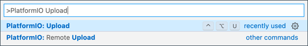

<!--
CO_OP_TRANSLATOR_METADATA:
{
  "original_hash": "a4f0c166010e31fd7b6ca20bc88dec6d",
  "translation_date": "2025-08-28T10:26:49+00:00",
  "source_file": "1-getting-started/lessons/1-introduction-to-iot/wio-terminal.md",
  "language_code": "sk"
}
-->
# Wio Terminal

[Wio Terminal od Seeed Studios](https://www.seeedstudio.com/Wio-Terminal-p-4509.html) je mikrokontrolér kompatibilný s Arduino, ktorý má zabudované WiFi, niektoré senzory a aktuátory, ako aj porty na pridanie ďalších senzorov a aktuátorov pomocou hardvérového ekosystému nazývaného [Grove](https://www.seeedstudio.com/category/Grove-c-1003.html).


## Nastavenie

Na používanie Wio Terminalu budete potrebovať nainštalovať bezplatný softvér na váš počítač. Pred pripojením k WiFi je tiež potrebné aktualizovať firmware Wio Terminalu.

### Úloha - nastavenie

Nainštalujte potrebný softvér a aktualizujte firmware.

1. Nainštalujte Visual Studio Code (VS Code). Toto je editor, ktorý budete používať na písanie kódu pre vaše zariadenie v C/C++. Pokyny na inštaláciu VS Code nájdete v [dokumentácii VS Code](https://code.visualstudio.com?WT.mc_id=academic-17441-jabenn).

    > 💁 Ďalším populárnym IDE pre vývoj s Arduino je [Arduino IDE](https://www.arduino.cc/en/software). Ak už tento nástroj poznáte, môžete ho použiť namiesto VS Code a PlatformIO, ale lekcie budú obsahovať pokyny založené na používaní VS Code.

1. Nainštalujte rozšírenie PlatformIO pre VS Code. Toto rozšírenie podporuje programovanie mikrokontrolérov v C/C++. Pokyny na inštaláciu tohto rozšírenia vo VS Code nájdete v [dokumentácii rozšírenia PlatformIO](https://marketplace.visualstudio.com/items?WT.mc_id=academic-17441-jabenn&itemName=platformio.platformio-ide). Toto rozšírenie závisí od rozšírenia Microsoft C/C++, ktoré sa automaticky nainštaluje pri inštalácii PlatformIO.

1. Pripojte Wio Terminal k vášmu počítaču. Wio Terminal má USB-C port na spodnej strane, ktorý je potrebné pripojiť k USB portu na vašom počítači. Wio Terminal je dodávaný s USB-C na USB-A káblom, ale ak váš počítač má iba USB-C porty, budete potrebovať USB-C kábel alebo adaptér USB-A na USB-C.

1. Postupujte podľa pokynov v [dokumentácii Wio Terminal Wiki WiFi Overview](https://wiki.seeedstudio.com/Wio-Terminal-Network-Overview/) na nastavenie Wio Terminalu a aktualizáciu firmware.

## Hello world

Pri začiatku práce s novým programovacím jazykom alebo technológiou je tradičné vytvoriť aplikáciu 'Hello World' - malú aplikáciu, ktorá vypíše text ako `"Hello World"`, aby sa overilo, že všetky nástroje sú správne nakonfigurované.

Aplikácia Hello World pre Wio Terminal zabezpečí, že máte správne nainštalovaný Visual Studio Code s PlatformIO a nastavený na vývoj mikrokontrolérov.

### Vytvorenie projektu PlatformIO

Prvým krokom je vytvorenie nového projektu pomocou PlatformIO nakonfigurovaného pre Wio Terminal.

#### Úloha - vytvorenie projektu PlatformIO

Vytvorte projekt PlatformIO.

1. Pripojte Wio Terminal k vášmu počítaču.

1. Spustite VS Code.

1. Ikona PlatformIO bude na bočnom paneli:

    

    Vyberte túto položku menu, potom vyberte *PIO Home -> Open*.

    

1. Na uvítacej obrazovke vyberte tlačidlo **+ New Project**.

    

1. Nakonfigurujte projekt v *Project Wizard*:

    1. Pomenujte váš projekt `nightlight`.

    1. V rozbaľovacom zozname *Board* zadajte `WIO`, aby ste filtrovali dosky, a vyberte *Seeeduino Wio Terminal*.

    1. Nechajte *Framework* nastavený na *Arduino*.

    1. Buď ponechajte začiarknuté políčko *Use default location*, alebo ho odškrtnite a vyberte umiestnenie pre váš projekt.

    1. Vyberte tlačidlo **Finish**.

    

    PlatformIO stiahne komponenty potrebné na kompiláciu kódu pre Wio Terminal a vytvorí váš projekt. Tento proces môže trvať niekoľko minút.

### Preskúmanie projektu PlatformIO

Prieskumník VS Code zobrazí množstvo súborov a priečinkov vytvorených sprievodcom PlatformIO.

#### Priečinky

* `.pio` - tento priečinok obsahuje dočasné údaje potrebné pre PlatformIO, ako sú knižnice alebo skompilovaný kód. Ak ho odstránite, automaticky sa znova vytvorí, a nemusíte ho pridávať do správy zdrojového kódu, ak zdieľate projekt na stránkach ako GitHub.
* `.vscode` - tento priečinok obsahuje konfiguráciu používanú PlatformIO a VS Code. Ak ho odstránite, automaticky sa znova vytvorí, a nemusíte ho pridávať do správy zdrojového kódu, ak zdieľate projekt na stránkach ako GitHub.
* `include` - tento priečinok je určený pre externé hlavičkové súbory potrebné pri pridávaní ďalších knižníc do vášho kódu. Tento priečinok nebudete používať v žiadnej z týchto lekcií.
* `lib` - tento priečinok je určený pre externé knižnice, ktoré chcete volať z vášho kódu. Tento priečinok nebudete používať v žiadnej z týchto lekcií.
* `src` - tento priečinok obsahuje hlavný zdrojový kód vašej aplikácie. Na začiatku bude obsahovať jeden súbor - `main.cpp`.
* `test` - tento priečinok je určený pre jednotkové testy vášho kódu.

#### Súbory

* `main.cpp` - tento súbor v priečinku `src` obsahuje vstupný bod vašej aplikácie. Otvorte tento súbor, a bude obsahovať nasledujúci kód:

    ```cpp
    #include <Arduino.h>
    
    void setup() {
      // put your setup code here, to run once:
    }
    
    void loop() {
      // put your main code here, to run repeatedly:
    }
    ```

    Keď sa zariadenie spustí, framework Arduino spustí funkciu `setup` raz, potom opakovane spúšťa funkciu `loop`, kým sa zariadenie nevypne.

* `.gitignore` - tento súbor uvádza súbory a priečinky, ktoré sa majú ignorovať pri pridávaní vášho kódu do správy zdrojového kódu, napríklad pri nahrávaní do repozitára na GitHub.

* `platformio.ini` - tento súbor obsahuje konfiguráciu pre vaše zariadenie a aplikáciu. Otvorte tento súbor, a bude obsahovať nasledujúci kód:

    ```ini
    [env:seeed_wio_terminal]
    platform = atmelsam
    board = seeed_wio_terminal
    framework = arduino
    ```

    Sekcia `[env:seeed_wio_terminal]` obsahuje konfiguráciu pre Wio Terminal. Môžete mať viacero sekcií `env`, aby váš kód mohol byť kompilovaný pre viacero dosiek.

    Ostatné hodnoty zodpovedajú konfigurácii zo sprievodcu projektom:

  * `platform = atmelsam` definuje hardvér, ktorý Wio Terminal používa (mikrokontrolér založený na ATSAMD51).
  * `board = seeed_wio_terminal` definuje typ dosky mikrokontroléra (Wio Terminal).
  * `framework = arduino` definuje, že tento projekt používa framework Arduino.

### Napíšte aplikáciu Hello World

Teraz ste pripravení napísať aplikáciu Hello World.

#### Úloha - napíšte aplikáciu Hello World

Napíšte aplikáciu Hello World.

1. Otvorte súbor `main.cpp` vo VS Code.

1. Zmeňte kód tak, aby zodpovedal nasledujúcemu:

    ```cpp
    #include <Arduino.h>

    void setup()
    {
        Serial.begin(9600);

        while (!Serial)
            ; // Wait for Serial to be ready
    
        delay(1000);
    }
    
    void loop()
    {
        Serial.println("Hello World");
        delay(5000);
    }
    ```

    Funkcia `setup` inicializuje pripojenie k sériovému portu - v tomto prípade USB port, ktorý sa používa na pripojenie Wio Terminalu k vášmu počítaču. Parameter `9600` je [baudová rýchlosť](https://wikipedia.org/wiki/Symbol_rate) (známa aj ako symbolová rýchlosť), alebo rýchlosť, ktorou sa údaje budú posielať cez sériový port v bitoch za sekundu. Toto nastavenie znamená, že sa posiela 9 600 bitov (0 a 1) údajov za sekundu. Potom čaká, kým bude sériový port pripravený.

    Funkcia `loop` posiela riadok `Hello World!` na sériový port, takže znaky `Hello World!` spolu s novým riadkom. Potom spí 5 000 milisekúnd alebo 5 sekúnd. Po skončení funkcie `loop` sa spustí znova, a tak ďalej, kým je mikrokontrolér zapnutý.

1. Nastavte Wio Terminal do režimu nahrávania. Toto budete musieť urobiť vždy, keď nahrávate nový kód do zariadenia:

    1. Dvakrát rýchlo stiahnite prepínač napájania - vždy sa vráti do zapnutej polohy.

    1. Skontrolujte modrú stavovú LED na pravej strane USB portu. Mala by pulzovať.
    
    [](https://youtu.be/LeKU_7zLRrQ)
    
    Kliknite na obrázok vyššie pre video, ktoré ukazuje, ako to urobiť.

1. Skompilujte a nahrajte kód do Wio Terminalu.

    1. Otvorte príkazovú paletu VS Code.

    1. Zadajte `PlatformIO Upload`, aby ste vyhľadali možnosť nahrávania, a vyberte *PlatformIO: Upload*.

        

        PlatformIO automaticky skompiluje kód, ak je to potrebné, pred nahrávaním.

    1. Kód bude skompilovaný a nahraný do Wio Terminalu.

        > 💁 Ak používate macOS, zobrazí sa upozornenie o *DISK NOT EJECTED PROPERLY*. Je to preto, že Wio Terminal sa pripojí ako disk počas procesu nahrávania, a odpojí sa, keď sa skompilovaný kód zapíše do zariadenia. Toto upozornenie môžete ignorovať.

    ⚠️ Ak sa zobrazia chyby o nedostupnosti nahrávacieho portu, najskôr sa uistite, že máte Wio Terminal pripojený k vášmu počítaču, zapnutý pomocou prepínača na ľavej strane obrazovky a nastavený do režimu nahrávania. Zelené svetlo na spodnej strane by malo svietiť a modré svetlo by malo pulzovať. Ak stále dostávate chybu, dvakrát rýchlo stiahnite prepínač napájania, aby ste Wio Terminal nútene nastavili do režimu nahrávania, a skúste nahrávanie znova.

PlatformIO má sériový monitor, ktorý dokáže monitorovať údaje posielané cez USB kábel z Wio Terminalu. To vám umožní sledovať údaje posielané príkazom `Serial.println("Hello World");`.

1. Otvorte príkazovú paletu VS Code.

1. Zadajte `PlatformIO Serial`, aby ste vyhľadali možnosť sériového monitora, a vyberte *PlatformIO: Serial Monitor*.

    

    Otvorí sa nový terminál, a údaje posielané cez sériový port budú streamované do tohto terminálu:

    ```output
    > Executing task: platformio device monitor <
    
    --- Available filters and text transformations: colorize, debug, default, direct, hexlify, log2file, nocontrol, printable, send_on_enter, time
    --- More details at http://bit.ly/pio-monitor-filters
    --- Miniterm on /dev/cu.usbmodem101  9600,8,N,1 ---
    --- Quit: Ctrl+C | Menu: Ctrl+T | Help: Ctrl+T followed by Ctrl+H ---
    Hello World
    Hello World
    ```

    `Hello World` sa bude tlačiť do sériového monitora každých 5 sekúnd.

> 💁 Tento kód nájdete v priečinku [code/wio-terminal](../../../../../1-getting-started/lessons/1-introduction-to-iot/code/wio-terminal).

😀 Vaša aplikácia 'Hello World' bola úspešná!

---

**Upozornenie**:  
Tento dokument bol preložený pomocou služby AI prekladu [Co-op Translator](https://github.com/Azure/co-op-translator). Aj keď sa snažíme o presnosť, prosím, berte na vedomie, že automatizované preklady môžu obsahovať chyby alebo nepresnosti. Pôvodný dokument v jeho pôvodnom jazyku by mal byť považovaný za autoritatívny zdroj. Pre kritické informácie sa odporúča profesionálny ľudský preklad. Nenesieme zodpovednosť za akékoľvek nedorozumenia alebo nesprávne interpretácie vyplývajúce z použitia tohto prekladu.