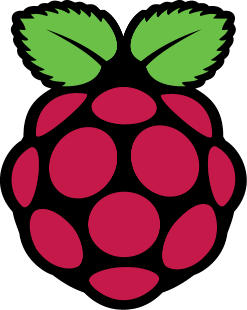

<!--
CO_OP_TRANSLATOR_METADATA:
{
  "original_hash": "9dd7f645ad1c6f20b72fee512987f772",
  "translation_date": "2025-08-28T09:58:03+00:00",
  "source_file": "1-getting-started/lessons/2-deeper-dive/README.md",
  "language_code": "sk"
}
-->
# Hlbší pohľad na IoT

> Sketchnote od [Nitya Narasimhan](https://github.com/nitya). Kliknite na obrázok pre väčšiu verziu.

Táto lekcia bola súčasťou série [Hello IoT](https://youtube.com/playlist?list=PLmsFUfdnGr3xRts0TIwyaHyQuHaNQcb6-) od [Microsoft Reactor](https://developer.microsoft.com/reactor/?WT.mc_id=academic-17441-jabenn). Lekcia bola rozdelená na 2 videá - hodinovú lekciu a hodinovú konzultáciu, kde sa podrobnejšie rozoberali časti lekcie a odpovedali na otázky.

> 🎥 Kliknite na obrázky vyššie a pozrite si videá

## Kvíz pred lekciou

[Kvíz pred lekciou](https://black-meadow-040d15503.1.azurestaticapps.net/quiz/3)

## Úvod

Táto lekcia sa podrobnejšie zaoberá niektorými konceptmi, ktoré sme pokryli v predchádzajúcej lekcii.

V tejto lekcii sa budeme venovať:

* [Komponenty IoT aplikácie](../../../../../1-getting-started/lessons/2-deeper-dive)
* [Hlbší pohľad na mikrokontroléry](../../../../../1-getting-started/lessons/2-deeper-dive)
* [Hlbší pohľad na jednodeskové počítače](../../../../../1-getting-started/lessons/2-deeper-dive)

## Komponenty IoT aplikácie

Dve hlavné komponenty IoT aplikácie sú *Internet* a *vec*. Pozrime sa na tieto dve komponenty podrobnejšie.

### Vec

**Vec** v IoT označuje zariadenie, ktoré dokáže interagovať s fyzickým svetom. Tieto zariadenia sú zvyčajne malé, cenovo dostupné počítače, ktoré pracujú pri nízkych rýchlostiach a spotrebujú málo energie - napríklad jednoduché mikrokontroléry s kilobajtmi RAM (na rozdiel od gigabajtov v PC), ktoré bežia len na niekoľkých stovkách megahertzov (na rozdiel od gigahertzov v PC), ale spotrebujú tak málo energie, že môžu fungovať týždne, mesiace alebo dokonca roky na batérie.

Tieto zariadenia interagujú s fyzickým svetom buď pomocou senzorov na zhromažďovanie údajov zo svojho okolia, alebo ovládaním výstupov či akčných členov na vykonávanie fyzických zmien. Typickým príkladom je inteligentný termostat - zariadenie, ktoré má teplotný senzor, spôsob nastavenia požadovanej teploty, ako je otočný ovládač alebo dotyková obrazovka, a pripojenie k vykurovaciemu alebo chladiacemu systému, ktorý sa môže zapnúť, keď je zistená teplota mimo požadovaného rozsahu. Teplotný senzor zistí, že miestnosť je príliš studená, a akčný člen zapne kúrenie.

Existuje obrovské množstvo rôznych vecí, ktoré môžu fungovať ako IoT zariadenia, od špecializovaného hardvéru na snímanie jednej veci až po univerzálne zariadenia, dokonca aj váš smartfón! Smartfón môže používať senzory na detekciu sveta okolo seba a akčné členy na interakciu so svetom - napríklad pomocou GPS senzora na zistenie vašej polohy a reproduktora na navigačné pokyny k cieľu.

✅ Zamyslite sa nad inými systémami, ktoré máte okolo seba, ktoré čítajú údaje zo senzora a používajú ich na rozhodovanie. Jedným príkladom by mohol byť termostat v rúre. Nájdete ďalšie?

### Internet

**Internetová** časť IoT aplikácie pozostáva z aplikácií, ku ktorým sa IoT zariadenie môže pripojiť na odosielanie a prijímanie údajov, ako aj z ďalších aplikácií, ktoré môžu spracovávať údaje z IoT zariadenia a pomáhať pri rozhodovaní o tom, aké požiadavky poslať akčným členom IoT zariadenia.

Typickým nastavením by bolo použitie nejakého cloudového servisu, ku ktorému sa IoT zariadenie pripojí, a tento cloudový servis spracováva veci ako bezpečnosť, prijímanie správ od IoT zariadenia a odosielanie správ späť do zariadenia. Tento cloudový servis by sa potom pripojil k ďalším aplikáciám, ktoré môžu spracovávať alebo ukladať údaje zo senzorov, alebo používať údaje zo senzorov spolu s údajmi z iných systémov na rozhodovanie.

Zariadenia sa tiež nemusia vždy priamo pripájať na internet cez WiFi alebo káblové pripojenia. Niektoré zariadenia používajú mesh networking na komunikáciu medzi sebou cez technológie ako Bluetooth, pričom sa pripájajú cez hub zariadenie, ktoré má internetové pripojenie.

V prípade inteligentného termostatu by sa termostat pripojil cez domáce WiFi k cloudovému servisu bežiacemu v cloude. Poslal by údaje o teplote do tohto cloudového servisu, odkiaľ by boli zapísané do nejakej databázy, ktorá by umožnila majiteľovi domu skontrolovať aktuálne a minulé teploty pomocou aplikácie v telefóne. Ďalšia služba v cloude by vedela, akú teplotu majiteľ domu chce, a poslala by správy späť do IoT zariadenia cez cloudový servis, aby povedala vykurovaciemu systému, či sa má zapnúť alebo vypnúť.

Ešte inteligentnejšia verzia by mohla používať AI v cloude s údajmi z iných senzorov pripojených k iným IoT zariadeniam, ako sú senzory obsadenosti, ktoré detekujú, ktoré miestnosti sa používajú, ako aj údaje ako počasie a dokonca váš kalendár, na rozhodovanie o tom, ako inteligentne nastaviť teplotu. Napríklad by mohla vypnúť kúrenie, ak z vášho kalendára zistí, že ste na dovolenke, alebo vypnúť kúrenie miestnosť po miestnosti v závislosti od toho, ktoré miestnosti používate, pričom sa z údajov učí byť čoraz presnejšia.

✅ Aké ďalšie údaje by mohli pomôcť urobiť internetovo pripojený termostat inteligentnejším?

### IoT na okraji siete

Aj keď I v IoT znamená Internet, tieto zariadenia sa nemusia pripájať na internet. V niektorých prípadoch sa zariadenia môžu pripojiť k 'edge' zariadeniam - gateway zariadeniam, ktoré bežia na vašej lokálnej sieti, čo znamená, že môžete spracovávať údaje bez volania cez internet. To môže byť rýchlejšie, keď máte veľa údajov alebo pomalé internetové pripojenie, umožňuje vám to fungovať offline, kde internetové pripojenie nie je možné, napríklad na lodi alebo v oblasti katastrofy pri humanitárnej kríze, a umožňuje vám uchovávať údaje v súkromí. Niektoré zariadenia budú obsahovať spracovateľský kód vytvorený pomocou cloudových nástrojov a spustiť ho lokálne na zhromažďovanie a reagovanie na údaje bez použitia internetového pripojenia na rozhodovanie.

Jedným príkladom je inteligentné domáce zariadenie, ako je Apple HomePod, Amazon Alexa alebo Google Home, ktoré bude počúvať váš hlas pomocou AI modelov trénovaných v cloude, ale bežiacich lokálne na zariadení. Tieto zariadenia sa 'prebudia', keď sa vysloví určité slovo alebo fráza, a až potom pošlú vašu reč cez internet na spracovanie. Zariadenie prestane posielať reč v správnom momente, napríklad keď zistí pauzu vo vašej reči. Všetko, čo poviete pred prebudením zariadenia pomocou aktivačného slova, a všetko, čo poviete po tom, ako zariadenie prestane počúvať, nebude poslané cez internet poskytovateľovi zariadenia, a preto zostane súkromné.

✅ Zamyslite sa nad inými scenármi, kde je súkromie dôležité, takže spracovanie údajov by bolo lepšie vykonané na okraji siete než v cloude. Ako nápovedu - zamyslite sa nad IoT zariadeniami s kamerami alebo inými zobrazovacími zariadeniami.

### IoT bezpečnosť

Pri každom internetovom pripojení je bezpečnosť dôležitým aspektom. Existuje starý vtip, že 'S v IoT znamená Security' - v IoT nie je žiadne 'S', čo naznačuje, že nie je bezpečné.

IoT zariadenia sa pripájajú k cloudovému servisu, a preto sú len tak bezpečné, ako je bezpečný tento cloudový servis - ak váš cloudový servis umožňuje pripojenie akémukoľvek zariadeniu, môžu byť poslané škodlivé údaje alebo môžu nastať vírusové útoky. To môže mať veľmi reálne dôsledky, keďže IoT zariadenia interagujú a ovládajú iné zariadenia. Napríklad [Stuxnet worm](https://wikipedia.org/wiki/Stuxnet) manipuloval ventily v centrifúgach, aby ich poškodil. Hackeri tiež využili [slabú bezpečnosť na prístup k detským monitorom](https://www.npr.org/sections/thetwo-way/2018/06/05/617196788/s-c-mom-says-baby-monitor-was-hacked-experts-say-many-devices-are-vulnerable) a iným domácim sledovacím zariadeniam.

> 💁 Niekedy IoT zariadenia a edge zariadenia bežia na sieti úplne izolovanej od internetu, aby uchovali údaje súkromné a bezpečné. Toto je známe ako [air-gapping](https://wikipedia.org/wiki/Air_gap_(networking)).

## Hlbší pohľad na mikrokontroléry

V predchádzajúcej lekcii sme predstavili mikrokontroléry. Teraz sa na ne pozrieme podrobnejšie.

### CPU

CPU je 'mozog' mikrokontroléra. Je to procesor, ktorý spúšťa váš kód a môže posielať údaje do a prijímať údaje z akýchkoľvek pripojených zariadení. CPU môže obsahovať jedno alebo viac jadier - v podstate jedno alebo viac CPU, ktoré môžu spolupracovať na spustení vášho kódu.

CPU sa spolieha na hodiny, ktoré tikajú milióny alebo miliardy krát za sekundu. Každý tik, alebo cyklus, synchronizuje akcie, ktoré CPU môže vykonať. Pri každom tiku môže CPU vykonať inštrukciu z programu, ako je získanie údajov z externého zariadenia alebo vykonanie matematického výpočtu. Tento pravidelný cyklus umožňuje dokončenie všetkých akcií pred spracovaním ďalšej inštrukcie.

Čím rýchlejší je cyklus hodín, tým viac inštrukcií môže byť spracovaných za sekundu, a teda tým rýchlejší je CPU. Rýchlosť CPU sa meria v [Hertz (Hz)](https://wikipedia.org/wiki/Hertz), štandardnej jednotke, kde 1 Hz znamená jeden cyklus alebo tik hodín za sekundu.

> 🎓 Rýchlosti CPU sa často uvádzajú v MHz alebo GHz. 1MHz je 1 milión Hz, 1GHz je 1 miliarda Hz.

> 💁 CPU vykonávajú programy pomocou [fetch-decode-execute cyklu](https://wikipedia.org/wiki/Instruction_cycle). Pri každom tiku hodín CPU načíta ďalšiu inštrukciu z pamäte, dekóduje ju a potom ju vykoná, napríklad pomocou aritmeticko-logickej jednotky (ALU) na sčítanie 2 čísel. Niektoré vykonania trvajú viac tikov, takže ďalší cyklus sa spustí pri ďalšom tiku po dokončení inštrukcie.

Mikrokontroléry majú oveľa nižšie rýchlosti hodín ako stolné alebo prenosné počítače, alebo dokonca väčšina smartfónov. Napríklad Wio Terminal má CPU, ktorý beží na 120MHz alebo 120,000,000 cyklov za sekundu.

✅ Priemerný PC alebo Mac má CPU s viacerými jadrami bežiacimi na viacerých gigahertzoch, čo znamená, že hodiny tikajú miliardy krát za sekundu. Zistite rýchlosť hodín vášho počítača a porovnajte, koľkokrát je rýchlejší ako Wio Terminal.

Každý cyklus hodín spotrebováva energiu a generuje teplo. Čím rýchlejšie tiky, tým viac energie sa spotrebuje a viac tepla sa generuje. PC majú chladiče a ventilátory na odstraňovanie tepla, bez ktorých by sa prehriali a vypnuli v priebehu niekoľkých sekúnd. Mikrokontroléry často nemajú ani jedno, pretože bežia oveľa chladnejšie a teda oveľa pomalšie. PC bežia na sieťovom napájaní alebo veľkých batériách na niekoľko hodín, mikrokontroléry môžu bežať dni, mesiace alebo dokonca roky na malé batérie. Mikrokontroléry môžu mať tiež jadrá, ktoré bežia na rôznych rýchlostiach, pričom sa prepínajú na pomalšie nízkoenergetické jadrá, keď je dopyt na CPU nízky, aby sa znížila spotreba energie.

> 💁 Niektoré PC a Mac počítače prijímajú rovnakú kombináciu rýchlych vysokovýkonných jadier a pomalších nízkoenergetických jadier, pričom sa prepínajú na úsporu batérie. Napríklad čip M1 v najnovších Apple laptopoch môže prepínať medzi 4 výkonnými jadrami a 4 efektívnymi jadrami na optimalizáciu výdrže batérie alebo rýchlosti v závislosti od úlohy, ktorá sa spúšťa.

✅ Urobte si malý výskum: Prečítajte si o CPU na [Wikipedia CPU článku](https://wikipedia.org/wiki/Central_processing_unit)

#### Úloha

Preskúmajte Wio Terminal.

Ak používate Wio Terminal na tieto lekcie, skúste nájsť CPU. Nájdite sekciu *Hardware Overview* na [produktovej stránke Wio Terminal](https://www.seeedstudio.com/Wio-Terminal-p-4509.html) pre obrázok vnútorných častí a skúste nájsť CPU cez priehľadné plastové okno na zadnej strane.

### Pamäť

Mikrokontroléry zvyčajne majú dva typy pamäte - pamäť programu a pamäť s náhodným prístupom (RAM).

Pamäť programu je nevolatilná, čo znamená, že čokoľvek je do nej zapísané, zostane tam aj keď zariadenie nemá napájanie. Táto pamäť uchováva váš programový kód.

RAM je pamäť používaná programom na beh, obsahujúca premenné pridelené vaším program
🎓 Pamäť programu uchováva váš kód a zostáva zachovaná aj pri výpadku napájania.
> 🎓 RAM sa používa na spustenie vášho programu a je resetovaná, keď nie je napájanie

Podobne ako pri CPU, pamäť v mikrokontroléri je o niekoľko rádov menšia ako v PC alebo Macu. Typický počítač môže mať 8 gigabajtov (GB) RAM, čo je 8 000 000 000 bajtov, pričom každý bajt má dostatok miesta na uloženie jedného písmena alebo čísla od 0 do 255. Mikrokontrolér by mal len kilobajty (KB) RAM, pričom kilobajt je 1 000 bajtov. Wio terminál spomenutý vyššie má 192 KB RAM, čo je 192 000 bajtov - viac ako 40 000-krát menej ako priemerný počítač!

Diagram nižšie ukazuje relatívny rozdiel vo veľkosti medzi 192 KB a 8 GB - malá bodka v strede predstavuje 192 KB.

Pamäť na ukladanie programov je tiež menšia ako v PC. Typický počítač môže mať 500 GB pevný disk na ukladanie programov, zatiaľ čo mikrokontrolér môže mať len kilobajty alebo možno niekoľko megabajtov (MB) úložiska (1 MB je 1 000 KB alebo 1 000 000 bajtov). Wio terminál má 4 MB úložiska na programy.

✅ Urobte si malý prieskum: Koľko RAM a úložiska má počítač, ktorý používate na čítanie tohto textu? Ako sa to porovnáva s mikrokontrolérom?

### Vstup/Výstup

Mikrokontroléry potrebujú vstupné a výstupné (I/O) pripojenia na čítanie údajov zo senzorov a odosielanie riadiacich signálov do akčných členov. Zvyčajne obsahujú niekoľko univerzálnych vstupno-výstupných (GPIO) pinov. Tieto piny je možné softvérovo nastaviť ako vstupné (prijímajú signál) alebo výstupné (odosielajú signál).

🧠⬅️ Vstupné piny sa používajú na čítanie hodnôt zo senzorov.

🧠➡️ Výstupné piny odosielajú inštrukcie do akčných členov.

✅ O tomto sa dozviete viac v nasledujúcej lekcii.

#### Úloha

Preskúmajte Wio terminál.

Ak používate Wio terminál na tieto lekcie, nájdite GPIO piny. Nájdite sekciu *Pinout diagram* na [produktovej stránke Wio terminálu](https://www.seeedstudio.com/Wio-Terminal-p-4509.html), aby ste sa dozvedeli, ktoré piny sú ktoré. Wio terminál obsahuje nálepku, ktorú môžete pripevniť na zadnú stranu s číslami pinov, takže ju pridajte, ak ste to ešte neurobili.

### Fyzická veľkosť

Mikrokontroléry sú zvyčajne malé, pričom najmenší, [Freescale Kinetis KL03 MCU, je dostatočne malý, aby sa zmestil do jamky golfovej loptičky](https://www.edn.com/tiny-arm-cortex-m0-based-mcu-shrinks-package/). Samotné CPU v PC môže mať rozmery 40 mm x 40 mm, a to nepočítame chladiče a ventilátory potrebné na to, aby CPU mohlo bežať viac ako pár sekúnd bez prehriatia, čo je podstatne väčšie ako celý mikrokontrolér. Vývojárska sada Wio terminálu s mikrokontrolérom, puzdrom, obrazovkou a radom pripojení a komponentov nie je oveľa väčšia ako holý procesor Intel i9 a podstatne menšia ako CPU s chladičom a ventilátorom!

| Zariadenie                      | Veľkosť               |
| ------------------------------- | --------------------- |
| Freescale Kinetis KL03          | 1,6 mm x 2 mm x 1 mm  |
| Wio terminál                    | 72 mm x 57 mm x 12 mm |
| Intel i9 CPU, chladič a ventilátor | 136 mm x 145 mm x 103 mm |

### Rámce a operačné systémy

Kvôli nízkej rýchlosti a veľkosti pamäte mikrokontroléry nebežia na operačnom systéme (OS) v zmysle desktopového OS. Operačný systém, ktorý poháňa váš počítač (Windows, Linux alebo macOS), potrebuje veľa pamäte a výpočtového výkonu na spúšťanie úloh, ktoré sú pre mikrokontrolér úplne zbytočné. Pamätajte, že mikrokontroléry sú zvyčajne naprogramované na vykonávanie jednej alebo viacerých veľmi špecifických úloh, na rozdiel od univerzálneho počítača, ako je PC alebo Mac, ktorý musí podporovať používateľské rozhranie, prehrávať hudbu alebo filmy, poskytovať nástroje na písanie dokumentov alebo kódu, hrať hry alebo prehliadať internet.

Na programovanie mikrokontroléra bez OS potrebujete nejaké nástroje, ktoré vám umožnia zostaviť váš kód tak, aby ho mikrokontrolér mohol spustiť, pomocou API, ktoré dokážu komunikovať s akýmikoľvek perifériami. Každý mikrokontrolér je iný, takže výrobcovia zvyčajne podporujú štandardné rámce, ktoré vám umožňujú postupovať podľa štandardného 'receptu' na zostavenie vášho kódu a jeho spustenie na akomkoľvek mikrokontroléri, ktorý tento rámec podporuje.

Mikrokontroléry môžete programovať aj pomocou OS - často označovaného ako operačný systém v reálnom čase (RTOS), pretože sú navrhnuté na spracovanie údajov z periférií v reálnom čase. Tieto operačné systémy sú veľmi ľahké a poskytujú funkcie ako:

* Multithreading, ktorý umožňuje vášmu kódu spúšťať viacero blokov kódu súčasne, buď na viacerých jadrách, alebo striedavo na jednom jadre.
* Sieťovanie na bezpečnú komunikáciu cez internet.
* Komponenty grafického používateľského rozhrania (GUI) na vytváranie používateľských rozhraní (UI) na zariadeniach s obrazovkami.

✅ Prečítajte si o rôznych RTOS: [Azure RTOS](https://azure.microsoft.com/services/rtos/?WT.mc_id=academic-17441-jabenn), [FreeRTOS](https://www.freertos.org), [Zephyr](https://www.zephyrproject.org)

#### Arduino

[Arduino](https://www.arduino.cc) je pravdepodobne najpopulárnejší rámec pre mikrokontroléry, najmä medzi študentmi, nadšencami a tvorcami. Arduino je open source elektronická platforma kombinujúca softvér a hardvér. Môžete si kúpiť dosky kompatibilné s Arduinom priamo od Arduino alebo od iných výrobcov a potom ich programovať pomocou rámca Arduino.

Dosky Arduino sa programujú v jazykoch C alebo C++. Použitie C/C++ umožňuje, aby bol váš kód veľmi malý a rýchly, čo je potrebné na obmedzenom zariadení, akým je mikrokontrolér. Jadro aplikácie Arduino sa nazýva sketch a je to C/C++ kód s dvoma funkciami - `setup` a `loop`. Keď sa doska spustí, kód rámca Arduino spustí funkciu `setup` raz, potom bude funkciu `loop` spúšťať znova a znova, nepretržite, až kým sa nevypne napájanie.

Do funkcie `setup` by ste napísali kód na inicializáciu, napríklad pripojenie k WiFi a cloudovým službám alebo inicializáciu pinov na vstup a výstup. Do funkcie `loop` by ste potom vložili spracovateľský kód, napríklad čítanie zo senzora a odosielanie hodnôt do cloudu. Zvyčajne by ste pridali oneskorenie na konci každého cyklu, napríklad ak chcete, aby sa údaje zo senzora odosielali každých 10 sekúnd, pridali by ste oneskorenie 10 sekúnd, aby mikrokontrolér mohol spať, šetriť energiu a potom spustiť cyklus znova, keď to bude potrebné.

✅ Táto architektúra programu je známa ako *cyklus udalostí* alebo *cyklus správ*. Mnoho aplikácií používa tento princíp na pozadí a je to štandard pre väčšinu desktopových aplikácií, ktoré bežia na OS ako Windows, macOS alebo Linux. Funkcia `loop` počúva správy od komponentov používateľského rozhrania, ako sú tlačidlá, alebo zariadení, ako je klávesnica, a reaguje na ne. Viac si môžete prečítať v tomto [článku o cykle udalostí](https://wikipedia.org/wiki/Event_loop).

Arduino poskytuje štandardné knižnice na interakciu s mikrokontrolérmi a I/O pinmi, s rôznymi implementáciami na pozadí, aby mohli bežať na rôznych mikrokontroléroch. Napríklad funkcia [`delay`](https://www.arduino.cc/reference/en/language/functions/time/delay/) pozastaví program na dané časové obdobie, funkcia [`digitalRead`](https://www.arduino.cc/reference/en/language/functions/digital-io/digitalread/) prečíta hodnotu `HIGH` alebo `LOW` z daného pinu, bez ohľadu na to, na ktorej doske kód beží. Tieto štandardné knižnice znamenajú, že kód Arduino napísaný pre jednu dosku môže byť prekompilovaný pre akúkoľvek inú dosku Arduino a bude fungovať, za predpokladu, že piny sú rovnaké a dosky podporujú rovnaké funkcie.

Existuje veľký ekosystém knižníc tretích strán pre Arduino, ktoré vám umožňujú pridávať ďalšie funkcie do vašich Arduino projektov, ako je používanie senzorov a akčných členov alebo pripojenie k cloudovým IoT službám.

##### Úloha

Preskúmajte Wio terminál.

Ak používate Wio terminál na tieto lekcie, znovu si prečítajte kód, ktorý ste napísali v predchádzajúcej lekcii. Nájdite funkcie `setup` a `loop`. Sledujte sériový výstup pre opakované volanie funkcie `loop`. Skúste pridať kód do funkcie `setup`, aby zapisoval do sériového portu, a pozorujte, že tento kód sa spustí iba raz pri každom reštarte. Skúste reštartovať zariadenie pomocou vypínača na boku, aby ste videli, že sa táto funkcia volá pri každom reštarte zariadenia.

## Hlbší pohľad na jednodeskové počítače

V predchádzajúcej lekcii sme predstavili jednodeskové počítače. Teraz sa na ne pozrime podrobnejšie.

### Raspberry Pi

[Raspberry Pi Foundation](https://www.raspberrypi.org) je charitatívna organizácia z Veľkej Británie, založená v roku 2009 na podporu štúdia informatiky, najmä na školách. V rámci tejto misie vyvinuli jednodeskový počítač nazývaný Raspberry Pi. Raspberry Pi sú momentálne dostupné v 3 variantoch - plnohodnotná verzia, menšia Pi Zero a výpočtový modul, ktorý je možné zabudovať do vášho finálneho IoT zariadenia.

Najnovšia iterácia plnohodnotného Raspberry Pi je Raspberry Pi 4B. Má štvorjadrový (4 jadrá) CPU s frekvenciou 1,5 GHz, 2, 4 alebo 8 GB RAM, gigabitový ethernet, WiFi, 2 HDMI porty podporujúce 4k obrazovky, audio a kompozitný video výstup, USB porty (2 USB 2.0, 2 USB 3.0), 40 GPIO pinov, konektor pre kamerový modul Raspberry Pi a slot na SD kartu. To všetko na doske s rozmermi 88 mm x 58 mm x 19,5 mm, napájané 3A USB-C zdrojom. Cena začína na 35 USD, čo je oveľa lacnejšie ako PC alebo Mac.

> 💁 Existuje aj Pi400, all-in-one počítač s Pi4 zabudovaným do klávesnice.

Pi Zero je oveľa menší a má nižšiu spotrebu. Má jednojadrový 1 GHz CPU, 512 MB RAM, WiFi (v modeli Zero W), jeden HDMI port, micro-USB port, 40 GPIO pinov, konektor pre kamerový modul Raspberry Pi a slot na SD kartu. Má rozmery 65 mm x 30 mm x 5 mm a spotrebuje veľmi málo energie. Zero stojí 5 USD, verzia W s WiFi stojí 10 USD.

> 🎓 CPU v oboch týchto zariadeniach sú ARM procesory, na rozdiel od Intel/AMD x86 alebo x64 procesorov, ktoré nájdete vo väčšine PC a Macov. Sú podobné procesorom, ktoré nájdete v niektorých mikrokontroléroch, ako aj takmer vo všetkých mobilných telefónoch, Microsoft Surface X a nových Apple Silicon Macoch.

Všetky varianty Raspberry Pi bežia na verzii Debian Linuxu nazývanej Raspberry Pi OS. Táto je dostupná ako odľahčená verzia bez desktopu, ideálna pre 'headless' projekty, kde nepotrebujete obrazovku, alebo ako plná verzia s desktopovým prostredím, webovým prehliadačom, kancelárskymi aplikáciami, nástrojmi na programovanie a hrami. Keďže OS je verzia Debian Linuxu, môžete nainštalovať akúkoľvek aplikáciu alebo nástroj, ktorý beží na Debiane a je postavený pre ARM procesor v Pi.

#### Úloha

Preskúmajte Raspberry Pi.

Ak používate Raspberry Pi na tieto lekcie, prečítajte si o rôznych hardvérových komponentoch na doske.

* Podrobnosti o procesoroch použitých v [dokumentácii k hardvéru Raspberry Pi](https://www.raspberrypi.org/documentation/hardware/raspberrypi/). Prečítajte si o procesore použitém vo vašom Pi.
* Nájdite GPIO piny. Prečítajte si viac o nich v [dokumentácii GPIO Raspberry Pi](https://www.raspberrypi.org/documentation/hardware/raspberrypi/gpio/README.md). Použite [príručku na používanie GPIO pinov](https://www.raspberrypi.org/documentation/usage/gpio/README.md), aby ste identifikovali rôzne piny na vašom Pi.

### Programovanie jednodeskových počítačov

Jednodeskové počítače sú plnohodnotné počítače, ktoré bežia na plnohodnotnom OS. To znamená, že existuje široká škála programovacích jazykov, rámcov a nástrojov, ktoré môžete použiť na ich programovanie, na rozdiel od mikrokontrolérov, ktoré sa spoliehajú na podporu dosky v rámcoch ako Arduino. Väčšina programovacích jazykov má knižnice, ktoré umožňujú prístup k GPIO pinom na odosielanie a prijímanie údajov zo senzorov a akčných členov.

✅ Aké programovacie jazyky ovládate? Sú podporované na Linuxe?

Najbežnejším programovacím jazykom na tvorbu IoT aplikácií na Raspberry Pi je Python. Existuje obrovský ekosystém hardvéru navrhnutého pre Pi a takmer všetky tieto zariadenia obsahujú príslušný kód potrebný na ich použitie ako Python knižnice. Niektoré z týchto ekosystémov sú založené na 'hatoch' - tak nazývaných, pretože sedia na vrchu Pi ako klobúk a pripájajú sa veľkým konektorom k 40 GPIO pinom. Tieto haty poskytujú ďalšie schopnosti, ako sú obrazovky, senzory, diaľkovo ovládané autá alebo adaptéry na pripojenie senzorov so štandardizovanými káblami.
### Použitie jednodeskových počítačov v profesionálnych IoT nasadeniach

Jednodeskové počítače sa používajú v profesionálnych IoT nasadeniach, nielen ako vývojárske súpravy. Môžu poskytnúť výkonný spôsob ovládania hardvéru a vykonávania zložitých úloh, ako je napríklad spúšťanie modelov strojového učenia. Napríklad existuje [Raspberry Pi 4 compute module](https://www.raspberrypi.org/blog/raspberry-pi-compute-module-4/), ktorý poskytuje všetku silu Raspberry Pi 4, ale v kompaktnom a lacnejšom formáte bez väčšiny portov, navrhnutý na inštaláciu do vlastného hardvéru.

---

## 🚀 Výzva

Výzvou v poslednej lekcii bolo uviesť čo najviac IoT zariadení, ktoré sa nachádzajú vo vašej domácnosti, škole alebo na pracovisku. Pri každom zariadení v tomto zozname si myslíte, že sú postavené na mikrokontroléroch, jednodeskových počítačoch alebo dokonca na kombinácii oboch?

## Kvíz po prednáške

[Kvíz po prednáške](https://black-meadow-040d15503.1.azurestaticapps.net/quiz/4)

## Prehľad a samostatné štúdium

* Prečítajte si [príručku pre začiatočníkov s Arduinom](https://www.arduino.cc/en/Guide/Introduction), aby ste lepšie pochopili platformu Arduino.
* Prečítajte si [úvod do Raspberry Pi 4](https://www.raspberrypi.org/products/raspberry-pi-4-model-b/), aby ste sa dozvedeli viac o Raspberry Pi.
* Získajte viac informácií o niektorých konceptoch a skratkách v článku [Čo sú CPU, MPU, MCU a GPU v Electrical Engineering Journal](https://www.eejournal.com/article/what-the-faq-are-cpus-mpus-mcus-and-gpus/).

✅ Použite tieto príručky spolu s cenami uvedenými v [príručke o hardvéri](../../../hardware.md), aby ste sa rozhodli, akú hardvérovú platformu chcete použiť, alebo či by ste radšej použili virtuálne zariadenie.

## Zadanie

[Porovnajte a kontrastujte mikrokontroléry a jednodeskové počítače](assignment.md)

---

**Upozornenie**:  
Tento dokument bol preložený pomocou služby AI prekladu [Co-op Translator](https://github.com/Azure/co-op-translator). Aj keď sa snažíme o presnosť, prosím, berte na vedomie, že automatizované preklady môžu obsahovať chyby alebo nepresnosti. Pôvodný dokument v jeho pôvodnom jazyku by mal byť považovaný za autoritatívny zdroj. Pre kritické informácie sa odporúča profesionálny ľudský preklad. Nenesieme zodpovednosť za akékoľvek nedorozumenia alebo nesprávne interpretácie vyplývajúce z použitia tohto prekladu.