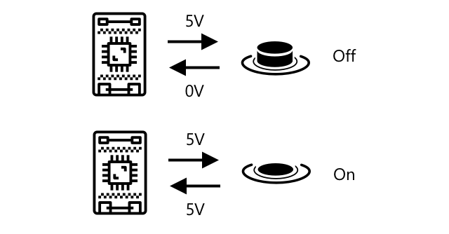

<!--
CO_OP_TRANSLATOR_METADATA:
{
  "original_hash": "e9ee00eb5fc55922a73762acc542166b",
  "translation_date": "2025-08-28T10:28:43+00:00",
  "source_file": "1-getting-started/lessons/3-sensors-and-actuators/README.md",
  "language_code": "sk"
}
-->
# Interakcia s fyzickým svetom pomocou senzorov a akčných členov


> Sketchnote od [Nitya Narasimhan](https://github.com/nitya). Kliknite na obrázok pre väčšiu verziu.

Táto lekcia bola súčasťou série [Hello IoT](https://youtube.com/playlist?list=PLmsFUfdnGr3xRts0TIwyaHyQuHaNQcb6-) od [Microsoft Reactor](https://developer.microsoft.com/reactor/?WT.mc_id=academic-17441-jabenn). Lekcia bola prezentovaná vo forme dvoch videí - hodinovej lekcie a hodinovej konzultácie, kde sa podrobnejšie rozoberali časti lekcie a odpovedalo sa na otázky.

[](https://youtu.be/Lqalu1v6aF4)

[](https://youtu.be/qR3ekcMlLWA)

> 🎥 Kliknite na obrázky vyššie pre sledovanie videí

## Kvíz pred lekciou

[Kvíz pred lekciou](https://black-meadow-040d15503.1.azurestaticapps.net/quiz/5)

## Úvod

Táto lekcia predstavuje dva dôležité koncepty pre vaše IoT zariadenie - senzory a akčné členy. Zároveň si ich prakticky vyskúšate, pridáte svetelný senzor do svojho IoT projektu a následne LED diódu ovládanú úrovňou svetla, čím efektívne vytvoríte nočné svetlo.

V tejto lekcii sa budeme venovať:

* [Čo sú senzory?](../../../../../1-getting-started/lessons/3-sensors-and-actuators)
* [Použitie senzora](../../../../../1-getting-started/lessons/3-sensors-and-actuators)
* [Typy senzorov](../../../../../1-getting-started/lessons/3-sensors-and-actuators)
* [Čo sú akčné členy?](../../../../../1-getting-started/lessons/3-sensors-and-actuators)
* [Použitie akčného člena](../../../../../1-getting-started/lessons/3-sensors-and-actuators)
* [Typy akčných členov](../../../../../1-getting-started/lessons/3-sensors-and-actuators)

## Čo sú senzory?

Senzory sú hardvérové zariadenia, ktoré vnímajú fyzický svet - to znamená, že merajú jednu alebo viac vlastností okolo seba a posielajú informácie do IoT zariadenia. Existuje obrovské množstvo senzorov, pretože je možné merať veľa rôznych vecí, od prírodných vlastností, ako je teplota vzduchu, až po fyzické interakcie, ako je pohyb.

Niektoré bežné senzory zahŕňajú:

* Teplotné senzory - merajú teplotu vzduchu alebo teplotu objektu, v ktorom sú ponorené. Pre hobbyistov a vývojárov sú často kombinované so senzormi tlaku vzduchu a vlhkosti.
* Tlačidlá - zisťujú, či boli stlačené.
* Svetelné senzory - detegujú úroveň svetla a môžu byť určené pre konkrétne farby, UV svetlo, IR svetlo alebo všeobecné viditeľné svetlo.
* Kamery - snímajú vizuálnu reprezentáciu sveta prostredníctvom fotografií alebo streamovania videa.
* Akcelerometre - zisťujú pohyb v rôznych smeroch.
* Mikrofóny - snímajú zvuk, buď všeobecnú úroveň zvuku alebo smerový zvuk.

✅ Urobte si prieskum. Aké senzory má váš telefón?

Všetky senzory majú jednu spoločnú vlastnosť - prevádzajú to, čo snímajú, na elektrický signál, ktorý môže byť interpretovaný IoT zariadením. Ako je tento elektrický signál interpretovaný, závisí od senzora a komunikačného protokolu použitého na komunikáciu s IoT zariadením.

## Použitie senzora

Postupujte podľa príslušného návodu nižšie na pridanie senzora do vášho IoT zariadenia:

* [Arduino - Wio Terminal](wio-terminal-sensor.md)
* [Jednodoskový počítač - Raspberry Pi](pi-sensor.md)
* [Jednodoskový počítač - Virtuálne zariadenie](virtual-device-sensor.md)

## Typy senzorov

Senzory môžu byť analógové alebo digitálne.

### Analógové senzory

Niektoré z najzákladnejších senzorov sú analógové senzory. Tieto senzory prijímajú napätie z IoT zariadenia, komponenty senzora toto napätie upravujú a napätie, ktoré senzor vracia, sa meria na získanie hodnoty senzora.

> 🎓 Napätie je miera toho, aký veľký tlak je na presun elektriny z jedného miesta na druhé, napríklad z kladného pólu batérie na záporný pól. Napríklad štandardná AA batéria má 1,5V (V je symbol pre volty) a dokáže tlačiť elektrinu silou 1,5V z kladného pólu na záporný pól. Rôzne elektrické zariadenia vyžadujú rôzne napätia na fungovanie, napríklad LED dióda môže svietiť pri napätí 2-3V, ale 100W žiarovka by potrebovala 240V. Viac o napätí si môžete prečítať na [stránke o napätí na Wikipédii](https://wikipedia.org/wiki/Voltage).

Jedným z príkladov je potenciometer. Ide o otočný ovládač, ktorý môžete otáčať medzi dvoma polohami, pričom senzor meria rotáciu.


IoT zariadenie pošle elektrický signál do potenciometra s určitým napätím, napríklad 5 voltov (5V). Keď sa potenciometer nastaví, mení sa napätie, ktoré vychádza na druhej strane. Predstavte si potenciometer označený ako ovládač, ktorý ide od 0 do [11](https://wikipedia.org/wiki/Up_to_eleven), napríklad ovládač hlasitosti na zosilňovači. Keď je potenciometer v úplne vypnutej polohe (0), vychádza 0V (0 voltov). Keď je v úplne zapnutej polohe (11), vychádza 5V (5 voltov).

> 🎓 Toto je zjednodušenie, viac o potenciometroch a variabilných rezistoroch si môžete prečítať na [stránke o potenciometroch na Wikipédii](https://wikipedia.org/wiki/Potentiometer).

Napätie, ktoré vychádza zo senzora, je potom čítané IoT zariadením a zariadenie naň môže reagovať. V závislosti od senzora môže byť toto napätie ľubovoľná hodnota alebo môže byť mapované na štandardnú jednotku. Napríklad analógový teplotný senzor založený na [termistore](https://wikipedia.org/wiki/Thermistor) mení svoj odpor v závislosti od teploty. Výstupné napätie môže byť potom prepočítané na teplotu v Kelvinoch a následne na °C alebo °F pomocou výpočtov v kóde.

✅ Čo si myslíte, že sa stane, ak senzor vráti vyššie napätie, ako bolo poslané (napríklad z externého zdroja napájania)? ⛔️ NEEXPERIMENTUJTE s tým.

#### Konverzia analógového signálu na digitálny

IoT zariadenia sú digitálne - nepracujú s analógovými hodnotami, ale iba s 0 a 1. To znamená, že hodnoty analógových senzorov musia byť konvertované na digitálny signál pred ich spracovaním. Mnohé IoT zariadenia majú analógovo-digitálne prevodníky (ADC), ktoré konvertujú analógové vstupy na digitálne reprezentácie ich hodnôt. Senzory môžu tiež pracovať s ADC prostredníctvom pripojovacej dosky. Napríklad v ekosystéme Seeed Grove s Raspberry Pi sa analógové senzory pripájajú na špecifické porty na 'hat', ktorý je pripojený k GPIO pinom Pi, a tento hat má ADC na konverziu napätia na digitálny signál, ktorý môže byť odoslaný z GPIO pinov Pi.

Predstavte si, že máte analógový svetelný senzor pripojený k IoT zariadeniu, ktoré používa 3,3V a vracia hodnotu 1V. Tento 1V nemá v digitálnom svete žiadny význam, takže musí byť konvertovaný. Napätie bude konvertované na analógovú hodnotu pomocou škály v závislosti od zariadenia a senzora. Jedným príkladom je svetelný senzor Seeed Grove, ktorý vracia hodnoty od 0 do 1 023. Pre tento senzor pracujúci na 3,3V by výstup 1V predstavoval hodnotu 300. IoT zariadenie nemôže pracovať s hodnotou 300 ako s analógovou hodnotou, takže hodnota by bola konvertovaná na `0000000100101100`, binárnu reprezentáciu čísla 300 pomocou Grove hat. Táto hodnota by potom bola spracovaná IoT zariadením.

✅ Ak nepoznáte binárny systém, urobte si malý prieskum, aby ste sa naučili, ako sú čísla reprezentované pomocou 0 a 1. [Úvod do binárneho systému na BBC Bitesize](https://www.bbc.co.uk/bitesize/guides/zwsbwmn/revision/1) je skvelým miestom, kde začať.

Z pohľadu programovania je toto všetko zvyčajne riešené knižnicami, ktoré sú dodávané so senzormi, takže sa nemusíte zaoberať touto konverziou sami. Pre svetelný senzor Grove by ste použili knižnicu pre Python a zavolali vlastnosť `light`, alebo použili knižnicu pre Arduino a zavolali `analogRead`, aby ste získali hodnotu 300.

### Digitálne senzory

Digitálne senzory, podobne ako analógové senzory, zisťujú svet okolo seba pomocou zmien elektrického napätia. Rozdiel je v tom, že vracajú digitálny signál, buď meraním iba dvoch stavov, alebo použitím zabudovaného ADC. Digitálne senzory sú čoraz bežnejšie, aby sa predišlo potrebe používať ADC buď v pripojovacej doske, alebo priamo na IoT zariadení.

Najjednoduchším digitálnym senzorom je tlačidlo alebo spínač. Ide o senzor s dvoma stavmi, zapnutý alebo vypnutý.



Piny na IoT zariadeniach, ako sú GPIO piny, môžu tento signál priamo merať ako 0 alebo 1. Ak je napätie poslané rovnaké ako napätie vrátené, hodnota je 1, inak je hodnota 0. Nie je potrebné konvertovať signál, môže byť iba 1 alebo 0.

> 💁 Napätia nie sú nikdy presné, najmä preto, že komponenty v senzore majú určitý odpor, takže zvyčajne existuje tolerancia. Napríklad GPIO piny na Raspberry Pi pracujú na 3,3V a čítajú návratový signál nad 1,8V ako 1, pod 1,8V ako 0.

* 3,3V ide do tlačidla. Tlačidlo je vypnuté, takže vychádza 0V, čo dáva hodnotu 0.
* 3,3V ide do tlačidla. Tlačidlo je zapnuté, takže vychádza 3,3V, čo dáva hodnotu 1.

Pokročilejšie digitálne senzory čítajú analógové hodnoty a potom ich konvertujú pomocou zabudovaných ADC na digitálne signály. Napríklad digitálny teplotný senzor stále používa termočlánok rovnakým spôsobom ako analógový senzor a stále meria zmenu napätia spôsobenú odporom termočlánku pri aktuálnej teplote. Namiesto vrátenia analógovej hodnoty a spoliehania sa na zariadenie alebo pripojovaciu dosku na konverziu na digitálny signál, ADC zabudovaný v senzore konvertuje hodnotu a posiela ju ako sériu 0 a 1 do IoT zariadenia. Tieto 0 a 1 sú posielané rovnakým spôsobom ako digitálny signál pre tlačidlo, kde 1 predstavuje plné napätie a 0 predstavuje 0V.


Posielanie digitálnych dát umožňuje senzorom byť zložitejšími a posielať podrobnejšie dáta, dokonca aj šifrované dáta pre bezpečné senzory. Jedným príkladom je kamera. Ide o senzor, ktorý zachytáva obraz a posiela ho ako digitálne dáta obsahujúce tento obraz, zvyčajne v komprimovanom formáte, ako je JPEG, aby ho mohlo čítať IoT zariadenie. Dokáže dokonca streamovať video zachytávaním obrázkov a posielaním buď kompletného obrazu rám po ráme, alebo komprimovaného video streamu.

## Čo sú akčné členy?

Akčné členy sú opakom senzorov - prevádzajú elektrický signál z vášho IoT zariadenia na interakciu s fyzickým svetom, ako je vyžarovanie svetla alebo zvuku, alebo pohyb motora.

Niektoré bežné akčné členy zahŕňajú:

* LED - vyžarujú svetlo, keď sú zapnuté.
* Reproduktor - vyžaruje zvuk na základe signálu, od jednoduchého bzučiaka po audio reproduktor, ktorý dokáže prehrávať hudbu.
* Krokový motor - prevádza signál na definované množstvo rotácie, napríklad otočenie ovládača o 90°.
* Relé - ide o spínače, ktoré môžu byť zapnuté alebo vypnuté elektrickým signálom. Umožňujú malé napätie z IoT zariadenia zapnúť väčšie napätia.
* Obrazovky - ide o zložitejšie akčné členy, ktoré zobrazujú informácie na viacsegmentovom displeji. Obrazovky sa líšia od jednoduchých LED displejov po vysokorozlíšené video monitory.

✅ Urobte si prieskum. Aké akčné členy má váš telefón?

## Použitie akčného člena

Postupujte podľa príslušného návodu nižšie na pridanie akčného člena do vášho IoT zariadenia, ktorý bude ovládaný senzorom, na vytvorenie IoT nočného svetla. Bude zhromažďovať úrovne svetla zo svetelného senzora a používať akčný člen vo forme LED diódy na vyžarovanie svetla, keď je detegovaná úroveň svetla príliš nízka.


* [Arduino - Wio Terminal](wio-terminal-actuator.md)
* [Jednodoskový počítač - Raspberry Pi](pi-actuator.md)
* [Jednodoskový počítač - Virtuálne zariadenie](virtual-device-actuator.md)

## Typy akčných členov

Rovnako ako senzory, aj akčné členy môžu byť analógové alebo digitálne.

### Analógové akčné členy

Analógové akčné členy prijímajú analógový signál a prevádzajú ho na určitý druh interakcie, kde sa interakcia mení na základe dodaného napätia.

Jedným príkladom je stmievateľné svetlo, ako tie, ktoré môžete mať doma. Množstvo dodaného napätia určuje, aké jasné svetlo bude.


Rovnako ako pri senzoroch, skutočné IoT zariadenie pracuje s digitálnymi signálmi, nie analógovými. To znamená, že na odoslanie analógového signálu potrebuje IoT zariadenie prevodník z digitálneho na analógový signál (DAC), buď priamo na IoT zariadení, alebo na pripojovacej doske. Tento prevodník konvertuje 0 a 1 z IoT zariadenia na analógové napätie, ktoré môže použiť akčný člen.

✅ Čo si myslíte, že sa stane, ak IoT zariadenie odošle vyššie napätie, než akčný člen dokáže zvládnuť?  
⛔️ NEVYSKÚŠAJTE to.

#### Pulzná šírková modulácia

Ďalšou možnosťou na konverziu digitálnych signálov z IoT zariadenia na analógový signál je pulzná šírková modulácia (PWM). Táto metóda zahŕňa odosielanie množstva krátkych digitálnych impulzov, ktoré sa správajú ako analógový signál.

Napríklad môžete použiť PWM na ovládanie rýchlosti motora.

Predstavte si, že ovládate motor s napájaním 5V. Pošlete krátky impulz do motora, čím prepnete napätie na vysoké (5V) na dve stotiny sekundy (0,02s). Počas tejto doby sa motor môže otočiť o jednu desatinu otáčky, teda o 36°. Signál potom na dve stotiny sekundy (0,02s) prestane, čím sa odošle nízky signál (0V). Každý cyklus zapnutia a vypnutia trvá 0,04s. Cyklus sa potom opakuje.


To znamená, že za jednu sekundu máte 25 impulzov 5V trvajúcich 0,02s, ktoré otáčajú motor, pričom každý impulz je nasledovaný 0,02s pauzou 0V, kedy motor neotáča. Každý impulz otočí motor o jednu desatinu otáčky, čo znamená, že motor dokončí 2,5 otáčky za sekundu. Použili ste digitálny signál na otočenie motora rýchlosťou 2,5 otáčky za sekundu, alebo 150 [otáčok za minútu](https://wikipedia.org/wiki/Revolutions_per_minute) (neštandardná jednotka rotačnej rýchlosti).

```output
25 pulses per second x 0.1 rotations per pulse = 2.5 rotations per second
2.5 rotations per second x 60 seconds in a minute = 150rpm
```

> 🎓 Keď je PWM signál zapnutý polovicu času a vypnutý polovicu času, označuje sa to ako [50% pracovný cyklus](https://wikipedia.org/wiki/Duty_cycle). Pracovné cykly sa merajú ako percento času, počas ktorého je signál v zapnutom stave v porovnaní s vypnutým stavom.


Rýchlosť motora môžete zmeniť zmenou veľkosti impulzov. Napríklad pri rovnakom motore môžete zachovať rovnaký čas cyklu 0,04s, pričom impulz zapnutia zmenšíte na polovicu, teda na 0,01s, a impulz vypnutia zvýšite na 0,03s. Máte rovnaký počet impulzov za sekundu (25), ale každý impulz zapnutia je polovičnej dĺžky. Polovičný impulz otočí motor o jednu dvadsiatinu otáčky, a pri 25 impulzoch za sekundu dokončí motor 1,25 otáčky za sekundu alebo 75rpm. Zmenou rýchlosti impulzov digitálneho signálu ste znížili rýchlosť analógového motora na polovicu.

```output
25 pulses per second x 0.05 rotations per pulse = 1.25 rotations per second
1.25 rotations per second x 60 seconds in a minute = 75rpm
```

✅ Ako by ste udržali plynulé otáčanie motora, najmä pri nízkych rýchlostiach? Použili by ste malé množstvo dlhých impulzov s dlhými pauzami alebo veľa veľmi krátkych impulzov s veľmi krátkymi pauzami?

> 💁 Niektoré senzory tiež používajú PWM na konverziu analógových signálov na digitálne signály.

> 🎓 Viac o pulznej šírkovej modulácii si môžete prečítať na [stránke o PWM na Wikipédii](https://wikipedia.org/wiki/Pulse-width_modulation).

### Digitálne akčné členy

Digitálne akčné členy, podobne ako digitálne senzory, majú buď dva stavy ovládané vysokým alebo nízkym napätím, alebo majú zabudovaný DAC, ktorý dokáže konvertovať digitálny signál na analógový.

Jednoduchým digitálnym akčným členom je LED dióda. Keď zariadenie odošle digitálny signál 1, odošle sa vysoké napätie, ktoré rozsvieti LED diódu. Keď sa odošle digitálny signál 0, napätie klesne na 0V a LED dióda sa vypne.


✅ Aké ďalšie jednoduché dvojstavové akčné členy vás napadajú? Jedným príkladom je solenoid, čo je elektromagnet, ktorý sa dá aktivovať na vykonanie úkonov, ako je pohyb zámku dverí na ich zamknutie/odomknutie.

Pokročilejšie digitálne akčné členy, ako napríklad obrazovky, vyžadujú, aby digitálne údaje boli odosielané v určitých formátoch. Zvyčajne sú dodávané s knižnicami, ktoré uľahčujú odosielanie správnych údajov na ich ovládanie.

---

## 🚀 Výzva

Výzvou v posledných dvoch lekciách bolo uviesť čo najviac IoT zariadení, ktoré sa nachádzajú vo vašej domácnosti, škole alebo na pracovisku, a rozhodnúť, či sú postavené na mikrokontroléroch alebo jednodeskových počítačoch, alebo dokonca na ich kombinácii.

Pre každé zariadenie, ktoré ste uviedli, aké senzory a akčné členy sú k nemu pripojené? Aký je účel každého senzora a akčného člena pripojeného k týmto zariadeniam?

## Kvíz po prednáške

[Kvíz po prednáške](https://black-meadow-040d15503.1.azurestaticapps.net/quiz/6)

## Prehľad a samostatné štúdium

* Prečítajte si o elektrine a obvodoch na [ThingLearn](http://thinglearn.jenlooper.com/curriculum/).  
* Prečítajte si o rôznych typoch teplotných senzorov na [Seeed Studios Temperature Sensors guide](https://www.seeedstudio.com/blog/2019/10/14/temperature-sensors-for-arduino-projects/)  
* Prečítajte si o LED diódach na [stránke o LED na Wikipédii](https://wikipedia.org/wiki/Light-emitting_diode)  

## Zadanie

[Preskúmajte senzory a akčné členy](assignment.md)  

---

**Upozornenie**:  
Tento dokument bol preložený pomocou služby AI prekladu [Co-op Translator](https://github.com/Azure/co-op-translator). Hoci sa snažíme o presnosť, prosím, berte na vedomie, že automatizované preklady môžu obsahovať chyby alebo nepresnosti. Pôvodný dokument v jeho pôvodnom jazyku by mal byť považovaný za autoritatívny zdroj. Pre kritické informácie sa odporúča profesionálny ľudský preklad. Nenesieme zodpovednosť za akékoľvek nedorozumenia alebo nesprávne interpretácie vyplývajúce z použitia tohto prekladu.