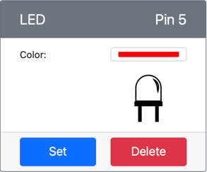

<!--
CO_OP_TRANSLATOR_METADATA:
{
  "original_hash": "9c640f93263fd9adbfda920739e09feb",
  "translation_date": "2025-08-28T10:32:51+00:00",
  "source_file": "1-getting-started/lessons/3-sensors-and-actuators/virtual-device-actuator.md",
  "language_code": "sk"
}
-->
# Vytvorte nočné svetlo - Virtuálny IoT hardvér

V tejto časti lekcie pridáte LED diódu do svojho virtuálneho IoT zariadenia a použijete ju na vytvorenie nočného svetla.

## Virtuálny hardvér

Nočné svetlo potrebuje jeden akčný člen, ktorý sa vytvorí v aplikácii CounterFit.

Akčný člen je **LED dióda**. V prípade fyzického IoT zariadenia by to bola [svetlo emitujúca dióda](https://wikipedia.org/wiki/Light-emitting_diode), ktorá vyžaruje svetlo, keď cez ňu preteká prúd. Toto je digitálny akčný člen, ktorý má dva stavy: zapnutý a vypnutý. Poslaním hodnoty 1 sa LED dióda zapne, a hodnotou 0 sa vypne.

Logika nočného svetla v pseudo-kóde je:

```output
Check the light level.
If the light is less than 300
    Turn the LED on
Otherwise
    Turn the LED off
```

### Pridanie akčného člena do CounterFit

Na použitie virtuálnej LED diódy ju musíte pridať do aplikácie CounterFit.

#### Úloha - pridanie akčného člena do CounterFit

Pridajte LED diódu do aplikácie CounterFit.

1. Uistite sa, že webová aplikácia CounterFit beží z predchádzajúcej časti tejto úlohy. Ak nie, spustite ju a znova pridajte svetelný senzor.

1. Vytvorte LED diódu:

    1. V poli *Create actuator* v paneli *Actuator* rozbaľte pole *Actuator type* a vyberte *LED*.

    1. Nastavte *Pin* na *5*.

    1. Kliknite na tlačidlo **Add**, aby ste vytvorili LED diódu na pine 5.

    

    LED dióda bude vytvorená a zobrazí sa v zozname akčných členov.

    

    Po vytvorení LED diódy môžete zmeniť jej farbu pomocou výberu *Color*. Kliknite na tlačidlo **Set**, aby ste zmenili farbu po jej výbere.

### Naprogramovanie nočného svetla

Nočné svetlo teraz môžete naprogramovať pomocou svetelného senzora a LED diódy v CounterFit.

#### Úloha - naprogramovanie nočného svetla

Naprogramujte nočné svetlo.

1. Otvorte projekt nočného svetla vo VS Code, ktorý ste vytvorili v predchádzajúcej časti tejto úlohy. Ak je to potrebné, ukončite a znova vytvorte terminál, aby ste sa uistili, že beží vo virtuálnom prostredí.

1. Otvorte súbor `app.py`.

1. Pridajte nasledujúci kód do súboru `app.py`, aby ste importovali požadovanú knižnicu. Tento kód by mal byť pridaný na začiatok, pod ostatné riadky `import`.

    ```python
    from counterfit_shims_grove.grove_led import GroveLed
    ```

    Riadok `from counterfit_shims_grove.grove_led import GroveLed` importuje `GroveLed` z Python knižníc CounterFit Grove shim. Táto knižnica obsahuje kód na interakciu s LED diódou vytvorenou v aplikácii CounterFit.

1. Pridajte nasledujúci kód za deklaráciu `light_sensor`, aby ste vytvorili inštanciu triedy, ktorá spravuje LED diódu:

    ```python
    led = GroveLed(5)
    ```

    Riadok `led = GroveLed(5)` vytvára inštanciu triedy `GroveLed`, ktorá sa pripája k pinu **5** - CounterFit Grove pin, ku ktorému je LED dióda pripojená.

1. Pridajte kontrolu do `while` cyklu, pred `time.sleep`, aby ste skontrolovali úroveň svetla a zapli alebo vypli LED diódu:

    ```python
    if light < 300:
        led.on()
    else:
        led.off()
    ```

    Tento kód kontroluje hodnotu `light`. Ak je táto hodnota menšia ako 300, volá metódu `on` triedy `GroveLed`, ktorá posiela digitálnu hodnotu 1 do LED diódy, čím ju zapne. Ak je hodnota svetla väčšia alebo rovná 300, volá metódu `off`, ktorá posiela digitálnu hodnotu 0 do LED diódy, čím ju vypne.

    > 💁 Tento kód by mal byť odsadený na rovnakú úroveň ako riadok `print('Light level:', light)`, aby bol vo vnútri cyklu while!

1. Z terminálu vo VS Code spustite nasledujúci príkaz na spustenie vašej Python aplikácie:

    ```sh
    python3 app.py
    ```

    Hodnoty svetla budú vypísané do konzoly.

    ```output
    (.venv) ➜  GroveTest python3 app.py 
    Light level: 143
    Light level: 244
    Light level: 246
    Light level: 253
    ```

1. Zmeňte nastavenia *Value* alebo *Random*, aby ste upravili úroveň svetla nad a pod hodnotu 300. LED dióda sa bude zapínať a vypínať.


> 💁 Tento kód nájdete v priečinku [code-actuator/virtual-device](../../../../../1-getting-started/lessons/3-sensors-and-actuators/code-actuator/virtual-device).

😀 Program vášho nočného svetla bol úspešný!

---

**Upozornenie**:  
Tento dokument bol preložený pomocou služby AI prekladu [Co-op Translator](https://github.com/Azure/co-op-translator). Hoci sa snažíme o presnosť, prosím, berte na vedomie, že automatizované preklady môžu obsahovať chyby alebo nepresnosti. Pôvodný dokument v jeho rodnom jazyku by mal byť považovaný za autoritatívny zdroj. Pre kritické informácie sa odporúča profesionálny ľudský preklad. Nie sme zodpovední za žiadne nedorozumenia alebo nesprávne interpretácie vyplývajúce z použitia tohto prekladu.