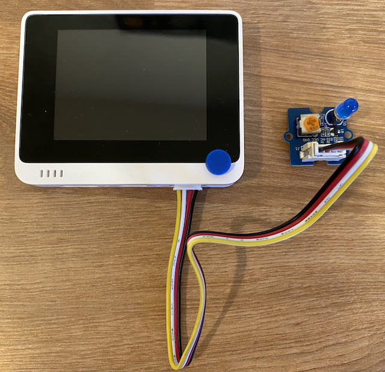

<!--
CO_OP_TRANSLATOR_METADATA:
{
  "original_hash": "db44083b4dc6fb06eac83c4f16448940",
  "translation_date": "2025-08-28T10:36:23+00:00",
  "source_file": "1-getting-started/lessons/3-sensors-and-actuators/wio-terminal-actuator.md",
  "language_code": "sk"
}
-->
# Vytvorte nočné svetlo - Wio Terminal

V tejto časti lekcie pridáte LED k vášmu Wio Terminalu a použijete ju na vytvorenie nočného svetla.

## Hardvér

Nočné svetlo teraz potrebuje aktuátor.

Aktuátor je **LED**, [svetlo emitujúca dióda](https://wikipedia.org/wiki/Light-emitting_diode), ktorá vyžaruje svetlo, keď cez ňu preteká prúd. Ide o digitálny aktuátor, ktorý má dva stavy: zapnutý a vypnutý. Poslaním hodnoty 1 sa LED zapne, a hodnotou 0 sa vypne. Toto je externý Grove aktuátor, ktorý je potrebné pripojiť k Wio Terminalu.

Logika nočného svetla v pseudo-kóde je:

```output
Check the light level.
If the light is less than 300
    Turn the LED on
Otherwise
    Turn the LED off
```

### Pripojte LED

Grove LED je dodávaná ako modul s výberom LED, čo vám umožňuje zvoliť si farbu.

#### Úloha - pripojte LED

Pripojte LED.


1. Vyberte svoju obľúbenú LED a vložte jej nožičky do dvoch otvorov na LED module.

    LED sú svetlo emitujúce diódy, a diódy sú elektronické zariadenia, ktoré môžu prenášať prúd iba jedným smerom. To znamená, že LED musí byť pripojená správnym spôsobom, inak nebude fungovať.

    Jedna z nožičiek LED je kladný pin, druhá je záporný pin. LED nie je dokonale okrúhla a na jednej strane je mierne plochšia. Mierne plochšia strana je záporný pin. Keď pripojíte LED k modulu, uistite sa, že pin pri zaoblenej strane je pripojený k zásuvke označenej **+** na vonkajšej strane modulu, a plochšia strana je pripojená k zásuvke bližšie k stredu modulu.

1. LED modul má otočný gombík, ktorý umožňuje ovládať jas. Na začiatok ho otočte úplne nahor otočením proti smeru hodinových ručičiek, pokiaľ to ide, pomocou malého krížového skrutkovača.

1. Vložte jeden koniec Grove kábla do zásuvky na LED module. Pôjde tam iba jedným smerom.

1. Keď je Wio Terminal odpojený od vášho počítača alebo iného zdroja napájania, pripojte druhý koniec Grove kábla k pravému Grove konektoru na Wio Terminale, keď sa pozeráte na obrazovku. Toto je konektor najďalej od tlačidla napájania.

    > 💁 Pravý Grove konektor môže byť použitý s analógovými alebo digitálnymi senzormi a aktuátormi. Ľavý konektor je určený len pre I2C a digitálne senzory a aktuátory. I2C bude pokryté v neskoršej lekcii.



## Naprogramujte nočné svetlo

Nočné svetlo teraz môže byť naprogramované pomocou zabudovaného svetelného senzora a Grove LED.

### Úloha - naprogramujte nočné svetlo

Naprogramujte nočné svetlo.

1. Otvorte projekt nočného svetla vo VS Code, ktorý ste vytvorili v predchádzajúcej časti tejto úlohy.

1. Pridajte nasledujúci riadok na koniec funkcie `setup`:

    ```cpp
    pinMode(D0, OUTPUT);
    ```

    Tento riadok konfiguruje pin používaný na komunikáciu s LED cez Grove port.

    Pin `D0` je digitálny pin pre pravý Grove konektor. Tento pin je nastavený na `OUTPUT`, čo znamená, že je pripojený k aktuátoru a údaje budú zapisované do pinu.

1. Pridajte nasledujúci kód bezprostredne pred `delay` vo funkcii loop:

    ```cpp
    if (light < 300)
    {
        digitalWrite(D0, HIGH);
    }
    else
    {
        digitalWrite(D0, LOW);
    }
    ```

    Tento kód kontroluje hodnotu `light`. Ak je táto hodnota menšia ako 300, pošle hodnotu `HIGH` na digitálny pin `D0`. Táto hodnota `HIGH` je hodnota 1, ktorá zapne LED. Ak je svetlo väčšie alebo rovné 300, pošle hodnotu `LOW` 0 na pin, čím LED vypne.

    > 💁 Pri posielaní digitálnych hodnôt aktuátorom je hodnota LOW 0V, a hodnota HIGH je maximálne napätie pre zariadenie. Pre Wio Terminal je napätie HIGH 3.3V.

1. Znovu pripojte Wio Terminal k vášmu počítaču a nahrajte nový kód, ako ste to urobili predtým.

1. Pripojte Serial Monitor. Hodnoty svetla budú vypisované do terminálu.

    ```output
    > Executing task: platformio device monitor <

    --- Available filters and text transformations: colorize, debug, default, direct, hexlify, log2file, nocontrol, printable, send_on_enter, time
    --- More details at http://bit.ly/pio-monitor-filters
    --- Miniterm on /dev/cu.usbmodem101  9600,8,N,1 ---
    --- Quit: Ctrl+C | Menu: Ctrl+T | Help: Ctrl+T followed by Ctrl+H ---
    Light value: 4
    Light value: 5
    Light value: 4
    Light value: 158
    Light value: 343
    Light value: 348
    Light value: 344
    ```

1. Zakryte a odkryte svetelný senzor. Všimnite si, ako sa LED rozsvieti, ak je úroveň svetla 300 alebo menej, a zhasne, keď je úroveň svetla väčšia ako 300.


> 💁 Tento kód nájdete v priečinku [code-actuator/wio-terminal](../../../../../1-getting-started/lessons/3-sensors-and-actuators/code-actuator/wio-terminal).

😀 Program vášho nočného svetla bol úspešný!

---

**Upozornenie**:  
Tento dokument bol preložený pomocou služby na automatický preklad [Co-op Translator](https://github.com/Azure/co-op-translator). Aj keď sa snažíme o presnosť, upozorňujeme, že automatické preklady môžu obsahovať chyby alebo nepresnosti. Pôvodný dokument v jeho pôvodnom jazyku by mal byť považovaný za autoritatívny zdroj. Pre dôležité informácie sa odporúča profesionálny ľudský preklad. Nezodpovedáme za žiadne nedorozumenia alebo nesprávne interpretácie vyplývajúce z použitia tohto prekladu.