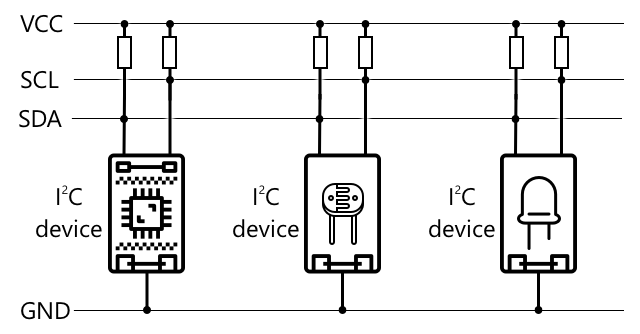

<!--
CO_OP_TRANSLATOR_METADATA:
{
  "original_hash": "4fb20273d299dc8d07a8f06c9cd0cdd9",
  "translation_date": "2025-08-28T10:56:53+00:00",
  "source_file": "2-farm/lessons/2-detect-soil-moisture/README.md",
  "language_code": "sk"
}
-->
C, vyslovované ako *I-štvorc-C*, je protokol pre viacero ovládačov a periférií, kde každé pripojené zariadenie môže fungovať ako ovládač alebo periféria, komunikujúce cez I²C zbernicu (názov pre komunikačný systém, ktorý prenáša dáta). Dáta sa posielajú vo forme adresovaných balíkov, pričom každý balík obsahuje adresu zariadenia, pre ktoré sú určené.

> 💁 Tento model sa kedysi označoval ako master/slave (pán/otrok), ale táto terminológia sa postupne opúšťa kvôli jej spojitosti s otroctvom. [Open Source Hardware Association prijala označenie ovládač/periféria](https://www.oshwa.org/a-resolution-to-redefine-spi-signal-names/), no stále sa môžete stretnúť s odkazmi na starú terminológiu.

Zariadenia majú adresu, ktorá sa používa pri ich pripojení k I²C zbernici, a táto adresa je zvyčajne pevne nastavená na zariadení. Napríklad každý typ Grove senzora od Seeed má rovnakú adresu, takže všetky svetelné senzory majú rovnakú adresu, všetky tlačidlá majú rovnakú adresu, ktorá sa však líši od adresy svetelného senzora. Niektoré zariadenia umožňujú zmenu adresy, napríklad zmenou nastavení prepojok alebo spájkovaním pinov.

I²C má zbernicu zloženú z 2 hlavných vodičov spolu s 2 napájacími vodičmi:

| Vodič | Názov | Popis |
| ---- | --------- | ----------- |
| SDA | Sériové dáta | Tento vodič slúži na odosielanie dát medzi zariadeniami. |
| SCL | Sériový hodinový signál | Tento vodič posiela hodinový signál rýchlosťou nastavenou ovládačom. |
| VCC | Spoločný kolektor napätia | Napájanie pre zariadenia. Toto je pripojené k vodičom SDA a SCL, aby im poskytovalo napájanie cez pull-up rezistor, ktorý vypína signál, keď žiadne zariadenie nie je ovládačom. |
| GND | Zem | Poskytuje spoločnú zem pre elektrický obvod. |

Na odosielanie dát jedno zariadenie vydá štartovaciu podmienku, aby ukázalo, že je pripravené odosielať dáta. Potom sa stane ovládačom. Ovládač následne pošle adresu zariadenia, s ktorým chce komunikovať, spolu s informáciou, či chce dáta čítať alebo zapisovať. Po prenose dát ovládač pošle stop podmienku, aby naznačil, že skončil. Potom sa iné zariadenie môže stať ovládačom a odosielať alebo prijímať dáta.

I2C má rýchlostné limity, s tromi rôznymi režimami, ktoré bežia na pevne stanovených rýchlostiach. Najrýchlejší je režim High Speed s maximálnou rýchlosťou 3,4 Mbps (megabitov za sekundu), hoci veľmi málo zariadení podporuje túto rýchlosť. Napríklad Raspberry Pi je obmedzené na rýchly režim s rýchlosťou 400 Kbps (kilobitov za sekundu). Štandardný režim beží na 100 Kbps.

> 💠Ak používate Raspberry Pi s Grove Base hat ako svoje IoT zariadenie, na doske uvidíte niekoľko I2C zásuviek, ktoré môžete použiť na komunikáciu s I2C senzormi. Analógové Grove senzory tiež používajú I2C s ADC na odosielanie analógových hodnôt ako digitálnych dát, takže svetelný senzor, ktorý ste použili, simuloval analógový pin, priÄom hodnota bola odoslaná cez I2C, pretože Raspberry Pi podporuje iba digitálne piny.

### Univerzálny asynchrónny prijímač-vysielač (UART)

UART zahŕňa fyzické obvody, ktoré umožňujú komunikáciu medzi dvoma zariadeniami. Každé zariadenie má 2 komunikačné piny - vysielací (Tx) a prijímací (Rx), pričom Tx pin prvého zariadenia je pripojený k Rx pinu druhého zariadenia a Tx pin druhého zariadenia je pripojený k Rx pinu prvého zariadenia. To umožňuje obojsmerný prenos dát.

* Zariadenie 1 vysiela dáta zo svojho Tx pinu, ktoré sú prijaté zariadením 2 na jeho Rx pine
* Zariadenie 1 prijíma dáta na svojom Rx pine, ktoré sú vysielané zariadením 2 z jeho Tx pinu

> 🎓 Dáta sa posielajú po jednom bite, čo sa nazýva *sériová* komunikácia. Väčšina operačných systémov a mikrokontrolérov má *sériové porty*, teda pripojenia, ktoré môžu posielať a prijímať sériové dáta dostupné vášmu kódu.

UART zariadenia majú [baudovú rýchlosť](https://wikipedia.org/wiki/Symbol_rate) (tiež známu ako symbolová rýchlosť), čo je rýchlosť, ktorou sa dáta posielajú a prijímajú v bitoch za sekundu. Bežná baudová rýchlosť je 9 600, čo znamená, že sa každú sekundu posiela 9 600 bitov (0 a 1) dát.

UART používa štartovacie a stopovacie bity - teda posiela štartovací bit na označenie, že sa chystá poslať bajt (8 bitov) dát, a potom stopovací bit po odoslaní 8 bitov.

Rýchlosť UART závisí od hardvéru, ale aj najrýchlejšie implementácie neprekračujú 6,5 Mbps (megabitov za sekundu, alebo miliónov bitov, 0 alebo 1, poslaných za sekundu).

UART môžete používať cez GPIO piny - môžete nastaviť jeden pin ako Tx a druhý ako Rx, a potom ich pripojiť k inému zariadeniu.

> 💁 Ak používate Raspberry Pi s Grove Base hat ako svoje IoT zariadenie, na doske uvidíte UART zásuvku, ktorú môžete použiť na komunikáciu so senzormi, ktoré používajú protokol UART.

### Sériové periférne rozhranie (SPI)

SPI je navrhnuté na komunikáciu na krátke vzdialenosti, napríklad na mikrokontroléri na komunikáciu s úložným zariadením, ako je flash pamäť. Je založené na modeli kontrolér/periféria s jedným kontrolérom (zvyčajne procesor IoT zariadenia), ktorý komunikuje s viacerými perifériami. Kontrolér riadi všetko výberom periférie a odosielaním alebo požadovaním dát.

> 💠Podobne ako I2C, pojmy kontrolér a periféria sú nedávne zmeny, takže môžete vidieť stále používané staršie termíny.

SPI kontroléry používajú 3 drôty spolu s 1 extra drôtom na perifériu. Periférie používajú 4 drôty. Tieto drôty sú:

| Drôt | Názov | Popis |
| ---- | --------- | ----------- |
| COPI | Výstup kontroléra, vstup periférie | Tento drôt slúži na odosielanie dát z kontroléra do periférie. |
| CIPO | Vstup kontroléra, výstup periférie | Tento drôt slúži na odosielanie dát z periférie do kontroléra. |
| SCLK | Sériový hodinový signál | Tento drôt posiela hodinový signál s rýchlosťou nastavenou kontrolérom. |
| CS   | Výber čipu | Kontrolér má viac drôtov, jeden na perifériu, a každý drôt je pripojený k CS drôtu na zodpovedajúcej periférii. |

CS drôt sa používa na aktiváciu jednej periférie naraz, komunikáciu cez COPI a CIPO drôty. Keď kontrolér potrebuje zmeniť perifériu, deaktivuje CS drôt pripojený k aktuálne aktívnej periférii, potom aktivuje drôt pripojený k periférii, s ktorou chce komunikovať ďalej.

SPI je *full-duplex*, čo znamená, že kontrolér môže posielať a prijímať dáta súčasne z tej istej periférie pomocou COPI a CIPO drôtov. SPI používa hodinový signál na SCLK drôte na synchronizáciu zariadení, takže na rozdiel od priameho posielania cez UART nepotrebuje štartovacie a stopovacie bity.

SPI nemá definované rýchlostné limity, pričom implementácie často dokážu prenášať niekoľko megabajtov dát za sekundu.

IoT vývojové súpravy často podporujú SPI cez niektoré GPIO piny. Napríklad na Raspberry Pi môžete použiť GPIO piny 19, 21, 23, 24 a 26 pre SPI.

### Bezdrôtové pripojenie

Niektoré senzory môžu komunikovať cez štandardné bezdrôtové protokoly, ako je Bluetooth (hlavne Bluetooth Low Energy, alebo BLE), LoRaWAN (protokol nízkoenergetickej siete na **Lo**ng **Ra**nge), alebo WiFi. Tieto umožňujú vzdialené senzory, ktoré nie sú fyzicky pripojené k IoT zariadeniu.

Jedným z príkladov sú komerčné senzory vlhkosti pôdy. Tieto merajú vlhkosť pôdy na poli a potom posielajú dáta cez LoRaWAN do hub zariadenia, ktoré spracuje dáta alebo ich pošle cez internet. To umožňuje senzoru byť vzdialený od IoT zariadenia, ktoré spravuje dáta, čím sa znižuje spotreba energie a potreba veľkých WiFi sietí alebo dlhých káblov.

BLE je populárne pre pokročilé senzory, ako sú fitness trackery na zápästí. Tieto kombinujú viacero senzorov a posielajú dáta zo senzorov do IoT zariadenia, napríklad vášho telefónu, cez BLE.

✅ Máte na sebe, vo svojom dome alebo škole nejaké bluetooth senzory? Môžu to byť teplotné senzory, senzory obsadenosti, sledovače zariadení a fitness zariadenia.

Jedným z populárnych spôsobov pripojenia komerčných zariadení je Zigbee. Zigbee používa WiFi na vytvorenie sieťových spojení medzi zariadeniami, kde každé zariadenie sa pripojí k čo najväčšiemu počtu blízkych zariadení, čím sa vytvorí veľké množstvo spojení ako pavučina. Keď jedno zariadenie chce poslať správu na internet, môže ju poslať najbližším zariadeniam, ktoré ju potom posunú ďalej na iné blízke zariadenia a tak ďalej, až kým sa nedostane k koordinátorovi a môže byť poslaná na internet.

> 🐝 Názov Zigbee odkazuje na tanec včiel po návrate do úľa.

## Meranie úrovne vlhkosti pôdy

Úroveň vlhkosti pôdy môžete merať pomocou senzora vlhkosti pôdy, IoT zariadenia a izbovej rastliny alebo blízkeho záhonu pôdy.

### Úloha - meranie vlhkosti pôdy

Prejdite si relevantný návod na meranie vlhkosti pôdy pomocou vášho IoT zariadenia:

* [Arduino - Wio Terminal](wio-terminal-soil-moisture.md)
* [Jednodoskový počítač - Raspberry Pi](pi-soil-moisture.md)
* [Jednodoskový počítač - Virtuálne zariadenie](virtual-device-soil-moisture.md)

## Kalibrácia senzora

Senzory sa spoliehajú na meranie elektrických vlastností, ako je odpor alebo kapacita.

> 🎓 Odpor, meraný v ohmoch (Ω), je miera odporu voči elektrickému prúdu, ktorý prechádza materiálom. Keď sa na materiál aplikuje napätie, množstvo prúdu, ktorý prechádza, závisí od odporu materiálu. Viac si môžete prečítať na [stránke o elektrickom odpore na Wikipédii](https://wikipedia.org/wiki/Electrical_resistance_and_conductance).

> 🎓 Kapacita, meraná vo faradoch (F), je schopnosť komponentu alebo obvodu zhromažďovať a ukladať elektrickú energiu. Viac si môžete prečítať o kapacite na [stránke o kapacite na Wikipédii](https://wikipedia.org/wiki/Capacitance).

Tieto merania nie sú vždy užitočné - predstavte si teplotný senzor, ktorý vám dá meranie 22,5 kΩ! Namiesto toho musí byť nameraná hodnota prevedená na užitočnú jednotku kalibráciou - teda priradením nameraných hodnôt k meranej veličine, aby bolo možné nové merania previesť na správnu jednotku.

Niektoré senzory sú predkalibrované. Napríklad teplotný senzor, ktorý ste použili v predchádzajúcej lekcii, bol už kalibrovaný tak, aby mohol vrátiť meranie teploty v °C. Vo výrobe by bol prvý senzor vystavený rozsahu známych teplôt a meraný odpor. To by sa potom použilo na vytvorenie výpočtu, ktorý dokáže previesť hodnotu nameranú v Ω (jednotka odporu) na °C.

> 💁 Vzorec na výpočet odporu z teploty sa nazýva [Steinhart–Hartova rovnica](https://wikipedia.org/wiki/Steinhart–Hart_equation).

### Kalibrácia senzora vlhkosti pôdy

Vlhkosť pôdy sa meria pomocou gravimetrického alebo objemového obsahu vody.

* Gravimetrický je hmotnosť vody v jednotkovej hmotnosti pôdy, meraná ako počet kilogramov vody na kilogram suchej pôdy
* Objemový je objem vody v jednotkovom objeme pôdy, meraný ako počet kubických metrov vody na kubické metre suchej pôdy

> 🇺🇸 Pre Američanov, kvôli konzistencii jednotiek, tieto môžu byť merané v librách namiesto kilogramov alebo kubických stopách namiesto kubických metrov.

Senzory vlhkosti pôdy merajú elektrický odpor alebo kapacitu - to sa líši nielen podľa vlhkosti pôdy, ale aj podľa typu pôdy, pretože zložky v pôde môžu meniť jej elektrické vlastnosti. Ideálne by mali byť senzory kalibrované - teda odoberanie údajov zo senzora a porovnávanie ich s meraniami získanými vedeckejším prístupom. Napríklad laboratórium môže vypočítať gravimetrickú vlhkosť pôdy pomocou vzoriek z konkrétneho poľa odobratých niekoľkokrát ročne a tieto čísla použiť na kalibráciu senzora, priradenie údajov zo senzora k gravimetrickej vlhkosti pôdy.

Graf vyššie ukazuje, ako kalibrovať senzor. Napätie sa zachytí pre vzorku pôdy, ktorá sa potom meria v laboratóriu porovnaním vlhkej hmotnosti so suchou hmotnosťou (meraním hmotnosti vlhkej, potom sušením v peci a meraním suchej). Po odobratí niekoľkých meraní sa tieto môžu vykresliť na grafe a prispôsobiť čiaru bodom. Táto čiara sa potom môže použiť na prevod údajov zo senzora vlhkosti pôdy odobratých IoT zariadením na skutočné merania vlhkosti pôdy.

💁 Pre rezistívne senzory vlhkosti pôdy napätie stúpa, keď vlhkosť pôdy stúpa. Pre kapacitné senzory vlhkosti pôdy napätie klesá, keď vlhkosť pôdy stúpa, takže grafy pre tieto by klesali, nie stúpali.

Graf vyššie ukazuje hodnotu napätia zo senzora vlhkosti pôdy a sledovaním tejto hodnoty na čiaru na grafe je možné vypočítať skutočnú vlhkosť pôdy.

Tento prístup znamená, že farmár potrebuje získať len niekoľko laboratórnych meraní pre pole, potom môže používať IoT zariadenia na meranie vlhkosti pôdy - drasticky urýchľuje čas na odoberanie meraní.

---

## 🚀 Výzva

Rezistívne a kapacitné senzory vlhkosti pôdy majú niekoľko rozdielov. Aké sú tieto rozdiely a ktorý typ (ak vôbec) je najlepší pre farmára? Mení sa táto odpoveď medzi rozvojovými a rozvinutými krajinami?

## Kvíz po prednáške

[Kvíz po prednáške](https://black-meadow-040d15503.1.azurestaticapps.net/quiz/12)

## Prehľad a samostatné štúdium

Prečítajte si o hardvéri a protokoloch používaných senzormi a aktuátormi:

* [GPIO stránka na Wikipédii](https://wikipedia.org/wiki/General-purpose_input/output)
* [UART stránka na Wikipédii](https://wikipedia.org/wiki/Universal_asynchronous_receiver-transmitter)
* [SPI stránka na Wikipédii](https://wikipedia.org/wiki/Serial_Peripheral_Interface)
* [I2C stránka na Wikipédii](https://wikipedia.org/wiki/I²C)
* [Zigbee stránka na Wikipédii](https://wikipedia.org/wiki/Zigbee)

## Zadanie

[Kalibrujte svoj senzor](assignment.md)

---

**Upozornenie**:  
Tento dokument bol preložený pomocou služby AI prekladu [Co-op Translator](https://github.com/Azure/co-op-translator). Hoci sa snažíme o presnosť, prosím, berte na vedomie, že automatizované preklady môžu obsahovať chyby alebo nepresnosti. Pôvodný dokument v jeho pôvodnom jazyku by mal byť považovaný za autoritatívny zdroj. Pre kritické informácie sa odporúča profesionálny ľudský preklad. Nie sme zodpovední za akékoľvek nedorozumenia alebo nesprávne interpretácie vyplývajúce z použitia tohto prekladu.