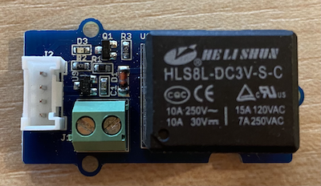

<!--
CO_OP_TRANSLATOR_METADATA:
{
  "original_hash": "66b81165e60f8f169bd52a401b6a0f8b",
  "translation_date": "2025-08-28T11:42:04+00:00",
  "source_file": "2-farm/lessons/3-automated-plant-watering/pi-relay.md",
  "language_code": "sk"
}
-->
# Ovládanie relé - Raspberry Pi

V tejto časti lekcie pridáte k Raspberry Pi relé, okrem senzora vlhkosti pôdy, a budete ho ovládať na základe úrovne vlhkosti pôdy.

## Hardvér

Raspberry Pi potrebuje relé.

Relé, ktoré budete používať, je [Grove relé](https://www.seeedstudio.com/Grove-Relay.html), normálne otvorené relé (to znamená, že výstupný obvod je otvorený alebo odpojený, keď relé nedostáva signál), ktoré dokáže zvládnuť výstupné obvody až do 250V a 10A.

Ide o digitálny akčný člen, takže sa pripája na digitálny pin na Grove Base Hat.

### Pripojenie relé

Grove relé môže byť pripojené k Raspberry Pi.

#### Úloha

Pripojte relé.



1. Zasuňte jeden koniec Grove kábla do zásuvky na relé. Pôjde tam iba jedným smerom.

1. S vypnutým Raspberry Pi pripojte druhý koniec Grove kábla do digitálnej zásuvky označenej **D5** na Grove Base Hat pripojenom k Pi. Táto zásuvka je druhá zľava v rade zásuviek vedľa GPIO pinov. Nechajte senzor vlhkosti pôdy pripojený k zásuvke **A0**.


1. Zasuňte senzor vlhkosti pôdy do pôdy, ak už nie je zasunutý z predchádzajúcej lekcie.

## Naprogramovanie relé

Raspberry Pi teraz môže byť naprogramované na používanie pripojeného relé.

### Úloha

Naprogramujte zariadenie.

1. Zapnite Pi a počkajte, kým sa spustí.

1. Otvorte projekt `soil-moisture-sensor` z poslednej lekcie vo VS Code, ak už nie je otvorený. Budete pridávať do tohto projektu.

1. Pridajte nasledujúci kód do súboru `app.py` pod existujúce importy:

    ```python
    from grove.grove_relay import GroveRelay
    ```

    Tento príkaz importuje `GroveRelay` z knižníc Grove Python na interakciu s Grove relé.

1. Pridajte nasledujúci kód pod deklaráciu triedy `ADC` na vytvorenie inštancie `GroveRelay`:

    ```python
    relay = GroveRelay(5)
    ```

    Týmto sa vytvorí relé pomocou pinu **D5**, digitálneho pinu, ku ktorému ste relé pripojili.

1. Na otestovanie, či relé funguje, pridajte nasledujúci kód do slučky `while True:`:

    ```python
    relay.on()
    time.sleep(.5)
    relay.off()
    ```

    Kód zapne relé, počká 0,5 sekundy, potom relé vypne.

1. Spustite Python aplikáciu. Relé sa bude zapínať a vypínať každých 10 sekúnd, s polsekundovým oneskorením medzi zapnutím a vypnutím. Počujete kliknutie relé pri zapnutí a vypnutí. LED na Grove doske sa rozsvieti, keď je relé zapnuté, a zhasne, keď je vypnuté.

    

## Ovládanie relé na základe vlhkosti pôdy

Teraz, keď relé funguje, môže byť ovládané na základe údajov o vlhkosti pôdy.

### Úloha

Ovládajte relé.

1. Vymažte 3 riadky kódu, ktoré ste pridali na testovanie relé. Nahraďte ich nasledujúcim kódom:

    ```python
    if soil_moisture > 450:
        print("Soil Moisture is too low, turning relay on.")
        relay.on()
    else:
        print("Soil Moisture is ok, turning relay off.")
        relay.off()
    ```

    Tento kód kontroluje úroveň vlhkosti pôdy zo senzora vlhkosti pôdy. Ak je nad 450, zapne relé, a vypne ho, keď klesne pod 450.

    > 💁 Pamätajte, že kapacitný senzor vlhkosti pôdy číta: čím nižšia je úroveň vlhkosti pôdy, tým viac vlhkosti je v pôde, a naopak.

1. Spustite Python aplikáciu. Uvidíte, že relé sa zapína alebo vypína v závislosti od úrovne vlhkosti pôdy. Skúste v suchej pôde, potom pridajte vodu.

    ```output
    Soil Moisture: 638
    Soil Moisture is too low, turning relay on.
    Soil Moisture: 452
    Soil Moisture is too low, turning relay on.
    Soil Moisture: 347
    Soil Moisture is ok, turning relay off.
    ```

> 💁 Tento kód nájdete v priečinku [code-relay/pi](../../../../../2-farm/lessons/3-automated-plant-watering/code-relay/pi).

😀 Program na ovládanie relé pomocou senzora vlhkosti pôdy bol úspešný!

---

**Upozornenie**:  
Tento dokument bol preložený pomocou služby na automatický preklad [Co-op Translator](https://github.com/Azure/co-op-translator). Hoci sa snažíme o presnosť, upozorňujeme, že automatické preklady môžu obsahovať chyby alebo nepresnosti. Pôvodný dokument v jeho pôvodnom jazyku by mal byť považovaný za záväzný zdroj. Pre dôležité informácie odporúčame profesionálny preklad vykonaný človekom. Nezodpovedáme za žiadne nedorozumenia alebo nesprávne interpretácie vyplývajúce z použitia tohto prekladu.