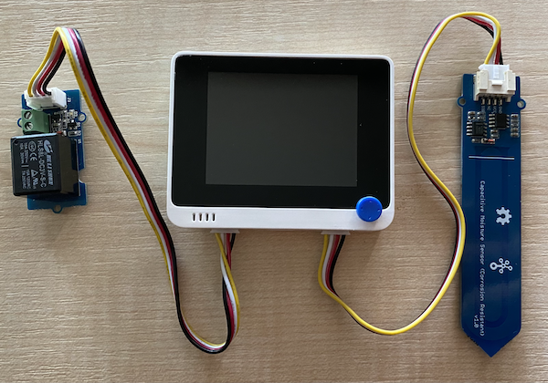

<!--
CO_OP_TRANSLATOR_METADATA:
{
  "original_hash": "f3c5d8afa2ef6a0b425ef8ff20615cb4",
  "translation_date": "2025-08-28T11:43:18+00:00",
  "source_file": "2-farm/lessons/3-automated-plant-watering/wio-terminal-relay.md",
  "language_code": "sk"
}
-->
# Ovládanie relé - Wio Terminal

V tejto časti lekcie pridáte k vášmu Wio Terminalu relé, okrem senzora vlhkosti pôdy, a budete ho ovládať na základe úrovne vlhkosti pôdy.

## Hardvér

Wio Terminal potrebuje relé.

Relé, ktoré použijete, je [Grove relé](https://www.seeedstudio.com/Grove-Relay.html), normálne otvorené relé (to znamená, že výstupný obvod je otvorený alebo odpojený, keď relé nedostáva signál), ktoré zvládne výstupné obvody až do 250V a 10A.

Toto je digitálny akčný člen, takže sa pripája k digitálnym pinom na Wio Terminale. Kombinovaný analógový/digitálny port je už obsadený senzorom vlhkosti pôdy, takže toto relé sa pripojí do druhého portu, ktorý je kombinovaný I2C a digitálny port.

### Pripojenie relé

Grove relé môže byť pripojené k digitálnemu portu Wio Terminalu.

#### Úloha

Pripojte relé.


1. Zasuňte jeden koniec Grove kábla do zásuvky na relé. Kábel sa zasunie iba jedným spôsobom.

1. Keď je Wio Terminal odpojený od vášho počítača alebo iného zdroja napájania, pripojte druhý koniec Grove kábla do ľavého Grove portu na Wio Terminale, keď sa pozeráte na obrazovku. Senzor vlhkosti pôdy nechajte pripojený do pravého portu.



1. Zasuňte senzor vlhkosti pôdy do pôdy, ak už nie je zasunutý z predchádzajúcej lekcie.

## Naprogramovanie relé

Wio Terminal teraz môže byť naprogramovaný na používanie pripojeného relé.

### Úloha

Naprogramujte zariadenie.

1. Otvorte projekt `soil-moisture-sensor` z predchádzajúcej lekcie vo VS Code, ak ešte nie je otvorený. Budete do tohto projektu pridávať.

2. Pre tento akčný člen neexistuje knižnica - je to digitálny akčný člen ovládaný vysokým alebo nízkym signálom. Na jeho zapnutie pošlete vysoký signál na pin (3.3V), na jeho vypnutie pošlete nízky signál (0V). Môžete to urobiť pomocou zabudovanej Arduino funkcie [`digitalWrite`](https://www.arduino.cc/reference/en/language/functions/digital-io/digitalwrite/). Začnite pridaním nasledujúceho kódu na koniec funkcie `setup`, aby ste nastavili kombinovaný I2C/digitálny port ako výstupný pin na posielanie napätia do relé:

    ```cpp
    pinMode(PIN_WIRE_SCL, OUTPUT);
    ```

    `PIN_WIRE_SCL` je číslo portu pre kombinovaný I2C/digitálny port.

1. Na otestovanie, či relé funguje, pridajte nasledujúci kód do funkcie `loop`, pod posledný `delay`:

    ```cpp
    digitalWrite(PIN_WIRE_SCL, HIGH);
    delay(500);
    digitalWrite(PIN_WIRE_SCL, LOW);
    ```

    Tento kód pošle vysoký signál na pin, ku ktorému je pripojené relé, aby ho zapol, počká 500 ms (pol sekundy), a potom pošle nízky signál, aby relé vypol.

1. Zostavte a nahrajte kód do Wio Terminalu.

1. Po nahraní sa relé bude zapínať a vypínať každých 10 sekúnd, s polsekundovým oneskorením medzi zapnutím a vypnutím. Počujete, ako relé klikne pri zapnutí a vypnutí. LED dióda na Grove doske sa rozsvieti, keď je relé zapnuté, a zhasne, keď je vypnuté.

    

## Ovládanie relé na základe vlhkosti pôdy

Teraz, keď relé funguje, môže byť ovládané na základe hodnôt vlhkosti pôdy.

### Úloha

Ovládajte relé.

1. Vymažte 3 riadky kódu, ktoré ste pridali na testovanie relé. Nahraďte ich nasledujúcim kódom:

    ```cpp
    if (soil_moisture > 450)
    {
        Serial.println("Soil Moisture is too low, turning relay on.");
        digitalWrite(PIN_WIRE_SCL, HIGH);
    }
    else
    {
        Serial.println("Soil Moisture is ok, turning relay off.");
        digitalWrite(PIN_WIRE_SCL, LOW);
    }
    ```

    Tento kód kontroluje úroveň vlhkosti pôdy zo senzora vlhkosti pôdy. Ak je hodnota nad 450, zapne relé, a vypne ho, keď klesne pod 450.

    > 💁 Pamätajte, že kapacitný senzor vlhkosti pôdy číta nižšie hodnoty vlhkosti, keď je v pôde viac vlhkosti, a naopak.

1. Zostavte a nahrajte kód do Wio Terminalu.

1. Monitorujte zariadenie cez sériový monitor. Uvidíte, ako sa relé zapína alebo vypína v závislosti od úrovne vlhkosti pôdy. Skúste to v suchej pôde, potom pridajte vodu.

    ```output
    Soil Moisture: 638
    Soil Moisture is too low, turning relay on.
    Soil Moisture: 452
    Soil Moisture is too low, turning relay on.
    Soil Moisture: 347
    Soil Moisture is ok, turning relay off.
    ```

> 💁 Tento kód nájdete v priečinku [code-relay/wio-terminal](../../../../../2-farm/lessons/3-automated-plant-watering/code-relay/wio-terminal).

😀 Program na ovládanie relé senzorom vlhkosti pôdy bol úspešný!

---

**Upozornenie**:  
Tento dokument bol preložený pomocou služby AI prekladu [Co-op Translator](https://github.com/Azure/co-op-translator). Aj keď sa snažíme o presnosť, prosím, berte na vedomie, že automatizované preklady môžu obsahovať chyby alebo nepresnosti. Pôvodný dokument v jeho rodnom jazyku by mal byť považovaný za autoritatívny zdroj. Pre kritické informácie sa odporúča profesionálny ľudský preklad. Nie sme zodpovední za akékoľvek nedorozumenia alebo nesprávne interpretácie vyplývajúce z použitia tohto prekladu.