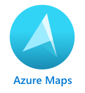

<!--
CO_OP_TRANSLATOR_METADATA:
{
  "original_hash": "9095c61445c2bca7245ef9b59a186a11",
  "translation_date": "2025-08-28T09:47:00+00:00",
  "source_file": "3-transport/lessons/3-visualize-location-data/README.md",
  "language_code": "sk"
}
-->
# Vizualizácia údajov o polohe


> Sketchnote od [Nitya Narasimhan](https://github.com/nitya). Kliknite na obrázok pre väčšiu verziu.

Toto video poskytuje prehľad Azure Maps s IoT, služby, ktorá bude pokrytá v tejto lekcii.

[](https://www.youtube.com/watch?v=P5i2GFTtb2s)

> 🎥 Kliknite na obrázok vyššie a pozrite si video

## Kvíz pred prednáškou

[Kvíz pred prednáškou](https://black-meadow-040d15503.1.azurestaticapps.net/quiz/25)

## Úvod

V poslednej lekcii ste sa naučili, ako získať GPS údaje zo svojich senzorov a uložiť ich do cloudu v úložnom kontajneri pomocou serverless kódu. Teraz objavíte, ako tieto body vizualizovať na mape Azure. Naučíte sa, ako vytvoriť mapu na webovej stránke, zoznámite sa s formátom GeoJSON a ako ho použiť na vykreslenie všetkých zachytených GPS bodov na mape.

V tejto lekcii sa budeme venovať:

* [Čo je vizualizácia údajov](../../../../../3-transport/lessons/3-visualize-location-data)
* [Mapové služby](../../../../../3-transport/lessons/3-visualize-location-data)
* [Vytvorenie zdroja Azure Maps](../../../../../3-transport/lessons/3-visualize-location-data)
* [Zobrazenie mapy na webovej stránke](../../../../../3-transport/lessons/3-visualize-location-data)
* [Formát GeoJSON](../../../../../3-transport/lessons/3-visualize-location-data)
* [Vykreslenie GPS údajov na mape pomocou GeoJSON](../../../../../3-transport/lessons/3-visualize-location-data)

> 💁 Táto lekcia bude zahŕňať malé množstvo HTML a JavaScriptu. Ak by ste sa chceli dozvedieť viac o vývoji webu pomocou HTML a JavaScriptu, pozrite si [Web development for beginners](https://github.com/microsoft/Web-Dev-For-Beginners).

## Čo je vizualizácia údajov

Vizualizácia údajov, ako naznačuje názov, je o vizualizácii údajov spôsobmi, ktoré uľahčujú ich pochopenie pre ľudí. Zvyčajne sa spája s grafmi a diagramami, ale ide o akýkoľvek spôsob obrazového znázornenia údajov, ktorý pomáha ľuďom nielen lepšie pochopiť údaje, ale aj robiť rozhodnutia.

Jednoduchý príklad - v projekte farmy ste zachytili údaje o vlhkosti pôdy. Tabuľka údajov o vlhkosti pôdy zachytených každú hodinu 1. júna 2021 môže vyzerať takto:

| Dátum            | Hodnota |
| ----------------- | ------: |
| 01/06/2021 00:00 |     257 |
| 01/06/2021 01:00 |     268 |
| 01/06/2021 02:00 |     295 |
| 01/06/2021 03:00 |     305 |
| 01/06/2021 04:00 |     325 |
| 01/06/2021 05:00 |     359 |
| 01/06/2021 06:00 |     398 |
| 01/06/2021 07:00 |     410 |
| 01/06/2021 08:00 |     429 |
| 01/06/2021 09:00 |     451 |
| 01/06/2021 10:00 |     460 |
| 01/06/2021 11:00 |     452 |
| 01/06/2021 12:00 |     420 |
| 01/06/2021 13:00 |     408 |
| 01/06/2021 14:00 |     431 |
| 01/06/2021 15:00 |     462 |
| 01/06/2021 16:00 |     432 |
| 01/06/2021 17:00 |     402 |
| 01/06/2021 18:00 |     387 |
| 01/06/2021 19:00 |     360 |
| 01/06/2021 20:00 |     358 |
| 01/06/2021 21:00 |     354 |
| 01/06/2021 22:00 |     356 |
| 01/06/2021 23:00 |     362 |

Ako človek môže byť pochopenie týchto údajov náročné. Je to stena čísel bez akéhokoľvek významu. Ako prvý krok k vizualizácii týchto údajov ich možno vykresliť na čiarovom grafe:


Tento graf možno ďalej vylepšiť pridaním čiary, ktorá označuje, kedy bol automatický zavlažovací systém zapnutý pri hodnote vlhkosti pôdy 450:


Tento graf veľmi rýchlo ukazuje nielen to, aké boli úrovne vlhkosti pôdy, ale aj body, kde bol zavlažovací systém zapnutý.

Grafy nie sú jediným nástrojom na vizualizáciu údajov. IoT zariadenia, ktoré sledujú počasie, môžu mať webové aplikácie alebo mobilné aplikácie, ktoré vizualizujú poveternostné podmienky pomocou symbolov, ako je symbol oblaku pre zamračené dni, dažďový oblak pre daždivé dni a podobne. Existuje obrovské množstvo spôsobov, ako vizualizovať údaje, niektoré vážne, iné zábavné.

✅ Zamyslite sa nad spôsobmi, akými ste videli vizualizované údaje. Ktoré metódy boli najjasnejšie a umožnili vám najrýchlejšie rozhodovanie?

Najlepšie vizualizácie umožňujú ľuďom robiť rozhodnutia rýchlo. Napríklad mať stenu ukazovateľov zobrazujúcich všetky možné hodnoty z priemyselných strojov je ťažké spracovať, ale blikajúce červené svetlo, keď sa niečo pokazí, umožňuje človeku urobiť rozhodnutie. Niekedy je najlepšou vizualizáciou blikajúce svetlo!

Pri práci s GPS údajmi môže byť najjasnejšou vizualizáciou vykreslenie údajov na mape. Mapa zobrazujúca napríklad doručovacie kamióny môže pomôcť pracovníkom v spracovateľskom závode vidieť, kedy kamióny dorazia. Ak táto mapa zobrazuje viac než len obrázky kamiónov na ich aktuálnych polohách, ale poskytuje predstavu o obsahu kamiónu, pracovníci závodu môžu podľa toho plánovať - ak vidia blízko chladený kamión, vedia pripraviť miesto v chladničke.

## Mapové služby

Práca s mapami je zaujímavé cvičenie a existuje mnoho možností, ako napríklad Bing Maps, Leaflet, Open Street Maps a Google Maps. V tejto lekcii sa naučíte o [Azure Maps](https://azure.microsoft.com/services/azure-maps/?WT.mc_id=academic-17441-jabenn) a ako môžu zobrazovať vaše GPS údaje.



Azure Maps je "kolekcia geopriestorových služieb a SDK, ktoré používajú aktuálne mapové údaje na poskytovanie geografického kontextu webovým a mobilným aplikáciám." Vývojári majú k dispozícii nástroje na vytváranie krásnych, interaktívnych máp, ktoré dokážu robiť veci ako poskytovať odporúčané dopravné trasy, informácie o dopravných incidentoch, navigáciu v interiéri, vyhľadávacie schopnosti, informácie o nadmorskej výške, služby počasia a ďalšie.

✅ Experimentujte s niektorými [ukážkami kódu pre mapy](https://docs.microsoft.com/samples/browse?WT.mc_id=academic-17441-jabenn&products=azure-maps)

Mapy môžete zobrazovať ako prázdne plátno, dlaždice, satelitné snímky, satelitné snímky s prekrytými cestami, rôzne typy šedotónových máp, mapy s tieňovaným reliéfom na zobrazenie nadmorskej výšky, nočné mapy a mapy s vysokým kontrastom. Môžete získať aktualizácie v reálnom čase na svojich mapách integráciou s [Azure Event Grid](https://azure.microsoft.com/services/event-grid/?WT.mc_id=academic-17441-jabenn). Môžete ovládať správanie a vzhľad svojich máp povolením rôznych ovládacích prvkov, ktoré umožňujú mape reagovať na udalosti ako priblíženie, posun a kliknutie. Na ovládanie vzhľadu mapy môžete pridávať vrstvy, ktoré zahŕňajú bubliny, čiary, polygóny, teplotné mapy a ďalšie. Štýl mapy, ktorý implementujete, závisí od vášho výberu SDK.

K API Azure Maps môžete pristupovať využitím jeho [REST API](https://docs.microsoft.com/javascript/api/azure-maps-rest/?WT.mc_id=academic-17441-jabenn&view=azure-maps-typescript-latest), jeho [Web SDK](https://docs.microsoft.com/azure/azure-maps/how-to-use-map-control?WT.mc_id=academic-17441-jabenn), alebo, ak vytvárate mobilnú aplikáciu, jeho [Android SDK](https://docs.microsoft.com/azure/azure-maps/how-to-use-android-map-control-library?WT.mc_id=academic-17441-jabenn&pivots=programming-language-java-android).

V tejto lekcii použijete webové SDK na nakreslenie mapy a zobrazenie cesty GPS polohy vášho senzora.

## Vytvorenie zdroja Azure Maps

Vaším prvým krokom je vytvorenie účtu Azure Maps.

### Úloha - vytvorenie zdroja Azure Maps

1. Spustite nasledujúci príkaz z vášho Terminálu alebo Command Prompt na vytvorenie zdroja Azure Maps v skupine zdrojov `gps-sensor`:

    ```sh
    az maps account create --name gps-sensor \
                           --resource-group gps-sensor \
                           --accept-tos \
                           --sku S1
    ```

    Týmto sa vytvorí zdroj Azure Maps s názvom `gps-sensor`. Používaná úroveň je `S1`, čo je platená úroveň, ktorá zahŕňa množstvo funkcií, ale s veľkorysým množstvom bezplatných volaní.

    > 💁 Ak chcete vidieť náklady na používanie Azure Maps, pozrite si [stránku s cenami Azure Maps](https://azure.microsoft.com/pricing/details/azure-maps/?WT.mc_id=academic-17441-jabenn).

1. Budete potrebovať API kľúč pre zdroj máp. Použite nasledujúci príkaz na získanie tohto kľúča:

    ```sh
    az maps account keys list --name gps-sensor \
                              --resource-group gps-sensor \
                              --output table
    ```

    Skopírujte hodnotu `PrimaryKey`.

## Zobrazenie mapy na webovej stránke

Teraz môžete urobiť ďalší krok, ktorým je zobrazenie mapy na webovej stránke. Použijeme len jeden súbor `html` pre vašu malú webovú aplikáciu; majte na pamäti, že v produkčnom alebo tímovom prostredí bude vaša webová aplikácia pravdepodobne obsahovať viac častí!

### Úloha - zobrazenie mapy na webovej stránke

1. Vytvorte súbor s názvom index.html v priečinku niekde na vašom lokálnom počítači. Pridajte HTML značky na umiestnenie mapy:

    ```html
    <html>
    <head>
        <style>
            #myMap {
                width:100%;
                height:100%;
            }
        </style>
    </head>
    
    <body onload="init()">
        <div id="myMap"></div>
    </body>
    </html>
    ```

    Mapa sa načíta v `div` s názvom `myMap`. Niekoľko štýlov umožňuje, aby pokryla šírku a výšku stránky.

    > 🎓 `div` je sekcia webovej stránky, ktorú je možné pomenovať a štýlovať.

1. Pod otváracou značkou `<head>` pridajte externý štýlový súbor na ovládanie zobrazenia mapy a externý skript z Web SDK na správu jej správania:

    ```html
    <link rel="stylesheet" href="https://atlas.microsoft.com/sdk/javascript/mapcontrol/2/atlas.min.css" type="text/css" />
    <script src="https://atlas.microsoft.com/sdk/javascript/mapcontrol/2/atlas.min.js"></script>
    ```

    Tento štýlový súbor obsahuje nastavenia vzhľadu mapy a skriptový súbor obsahuje kód na načítanie mapy. Pridanie tohto kódu je podobné ako zahrnutie hlavičkových súborov v C++ alebo importovanie modulov v Pythone.

1. Pod týmto skriptom pridajte blok skriptu na spustenie mapy.

    ```javascript
    <script type='text/javascript'>
        function init() {
            var map = new atlas.Map('myMap', {
                center: [-122.26473, 47.73444],
                zoom: 12,
                authOptions: {
                    authType: "subscriptionKey",
                    subscriptionKey: "<subscription_key>",

                }
            });
        }
    </script>
    ```

    Nahraďte `<subscription_key>` API kľúčom pre váš účet Azure Maps.

    Ak otvoríte svoju stránku `index.html` v webovom prehliadači, mali by ste vidieť načítanú mapu, zameranú na oblasť Seattle.

    

    ✅ Experimentujte s parametrami priblíženia a centra na zmenu zobrazenia mapy. Môžete pridať rôzne súradnice zodpovedajúce zemepisnej šírke a dĺžke vašich údajov na opätovné zameranie mapy.

> 💁 Lepší spôsob práce s webovými aplikáciami lokálne je nainštalovať [http-server](https://www.npmjs.com/package/http-server). Budete potrebovať [node.js](https://nodejs.org/) a [npm](https://www.npmjs.com/) nainštalované pred použitím tohto nástroja. Po nainštalovaní týchto nástrojov môžete prejsť na umiestnenie vášho súboru `index.html` a zadať `http-server`. Webová aplikácia sa otvorí na lokálnom webovom serveri [http://127.0.0.1:8080/](http://127.0.0.1:8080/).

## Formát GeoJSON

Teraz, keď máte svoju webovú aplikáciu pripravenú s mapou, ktorá sa zobrazuje, potrebujete extrahovať GPS údaje z vášho úložného účtu a zobraziť ich vo vrstve značiek na mape. Predtým, než to urobíme, pozrime sa na formát [GeoJSON](https://wikipedia.org/wiki/GeoJSON), ktorý je požadovaný Azure Maps.

[GeoJSON](https://geojson.org/) je otvorený štandard JSON špecifikácie so špeciálnym formátovaním navrhnutým na spracovanie geograficky špecifických údajov. Môžete sa o ňom dozvedieť testovaním vzorových údajov pomocou [geojson.io](https://geojson.io), čo je tiež užitočný nástroj na ladenie súborov GeoJSON.

Vzorové údaje GeoJSON vyzerajú takto:

```json
{
  "type": "FeatureCollection",
  "features": [
    {
      "type": "Feature",
      "geometry": {
        "type": "Point",
        "coordinates": [
          -2.10237979888916,
          57.164918677004714
        ]
      }
    }
  ]
}
```

Zvlášť zaujímavé je, ako sú údaje vnorené ako `Feature` v rámci `FeatureCollection`. V rámci tohto objektu sa nachádza `geometry` s `coordinates`, ktoré označujú zemepisnú šírku a dĺžku.

✅ Pri vytváraní vášho geoJSON dávajte pozor na poradie `latitude` a `longitude` v objekte, inak sa vaše body nezobrazia tam, kde by mali! GeoJSON očakáva údaje v poradí `lon,lat` pre body, nie `lat,lon`.

`Geometry` môže mať rôzne typy, ako napríklad jeden bod alebo polygon. V tomto príklade ide o bod s dvoma určenými súradnicami, zemepisnou dĺžkou a šírkou.
✅ Azure Maps podporuje štandardný GeoJSON a navyše niektoré [rozšírené funkcie](https://docs.microsoft.com/azure/azure-maps/extend-geojson?WT.mc_id=academic-17441-jabenn), vrátane možnosti kresliť kruhy a iné geometrické tvary.

## Zobrazenie GPS údajov na mape pomocou GeoJSON

Teraz ste pripravení pracovať s údajmi zo storage, ktorý ste vytvorili v predchádzajúcej lekcii. Pripomíname, že údaje sú uložené ako množstvo súborov v blob storage, takže budete musieť tieto súbory načítať a spracovať, aby ich Azure Maps mohol použiť.

### Úloha - nakonfigurovať storage na prístup z webovej stránky

Ak zavoláte svoj storage na načítanie údajov, môžete byť prekvapení, keď vo svojej konzole prehliadača uvidíte chyby. Je to preto, že musíte nastaviť povolenia pre [CORS](https://developer.mozilla.org/docs/Web/HTTP/CORS) na tomto storage, aby externé webové aplikácie mohli čítať jeho údaje.

> 🎓 CORS znamená „Cross-Origin Resource Sharing“ (zdieľanie zdrojov medzi rôznymi doménami) a zvyčajne je potrebné ho v Azure explicitne nastaviť z bezpečnostných dôvodov. Zabraňuje tomu, aby k vašim údajom pristupovali stránky, ktoré neočakávate.

1. Spustite nasledujúci príkaz na povolenie CORS:

    ```sh
    az storage cors add --methods GET \
                        --origins "*" \
                        --services b \
                        --account-name <storage_name> \
                        --account-key <key1>
    ```

    Nahraďte `<storage_name>` názvom vášho storage účtu. Nahraďte `<key1>` kľúčom účtu pre váš storage účet.

    Tento príkaz umožňuje akejkoľvek webovej stránke (zástupný znak `*` znamená akúkoľvek) vykonať požiadavku *GET*, teda načítať údaje z vášho storage účtu. Parameter `--services b` znamená, že toto nastavenie sa vzťahuje iba na blobs.

### Úloha - načítanie GPS údajov zo storage

1. Nahraďte celý obsah funkcie `init` nasledujúcim kódom:

    ```javascript
    fetch("https://<storage_name>.blob.core.windows.net/gps-data/?restype=container&comp=list")
        .then(response => response.text())
        .then(str => new window.DOMParser().parseFromString(str, "text/xml"))
        .then(xml => {
            let blobList = Array.from(xml.querySelectorAll("Url"));
                blobList.forEach(async blobUrl => {
                    loadJSON(blobUrl.innerHTML)                
        });
    })
    .then( response => {
        map = new atlas.Map('myMap', {
            center: [-122.26473, 47.73444],
            zoom: 14,
            authOptions: {
                authType: "subscriptionKey",
                subscriptionKey: "<subscription_key>",
    
            }
        });
        map.events.add('ready', function () {
            var source = new atlas.source.DataSource();
            map.sources.add(source);
            map.layers.add(new atlas.layer.BubbleLayer(source));
            source.add(features);
        })
    })
    ```

    Nahraďte `<storage_name>` názvom vášho storage účtu. Nahraďte `<subscription_key>` API kľúčom pre váš Azure Maps účet.

    Tu sa deje niekoľko vecí. Najprv kód načíta vaše GPS údaje z blob kontajnera pomocou URL endpointu, ktorý je vytvorený pomocou názvu vášho storage účtu. Táto URL adresa načíta údaje z `gps-data`, čo naznačuje, že typ zdroja je kontajner (`restype=container`), a poskytne informácie o všetkých blobs. Tento zoznam nevráti samotné blobs, ale poskytne URL pre každý blob, ktorý možno použiť na načítanie údajov blobu.

    > 💁 Túto URL adresu môžete vložiť do svojho prehliadača, aby ste videli podrobnosti o všetkých blobs vo vašom kontajneri. Každá položka bude mať vlastnosť `Url`, ktorú môžete tiež načítať vo svojom prehliadači na zobrazenie obsahu blobu.

    Tento kód potom načíta každý blob, pričom volá funkciu `loadJSON`, ktorú vytvoríme ďalej. Následne vytvorí mapový ovládací prvok a pridá kód do udalosti `ready`. Táto udalosť sa vyvolá, keď sa mapa zobrazí na webovej stránke.

    Udalosť `ready` vytvorí zdroj údajov pre Azure Maps - kontajner, ktorý obsahuje GeoJSON údaje, ktoré budú neskôr naplnené. Tento zdroj údajov sa potom použije na vytvorenie vrstvy bublín - teda sady kruhov na mape, ktoré sú umiestnené nad každým bodom v GeoJSON.

1. Pridajte funkciu `loadJSON` do vášho skriptového bloku, pod funkciu `init`:

    ```javascript
    var map, features;

    function loadJSON(file) {
        var xhr = new XMLHttpRequest();
        features = [];
        xhr.onreadystatechange = function () {
            if (xhr.readyState === XMLHttpRequest.DONE) {
                if (xhr.status === 200) {
                    gps = JSON.parse(xhr.responseText)
                    features.push(
                        new atlas.data.Feature(new atlas.data.Point([parseFloat(gps.gps.lon), parseFloat(gps.gps.lat)]))
                    )
                }
            }
        };
        xhr.open("GET", file, true);
        xhr.send();
    }    
    ```

    Táto funkcia je volaná načítacou rutinou na spracovanie JSON údajov a ich konverziu na súradnice zemepisnej dĺžky a šírky ako GeoJSON.
    Po spracovaní sú údaje nastavené ako súčasť GeoJSON `Feature`. Mapa sa inicializuje a malé bubliny sa zobrazia okolo trasy, ktorú vaše údaje vykresľujú:

1. Načítajte HTML stránku vo svojom prehliadači. Načíta sa mapa, potom sa načítajú všetky GPS údaje zo storage a zobrazia sa na mape.

    

> 💁 Tento kód nájdete v [code](../../../../../3-transport/lessons/3-visualize-location-data/code) priečinku.

---

## 🚀 Výzva

Je pekné vedieť zobraziť statické údaje na mape ako značky. Dokážete túto webovú aplikáciu vylepšiť tak, aby pridala animáciu a zobrazila trasu značiek v priebehu času, pomocou časovo označených JSON súborov? Tu sú [niektoré príklady](https://azuremapscodesamples.azurewebsites.net/) použitia animácie v mapách.

## Kvíz po prednáške

[Kvíz po prednáške](https://black-meadow-040d15503.1.azurestaticapps.net/quiz/26)

## Prehľad a samoštúdium

Azure Maps je obzvlášť užitočný pri práci so zariadeniami IoT.

* Preskúmajte niektoré z použití v [dokumentácii Azure Maps na Microsoft docs](https://docs.microsoft.com/azure/azure-maps/tutorial-iot-hub-maps?WT.mc_id=academic-17441-jabenn).
* Prehĺbte si znalosti o tvorbe máp a trasových bodoch pomocou [samostatne vedeného vzdelávacieho modulu na Microsoft Learn o vytvorení vašej prvej aplikácie na vyhľadávanie trás s Azure Maps](https://docs.microsoft.com/learn/modules/create-your-first-app-with-azure-maps/?WT.mc_id=academic-17441-jabenn).

## Zadanie

[Nasadiť vašu aplikáciu](assignment.md)

---

**Upozornenie**:  
Tento dokument bol preložený pomocou služby AI prekladu [Co-op Translator](https://github.com/Azure/co-op-translator). Hoci sa snažíme o presnosť, prosím, berte na vedomie, že automatizované preklady môžu obsahovať chyby alebo nepresnosti. Pôvodný dokument v jeho rodnom jazyku by mal byť považovaný za autoritatívny zdroj. Pre kritické informácie sa odporúča profesionálny ľudský preklad. Nie sme zodpovední za akékoľvek nedorozumenia alebo nesprávne interpretácie vyplývajúce z použitia tohto prekladu.