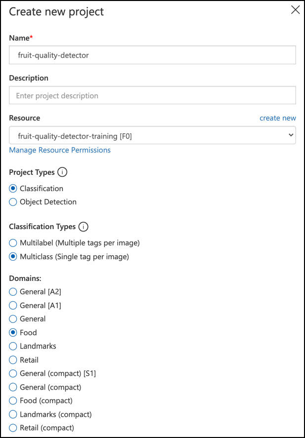

<!--
CO_OP_TRANSLATOR_METADATA:
{
  "original_hash": "f5e63c916d2dd97d58be12aaf76bd9f1",
  "translation_date": "2025-08-28T08:16:08+00:00",
  "source_file": "4-manufacturing/lessons/1-train-fruit-detector/README.md",
  "language_code": "sk"
}
-->
# Trénovanie detektora kvality ovocia


> Sketchnote od [Nitya Narasimhan](https://github.com/nitya). Kliknite na obrázok pre väčšiu verziu.

Toto video poskytuje prehľad služby Azure Custom Vision, ktorá bude pokrytá v tejto lekcii.

[](https://www.youtube.com/watch?v=TETcDLJlWR4)

> 🎥 Kliknite na obrázok vyššie a pozrite si video

## Kvíz pred prednáškou

[Kvíz pred prednáškou](https://black-meadow-040d15503.1.azurestaticapps.net/quiz/29)

## Úvod

Nedávny nárast umelej inteligencie (AI) a strojového učenia (ML) poskytuje dnešným vývojárom širokú škálu možností. Modely ML môžu byť trénované na rozpoznávanie rôznych vecí na obrázkoch, vrátane nezrelého ovocia, čo môže byť využité v IoT zariadeniach na triedenie plodín buď počas zberu, alebo pri spracovaní vo fabrikách či skladoch.

V tejto lekcii sa naučíte o klasifikácii obrázkov – používaní modelov ML na rozlišovanie medzi obrázkami rôznych vecí. Naučíte sa, ako trénovať klasifikátor obrázkov na rozlišovanie medzi dobrým a zlým ovocím, či už nezrelým, prezretým, poškodeným alebo zhnitým.

V tejto lekcii pokryjeme:

* [Používanie AI a ML na triedenie potravín](../../../../../4-manufacturing/lessons/1-train-fruit-detector)
* [Klasifikácia obrázkov pomocou strojového učenia](../../../../../4-manufacturing/lessons/1-train-fruit-detector)
* [Trénovanie klasifikátora obrázkov](../../../../../4-manufacturing/lessons/1-train-fruit-detector)
* [Testovanie vášho klasifikátora obrázkov](../../../../../4-manufacturing/lessons/1-train-fruit-detector)
* [Opätovné trénovanie vášho klasifikátora obrázkov](../../../../../4-manufacturing/lessons/1-train-fruit-detector)

## Používanie AI a ML na triedenie potravín

Nakŕmiť globálnu populáciu je náročné, najmä za cenu, ktorá robí potraviny dostupnými pre všetkých. Jedným z najväčších nákladov je práca, a preto sa farmári čoraz viac obracajú na automatizáciu a nástroje ako IoT na zníženie nákladov na prácu. Ručný zber je prácne (a často fyzicky náročné) a je nahrádzaný strojmi, najmä v bohatších krajinách. Napriek úsporám nákladov pri používaní strojov na zber existuje nevýhoda – schopnosť triediť potraviny počas zberu.

Nie všetky plodiny dozrievajú rovnomerne. Napríklad paradajky môžu mať na viniči ešte zelené plody, keď je väčšina pripravená na zber. Aj keď je plytvaním zbierať tieto nezrelé plody, pre farmára je lacnejšie a jednoduchšie zozbierať všetko pomocou strojov a neskôr sa zbaviť nezrelých plodov.

✅ Pozrite sa na rôzne druhy ovocia alebo zeleniny, či už rastúce vo vašom okolí na farmách alebo v záhrade, alebo v obchodoch. Sú všetky rovnako zrelé, alebo vidíte rozdiely?

Vzostup automatizovaného zberu presunul triedenie plodín zo zberu do továrne. Potraviny by cestovali na dlhých dopravníkoch s tímami ľudí, ktorí by preberali plodiny a odstraňovali všetko, čo nespĺňalo požadované kvalitatívne štandardy. Zber bol lacnejší vďaka strojom, ale stále existovali náklady na manuálne triedenie potravín.


Ďalšou evolúciou bolo použitie strojov na triedenie, buď zabudovaných do zberača, alebo v spracovateľských závodoch. Prvá generácia týchto strojov používala optické senzory na detekciu farieb, ovládajúc akčné členy na odhadzovanie zelených paradajok do odpadového koša pomocou pák alebo vzduchových prúdov, pričom červené paradajky pokračovali na sieti dopravníkov.

V tomto videu, keď paradajky padajú z jedného dopravníka na druhý, zelené paradajky sú detekované a odhodené do koša pomocou pák.

✅ Aké podmienky by ste potrebovali vo fabrike alebo na poli, aby tieto optické senzory fungovali správne?

Najnovšie evolúcie týchto triediacich strojov využívajú AI a ML, používajúc modely trénované na rozlišovanie dobrých plodín od zlých, nielen na základe zrejmých farebných rozdielov, ako sú zelené paradajky vs červené, ale aj na základe jemnejších rozdielov vo vzhľade, ktoré môžu naznačovať choroby alebo poškodenie.

## Klasifikácia obrázkov pomocou strojového učenia

Tradičné programovanie spočíva v tom, že vezmete dáta, aplikujete na ne algoritmus a získate výstup. Napríklad v poslednom projekte ste vzali GPS súradnice a geofence, aplikovali algoritmus poskytnutý Azure Maps a dostali výsledok, či bod je vo vnútri alebo mimo geofence. Vložíte viac dát, získate viac výstupov.


Strojové učenie to obracia – začínate s dátami a známymi výstupmi a algoritmus strojového učenia sa učí z dát. Potom môžete vziať tento trénovaný algoritmus, nazývaný *model strojového učenia* alebo *model*, a vložiť nové dáta a získať nové výstupy.

> 🎓 Proces, pri ktorom sa algoritmus strojového učenia učí z dát, sa nazýva *trénovanie*. Vstupy a známe výstupy sa nazývajú *trénovacie dáta*.

Napríklad, môžete dať modelu milióny obrázkov nezrelých banánov ako vstupné trénovacie dáta, s trénovacím výstupom nastaveným na `nezrelý`, a milióny obrázkov zrelých banánov ako trénovacie dáta s výstupom nastaveným na `zrelý`. Algoritmus ML potom vytvorí model na základe týchto dát. Potom dáte tomuto modelu nový obrázok banánu a on predpovie, či je nový obrázok zrelý alebo nezrelý banán.

> 🎓 Výsledky modelov ML sa nazývajú *predikcie*.


Modely ML neposkytujú binárnu odpoveď, namiesto toho poskytujú pravdepodobnosti. Napríklad, model môže dostať obrázok banánu a predpovedať `zrelý` na 99,7% a `nezrelý` na 0,3%. Váš kód by potom vybral najlepšiu predikciu a rozhodol, že banán je zrelý.

Model ML používaný na detekciu obrázkov, ako je tento, sa nazýva *klasifikátor obrázkov* – dostáva označené obrázky a potom klasifikuje nové obrázky na základe týchto označení.

> 💁 Toto je zjednodušenie a existuje mnoho ďalších spôsobov, ako trénovať modely, ktoré nie vždy potrebujú označené výstupy, ako napríklad neštruktúrované učenie. Ak sa chcete dozvedieť viac o ML, pozrite si [ML pre začiatočníkov, 24-lekciový kurz o strojovom učení](https://aka.ms/ML-beginners).

## Trénovanie klasifikátora obrázkov

Na úspešné trénovanie klasifikátora obrázkov potrebujete milióny obrázkov. Ako sa ukazuje, ak už máte klasifikátor obrázkov trénovaný na miliónoch alebo miliardách rôznych obrázkov, môžete ho znovu použiť a pretrénovať pomocou malej sady obrázkov a dosiahnuť skvelé výsledky, pomocou procesu nazývaného *transfer learning*.

> 🎓 Transfer learning je proces, pri ktorom prenášate učenie z existujúceho modelu ML na nový model na základe nových dát.

Keď je klasifikátor obrázkov trénovaný na širokú škálu obrázkov, jeho vnútorné mechanizmy sú skvelé na rozpoznávanie tvarov, farieb a vzorov. Transfer learning umožňuje modelu využiť to, čo sa už naučil pri rozpoznávaní častí obrázkov, a použiť to na rozpoznávanie nových obrázkov.


Môžete si to predstaviť ako detské knižky s tvarmi, kde keď už dokážete rozpoznať polkruh, obdĺžnik a trojuholník, dokážete rozpoznať plachetnicu alebo mačku v závislosti od konfigurácie týchto tvarov. Klasifikátor obrázkov dokáže rozpoznať tvary a transfer learning ho naučí, aká kombinácia tvorí loď alebo mačku – alebo zrelý banán.

Existuje široká škála nástrojov, ktoré vám s tým môžu pomôcť, vrátane cloudových služieb, ktoré vám umožnia trénovať váš model a následne ho používať prostredníctvom webových API.

> 💁 Trénovanie týchto modelov vyžaduje veľa výpočtového výkonu, zvyčajne prostredníctvom grafických procesorov (GPU). Rovnaký špecializovaný hardvér, ktorý robí hry na vašom Xboxe úžasnými, môže byť použitý na trénovanie modelov strojového učenia. Použitím cloudu si môžete prenajať čas na výkonných počítačoch s GPU na trénovanie týchto modelov, čím získate prístup k výpočtovému výkonu, ktorý potrebujete, len na čas, ktorý potrebujete.

## Custom Vision

Custom Vision je cloudový nástroj na trénovanie klasifikátorov obrázkov. Umožňuje vám trénovať klasifikátor pomocou iba malej sady obrázkov. Obrázky môžete nahrať cez webový portál, webové API alebo SDK, pričom každému obrázku priradíte *tag*, ktorý predstavuje klasifikáciu daného obrázka. Potom model natrénujete a otestujete, ako dobre funguje. Keď ste s modelom spokojní, môžete publikovať jeho verzie, ktoré môžu byť prístupné prostredníctvom webového API alebo SDK.


> 💁 Na trénovanie modelu Custom Vision stačí už 5 obrázkov na klasifikáciu, ale viac je lepšie. Lepšie výsledky dosiahnete s aspoň 30 obrázkami.

Custom Vision je súčasťou radu AI nástrojov od Microsoftu nazývaných Cognitive Services. Tieto AI nástroje môžu byť použité buď bez akéhokoľvek trénovania, alebo s malým množstvom trénovania. Zahŕňajú rozpoznávanie a preklad reči, porozumenie jazyka a analýzu obrázkov. Sú dostupné s bezplatnou úrovňou ako služby v Azure.

> 💁 Bezplatná úroveň je viac než dostatočná na vytvorenie modelu, jeho trénovanie a následné použitie na vývojové práce. O obmedzeniach bezplatnej úrovne si môžete prečítať na stránke [Limity a kvóty služby Custom Vision na Microsoft Docs](https://docs.microsoft.com/azure/cognitive-services/custom-vision-service/limits-and-quotas?WT.mc_id=academic-17441-jabenn).

### Úloha – vytvorenie zdroja kognitívnych služieb

Na použitie Custom Vision musíte najprv vytvoriť dva zdroje kognitívnych služieb v Azure pomocou Azure CLI, jeden pre trénovanie Custom Vision a druhý pre predikciu Custom Vision.

1. Vytvorte skupinu zdrojov pre tento projekt s názvom `fruit-quality-detector`.

1. Použite nasledujúci príkaz na vytvorenie bezplatného zdroja pre trénovanie Custom Vision:

    ```sh
    az cognitiveservices account create --name fruit-quality-detector-training \
                                        --resource-group fruit-quality-detector \
                                        --kind CustomVision.Training \
                                        --sku F0 \
                                        --yes \
                                        --location <location>
    ```

    Nahraďte `<location>` lokalitou, ktorú ste použili pri vytváraní skupiny zdrojov.

    Tento príkaz vytvorí zdroj pre trénovanie Custom Vision vo vašej skupine zdrojov. Bude sa volať `fruit-quality-detector-training` a bude používať SKU `F0`, čo je bezplatná úroveň. Možnosť `--yes` znamená, že súhlasíte s podmienkami a pravidlami kognitívnych služieb.

> 💁 Použite SKU `S0`, ak už máte bezplatný účet využívajúci niektorú z kognitívnych služieb.

1. Použite nasledujúci príkaz na vytvorenie bezplatného zdroja pre predikciu Custom Vision:

    ```sh
    az cognitiveservices account create --name fruit-quality-detector-prediction \
                                        --resource-group fruit-quality-detector \
                                        --kind CustomVision.Prediction \
                                        --sku F0 \
                                        --yes \
                                        --location <location>
    ```

    Nahraďte `<location>` lokalitou, ktorú ste použili pri vytváraní skupiny zdrojov.

    Tento príkaz vytvorí zdroj pre predikciu Custom Vision vo vašej skupine zdrojov. Bude sa volať `fruit-quality-detector-prediction` a bude používať SKU `F0`, čo je bezplatná úroveň. Možnosť `--yes` znamená, že súhlasíte s podmienkami a pravidlami kognitívnych služieb.

### Úloha – vytvorenie projektu klasifikátora obrázkov

1. Spustite portál Custom Vision na [CustomVision.ai](https://customvision.ai) a prihláste sa pomocou Microsoft účtu, ktorý ste použili pre váš Azure účet.

1. Postupujte podľa [sekcie o vytvorení nového projektu v rýchlom štarte na Microsoft Docs](https://docs.microsoft.com/azure/cognitive-services/custom-vision-service/getting-started-build-a-classifier?WT.mc_id=academic-17441-jabenn#create-a-new-project) na vytvorenie nového projektu Custom Vision. Používateľské rozhranie sa môže meniť a tieto dokumenty sú vždy najaktuálnejším referenčným zdrojom.

    Nazvite svoj projekt `fruit-quality-detector`.

    Pri vytváraní projektu sa uistite, že používate zdroj `fruit-quality-detector-training`, ktorý ste vytvorili skôr. Použite typ projektu *Classification*, typ klasifikácie *Multiclass* a doménu *Food*.

    

✅ Venujte nejaký čas preskúmaniu používateľského rozhrania Custom Vision pre váš klasifikátor obrázkov.

### Úloha – trénovanie vášho projektu klasifikátora obrázkov

Na trénovanie klasifikátora obrázkov budete potrebovať viacero obrázkov ovocia, dobrého aj zlého, ktoré označíte ako dobré a zlé, napríklad zrelý a prezretý banán.
💁 Tieto klasifikátory dokážu klasifikovať obrázky čohokoľvek, takže ak nemáte po ruke ovocie rôznej kvality, môžete použiť dva rôzne druhy ovocia alebo mačky a psy!
Ideálne by na každej fotografii malo byť len ovocie, buď s konzistentným pozadím, alebo s rôznorodým pozadím. Uistite sa, že na pozadí nie je nič, čo by bolo špecifické pre zrelé alebo nezrelé ovocie.

> 💁 Je dôležité, aby na pozadí neboli špecifické prvky alebo predmety, ktoré nesúvisia s klasifikovaným objektom, inak by klasifikátor mohol klasifikovať na základe pozadia. Existoval klasifikátor na rakovinu kože, ktorý bol trénovaný na znamienkach, normálnych aj rakovinových, pričom rakovinové mali vždy pri sebe pravítka na meranie veľkosti. Ukázalo sa, že klasifikátor bol takmer 100 % presný pri identifikácii pravítok na obrázkoch, nie rakovinových znamienok.

Klasifikátory obrázkov pracujú s veľmi nízkym rozlíšením. Napríklad Custom Vision dokáže spracovať tréningové a predikčné obrázky až do veľkosti 10240x10240, ale model trénuje a spúšťa na obrázkoch s rozlíšením 227x227. Väčšie obrázky sa zmenšia na túto veľkosť, takže sa uistite, že klasifikovaný objekt zaberá veľkú časť obrázka, inak môže byť na menšom obrázku pre klasifikátor príliš malý.

1. Zhromaždite obrázky pre svoj klasifikátor. Na tréning klasifikátora budete potrebovať aspoň 5 obrázkov pre každý štítok, ale čím viac, tým lepšie. Budete tiež potrebovať niekoľko ďalších obrázkov na testovanie klasifikátora. Tieto obrázky by mali byť rôzne zábery toho istého objektu. Napríklad:

    * Použite 2 zrelé banány, odfoťte každý z nich z niekoľkých rôznych uhlov, pričom urobte aspoň 7 fotografií (5 na tréning, 2 na testovanie), ale ideálne viac.

        

    * Rovnaký postup zopakujte s 2 nezrelými banánmi.

    Mali by ste mať aspoň 10 tréningových obrázkov, minimálne 5 zrelých a 5 nezrelých, a 4 testovacie obrázky, 2 zrelé a 2 nezrelé. Vaše obrázky by mali byť vo formáte png alebo jpeg, menšie ako 6 MB. Ak ich vytvárate napríklad iPhonom, môžu byť vo vysokom rozlíšení vo formáte HEIC, takže ich bude potrebné konvertovať a prípadne zmenšiť. Čím viac obrázkov, tým lepšie, a mali by ste mať podobný počet zrelých a nezrelých.

    Ak nemáte k dispozícii zrelé aj nezrelé ovocie, môžete použiť rôzne druhy ovocia alebo akékoľvek dva objekty, ktoré máte k dispozícii. Prípadne môžete nájsť niekoľko ukážkových obrázkov v priečinku [images](../../../../../4-manufacturing/lessons/1-train-fruit-detector/images) so zrelými a nezrelými banánmi, ktoré môžete použiť.

1. Postupujte podľa [časti o nahrávaní a označovaní obrázkov v rýchlom návode na vytvorenie klasifikátora na Microsoft Docs](https://docs.microsoft.com/azure/cognitive-services/custom-vision-service/getting-started-build-a-classifier?WT.mc_id=academic-17441-jabenn#upload-and-tag-images), aby ste nahrali svoje tréningové obrázky. Označte zrelé ovocie ako `ripe` a nezrelé ovocie ako `unripe`.

    

1. Postupujte podľa [časti o tréningu klasifikátora v rýchlom návode na vytvorenie klasifikátora na Microsoft Docs](https://docs.microsoft.com/azure/cognitive-services/custom-vision-service/getting-started-build-a-classifier?WT.mc_id=academic-17441-jabenn#train-the-classifier), aby ste natrénovali klasifikátor obrázkov na nahraných obrázkoch.

    Budete mať na výber typ tréningu. Vyberte **Quick Training**.

Klasifikátor sa potom začne trénovať. Tréning bude trvať niekoľko minút.

> 🍌 Ak sa rozhodnete zjesť svoje ovocie počas tréningu klasifikátora, uistite sa, že máte najprv dostatok obrázkov na testovanie!

## Otestujte svoj klasifikátor obrázkov

Keď je váš klasifikátor natrénovaný, môžete ho otestovať pomocou nového obrázka na klasifikáciu.

### Úloha - otestujte svoj klasifikátor obrázkov

1. Postupujte podľa [dokumentácie na testovanie modelu na Microsoft Docs](https://docs.microsoft.com/azure/cognitive-services/custom-vision-service/test-your-model?WT.mc_id=academic-17441-jabenn#test-your-model), aby ste otestovali svoj klasifikátor obrázkov. Použite testovacie obrázky, ktoré ste vytvorili skôr, nie obrázky použité na tréning.

    

1. Vyskúšajte všetky testovacie obrázky, ktoré máte k dispozícii, a sledujte pravdepodobnosti.

## Pretrénujte svoj klasifikátor obrázkov

Keď testujete svoj klasifikátor, nemusí poskytovať očakávané výsledky. Klasifikátory obrázkov používajú strojové učenie na predikciu toho, čo je na obrázku, na základe pravdepodobností, že určité črty obrázka zodpovedajú konkrétnemu štítku. Nerozumejú tomu, čo je na obrázku – nevedia, čo je banán, ani nerozumejú tomu, čo robí banán banánom namiesto lode. Svoj klasifikátor môžete zlepšiť pretrénovaním s obrázkami, ktoré klasifikátor nesprávne vyhodnotil.

Každýkrát, keď urobíte predikciu pomocou možnosti rýchleho testu, obrázok a výsledky sa uložia. Tieto obrázky môžete použiť na pretrénovanie modelu.

### Úloha - pretrénujte svoj klasifikátor obrázkov

1. Postupujte podľa [dokumentácie na použitie predikovaného obrázka na tréning na Microsoft Docs](https://docs.microsoft.com/azure/cognitive-services/custom-vision-service/test-your-model?WT.mc_id=academic-17441-jabenn#use-the-predicted-image-for-training), aby ste pretrénovali svoj model, pričom použite správny štítok pre každý obrázok.

1. Po pretrénovaní modelu ho otestujte na nových obrázkoch.

---

## 🚀 Výzva

Čo si myslíte, že by sa stalo, keby ste použili obrázok jahody s modelom natrénovaným na banány, alebo obrázok nafukovacieho banánu, alebo človeka v kostýme banánu, alebo dokonca žltú kreslenú postavičku, ako niekoho zo Simpsonovcov?

Vyskúšajte to a pozrite sa, aké budú predikcie. Obrázky na vyskúšanie môžete nájsť pomocou [Bing Image Search](https://www.bing.com/images/trending).

## Kvíz po prednáške

[Kvíz po prednáške](https://black-meadow-040d15503.1.azurestaticapps.net/quiz/30)

## Prehľad a samoštúdium

* Keď ste trénovali svoj klasifikátor, videli ste hodnoty *Precision*, *Recall* a *AP*, ktoré hodnotia vytvorený model. Prečítajte si, čo tieto hodnoty znamenajú, v [časti o hodnotení klasifikátora v rýchlom návode na vytvorenie klasifikátora na Microsoft Docs](https://docs.microsoft.com/azure/cognitive-services/custom-vision-service/getting-started-build-a-classifier?WT.mc_id=academic-17441-jabenn#evaluate-the-classifier).
* Prečítajte si, ako zlepšiť svoj klasifikátor v [časti o zlepšovaní modelu Custom Vision na Microsoft Docs](https://docs.microsoft.com/azure/cognitive-services/custom-vision-service/getting-started-improving-your-classifier?WT.mc_id=academic-17441-jabenn).

## Zadanie

[Vytrénujte svoj klasifikátor na viaceré druhy ovocia a zeleniny](assignment.md)

---

**Upozornenie**:  
Tento dokument bol preložený pomocou služby na automatický preklad [Co-op Translator](https://github.com/Azure/co-op-translator). Aj keď sa snažíme o presnosť, upozorňujeme, že automatické preklady môžu obsahovať chyby alebo nepresnosti. Pôvodný dokument v jeho pôvodnom jazyku by mal byť považovaný za autoritatívny zdroj. Pre dôležité informácie sa odporúča profesionálny ľudský preklad. Nezodpovedáme za akékoľvek nedorozumenia alebo nesprávne interpretácie vyplývajúce z použitia tohto prekladu.