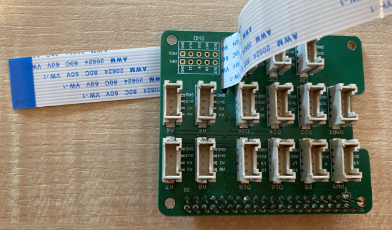

<!--
CO_OP_TRANSLATOR_METADATA:
{
  "original_hash": "c677667095f6133eee418c7e53615d05",
  "translation_date": "2025-08-28T08:40:51+00:00",
  "source_file": "4-manufacturing/lessons/2-check-fruit-from-device/pi-camera.md",
  "language_code": "sk"
}
-->
# Zachytenie obrázku - Raspberry Pi

V tejto časti lekcie pridáte k Raspberry Pi kamerový senzor a budete z neho čítať obrázky.

## Hardvér

Raspberry Pi potrebuje kameru.

Kamera, ktorú budete používať, je [Raspberry Pi Camera Module](https://www.raspberrypi.org/products/camera-module-v2/). Táto kamera je navrhnutá tak, aby fungovala s Raspberry Pi a pripája sa cez dedikovaný konektor na Pi.

> 💁 Táto kamera používa [Camera Serial Interface, protokol od Mobile Industry Processor Interface Alliance](https://wikipedia.org/wiki/Camera_Serial_Interface), známy ako MIPI-CSI. Ide o špeciálny protokol na prenos obrázkov.

## Pripojenie kamery

Kamera sa môže pripojiť k Raspberry Pi pomocou plochého kábla.

### Úloha - pripojenie kamery


1. Vypnite Pi.

1. Pripojte plochý kábel, ktorý je súčasťou kamery, ku kamere. Na to jemne potiahnite čierny plastový klip v držiaku, aby sa trochu uvoľnil, potom zasuňte kábel do zásuvky tak, aby modrá strana smerovala od objektívu a kovové kontakty smerovali k objektívu. Keď je kábel úplne zasunutý, zatlačte čierny plastový klip späť na miesto.

    Animáciu, ktorá ukazuje, ako otvoriť klip a zasunúť kábel, nájdete v [dokumentácii Raspberry Pi Začíname s kamerovým modulom](https://projects.raspberrypi.org/en/projects/getting-started-with-picamera/2).

    

1. Odstráňte Grove Base Hat z Pi.

1. Prevlečte plochý kábel cez otvor pre kameru v Grove Base Hat. Uistite sa, že modrá strana kábla smeruje k analógovým portom označeným **A0**, **A1** atď.

    

1. Zasuňte plochý kábel do kamerového portu na Pi. Opäť potiahnite čierny plastový klip nahor, zasuňte kábel a zatlačte klip späť. Modrá strana kábla by mala smerovať k USB a ethernetovým portom.

    

1. Znovu pripevnite Grove Base Hat.

## Programovanie kamery

Raspberry Pi teraz môže byť naprogramované na používanie kamery pomocou Python knižnice [PiCamera](https://pypi.org/project/picamera/).

### Úloha - povolenie režimu starej kamery

Bohužiaľ, s vydaním Raspberry Pi OS Bullseye sa zmenil softvér kamery, ktorý bol súčasťou OS, čo znamená, že PiCamera už predvolene nefunguje. Pracuje sa na náhrade, nazvanej PiCamera2, ale tá zatiaľ nie je pripravená na použitie.

Zatiaľ môžete nastaviť Pi do režimu starej kamery, aby PiCamera fungovala. Kamerový port je tiež predvolene vypnutý, ale zapnutie starého softvéru kamery automaticky aktivuje port.

1. Zapnite Pi a počkajte, kým sa spustí.

1. Spustite VS Code, buď priamo na Pi, alebo sa pripojte cez rozšírenie Remote SSH.

1. Spustite nasledujúce príkazy z terminálu:

    ```sh
    sudo raspi-config nonint do_legacy 0
    sudo reboot
    ```

    Týmto sa aktivuje nastavenie na povolenie starého softvéru kamery a následne sa Pi reštartuje, aby sa nastavenie prejavilo.

1. Počkajte, kým sa Pi reštartuje, a potom znova spustite VS Code.

### Úloha - programovanie kamery

Napíšte program pre zariadenie.

1. Z terminálu vytvorte nový priečinok v domovskom adresári používateľa `pi` s názvom `fruit-quality-detector`. V tomto priečinku vytvorte súbor s názvom `app.py`.

1. Otvorte tento priečinok vo VS Code.

1. Na interakciu s kamerou môžete použiť Python knižnicu PiCamera. Nainštalujte balík Pip pre túto knižnicu pomocou nasledujúceho príkazu:

    ```sh
    pip3 install picamera
    ```

1. Pridajte nasledujúci kód do súboru `app.py`:

    ```python
    import io
    import time
    from picamera import PiCamera
    ```

    Tento kód importuje potrebné knižnice vrátane knižnice `PiCamera`.

1. Pridajte nasledujúci kód pod tento na inicializáciu kamery:

    ```python
    camera = PiCamera()
    camera.resolution = (640, 480)
    camera.rotation = 0
    
    time.sleep(2)
    ```

    Tento kód vytvorí objekt PiCamera, nastaví rozlíšenie na 640x480. Aj keď sú podporované vyššie rozlíšenia (až do 3280x2464), klasifikátor obrázkov pracuje s oveľa menšími obrázkami (227x227), takže nie je potrebné zachytávať a posielať väčšie obrázky.

    Riadok `camera.rotation = 0` nastavuje rotáciu obrázku. Plochý kábel vstupuje do spodnej časti kamery, ale ak bola vaša kamera otočená, aby lepšie smerovala na objekt, ktorý chcete klasifikovať, môžete tento riadok zmeniť na počet stupňov rotácie.

    

    Napríklad, ak zavesíte plochý kábel nad niečo tak, že je na vrchu kamery, nastavte rotáciu na 180:

    ```python
    camera.rotation = 180
    ```

    Kamera potrebuje niekoľko sekúnd na spustenie, preto je tu riadok `time.sleep(2)`.

1. Pridajte nasledujúci kód pod tento na zachytenie obrázku ako binárnych dát:

    ```python
    image = io.BytesIO()
    camera.capture(image, 'jpeg')
    image.seek(0)
    ```

    Tento kód vytvorí objekt `BytesIO` na ukladanie binárnych dát. Obrázok sa číta z kamery ako súbor JPEG a ukladá sa do tohto objektu. Tento objekt má indikátor pozície, ktorý ukazuje, kde sa nachádza v dátach, aby sa mohli zapisovať ďalšie dáta na koniec, takže riadok `image.seek(0)` presunie túto pozíciu späť na začiatok, aby sa mohli neskôr prečítať všetky dáta.

1. Pod tento kód pridajte nasledujúci na uloženie obrázku do súboru:

    ```python
    with open('image.jpg', 'wb') as image_file:
        image_file.write(image.read())
    ```

    Tento kód otvorí súbor s názvom `image.jpg` na zápis, potom prečíta všetky dáta z objektu `BytesIO` a zapíše ich do súboru.

    > 💁 Obrázok môžete zachytiť priamo do súboru namiesto objektu `BytesIO` tým, že názov súboru zadáte do volania `camera.capture`. Dôvodom použitia objektu `BytesIO` je, že neskôr v tejto lekcii môžete obrázok poslať do klasifikátora obrázkov.

1. Namierte kameru na niečo a spustite tento kód.

1. Obrázok bude zachytený a uložený ako `image.jpg` v aktuálnom priečinku. Tento súbor uvidíte v prieskumníku VS Code. Vyberte súbor na zobrazenie obrázku. Ak je potrebné rotáciu upraviť, aktualizujte riadok `camera.rotation = 0` podľa potreby a urobte ďalšiu fotografiu.

> 💁 Tento kód nájdete v priečinku [code-camera/pi](../../../../../4-manufacturing/lessons/2-check-fruit-from-device/code-camera/pi).

😀 Programovanie kamery bolo úspešné!

---

**Upozornenie**:  
Tento dokument bol preložený pomocou služby na automatický preklad [Co-op Translator](https://github.com/Azure/co-op-translator). Hoci sa snažíme o presnosť, upozorňujeme, že automatické preklady môžu obsahovať chyby alebo nepresnosti. Pôvodný dokument v jeho pôvodnom jazyku by mal byť považovaný za autoritatívny zdroj. Pre kritické informácie sa odporúča profesionálny ľudský preklad. Nenesieme zodpovednosť za akékoľvek nedorozumenia alebo nesprávne interpretácie vyplývajúce z použitia tohto prekladu.