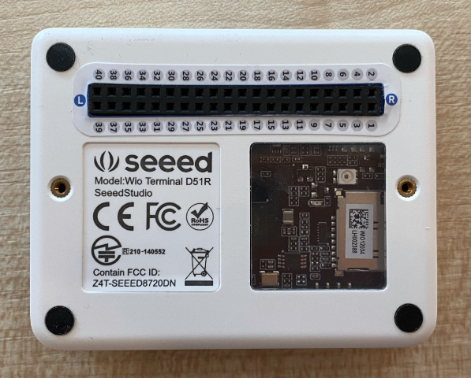

<!--
CO_OP_TRANSLATOR_METADATA:
{
  "original_hash": "160be8c0f558687f6686dca64f10f739",
  "translation_date": "2025-08-28T08:44:12+00:00",
  "source_file": "4-manufacturing/lessons/2-check-fruit-from-device/wio-terminal-camera.md",
  "language_code": "sk"
}
-->
# Zachytenie obrázku - Wio Terminal

V tejto časti lekcie pridáte kameru k vášmu Wio Terminalu a zachytíte z nej obrázky.

## Hardvér

Wio Terminal potrebuje kameru.

Kamera, ktorú použijete, je [ArduCam Mini 2MP Plus](https://www.arducam.com/product/arducam-2mp-spi-camera-b0067-arduino/). Ide o 2-megapixelovú kameru založenú na obrazovom senzore OV2640. Komunikuje cez SPI rozhranie na zachytávanie obrázkov a používa I2C na konfiguráciu senzora.

## Pripojenie kamery

ArduCam nemá Grove konektor, namiesto toho sa pripája k SPI a I2C zberniciam cez GPIO piny na Wio Terminale.

### Úloha - pripojenie kamery

Pripojte kameru.


1. Piny na spodnej strane ArduCam musia byť pripojené k GPIO pinom na Wio Terminale. Aby ste ľahšie našli správne piny, pripevnite nálepku s označením GPIO pinov, ktorá je súčasťou Wio Terminalu, okolo pinov:

    

1. Pomocou prepojovacích káblov vytvorte nasledujúce pripojenia:

    | Pin ArduCAM | Pin Wio Terminal | Popis                                   |
    | ----------- | ---------------- | --------------------------------------- |
    | CS          | 24 (SPI_CS)      | SPI Chip Select                         |
    | MOSI        | 19 (SPI_MOSI)    | SPI Controller Output, Peripheral Input |
    | MISO        | 21 (SPI_MISO)    | SPI Controller Input, Peripheral Output |
    | SCK         | 23 (SPI_SCLK)    | SPI Serial Clock                        |
    | GND         | 6 (GND)          | Zem - 0V                                |
    | VCC         | 4 (5V)           | 5V napájanie                            |
    | SDA         | 3 (I2C1_SDA)     | I2C Sériové Dáta                        |
    | SCL         | 5 (I2C1_SCL)     | I2C Sériový Hodinový Signál             |

    

    Pripojenia GND a VCC poskytujú 5V napájanie pre ArduCam. Kamera funguje na 5V, na rozdiel od Grove senzorov, ktoré fungujú na 3V. Toto napájanie pochádza priamo z USB-C pripojenia, ktoré napája zariadenie.

    > 💁 Pre SPI pripojenie označenia pinov na ArduCam a názvy pinov Wio Terminalu používané v kóde stále používajú starú konvenciu pomenovania. Pokyny v tejto lekcii budú používať novú konvenciu pomenovania, okrem prípadov, keď sa názvy pinov používajú v kóde.

1. Teraz môžete pripojiť Wio Terminal k vášmu počítaču.

## Naprogramovanie zariadenia na pripojenie ku kamere

Wio Terminal teraz môže byť naprogramovaný na použitie pripojenej kamery ArduCAM.

### Úloha - naprogramovanie zariadenia na pripojenie ku kamere

1. Vytvorte nový projekt pre Wio Terminal pomocou PlatformIO. Nazvite tento projekt `fruit-quality-detector`. Pridajte kód do funkcie `setup` na konfiguráciu sériového portu.

1. Pridajte kód na pripojenie k WiFi s vašimi WiFi prihlasovacími údajmi v súbore nazvanom `config.h`. Nezabudnite pridať potrebné knižnice do súboru `platformio.ini`.

1. Knižnica ArduCam nie je dostupná ako Arduino knižnica, ktorú je možné nainštalovať zo súboru `platformio.ini`. Namiesto toho ju bude potrebné nainštalovať zo zdroja z ich GitHub stránky. Môžete ju získať buď:

    * Klonovaním repozitára z [https://github.com/ArduCAM/Arduino.git](https://github.com/ArduCAM/Arduino.git)
    * Navštívením repozitára na GitHube na [github.com/ArduCAM/Arduino](https://github.com/ArduCAM/Arduino) a stiahnutím kódu ako zip zo **Code** tlačidla

1. Potrebujete iba priečinok `ArduCAM` z tohto kódu. Skopírujte celý priečinok do priečinka `lib` vo vašom projekte.

    > ⚠️ Celý priečinok musí byť skopírovaný, takže kód bude v `lib/ArduCam`. Nekopírujte iba obsah priečinka `ArduCam` do priečinka `lib`, skopírujte celý priečinok.

1. Kód knižnice ArduCam funguje pre viacero typov kamier. Typ kamery, ktorú chcete použiť, je nakonfigurovaný pomocou prekladačových vlajok - to udržuje zostavenú knižnicu čo najmenšiu odstránením kódu pre kamery, ktoré nepoužívate. Na konfiguráciu knižnice pre kameru OV2640 pridajte nasledujúce na koniec súboru `platformio.ini`:

    ```ini
    build_flags =
        -DARDUCAM_SHIELD_V2
        -DOV2640_CAM
    ```

    Toto nastavuje 2 prekladačové vlajky:

      * `ARDUCAM_SHIELD_V2` na informovanie knižnice, že kamera je na Arduino doske, známej ako shield.
      * `OV2640_CAM` na informovanie knižnice, aby zahrnula iba kód pre kameru OV2640.

1. Pridajte hlavičkový súbor do priečinka `src` nazvaný `camera.h`. Tento súbor bude obsahovať kód na komunikáciu s kamerou. Pridajte do tohto súboru nasledujúci kód:

    ```cpp
    #pragma once
    
    #include <ArduCAM.h>
    #include <Wire.h>
    
    class Camera
    {
    public:
        Camera(int format, int image_size) : _arducam(OV2640, PIN_SPI_SS)
        {
            _format = format;
            _image_size = image_size;
        }
    
        bool init()
        {
            // Reset the CPLD
            _arducam.write_reg(0x07, 0x80);
            delay(100);
    
            _arducam.write_reg(0x07, 0x00);
            delay(100);
    
            // Check if the ArduCAM SPI bus is OK
            _arducam.write_reg(ARDUCHIP_TEST1, 0x55);
            if (_arducam.read_reg(ARDUCHIP_TEST1) != 0x55)
            {
                return false;
            }
                
            // Change MCU mode
            _arducam.set_mode(MCU2LCD_MODE);
    
            uint8_t vid, pid;
    
            // Check if the camera module type is OV2640
            _arducam.wrSensorReg8_8(0xff, 0x01);
            _arducam.rdSensorReg8_8(OV2640_CHIPID_HIGH, &vid);
            _arducam.rdSensorReg8_8(OV2640_CHIPID_LOW, &pid);
            if ((vid != 0x26) && ((pid != 0x41) || (pid != 0x42)))
            {
                return false;
            }
            
            _arducam.set_format(_format);
            _arducam.InitCAM();
            _arducam.OV2640_set_JPEG_size(_image_size);
            _arducam.OV2640_set_Light_Mode(Auto);
            _arducam.OV2640_set_Special_effects(Normal);
            delay(1000);
    
            return true;
        }
    
        void startCapture()
        {
            _arducam.flush_fifo();
            _arducam.clear_fifo_flag();
            _arducam.start_capture();
        }
    
        bool captureReady()
        {
            return _arducam.get_bit(ARDUCHIP_TRIG, CAP_DONE_MASK);
        }
    
        bool readImageToBuffer(byte **buffer, uint32_t &buffer_length)
        {
            if (!captureReady()) return false;
    
            // Get the image file length
            uint32_t length = _arducam.read_fifo_length();
            buffer_length = length;
    
            if (length >= MAX_FIFO_SIZE)
            {
                return false;
            }
            if (length == 0)
            {
                return false;
            }
    
            // create the buffer
            byte *buf = new byte[length];
    
            uint8_t temp = 0, temp_last = 0;
            int i = 0;
            uint32_t buffer_pos = 0;
            bool is_header = false;
    
            _arducam.CS_LOW();
            _arducam.set_fifo_burst();
            
            while (length--)
            {
                temp_last = temp;
                temp = SPI.transfer(0x00);
                //Read JPEG data from FIFO
                if ((temp == 0xD9) && (temp_last == 0xFF)) //If find the end ,break while,
                {
                    buf[buffer_pos] = temp;
    
                    buffer_pos++;
                    i++;
                    
                    _arducam.CS_HIGH();
                }
                if (is_header == true)
                {
                    //Write image data to buffer if not full
                    if (i < 256)
                    {
                        buf[buffer_pos] = temp;
                        buffer_pos++;
                        i++;
                    }
                    else
                    {
                        _arducam.CS_HIGH();
    
                        i = 0;
                        buf[buffer_pos] = temp;
    
                        buffer_pos++;
                        i++;
    
                        _arducam.CS_LOW();
                        _arducam.set_fifo_burst();
                    }
                }
                else if ((temp == 0xD8) & (temp_last == 0xFF))
                {
                    is_header = true;
    
                    buf[buffer_pos] = temp_last;
                    buffer_pos++;
                    i++;
    
                    buf[buffer_pos] = temp;
                    buffer_pos++;
                    i++;
                }
            }
            
            _arducam.clear_fifo_flag();
    
            _arducam.set_format(_format);
            _arducam.InitCAM();
            _arducam.OV2640_set_JPEG_size(_image_size);
    
            // return the buffer
            *buffer = buf;
        }
    
    private:
        ArduCAM _arducam;
        int _format;
        int _image_size;
    };
    ```

    Toto je nízkoúrovňový kód, ktorý konfiguruje kameru pomocou knižníc ArduCam a extrahuje obrázky, keď je to potrebné, pomocou SPI zbernice. Tento kód je veľmi špecifický pre ArduCam, takže sa nemusíte obávať, ako presne funguje.

1. V `main.cpp` pridajte nasledujúci kód pod ostatné `include` vyhlásenia na zahrnutie tohto nového súboru a vytvorenie inštancie triedy kamery:

    ```cpp
    #include "camera.h"

    Camera camera = Camera(JPEG, OV2640_640x480);
    ```

    Toto vytvára `Camera`, ktorá ukladá obrázky ako JPEGy s rozlíšením 640 x 480. Hoci sú podporované vyššie rozlíšenia (až 3280x2464), klasifikátor obrázkov pracuje s oveľa menšími obrázkami (227x227), takže nie je potrebné zachytávať a odosielať väčšie obrázky.

1. Pridajte nasledujúci kód pod tento na definovanie funkcie na nastavenie kamery:

    ```cpp
    void setupCamera()
    {
        pinMode(PIN_SPI_SS, OUTPUT);
        digitalWrite(PIN_SPI_SS, HIGH);
    
        Wire.begin();
        SPI.begin();
    
        if (!camera.init())
        {
            Serial.println("Error setting up the camera!");
        }
    }
    ```

    Funkcia `setupCamera` začína konfiguráciou SPI čipového výberového pinu (`PIN_SPI_SS`) ako vysokého, čím sa Wio Terminal stáva SPI kontrolérom. Potom spustí I2C a SPI zbernice. Nakoniec inicializuje triedu kamery, ktorá konfiguruje nastavenia senzora kamery a zabezpečuje, že všetko je správne zapojené.

1. Zavolajte túto funkciu na konci funkcie `setup`:

    ```cpp
    setupCamera();
    ```

1. Zostavte a nahrajte tento kód a skontrolujte výstup zo sériového monitora. Ak vidíte `Error setting up the camera!`, skontrolujte zapojenie, aby ste sa uistili, že všetky káble spájajú správne piny na ArduCam so správnymi GPIO pinmi na Wio Terminale a že všetky prepojovacie káble sú správne zasunuté.

## Zachytenie obrázku

Wio Terminal teraz môže byť naprogramovaný na zachytenie obrázku po stlačení tlačidla.

### Úloha - zachytenie obrázku

1. Mikrokontroléry spúšťajú váš kód nepretržite, takže nie je jednoduché spustiť niečo ako fotografovanie bez reakcie na senzor. Wio Terminal má tlačidlá, takže kamera môže byť nastavená tak, aby bola spustená jedným z tlačidiel. Pridajte nasledujúci kód na koniec funkcie `setup` na konfiguráciu tlačidla C (jedno z troch tlačidiel na vrchu, to najbližšie k vypínaču).

    

    ```cpp
    pinMode(WIO_KEY_C, INPUT_PULLUP);
    ```

    Režim `INPUT_PULLUP` v podstate invertuje vstup. Napríklad, normálne by tlačidlo posielalo nízky signál, keď nie je stlačené, a vysoký signál, keď je stlačené. Keď je nastavené na `INPUT_PULLUP`, posiela vysoký signál, keď nie je stlačené, a nízky signál, keď je stlačené.

1. Pridajte prázdnu funkciu na reakciu na stlačenie tlačidla pred funkciou `loop`:

    ```cpp
    void buttonPressed()
    {
        
    }
    ```

1. Zavolajte túto funkciu vo funkcii `loop`, keď je tlačidlo stlačené:

    ```cpp
    void loop()
    {
        if (digitalRead(WIO_KEY_C) == LOW)
        {
            buttonPressed();
            delay(2000);
        }
    
        delay(200);
    }
    ```

    Tento kód kontroluje, či je tlačidlo stlačené. Ak je stlačené, zavolá sa funkcia `buttonPressed` a cyklus sa oneskorí o 2 sekundy. Toto je na umožnenie uvoľnenia tlačidla, aby sa dlhé stlačenie nezaregistrovalo dvakrát.

    > 💁 Tlačidlo na Wio Terminale je nastavené na `INPUT_PULLUP`, takže posiela vysoký signál, keď nie je stlačené, a nízky signál, keď je stlačené.

1. Pridajte nasledujúci kód do funkcie `buttonPressed`:

    ```cpp
    camera.startCapture();
 
    while (!camera.captureReady())
        delay(100);

    Serial.println("Image captured");

    byte *buffer;
    uint32_t length;

    if (camera.readImageToBuffer(&buffer, length))
    {
        Serial.print("Image read to buffer with length ");
        Serial.println(length);

        delete(buffer);
    }
    ```

    Tento kód začína zachytávanie kamery volaním `startCapture`. Hardvér kamery nefunguje tak, že vráti dáta, keď ich požadujete, namiesto toho pošlete inštrukciu na začatie zachytávania a kamera bude na pozadí pracovať na zachytení obrázku, jeho konverzii na JPEG a uložení do lokálneho bufferu na samotnej kamere. Volanie `captureReady` potom kontroluje, či sa zachytávanie obrázku dokončilo.

    Keď sa zachytávanie dokončí, obrazové dáta sa skopírujú z bufferu na kamere do lokálneho bufferu (pole bajtov) volaním `readImageToBuffer`. Dĺžka bufferu sa potom odošle na sériový monitor.

1. Zostavte a nahrajte tento kód a skontrolujte výstup na sériovom monitore. Pri každom stlačení tlačidla C sa zachytí obrázok a na sériový monitor sa odošle veľkosť obrázku.

    ```output
    Connecting to WiFi..
    Connected!
    Image captured
    Image read to buffer with length 9224
    Image captured
    Image read to buffer with length 11272
    ```

    Rôzne obrázky budú mať rôzne veľkosti. Sú komprimované ako JPEGy a veľkosť JPEG súboru pre dané rozlíšenie závisí od toho, čo je na obrázku.

> 💁 Tento kód nájdete v priečinku [code-camera/wio-terminal](../../../../../4-manufacturing/lessons/2-check-fruit-from-device/code-camera/wio-terminal).

😀 Úspešne ste zachytili obrázky pomocou vášho Wio Terminalu.

## Voliteľné - overenie obrázkov kamery pomocou SD karty

Najjednoduchší spôsob, ako si pozrieť obrázky zachytené kamerou, je zapísať ich na SD kartu vo Wio Terminale a potom si ich pozrieť na vašom počítači. Urobte tento krok, ak máte voľnú microSD kartu a microSD slot vo vašom počítači alebo adaptér.

Wio Terminal podporuje iba microSD karty s kapacitou do 16 GB. Ak máte väčšiu SD kartu, nebude fungovať.

### Úloha - overenie obrázkov kamery pomocou SD karty

1. Naformátujte microSD kartu ako FAT32 alebo exFAT pomocou príslušných aplikácií na vašom počítači (Disk Utility na macOS, File Explorer na Windows alebo pomocou príkazových nástrojov v Linuxe).

1. Vložte microSD kartu do slotu tesne pod vypínačom. Uistite sa, že je úplne zasunutá, až kým nezacvakne a nezostane na mieste. Možno budete musieť použiť necht alebo tenký nástroj.

1. Pridajte nasledujúce `include` vyhlásenia na začiatok súboru `main.cpp`:

    ```cpp
    #include "SD/Seeed_SD.h"
    #include <Seeed_FS.h>
    ```

1. Pridajte nasledujúcu funkciu pred funkciu `setup`:

    ```cpp
    void setupSDCard()
    {
        while (!SD.begin(SDCARD_SS_PIN, SDCARD_SPI))
        {
            Serial.println("SD Card Error");
        }
    }
    ```

    Táto funkcia konfiguruje SD kartu pomocou SPI zbernice.

1. Zavolajte túto funkciu z funkcie `setup`:

    ```cpp
    setupSDCard();
    ```

1. Pridajte nasledujúci kód nad funkciu `buttonPressed`:

    ```cpp
    int fileNum = 1;

    void saveToSDCard(byte *buffer, uint32_t length)
    {
        char buff[16];
        sprintf(buff, "%d.jpg", fileNum);
        fileNum++;
    
        File outFile = SD.open(buff, FILE_WRITE );
        outFile.write(buffer, length);
        outFile.close();

        Serial.print("Image written to file ");
        Serial.println(buff);
    }
    ```

    Toto definuje globálnu premennú pre počet súborov. Táto premenná sa používa pre názvy súborov obrázkov, takže je možné zachytiť viacero obrázkov s narastajúcimi názvami súborov - `1.jpg`, `2.jpg` a tak ďalej.

    Potom definuje funkciu `saveToSDCard`, ktorá prijíma buffer bajtových dát a dĺžku bufferu. Vytvorí sa názov súboru pomocou počtu súborov a počet súborov sa zvýši pre ďalší súbor. Binárne dáta z bufferu sa potom zapíšu do súboru.

1. Zavolajte funkciu `saveToSDCard` z funkcie `buttonPressed`. Volanie by malo byť **predtým**, ako sa buffer vymaže:

    ```cpp
    Serial.print("Image read to buffer with length ");
    Serial.println(length);

    saveToSDCard(buffer, length);
    
    delete(buffer);
    ```

1. Zostavte a nahrajte tento kód a skontrolujte výstup na sériovom monitore. Pri každom stlačení tlačidla C sa zachytí obrázok a uloží sa na SD kartu.

    ```output
    Connecting to WiFi..
    Connected!
    Image captured
    Image read to buffer with length 16392
    Image written to file 1.jpg
    Image captured
    Image read to buffer with length 14344
    Image written to file 2.jpg
    ```

1. Vypnite microSD kartu a vysuňte ju jemným zatlačením a uvoľnením, čím sa vysunie. Možno budete musieť použiť tenký nástroj. Pripojte microSD kartu k vášmu počítaču, aby ste si mohli pozrieť obrázky.

    
💁 Môže to trvať niekoľko snímok, kým sa vyváženie bielej farby na kamere samo nastaví. Všimnete si to na základe farby zachytených snímok, prvé môžu vyzerať farebne nesprávne. Toto môžete vždy obísť zmenou kódu tak, aby zachytil niekoľko snímok, ktoré sa ignorujú vo funkcii `setup`.


---

**Upozornenie**:  
Tento dokument bol preložený pomocou služby na automatický preklad [Co-op Translator](https://github.com/Azure/co-op-translator). Hoci sa snažíme o presnosť, upozorňujeme, že automatické preklady môžu obsahovať chyby alebo nepresnosti. Pôvodný dokument v jeho pôvodnom jazyku by mal byť považovaný za autoritatívny zdroj. Pre kritické informácie sa odporúča profesionálny ľudský preklad. Nezodpovedáme za žiadne nedorozumenia alebo nesprávne interpretácie vyplývajúce z použitia tohto prekladu.