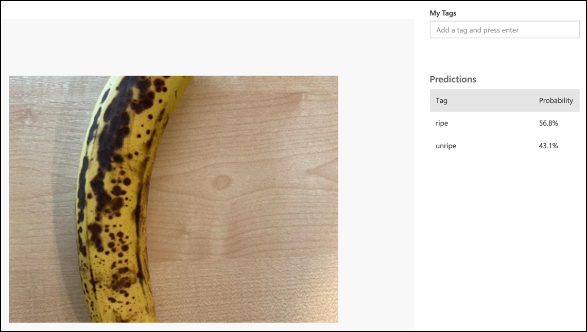

<!--
CO_OP_TRANSLATOR_METADATA:
{
  "original_hash": "32a1f23e7834fbe7715da8c4ebb450b9",
  "translation_date": "2025-08-28T08:48:46+00:00",
  "source_file": "4-manufacturing/lessons/2-check-fruit-from-device/wio-terminal-classify-image.md",
  "language_code": "sk"
}
-->
# Klasifik치cia obr치zku - Wio Terminal

V tejto 캜asti lekcie po코lete obr치zok zachyten칳 kamerou do slu쬭y Custom Vision, aby ste ho klasifikovali.

## Klasifik치cia obr치zku

Slu쬭a Custom Vision m치 REST API, ktor칠 m칪쬰te vola콘 z Wio Terminal na klasifik치ciu obr치zkov. Toto REST API je pr칤stupn칠 cez HTTPS pripojenie - zabezpe캜en칠 HTTP pripojenie.

Pri interakcii s HTTPS koncov칳mi bodmi mus칤 klientsk칳 k칩d po쬴ada콘 o verejn칳 certifik치t od servera, ku ktor칠mu sa prip치ja, a pou쬴콘 ho na 코ifrovanie odosielanej komunik치cie. V치코 webov칳 prehliada캜 to rob칤 automaticky, ale mikrokontrol칠ry nie. Certifik치t budete musie콘 po쬴ada콘 manu치lne a pou쬴콘 ho na vytvorenie zabezpe캜en칠ho pripojenia k REST API. Tieto certifik치ty sa nemenia, tak쬰 akon치hle m치te certifik치t, m칪쬰te ho pevne zak칩dova콘 vo svojej aplik치cii.

Tieto certifik치ty obsahuj칰 verejn칠 k쮂줷껸 a nemusia by콘 uchov치van칠 v bezpe캜칤. M칪쬰te ich pou쬴콘 vo svojom zdrojovom k칩de a zdie쬬콘 ich verejne na miestach ako GitHub.

### 칔loha - nastavenie SSL klienta

1. Otvorte projekt aplik치cie `fruit-quality-detector`, ak u nie je otvoren칳.

1. Otvorte hlavi캜kov칳 s칰bor `config.h` a pridajte nasleduj칰ce:

    ```cpp
    const char *CERTIFICATE =
        "-----BEGIN CERTIFICATE-----\r\n"
        "MIIF8zCCBNugAwIBAgIQAueRcfuAIek/4tmDg0xQwDANBgkqhkiG9w0BAQwFADBh\r\n"
        "MQswCQYDVQQGEwJVUzEVMBMGA1UEChMMRGlnaUNlcnQgSW5jMRkwFwYDVQQLExB3\r\n"
        "d3cuZGlnaWNlcnQuY29tMSAwHgYDVQQDExdEaWdpQ2VydCBHbG9iYWwgUm9vdCBH\r\n"
        "MjAeFw0yMDA3MjkxMjMwMDBaFw0yNDA2MjcyMzU5NTlaMFkxCzAJBgNVBAYTAlVT\r\n"
        "MR4wHAYDVQQKExVNaWNyb3NvZnQgQ29ycG9yYXRpb24xKjAoBgNVBAMTIU1pY3Jv\r\n"
        "c29mdCBBenVyZSBUTFMgSXNzdWluZyBDQSAwNjCCAiIwDQYJKoZIhvcNAQEBBQAD\r\n"
        "ggIPADCCAgoCggIBALVGARl56bx3KBUSGuPc4H5uoNFkFH4e7pvTCxRi4j/+z+Xb\r\n"
        "wjEz+5CipDOqjx9/jWjskL5dk7PaQkzItidsAAnDCW1leZBOIi68Lff1bjTeZgMY\r\n"
        "iwdRd3Y39b/lcGpiuP2d23W95YHkMMT8IlWosYIX0f4kYb62rphyfnAjYb/4Od99\r\n"
        "ThnhlAxGtfvSbXcBVIKCYfZgqRvV+5lReUnd1aNjRYVzPOoifgSx2fRyy1+pO1Uz\r\n"
        "aMMNnIOE71bVYW0A1hr19w7kOb0KkJXoALTDDj1ukUEDqQuBfBxReL5mXiu1O7WG\r\n"
        "0vltg0VZ/SZzctBsdBlx1BkmWYBW261KZgBivrql5ELTKKd8qgtHcLQA5fl6JB0Q\r\n"
        "gs5XDaWehN86Gps5JW8ArjGtjcWAIP+X8CQaWfaCnuRm6Bk/03PQWhgdi84qwA0s\r\n"
        "sRfFJwHUPTNSnE8EiGVk2frt0u8PG1pwSQsFuNJfcYIHEv1vOzP7uEOuDydsmCjh\r\n"
        "lxuoK2n5/2aVR3BMTu+p4+gl8alXoBycyLmj3J/PUgqD8SL5fTCUegGsdia/Sa60\r\n"
        "N2oV7vQ17wjMN+LXa2rjj/b4ZlZgXVojDmAjDwIRdDUujQu0RVsJqFLMzSIHpp2C\r\n"
        "Zp7mIoLrySay2YYBu7SiNwL95X6He2kS8eefBBHjzwW/9FxGqry57i71c2cDAgMB\r\n"
        "AAGjggGtMIIBqTAdBgNVHQ4EFgQU1cFnOsKjnfR3UltZEjgp5lVou6UwHwYDVR0j\r\n"
        "BBgwFoAUTiJUIBiV5uNu5g/6+rkS7QYXjzkwDgYDVR0PAQH/BAQDAgGGMB0GA1Ud\r\n"
        "JQQWMBQGCCsGAQUFBwMBBggrBgEFBQcDAjASBgNVHRMBAf8ECDAGAQH/AgEAMHYG\r\n"
        "CCsGAQUFBwEBBGowaDAkBggrBgEFBQcwAYYYaHR0cDovL29jc3AuZGlnaWNlcnQu\r\n"
        "Y29tMEAGCCsGAQUFBzAChjRodHRwOi8vY2FjZXJ0cy5kaWdpY2VydC5jb20vRGln\r\n"
        "aUNlcnRHbG9iYWxSb290RzIuY3J0MHsGA1UdHwR0MHIwN6A1oDOGMWh0dHA6Ly9j\r\n"
        "cmwzLmRpZ2ljZXJ0LmNvbS9EaWdpQ2VydEdsb2JhbFJvb3RHMi5jcmwwN6A1oDOG\r\n"
        "MWh0dHA6Ly9jcmw0LmRpZ2ljZXJ0LmNvbS9EaWdpQ2VydEdsb2JhbFJvb3RHMi5j\r\n"
        "cmwwHQYDVR0gBBYwFDAIBgZngQwBAgEwCAYGZ4EMAQICMBAGCSsGAQQBgjcVAQQD\r\n"
        "AgEAMA0GCSqGSIb3DQEBDAUAA4IBAQB2oWc93fB8esci/8esixj++N22meiGDjgF\r\n"
        "+rA2LUK5IOQOgcUSTGKSqF9lYfAxPjrqPjDCUPHCURv+26ad5P/BYtXtbmtxJWu+\r\n"
        "cS5BhMDPPeG3oPZwXRHBJFAkY4O4AF7RIAAUW6EzDflUoDHKv83zOiPfYGcpHc9s\r\n"
        "kxAInCedk7QSgXvMARjjOqdakor21DTmNIUotxo8kHv5hwRlGhBJwps6fEVi1Bt0\r\n"
        "trpM/3wYxlr473WSPUFZPgP1j519kLpWOJ8z09wxay+Br29irPcBYv0GMXlHqThy\r\n"
        "8y4m/HyTQeI2IMvMrQnwqPpY+rLIXyviI2vLoI+4xKE4Rn38ZZ8m\r\n"
        "-----END CERTIFICATE-----\r\n";
    ```

    Toto je *Microsoft Azure DigiCert Global Root G2 certifik치t* - jeden z certifik치tov pou쮂셨an칳ch mnoh칳mi Azure slu쬭ami glob치lne.

    > 游누 Aby ste videli, 쬰 toto je certifik치t, ktor칳 treba pou쬴콘, spustite nasleduj칰ci pr칤kaz na macOS alebo Linuxe. Ak pou쮂셨ate Windows, m칪쬰te tento pr칤kaz spusti콘 pomocou [Windows Subsystem for Linux (WSL)](https://docs.microsoft.com/windows/wsl/?WT.mc_id=academic-17441-jabenn):
    >
    > ```sh
    > openssl s_client -showcerts -verify 5 -connect api.cognitive.microsoft.com:443
    > ```
    >
    > V칳stup zobraz칤 certifik치t DigiCert Global Root G2.

1. Otvorte `main.cpp` a pridajte nasleduj칰ci direkt칤v pre zahrnutie:

    ```cpp
    #include <WiFiClientSecure.h>
    ```

1. Pod direkt칤vami pre zahrnutie deklarujte in코tanciu `WifiClientSecure`:

    ```cpp
    WiFiClientSecure client;
    ```

    T치to trieda obsahuje k칩d na komunik치ciu s webov칳mi koncov칳mi bodmi cez HTTPS.

1. V met칩de `connectWiFi` nastavte WiFiClientSecure na pou쬴tie certifik치tu DigiCert Global Root G2:

    ```cpp
    client.setCACert(CERTIFICATE);
    ```

### 칔loha - klasifik치cia obr치zku

1. Pridajte nasleduj칰ci riadok do zoznamu `lib_deps` v s칰bore `platformio.ini`:

    ```ini
    bblanchon/ArduinoJson @ 6.17.3
    ```

    T칳mto importujete [ArduinoJson](https://arduinojson.org), kni쬹icu JSON pre Arduino, ktor치 sa pou쬴je na dek칩dovanie JSON odpovede z REST API.

1. V `config.h` pridajte kon코tanty pre URL predikcie a k쮂줷 zo slu쬭y Custom Vision:

    ```cpp
    const char *PREDICTION_URL = "<PREDICTION_URL>";
    const char *PREDICTION_KEY = "<PREDICTION_KEY>";
    ```

    Nahra캞te `<PREDICTION_URL>` URL predikcie zo slu쬭y Custom Vision. Nahra캞te `<PREDICTION_KEY>` k쮂줷 predikcie.

1. V `main.cpp` pridajte direkt칤v pre zahrnutie kni쬹ice ArduinoJson:

    ```cpp
    #include <ArduinoJSON.h>
    ```

1. Pridajte nasleduj칰cu funkciu do `main.cpp`, nad funkciu `buttonPressed`.

    ```cpp
    void classifyImage(byte *buffer, uint32_t length)
    {
        HTTPClient httpClient;
        httpClient.begin(client, PREDICTION_URL);
        httpClient.addHeader("Content-Type", "application/octet-stream");
        httpClient.addHeader("Prediction-Key", PREDICTION_KEY);
    
        int httpResponseCode = httpClient.POST(buffer, length);
    
        if (httpResponseCode == 200)
        {
            String result = httpClient.getString();
    
            DynamicJsonDocument doc(1024);
            deserializeJson(doc, result.c_str());
    
            JsonObject obj = doc.as<JsonObject>();
            JsonArray predictions = obj["predictions"].as<JsonArray>();
    
            for(JsonVariant prediction : predictions) 
            {
                String tag = prediction["tagName"].as<String>();
                float probability = prediction["probability"].as<float>();
    
                char buff[32];
                sprintf(buff, "%s:\t%.2f%%", tag.c_str(), probability * 100.0);
                Serial.println(buff);
            }
        }
    
        httpClient.end();
    }
    ```

    Tento k칩d za캜칤na deklar치ciou `HTTPClient` - triedy, ktor치 obsahuje met칩dy na interakciu s REST API. Potom pripoj칤 klienta k URL predikcie pomocou in코tancie `WiFiClientSecure`, ktor치 bola nastaven치 s verejn칳m k쮂줷꼂m Azure.

    Po pripojen칤 odo코le hlavi캜ky - inform치cie o nadch치dzaj칰cej po쬴adavke, ktor치 bude uroben치 vo캜i REST API. Hlavi캜ka `Content-Type` indikuje, 쬰 API volanie odo코le surov칠 bin치rne d치ta, hlavi캜ka `Prediction-Key` odovzd치va k쮂줷 predikcie zo slu쬭y Custom Vision.

    N치sledne sa vykon치 POST po쬴adavka na HTTP klienta, ktor치 nahr치 bajtov칠 pole. Toto pole bude obsahova콘 JPEG obr치zok zachyten칳 kamerou, ke캞 sa t치to funkcia zavol치.

    > 游누 POST po쬴adavky s칰 ur캜en칠 na odosielanie d치t a z칤skanie odpovede. Existuj칰 aj in칠 typy po쬴adaviek, ako napr칤klad GET po쬴adavky, ktor칠 z칤skavaj칰 d치ta. GET po쬴adavky pou쮂셨a v치코 webov칳 prehliada캜 na na캜칤tanie webov칳ch str치nok.

    POST po쬴adavka vr치ti stavov칳 k칩d odpovede. Tieto hodnoty s칰 dobre definovan칠, pri캜om 200 znamen치 **OK** - POST po쬴adavka bola 칰spe코n치.

    > 游누 V코etky stavov칠 k칩dy odpoved칤 si m칪쬰te pozrie콘 na str치nke [List of HTTP status codes na Wikip칠dii](https://wikipedia.org/wiki/List_of_HTTP_status_codes)

    Ak sa vr치ti 200, v칳sledok sa pre캜칤ta z HTTP klienta. Toto je textov치 odpove캞 z REST API s v칳sledkami predikcie vo forme JSON dokumentu. JSON m치 nasleduj칰ci form치t:

    ```jSON
    {
        "id":"45d614d3-7d6f-47e9-8fa2-04f237366a16",
        "project":"135607e5-efac-4855-8afb-c93af3380531",
        "iteration":"04f1c1fa-11ec-4e59-bb23-4c7aca353665",
        "created":"2021-06-10T17:58:58.959Z",
        "predictions":[
            {
                "probability":0.5582016,
                "tagId":"05a432ea-9718-4098-b14f-5f0688149d64",
                "tagName":"ripe"
            },
            {
                "probability":0.44179836,
                "tagId":"bb091037-16e5-418e-a9ea-31c6a2920f17",
                "tagName":"unripe"
            }
        ]
    }
    ```

    D칪le쬴tou 캜as콘ou je pole `predictions`. Obsahuje predikcie, pri캜om ka쬯치 polo쬶a obsahuje n치zov zna캜ky a pravdepodobnos콘. Pravdepodobnosti s칰 vr치ten칠 ako desatinn칠 캜칤sla od 0 do 1, pri캜om 0 znamen치 0% 코ancu na zhodu so zna캜kou a 1 znamen치 100% 코ancu.

    > 游누 Klasifik치tory obr치zkov vr치tia percent치 pre v코etky zna캜ky, ktor칠 boli pou쬴t칠. Ka쬯치 zna캜ka bude ma콘 pravdepodobnos콘, 쬰 obr치zok zodpoved치 tejto zna캜ke.

    Tento JSON je dek칩dovan칳 a pravdepodobnosti pre ka쬯칰 zna캜ku s칰 odoslan칠 do s칠riov칠ho monitora.

1. Vo funkcii `buttonPressed` bu캞 nahra캞te k칩d, ktor칳 uklad치 na SD kartu, volan칤m `classifyImage`, alebo ho pridajte po tom, ako je obr치zok zap칤san칳, ale **predt칳m**, ako je buffer vymazan칳:

    ```cpp
    classifyImage(buffer, length);
    ```

    > 游누 Ak nahrad칤te k칩d, ktor칳 uklad치 na SD kartu, m칪쬰te vy캜isti콘 svoj k칩d odstr치nen칤m funkci칤 `setupSDCard` a `saveToSDCard`.

1. Nahrajte a spustite svoj k칩d. Namierte kameru na nejak칠 ovocie a stla캜te tla캜idlo C. V칳stup uvid칤te v s칠riovom monitore:

    ```output
    Connecting to WiFi..
    Connected!
    Image captured
    Image read to buffer with length 8200
    ripe:   56.84%
    unripe: 43.16%
    ```

    Budete m칪c콘 vidie콘 obr치zok, ktor칳 bol zachyten칳, a tieto hodnoty na karte **Predictions** v slu쬭e Custom Vision.

    

> 游누 Tento k칩d n치jdete v prie캜inku [code-classify/wio-terminal](../../../../../4-manufacturing/lessons/2-check-fruit-from-device/code-classify/wio-terminal).

游 V치코 program na klasifik치ciu kvality ovocia bol 칰spe코n칳!

---

**Upozornenie**:  
Tento dokument bol prelo쬰n칳 pomocou slu쬭y AI prekladu [Co-op Translator](https://github.com/Azure/co-op-translator). Hoci sa sna쮂셠e o presnos콘, pros칤m, berte na vedomie, 쬰 automatizovan칠 preklady m칪쬿 obsahova콘 chyby alebo nepresnosti. P칪vodn칳 dokument v jeho rodnom jazyku by mal by콘 pova쬺van칳 za autoritat칤vny zdroj. Pre kritick칠 inform치cie sa odpor칰캜a profesion치lny 쬿dsk칳 preklad. Nezodpoved치me za 쬴adne nedorozumenia alebo nespr치vne interpret치cie vypl칳vaj칰ce z pou쬴tia tohto prekladu.