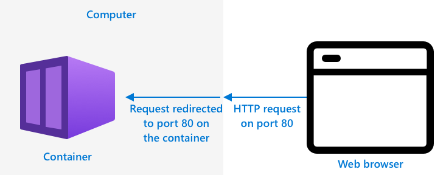

<!--
CO_OP_TRANSLATOR_METADATA:
{
  "original_hash": "2625af24587465c5547ae33d6cc000a5",
  "translation_date": "2025-08-28T08:29:32+00:00",
  "source_file": "4-manufacturing/lessons/3-run-fruit-detector-edge/README.md",
  "language_code": "sk"
}
-->
# Spustite svoj detektor ovocia na okraji siete


> Sketchnote od [Nitya Narasimhan](https://github.com/nitya). Kliknite na obrázok pre väčšiu verziu.

Toto video poskytuje prehľad o spúšťaní klasifikátorov obrázkov na IoT zariadeniach, čo je téma pokrytá v tejto lekcii.

[](https://www.youtube.com/watch?v=_K5fqGLO8us)

## Kvíz pred prednáškou

[Kvíz pred prednáškou](https://black-meadow-040d15503.1.azurestaticapps.net/quiz/33)

## Úvod

V predchádzajúcej lekcii ste použili svoj klasifikátor obrázkov na rozlíšenie zrelého a nezrelého ovocia, pričom ste posielali obrázky zachytené kamerou na vašom IoT zariadení cez internet do cloudovej služby. Tieto volania zaberajú čas, stoja peniaze a v závislosti od typu údajov, ktoré používate, môžu mať dopad na súkromie.

V tejto lekcii sa naučíte, ako spúšťať modely strojového učenia (ML) na okraji siete – na IoT zariadeniach, ktoré bežia vo vašej vlastnej sieti namiesto v cloude. Dozviete sa o výhodách a nevýhodách edge computingu oproti cloud computingu, ako nasadiť váš AI model na okraj siete a ako k nemu pristupovať z vášho IoT zariadenia.

V tejto lekcii pokryjeme:

* [Edge computing](../../../../../4-manufacturing/lessons/3-run-fruit-detector-edge)
* [Azure IoT Edge](../../../../../4-manufacturing/lessons/3-run-fruit-detector-edge)
* [Registrácia IoT Edge zariadenia](../../../../../4-manufacturing/lessons/3-run-fruit-detector-edge)
* [Nastavenie IoT Edge zariadenia](../../../../../4-manufacturing/lessons/3-run-fruit-detector-edge)
* [Export vášho modelu](../../../../../4-manufacturing/lessons/3-run-fruit-detector-edge)
* [Príprava kontajnera na nasadenie](../../../../../4-manufacturing/lessons/3-run-fruit-detector-edge)
* [Nasadenie kontajnera](../../../../../4-manufacturing/lessons/3-run-fruit-detector-edge)
* [Použitie vášho IoT Edge zariadenia](../../../../../4-manufacturing/lessons/3-run-fruit-detector-edge)

## Edge computing

Edge computing zahŕňa spracovanie údajov z IoT zariadení čo najbližšie k miestu, kde sú tieto údaje generované. Namiesto spracovania v cloude sa presúva na okraj cloudu – do vašej internej siete.


V doterajších lekciách ste mali zariadenia, ktoré zhromažďovali údaje a posielali ich do cloudu na analýzu, pričom v cloude bežali serverless funkcie alebo AI modely.


Edge computing zahŕňa presun niektorých cloudových služieb z cloudu na počítače, ktoré bežia v rovnakej sieti ako IoT zariadenia, pričom komunikácia s cloudom prebieha len v prípade potreby. Napríklad môžete spúšťať AI modely na edge zariadeniach na analýzu zrelosti ovocia a do cloudu posielať len analytické údaje, ako je počet zrelých a nezrelých kusov ovocia.

✅ Zamyslite sa nad IoT aplikáciami, ktoré ste doteraz vytvorili. Ktoré ich časti by sa dali presunúť na okraj siete?

### Výhody

Výhody edge computingu sú:

1. **Rýchlosť** – edge computing je ideálny pre časovo citlivé údaje, pretože akcie sa vykonávajú v rovnakej sieti ako zariadenie, namiesto volaní cez internet. To umožňuje vyššie rýchlosti, pretože interné siete môžu bežať podstatne rýchlejšie ako internetové pripojenia, pričom údaje cestujú oveľa kratšiu vzdialenosť.

    > 💁 Napriek tomu, že internetové pripojenia využívajú optické káble, ktoré umožňujú prenos údajov rýchlosťou svetla, prenos údajov po celom svete k poskytovateľom cloudových služieb môže trvať určitý čas. Napríklad, ak posielate údaje z Európy do cloudových služieb v USA, trvá minimálne 28 ms, kým údaje prejdú cez Atlantik v optickom kábli, a to bez započítania času potrebného na prenos údajov do transatlantického kábla, konverziu z elektrických na svetelné signály a späť na druhej strane, a následne z optického kábla do cloudového poskytovateľa.

    Edge computing tiež vyžaduje menej sieťovej prevádzky, čím sa znižuje riziko spomalenia údajov kvôli preťaženiu obmedzenej šírky pásma dostupnej pre internetové pripojenie.

1. **Prístupnosť na diaľku** – edge computing funguje aj pri obmedzenom alebo žiadnom pripojení, alebo ak je pripojenie príliš drahé na nepretržité používanie. Napríklad pri práci v oblastiach postihnutých humanitárnymi katastrofami, kde je infraštruktúra obmedzená, alebo v rozvojových krajinách.

1. **Nižšie náklady** – zhromažďovanie, ukladanie, analýza údajov a spúšťanie akcií na edge zariadení znižuje využívanie cloudových služieb, čo môže znížiť celkové náklady na vašu IoT aplikáciu. V poslednej dobe sa zvýšil počet zariadení navrhnutých pre edge computing, ako sú AI akcelerátory, napríklad [Jetson Nano od NVIDIA](https://developer.nvidia.com/embedded/jetson-nano-developer-kit), ktoré dokážu spúšťať AI úlohy pomocou GPU hardvéru na zariadeniach, ktoré stoja menej ako 100 USD.

1. **Súkromie a bezpečnosť** – pri edge computingu zostávajú údaje vo vašej sieti a nie sú nahrávané do cloudu. To je často preferované pre citlivé a osobne identifikovateľné informácie, najmä preto, že údaje nemusia byť uložené po ich analýze, čo výrazne znižuje riziko úniku údajov. Príklady zahŕňajú lekárske údaje a zábery z bezpečnostných kamier.

1. **Riešenie problémov s nebezpečnými zariadeniami** – ak máte zariadenia so známymi bezpečnostnými chybami, ktoré nechcete pripojiť priamo k vašej sieti alebo internetu, môžete ich pripojiť k samostatnej sieti cez gateway IoT Edge zariadenie. Toto edge zariadenie môže mať tiež pripojenie k vašej širšej sieti alebo internetu a spravovať tok údajov tam a späť.

1. **Podpora nekompatibilných zariadení** – ak máte zariadenia, ktoré sa nemôžu pripojiť k IoT Hub, napríklad zariadenia, ktoré sa môžu pripojiť iba cez HTTP alebo majú iba Bluetooth, môžete použiť IoT Edge zariadenie ako gateway zariadenie, ktoré preposiela správy do IoT Hub.

✅ Urobte si výskum: Aké ďalšie výhody by mohol mať edge computing?

### Nevýhody

Existujú aj nevýhody edge computingu, kde môže byť cloud preferovanou možnosťou:

1. **Škálovateľnosť a flexibilita** – cloud computing sa dokáže prispôsobiť potrebám siete a údajov v reálnom čase pridaním alebo znížením počtu serverov a iných zdrojov. Pridanie ďalších edge počítačov si vyžaduje manuálne pridanie ďalších zariadení.

1. **Spoľahlivosť a odolnosť** – cloud computing poskytuje viacero serverov, často na viacerých miestach, pre redundanciu a obnovu po havárii. Dosiahnutie rovnakej úrovne redundancie na okraji siete si vyžaduje veľké investície a veľa konfiguračnej práce.

1. **Údržba** – poskytovatelia cloudových služieb zabezpečujú údržbu a aktualizácie systému.

✅ Urobte si výskum: Aké ďalšie nevýhody by mohol mať edge computing?

Nevýhody sú v podstate opakom výhod používania cloudu – musíte tieto zariadenia budovať a spravovať sami, namiesto toho, aby ste sa spoliehali na odborné znalosti a škálovateľnosť poskytovateľov cloudu.

Niektoré riziká sú zmiernené samotnou povahou edge computingu. Napríklad, ak máte edge zariadenie bežiace vo fabrike, ktoré zhromažďuje údaje zo strojov, nemusíte myslieť na niektoré scenáre obnovy po havárii. Ak v továrni vypadne elektrina, nepotrebujete záložné edge zariadenie, pretože stroje, ktoré generujú údaje, ktoré edge zariadenie spracováva, budú tiež bez elektriny.

Pre IoT systémy často budete chcieť kombináciu cloudového a edge computingu, pričom využijete každú službu na základe potrieb systému, jeho zákazníkov a jeho správcov.

## Azure IoT Edge


Azure IoT Edge je služba, ktorá vám môže pomôcť presunúť pracovné zaťaženia z cloudu na okraj siete. Nastavíte zariadenie ako edge zariadenie a z cloudu môžete na toto edge zariadenie nasadiť kód. To vám umožňuje kombinovať schopnosti cloudu a okraja siete.

> 🎓 *Pracovné zaťaženia* je termín pre akúkoľvek službu, ktorá vykonáva určitú prácu, ako sú AI modely, aplikácie alebo serverless funkcie.

Napríklad môžete trénovať klasifikátor obrázkov v cloude a potom ho z cloudu nasadiť na edge zariadenie. Vaše IoT zariadenie potom posiela obrázky na edge zariadenie na klasifikáciu, namiesto toho, aby ich posielalo cez internet. Ak potrebujete nasadiť novú iteráciu modelu, môžete ho trénovať v cloude a pomocou IoT Edge aktualizovať model na edge zariadení na novú iteráciu.

> 🎓 Softvér nasadený na IoT Edge je známy ako *moduly*. Predvolene IoT Edge spúšťa moduly, ktoré komunikujú s IoT Hub, ako sú moduly `edgeAgent` a `edgeHub`. Keď nasadíte klasifikátor obrázkov, je nasadený ako ďalší modul.

IoT Edge je zabudovaný do IoT Hub, takže môžete spravovať edge zariadenia pomocou tej istej služby, ktorú by ste použili na správu IoT zariadení, s rovnakou úrovňou zabezpečenia.

IoT Edge spúšťa kód z *kontajnerov* – samostatných aplikácií, ktoré bežia izolovane od zvyšku aplikácií na vašom počítači. Keď spustíte kontajner, správa sa ako samostatný počítač bežiaci vo vašom počítači, s vlastným softvérom, službami a aplikáciami. Väčšinu času kontajnery nemajú prístup k ničomu na vašom počítači, pokiaľ sa nerozhodnete zdieľať napríklad priečinok s kontajnerom. Kontajner potom poskytuje služby cez otvorený port, ku ktorému sa môžete pripojiť alebo ho sprístupniť vo vašej sieti.



Napríklad môžete mať kontajner s webovou stránkou bežiacou na porte 80, čo je predvolený HTTP port, a môžete ho potom sprístupniť z vášho počítača tiež na porte 80.

✅ Urobte si výskum: Prečítajte si o kontajneroch a službách, ako sú Docker alebo Moby.

Custom Vision môžete použiť na stiahnutie klasifikátorov obrázkov a ich nasadenie ako kontajnerov, buď priamo na zariadenie alebo prostredníctvom IoT Edge. Keď bežia v kontajneri, môžete k nim pristupovať pomocou rovnakého REST API ako k cloudovej verzii, ale s endpointom smerujúcim na edge zariadenie, ktoré spúšťa kontajner.

## Registrácia IoT Edge zariadenia

Aby ste mohli používať IoT Edge zariadenie, musí byť zaregistrované v IoT Hub.

### Úloha – registrácia IoT Edge zariadenia

1. Vytvorte IoT Hub v resource skupine `fruit-quality-detector`. Dajte mu jedinečný názov založený na `fruit-quality-detector`.

1. Zaregistrujte IoT Edge zariadenie s názvom `fruit-quality-detector-edge` vo vašom IoT Hub. Príkaz na to je podobný príkazu na registráciu ne-edge zariadenia, okrem toho, že pridáte flag `--edge-enabled`.

    ```sh
    az iot hub device-identity create --edge-enabled \
                                      --device-id fruit-quality-detector-edge \
                                      --hub-name <hub_name>
    ```

    Nahraďte `<hub_name>` názvom vášho IoT Hub.

1. Získajte pripojovací reťazec pre vaše zariadenie pomocou nasledujúceho príkazu:

    ```sh
    az iot hub device-identity connection-string show --device-id fruit-quality-detector-edge \
                                                      --output table \
                                                      --hub-name <hub_name>
    ```

    Nahraďte `<hub_name>` názvom vášho IoT Hub.

    Skopírujte pripojovací reťazec, ktorý sa zobrazí vo výstupe.

## Nastavenie IoT Edge zariadenia

Keď ste vytvorili registráciu edge zariadenia vo vašom IoT Hub, môžete nastaviť edge zariadenie.

### Úloha – Inštalácia a spustenie IoT Edge Runtime

**IoT Edge runtime podporuje iba Linuxové kontajnery.** Môže byť spustený na Linuxe alebo na Windows pomocou Linuxových virtuálnych strojov.

* Ak používate Raspberry Pi ako vaše IoT zariadenie, toto zariadenie beží na podporovanej verzii Linuxu a môže hostovať IoT Edge runtime. Postupujte podľa [návodu na inštaláciu Azure IoT Edge pre Linux na Microsoft Docs](https://docs.microsoft.com/azure/iot-edge/how-to-install-iot-edge?WT.mc_id=academic-17441-jabenn) na inštaláciu IoT Edge a nastavenie pripojovacieho reťazca.

    > 💁 Pamätajte, Raspberry Pi OS je variant Debian Linuxu.

* Ak nepoužívate Raspberry Pi, ale máte Linuxový počítač, môžete spustiť IoT Edge runtime. Postupujte podľa [návodu na inštaláciu Azure IoT Edge pre Linux na Microsoft Docs](https://docs.microsoft.com/azure/iot-edge/how-to-install-iot-edge?WT.mc_id=academic-17441-jabenn) na inštaláciu IoT Edge a nastavenie pripojovacieho reťazca.

* Ak používate Windows, môžete nainštalovať IoT Edge runtime vo virtuálnom Linuxovom stroji podľa [časti o inštalácii a spustení IoT Edge runtime v rýchlom návode na nasadenie prvého IoT Edge modulu na Windows zariadenie na Microsoft Docs](https://docs.microsoft.com/azure/iot-edge/quickstart?WT.mc_id=academic-17441-jabenn#install-and-start-the-iot-edge-runtime). Môžete prestať, keď dosiahnete sekciu *Nasadenie modulu*.

* Ak používate macOS, môžete vytvoriť virtuálny stroj (VM) v cloude na použitie ako vaše IoT Edge zariadenie. Tieto sú počítače, ktoré môžete vytvoriť v cloude a pristupovať k nim cez internet. Môžete vytvoriť Linuxový VM, ktorý má nainštalovaný IoT Edge. Postupujte podľa [návodu na vytvorenie virtuálneho stroja s IoT Edge](vm-iotedge.md) pre inštrukcie, ako to urobiť.

## Export vášho modelu

Aby ste mohli spustiť klasifikátor na okraji siete, musí byť exportovaný z Custom Vision. Custom Vision dokáže generovať dva typy modelov – štandardné modely a kompaktné modely. Kompaktné modely používajú rôzne techniky na zmenšenie veľkosti modelu, čo umožňuje ich stiahnutie a nasadenie na IoT zariadeniach.

Keď ste vytvorili klasifikátor obrázkov, použili ste doménu *Food*, verziu modelu optimalizovanú na trénovanie na obrázkoch jedla. V Custom Vision môžete zmeniť doménu vášho projektu a použiť vaše tréningové údaje na tréning nového modelu s novou doménou.
1. Otvorte portál Custom Vision na [CustomVision.ai](https://customvision.ai) a prihláste sa, ak ho ešte nemáte otvorený. Potom otvorte svoj projekt `fruit-quality-detector`.

1. Vyberte tlačidlo **Settings** (ikona ⚙).

1. V zozname *Domains* vyberte *Food (compact)*.

1. V časti *Export Capabilities* sa uistite, že je vybraná možnosť *Basic platforms (Tensorflow, CoreML, ONNX, ...)*.

1. Na spodnej časti stránky Nastavenia vyberte **Save Changes**.

1. Znovu natrénujte model pomocou tlačidla **Train**, pričom vyberte *Quick training*.

### Úloha - exportujte svoj model

Keď je model natrénovaný, je potrebné ho exportovať ako kontajner.

1. Vyberte kartu **Performance** a nájdite svoju najnovšiu iteráciu, ktorá bola natrénovaná pomocou kompaktného doménového modelu.

1. Kliknite na tlačidlo **Export** v hornej časti.

1. Vyberte **DockerFile** a zvoľte verziu, ktorá zodpovedá vášmu edge zariadeniu:

    * Ak používate IoT Edge na Linuxovom počítači, Windows počítači alebo virtuálnom stroji, vyberte verziu *Linux*.
    * Ak používate IoT Edge na Raspberry Pi, vyberte verziu *ARM (Raspberry Pi 3)*.

    
> 🎓 Docker je jeden z najpopulárnejších nástrojov na správu kontajnerov a DockerFile je sada inštrukcií na nastavenie kontajnera.

1. Kliknite na **Export**, aby Custom Vision vytvoril relevantné súbory, a potom na **Download**, aby ste ich stiahli vo formáte zip.

1. Uložte súbory do svojho počítača a rozbaľte priečinok.

## Pripravte svoj kontajner na nasadenie


Keď ste stiahli svoj model, je potrebné ho zostaviť do kontajnera a nahrať do kontajnerového registra - online miesta, kde môžete ukladať kontajnery. IoT Edge potom môže stiahnuť kontajner z registra a nasadiť ho na vaše zariadenie.


Kontajnerový register, ktorý budete používať v tejto lekcii, je Azure Container Registry. Nie je to bezplatná služba, takže aby ste ušetrili peniaze, uistite sa, že [vyčistíte svoj projekt](../../../clean-up.md), keď skončíte.

> 💁 Náklady na používanie Azure Container Registry si môžete pozrieť na [stránke s cenami Azure Container Registry](https://azure.microsoft.com/pricing/details/container-registry/?WT.mc_id=academic-17441-jabenn).

### Úloha - nainštalujte Docker

Na zostavenie a nasadenie klasifikátora môžete potrebovať nainštalovať [Docker](https://www.docker.com/).

Toto budete potrebovať iba v prípade, že plánujete zostaviť svoj kontajner na inom zariadení, než na tom, kde ste nainštalovali IoT Edge - ako súčasť inštalácie IoT Edge sa Docker automaticky nainštaluje.

1. Ak zostavujete Docker kontajner na inom zariadení než na vašom IoT Edge zariadení, postupujte podľa inštrukcií na inštaláciu Dockeru na [stránke s inštaláciou Dockeru](https://www.docker.com/products/docker-desktop), aby ste nainštalovali Docker Desktop alebo Docker engine. Uistite sa, že je spustený po inštalácii.

### Úloha - vytvorte zdroj kontajnerového registra

1. Spustite nasledujúci príkaz z vášho Terminálu alebo príkazového riadku na vytvorenie zdroja Azure Container Registry:

    ```sh
    az acr create --resource-group fruit-quality-detector \
                  --sku Basic \
                  --name <Container registry name>
    ```

    Nahraďte `<Container registry name>` jedinečným názvom pre váš kontajnerový register, pričom použite iba písmená a čísla. Základom môže byť `fruitqualitydetector`. Tento názov sa stane súčasťou URL na prístup k kontajnerovému registru, takže musí byť globálne jedinečný.

1. Prihláste sa do Azure Container Registry pomocou nasledujúceho príkazu:

    ```sh
    az acr login --name <Container registry name>
    ```

    Nahraďte `<Container registry name>` názvom, ktorý ste použili pre svoj kontajnerový register.

1. Nastavte kontajnerový register do režimu administrátora, aby ste mohli vygenerovať heslo pomocou nasledujúceho príkazu:

    ```sh
    az acr update --admin-enabled true \
                 --name <Container registry name>
    ```

    Nahraďte `<Container registry name>` názvom, ktorý ste použili pre svoj kontajnerový register.

1. Vygenerujte heslá pre svoj kontajnerový register pomocou nasledujúceho príkazu:

    ```sh
     az acr credential renew --password-name password \
                             --output table \
                             --name <Container registry name>
    ```

    Nahraďte `<Container registry name>` názvom, ktorý ste použili pre svoj kontajnerový register.

    Skopírujte hodnotu `PASSWORD`, pretože ju budete potrebovať neskôr.

### Úloha - zostavte svoj kontajner

To, čo ste stiahli z Custom Vision, bol DockerFile obsahujúci inštrukcie na zostavenie kontajnera spolu s aplikačným kódom, ktorý bude spustený v kontajneri na hosťovanie vášho modelu Custom Vision, spolu s REST API na jeho volanie. Môžete použiť Docker na zostavenie označeného kontajnera z DockerFile a potom ho nahrať do svojho kontajnerového registra.

> 🎓 Kontajnery sú označené tagom, ktorý definuje názov a verziu. Keď potrebujete aktualizovať kontajner, môžete ho zostaviť s rovnakým tagom, ale novšou verziou.

1. Otvorte svoj terminál alebo príkazový riadok a prejdite do rozbaleného modelu, ktorý ste stiahli z Custom Vision.

1. Spustite nasledujúci príkaz na zostavenie a označenie obrazu:

    ```sh
    docker build --platform <platform> -t <Container registry name>.azurecr.io/classifier:v1 .
    ```

    Nahraďte `<platform>` platformou, na ktorej bude tento kontajner spustený. Ak používate IoT Edge na Raspberry Pi, nastavte to na `linux/armhf`, inak nastavte na `linux/amd64`.

    > 💁 Ak spúšťate tento príkaz zo zariadenia, na ktorom beží IoT Edge, napríklad z Raspberry Pi, môžete vynechať časť `--platform <platform>`, pretože predvolene sa nastaví na aktuálnu platformu.

    Nahraďte `<Container registry name>` názvom, ktorý ste použili pre svoj kontajnerový register.

    > 💁 Ak používate Linux alebo Raspberry Pi OS, možno budete musieť použiť `sudo` na spustenie tohto príkazu.

    Docker zostaví obraz, nakonfiguruje všetok potrebný softvér. Obraz bude potom označený ako `classifier:v1`.

    ```output
    ➜  d4ccc45da0bb478bad287128e1274c3c.DockerFile.Linux docker build --platform linux/amd64 -t  fruitqualitydetectorjimb.azurecr.io/classifier:v1 .
    [+] Building 102.4s (11/11) FINISHED
     => [internal] load build definition from Dockerfile
     => => transferring dockerfile: 131B
     => [internal] load .dockerignore
     => => transferring context: 2B
     => [internal] load metadata for docker.io/library/python:3.7-slim
     => [internal] load build context
     => => transferring context: 905B
     => [1/6] FROM docker.io/library/python:3.7-slim@sha256:b21b91c9618e951a8cbca5b696424fa5e820800a88b7e7afd66bba0441a764d6
     => => resolve docker.io/library/python:3.7-slim@sha256:b21b91c9618e951a8cbca5b696424fa5e820800a88b7e7afd66bba0441a764d6
     => => sha256:b4d181a07f8025e00e0cb28f1cc14613da2ce26450b80c54aea537fa93cf3bda 27.15MB / 27.15MB
     => => sha256:de8ecf497b753094723ccf9cea8a46076e7cb845f333df99a6f4f397c93c6ea9 2.77MB / 2.77MB
     => => sha256:707b80804672b7c5d8f21e37c8396f319151e1298d976186b4f3b76ead9f10c8 10.06MB / 10.06MB
     => => sha256:b21b91c9618e951a8cbca5b696424fa5e820800a88b7e7afd66bba0441a764d6 1.86kB / 1.86kB
     => => sha256:44073386687709c437586676b572ff45128ff1f1570153c2f727140d4a9accad 1.37kB / 1.37kB
     => => sha256:3d94f0f2ca798607808b771a7766f47ae62a26f820e871dd488baeccc69838d1 8.31kB / 8.31kB
     => => sha256:283715715396fd56d0e90355125fd4ec57b4f0773f306fcd5fa353b998beeb41 233B / 233B
     => => sha256:8353afd48f6b84c3603ea49d204bdcf2a1daada15f5d6cad9cc916e186610a9f 2.64MB / 2.64MB
     => => extracting sha256:b4d181a07f8025e00e0cb28f1cc14613da2ce26450b80c54aea537fa93cf3bda
     => => extracting sha256:de8ecf497b753094723ccf9cea8a46076e7cb845f333df99a6f4f397c93c6ea9
     => => extracting sha256:707b80804672b7c5d8f21e37c8396f319151e1298d976186b4f3b76ead9f10c8
     => => extracting sha256:283715715396fd56d0e90355125fd4ec57b4f0773f306fcd5fa353b998beeb41
     => => extracting sha256:8353afd48f6b84c3603ea49d204bdcf2a1daada15f5d6cad9cc916e186610a9f
     => [2/6] RUN pip install -U pip
     => [3/6] RUN pip install --no-cache-dir numpy~=1.17.5 tensorflow~=2.0.2 flask~=1.1.2 pillow~=7.2.0
     => [4/6] RUN pip install --no-cache-dir mscviplib==2.200731.16
     => [5/6] COPY app /app
     => [6/6] WORKDIR /app
     => exporting to image
     => => exporting layers
     => => writing image sha256:1846b6f134431f78507ba7c079358ed66d944c0e185ab53428276bd822400386
     => => naming to fruitqualitydetectorjimb.azurecr.io/classifier:v1
    ```

### Úloha - nahrajte svoj kontajner do kontajnerového registra

1. Použite nasledujúci príkaz na nahranie svojho kontajnera do kontajnerového registra:

    ```sh
    docker push <Container registry name>.azurecr.io/classifier:v1
    ```

    Nahraďte `<Container registry name>` názvom, ktorý ste použili pre svoj kontajnerový register.

    > 💁 Ak používate Linux, možno budete musieť použiť `sudo` na spustenie tohto príkazu.

    Kontajner bude nahraný do kontajnerového registra.

    ```output
    ➜  d4ccc45da0bb478bad287128e1274c3c.DockerFile.Linux docker push fruitqualitydetectorjimb.azurecr.io/classifier:v1
    The push refers to repository [fruitqualitydetectorjimb.azurecr.io/classifier]
    5f70bf18a086: Pushed 
    8a1ba9294a22: Pushed 
    56cf27184a76: Pushed 
    b32154f3f5dd: Pushed 
    36103e9a3104: Pushed 
    e2abb3cacca0: Pushed 
    4213fd357bbe: Pushed 
    7ea163ba4dce: Pushed 
    537313a13d90: Pushed 
    764055ebc9a7: Pushed 
    v1: digest: sha256:ea7894652e610de83a5a9e429618e763b8904284253f4fa0c9f65f0df3a5ded8 size: 2423
    ```

1. Na overenie nahrania môžete zoznam kontajnerov vo svojom registri zobraziť pomocou nasledujúceho príkazu:

    ```sh
    az acr repository list --output table \
                           --name <Container registry name> 
    ```

    Nahraďte `<Container registry name>` názvom, ktorý ste použili pre svoj kontajnerový register.

    ```output
    ➜  d4ccc45da0bb478bad287128e1274c3c.DockerFile.Linux az acr repository list --name fruitqualitydetectorjimb --output table
    Result
    ----------
    classifier
    ```

    V výstupe uvidíte svoj klasifikátor.

## Nasadenie vášho kontajnera

Váš kontajner môže byť teraz nasadený na vaše IoT Edge zariadenie. Na nasadenie je potrebné definovať nasadzovací manifest - JSON dokument, ktorý uvádza moduly, ktoré budú nasadené na edge zariadenie.

### Úloha - vytvorte nasadzovací manifest

1. Vytvorte nový súbor s názvom `deployment.json` niekde vo svojom počítači.

1. Pridajte do tohto súboru nasledujúce:

    ```json
    {
        "content": {
            "modulesContent": {
                "$edgeAgent": {
                    "properties.desired": {
                        "schemaVersion": "1.1",
                        "runtime": {
                            "type": "docker",
                            "settings": {
                                "minDockerVersion": "v1.25",
                                "loggingOptions": "",
                                "registryCredentials": {
                                    "ClassifierRegistry": {
                                        "username": "<Container registry name>",
                                        "password": "<Container registry password>",
                                        "address": "<Container registry name>.azurecr.io"
                                      }
                                }
                            }
                        },
                        "systemModules": {
                            "edgeAgent": {
                                "type": "docker",
                                "settings": {
                                    "image": "mcr.microsoft.com/azureiotedge-agent:1.1",
                                    "createOptions": "{}"
                                }
                            },
                            "edgeHub": {
                                "type": "docker",
                                "status": "running",
                                "restartPolicy": "always",
                                "settings": {
                                    "image": "mcr.microsoft.com/azureiotedge-hub:1.1",
                                    "createOptions": "{\"HostConfig\":{\"PortBindings\":{\"5671/tcp\":[{\"HostPort\":\"5671\"}],\"8883/tcp\":[{\"HostPort\":\"8883\"}],\"443/tcp\":[{\"HostPort\":\"443\"}]}}}"
                                }
                            }
                        },
                        "modules": {
                            "ImageClassifier": {
                                "version": "1.0",
                                "type": "docker",
                                "status": "running",
                                "restartPolicy": "always",
                                "settings": {
                                    "image": "<Container registry name>.azurecr.io/classifier:v1",
                                    "createOptions": "{\"ExposedPorts\": {\"80/tcp\": {}},\"HostConfig\": {\"PortBindings\": {\"80/tcp\": [{\"HostPort\": \"80\"}]}}}"
                                }
                            }
                        }
                    }
                },
                "$edgeHub": {
                    "properties.desired": {
                        "schemaVersion": "1.1",
                        "routes": {
                            "upstream": "FROM /messages/* INTO $upstream"
                        },
                        "storeAndForwardConfiguration": {
                            "timeToLiveSecs": 7200
                        }
                    }
                }
            }
        }
    }
    ```

    > 💁 Tento súbor nájdete v priečinku [code-deployment/deployment](../../../../../4-manufacturing/lessons/3-run-fruit-detector-edge/code-deployment/deployment).

    Nahraďte tri inštancie `<Container registry name>` názvom, ktorý ste použili pre svoj kontajnerový register. Jedna je v sekcii modulu `ImageClassifier`, ďalšie dve sú v sekcii `registryCredentials`.

    Nahraďte `<Container registry password>` v sekcii `registryCredentials` heslom vášho kontajnerového registra.

1. Z priečinka obsahujúceho váš nasadzovací manifest spustite nasledujúci príkaz:

    ```sh
    az iot edge set-modules --device-id fruit-quality-detector-edge \
                            --content deployment.json \
                            --hub-name <hub_name>
    ```

    Nahraďte `<hub_name>` názvom vášho IoT Hubu.

    Modul klasifikátora obrázkov bude nasadený na vaše edge zariadenie.

### Úloha - overte, že klasifikátor beží

1. Pripojte sa k IoT Edge zariadeniu:

    * Ak používate Raspberry Pi na spustenie IoT Edge, pripojte sa pomocou ssh buď z vášho terminálu, alebo cez vzdialenú SSH reláciu vo VS Code.
    * Ak používate IoT Edge v Linuxovom kontajneri na Windows, postupujte podľa krokov v [návode na overenie úspešnej konfigurácie](https://docs.microsoft.com/azure/iot-edge/how-to-install-iot-edge-on-windows?WT.mc_id=academic-17441-jabenn&view=iotedge-2018-06&tabs=powershell#verify-successful-configuration), aby ste sa pripojili k IoT Edge zariadeniu.
    * Ak používate IoT Edge na virtuálnom stroji, môžete sa pripojiť cez SSH do stroja pomocou `adminUsername` a `password`, ktoré ste nastavili pri vytváraní VM, a pomocou buď IP adresy alebo DNS názvu:

        ```sh
        ssh <adminUsername>@<IP address>
        ```

        Alebo:

        ```sh
        ssh <adminUsername>@<DNS Name>
        ```

        Zadajte svoje heslo, keď budete vyzvaní.

1. Keď ste pripojení, spustite nasledujúci príkaz na získanie zoznamu IoT Edge modulov:

    ```sh
    iotedge list
    ```

    > 💁 Možno budete musieť spustiť tento príkaz s `sudo`.

    Uvidíte bežiace moduly:

    ```output
    jim@fruit-quality-detector-jimb:~$ iotedge list
    NAME             STATUS           DESCRIPTION      CONFIG
    ImageClassifier  running          Up 42 minutes    fruitqualitydetectorjimb.azurecr.io/classifier:v1
    edgeAgent        running          Up 42 minutes    mcr.microsoft.com/azureiotedge-agent:1.1
    edgeHub          running          Up 42 minutes    mcr.microsoft.com/azureiotedge-hub:1.1
    ```

1. Skontrolujte logy modulu klasifikátora obrázkov pomocou nasledujúceho príkazu:

    ```sh
    iotedge logs ImageClassifier
    ```

    > 💁 Možno budete musieť spustiť tento príkaz s `sudo`.

    ```output
    jim@fruit-quality-detector-jimb:~$ iotedge logs ImageClassifier
    2021-07-05 20:30:15.387144: I tensorflow/core/platform/cpu_feature_guard.cc:142] Your CPU supports instructions that this TensorFlow binary was not compiled to use: AVX2 FMA
    2021-07-05 20:30:15.392185: I tensorflow/core/platform/profile_utils/cpu_utils.cc:94] CPU Frequency: 2394450000 Hz
    2021-07-05 20:30:15.392712: I tensorflow/compiler/xla/service/service.cc:168] XLA service 0x55ed9ac83470 executing computations on platform Host. Devices:
    2021-07-05 20:30:15.392806: I tensorflow/compiler/xla/service/service.cc:175]   StreamExecutor device (0): Host, Default Version
    Loading model...Success!
    Loading labels...2 found. Success!
     * Serving Flask app "app" (lazy loading)
     * Environment: production
       WARNING: This is a development server. Do not use it in a production deployment.
       Use a production WSGI server instead.
     * Debug mode: off
     * Running on http://0.0.0.0:80/ (Press CTRL+C to quit)
    ```

### Úloha - otestujte klasifikátor obrázkov

1. Môžete použiť CURL na testovanie klasifikátora obrázkov pomocou IP adresy alebo názvu hostiteľa počítača, na ktorom beží IoT Edge agent. Nájdite IP adresu:

    * Ak ste na rovnakom stroji, na ktorom beží IoT Edge, môžete použiť `localhost` ako názov hostiteľa.
    * Ak používate VM, môžete použiť buď IP adresu alebo DNS názov VM.
    * Inak môžete získať IP adresu stroja, na ktorom beží IoT Edge:
      * Na Windows 10 postupujte podľa [návodu na nájdenie IP adresy](https://support.microsoft.com/windows/find-your-ip-address-f21a9bbc-c582-55cd-35e0-73431160a1b9?WT.mc_id=academic-17441-jabenn).
      * Na macOS postupujte podľa [návodu na nájdenie IP adresy na Macu](https://www.hellotech.com/guide/for/how-to-find-ip-address-on-mac).
      * Na Linuxe postupujte podľa sekcie o nájdení súkromnej IP adresy v [návode na nájdenie IP adresy v Linuxe](https://opensource.com/article/18/5/how-find-ip-address-linux).

1. Môžete otestovať kontajner s lokálnym súborom spustením nasledujúceho CURL príkazu:

    ```sh
    curl --location \
         --request POST 'http://<IP address or name>/image' \
         --header 'Content-Type: image/png' \
         --data-binary '@<file_Name>' 
    ```

    Nahraďte `<IP address or name>` IP adresou alebo názvom hostiteľa počítača, na ktorom beží IoT Edge. Nahraďte `<file_Name>` názvom súboru na testovanie.

    V výstupe uvidíte výsledky predikcie:

    ```output
    {
        "created": "2021-07-05T21:44:39.573181",
        "id": "",
        "iteration": "",
        "predictions": [
            {
                "boundingBox": null,
                "probability": 0.9995615482330322,
                "tagId": "",
                "tagName": "ripe"
            },
            {
                "boundingBox": null,
                "probability": 0.0004384400090202689,
                "tagId": "",
                "tagName": "unripe"
            }
        ],
        "project": ""
    }
    ```

    > 💁 Nie je potrebné poskytovať predikčný kľúč, pretože sa nepoužíva Azure zdroj. Namiesto toho by bezpečnosť bola konfigurovaná na internom sieti na základe interných bezpečnostných potrieb, namiesto spoliehania sa na verejný endpoint a API kľúč.

## Používajte svoje IoT Edge zariadenie

Teraz, keď bol váš klasifikátor obrázkov nasadený na IoT Edge zariadenie, môžete ho používať zo svojho IoT zariadenia.

### Úloha - používajte svoje IoT Edge zariadenie

Prejdite relevantným návodom na klasifikáciu obrázkov pomocou IoT Edge klasifikátora:

* [Arduino - Wio Terminal](wio-terminal.md)
* [Jednodoskový počítač - Raspberry Pi/virtuálne IoT zariadenie](single-board-computer.md)

### Opätovné natrénovanie modelu

Jednou z nevýhod spúšťania klasifikátorov obrázkov na IoT Edge je, že nie sú pripojené k vášmu projektu Custom Vision. Ak sa pozriete na kartu **Predictions** v Custom Vision, neuvidíte obrázky, ktoré boli klasifikované pomocou klasifikátora na Edge.

Toto je očakávané správanie - obrázky nie sú odosielané do cloudu na klasifikáciu, takže nebudú dostupné v cloude. Jednou z výhod používania IoT Edge je súkromie, ktoré zaručuje, že obrázky neopustia vašu sieť, ďalšou je možnosť pracovať offline, takže sa nespoliehate na nahrávanie obrázkov, keď zariadenie nemá internetové pripojenie. Nevýhodou je zlepšovanie vášho modelu - museli by ste implementovať iný spôsob ukladania obrázkov, ktoré môžu byť manuálne preklasifikované na zlepšenie a opätovné natrénovanie klasifikátora obrázkov.

✅ Premýšľajte o spôsoboch, ako nahrávať obrázky na opätovné natrénovanie klasifikátora.

---

## 🚀 Výzva

Spúšťanie AI modelov na edge zariadeniach môže byť rýchlejšie ako v cloude - sieťový skok je kratší. Môže byť však aj pomalšie, pretože hardvér, ktorý model spúšťa, nemusí byť taký výkonný ako cloud.

Urobte časové merania a porovnajte, či je volanie na vaše edge zariadenie rýchlejšie alebo pomalšie ako volanie do cloudu? Premýšľajte o dôvodoch, ktoré vysvetľujú rozdiel, alebo jeho absenciu. Preskúmajte spôsoby, ako spúšťať AI modely rýchlejšie na edge pomocou špecializovaného hardvéru.

## Kvíz po prednáške

[Kvíz po prednáške](https://black-meadow-040d15503.1.azurestaticapps.net/quiz/34)

## Prehľad a samostatné štúdium

* Prečítajte si viac o kontajneroch na [stránke o virtualizácii na úrovni OS na Wikipédii](https://wikipedia.org/wiki/OS-level_virtualization).
* Prečítajte si viac o edge computingu, so zameraním na to, ako môže 5G pomôcť rozšíriť edge computing, v článku [čo je edge computing a prečo na ňom záleží? na stránke NetworkWorld](https://www.networkworld.com/article/3224893/what-is-edge-computing-and-how-its-changing-the-network.html)
* Zistite viac o spúšťaní AI služieb v IoT Edge sledovaním epizódy [naučte sa používať Azure IoT Edge na predpripravenú AI službu na Edge na detekciu jazyka v Learn Live na Microsoft Channel9](https://channel9.msdn.com/Shows/Learn-Live/Sharpen-Your-AI-Edge-Skills-Episode-4-Learn-How-to-Use-Azure-IoT-Edge-on-a-Pre-Built-AI-Service-on-t?WT.mc_id=academic-17441-jabenn)

## Zadanie

[Spustite iné služby na edge](assignment.md)

---

**Upozornenie**:  
Tento dokument bol preložený pomocou služby na automatický preklad [Co-op Translator](https://github.com/Azure/co-op-translator). Aj keď sa snažíme o presnosť, upozorňujeme, že automatické preklady môžu obsahovať chyby alebo nepresnosti. Pôvodný dokument v jeho pôvodnom jazyku by mal byť považovaný za autoritatívny zdroj. Pre dôležité informácie sa odporúča profesionálny ľudský preklad. Nezodpovedáme za akékoľvek nedorozumenia alebo nesprávne interpretácie vyplývajúce z použitia tohto prekladu.