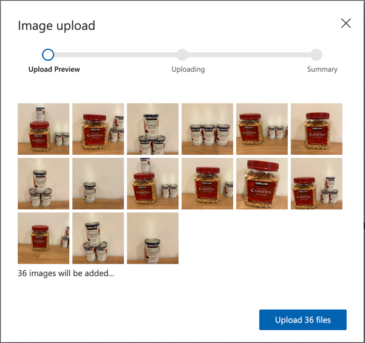

<!--
CO_OP_TRANSLATOR_METADATA:
{
  "original_hash": "8df310a42f902139a01417dacb1ffbef",
  "translation_date": "2025-08-28T10:42:53+00:00",
  "source_file": "5-retail/lessons/1-train-stock-detector/README.md",
  "language_code": "sk"
}
-->
# Trénovanie detektora zásob

> Sketchnote od [Nitya Narasimhan](https://github.com/nitya). Kliknite na obrázok pre väčšiu verziu.

Toto video poskytuje prehľad o detekcii objektov pomocou služby Azure Custom Vision, ktorá bude pokrytá v tejto lekcii.

> 🎥 Kliknite na obrázok vyššie a pozrite si video

## Kvíz pred prednáškou

[Kvíz pred prednáškou](https://black-meadow-040d15503.1.azurestaticapps.net/quiz/37)

## Úvod

V predchádzajúcom projekte ste použili AI na trénovanie klasifikátora obrázkov – modelu, ktorý dokáže určiť, či obrázok obsahuje niečo, napríklad zrelé alebo nezrelé ovocie. Ďalším typom AI modelu, ktorý sa dá použiť s obrázkami, je detekcia objektov. Tieto modely neklasifikujú obrázok pomocou značiek, ale sú trénované na rozpoznávanie objektov a dokážu ich nájsť na obrázkoch, pričom nielen zisťujú, že objekt je prítomný, ale aj kde sa na obrázku nachádza. To umožňuje počítať objekty na obrázkoch.

V tejto lekcii sa naučíte o detekcii objektov, vrátane toho, ako ju možno použiť v maloobchode. Tiež sa naučíte, ako trénovať detektor objektov v cloude.

V tejto lekcii pokryjeme:

* [Detekcia objektov](../../../../../5-retail/lessons/1-train-stock-detector)
* [Použitie detekcie objektov v maloobchode](../../../../../5-retail/lessons/1-train-stock-detector)
* [Trénovanie detektora objektov](../../../../../5-retail/lessons/1-train-stock-detector)
* [Testovanie vášho detektora objektov](../../../../../5-retail/lessons/1-train-stock-detector)
* [Opätovné trénovanie vášho detektora objektov](../../../../../5-retail/lessons/1-train-stock-detector)

## Detekcia objektov

Detekcia objektov zahŕňa rozpoznávanie objektov na obrázkoch pomocou AI. Na rozdiel od klasifikátora obrázkov, ktorý ste trénovali v poslednom projekte, detekcia objektov nie je o predpovedaní najlepšej značky pre celý obrázok, ale o hľadaní jedného alebo viacerých objektov na obrázku.

### Detekcia objektov vs klasifikácia obrázkov

Klasifikácia obrázkov sa zameriava na klasifikáciu celého obrázka – aké sú pravdepodobnosti, že celý obrázok zodpovedá každej značke. Výsledkom sú pravdepodobnosti pre každú značku použitú na trénovanie modelu.

V príklade vyššie sú dva obrázky klasifikované pomocou modelu trénovaného na klasifikáciu nádobiek s kešu orechmi alebo konzerv paradajkového pretlaku. Prvý obrázok je nádobka s kešu orechmi a má dva výsledky z klasifikátora obrázkov:

| Značka          | Pravdepodobnosť |
| ---------------- | --------------: |
| `kešu orechy`    | 98,4%           |
| `paradajkový pretlak` | 1,6%       |

Druhý obrázok je konzerva paradajkového pretlaku a výsledky sú:

| Značka          | Pravdepodobnosť |
| ---------------- | --------------: |
| `kešu orechy`    | 0,7%            |
| `paradajkový pretlak` | 99,3%       |

Tieto hodnoty by ste mohli použiť s prahovým percentom na predpovedanie, čo je na obrázku. Ale čo ak obrázok obsahuje viac konzerv paradajkového pretlaku alebo aj kešu orechy aj paradajkový pretlak? Výsledky by pravdepodobne neposkytli to, čo chcete. Tu prichádza na rad detekcia objektov.

Detekcia objektov zahŕňa trénovanie modelu na rozpoznávanie objektov. Namiesto toho, aby ste mu dali obrázky obsahujúce objekt a povedali, že každý obrázok je jedna značka alebo druhá, označíte sekciu obrázka, ktorá obsahuje konkrétny objekt, a označíte ju. Môžete označiť jeden objekt na obrázku alebo viacero. Týmto spôsobom sa model naučí, ako objekt samotný vyzerá, nielen ako vyzerajú obrázky, ktoré obsahujú objekt.

Keď ho potom použijete na predpovedanie obrázkov, namiesto zoznamu značiek a percent dostanete zoznam detegovaných objektov s ich ohraničujúcimi rámčekmi a pravdepodobnosťou, že objekt zodpovedá priradenej značke.

> 🎓 *Ohraničujúce rámčeky* sú rámčeky okolo objektu.

Obrázok vyššie obsahuje nádobku s kešu orechmi a tri konzervy paradajkového pretlaku. Detektor objektov detegoval kešu orechy, pričom vrátil ohraničujúci rámček, ktorý obsahuje kešu orechy, s percentuálnou pravdepodobnosťou, že rámček obsahuje objekt, v tomto prípade 97,6%. Detektor objektov tiež detegoval tri konzervy paradajkového pretlaku a poskytuje tri samostatné ohraničujúce rámčeky, jeden pre každú detegovanú konzervu, pričom každý má percentuálnu pravdepodobnosť, že rámček obsahuje konzervu paradajkového pretlaku.

✅ Zamyslite sa nad rôznymi scenármi, na ktoré by ste mohli použiť modely AI založené na obrázkoch. Ktoré by potrebovali klasifikáciu a ktoré detekciu objektov?

### Ako funguje detekcia objektov

Detekcia objektov používa zložité modely strojového učenia. Tieto modely fungujú tak, že rozdelia obrázok na viacero buniek a potom skontrolujú, či stred ohraničujúceho rámčeka je stredom obrázka, ktorý zodpovedá jednému z obrázkov použitých na trénovanie modelu. Môžete si to predstaviť ako spustenie klasifikátora obrázkov na rôznych častiach obrázka, aby sa našli zhody.

> 💁 Toto je drastické zjednodušenie. Existuje mnoho techník na detekciu objektov a viac o nich si môžete prečítať na [stránke Detekcia objektov na Wikipédii](https://wikipedia.org/wiki/Object_detection).

Existuje množstvo rôznych modelov, ktoré dokážu detekovať objekty. Jeden obzvlášť známy model je [YOLO (You only look once)](https://pjreddie.com/darknet/yolo/), ktorý je neuveriteľne rýchly a dokáže detegovať 20 rôznych tried objektov, ako sú ľudia, psy, fľaše a autá.

✅ Prečítajte si o modeli YOLO na [pjreddie.com/darknet/yolo/](https://pjreddie.com/darknet/yolo/)

Modely na detekciu objektov môžu byť pretrénované pomocou transferového učenia na detekciu vlastných objektov.

## Použitie detekcie objektov v maloobchode

Detekcia objektov má viacero využití v maloobchode. Niektoré zahŕňajú:

* **Kontrola a počítanie zásob** – rozpoznávanie, keď je na regáloch málo zásob. Ak je zásob málo, môžu byť odoslané upozornenia zamestnancom alebo robotom na doplnenie regálov.
* **Detekcia rúšok** – v obchodoch s politikou nosenia rúšok počas verejných zdravotných udalostí môže detekcia objektov rozpoznať ľudí s rúškami a bez nich.
* **Automatizované účtovanie** – detekcia položiek odobratých z regálov v automatizovaných obchodoch a správne účtovanie zákazníkom.
* **Detekcia nebezpečenstiev** – rozpoznávanie rozbitých predmetov na podlahe alebo rozliatych tekutín, upozorňovanie upratovacích tímov.

✅ Urobte si prieskum: Aké sú ďalšie prípady použitia detekcie objektov v maloobchode?

## Trénovanie detektora objektov

Detektor objektov môžete trénovať pomocou služby Custom Vision, podobne ako ste trénovali klasifikátor obrázkov.

### Úloha – vytvorte detektor objektov

1. Vytvorte skupinu zdrojov pre tento projekt s názvom `stock-detector`.

1. Vytvorte bezplatný zdroj na trénovanie Custom Vision a bezplatný zdroj na predikciu Custom Vision v skupine zdrojov `stock-detector`. Pomenujte ich `stock-detector-training` a `stock-detector-prediction`.

    > 💁 Môžete mať iba jeden bezplatný zdroj na trénovanie a predikciu, takže sa uistite, že ste vyčistili svoj projekt z predchádzajúcich lekcií.

    > ⚠️ Môžete sa odvolať na [pokyny na vytvorenie zdrojov na trénovanie a predikciu z projektu 4, lekcia 1, ak je to potrebné](../../../4-manufacturing/lessons/1-train-fruit-detector/README.md#task---create-a-cognitive-services-resource).

1. Spustite portál Custom Vision na [CustomVision.ai](https://customvision.ai) a prihláste sa pomocou účtu Microsoft, ktorý ste použili pre svoj účet Azure.

1. Postupujte podľa [časti Vytvorenie nového projektu v rýchlom štarte na vytvorenie detektora objektov v dokumentácii Microsoftu](https://docs.microsoft.com/azure/cognitive-services/custom-vision-service/get-started-build-detector?WT.mc_id=academic-17441-jabenn#create-a-new-project), aby ste vytvorili nový projekt Custom Vision. Používateľské rozhranie sa môže meniť a tieto dokumenty sú vždy najaktuálnejším referenčným zdrojom.

    Pomenujte svoj projekt `stock-detector`.

    Pri vytváraní projektu sa uistite, že používate zdroj `stock-detector-training`, ktorý ste vytvorili skôr. Použite typ projektu *Object Detection* a doménu *Products on Shelves*.

    

    ✅ Doména *Products on Shelves* je špecificky zameraná na detekciu zásob na regáloch v obchodoch. Prečítajte si viac o rôznych doménach v [dokumentácii o výbere domény na Microsoft Docs](https://docs.microsoft.com/azure/cognitive-services/custom-vision-service/select-domain?WT.mc_id=academic-17441-jabenn#object-detection).

✅ Venujte nejaký čas preskúmaniu používateľského rozhrania Custom Vision pre váš detektor objektov.

### Úloha – trénujte svoj detektor objektov

Na trénovanie vášho modelu budete potrebovať sadu obrázkov obsahujúcich objekty, ktoré chcete detegovať.

1. Zhromaždite obrázky, ktoré obsahujú objekt na detekciu. Budete potrebovať aspoň 15 obrázkov obsahujúcich každý objekt na detekciu z rôznych uhlov a v rôznych svetelných podmienkach, ale čím viac, tým lepšie. Tento detektor objektov používa doménu *Products on Shelves*, takže sa pokúste nastaviť objekty, akoby boli na regáli v obchode. Budete tiež potrebovať niekoľko obrázkov na testovanie modelu. Ak detegujete viac ako jeden objekt, budete chcieť niektoré testovacie obrázky, ktoré obsahujú všetky objekty.

    > 💁 Obrázky s viacerými rôznymi objektmi sa počítajú do minimálneho počtu 15 obrázkov pre všetky objekty na obrázku.

    Vaše obrázky by mali byť vo formáte png alebo jpeg, menšie ako 6 MB. Ak ich vytvoríte napríklad pomocou iPhonu, môžu byť vo vysokom rozlíšení vo formáte HEIC, takže ich bude potrebné konvertovať a prípadne zmenšiť. Čím viac obrázkov, tým lepšie, a mali by ste mať podobný počet zrelých a nezrelých.

    Model je navrhnutý pre produkty na regáloch, takže sa pokúste fotiť objekty na regáloch.

    Môžete nájsť niektoré príkladové obrázky, ktoré môžete použiť, v priečinku [images](../../../../../5-retail/lessons/1-train-stock-detector/images) s kešu orechmi a paradajkovým pretlakom, ktoré môžete použiť.

1. Postupujte podľa [časti Nahrať a označiť obrázky v rýchlom štarte na vytvorenie detektora objektov v dokumentácii Microsoftu](https://docs.microsoft.com/azure/cognitive-services/custom-vision-service/get-started-build-detector?WT.mc_id=academic-17441-jabenn#upload-and-tag-images), aby ste nahrali svoje trénovacie obrázky. Vytvorte relevantné značky v závislosti od typov objektov, ktoré chcete detegovať.

    

    Keď kreslíte ohraničujúce rámčeky pre objekty, udržujte ich pekne tesné okolo objektu. Môže to chvíľu trvať, kým označíte všetky obrázky, ale nástroj deteguje, čo považuje za ohraničujúce rámčeky, čo proces urýchli.

    

    > 💁 Ak máte viac ako 15 obrázkov pre každý objekt, môžete trénovať po 15 a potom použiť funkciu **Suggested tags**. Táto funkcia použije trénovaný model na detekciu objektov na neoznačených obrázkoch. Potom môžete potvrdiť detegované objekty alebo ich odmietnuť a prekresliť ohraničujúce rámčeky. To môže ušetriť *veľa* času.

1. Postupujte podľa [časti Trénovanie detektora v rýchlom štarte na vytvorenie detektora objektov v dokumentácii Microsoftu](https://docs.microsoft.com/azure/cognitive-services/custom-vision-service/get-started-build-detector?WT.mc_id=academic-17441-jabenn#train-the-detector), aby ste trénovali detektor objektov na vašich označených obrázkoch.

    Budete mať na výber typ trénovania. Vyberte **Quick Training**.

Detektor objektov sa potom začne trénovať. Trénovanie bude trvať niekoľko minút.

## Testovanie vášho detektora objektov

Keď je váš detektor objektov natrénovaný, môžete ho otestovať tak, že mu poskytnete nové obrázky na detekciu objektov.

### Úloha – otestujte svoj detektor objektov

1. Použite tlačidlo **Quick Test** na nahranie testovacích obrázkov a overenie, či sú objekty detegované. Použite testovacie obrázky, ktoré ste vytvorili skôr, nie žiadne z obrázkov, ktoré ste použili na trénovanie.

    

1. Vyskúšajte všetky testovacie obrázky, ku ktorým máte prístup, a pozorujte pravdepodobnosti.

## Opätovné trénovanie vášho detektora objektov

Keď testujete svoj detektor objektov, nemusí poskytovať očakávané výsledky, rovnako ako pri klasifikátoroch obrázkov v predchádzajúcom projekte. Svoj detektor objektov môžete zlepšiť jeho opätovným trénovaním s obrázkami, ktoré nesprávne vyhodnotil.

Každýkrát, keď urobíte predikciu pomocou možnosti rýchleho testu, obrázok a výsledky sa uložia. Tieto obrázky môžete použiť na opätovné trénovanie modelu.

1. Použite kartu **Predictions** na
[Post-lecture quiz](https://black-meadow-040d15503.1.azurestaticapps.net/quiz/38)

## Prehľad a samostatné štúdium

* Keď ste trénovali svoj detektor objektov, mohli ste vidieť hodnoty *Precision*, *Recall* a *mAP*, ktoré hodnotia vytvorený model. Prečítajte si o tom, čo tieto hodnoty znamenajú, pomocou [sekcie Vyhodnotenie detektora v rýchlom návode na vytvorenie detektora objektov na stránkach Microsoft Docs](https://docs.microsoft.com/azure/cognitive-services/custom-vision-service/get-started-build-detector?WT.mc_id=academic-17441-jabenn#evaluate-the-detector)
* Prečítajte si viac o detekcii objektov na [stránke Detekcia objektov na Wikipédii](https://wikipedia.org/wiki/Object_detection)

## Zadanie

[Porovnajte domény](assignment.md)

---

**Upozornenie**:  
Tento dokument bol preložený pomocou služby AI prekladu [Co-op Translator](https://github.com/Azure/co-op-translator). Aj keď sa snažíme o presnosť, prosím, berte na vedomie, že automatizované preklady môžu obsahovať chyby alebo nepresnosti. Pôvodný dokument v jeho pôvodnom jazyku by mal byť považovaný za autoritatívny zdroj. Pre kritické informácie sa odporúča profesionálny ľudský preklad. Nenesieme zodpovednosť za akékoľvek nedorozumenia alebo nesprávne interpretácie vyplývajúce z použitia tohto prekladu.