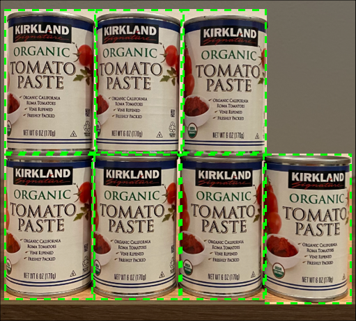

<!--
CO_OP_TRANSLATOR_METADATA:
{
  "original_hash": "1c9e5fa8b7be726c75a97232b1e41c97",
  "translation_date": "2025-08-28T10:46:41+00:00",
  "source_file": "5-retail/lessons/2-check-stock-device/README.md",
  "language_code": "sk"
}
-->
# Skontrolujte zásoby pomocou IoT zariadenia


> Sketchnote od [Nitya Narasimhan](https://github.com/nitya). Kliknite na obrázok pre väčšiu verziu.

## Kvíz pred prednáškou

[Kvíz pred prednáškou](https://black-meadow-040d15503.1.azurestaticapps.net/quiz/39)

## Úvod

V predchádzajúcej lekcii ste sa naučili o rôznych využitiach detekcie objektov v maloobchode. Tiež ste sa naučili, ako vytrénovať detektor objektov na identifikáciu zásob. V tejto lekcii sa naučíte, ako používať váš detektor objektov z IoT zariadenia na počítanie zásob.

V tejto lekcii sa zameriame na:

* [Počítanie zásob](../../../../../5-retail/lessons/2-check-stock-device)
* [Volanie detektora objektov z IoT zariadenia](../../../../../5-retail/lessons/2-check-stock-device)
* [Ohraničujúce boxy](../../../../../5-retail/lessons/2-check-stock-device)
* [Opätovné trénovanie modelu](../../../../../5-retail/lessons/2-check-stock-device)
* [Počítanie zásob](../../../../../5-retail/lessons/2-check-stock-device)

> 🗑 Toto je posledná lekcia v tomto projekte, takže po jej dokončení a splnení úlohy nezabudnite vyčistiť svoje cloudové služby. Budete ich potrebovať na splnenie úlohy, takže najskôr dokončite úlohu.
>
> Ak je to potrebné, pozrite si [príručku na vyčistenie projektu](../../../clean-up.md) pre pokyny, ako to urobiť.

## Počítanie zásob

Detektory objektov môžu byť použité na kontrolu zásob, či už na ich počítanie alebo na zabezpečenie, že zásoby sú tam, kde by mali byť. IoT zariadenia s kamerami môžu byť nasadené po celom obchode na monitorovanie zásob, začínajúc na miestach, kde je dôležité mať položky doplnené, ako sú oblasti, kde sa skladujú malé množstvá drahých položiek.

Napríklad, ak kamera smeruje na poličky, ktoré môžu držať 8 plechoviek paradajkového pretlaku, a detektor objektov detekuje iba 7 plechoviek, jedna chýba a je potrebné ju doplniť.



Na obrázku vyššie detektor objektov detekoval 7 plechoviek paradajkového pretlaku na poličke, ktorá môže držať 8 plechoviek. IoT zariadenie môže nielen poslať upozornenie na potrebu doplnenia, ale môže dokonca poskytnúť informáciu o umiestnení chýbajúcej položky, čo je dôležitý údaj, ak používate roboty na dopĺňanie poličiek.

> 💁 V závislosti od obchodu a popularity položky by sa dopĺňanie pravdepodobne neuskutočnilo, ak by chýbala iba jedna plechovka. Museli by ste vytvoriť algoritmus, ktorý určí, kedy doplniť zásoby na základe vašich produktov, zákazníkov a ďalších kritérií.

✅ V akých ďalších scenároch by ste mohli kombinovať detekciu objektov a roboty?

Niekedy sa na poličkách môže nachádzať nesprávny tovar. Môže to byť ľudská chyba pri dopĺňaní alebo zákazníci, ktorí si zmenia názor na nákup a vrátia položku na prvé dostupné miesto. Ak ide o neporušiteľný tovar, ako sú konzervy, je to nepríjemnosť. Ak ide o porušiteľný tovar, ako sú mrazené alebo chladené produkty, môže to znamenať, že produkt už nie je možné predať, pretože môže byť nemožné určiť, ako dlho bol mimo mrazničky.

Detekcia objektov môže byť použitá na detekciu neočakávaných položiek, opäť upozorňujúc človeka alebo robota, aby položku vrátil hneď, ako je detekovaná.


Na obrázku vyššie bola na poličku vedľa paradajkového pretlaku umiestnená plechovka baby kukurice. Detektor objektov to detekoval, čo umožňuje IoT zariadeniu upozorniť človeka alebo robota, aby plechovku vrátil na správne miesto.

## Volanie detektora objektov z IoT zariadenia

Detektor objektov, ktorý ste vytrénovali v poslednej lekcii, môže byť volaný z vášho IoT zariadenia.

### Úloha - publikovanie iterácie vášho detektora objektov

Iterácie sa publikujú z portálu Custom Vision.

1. Spustite portál Custom Vision na [CustomVision.ai](https://customvision.ai) a prihláste sa, ak ho ešte nemáte otvorený. Potom otvorte váš projekt `stock-detector`.

1. Vyberte kartu **Performance** z možností v hornej časti.

1. Vyberte najnovšiu iteráciu zo zoznamu *Iterations* na strane.

1. Kliknite na tlačidlo **Publish** pre danú iteráciu.

    

1. V dialógovom okne *Publish Model* nastavte *Prediction resource* na zdroj `stock-detector-prediction`, ktorý ste vytvorili v poslednej lekcii. Názov ponechajte ako `Iteration2` a kliknite na tlačidlo **Publish**.

1. Po publikovaní kliknite na tlačidlo **Prediction URL**. Zobrazia sa podrobnosti o predikčnom API, ktoré budete potrebovať na volanie modelu z vášho IoT zariadenia. Spodná časť je označená *If you have an image file*, a to sú detaily, ktoré potrebujete. Skopírujte URL, ktoré bude vyzerať približne takto:

    ```output
    https://<location>.api.cognitive.microsoft.com/customvision/v3.0/Prediction/<id>/detect/iterations/Iteration2/image
    ```

    Kde `<location>` bude lokalita, ktorú ste použili pri vytváraní vášho zdroja Custom Vision, a `<id>` bude dlhé ID zložené z písmen a čísel.

    Tiež si skopírujte hodnotu *Prediction-Key*. Toto je bezpečnostný kľúč, ktorý musíte odoslať pri volaní modelu. Iba aplikácie, ktoré odosielajú tento kľúč, môžu používať model, všetky ostatné aplikácie sú odmietnuté.

    

✅ Keď je publikovaná nová iterácia, bude mať iný názov. Ako si myslíte, že by ste zmenili iteráciu, ktorú IoT zariadenie používa?

### Úloha - volanie detektora objektov z IoT zariadenia

Postupujte podľa relevantného návodu nižšie na použitie detektora objektov z vášho IoT zariadenia:

* [Arduino - Wio Terminal](wio-terminal-object-detector.md)
* [Jednodoskový počítač - Raspberry Pi/virtuálne zariadenie](single-board-computer-object-detector.md)

## Ohraničujúce boxy

Keď používate detektor objektov, nielenže získate späť detekované objekty s ich značkami a pravdepodobnosťami, ale tiež získate ohraničujúce boxy objektov. Tieto definujú, kde detektor objektov detekoval objekt s danou pravdepodobnosťou.

> 💁 Ohraničujúci box je box, ktorý definuje oblasť obsahujúcu detekovaný objekt, box, ktorý definuje hranicu pre objekt.

Výsledky predikcie na karte **Predictions** v Custom Vision majú ohraničujúce boxy nakreslené na obrázku, ktorý bol odoslaný na predikciu.


Na obrázku vyššie boli detekované 4 plechovky paradajkového pretlaku. Vo výsledkoch je na každom detekovanom objekte nakreslený červený štvorec, ktorý označuje ohraničujúci box pre obrázok.

✅ Otvorte predikcie v Custom Vision a pozrite si ohraničujúce boxy.

Ohraničujúce boxy sú definované pomocou 4 hodnôt - top, left, height a width. Tieto hodnoty sú na škále od 0 do 1, reprezentujúce pozície ako percento veľkosti obrázka. Pôvod (pozícia 0,0) je v ľavom hornom rohu obrázka, takže hodnota top je vzdialenosť od vrchu a spodná časť ohraničujúceho boxu je top plus height.


Obrázok vyššie má šírku 600 pixelov a výšku 800 pixelov. Ohraničujúci box začína 320 pixelov dole, čo dáva hodnotu top 0.4 (800 x 0.4 = 320). Zľava začína ohraničujúci box 240 pixelov, čo dáva hodnotu left 0.4 (600 x 0.4 = 240). Výška ohraničujúceho boxu je 240 pixelov, čo dáva hodnotu height 0.3 (800 x 0.3 = 240). Šírka ohraničujúceho boxu je 120 pixelov, čo dáva hodnotu width 0.2 (600 x 0.2 = 120).

| Koordinát | Hodnota |
| ---------- | ----: |
| Top        | 0.4   |
| Left       | 0.4   |
| Height     | 0.3   |
| Width      | 0.2   |

Použitie percentuálnych hodnôt od 0 do 1 znamená, že bez ohľadu na to, na akú veľkosť je obrázok škálovaný, ohraničujúci box začína 0.4 cesty pozdĺž a dole a má výšku 0.3 a šírku 0.2.

Môžete použiť ohraničujúce boxy v kombinácii s pravdepodobnosťami na vyhodnotenie, aká presná je detekcia. Napríklad detektor objektov môže detekovať viacero objektov, ktoré sa prekrývajú, napríklad detekciu jednej plechovky vo vnútri druhej. Váš kód by mohol skontrolovať ohraničujúce boxy, pochopiť, že to nie je možné, a ignorovať akékoľvek objekty, ktoré majú významný prekrýv s inými objektmi.


V príklade vyššie jeden ohraničujúci box označuje predikovanú plechovku paradajkového pretlaku s pravdepodobnosťou 78.3%. Druhý ohraničujúci box je o niečo menší a je vo vnútri prvého boxu s pravdepodobnosťou 64.3%. Váš kód môže skontrolovať ohraničujúce boxy, vidieť, že sa úplne prekrývajú, a ignorovať nižšiu pravdepodobnosť, pretože nie je možné, aby jedna plechovka bola vo vnútri druhej.

✅ Dokážete si predstaviť situáciu, kde je platné detekovať jeden objekt vo vnútri druhého?

## Opätovné trénovanie modelu

Rovnako ako pri klasifikátore obrázkov, môžete opätovne vytrénovať váš model pomocou údajov zachytených vaším IoT zariadením. Použitie týchto údajov z reálneho sveta zabezpečí, že váš model bude dobre fungovať pri použití z vášho IoT zariadenia.

Na rozdiel od klasifikátora obrázkov nemôžete jednoducho označiť obrázok. Namiesto toho musíte skontrolovať každý ohraničujúci box detekovaný modelom. Ak je box okolo nesprávnej veci, musí byť odstránený, ak je na nesprávnom mieste, musí byť upravený.

### Úloha - opätovné trénovanie modelu

1. Uistite sa, že ste zachytili rôzne obrázky pomocou vášho IoT zariadenia.

1. Na karte **Predictions** vyberte obrázok. Uvidíte červené boxy označujúce ohraničujúce boxy detekovaných objektov.

1. Prejdite každý ohraničujúci box. Najskôr ho vyberte a uvidíte vyskakovacie okno zobrazujúce značku. Použite úchyty na rohoch ohraničujúceho boxu na úpravu veľkosti, ak je to potrebné. Ak je značka nesprávna, odstráňte ju pomocou tlačidla **X** a pridajte správnu značku. Ak ohraničujúci box neobsahuje objekt, odstráňte ho pomocou tlačidla koša.

1. Po dokončení zatvorte editor a obrázok sa presunie z karty **Predictions** na kartu **Training Images**. Opakujte proces pre všetky predikcie.

1. Použite tlačidlo **Train** na opätovné vytrénovanie vášho modelu. Po jeho vytrénovaní publikujte iteráciu a aktualizujte vaše IoT zariadenie na použitie URL novej iterácie.

1. Znovu nasadte váš kód a otestujte vaše IoT zariadenie.

## Počítanie zásob

Pomocou kombinácie počtu detekovaných objektov a ohraničujúcich boxov môžete počítať zásoby na poličke.

### Úloha - počítanie zásob

Postupujte podľa relevantného návodu nižšie na počítanie zásob pomocou výsledkov z detektora objektov z vášho IoT zariadenia:

* [Arduino - Wio Terminal](wio-terminal-count-stock.md)
* [Jednodoskový počítač - Raspberry Pi/virtuálne zariadenie](single-board-computer-count-stock.md)

---

## 🚀 Výzva

Dokážete detekovať nesprávne zásoby? Vytrénujte váš model na viacerých objektoch, potom aktualizujte vašu aplikáciu, aby vás upozornila, ak sú detekované nesprávne zásoby.

Možno to posuňte ešte ďalej a detekujte zásoby vedľa seba na tej istej poličke a zistite, či niečo bolo umiestnené na nesprávne miesto definovaním limitov na ohraničujúcich boxoch.

## Kvíz po prednáške

[Kvíz po prednáške](https://black-meadow-040d15503.1.azurestaticapps.net/quiz/40)

## Prehľad a samostatné štúdium

* Zistite viac o tom, ako navrhnúť end-to-end systém detekcie zásob z [príručky vzoru detekcie nedostatku zásob na okraji na Microsoft Docs](https://docs.microsoft.com/hybrid/app-solutions/pattern-out-of-stock-at-edge?WT.mc_id=academic-17441-jabenn)
* Zistite ďalšie spôsoby, ako vytvoriť end-to-end maloobchodné riešenia kombinujúce rôzne IoT a cloudové služby sledovaním [Behind the scenes of a retail solution - Hands On! videa na YouTube](https://www.youtube.com/watch?v=m3Pc300x2Mw).

## Úloha

[Použite váš detektor objektov na okraji](assignment.md)

---

**Upozornenie**:  
Tento dokument bol preložený pomocou služby AI prekladu [Co-op Translator](https://github.com/Azure/co-op-translator). Hoci sa snažíme o presnosť, prosím, berte na vedomie, že automatizované preklady môžu obsahovať chyby alebo nepresnosti. Pôvodný dokument v jeho rodnom jazyku by mal byť považovaný za autoritatívny zdroj. Pre kritické informácie sa odporúča profesionálny ľudský preklad. Nenesieme zodpovednosť za akékoľvek nedorozumenia alebo nesprávne interpretácie vyplývajúce z použitia tohto prekladu.