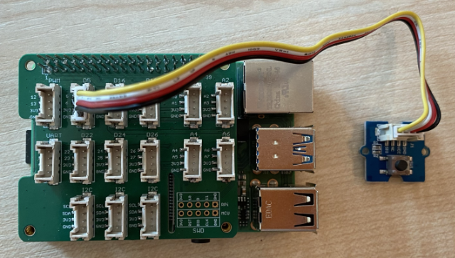

<!--
CO_OP_TRANSLATOR_METADATA:
{
  "original_hash": "0ac0afcfb40cb5970ef4cb74f01c32e9",
  "translation_date": "2025-08-28T09:11:17+00:00",
  "source_file": "6-consumer/lessons/1-speech-recognition/pi-audio.md",
  "language_code": "sk"
}
-->
# Zachytávanie zvuku - Raspberry Pi

V tejto časti lekcie napíšete kód na zachytávanie zvuku na vašom Raspberry Pi. Zachytávanie zvuku bude ovládané tlačidlom.

## Hardvér

Raspberry Pi potrebuje tlačidlo na ovládanie zachytávania zvuku.

Tlačidlo, ktoré pou쬴jete, je tlačidlo Grove. Ide o digitálny senzor, ktorý zapína alebo vypína signál. Tieto tlačidlá je mo쬹칠 nastavi콘 tak, aby posielali vysoký signál, keď je tlačidlo stlačené, a nízky, keď nie je, alebo nízky, keď je stlačené, a vysoký, keď nie je.

Ak pou쮂셨ate ReSpeaker 2-Mics Pi HAT ako mikrofón, nie je potrebné pripoji콘 tlačidlo, preto쬰 tento HAT u jedno tlačidlo obsahuje. Preskočte na ďalšiu sekciu.

### Pripojenie tlačidla

Tlačidlo je mo쬹칠 pripoji콘 k základnému HAT-u Grove.

#### Úloha - pripojenie tlačidla


1. Zasuňte jeden koniec kábla Grove do zásuvky na module tlačidla. Pôjde to iba jedným spôsobom.

1. Pri vypnutom Raspberry Pi pripojte druhý koniec kábla Grove do digitálnej zásuvky označenej **D5** na základnom HAT-e Grove pripojenom k Pi. Táto zásuvka je druhá z쬬va v rade zásuviek ved쬬 GPIO pinov.



## Zachytávanie zvuku

Zvuk z mikrofónu m칪쬰te zachyti콘 pomocou kódu v Pythone.

### Úloha - zachytávanie zvuku

1. Zapnite Pi a počkajte, kým sa spustí.

1. Spustite VS Code, buď priamo na Pi, alebo sa pripojte cez rozšírenie Remote SSH.

1. Balík PyAudio Pip obsahuje funkcie na nahrávanie a prehrávanie zvuku. Tento balík závisí od niektorých zvukových kni쬹칤c, ktoré je potrebné najskôr nainštalova콘. Spustite nasledujúce príkazy v termináli na ich inštaláciu:

    ```sh
    sudo apt update
    sudo apt install libportaudio0 libportaudio2 libportaudiocpp0 portaudio19-dev libasound2-plugins --yes 
    ```

1. Nainštalujte balík PyAudio Pip.

    ```sh
    pip3 install pyaudio
    ```

1. Vytvorte nový priečinok s názvom `smart-timer` a pridajte do tohto priečinka súbor s názvom `app.py`.

1. Pridajte nasledujúce importy na začiatok tohto súboru:

    ```python
    import io
    import pyaudio
    import time
    import wave
    
    from grove.factory import Factory
    ```

    Týmto sa importuje modul `pyaudio`, niektoré štandardné moduly Pythonu na prácu so súbormi WAV a modul `grove.factory` na importovanie `Factory` na vytvorenie triedy tlačidla.

1. Pod týmto pridajte kód na vytvorenie tlačidla Grove.

    Ak pou쮂셨ate ReSpeaker 2-Mics Pi HAT, pou쬴te nasledujúci kód:

    ```python
    # The button on the ReSpeaker 2-Mics Pi HAT
    button = Factory.getButton("GPIO-LOW", 17)
    ```

    Týmto sa vytvorí tlačidlo na porte **D17**, porte, ku ktorému je pripojené tlačidlo na ReSpeaker 2-Mics Pi HAT. Toto tlačidlo je nastavené na posielanie nízkeho signálu, keď je stlačené.

    Ak nepou쮂셨ate ReSpeaker 2-Mics Pi HAT, ale pou쮂셨ate tlačidlo Grove pripojené k základnému HAT-u, pou쬴te tento kód:

    ```python
    button = Factory.getButton("GPIO-HIGH", 5)
    ```

    Týmto sa vytvorí tlačidlo na porte **D5**, ktoré je nastavené na posielanie vysokého signálu, keď je stlačené.

1. Pod týmto vytvorte inštanciu triedy PyAudio na prácu so zvukom:

    ```python
    audio = pyaudio.PyAudio()
    ```

1. Deklarujte číslo hardvérovej karty pre mikrofón a reproduktor. Toto bude číslo karty, ktoré ste našli spustením `arecord -l` a `aplay -l` skôr v tejto lekcii.

    ```python
    microphone_card_number = <microphone card number>
    speaker_card_number = <speaker card number>
    ```

    Nahraďte `<microphone card number>` číslom karty vášho mikrofónu.

    Nahraďte `<speaker card number>` číslom karty vášho reproduktora, rovnakým číslom, ktoré ste nastavili v súbore `alsa.conf`.

1. Pod týmto deklarujte vzorkovaciu frekvenciu na pou쬴tie pri zachytávaní a prehrávaní zvuku. Mo쬹o budete musie콘 túto hodnotu zmeni콘 v závislosti od hardvéru, ktorý pou쮂셨ate.

    ```python
    rate = 48000 #48KHz
    ```

    Ak pri spustení tohto kódu neskôr dostanete chyby vzorkovacej frekvencie, zmeňte túto hodnotu na `44100` alebo `16000`. Čím vyššia hodnota, tým lepšia kvalita zvuku.

1. Pod týmto vytvorte novú funkciu s názvom `capture_audio`. Táto funkcia bude volaná na zachytávanie zvuku z mikrofónu:

    ```python
    def capture_audio():
    ```

1. Vo vnútri tejto funkcie pridajte nasledujúce na zachytávanie zvuku:

    ```python
    stream = audio.open(format = pyaudio.paInt16,
                        rate = rate,
                        channels = 1, 
                        input_device_index = microphone_card_number,
                        input = True,
                        frames_per_buffer = 4096)

    frames = []

    while button.is_pressed():
        frames.append(stream.read(4096))

    stream.stop_stream()
    stream.close()
    ```

    Tento kód otvorí zvukový vstupný stream pomocou objektu PyAudio. Tento stream bude zachytáva콘 zvuk z mikrofónu pri 16 kHz, zachytávajúc ho v blokoch o ve쬶osti 4096 bajtov.

    Kód potom opakovane číta tieto bloky o ve쬶osti 4096 bajtov do po쬬, kým je tlačidlo Grove stlačené.

    > 💁 Viac o mo쬹ostiach odovzdávaných metóde `open` si m칪쬰te prečíta콘 v [dokumentácii PyAudio](https://people.csail.mit.edu/hubert/pyaudio/docs/).

    Po uvo쬹ení tlačidla sa stream zastaví a zatvorí.

1. Pridajte nasledujúce na koniec tejto funkcie:

    ```python
    wav_buffer = io.BytesIO()
    with wave.open(wav_buffer, 'wb') as wavefile:
        wavefile.setnchannels(1)
        wavefile.setsampwidth(audio.get_sample_size(pyaudio.paInt16))
        wavefile.setframerate(rate)
        wavefile.writeframes(b''.join(frames))
        wav_buffer.seek(0)

    return wav_buffer
    ```

    Tento kód vytvorí binárny buffer a zapíše všetok zachytený zvuk do neho ako [WAV súbor](https://wikipedia.org/wiki/WAV). Ide o štandardný spôsob zápisu nekomprimovaného zvuku do súboru. Tento buffer sa potom vráti.

1. Pridajte nasledujúcu funkciu `play_audio` na prehrávanie zvukového bufferu:

    ```python
    def play_audio(buffer):
        stream = audio.open(format = pyaudio.paInt16,
                            rate = rate,
                            channels = 1,
                            output_device_index = speaker_card_number,
                            output = True)
    
        with wave.open(buffer, 'rb') as wf:
            data = wf.readframes(4096)
    
            while len(data) > 0:
                stream.write(data)
                data = wf.readframes(4096)
    
            stream.close()
    ```

    Táto funkcia otvorí ďalší zvukový stream, tentoraz na výstup - na prehrávanie zvuku. Pou쮂셨a rovnaké nastavenia ako vstupný stream. Buffer sa potom otvorí ako súbor WAV a zapíše sa do výstupného streamu v blokoch o ve쬶osti 4096 bajtov, čím sa prehrá zvuk. Stream sa potom zatvorí.

1. Pridajte nasledujúci kód pod funkciu `capture_audio` na opakovanie, kým nie je tlačidlo stlačené. Po stlačení tlačidla sa zvuk zachytí a následne prehrá.

    ```python
    while True:
        while not button.is_pressed():
            time.sleep(.1)
        
        buffer = capture_audio()
        play_audio(buffer)
    ```

1. Spustite kód. Stlačte tlačidlo a hovorte do mikrofónu. Uvo쬹ite tlačidlo, keď skončíte, a budete poču콘 nahrávku.

    M칪쬰te dosta콘 niektoré chyby ALSA pri vytváraní inštancie PyAudio. Je to kvôli konfigurácii na Pi pre zvukové zariadenia, ktoré nemáte. Tieto chyby m칪쬰te ignorova콘.

    ```output
    pi@raspberrypi:~/smart-timer $ python3 app.py 
    ALSA lib pcm.c:2565:(snd_pcm_open_noupdate) Unknown PCM cards.pcm.front
    ALSA lib pcm.c:2565:(snd_pcm_open_noupdate) Unknown PCM cards.pcm.rear
    ALSA lib pcm.c:2565:(snd_pcm_open_noupdate) Unknown PCM cards.pcm.center_lfe
    ALSA lib pcm.c:2565:(snd_pcm_open_noupdate) Unknown PCM cards.pcm.side
    ```

    Ak dostanete nasledujúcu chybu:

    ```output
    OSError: [Errno -9997] Invalid sample rate
    ```

    zmeňte hodnotu `rate` na buď 44100 alebo 16000.

> 💁 Tento kód nájdete v priečinku [code-record/pi](../../../../../6-consumer/lessons/1-speech-recognition/code-record/pi).

😀 Váš program na nahrávanie zvuku bol úspešný!

---

**Upozornenie**:  
Tento dokument bol prelo쬰ný pomocou slu쬭y na automatický preklad [Co-op Translator](https://github.com/Azure/co-op-translator). Aj keď sa sna쮂셠e o presnos콘, upozorňujeme, 쬰 automatické preklady m칪쬿 obsahova콘 chyby alebo nepresnosti. Pôvodný dokument v jeho pôvodnom jazyku by mal by콘 pova쬺vaný za záv칛zný zdroj. Pre dôle쬴té informácie sa odpor칰캜a profesionálny 쬿dský preklad. Nezodpovedáme za akéko쭀ek nedorozumenia alebo nesprávne interpretácie vyplývajúce z pou쬴tia tohto prekladu.