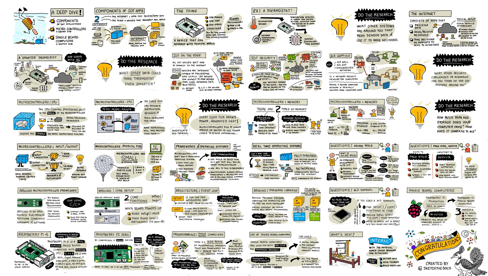
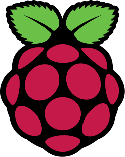

<!--
CO_OP_TRANSLATOR_METADATA:
{
  "original_hash": "9dd7f645ad1c6f20b72fee512987f772",
  "translation_date": "2025-08-28T13:41:11+00:00",
  "source_file": "1-getting-started/lessons/2-deeper-dive/README.md",
  "language_code": "sl"
}
-->
# Poglobljen pogled v IoT

> Sketchnote avtorja [Nitya Narasimhan](https://github.com/nitya). Kliknite na sliko za večjo različico.

Ta lekcija je bila del serije [Hello IoT](https://youtube.com/playlist?list=PLmsFUfdnGr3xRts0TIwyaHyQuHaNQcb6-) iz [Microsoft Reactor](https://developer.microsoft.com/reactor/?WT.mc_id=academic-17441-jabenn). Lekcija je bila izvedena v dveh videoposnetkih - enourni lekciji in enourni pisarniški uri, kjer so podrobneje obravnavali dele lekcije ter odgovarjali na vprašanja.

> 🎥 Kliknite na zgornje slike za ogled videoposnetkov

## Predhodni kviz

[Predhodni kviz](https://black-meadow-040d15503.1.azurestaticapps.net/quiz/3)

## Uvod

Ta lekcija se poglobi v nekatere koncepte, obravnavane v prejšnji lekciji.

V tej lekciji bomo obravnavali:

* [Komponente IoT aplikacije](../../../../../1-getting-started/lessons/2-deeper-dive)
* [Poglobljen pogled v mikrokrmilnike](../../../../../1-getting-started/lessons/2-deeper-dive)
* [Poglobljen pogled v računalnike z eno ploščo](../../../../../1-getting-started/lessons/2-deeper-dive)

## Komponente IoT aplikacije

Dve glavni komponenti IoT aplikacije sta *Internet* in *stvar*. Poglejmo si ti dve komponenti podrobneje.

### Stvar

**Stvar** v IoT se nanaša na napravo, ki lahko komunicira s fizičnim svetom. Te naprave so običajno majhni, cenovno ugodni računalniki, ki delujejo pri nizkih hitrostih in porabijo malo energije - na primer preprosti mikrokrmilniki z nekaj kilobajti RAM-a (v primerjavi z gigabajti v osebnem računalniku), ki delujejo le pri nekaj sto megahercih (v primerjavi z gigaherci v osebnem računalniku), vendar porabijo tako malo energije, da lahko delujejo tedne, mesece ali celo leta na baterijah.

Te naprave komunicirajo s fizičnim svetom bodisi z uporabo senzorjev za zbiranje podatkov iz okolice bodisi z nadzorovanjem izhodov ali aktuatorjev za izvajanje fizičnih sprememb. Tipičen primer je pametni termostat - naprava, ki ima temperaturni senzor, način za nastavitev želene temperature, kot je vrtljivi gumb ali zaslon na dotik, in povezavo s sistemom za ogrevanje ali hlajenje, ki se lahko vklopi, ko zaznana temperatura ni v želenem območju. Temperaturni senzor zazna, da je prostor prehladen, in aktuator vklopi ogrevanje.

Obstaja ogromno različnih stvari, ki lahko delujejo kot IoT naprave, od namenskih naprav za zaznavanje ene stvari do naprav splošnega namena, celo vaš pametni telefon! Pametni telefon lahko uporablja senzorje za zaznavanje sveta okoli sebe in aktuatorje za interakcijo s svetom - na primer z uporabo GPS senzorja za zaznavanje vaše lokacije in zvočnika za navigacijska navodila do cilja.

✅ Pomislite na druge sisteme okoli vas, ki berejo podatke iz senzorja in jih uporabljajo za sprejemanje odločitev. Eden od primerov bi bil termostat v pečici. Ali lahko najdete več?

### Internet

**Internet** v IoT aplikaciji vključuje aplikacije, s katerimi se IoT naprava povezuje za pošiljanje in prejemanje podatkov, ter druge aplikacije, ki lahko obdelujejo podatke iz IoT naprave in pomagajo pri sprejemanju odločitev o tem, katere zahteve poslati aktuatorjem IoT naprave.

Tipična postavitev bi bila uporaba neke vrste storitve v oblaku, s katero se IoT naprava povezuje. Ta storitev v oblaku obravnava stvari, kot so varnost, sprejemanje sporočil od IoT naprave in pošiljanje sporočil nazaj napravi. Ta storitev v oblaku se nato poveže z drugimi aplikacijami, ki lahko obdelujejo ali shranjujejo podatke senzorjev ali uporabljajo podatke senzorjev skupaj s podatki iz drugih sistemov za sprejemanje odločitev.

Naprave se ne povezujejo vedno neposredno z internetom prek WiFi ali žičnih povezav. Nekatere naprave uporabljajo mrežno povezovanje za medsebojno komunikacijo prek tehnologij, kot je Bluetooth, in se povezujejo prek osrednje naprave, ki ima internetno povezavo.

V primeru pametnega termostata bi se termostat povezal prek domačega WiFi z oblačno storitvijo. Pošiljal bi podatke o temperaturi tej storitvi v oblaku, od tam pa bi bili zapisani v neko bazo podatkov, ki bi omogočala lastniku doma preverjanje trenutnih in preteklih temperatur prek aplikacije na telefonu. Druga storitev v oblaku bi vedela, kakšno temperaturo si lastnik želi, in pošiljala sporočila nazaj IoT napravi prek oblačne storitve, da bi ogrevalni sistem vklopila ali izklopila.

Še pametnejša različica bi lahko uporabljala AI v oblaku z podatki iz drugih senzorjev, povezanih z drugimi IoT napravami, kot so senzorji za zaznavanje prisotnosti, ki zaznavajo, katere sobe se uporabljajo, ter podatki, kot so vremenski podatki in celo vaš koledar, za sprejemanje odločitev o pametnem nastavljanju temperature. Na primer, lahko bi izklopila ogrevanje, če bi iz vašega koledarja prebrala, da ste na dopustu, ali pa bi izklopila ogrevanje po sobah glede na to, katere sobe uporabljate, pri čemer bi se učila iz podatkov, da bi bila sčasoma vedno bolj natančna.

✅ Katere druge podatke bi lahko uporabili za pametnejši internetno povezan termostat?

### IoT na robu

Čeprav I v IoT pomeni Internet, te naprave ni nujno, da se povezujejo z internetom. V nekaterih primerih se naprave lahko povezujejo z 'robovskimi' napravami - prehodnimi napravami, ki delujejo na vašem lokalnem omrežju, kar omogoča obdelavo podatkov brez klicev prek interneta. To je lahko hitrejše, če imate veliko podatkov ali počasno internetno povezavo, omogoča delovanje brez povezave, kjer internetna povezava ni mogoča, na primer na ladji ali v območju katastrofe med odzivanjem na humanitarno krizo, in omogoča ohranjanje zasebnosti podatkov. Nekatere naprave bodo vsebovale procesno kodo, ustvarjeno z orodji v oblaku, in jo izvajale lokalno za zbiranje in odzivanje na podatke brez uporabe internetne povezave za sprejemanje odločitev.

En primer tega je pametna domača naprava, kot je Apple HomePod, Amazon Alexa ali Google Home, ki posluša vaš glas z uporabo AI modelov, usposobljenih v oblaku, vendar deluje lokalno na napravi. Te naprave se 'zbudijo', ko je izgovorjena določena beseda ali fraza, in šele takrat pošljejo vaš govor prek interneta za obdelavo. Naprava preneha pošiljati govor ob ustreznem trenutku, na primer ko zazna premor v vašem govoru. Vse, kar rečete pred zbujanjem naprave z besedo za zbujanje, in vse, kar rečete po tem, ko naprava preneha poslušati, ne bo poslano prek interneta ponudniku naprave in bo zato ostalo zasebno.

✅ Pomislite na druge scenarije, kjer je zasebnost pomembna, zato bi bilo obdelovanje podatkov bolje opraviti na robu kot v oblaku. Namig - pomislite na IoT naprave s kamerami ali drugimi napravami za zajemanje slik.

### IoT varnost

Pri vsaki internetni povezavi je varnost pomemben vidik. Obstaja stara šala, da 'S v IoT pomeni varnost' - v IoT ni 'S', kar nakazuje, da ni varno.

IoT naprave se povezujejo z oblačno storitvijo in so zato varne le toliko, kot je varna ta oblačna storitev - če vaša oblačna storitev omogoča povezavo katerikoli napravi, lahko pride do pošiljanja zlonamernih podatkov ali virusnih napadov. To lahko ima zelo resne posledice, saj IoT naprave komunicirajo in nadzorujejo druge naprave. Na primer, [črv Stuxnet](https://wikipedia.org/wiki/Stuxnet) je manipuliral ventile v centrifugah, da bi jih poškodoval. Hekerji so prav tako izkoristili [slabo varnost za dostop do otroških monitorjev](https://www.npr.org/sections/thetwo-way/2018/06/05/617196788/s-c-mom-says-baby-monitor-was-hacked-experts-say-many-devices-are-vulnerable) in drugih domačih nadzornih naprav.

> 💁 Včasih IoT naprave in robovske naprave delujejo na omrežju, ki je popolnoma izolirano od interneta, da ohranijo podatke zasebne in varne. To je znano kot [air-gapping](https://wikipedia.org/wiki/Air_gap_(networking)).

## Poglobljen pogled v mikrokrmilnike

V prejšnji lekciji smo predstavili mikrokrmilnike. Zdaj si jih poglejmo podrobneje.

### CPU

CPU je 'možgani' mikrokrmilnika. To je procesor, ki izvaja vašo kodo in lahko pošilja podatke ter jih prejema od povezanih naprav. CPU-ji lahko vsebujejo eno ali več jeder - v bistvu eno ali več CPU-jev, ki lahko sodelujejo pri izvajanju vaše kode.

CPU-ji se zanašajo na uro, ki tiktaka več milijonov ali milijard krat na sekundo. Vsak tik ali cikel sinhronizira dejanja, ki jih CPU lahko izvede. Z vsakim tikom lahko CPU izvede navodilo iz programa, na primer pridobi podatke iz zunanje naprave ali izvede matematični izračun. Ta redni cikel omogoča, da se vsa dejanja dokončajo pred obdelavo naslednjega navodila.

Hitrejši kot je cikel ure, več navodil lahko CPU obdela vsako sekundo in zato hitrejši je CPU. Hitrost CPU-jev se meri v [Hertzih (Hz)](https://wikipedia.org/wiki/Hertz), standardni enoti, kjer 1 Hz pomeni en cikel ali tik ure na sekundo.

> 🎓 Hitrosti CPU-jev so pogosto podane v MHz ali GHz. 1MHz je 1 milijon Hz, 1GHz je 1 milijarda Hz.

> 💁 CPU-ji izvajajo programe z uporabo [cikla pridobivanja-dekodiranja-izvajanja](https://wikipedia.org/wiki/Instruction_cycle). Za vsak tik ure CPU pridobi naslednje navodilo iz pomnilnika, ga dekodira in nato izvede, na primer z uporabo aritmetično-logične enote (ALU) za seštevanje dveh števil. Nekatera izvajanja trajajo več tikov, zato se naslednji cikel izvede ob naslednjem tiku po zaključku navodila.

Mikrokrmilniki imajo veliko nižje hitrosti ure kot namizni ali prenosni računalniki ali celo večina pametnih telefonov. Na primer, Wio Terminal ima CPU, ki deluje pri 120MHz ali 120.000.000 ciklov na sekundo.

✅ Povprečen osebni računalnik ali Mac ima CPU z več jedri, ki delujejo pri več gigahercih, kar pomeni, da ura tiktaka milijarde krat na sekundo. Raziščite hitrost ure vašega računalnika in primerjajte, koliko krat hitrejši je od Wio Terminala.

Vsak cikel ure porabi energijo in generira toploto. Hitrejši kot so tiktaki, več energije se porabi in več toplote se generira. Osebni računalniki imajo hladilna telesa in ventilatorje za odstranjevanje toplote, brez katerih bi se pregreli in ugasnili v nekaj sekundah. Mikrokrmilniki pogosto nimajo ne enega ne drugega, saj delujejo veliko hladneje in zato veliko počasneje. Osebni računalniki delujejo na električno omrežje ali velike baterije za nekaj ur, mikrokrmilniki pa lahko delujejo dneve, mesece ali celo leta na majhnih baterijah. Mikrokrmilniki lahko imajo tudi jedra, ki delujejo pri različnih hitrostih, preklapljajo na počasnejša jedra z nizko porabo energije, ko je obremenitev CPU-ja nizka, da zmanjšajo porabo energije.

> 💁 Nekateri osebni računalniki in Maci sprejemajo enako mešanico hitrih jeder z visoko porabo energije in počasnejših jeder z nizko porabo energije, preklapljajo za varčevanje z baterijo. Na primer, čip M1 v najnovejših prenosnikih Apple lahko preklaplja med 4 zmogljivostnimi jedri in 4 učinkovitostnimi jedri za optimizacijo življenjske dobe baterije ali hitrosti, odvisno od naloge, ki se izvaja.

✅ Malo raziskujte: Preberite o CPU-jih v [članku o CPU-jih na Wikipediji](https://wikipedia.org/wiki/Central_processing_unit)

#### Naloga

Raziskujte Wio Terminal.

Če uporabljate Wio Terminal za te lekcije, poskusite najti CPU. Poiščite razdelek *Pregled strojne opreme* na [strani izdelka Wio Terminal](https://www.seeedstudio.com/Wio-Terminal-p-4509.html) za sliko notranjosti in poskusite najti CPU skozi prozorno plastično okno na zadnji strani.

### Pomnilnik

Mikrokrmilniki običajno imajo dva tipa pomnilnika - pomnilnik za program in pomnilnik z naključnim dostopom (RAM).

Pomnilnik za program je nehlapen, kar pomeni, da kar koli je zapisano vanj, ostane, ko naprava nima napajanja. To je pomnilnik, ki shranjuje vašo programsko kodo.

RAM je pomnilnik, ki ga uporablja program za delovanje, vsebuje spremenljivke, ki jih dodeli vaš program, in podatke, zbrane iz perifernih naprav. RAM je hlapen, ko ni napajanja, se vsebina izgubi, kar učinkovito ponastavi vaš program.
🎓 Programski pomnilnik shranjuje vašo kodo in ostane, tudi ko ni električne energije.
🎓 RAM se uporablja za izvajanje vašega programa in se ponastavi, ko ni napajanja.

Tako kot pri CPU je pomnilnik na mikrokrmilniku za več velikostnih razredov manjši kot na PC-ju ali Macu. Tipičen PC ima lahko 8 gigabajtov (GB) RAM-a, ali 8.000.000.000 bajtov, pri čemer je vsak bajt dovolj velik za shranjevanje ene črke ali številke od 0 do 255. Mikrokrmilnik pa ima le kilobajte (KB) RAM-a, pri čemer je kilobajt 1.000 bajtov. Wio terminal, omenjen zgoraj, ima 192KB RAM-a, ali 192.000 bajtov - več kot 40.000-krat manj kot povprečen PC!

Spodnji diagram prikazuje relativno razliko v velikosti med 192KB in 8GB - majhna pika v sredini predstavlja 192KB.

Shranjevanje programov je prav tako manjše kot na PC-ju. Tipičen PC ima lahko 500GB trdi disk za shranjevanje programov, medtem ko ima mikrokrmilnik le kilobajte ali morda nekaj megabajtov (MB) prostora (1MB je 1.000KB, ali 1.000.000 bajtov). Wio terminal ima 4MB prostora za shranjevanje programov.

✅ Malo raziskujte: Koliko RAM-a in prostora za shranjevanje ima računalnik, ki ga uporabljate za branje tega? Kako se to primerja z mikrokrmilnikom?

### Vhod/Izhod

Mikrokrmilniki potrebujejo vhodne in izhodne (I/O) povezave za branje podatkov iz senzorjev in pošiljanje kontrolnih signalov aktuatorjem. Običajno vsebujejo več splošno-namenskih vhodno/izhodnih (GPIO) pinov. Te pine je mogoče konfigurirati v programski opremi kot vhod (sprejemajo signal) ali izhod (pošiljajo signal).

🧠⬅️ Vhodni pini se uporabljajo za branje vrednosti iz senzorjev.

🧠➡️ Izhodni pini pošiljajo navodila aktuatorjem.

✅ Več o tem boste izvedeli v naslednji lekciji.

#### Naloga

Raziskujte Wio Terminal.

Če uporabljate Wio Terminal za te lekcije, poiščite GPIO pine. Poiščite razdelek *Pinout diagram* na [strani izdelka Wio Terminal](https://www.seeedstudio.com/Wio-Terminal-p-4509.html), da se naučite, kateri pini so kateri. Wio Terminal ima priloženo nalepko, ki jo lahko namestite na zadnjo stran z oznakami pinov, zato jo dodajte zdaj, če tega še niste storili.

### Fizična velikost

Mikrokrmilniki so običajno majhni, pri čemer je najmanjši, [Freescale Kinetis KL03 MCU, dovolj majhen, da se prilega vdolbini golf žogice](https://www.edn.com/tiny-arm-cortex-m0-based-mcu-shrinks-package/). Sam CPU v PC-ju lahko meri 40mm x 40mm, kar ne vključuje hladilnikov in ventilatorjev, potrebnih za zagotovitev, da CPU deluje več kot nekaj sekund brez pregrevanja, kar je bistveno večje od celotnega mikrokrmilnika. Razvojni komplet Wio Terminal z mikrokrmilnikom, ohišjem, zaslonom in vrsto povezav ter komponent ni veliko večji od golih Intel i9 CPU-jev in bistveno manjši od CPU-ja s hladilnikom in ventilatorjem!

| Naprava                          | Velikost              |
| -------------------------------- | --------------------- |
| Freescale Kinetis KL03           | 1.6mm x 2mm x 1mm     |
| Wio Terminal                     | 72mm x 57mm x 12mm    |
| Intel i9 CPU, hladilnik in ventilator | 136mm x 145mm x 103mm |

### Okviri in operacijski sistemi

Zaradi nizke hitrosti in velikosti pomnilnika mikrokrmilniki ne uporabljajo operacijskega sistema (OS) v smislu namiznih računalnikov. Operacijski sistem, ki omogoča delovanje vašega računalnika (Windows, Linux ali macOS), potrebuje veliko pomnilnika in procesorske moči za izvajanje nalog, ki so popolnoma nepotrebne za mikrokrmilnik. Mikrokrmilniki so običajno programirani za izvajanje ene ali več zelo specifičnih nalog, za razliko od splošno-namenskega računalnika, kot sta PC ali Mac, ki mora podpirati uporabniški vmesnik, predvajati glasbo ali filme, zagotavljati orodja za pisanje dokumentov ali kode, igranje iger ali brskanje po internetu.

Za programiranje mikrokrmilnika brez OS potrebujete nekaj orodij, ki vam omogočajo, da zgradite svojo kodo na način, ki ga mikrokrmilnik lahko izvaja, z uporabo API-jev, ki lahko komunicirajo s perifernimi napravami. Vsak mikrokrmilnik je drugačen, zato proizvajalci običajno podpirajo standardne okvire, ki vam omogočajo, da sledite standardnemu 'receptu' za gradnjo kode, ki bo delovala na katerem koli mikrokrmilniku, ki podpira ta okvir.

Mikrokrmilnike lahko programirate z OS-jem - pogosto imenovanim realno-časovni operacijski sistem (RTOS), saj so ti zasnovani za obdelavo podatkov s perifernimi napravami v realnem času. Ti operacijski sistemi so zelo lahki in zagotavljajo funkcije, kot so:

* Večnitnost, ki omogoča, da vaša koda izvaja več blokov kode hkrati, bodisi na več jedrih bodisi izmenično na enem jedru.
* Omrežje za varno komunikacijo prek interneta.
* Komponente grafičnega uporabniškega vmesnika (GUI) za gradnjo uporabniških vmesnikov (UI) na napravah z zasloni.

✅ Preberite več o različnih RTOS-ih: [Azure RTOS](https://azure.microsoft.com/services/rtos/?WT.mc_id=academic-17441-jabenn), [FreeRTOS](https://www.freertos.org), [Zephyr](https://www.zephyrproject.org).

#### Arduino

[Arduino](https://www.arduino.cc) je verjetno najbolj priljubljen okvir za mikrokrmilnike, zlasti med študenti, ljubitelji in ustvarjalci. Arduino je odprtokodna elektronska platforma, ki združuje programsko in strojno opremo. Arduino združljive plošče lahko kupite pri Arduino ali drugih proizvajalcih, nato pa jih programirate z uporabo okvira Arduino.

Arduino plošče se programirajo v C ali C++. Uporaba C/C++ omogoča, da se vaša koda kompajlira zelo majhna in deluje hitro, kar je potrebno na omejeni napravi, kot je mikrokrmilnik. Jedro aplikacije Arduino se imenuje skica in je C/C++ koda z dvema funkcijama - `setup` in `loop`. Ko se plošča zažene, bo koda okvira Arduino izvedla funkcijo `setup` enkrat, nato pa bo funkcijo `loop` izvajala znova in znova, dokler se naprava ne izklopi.

V funkciji `setup` bi napisali začetno kodo, kot je povezovanje z WiFi-jem in storitvami v oblaku ali inicializacija pinov za vhod in izhod. Vaša koda v funkciji `loop` bi nato vsebovala procesno kodo, kot je branje senzorja in pošiljanje vrednosti v oblak. Običajno bi dodali zamik v vsakem zanki, na primer, če želite, da se podatki senzorja pošiljajo vsakih 10 sekund, bi na koncu zanke dodali zamik 10 sekund, da mikrokrmilnik lahko spi, prihrani energijo, nato pa ponovno zažene zanko, ko je potrebno.

✅ Ta arhitektura programa je znana kot *zanka dogodkov* ali *zanka sporočil*. Veliko aplikacij uporablja to v ozadju in je standard za večino namiznih aplikacij, ki delujejo na OS-ih, kot so Windows, macOS ali Linux. Funkcija `loop` posluša sporočila iz komponent uporabniškega vmesnika, kot so gumbi, ali naprav, kot je tipkovnica, in se nanje odziva. Več o tem lahko preberete v [članku o zanki dogodkov](https://wikipedia.org/wiki/Event_loop).

Arduino zagotavlja standardne knjižnice za interakcijo z mikrokrmilniki in I/O pini, z različnimi implementacijami v ozadju za delovanje na različnih mikrokrmilnikih. Na primer, funkcija [`delay`](https://www.arduino.cc/reference/en/language/functions/time/delay/) bo zaustavila program za določen čas, funkcija [`digitalRead`](https://www.arduino.cc/reference/en/language/functions/digital-io/digitalread/) bo prebrala vrednost `HIGH` ali `LOW` iz določenega pina, ne glede na to, na kateri plošči se koda izvaja. Te standardne knjižnice omogočajo, da se koda Arduino, napisana za eno ploščo, ponovno kompajlira za katero koli drugo ploščo Arduino in deluje, če so pini enaki in plošče podpirajo iste funkcije.

Obstaja velik ekosistem knjižnic Arduino tretjih oseb, ki vam omogočajo dodajanje dodatnih funkcij vašim projektom Arduino, kot je uporaba senzorjev in aktuatorjev ali povezovanje s storitvami IoT v oblaku.

##### Naloga

Raziskujte Wio Terminal.

Če uporabljate Wio Terminal za te lekcije, ponovno preberite kodo, ki ste jo napisali v prejšnji lekciji. Poiščite funkciji `setup` in `loop`. Spremljajte serijski izhod za funkcijo `loop`, ki se ponavlja. Poskusite dodati kodo v funkcijo `setup`, da pišete na serijski port, in opazujte, da se ta koda pokliče le enkrat ob vsakem ponovnem zagonu. Poskusite znova zagnati napravo s stikalom za vklop na strani, da pokažete, da se ta funkcija pokliče ob vsakem ponovnem zagonu naprave.

## Globlji pogled v enobočne računalnike

V prejšnji lekciji smo predstavili enobočne računalnike. Zdaj si jih poglejmo podrobneje.

### Raspberry Pi

[Raspberry Pi Foundation](https://www.raspberrypi.org) je dobrodelna organizacija iz Združenega kraljestva, ustanovljena leta 2009 za spodbujanje študija računalništva, zlasti na šolski ravni. Kot del te misije so razvili enobočni računalnik, imenovan Raspberry Pi. Raspberry Pi-ji so trenutno na voljo v 3 različicah - polne velikosti, manjši Pi Zero in računalniški modul, ki ga lahko vgradite v svojo končno IoT napravo.

Najbolj nova iteracija polne velikosti Raspberry Pi je Raspberry Pi 4B. Ta ima štirijedrni (4 jedra) CPU, ki deluje pri 1.5GHz, 2, 4 ali 8GB RAM-a, gigabitni ethernet, WiFi, 2 HDMI porta, ki podpirata 4k zaslone, avdio in kompozitni video izhodni port, USB porte (2 USB 2.0, 2 USB 3.0), 40 GPIO pinov, priključek za kamero za modul kamere Raspberry Pi in režo za SD kartico. Vse to na plošči, ki meri 88mm x 58mm x 19.5mm in jo napaja 3A USB-C napajalnik. Cena se začne pri 35 USD, kar je veliko ceneje kot PC ali Mac.

> 💁 Obstaja tudi Pi400, vse-v-enem računalnik z vgrajenim Pi4 v tipkovnici.

Pi Zero je veliko manjši, z nižjo porabo energije. Ima enojedrni 1GHz CPU, 512MB RAM-a, WiFi (v modelu Zero W), en HDMI port, mikro-USB port, 40 GPIO pinov, priključek za kamero za modul kamere Raspberry Pi in režo za SD kartico. Meri 65mm x 30mm x 5mm in porabi zelo malo energije. Zero stane 5 USD, medtem ko različica W z WiFi stane 10 USD.

> 🎓 CPU-ji v obeh teh napravah so ARM procesorji, za razliko od Intel/AMD x86 ali x64 procesorjev, ki jih najdete v večini PC-jev in Macov. Ti so podobni procesorjem, ki jih najdete v nekaterih mikrokrmilnikih, pa tudi v skoraj vseh mobilnih telefonih, Microsoft Surface X in novih Apple Silicon Macih.

Vse različice Raspberry Pi uporabljajo različico Debian Linuxa, imenovano Raspberry Pi OS. Na voljo je kot lahka različica brez namizja, ki je popolna za 'headless' projekte, kjer ne potrebujete zaslona, ali kot polna različica z namiznim okoljem, z brskalnikom, pisarniškimi aplikacijami, orodji za kodiranje in igrami. Ker je OS različica Debian Linuxa, lahko namestite katero koli aplikacijo ali orodje, ki deluje na Debianu in je zgrajeno za ARM procesor znotraj Pi-ja.

#### Naloga

Raziskujte Raspberry Pi.

Če uporabljate Raspberry Pi za te lekcije, preberite več o različnih strojnih komponentah na plošči.

* Podrobnosti o procesorjih, uporabljenih na [strani dokumentacije o strojni opremi Raspberry Pi](https://www.raspberrypi.org/documentation/hardware/raspberrypi/). Preberite več o procesorju, uporabljenem v Pi-ju, ki ga uporabljate.
* Poiščite GPIO pine. Preberite več o njih na [dokumentaciji GPIO Raspberry Pi](https://www.raspberrypi.org/documentation/hardware/raspberrypi/gpio/README.md). Uporabite [vodnik za uporabo GPIO pinov](https://www.raspberrypi.org/documentation/usage/gpio/README.md), da identificirate različne pine na vašem Pi-ju.

### Programiranje enobočnih računalnikov

Enobočni računalniki so polni računalniki, ki uporabljajo poln OS. To pomeni, da obstaja širok spekter programskih jezikov, okvirov in orodij, ki jih lahko uporabite za njihovo programiranje, za razliko od mikrokrmilnikov, ki se zanašajo na podporo za ploščo v okoljih, kot je Arduino. Večina programskih jezikov ima knjižnice, ki omogočajo dostop do GPIO pinov za pošiljanje in prejemanje podatkov iz senzorjev in aktuatorjev.

✅ Katere programske jezike poznate? Ali so podprti na Linuxu?

Najpogostejši programski jezik za gradnjo IoT aplikacij na Raspberry Pi-ju je Python. Obstaja velik ekosistem strojne opreme, zasnovane za Pi, in skoraj vse vključujejo ustrezno kodo, potrebno za njihovo uporabo kot Python knjižnice. Nekateri od teh ekosistemov temeljijo na 'hatih' - tako imenovanih, ker sedijo na vrhu Pi-ja kot klobuk in se povezujejo z velikim priključkom na 40 GPIO pinov. Ti hati zagotavljajo dodatne zmogljivosti, kot so zasloni, senzorji, daljinsko vodeni avtomobili ali adapterji za priključitev senzorjev s standardiziranimi kabli.
### Uporaba enoploščnih računalnikov v profesionalnih IoT implementacijah

Enoploščni računalniki se uporabljajo za profesionalne IoT implementacije, ne le kot razvojni kompleti. Lahko predstavljajo zmogljiv način za upravljanje strojne opreme in izvajanje zapletenih nalog, kot je poganjanje modelov strojnega učenja. Na primer, obstaja [Raspberry Pi 4 Compute Module](https://www.raspberrypi.org/blog/raspberry-pi-compute-module-4/), ki ponuja vso zmogljivost Raspberry Pi 4, vendar v kompaktni in cenejši obliki brez večine priključkov, zasnovan za vgradnjo v prilagojeno strojno opremo.

---

## 🚀 Izziv

Izziv v zadnji lekciji je bil našteti čim več IoT naprav, ki jih imate doma, v šoli ali na delovnem mestu. Za vsako napravo na tem seznamu razmislite, ali so zasnovane okoli mikrokontrolerjev, enoploščnih računalnikov ali celo kombinacije obeh.

## Kviz po predavanju

[Kviz po predavanju](https://black-meadow-040d15503.1.azurestaticapps.net/quiz/4)

## Pregled in samostojno učenje

* Preberite [vodnik za začetek z Arduinom](https://www.arduino.cc/en/Guide/Introduction), da bolje razumete platformo Arduino.
* Preberite [uvod v Raspberry Pi 4](https://www.raspberrypi.org/products/raspberry-pi-4-model-b/), da se bolje seznanite z Raspberry Pi napravami.
* Spoznajte več o nekaterih konceptih in kraticah v članku [Kaj za vraga so CPU-ji, MPU-ji, MCU-ji in GPU-ji v Electrical Engineering Journal](https://www.eejournal.com/article/what-the-faq-are-cpus-mpus-mcus-and-gpus/).

✅ Uporabite te vodnike skupaj s stroški, prikazanimi v povezavah v [vodniku za strojno opremo](../../../hardware.md), da se odločite, katero strojno platformo želite uporabiti, ali pa bi raje uporabili virtualno napravo.

## Naloga

[Primerjajte in primerjajte mikrokontrolerje in enoploščne računalnike](assignment.md)

---

**Omejitev odgovornosti**:  
Ta dokument je bil preveden z uporabo storitve za prevajanje z umetno inteligenco [Co-op Translator](https://github.com/Azure/co-op-translator). Čeprav si prizadevamo za natančnost, vas prosimo, da upoštevate, da lahko avtomatizirani prevodi vsebujejo napake ali netočnosti. Izvirni dokument v njegovem izvirnem jeziku je treba obravnavati kot avtoritativni vir. Za ključne informacije priporočamo profesionalni prevod s strani človeka. Ne prevzemamo odgovornosti za morebitna napačna razumevanja ali napačne interpretacije, ki bi nastale zaradi uporabe tega prevoda.