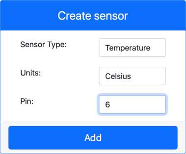

<!--
CO_OP_TRANSLATOR_METADATA:
{
  "original_hash": "70e5a428b607cd5a9a4f422c2a4df03d",
  "translation_date": "2025-08-28T15:15:30+00:00",
  "source_file": "2-farm/lessons/1-predict-plant-growth/virtual-device-temp.md",
  "language_code": "sl"
}
-->
# Merjenje temperature - Virtualna IoT strojna oprema

V tem delu lekcije boste svoji virtualni IoT napravi dodali temperaturni senzor.

## Virtualna strojna oprema

Virtualna IoT naprava bo uporabljala simuliran senzor Grove Digital Humidity and Temperature. To omogoča, da je ta laboratorijska vaja enaka kot uporaba Raspberry Pi z fizičnim senzorjem Grove DHT11.

Senzor združuje **temperaturni senzor** in **senzor vlage**, vendar se v tej lekciji osredotočate le na komponento temperaturnega senzorja. Pri fizični IoT napravi bi bil temperaturni senzor [termistor](https://wikipedia.org/wiki/Thermistor), ki meri temperaturo z zaznavanjem spremembe upornosti ob spremembi temperature. Temperaturni senzorji so običajno digitalni senzorji, ki interno pretvorijo izmerjeno upornost v temperaturo v stopinjah Celzija (ali Kelvina, ali Fahrenheita).

### Dodajanje senzorjev v CounterFit

Za uporabo virtualnega senzorja vlage in temperature morate dodati oba senzorja v aplikacijo CounterFit.

#### Naloga - dodajanje senzorjev v CounterFit

Dodajte senzorje vlage in temperature v aplikacijo CounterFit.

1. Na svojem računalniku ustvarite novo Python aplikacijo v mapi `temperature-sensor` z eno datoteko `app.py`, virtualnim Python okoljem in dodajte CounterFit pip pakete.

    > ⚠️ Če potrebujete, si lahko ogledate [navodila za ustvarjanje in nastavitev CounterFit Python projekta v lekciji 1](../../../1-getting-started/lessons/1-introduction-to-iot/virtual-device.md).

1. Namestite dodatni Pip paket za namestitev CounterFit shima za senzor DHT11. Poskrbite, da to namestite iz terminala z aktiviranim virtualnim okoljem.

    ```sh
    pip install counterfit-shims-seeed-python-dht
    ```

1. Poskrbite, da aplikacija CounterFit web deluje.

1. Ustvarite senzor vlage:

    1. V polju *Create sensor* v razdelku *Sensors* izberite *Sensor type* in nastavite na *Humidity*.

    1. Pustite *Units* nastavljene na *Percentage*.

    1. Poskrbite, da je *Pin* nastavljen na *5*.

    1. Kliknite gumb **Add**, da ustvarite senzor vlage na pinu 5.

    

    Senzor vlage bo ustvarjen in se bo pojavil na seznamu senzorjev.

    

1. Ustvarite senzor temperature:

    1. V polju *Create sensor* v razdelku *Sensors* izberite *Sensor type* in nastavite na *Temperature*.

    1. Pustite *Units* nastavljene na *Celsius*.

    1. Poskrbite, da je *Pin* nastavljen na *6*.

    1. Kliknite gumb **Add**, da ustvarite senzor temperature na pinu 6.

    

    Senzor temperature bo ustvarjen in se bo pojavil na seznamu senzorjev.

    

## Programiranje aplikacije za senzor temperature

Aplikacijo za senzor temperature lahko zdaj programirate z uporabo senzorjev CounterFit.

### Naloga - programiranje aplikacije za senzor temperature

Programirajte aplikacijo za senzor temperature.

1. Poskrbite, da je aplikacija `temperature-sensor` odprta v VS Code.

1. Odprite datoteko `app.py`.

1. Dodajte naslednjo kodo na vrh datoteke `app.py`, da povežete aplikacijo s CounterFit:

    ```python
    from counterfit_connection import CounterFitConnection
    CounterFitConnection.init('127.0.0.1', 5000)
    ```

1. Dodajte naslednjo kodo v datoteko `app.py`, da uvozite potrebne knjižnice:

    ```python
    import time
    from counterfit_shims_seeed_python_dht import DHT
    ```

    Izjava `from seeed_dht import DHT` uvozi razred `DHT` za interakcijo z virtualnim senzorjem Grove temperature z uporabo shima iz modula `counterfit_shims_seeed_python_dht`.

1. Dodajte naslednjo kodo za zgornjo kodo, da ustvarite instanco razreda, ki upravlja virtualni senzor vlage in temperature:

    ```python
    sensor = DHT("11", 5)
    ```

    To deklarira instanco razreda `DHT`, ki upravlja virtualni **D**igitalni **H**umidity in **T**emperature senzor. Prvi parameter pove kodi, da se uporablja virtualni senzor *DHT11*. Drugi parameter pove kodi, da je senzor povezan na port `5`.

    > 💁 CounterFit simulira ta kombinirani senzor vlage in temperature z povezovanjem na 2 senzorja, senzor vlage na pinu, ki je podan ob ustvarjanju razreda `DHT`, in senzor temperature, ki deluje na naslednjem pinu. Če je senzor vlage na pinu 5, shim pričakuje, da je senzor temperature na pinu 6.

1. Dodajte neskončno zanko za zgornjo kodo, da preverjate vrednost senzorja temperature in jo izpišete v konzolo:

    ```python
    while True:
        _, temp = sensor.read()
        print(f'Temperature {temp}°C')
    ```

    Klic `sensor.read()` vrne tuple z vrednostmi vlage in temperature. Potrebujete le vrednost temperature, zato vrednost vlage ignorirate. Vrednost temperature se nato izpiše v konzolo.

1. Na koncu zanke dodajte kratek premor desetih sekund, saj ni potrebno neprekinjeno preverjati ravni temperature. Premor zmanjša porabo energije naprave.

    ```python
    time.sleep(10)
    ```

1. Iz terminala v VS Code z aktiviranim virtualnim okoljem zaženite naslednje, da zaženete svojo Python aplikacijo:

    ```sh
    python app.py
    ```

1. V aplikaciji CounterFit spremenite vrednost senzorja temperature, ki jo bo aplikacija prebrala. To lahko storite na dva načina:

    * Vnesite številko v polje *Value* za senzor temperature in kliknite gumb **Set**. Številka, ki jo vnesete, bo vrednost, ki jo senzor vrne.

    * Označite polje *Random*, vnesite *Min* in *Max* vrednost, nato kliknite gumb **Set**. Vsakič, ko senzor prebere vrednost, bo prebral naključno številko med *Min* in *Max*.

    V konzoli bi morali videti vrednosti, ki ste jih nastavili. Spremenite *Value* ali nastavitve *Random*, da vidite spremembo vrednosti.

    ```output
    (.venv) ➜  temperature-sensor python app.py
    Temperature 28.25°C
    Temperature 30.71°C
    Temperature 25.17°C
    ```

> 💁 To kodo lahko najdete v mapi [code-temperature/virtual-device](../../../../../2-farm/lessons/1-predict-plant-growth/code-temperature/virtual-device).

😀 Vaš program za senzor temperature je bil uspešen!

---

**Omejitev odgovornosti**:  
Ta dokument je bil preveden z uporabo storitve za prevajanje z umetno inteligenco [Co-op Translator](https://github.com/Azure/co-op-translator). Čeprav si prizadevamo za natančnost, vas prosimo, da upoštevate, da lahko avtomatizirani prevodi vsebujejo napake ali netočnosti. Izvirni dokument v njegovem izvirnem jeziku je treba obravnavati kot avtoritativni vir. Za ključne informacije priporočamo profesionalni prevod s strani človeka. Ne prevzemamo odgovornosti za morebitne nesporazume ali napačne razlage, ki bi nastale zaradi uporabe tega prevoda.