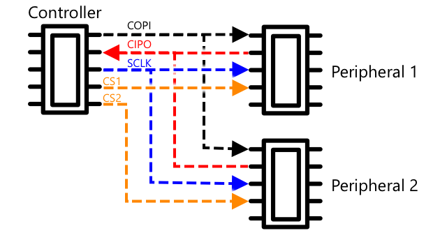

<!--
CO_OP_TRANSLATOR_METADATA:
{
  "original_hash": "4fb20273d299dc8d07a8f06c9cd0cdd9",
  "translation_date": "2025-08-28T14:39:24+00:00",
  "source_file": "2-farm/lessons/2-detect-soil-moisture/README.md",
  "language_code": "sl"
}
-->
C, izgovorjeno *I-kvadrat-C*, je večkrmilniški in večperiferni protokol, kjer lahko katerakoli povezana naprava deluje kot krmilnik ali periferna naprava, ki komunicira prek I²C vodila (ime za komunikacijski sistem, ki prenaša podatke). Podatki se pošiljajo kot naslavljeni paketi, pri čemer vsak paket vsebuje naslov ciljne naprave.

> 💁 Ta model se je v preteklosti imenoval master/slave, vendar se ta terminologija opušča zaradi povezave s suženjstvom. [Open Source Hardware Association je sprejela izraza krmilnik/periferna naprava](https://www.oshwa.org/a-resolution-to-redefine-spi-signal-names/), vendar lahko še vedno naletite na stare izraze.

Naprave imajo naslov, ki se uporablja pri povezovanju na I²C vodilo, in je običajno vnaprej določen na napravi. Na primer, vsak tip Grove senzorja podjetja Seeed ima enak naslov, tako da imajo vsi svetlobni senzorji enak naslov, vsi gumbi imajo enak naslov, ki pa se razlikuje od naslova svetlobnega senzorja. Nekatere naprave omogočajo spreminjanje naslova, na primer z nastavitvijo skakalcev (jumperjev) ali s spajkanjem pinov skupaj.

I²C ima vodilo, sestavljeno iz dveh glavnih žic, skupaj z dvema napajalnima žicama:

| Žica | Ime | Opis |
| ---- | --------- | ----------- |
| SDA | Serijski podatki | Ta žica je namenjena pošiljanju podatkov med napravami. |
| SCL | Serijska ura | Ta žica pošilja signal ure s hitrostjo, ki jo določi krmilnik. |
| VCC | Napetostni skupni kolektor | Napajanje za naprave. Ta žica je povezana z žicama SDA in SCL, da zagotovi njuno napajanje prek pull-up upora, ki izklopi signal, ko nobena naprava ni krmilnik. |
| GND | Ozemljitev | Zagotavlja skupno ozemljitev za električni krog. |

Za pošiljanje podatkov ena naprava sproži začetni pogoj, da pokaže, da je pripravljena na pošiljanje podatkov. Nato postane krmilnik. Krmilnik nato pošlje naslov naprave, s katero želi komunicirati, skupaj z informacijo, ali želi brati ali pisati podatke. Po prenosu podatkov krmilnik pošlje končni pogoj, da označi, da je končal. Po tem lahko druga naprava postane krmilnik in pošilja ali prejema podatke.

2C ima omejitve hitrosti, s tremi različnimi načini, ki delujejo pri fiksnih hitrostih. Najhitrejši je način High Speed z največjo hitrostjo 3,4 Mbps (megabitov na sekundo), čeprav zelo malo naprav podpira to hitrost. Raspberry Pi je na primer omejen na hitri način pri 400 Kbps (kilobitov na sekundo). Standardni način deluje pri 100 Kbps.

> 💠Če uporabljate Raspberry Pi z Grove Base hat kot svojo IoT strojno opremo, boste na plošči videli več I2C vtičnic, ki jih lahko uporabite za komunikacijo s senzorji I2C. Analogni Grove senzorji prav tako uporabljajo I2C z ADC za pošiljanje analognih vrednosti kot digitalne podatke, zato je svetlobni senzor, ki ste ga uporabili, simuliral analogni pin, vrednost pa je bila poslana prek I2C, saj Raspberry Pi podpira le digitalne pine.

### Univerzalni asinhroni sprejemnik-oddajnik (UART)

UART vključuje fizično vezje, ki omogoča komunikacijo med dvema napravama. Vsaka naprava ima 2 komunikacijska pina - oddajni (Tx) in sprejemni (Rx), pri čemer je Tx pin prve naprave povezan z Rx pinom druge naprave, Tx pin druge naprave pa z Rx pinom prve naprave. To omogoča pošiljanje podatkov v obe smeri.

* Naprava 1 pošilja podatke iz svojega Tx pina, ki jih prejme naprava 2 na svojem Rx pinu
* Naprava 1 prejema podatke na svojem Rx pinu, ki jih pošilja naprava 2 iz svojega Tx pina

> 🎓 Podatki se pošiljajo en bit naenkrat, kar je znano kot *serijska* komunikacija. Večina operacijskih sistemov in mikrokontrolerjev ima *serijska vrata*, torej povezave, ki lahko pošiljajo in prejemajo serijske podatke, dostopne vaši kodi.

UART naprave imajo [baud hitrost](https://wikipedia.org/wiki/Symbol_rate) (znano tudi kot simbolna hitrost), kar je hitrost, s katero se podatki pošiljajo in prejemajo v bitih na sekundo. Pogosta baud hitrost je 9.600, kar pomeni, da se vsako sekundo pošlje 9.600 bitov (0 in 1) podatkov.

UART uporablja začetne in končne bite - to pomeni, da pošlje začetni bit, da označi, da bo poslal bajt (8 bitov) podatkov, nato pa končni bit po pošiljanju 8 bitov.

Hitrost UART je odvisna od strojne opreme, vendar tudi najhitrejše implementacije ne presegajo 6,5 Mbps (megabitov na sekundo ali milijonov bitov, 0 ali 1, poslanih na sekundo).

UART lahko uporabljate prek GPIO pinov - en pin lahko nastavite kot Tx in drugega kot Rx, nato pa ju povežete z drugo napravo.

> 💁 Če uporabljate Raspberry Pi z Grove Base hat kot svojo IoT strojno opremo, boste na plošči videli UART vtičnico, ki jo lahko uporabite za komunikacijo s senzorji, ki uporabljajo UART protokol.

### Serijski periferni vmesnik (SPI)

SPI je zasnovan za komunikacijo na kratkih razdaljah, na primer na mikrokontrolerju za komunikacijo s pomnilniško napravo, kot je flash pomnilnik. Temelji na modelu krmilnik/periferija z enim krmilnikom (običajno procesor IoT naprave), ki komunicira z več perifernimi napravami. Krmilnik nadzoruje vse tako, da izbere periferno napravo in pošlje ali zahteva podatke.

> 💠Tako kot pri I2C so izrazi krmilnik in periferija nedavne spremembe, zato boste morda še vedno naleteli na starejše izraze.

SPI krmilniki uporabljajo 3 žice, skupaj z 1 dodatno žico na periferno napravo. Periferne naprave uporabljajo 4 žice. Te žice so:

| Žica | Ime | Opis |
| ---- | --------- | ----------- |
| COPI | Krmilnik izhod, periferija vhod | Ta žica je za pošiljanje podatkov od krmilnika do periferne naprave. |
| CIPO | Krmilnik vhod, periferija izhod | Ta žica je za pošiljanje podatkov od periferne naprave do krmilnika. |
| SCLK | Serijska ura | Ta žica pošilja signal ure s hitrostjo, ki jo nastavi krmilnik. |
| CS   | Izbira čipa | Krmilnik ima več žic, eno na periferno napravo, vsaka žica pa je povezana z žico CS na ustrezni periferni napravi. |

Žica CS se uporablja za aktiviranje ene periferne naprave naenkrat, komunikacijo pa poteka prek žic COPI in CIPO. Ko mora krmilnik zamenjati periferno napravo, deaktivira žico CS, povezano s trenutno aktivno periferno napravo, nato aktivira žico, povezano z naslednjo periferno napravo, s katero želi komunicirati.

SPI je *polni dupleks*, kar pomeni, da lahko krmilnik hkrati pošilja in prejema podatke od iste periferne naprave prek žic COPI in CIPO. SPI uporablja signal ure na žici SCLK za sinhronizacijo naprav, zato za razliko od pošiljanja neposredno prek UART ne potrebuje začetnih in končnih bitov.

Za SPI ni določenih omejitev hitrosti, implementacije pa pogosto omogočajo prenos več megabajtov podatkov na sekundo.

IoT razvojni kompleti pogosto podpirajo SPI prek nekaterih GPIO pinov. Na primer, na Raspberry Pi lahko za SPI uporabite GPIO pine 19, 21, 23, 24 in 26.

### Brezžično

Nekateri senzorji lahko komunicirajo prek standardnih brezžičnih protokolov, kot so Bluetooth (predvsem Bluetooth Low Energy ali BLE), LoRaWAN (nizkoenergijski protokol za **Lo**ng **Ra**nge omrežja) ali WiFi. Ti omogočajo oddaljene senzorje, ki niso fizično povezani z IoT napravo.

Eden takšnih primerov so komercialni senzorji za merjenje vlažnosti tal. Ti merijo vlažnost tal na polju, nato pa podatke pošljejo prek LoRaWAN na osrednjo napravo, ki obdela podatke ali jih pošlje prek interneta. To omogoča, da je senzor oddaljen od IoT naprave, ki upravlja podatke, kar zmanjšuje porabo energije in potrebo po velikih WiFi omrežjih ali dolgih kablih.

BLE je priljubljen za napredne senzorje, kot so fitnes sledilci, ki delujejo na zapestju. Ti združujejo več senzorjev in pošiljajo podatke senzorjev na IoT napravo, kot je vaš telefon, prek BLE.

✅ Imate na sebi, v svojem domu ali šoli kakšne Bluetooth senzorje? Ti lahko vključujejo temperaturne senzorje, senzorje prisotnosti, sledilce naprav in fitnes naprave.

Eden priljubljenih načinov povezovanja komercialnih naprav je Zigbee. Zigbee uporablja WiFi za oblikovanje mrežnih omrežij med napravami, kjer se vsaka naprava poveže s čim več bližnjimi napravami, kar ustvari veliko število povezav, podobnih pajkovi mreži. Ko naprava želi poslati sporočilo na internet, ga pošlje najbližjim napravam, ki ga nato posredujejo naprej drugim bližnjim napravam in tako naprej, dokler ne doseže koordinatorja in se lahko pošlje na internet.

> 🐝 Ime Zigbee se nanaša na ples zibanja medu, ki ga izvajajo čebele po vrnitvi v panj.

## Merjenje ravni vlage v tleh

Raven vlage v tleh lahko izmerite z uporabo senzorja za vlago v tleh, IoT naprave in sobne rastline ali bližnjega kosa zemlje.

### Naloga - merjenje vlage v tleh

Sledite ustreznemu vodniku za merjenje vlage v tleh z uporabo vaše IoT naprave:

* [Arduino - Wio Terminal](wio-terminal-soil-moisture.md)
* [Enoploščni računalnik - Raspberry Pi](pi-soil-moisture.md)
* [Enoploščni računalnik - Virtualna naprava](virtual-device-soil-moisture.md)

## Umerjanje senzorjev

Senzorji se zanašajo na merjenje električnih lastnosti, kot sta upornost ali kapacitivnost.

> 🎓 Upornost, merjena v ohmih (Ω), je, koliko nasprotovanja je električnemu toku, ki potuje skozi nekaj. Ko se na material uporabi napetost, je količina toka, ki gre skozi, odvisna od upornosti materiala. Več o tem lahko preberete na [strani o električni upornosti na Wikipediji](https://wikipedia.org/wiki/Electrical_resistance_and_conductance).

> 🎓 Kapacitivnost, merjena v faradih (F), je sposobnost komponente ali vezja, da zbira in shranjuje električno energijo. Več o kapacitivnosti lahko preberete na [strani o kapacitivnosti na Wikipediji](https://wikipedia.org/wiki/Capacitance).

Te meritve niso vedno uporabne - predstavljajte si temperaturni senzor, ki vam poda meritev 22,5 kΩ! Namesto tega je treba izmerjeno vrednost pretvoriti v uporabno enoto z umerjanjem - torej z ujemanjem izmerjenih vrednosti s količino, ki jo merimo, da omogočimo pretvorbo novih meritev v pravilno enoto.

Nekateri senzorji so že tovarniško umerjeni. Na primer, temperaturni senzor, ki ste ga uporabili v prejšnji lekciji, je bil že umerjen, tako da lahko vrne temperaturno meritev v °C. V tovarni bi bil prvi ustvarjeni senzor izpostavljen vrsti znanih temperatur, upornost pa bi bila izmerjena. To bi nato uporabili za izdelavo izračuna, ki lahko pretvori vrednost, izmerjeno v Ω (enota upornosti), v °C.

> 💁 Formula za izračun upornosti iz temperature se imenuje [Steinhart–Hartova enačba](https://wikipedia.org/wiki/Steinhart–Hart_equation).

### Umerjanje senzorja za vlago v tleh

Vlaga v tleh se meri z gravimetrično ali volumetrično vsebnostjo vode.

* Gravimetrična je teža vode v enoti teže zemlje, merjena kot število kilogramov vode na kilogram suhe zemlje
* Volumetrična je prostornina vode v enoti prostornine zemlje, merjena kot število kubičnih metrov vode na kubične metre suhe zemlje

> 🇺🇸 Za Američane, zaradi skladnosti enot, se to lahko meri v funtih namesto kilogramov ali kubičnih čevljih namesto kubičnih metrov.

Senzorji za vlago v tleh merijo električno upornost ali kapacitivnost - to ne variira le glede na vlago v tleh, temveč tudi glede na vrsto zemlje, saj lahko sestavine v zemlji spremenijo njene električne lastnosti. Idealno bi bilo, da so senzorji umerjeni - torej da se odčitki senzorja primerjajo z meritvami, pridobljenimi z bolj znanstvenim pristopom. Na primer, laboratorij lahko izračuna gravimetrično vlago v tleh z vzorci določenega polja, odvzetimi nekajkrat na leto, te številke pa se uporabijo za umerjanje senzorja, tako da se odčitki senzorja ujemajo z gravimetrično vlago v tleh.

Zgornji graf prikazuje, kako umeriti senzor. Napetost se zajame za vzorec zemlje, ki se nato izmeri v laboratoriju s primerjavo mokre teže s suho težo (z merjenjem teže mokrega vzorca, nato sušenjem v pečici in merjenjem suhega vzorca). Ko je opravljenih nekaj meritev, jih lahko narišemo na graf in prilagodimo črto točkam. Ta črta se nato lahko uporabi za pretvorbo odčitkov senzorja vlage v tleh, ki jih zajame IoT naprava, v dejanske meritve vlage v tleh.

💁 Pri uporabi uporovnih senzorjev za vlago v tleh se napetost povečuje z naraščanjem vlage v tleh. Pri kapacitivnih senzorjih za vlago v tleh se napetost zmanjšuje z naraščanjem vlage v tleh, zato bi grafi za te senzorje padali navzdol, ne navzgor.

Zgornji graf prikazuje odčitek napetosti iz senzorja za vlago v tleh, in s sledenjem tej vrednosti do črte na grafu lahko izračunamo dejansko vlago v tleh.

Ta pristop pomeni, da mora kmet pridobiti le nekaj laboratorijskih meritev za polje, nato pa lahko uporablja IoT naprave za merjenje vlage v tleh - kar drastično pospeši čas za pridobivanje meritev.

---

## 🚀 Izziv

Uporovni in kapacitivni senzorji za vlago v tleh imajo številne razlike. Katere so te razlike in kateri tip (če sploh) je najboljši za uporabo pri kmetu? Ali se odgovor spremeni med razvitimi in nerazvitimi državami?

## Kviz po predavanju

[Kviz po predavanju](https://black-meadow-040d15503.1.azurestaticapps.net/quiz/12)

## Pregled in samostojno učenje

Preberite več o strojni opremi in protokolih, ki jih uporabljajo senzorji in aktuatorji:

* [GPIO Wikipedia stran](https://wikipedia.org/wiki/General-purpose_input/output)
* [UART Wikipedia stran](https://wikipedia.org/wiki/Universal_asynchronous_receiver-transmitter)
* [SPI Wikipedia stran](https://wikipedia.org/wiki/Serial_Peripheral_Interface)
* [I2C Wikipedia stran](https://wikipedia.org/wiki/I²C)
* [Zigbee Wikipedia stran](https://wikipedia.org/wiki/Zigbee)

## Naloga

[Umerite svoj senzor](assignment.md)

---

**Omejitev odgovornosti**:  
Ta dokument je bil preveden z uporabo storitve za prevajanje z umetno inteligenco [Co-op Translator](https://github.com/Azure/co-op-translator). Čeprav si prizadevamo za natančnost, vas prosimo, da upoštevate, da lahko avtomatizirani prevodi vsebujejo napake ali netočnosti. Izvirni dokument v njegovem izvirnem jeziku je treba obravnavati kot avtoritativni vir. Za ključne informacije priporočamo profesionalni človeški prevod. Ne prevzemamo odgovornosti za morebitna napačna razumevanja ali napačne interpretacije, ki bi nastale zaradi uporabe tega prevoda.