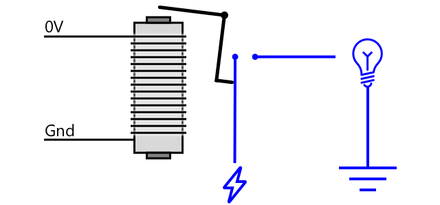

<!--
CO_OP_TRANSLATOR_METADATA:
{
  "original_hash": "f7bb24ba53fb627ddb38a8b24a05e594",
  "translation_date": "2025-08-28T15:20:43+00:00",
  "source_file": "2-farm/lessons/3-automated-plant-watering/README.md",
  "language_code": "sl"
}
-->
# Samodejno zalivanje rastlin


> Sketchnote avtorja [Nitya Narasimhan](https://github.com/nitya). Kliknite na sliko za večjo različico.

Ta lekcija je bila del [IoT za začetnike Projekt 2 - serija Digitalno kmetijstvo](https://youtube.com/playlist?list=PLmsFUfdnGr3yCutmcVg6eAUEfsGiFXgcx) iz [Microsoft Reactor](https://developer.microsoft.com/reactor/?WT.mc_id=academic-17441-jabenn).

[](https://youtu.be/g9FfZwv9R58)

## Predhodni kviz

[Predhodni kviz](https://black-meadow-040d15503.1.azurestaticapps.net/quiz/13)

## Uvod

V prejšnji lekciji ste se naučili, kako spremljati vlažnost zemlje. V tej lekciji se boste naučili, kako zgraditi osnovne komponente sistema za samodejno zalivanje, ki se odziva na vlažnost zemlje. Prav tako boste spoznali časovne vidike – kako senzorji potrebujejo nekaj časa, da se odzovejo na spremembe, in kako aktuatorji potrebujejo čas za spreminjanje lastnosti, ki jih merijo senzorji.

V tej lekciji bomo obravnavali:

* [Upravljanje naprav z visoko močjo z IoT napravo z nizko močjo](../../../../../2-farm/lessons/3-automated-plant-watering)
* [Upravljanje releja](../../../../../2-farm/lessons/3-automated-plant-watering)
* [Upravljanje rastline prek MQTT](../../../../../2-farm/lessons/3-automated-plant-watering)
* [Časovna usklajenost senzorjev in aktuatorjev](../../../../../2-farm/lessons/3-automated-plant-watering)
* [Dodajanje časovne usklajenosti strežniku za upravljanje rastlin](../../../../../2-farm/lessons/3-automated-plant-watering)

## Upravljanje naprav z visoko močjo z IoT napravo z nizko močjo

IoT naprave uporabljajo nizko napetost. Čeprav je to dovolj za senzorje in aktuatorje z nizko močjo, kot so LED diode, je premalo za upravljanje večje strojne opreme, kot je vodna črpalka za namakanje. Tudi majhne črpalke, ki jih lahko uporabite za sobne rastline, porabijo preveč toka za IoT razvojni komplet in bi lahko poškodovale vezje.

> 🎓 Tok, merjen v amperih (A), je količina elektrike, ki se premika skozi vezje. Napetost zagotavlja potisk, tok pa predstavlja količino potiska. Več o toku lahko preberete na [strani o električnem toku na Wikipediji](https://wikipedia.org/wiki/Electric_current).

Rešitev za to je, da črpalko povežete z zunanjim napajalnikom in uporabite aktuator za vklop črpalke, podobno kot bi prižgali luč. Za premik stikala je potrebna majhna količina energije (v obliki energije v vašem telesu), kar poveže luč z električnim omrežjem, ki deluje pri 110V/240V.


> 🎓 [Električno omrežje](https://wikipedia.org/wiki/Mains_electricity) se nanaša na elektriko, ki se dostavlja domovom in podjetjem prek nacionalne infrastrukture v mnogih delih sveta.

✅ IoT naprave običajno zagotavljajo 3.3V ali 5V, pri manj kot 1 amperu (1A) toka. Primerjajte to z električnim omrežjem, ki je najpogosteje pri 230V (120V v Severni Ameriki in 100V na Japonskem) in lahko zagotavlja moč za naprave, ki porabijo 30A.

Obstaja več aktuatorjev, ki to omogočajo, vključno z mehanskimi napravami, ki jih lahko pritrdite na obstoječa stikala in posnemajo premik prsta za vklop. Najbolj priljubljen je rele.

### Releji

Rele je elektromehansko stikalo, ki pretvori električni signal v mehansko gibanje, ki vklopi stikalo. Jedro releja je elektromagnet.

> 🎓 [Elektromagneti](https://wikipedia.org/wiki/Electromagnet) so magneti, ki nastanejo s prehodom elektrike skozi tuljavo žice. Ko je elektrika vklopljena, tuljava postane magnetizirana. Ko je elektrika izklopljena, tuljava izgubi magnetizem.


V releju napaja elektromagnet kontrolno vezje. Ko je elektromagnet vklopljen, potegne ročico, ki premakne stikalo, zapre par kontaktov in dokonča izhodno vezje.



Ko je kontrolno vezje izklopljeno, se elektromagnet izklopi, sprosti ročico in odpre kontakte, kar izklopi izhodno vezje. Releji so digitalni aktuatorji – visok signal na releju ga vklopi, nizek signal ga izklopi.

Izhodno vezje se lahko uporablja za napajanje dodatne strojne opreme, kot je namakalni sistem. IoT naprava lahko vklopi rele, dokonča izhodno vezje, ki napaja namakalni sistem, in rastline se zalijejo. IoT naprava lahko nato izklopi rele, prekine napajanje namakalnega sistema in ustavi vodo.


V zgornjem videu se rele vklopi. LED na releju zasveti, da označi, da je vklopljen (nekateri releji imajo LED diode, ki označujejo, ali je rele vklopljen ali izklopljen), in napajanje se pošlje črpalki, ki se vklopi in črpa vodo v rastlino.

> 💁 Releji se lahko uporabljajo tudi za preklapljanje med dvema izhodnima vezjema namesto za vklop in izklop enega. Ko se ročica premakne, premakne stikalo iz dokončanja enega izhodnega vezja v dokončanje drugega izhodnega vezja, običajno z deljenjem skupne povezave za napajanje ali skupne ozemljitvene povezave.

✅ Raziskujte: Obstaja več vrst relejev, z razlikami, kot so, ali kontrolno vezje vklopi ali izklopi rele, ko je napajanje priključeno, ali več izhodnih vezij. Ugotovite več o teh različnih vrstah.

Ko se ročica premakne, običajno slišite, kako se poveže z elektromagnetom z jasno opredeljenim klikom.

> 💁 Rele se lahko ožičijo tako, da povezava dejansko prekine napajanje releja, kar izklopi rele, ki nato pošlje napajanje nazaj na rele, da ga ponovno vklopi, in tako naprej. To pomeni, da bo rele kliknil izjemno hitro in ustvaril brenčeč zvok. Tako so delovali nekateri prvi zvonci pri električnih vratih.

### Moč releja

Elektromagnet ne potrebuje veliko energije za aktivacijo in premik ročice, lahko ga upravljate z izhodom 3.3V ali 5V iz IoT razvojnega kompleta. Izhodno vezje lahko prenese veliko več energije, odvisno od releja, vključno z napetostjo električnega omrežja ali celo višjimi nivoji moči za industrijsko uporabo. Na ta način lahko IoT razvojni komplet upravlja namakalni sistem, od majhne črpalke za eno rastlino do velikega industrijskega sistema za celotno komercialno kmetijo.


Zgornja slika prikazuje Grove rele. Kontrolno vezje se poveže z IoT napravo in vklopi ali izklopi rele z uporabo 3.3V ali 5V. Izhodno vezje ima dva terminala, od katerih je lahko eden napajanje ali ozemljitev. Izhodno vezje lahko prenese do 250V pri 10A, kar je dovolj za vrsto naprav, ki jih napaja električno omrežje. Na voljo so releji, ki lahko prenesejo še višje nivoje moči.


Na zgornji sliki je črpalka napajana prek releja. Rdeča žica povezuje terminal +5V USB napajalnika z enim terminalom izhodnega vezja releja, druga rdeča žica pa povezuje drugi terminal izhodnega vezja s črpalko. Črna žica povezuje črpalko z ozemljitvijo USB napajalnika. Ko se rele vklopi, dokonča vezje, pošlje 5V črpalki in jo vklopi.

## Upravljanje releja

Rele lahko upravljate z vašim IoT razvojnim kompletom.

### Naloga - upravljanje releja

Sledite ustreznemu vodiču za upravljanje releja z vašo IoT napravo:

* [Arduino - Wio Terminal](wio-terminal-relay.md)
* [Enoploščni računalnik - Raspberry Pi](pi-relay.md)
* [Enoploščni računalnik - Virtualna naprava](virtual-device-relay.md)

## Upravljanje rastline prek MQTT

Do sedaj je vaš rele upravljala IoT naprava neposredno na podlagi enega odčitka vlažnosti zemlje. V komercialnem namakalnem sistemu bo logika upravljanja centralizirana, kar omogoča sprejemanje odločitev o zalivanju na podlagi podatkov iz več senzorjev in omogoča spreminjanje konfiguracije na enem mestu. Za simulacijo tega lahko upravljate rele prek MQTT.

### Naloga - upravljanje releja prek MQTT

1. Dodajte ustrezne knjižnice/pakete za MQTT in kodo v vaš projekt `soil-moisture-sensor`, da se povežete z MQTT. Poimenujte ID odjemalca kot `soilmoisturesensor_client`, pred katerim dodate svojo ID oznako.

    > ⚠️ Lahko se sklicujete na [navodila za povezovanje z MQTT v projektu 1, lekcija 4, če je potrebno](../../../1-getting-started/lessons/4-connect-internet/README.md#connect-your-iot-device-to-mqtt).

1. Dodajte ustrezno kodo naprave za pošiljanje telemetrije z nastavitvami vlažnosti zemlje. Za sporočilo telemetrije poimenujte lastnost `soil_moisture`.

    > ⚠️ Lahko se sklicujete na [navodila za pošiljanje telemetrije v MQTT v projektu 1, lekcija 4, če je potrebno](../../../1-getting-started/lessons/4-connect-internet/README.md#send-telemetry-from-your-iot-device).

1. Ustvarite lokalno strežniško kodo za naročanje na telemetrijo in pošiljanje ukaza za upravljanje releja v mapo `soil-moisture-sensor-server`. Poimenujte lastnost v sporočilu ukaza `relay_on` in nastavite ID odjemalca kot `soilmoisturesensor_server`, pred katerim dodate svojo ID oznako. Ohranite isto strukturo kot strežniška koda, ki ste jo napisali za projekt 1, lekcija 4, saj boste tej kodi dodajali kasneje v tej lekciji.

    > ⚠️ Lahko se sklicujete na [navodila za pošiljanje telemetrije v MQTT](../../../1-getting-started/lessons/4-connect-internet/README.md#write-the-server-code) in [pošiljanje ukazov prek MQTT](../../../1-getting-started/lessons/4-connect-internet/README.md#send-commands-to-the-mqtt-broker) v projektu 1, lekcija 4, če je potrebno.

1. Dodajte ustrezno kodo naprave za upravljanje releja iz prejetih ukazov, z uporabo lastnosti `relay_on` iz sporočila. Pošljite true za `relay_on`, če je `soil_moisture` večji od 450, sicer pošljite false, enako kot logiko, ki ste jo dodali za IoT napravo prej.

    > ⚠️ Lahko se sklicujete na [navodila za odzivanje na ukaze iz MQTT v projektu 1, lekcija 4, če je potrebno](../../../1-getting-started/lessons/4-connect-internet/README.md#handle-commands-on-the-iot-device).

> 💁 To kodo lahko najdete v mapi [code-mqtt](../../../../../2-farm/lessons/3-automated-plant-watering/code-mqtt).

Prepričajte se, da koda deluje na vaši napravi in lokalnem strežniku, ter jo preizkusite s spreminjanjem ravni vlažnosti zemlje, bodisi s spreminjanjem vrednosti, ki jih pošilja virtualni senzor, bodisi s spreminjanjem ravni vlažnosti zemlje z dodajanjem vode ali odstranitvijo senzorja iz zemlje.

## Časovna usklajenost senzorjev in aktuatorjev

V lekciji 3 ste zgradili nočno lučko – LED diodo, ki se prižge takoj, ko senzor zazna nizko raven svetlobe. Senzor svetlobe je takoj zaznal spremembo ravni svetlobe, naprava pa se je lahko hitro odzvala, omejena le z dolžino zamude v funkciji `loop` ali zanko `while True:`. Kot IoT razvijalec pa ne morete vedno računati na tako hiter povratni odziv.

### Časovna usklajenost za vlažnost zemlje

Če ste prejšnjo lekcijo o vlažnosti zemlje izvedli z uporabo fizičnega senzorja, ste verjetno opazili, da je trajalo nekaj sekund, da se je odčitek vlažnosti zemlje znižal po tem, ko ste zalili rastlino. To ni zato, ker bi bil senzor počasen, ampak ker voda potrebuje čas, da se vpije v zemljo.
💁 Če ste zalivali preblizu senzorja, ste morda opazili, da je odčitek hitro padel, nato pa se spet dvignil – to je posledica tega, da se voda v bližini senzorja razširi po preostali zemlji, kar zmanjša vlažnost zemlje pri senzorju.


Na zgornjem diagramu meritev vlažnosti tal pokaže vrednost 658. Rastlina je zalita, vendar se ta vrednost ne spremeni takoj, saj voda še ni dosegla senzorja. Zalivanje se lahko celo konča, preden voda doseže senzor, in šele takrat vrednost pade, da odraža novo raven vlažnosti.

Če bi pisali kodo za nadzor namakalnega sistema prek releja na podlagi ravni vlažnosti tal, bi morali upoštevati ta zamik in v svojo IoT napravo vgraditi pametnejše časovne nastavitve.

✅ Vzemite si trenutek in razmislite, kako bi to lahko izvedli.

### Nadzor časovnih nastavitev senzorja in aktuatorja

Predstavljajte si, da ste zadolženi za izdelavo namakalnega sistema za kmetijo. Glede na vrsto tal je bila idealna raven vlažnosti tal za gojene rastline določena kot analogna napetostna vrednost med 400 in 450.

Napravo bi lahko programirali na enak način kot nočno lučko – ves čas, ko senzor zazna vrednost nad 450, vklopite rele za vklop črpalke. Težava je v tem, da voda potrebuje nekaj časa, da pride od črpalke, skozi zemljo do senzorja. Senzor bo ustavil vodo, ko zazna raven 450, vendar se bo raven vode še naprej zniževala, saj se črpana voda še naprej vpija v zemljo. Končni rezultat je zapravljena voda in tveganje za poškodbe korenin.

✅ Ne pozabite – preveč vode je lahko za rastline enako škodljivo kot premalo, poleg tega pa se s tem zapravlja dragocen vir.

Boljša rešitev je razumeti, da obstaja zamik med vklopom aktuatorja in spremembo lastnosti, ki jo senzor zaznava. To pomeni, da senzor ne sme le počakati nekaj časa, preden ponovno izmeri vrednost, ampak mora aktuator ostati izklopljen nekaj časa, preden se izvede naslednja meritev senzorja.

Kako dolgo naj bo rele vklopljen vsakič? Bolje je biti previden in rele vklopiti le za kratek čas, nato počakati, da se voda vpije, ter nato ponovno preveriti raven vlažnosti. Navsezadnje lahko črpalko vedno znova vklopite, da dodate več vode, vode pa iz zemlje ne morete odstraniti.

> 💁 Takšna časovna kontrola je zelo specifična za IoT napravo, ki jo gradite, lastnost, ki jo merite, ter uporabljene senzorje in aktuatorje.


Na primer, imam jagodno rastlino s senzorjem vlažnosti tal in črpalko, ki jo nadzoruje rele. Opazil sem, da ko dodam vodo, traja približno 20 sekund, da se vrednost vlažnosti tal stabilizira. To pomeni, da moram rele izklopiti in počakati 20 sekund, preden preverim raven vlažnosti. Raje imam premalo vode kot preveč – črpalko lahko vedno znova vklopim, vode pa ne morem odstraniti iz rastline.


To pomeni, da bi bil najboljši proces zalivanja nekaj takega:

* Vklopite črpalko za 5 sekund
* Počakajte 20 sekund
* Preverite vlažnost tal
* Če je raven še vedno nad želeno, ponovite zgornje korake

5 sekund je lahko predolgo za črpalko, še posebej, če so ravni vlažnosti le malo nad zahtevano vrednostjo. Najboljši način za določitev ustreznega časa je preizkusiti, nato prilagoditi na podlagi podatkov senzorja, z nenehnim povratnim krogom. To lahko celo vodi do bolj natančnega časovnega nadzora, na primer vklopa črpalke za 1 sekundo za vsakih 100 nad zahtevano vlažnostjo tal, namesto fiksnih 5 sekund.

✅ Raziskujte: Ali obstajajo drugi časovni dejavniki, ki jih je treba upoštevati? Ali lahko rastlino zalivamo kadarkoli, ko je vlažnost tal prenizka, ali obstajajo določeni časi dneva, ki so primerni ali neprimerni za zalivanje rastlin?

> 💁 Pri nadzoru avtomatiziranih namakalnih sistemov za zunanje gojenje je mogoče upoštevati tudi vremenske napovedi. Če je pričakovano deževje, lahko zalivanje preložimo na čas po dežju. Takrat so tla morda dovolj vlažna, da zalivanje ni potrebno, kar je veliko bolj učinkovito kot zapravljanje vode z zalivanjem tik pred dežjem.

## Dodajte časovne nastavitve svojemu strežniku za nadzor rastlin

Kodo strežnika je mogoče spremeniti, da se doda nadzor nad časovnimi nastavitvami cikla zalivanja in čakanjem na spremembo ravni vlažnosti tal. Logika strežnika za nadzor časovnih nastavitev releja je:

1. Prejeta telemetrijska sporočila
1. Preverite raven vlažnosti tal
1. Če je v redu, ne storite ničesar. Če je vrednost previsoka (kar pomeni, da je vlažnost tal prenizka), potem:
    1. Pošljite ukaz za vklop releja
    1. Počakajte 5 sekund
    1. Pošljite ukaz za izklop releja
    1. Počakajte 20 sekund, da se raven vlažnosti tal stabilizira

Cikel zalivanja, proces od prejema telemetrijskega sporočila do pripravljenosti za obdelavo ravni vlažnosti tal, traja približno 25 sekund. Podatki o vlažnosti tal se pošiljajo vsakih 10 sekund, kar pomeni, da se med čakanjem na stabilizacijo ravni vlažnosti tal lahko prejme novo sporočilo, ki bi lahko sprožilo nov cikel zalivanja.

Obstajata dve možnosti za rešitev tega:

* Spremenite kodo IoT naprave, da telemetrijo pošilja le enkrat na minuto, tako da se cikel zalivanja zaključi pred pošiljanjem naslednjega sporočila
* Med ciklom zalivanja se odjavite od telemetrije

Prva možnost ni vedno dobra rešitev za velike kmetije. Kmet morda želi zajeti ravni vlažnosti tal med zalivanjem za kasnejšo analizo, na primer da bi bil seznanjen s pretokom vode na različnih območjih kmetije za bolj ciljno usmerjeno zalivanje. Druga možnost je boljša – koda preprosto ignorira telemetrijo, ko je ne more uporabiti, vendar je telemetrija še vedno na voljo za druge storitve, ki bi se lahko nanjo naročile.

> 💁 IoT podatki niso poslani le z ene naprave na eno storitev, temveč lahko več naprav pošilja podatke posredniku, več storitev pa lahko posluša podatke od posrednika. Na primer, ena storitev lahko posluša podatke o vlažnosti tal in jih shrani v bazo podatkov za kasnejšo analizo. Druga storitev lahko posluša isto telemetrijo za nadzor namakalnega sistema.

### Naloga - dodajte časovne nastavitve svojemu strežniku za nadzor rastlin

Posodobite kodo strežnika, da rele deluje 5 sekund, nato pa počaka 20 sekund.

1. Odprite mapo `soil-moisture-sensor-server` v VS Code, če še ni odprta. Prepričajte se, da je virtualno okolje aktivirano.

1. Odprite datoteko `app.py`.

1. Dodajte naslednjo kodo v datoteko `app.py` pod obstoječimi uvozi:

    ```python
    import threading
    ```

    Ta izjava uvozi `threading` iz Python knjižnic, kar omogoča Pythonu izvajanje druge kode med čakanjem.

1. Dodajte naslednjo kodo pred funkcijo `handle_telemetry`, ki obravnava telemetrijska sporočila, prejeta s kodo strežnika:

    ```python
    water_time = 5
    wait_time = 20
    ```

    To določa, kako dolgo naj rele deluje (`water_time`) in kako dolgo naj počaka, preden preveri vlažnost tal (`wait_time`).

1. Pod to kodo dodajte naslednje:

    ```python
    def send_relay_command(client, state):
        command = { 'relay_on' : state }
        print("Sending message:", command)
        client.publish(server_command_topic, json.dumps(command))
    ```

    Ta koda definira funkcijo `send_relay_command`, ki pošlje ukaz prek MQTT za nadzor releja. Telemetrija je ustvarjena kot slovar, nato pretvorjena v JSON niz. Vrednost, posredovana v `state`, določa, ali naj bo rele vklopljen ali izklopljen.

1. Po funkciji `send_relay_code` dodajte naslednjo kodo:

    ```python
    def control_relay(client):
        print("Unsubscribing from telemetry")
        mqtt_client.unsubscribe(client_telemetry_topic)
    
        send_relay_command(client, True)
        time.sleep(water_time)
        send_relay_command(client, False)
    
        time.sleep(wait_time)
    
        print("Subscribing to telemetry")
        mqtt_client.subscribe(client_telemetry_topic)
    ```

    Ta funkcija definira nadzor releja na podlagi zahtevanih časovnih nastavitev. Začne se z odjavo od telemetrije, da med zalivanjem sporočila o vlažnosti tal niso obdelana. Nato pošlje ukaz za vklop releja. Nato počaka `water_time`, preden pošlje ukaz za izklop releja. Na koncu počaka, da se raven vlažnosti tal stabilizira za `wait_time` sekund. Nato se ponovno naroči na telemetrijo.

1. Spremenite funkcijo `handle_telemetry` v naslednje:

    ```python
    def handle_telemetry(client, userdata, message):
        payload = json.loads(message.payload.decode())
        print("Message received:", payload)
    
        if payload['soil_moisture'] > 450:
            threading.Thread(target=control_relay, args=(client,)).start()
    ```

    Ta koda preveri raven vlažnosti tal. Če je večja od 450, tla potrebujejo zalivanje, zato pokliče funkcijo `control_relay`. Ta funkcija se izvaja na ločenem niti, ki deluje v ozadju.

1. Prepričajte se, da vaša IoT naprava deluje, nato zaženite to kodo. Spreminjajte ravni vlažnosti tal in opazujte, kaj se zgodi z relejem – moral bi se vklopiti za 5 sekund, nato pa ostati izklopljen vsaj 20 sekund, vklopiti pa se mora le, če ravni vlažnosti tal niso ustrezne.

    ```output
    (.venv) ➜  soil-moisture-sensor-server ✗ python app.py
    Message received: {'soil_moisture': 457}
    Unsubscribing from telemetry
    Sending message: {'relay_on': True}
    Sending message: {'relay_on': False}
    Subscribing to telemetry
    Message received: {'soil_moisture': 302}
    ```

    Dober način za testiranje tega v simuliranem namakalnem sistemu je uporaba suhe zemlje, nato pa ročno dodajanje vode med delovanjem releja, pri čemer prenehate z dodajanjem, ko se rele izklopi.

> 💁 To kodo najdete v mapi [code-timing](../../../../../2-farm/lessons/3-automated-plant-watering/code-timing).

> 💁 Če želite uporabiti črpalko za izdelavo pravega namakalnega sistema, lahko uporabite [6V vodno črpalko](https://www.seeedstudio.com/6V-Mini-Water-Pump-p-1945.html) z [USB napajalnikom](https://www.adafruit.com/product/3628). Prepričajte se, da je napajanje črpalke povezano prek releja.

---

## 🚀 Izziv

Ali lahko pomislite na druge IoT ali električne naprave, ki imajo podoben problem, kjer traja nekaj časa, da rezultati aktuatorja dosežejo senzor? Verjetno jih imate nekaj doma ali v šoli.

* Katere lastnosti merijo?
* Kako dolgo traja, da se lastnost spremeni po uporabi aktuatorja?
* Ali je sprejemljivo, da se lastnost spremeni mimo zahtevane vrednosti?
* Kako jo je mogoče vrniti nazaj na zahtevano vrednost, če je potrebno?

## Kviz po predavanju

[Kviz po predavanju](https://black-meadow-040d15503.1.azurestaticapps.net/quiz/14)

## Pregled in samostojno učenje

* Preberite več o relejih, vključno z njihovo zgodovinsko uporabo v telefonskih centralah, na [strani o relejih na Wikipediji](https://wikipedia.org/wiki/Relay).

## Naloga

[Izdelajte bolj učinkovit cikel zalivanja](assignment.md)

---

**Omejitev odgovornosti**:  
Ta dokument je bil preveden z uporabo storitve za strojno prevajanje [Co-op Translator](https://github.com/Azure/co-op-translator). Čeprav si prizadevamo za natančnost, vas prosimo, da se zavedate, da lahko avtomatizirani prevodi vsebujejo napake ali netočnosti. Izvirni dokument v njegovem izvirnem jeziku je treba obravnavati kot avtoritativni vir. Za ključne informacije priporočamo strokovno človeško prevajanje. Ne prevzemamo odgovornosti za morebitna nesporazumevanja ali napačne razlage, ki izhajajo iz uporabe tega prevoda.