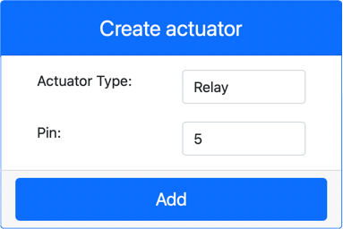

<!--
CO_OP_TRANSLATOR_METADATA:
{
  "original_hash": "f8f541ee945545017a51aaf309aa37c3",
  "translation_date": "2025-08-28T15:22:43+00:00",
  "source_file": "2-farm/lessons/3-automated-plant-watering/virtual-device-relay.md",
  "language_code": "sl"
}
-->
# Upravljanje releja - Virtualna IoT strojna oprema

V tem delu lekcije boste svoji virtualni IoT napravi poleg senzorja za vlago v tleh dodali rele in ga upravljali glede na raven vlage v tleh.

## Virtualna strojna oprema

Virtualna IoT naprava bo uporabljala simuliran Grove rele. To ohranja ta laboratorij enak kot pri uporabi Raspberry Pi z dejanskim Grove relejem.

Pri fizični IoT napravi bi bil rele običajno odprt rele (kar pomeni, da je izhodni krog odprt ali prekinjen, ko releju ni poslan signal). Takšen rele lahko upravlja izhodne kroge do 250V in 10A.

### Dodajanje releja v CounterFit

Za uporabo virtualnega releja ga morate dodati v aplikacijo CounterFit.

#### Naloga

Dodajte rele v aplikacijo CounterFit.

1. Odprite projekt `soil-moisture-sensor` iz prejšnje lekcije v VS Code, če še ni odprt. Dodajali boste v ta projekt.

1. Prepričajte se, da aplikacija CounterFit deluje.

1. Ustvarite rele:

    1. V polju *Create actuator* v podoknu *Actuators* spustite polje *Actuator type* in izberite *Relay*.

    1. Nastavite *Pin* na *5*.

    1. Izberite gumb **Add**, da ustvarite rele na pinu 5.

    

    Rele bo ustvarjen in se bo pojavil na seznamu aktuatorjev.

    

## Programiranje releja

Aplikacijo za senzor vlage v tleh je zdaj mogoče programirati za uporabo virtualnega releja.

### Naloga

Programirajte virtualno napravo.

1. Odprite projekt `soil-moisture-sensor` iz prejšnje lekcije v VS Code, če še ni odprt. Dodajali boste v ta projekt.

1. Dodajte naslednjo kodo v datoteko `app.py` pod obstoječimi uvozi:

    ```python
    from counterfit_shims_grove.grove_relay import GroveRelay
    ```

    Ta ukaz uvozi `GroveRelay` iz knji쬹ic Grove Python shim za interakcijo z virtualnim Grove relejem.

1. Dodajte naslednjo kodo pod deklaracijo razreda `ADC`, da ustvarite instanco `GroveRelay`:

    ```python
    relay = GroveRelay(5)
    ```

    To ustvari rele na pinu **5**, pinu, na katerega ste povezali rele.

1. Da preverite, ali rele deluje, dodajte naslednjo kodo v zanko `while True:`:

    ```python
    relay.on()
    time.sleep(.5)
    relay.off()
    ```

    Koda vklopi rele, počaka 0,5 sekunde, nato pa rele izklopi.

1. Za쬰nite Python aplikacijo. Rele se bo vklapljal in izklapljal vsakih 10 sekund, s polsekundnim zamikom med vklopom in izklopom. Videli boste, kako se virtualni rele v aplikaciji CounterFit zapira in odpira, ko se rele vklaplja in izklaplja.

    

## Upravljanje releja glede na vlago v tleh

Zdaj, ko rele deluje, ga lahko upravljate glede na odčitke vlage v tleh.

### Naloga

Upravljajte rele.

1. Izbrišite 3 vrstice kode, ki ste jih dodali za testiranje releja. Zamenjajte jih z naslednjo kodo na istem mestu:

    ```python
    if soil_moisture > 450:
        print("Soil Moisture is too low, turning relay on.")
        relay.on()
    else:
        print("Soil Moisture is ok, turning relay off.")
        relay.off()
    ```

    Ta koda preveri raven vlage v tleh s senzorjem vlage v tleh. Če je nad 450, vklopi rele, če pa pade pod 450, ga izklopi.

    > 💁 Ne pozabite, da kapacitivni senzor vlage v tleh bere: ni쬵a kot je raven vlage v tleh, več vlage je v tleh, in obratno.

1. Za쬰nite Python aplikacijo. Videli boste, kako se rele vklaplja ali izklaplja glede na raven vlage v tleh. Spremenite *Value* ali *Random* nastavitve za senzor vlage v tleh, da vidite spremembo vrednosti.

    ```output
    Soil Moisture: 638
    Soil Moisture is too low, turning relay on.
    Soil Moisture: 452
    Soil Moisture is too low, turning relay on.
    Soil Moisture: 347
    Soil Moisture is ok, turning relay off.
    ```

> 💁 To kodo lahko najdete v mapi [code-relay/virtual-device](../../../../../2-farm/lessons/3-automated-plant-watering/code-relay/virtual-device).

😀 Vaš program za upravljanje releja z virtualnim senzorjem vlage v tleh je bil uspešen!

---

**Omejitev odgovornosti**:  
Ta dokument je bil preveden z uporabo storitve za prevajanje z umetno inteligenco [Co-op Translator](https://github.com/Azure/co-op-translator). Čeprav si prizadevamo za natančnost, vas prosimo, da upoštevate, da lahko avtomatizirani prevodi vsebujejo napake ali netočnosti. Izvirni dokument v njegovem maternem jeziku je treba obravnavati kot avtoritativni vir. Za ključne informacije priporočamo profesionalni človeški prevod. Ne prevzemamo odgovornosti za morebitna nesporazumevanja ali napačne razlage, ki bi nastale zaradi uporabe tega prevoda.