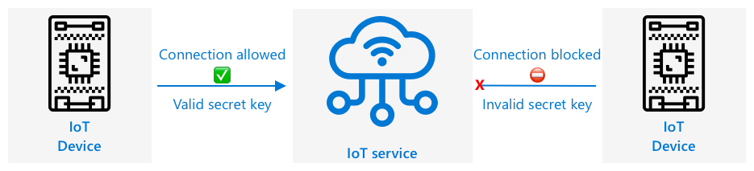

<!--
CO_OP_TRANSLATOR_METADATA:
{
  "original_hash": "4d8e7a066d75b625e7a979c14157041d",
  "translation_date": "2025-08-28T15:00:42+00:00",
  "source_file": "2-farm/lessons/4-migrate-your-plant-to-the-cloud/README.md",
  "language_code": "sl"
}
-->
# Migrirajte svojo rastlino v oblak


> Skica avtorice [Nitya Narasimhan](https://github.com/nitya). Kliknite na sliko za večjo različico.

Ta lekcija je bila predstavljena kot del serije [IoT za začetnike Projekt 2 - Digitalno kmetijstvo](https://youtube.com/playlist?list=PLmsFUfdnGr3yCutmcVg6eAUEfsGiFXgcx) iz [Microsoft Reactor](https://developer.microsoft.com/reactor/?WT.mc_id=academic-17441-jabenn).

[](https://youtu.be/bNxjopXkhvk)

## Kviz pred predavanjem

[Kviz pred predavanjem](https://black-meadow-040d15503.1.azurestaticapps.net/quiz/15)

## Uvod

V prejšnji lekciji ste se naučili, kako povezati svojo rastlino z MQTT posrednikom in upravljati rele s strežniško kodo, ki se izvaja lokalno. To je osnova za internetno povezane avtomatizirane sisteme za zalivanje, ki se uporabljajo tako za posamezne rastline doma kot na komercialnih kmetijah.

IoT naprava je komunicirala z javnim MQTT posrednikom, da bi prikazala osnovna načela, vendar to ni najbolj zanesljiv ali varen način. V tej lekciji boste spoznali oblak in IoT zmogljivosti, ki jih ponujajo javne oblačne storitve. Prav tako se boste naučili, kako migrirati svojo rastlino na eno od teh oblačnih storitev iz javnega MQTT posrednika.

V tej lekciji bomo obravnavali:

* [Kaj je oblak?](../../../../../2-farm/lessons/4-migrate-your-plant-to-the-cloud)
* [Ustvarite naročnino na oblak](../../../../../2-farm/lessons/4-migrate-your-plant-to-the-cloud)
* [Oblačne IoT storitve](../../../../../2-farm/lessons/4-migrate-your-plant-to-the-cloud)
* [Ustvarite IoT storitev v oblaku](../../../../../2-farm/lessons/4-migrate-your-plant-to-the-cloud)
* [Komunicirajte z IoT Hub](../../../../../2-farm/lessons/4-migrate-your-plant-to-the-cloud)
* [Povežite svojo napravo z IoT storitvijo](../../../../../2-farm/lessons/4-migrate-your-plant-to-the-cloud)

## Kaj je oblak?

Pred oblakom so podjetja, ki so želela zagotavljati storitve svojim zaposlenim (kot so baze podatkov ali shranjevanje datotek) ali javnosti (kot so spletne strani), gradila in upravljala podatkovne centre. Ti so segali od sobe z nekaj računalniki do stavbe z mnogimi računalniki. Podjetje je moralo upravljati vse, vključno z:

* Nakupom računalnikov
* Vzdrževanjem strojne opreme
* Napajanjem in hlajenjem
* Omrežjem
* Varnostjo, vključno z varovanjem stavbe in programske opreme na računalnikih
* Namestitvijo in posodobitvijo programske opreme

To je bilo lahko zelo drago, zahtevalo je širok spekter usposobljenih zaposlenih in bilo zelo počasno za prilagoditve. Na primer, če je spletna trgovina želela načrtovati za zasedeno praznično sezono, je morala mesece vnaprej načrtovati nakup dodatne strojne opreme, njeno konfiguracijo, namestitev in namestitev programske opreme za upravljanje prodajnega procesa. Po koncu praznične sezone, ko se je prodaja zmanjšala, so računalniki, za katere so plačali, ostali neizkoriščeni do naslednje zasedene sezone.

✅ Ali menite, da bi to podjetjem omogočilo hitro prilagajanje? Če bi spletni trgovec z oblačili nenadoma postal priljubljen zaradi slavne osebe, ki nosi njihova oblačila, bi lahko hitro povečali računalniško moč, da bi podprli nenaden porast naročil?

### Računalnik nekoga drugega

Oblak se pogosto šaljivo imenuje "računalnik nekoga drugega". Osnovna ideja je bila preprosta - namesto da bi kupovali računalnike, jih najamete od nekoga drugega. Nekdo drug, ponudnik oblačnih storitev, bi upravljal ogromne podatkovne centre. Bil bi odgovoren za nakup in namestitev strojne opreme, upravljanje napajanja in hlajenja, omrežja, varnost stavbe, posodobitve strojne in programske opreme, vse. Kot stranka bi najeli računalnike, ki jih potrebujete, najeli več, ko povpraševanje naraste, in zmanjšali število najemov, ko povpraševanje upade. Ti oblačni podatkovni centri so po vsem svetu.


Ti podatkovni centri so lahko veliki več kvadratnih kilometrov. Zgornje slike so bile posnete pred nekaj leti v Microsoftovem oblačnem podatkovnem centru in prikazujejo začetno velikost ter načrtovano širitev. Očiščeno območje za širitev meri več kot 5 kvadratnih kilometrov.

> 💁 Ti podatkovni centri potrebujejo tako velike količine energije, da imajo nekateri svoje lastne elektrarne. Zaradi svoje velikosti in ravni naložb oblačnih ponudnikov so običajno zelo okolju prijazni. So bolj učinkoviti kot ogromno število majhnih podatkovnih centrov, večinoma delujejo na obnovljivo energijo, oblačni ponudniki pa si prizadevajo zmanjšati odpadke, zmanjšati porabo vode in ponovno zasaditi gozdove, da nadomestijo tiste, ki so bili posekani za gradnjo podatkovnih centrov. Več o tem, kako en oblačni ponudnik dela na trajnosti, lahko preberete na [Azure strani o trajnosti](https://azure.microsoft.com/global-infrastructure/sustainability/?WT.mc_id=academic-17441-jabenn).

✅ Raziskujte: Preberite več o glavnih oblakih, kot sta [Azure od Microsofta](https://azure.microsoft.com/?WT.mc_id=academic-17441-jabenn) ali [GCP od Googla](https://cloud.google.com). Koliko podatkovnih centrov imajo in kje po svetu se nahajajo?

Uporaba oblaka zmanjšuje stroške za podjetja in jim omogoča, da se osredotočijo na to, kar najbolje počnejo, pri čemer strokovno znanje o oblačnem računalništvu prepustijo ponudniku. Podjetjem ni več treba najemati ali kupovati prostora v podatkovnih centrih, plačevati različnim ponudnikom za povezljivost in energijo ali zaposlovati strokovnjakov. Namesto tega lahko plačajo en mesečni račun oblačnemu ponudniku, ki poskrbi za vse.

Oblačni ponudnik lahko nato z ekonomijo obsega zniža stroške, kupuje računalnike v velikih količinah po nižjih cenah, vlaga v orodja za zmanjšanje delovne obremenitve pri vzdrževanju in celo načrtuje ter gradi lastno strojno opremo za izboljšanje svoje oblačne ponudbe.

### Microsoft Azure

Azure je razvijalski oblak podjetja Microsoft, in to je oblak, ki ga boste uporabljali v teh lekcijah. Spodnji video ponuja kratek pregled Azure:

[](https://www.microsoft.com/videoplayer/embed/RE4Ibng?WT.mc_id=academic-17441-jabenn)

## Ustvarite naročnino na oblak

Za uporabo storitev v oblaku se boste morali prijaviti na naročnino pri oblačnem ponudniku. Za to lekcijo se boste prijavili na naročnino Microsoft Azure. Če že imate naročnino na Azure, lahko ta korak preskočite. Podrobnosti o naročnini, opisane tukaj, so pravilne v času pisanja, vendar se lahko spremenijo.

> 💁 Če do teh lekcij dostopate prek svoje šole, imate morda že na voljo naročnino na Azure. Preverite pri svojem učitelju.

Obstajata dve različni vrsti brezplačne naročnine na Azure, na kateri se lahko prijavite:

* **Azure za študente** - To je naročnina, namenjena študentom, starim 18+. Za prijavo ne potrebujete kreditne kartice, uporabite svoj šolski e-poštni naslov za potrditev, da ste študent. Ko se prijavite, dobite 100 USD za porabo za oblačne vire, skupaj z brezplačnimi storitvami, vključno z brezplačno različico IoT storitve. To traja 12 mesecev, in lahko jo obnovite vsako leto, dokler ostanete študent.

* **Brezplačna naročnina na Azure** - To je naročnina za vse, ki niso študenti. Za prijavo na naročnino boste potrebovali kreditno kartico, vendar vaša kartica ne bo zaračunana, to se uporablja samo za preverjanje, da ste resnična oseba, ne bot. Dobite 200 USD kredita za uporabo v prvih 30 dneh za katero koli storitev, skupaj z brezplačnimi nivoji storitev Azure. Ko je vaš kredit porabljen, vaša kartica ne bo zaračunana, razen če se odločite za prehod na naročnino "plačaj po uporabi".

> 💁 Microsoft ponuja tudi naročnino Azure za študente Starter za študente, mlajše od 18 let, vendar ta v času pisanja ne podpira nobenih IoT storitev.

### Naloga - prijavite se na brezplačno naročnino na oblak

Če ste študent, star 18+, se lahko prijavite na naročnino Azure za študente. Potrditev boste morali opraviti s šolskim e-poštnim naslovom. To lahko storite na dva načina:

* Prijavite se za GitHubov paket za študente na [education.github.com/pack](https://education.github.com/pack). To vam omogoča dostop do različnih orodij in ponudb, vključno z GitHubom in Microsoft Azure. Ko se prijavite za paket za razvijalce, lahko nato aktivirate ponudbo Azure za študente.

* Neposredno se prijavite za račun Azure za študente na [azure.microsoft.com/free/students](https://azure.microsoft.com/free/students/?WT.mc_id=academic-17441-jabenn).

> ⚠️ Če vaš šolski e-poštni naslov ni prepoznan, odprite [težavo v tem repozitoriju](https://github.com/Microsoft/IoT-For-Beginners/issues) in preverili bomo, ali ga je mogoče dodati na seznam dovoljenih za Azure za študente.

Če niste študent ali nimate veljavnega šolskega e-poštnega naslova, se lahko prijavite na brezplačno naročnino na Azure.

* Prijavite se za brezplačno naročnino na Azure na [azure.microsoft.com/free](https://azure.microsoft.com/free/?WT.mc_id=academic-17441-jabenn)

## Oblačne IoT storitve

Javni testni MQTT posrednik, ki ste ga uporabljali, je odlično orodje za učenje, vendar ima številne pomanjkljivosti kot orodje za uporabo v komercialnem okolju:

* Zanesljivost - to je brezplačna storitev brez garancij, ki jo je mogoče kadar koli izklopiti
* Varnost - je javna, zato lahko kdorkoli posluša vašo telemetrijo ali pošilja ukaze za upravljanje vaše strojne opreme
* Zmogljivost - zasnovana je za le nekaj testnih sporočil, zato ne bi zmogla velike količine poslanih sporočil
* Odkritje - ni načina, da bi vedeli, katere naprave so povezane

IoT storitve v oblaku rešujejo te težave. Upravljajo jih veliki oblačni ponudniki, ki veliko vlagajo v zanesljivost in so na voljo za odpravljanje morebitnih težav. Imajo vgrajeno varnost, ki preprečuje hekerjem branje vaših podatkov ali pošiljanje lažnih ukazov. Prav tako so visoko zmogljive, saj lahko obdelajo milijone sporočil vsak dan in izkoristijo oblak za prilagajanje potrebam.

> 💁 Čeprav za te prednosti plačate mesečno naročnino, večina oblačnih ponudnikov ponuja brezplačno različico svoje IoT storitve z omejenim številom sporočil na dan ali naprav, ki se lahko povežejo. Ta brezplačna različica je običajno več kot dovolj za razvijalca, da se nauči uporabljati storitev. V tej lekciji boste uporabljali brezplačno različico.

IoT naprave se povežejo z oblačno storitvijo bodisi z uporabo SDK-ja naprave (knjižnice, ki zagotavlja kodo za delo z značilnostmi storitve) bodisi neposredno prek komunikacijskega protokola, kot sta MQTT ali HTTP. SDK naprave je običajno najlažja pot, saj samodejno upravlja vse, na primer, katere teme objaviti ali na katere se naročiti, in kako upravljati varnost.


Vaša naprava nato komunicira z drugimi deli vaše aplikacije prek te storitve - podobno kot ste pošiljali telemetrijo in prejemali ukaze prek MQTT. To se običajno izvaja z uporabo SDK-ja storitve ali podobne knjižnice. Sporočila prihajajo iz vaše naprave v storitev, kjer jih lahko preberejo drugi deli vaše aplikacije, sporočila pa se lahko pošljejo nazaj na vašo napravo.



Te storitve izvajajo varnost tako, da poznajo vse naprave, ki se lahko povežejo in pošiljajo podatke, bodisi tako, da so naprave predhodno registrirane pri storitvi, bodisi tako, da napravam dodelijo tajne ključe ali certifikate, ki jih lahko uporabijo za registracijo pri storitvi ob prvi povezavi. Nepoznane naprave se ne morejo povezati; če poskusijo, storitev zavrne povezavo in ignorira sporočila, ki jih pošljejo.

✅ Raziskujte: Kakšna je slabost odprte IoT storitve, kjer se lahko poveže katera koli naprava ali koda? Ali lahko najdete specifične primere, kjer so hekerji to izkoristili?

Drugi deli vaše aplikacije se lahko povežejo z IoT storitvijo in izvedo, katere naprave so povezane ali registrirane, ter z njimi komunicirajo neposredno, bodisi posamično bodisi v skupinah.
💁 IoT storitve prav tako vključujejo dodatne zmogljivosti, ponudniki oblačnih storitev pa imajo dodatne storitve in aplikacije, ki jih je mogoče povezati s storitvijo. Na primer, če želite shraniti vse telemetrične podatke, ki jih pošiljajo vse naprave, v podatkovno bazo, je običajno potrebnih le nekaj klikov v konfiguracijskem orodju ponudnika oblačnih storitev, da povežete storitev s podatkovno bazo in začnete pretakati podatke.
## Ustvarite IoT storitev v oblaku

Zdaj, ko imate naročnino na Azure, se lahko prijavite za IoT storitev. IoT storitev Microsofta se imenuje Azure IoT Hub.


Spodnji video ponuja kratek pregled Azure IoT Hub:

[](https://www.youtube.com/watch?v=smuZaZZXKsU)

> 🎥 Kliknite zgornjo sliko za ogled videa

✅ Vzemite si trenutek za raziskovanje in preberite pregled IoT Hub v [dokumentaciji Microsoft IoT Hub](https://docs.microsoft.com/azure/iot-hub/about-iot-hub?WT.mc_id=academic-17441-jabenn).

Storitve v oblaku, ki so na voljo v Azure, je mogoče konfigurirati prek spletnega portala ali prek ukazne vrstice (CLI). Za to nalogo boste uporabili CLI.

### Naloga - namestite Azure CLI

Za uporabo Azure CLI ga morate najprej namestiti na svoj računalnik ali Mac.

1. Sledite navodilom v [dokumentaciji Azure CLI](https://docs.microsoft.com/cli/azure/install-azure-cli?WT.mc_id=academic-17441-jabenn) za namestitev CLI.

1. Azure CLI podpira številne razširitve, ki dodajajo zmogljivosti za upravljanje širokega nabora storitev Azure. Namestite IoT razširitev z naslednjim ukazom v ukazni vrstici ali terminalu:

    ```sh
    az extension add --name azure-iot
    ```

1. V ukazni vrstici ali terminalu za prijavo v svojo naročnino na Azure prek Azure CLI zaženite naslednji ukaz:

    ```sh
    az login
    ```

    Spletna stran se bo odprla v vašem privzetem brskalniku. Prijavite se z računom, ki ste ga uporabili za prijavo na naročnino Azure. Ko se prijavite, lahko zaprete zavihek brskalnika.

1. Če imate več naročnin na Azure, na primer šolsko naročnino in svojo naročnino Azure for Students, boste morali izbrati tisto, ki jo želite uporabiti. Zaženite naslednji ukaz za prikaz vseh naročnin, do katerih imate dostop:

    ```sh
    az account list --output table
    ```

    V izpisu boste videli ime vsake naročnine skupaj z njenim `SubscriptionId`.

    ```output
    ➜  ~ az account list --output table
    Name                    CloudName    SubscriptionId                        State    IsDefault
    ----------------------  -----------  ------------------------------------  -------  -----------
    School-subscription     AzureCloud   cb30cde9-814a-42f0-a111-754cb788e4e1  Enabled  True
    Azure for Students      AzureCloud   fa51c31b-162c-4599-add6-781def2e1fbf  Enabled  False
    ```

    Za izbiro naročnine, ki jo želite uporabiti, uporabite naslednji ukaz:

    ```sh
    az account set --subscription <SubscriptionId>
    ```

    Zamenjajte `<SubscriptionId>` z ID-jem naročnine, ki jo želite uporabiti. Po zagonu tega ukaza ponovno zaženite ukaz za prikaz svojih računov. Videli boste, da bo stolpec `IsDefault` označen kot `True` za naročnino, ki ste jo pravkar nastavili.

### Naloga - ustvarite skupino virov

Azure storitve, kot so IoT Hub instance, virtualni stroji, baze podatkov ali AI storitve, se imenujejo **viri**. Vsak vir mora biti del **skupine virov**, logične skupine enega ali več virov.

> 💁 Uporaba skupin virov omogoča upravljanje več storitev hkrati. Na primer, ko končate vse lekcije za ta projekt, lahko izbrišete skupino virov, in vsi viri v njej bodo samodejno izbrisani.

1. Po svetu je več podatkovnih centrov Azure, razdeljenih na regije. Ko ustvarite vir ali skupino virov Azure, morate določiti, kje želite, da se ustvari. Zaženite naslednji ukaz za pridobitev seznama lokacij:

    ```sh
    az account list-locations --output table
    ```

    Videli boste seznam lokacij. Ta seznam bo dolg.

    > 💁 V času pisanja je na voljo 65 lokacij, na katere lahko razporedite vire.

    ```output
        ➜  ~ az account list-locations --output table
    DisplayName               Name                 RegionalDisplayName
    ------------------------  -------------------  -------------------------------------
    East US                   eastus               (US) East US
    East US 2                 eastus2              (US) East US 2
    South Central US          southcentralus       (US) South Central US
    ...
    ```

    Zapišite si vrednost iz stolpca `Name` za regijo, ki je najbližje vam. Regije lahko najdete na zemljevidu na [strani Azure geographies](https://azure.microsoft.com/global-infrastructure/geographies/?WT.mc_id=academic-17441-jabenn).

1. Zaženite naslednji ukaz za ustvarjanje skupine virov z imenom `soil-moisture-sensor`. Imena skupin virov morajo biti edinstvena v vaši naročnini.

    ```sh
    az group create --name soil-moisture-sensor \
                    --location <location>
    ```

    Zamenjajte `<location>` z lokacijo, ki ste jo izbrali v prejšnjem koraku.

### Naloga - ustvarite IoT Hub

Zdaj lahko ustvarite IoT Hub vir v svoji skupini virov.

1. Uporabite naslednji ukaz za ustvarjanje IoT Hub vira:

    ```sh
    az iot hub create --resource-group soil-moisture-sensor \
                      --sku F1 \
                      --partition-count 2 \
                      --name <hub_name>
    ```

    Zamenjajte `<hub_name>` z imenom za vaš hub. To ime mora biti globalno edinstveno - to pomeni, da noben drug IoT Hub, ki ga je kdo ustvaril, ne sme imeti istega imena. To ime se uporablja v URL-ju, ki kaže na hub, zato mora biti edinstveno. Uporabite nekaj, kot je `soil-moisture-sensor-` in dodajte edinstven identifikator na koncu, na primer nekaj naključnih besed ali svoje ime.

    Možnost `--sku F1` pove, da se uporabi brezplačna stopnja. Brezplačna stopnja podpira 8.000 sporočil na dan skupaj z večino funkcij polno plačljivih stopenj.

    > 🎓 Različne cenovne ravni storitev Azure se imenujejo stopnje. Vsaka stopnja ima drugačne stroške in ponuja različne funkcije ali količine podatkov.

    > 💁 Če želite izvedeti več o cenah, si lahko ogledate [vodnik po cenah Azure IoT Hub](https://azure.microsoft.com/pricing/details/iot-hub/?WT.mc_id=academic-17441-jabenn).

    Možnost `--partition-count 2` določa, koliko tokov podatkov podpira IoT Hub. Več particij zmanjša blokiranje podatkov, ko več stvari bere in piše v IoT Hub. Particije so zunaj obsega teh lekcij, vendar je treba to vrednost nastaviti za ustvarjanje IoT Hub brezplačne stopnje.

    > 💁 Na naročnino lahko imate samo en IoT Hub brezplačne stopnje.

IoT Hub bo ustvarjen. To lahko traja minuto ali dve.

## Komunicirajte z IoT Hub

V prejšnji lekciji ste uporabili MQTT in pošiljali sporočila naprej in nazaj na različnih temah, pri čemer so imele različne teme različne namene. Namesto pošiljanja sporočil prek različnih tem IoT Hub ponuja več definiranih načinov za komunikacijo naprave s Hubom ali Huba z napravo.

> 💁 V ozadju ta komunikacija med IoT Hub in vašo napravo lahko uporablja MQTT, HTTPS ali AMQP.

* Sporočila naprava v oblak (D2C) - to so sporočila, ki jih naprava pošlje IoT Hubu, kot je telemetrija. Nato jih lahko prebere vaša aplikacijska koda iz IoT Huba.

    > 🎓 V ozadju IoT Hub uporablja Azure storitev, imenovano [Event Hubs](https://docs.microsoft.com/azure/event-hubs/?WT.mc_id=academic-17441-jabenn). Ko pišete kodo za branje sporočil, poslanih v hub, se ta pogosto imenujejo dogodki.

* Sporočila oblak v napravo (C2D) - to so sporočila, ki jih aplikacijska koda pošlje prek IoT Huba na IoT napravo.

* Zahteve za neposredne metode - to so sporočila, ki jih aplikacijska koda pošlje prek IoT Huba na IoT napravo, da zahteva, da naprava nekaj naredi, na primer upravlja aktuator. Ta sporočila zahtevajo odgovor, da lahko vaša aplikacijska koda ugotovi, ali je bila uspešno obdelana.

* Dvojčki naprav - to so JSON dokumenti, ki se sinhronizirajo med napravo in IoT Hubom ter se uporabljajo za shranjevanje nastavitev ali drugih lastnosti, ki jih naprava poroča ali jih je treba nastaviti na napravi (imenovano želeno) prek IoT Huba.

IoT Hub lahko shranjuje sporočila in zahteve za neposredne metode za nastavljivo obdobje (privzeto en dan), tako da lahko naprava ali aplikacijska koda, ki izgubi povezavo, še vedno pridobi sporočila, poslana medtem ko je bila brez povezave, ko se ponovno poveže. Dvojčki naprav se trajno hranijo v IoT Hubu, tako da se lahko naprava kadarkoli ponovno poveže in pridobi najnovejši dvojček naprave.

✅ Raziskujte: Preberite več o teh vrstah sporočil v [smernicah za komunikacijo naprava v oblak](https://docs.microsoft.com/azure/iot-hub/iot-hub-devguide-d2c-guidance?WT.mc_id=academic-17441-jabenn) in [smernicah za komunikacijo oblak v napravo](https://docs.microsoft.com/azure/iot-hub/iot-hub-devguide-c2d-guidance?WT.mc_id=academic-17441-jabenn) v dokumentaciji IoT Hub.

## Povežite svojo napravo z IoT storitvijo

Ko je hub ustvarjen, se lahko vaša IoT naprava poveže z njim. Samo registrirane naprave se lahko povežejo s storitvijo, zato boste morali najprej registrirati svojo napravo. Ko jo registrirate, lahko pridobite povezovalni niz, ki ga naprava lahko uporabi za povezavo. Ta povezovalni niz je specifičen za napravo in vsebuje informacije o IoT Hubu, napravi ter skrivni ključ, ki omogoča povezavo naprave.

> 🎓 Povezovalni niz je splošen izraz za kos besedila, ki vsebuje podrobnosti povezave. Uporabljajo se pri povezovanju z IoT Hubi, bazami podatkov in mnogimi drugimi storitvami. Običajno vsebujejo identifikator storitve, kot je URL, in varnostne informacije, kot je skrivni ključ. Ti se posredujejo SDK-jem za povezavo s storitvijo.

> ⚠️ Povezovalne nize je treba hraniti varno! Varnost bo podrobneje obravnavana v prihodnji lekciji.

### Naloga - registrirajte svojo IoT napravo

IoT napravo lahko registrirate v svojem IoT Hubu z uporabo Azure CLI.

1. Zaženite naslednji ukaz za registracijo naprave:

    ```sh
    az iot hub device-identity create --device-id soil-moisture-sensor \
                                      --hub-name <hub_name>
    ```

    Zamenjajte `<hub_name>` z imenom, ki ste ga uporabili za svoj IoT Hub.

    To bo ustvarilo napravo z ID-jem `soil-moisture-sensor`.

1. Ko se vaša IoT naprava poveže z vašim IoT Hubom z uporabo SDK-ja, mora uporabiti povezovalni niz, ki vsebuje URL huba skupaj s skrivnim ključem. Zaženite naslednji ukaz za pridobitev povezovalnega niza:

    ```sh
    az iot hub device-identity connection-string show --device-id soil-moisture-sensor \
                                                      --output table \
                                                      --hub-name <hub_name>
    ```

    Zamenjajte `<hub_name>` z imenom, ki ste ga uporabili za svoj IoT Hub.

1. Shranite povezovalni niz, ki je prikazan v izpisu, saj ga boste potrebovali kasneje.

### Naloga - povežite svojo IoT napravo z oblakom

Sledite ustreznemu vodniku za povezavo vaše IoT naprave z oblakom:

* [Arduino - Wio Terminal](wio-terminal-connect-hub.md)
* [Enokartični računalnik - Raspberry Pi/Virtualna IoT naprava](single-board-computer-connect-hub.md)

### Naloga - spremljajte dogodke

Za zdaj ne boste posodabljali svoje strežniške kode. Namesto tega lahko uporabite Azure CLI za spremljanje dogodkov iz vaše IoT naprave.

1. Prepričajte se, da vaša IoT naprava deluje in pošilja telemetrijske vrednosti vlažnosti tal.

1. Zaženite naslednji ukaz v ukazni vrstici ali terminalu za spremljanje sporočil, poslanih v vaš IoT Hub:

    ```sh
    az iot hub monitor-events --hub-name <hub_name>
    ```

    Zamenjajte `<hub_name>` z imenom, ki ste ga uporabili za svoj IoT Hub.

    Videli boste sporočila, ki se pojavijo v izpisu konzole, ko jih pošlje vaša IoT naprava.

    ```output
    Starting event monitor, use ctrl-c to stop...
    {
        "event": {
            "origin": "soil-moisture-sensor",
            "module": "",
            "interface": "",
            "component": "",
            "payload": "{\"soil_moisture\": 376}"
        }
    },
    {
        "event": {
            "origin": "soil-moisture-sensor",
            "module": "",
            "interface": "",
            "component": "",
            "payload": "{\"soil_moisture\": 381}"
        }
    }
    ```

    Vsebina `payload` bo ustrezala sporočilu, ki ga pošlje vaša IoT naprava.

    > V času pisanja razširitev `az iot` ne deluje popolnoma na Apple Silicon. Če uporabljate napravo Apple Silicon, boste morali spremljati sporočila na drugačen način, na primer z uporabo [Azure IoT Tools za Visual Studio Code](https://docs.microsoft.com/en-us/azure/iot-hub/iot-hub-vscode-iot-toolkit-cloud-device-messaging).

1. Ta sporočila imajo številne lastnosti, ki so jim samodejno dodane, kot je časovni žig, ko so bila poslana. Te lastnosti so znane kot *opombe*. Za ogled vseh opomb sporočil uporabite naslednji ukaz:

    ```sh
    az iot hub monitor-events --properties anno --hub-name <hub_name>
    ```

    Zamenjajte `<hub_name>` z imenom, ki ste ga uporabili za svoj IoT Hub.

    Videli boste sporočila, ki se pojavijo v izpisu konzole, ko jih pošlje vaša IoT naprava.

    ```output
    Starting event monitor, use ctrl-c to stop...
    {
        "event": {
            "origin": "soil-moisture-sensor",
            "module": "",
            "interface": "",
            "component": "",
            "properties": {},
            "annotations": {
                "iothub-connection-device-id": "soil-moisture-sensor",
                "iothub-connection-auth-method": "{\"scope\":\"device\",\"type\":\"sas\",\"issuer\":\"iothub\",\"acceptingIpFilterRule\":null}",
                "iothub-connection-auth-generation-id": "637553997165220462",
                "iothub-enqueuedtime": 1619976150288,
                "iothub-message-source": "Telemetry",
                "x-opt-sequence-number": 1379,
                "x-opt-offset": "550576",
                "x-opt-enqueued-time": 1619976150277
            },
            "payload": "{\"soil_moisture\": 381}"
        }
    }
    ```

    Časovne vrednosti v opombah so v [UNIX času](https://wikipedia.org/wiki/Unix_time), ki predstavlja število sekund od polnoči 1. januarja 1970.

    Ko končate, zapustite spremljanje dogodkov.

### Naloga - upravljajte svojo IoT napravo

Azure CLI lahko uporabite tudi za klic neposrednih metod na vaši IoT napravi.

1. Zaženite naslednji ukaz v ukazni vrstici ali terminalu za izvedbo metode `relay_on` na IoT napravi:

    ```sh
    az iot hub invoke-device-method --device-id soil-moisture-sensor \
                                    --method-name relay_on \
                                    --method-payload '{}' \
                                    --hub-name <hub_name>
    ```

    Zamenjajte `
<hub_name>
` z imenom, ki ste ga uporabili za svoj IoT Hub.

    To pošlje zahtevo za neposredno metodo za metodo, določeno z `method-name`. Neposredne metode lahko vsebujejo podatke v obliki JSON, ki jih določite v parametru `method-payload`.

    Videli boste, da se rele vklopi, in ustrezen izhod iz vaše IoT naprave:

    ```output
    Direct method received -  relay_on
    ```

1. Ponovite zgornji korak, vendar nastavite `--method-name` na `relay_off`. Videli boste, da se rele izklopi, in ustrezen izhod iz IoT naprave.

---

## 🚀 Izziv

Brezplačna različica IoT Hub omogoča 8.000 sporočil na dan. Koda, ki ste jo napisali, pošilja telemetrijska sporočila vsakih 10 sekund. Koliko sporočil na dan pomeni eno sporočilo vsakih 10 sekund?

Razmislite, kako pogosto bi morali pošiljati meritve vlažnosti tal? Kako lahko spremenite svojo kodo, da ostanete znotraj brezplačne različice, preverjate tako pogosto, kot je potrebno, vendar ne preveč pogosto? Kaj pa, če bi želeli dodati drugo napravo?

## Kviz po predavanju

[Kviz po predavanju](https://black-meadow-040d15503.1.azurestaticapps.net/quiz/16)

## Pregled in samostojno učenje

IoT Hub SDK je odprtokoden tako za Arduino kot za Python. V repozitorijih kode na GitHubu je na voljo več primerov, ki prikazujejo, kako delati z različnimi funkcijami IoT Hub.

* Če uporabljate Wio Terminal, si oglejte [Arduino primere na GitHubu](https://github.com/Azure/azure-iot-pal-arduino/tree/master/pal/samples)
* Če uporabljate Raspberry Pi ali virtualno napravo, si oglejte [Python primere na GitHubu](https://github.com/Azure/azure-iot-sdk-python/tree/master/azure-iot-hub/samples)

## Naloga

[Spoznajte oblačne storitve](assignment.md)

---

**Omejitev odgovornosti**:  
Ta dokument je bil preveden z uporabo storitve AI za prevajanje [Co-op Translator](https://github.com/Azure/co-op-translator). Čeprav si prizadevamo za natančnost, vas prosimo, da upoštevate, da lahko avtomatizirani prevodi vsebujejo napake ali netočnosti. Izvirni dokument v njegovem izvirnem jeziku je treba obravnavati kot avtoritativni vir. Za ključne informacije priporočamo profesionalni človeški prevod. Ne odgovarjamo za morebitne nesporazume ali napačne razlage, ki bi nastale zaradi uporabe tega prevoda.