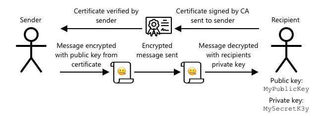

<!--
CO_OP_TRANSLATOR_METADATA:
{
  "original_hash": "81c437c568eee1b0dda1f04e88150d37",
  "translation_date": "2025-08-28T14:54:01+00:00",
  "source_file": "2-farm/lessons/6-keep-your-plant-secure/README.md",
  "language_code": "sl"
}
-->
# Ohranite svojo rastlino varno


> Sketchnote avtorja [Nitya Narasimhan](https://github.com/nitya). Kliknite sliko za večjo različico.

## Kviz pred predavanjem

[Kviz pred predavanjem](https://black-meadow-040d15503.1.azurestaticapps.net/quiz/19)

## Uvod

V zadnjih nekaj lekcijah ste ustvarili IoT napravo za spremljanje vlage v tleh in jo povezali z oblakom. Kaj pa, če bi hekerji, ki delajo za konkurenčnega kmeta, prevzeli nadzor nad vašimi IoT napravami? Kaj, če bi pošiljali visoke odčitke vlage v tleh, da vaše rastline nikoli ne bi bile zalite, ali pa bi zalivalni sistem pustili prižgan ves čas, kar bi povzročilo prekomerno zalivanje in uničenje rastlin ter visoke stroške za vodo?

V tej lekciji se boste naučili, kako zaščititi IoT naprave. Ker je to zadnja lekcija tega projekta, se boste naučili tudi, kako očistiti svoje oblačne vire in tako zmanjšati morebitne stroške.

V tej lekciji bomo obravnavali:

* [Zakaj je treba zaščititi IoT naprave?](../../../../../2-farm/lessons/6-keep-your-plant-secure)
* [Kriptografija](../../../../../2-farm/lessons/6-keep-your-plant-secure)
* [Zaščitite svoje IoT naprave](../../../../../2-farm/lessons/6-keep-your-plant-secure)
* [Ustvarjanje in uporaba X.509 certifikata](../../../../../2-farm/lessons/6-keep-your-plant-secure)

> 🗑 To je zadnja lekcija v tem projektu, zato po zaključku te lekcije in naloge ne pozabite očistiti svojih oblačnih storitev. Storitve boste potrebovali za dokončanje naloge, zato najprej dokončajte nalogo.
>
> Če potrebujete navodila, si oglejte [vodnik za čiščenje projekta](../../../clean-up.md).

## Zakaj je treba zaščititi IoT naprave?

Varnost IoT vključuje zagotavljanje, da se lahko na vašo oblačno IoT storitev povežejo le pričakovane naprave in ji pošiljajo telemetrijo, ter da lahko le vaša oblačna storitev pošilja ukaze vašim napravam. IoT podatki so lahko tudi osebni, vključno z medicinskimi ali intimnimi podatki, zato mora celotna aplikacija upoštevati varnost, da prepreči uhajanje teh podatkov.

Če vaša IoT aplikacija ni varna, obstaja več tveganj:

* Lažna naprava bi lahko pošiljala napačne podatke, kar bi povzročilo napačne odzive aplikacije. Na primer, lahko bi pošiljala stalno visoke odčitke vlage v tleh, zaradi česar se vaš namakalni sistem nikoli ne bi vklopil in bi vaše rastline umrle zaradi pomanjkanja vode.
* Neavtorizirani uporabniki bi lahko brali podatke iz IoT naprav, vključno z osebnimi ali poslovno kritičnimi podatki.
* Hekerji bi lahko pošiljali ukaze za nadzor naprave na način, ki bi lahko povzročil škodo napravi ali povezani strojni opremi.
* S povezovanjem na IoT napravo bi hekerji lahko dostopali do dodatnih omrežij in pridobili dostop do zasebnih sistemov.
* Zlonamerni uporabniki bi lahko dostopali do osebnih podatkov in jih uporabili za izsiljevanje.

To so resnični scenariji, ki se dogajajo ves čas. Nekaj primerov je bilo predstavljenih v prejšnjih lekcijah, tukaj pa so še nekateri:

* Leta 2018 so hekerji uporabili odprto WiFi dostopno točko na termostatu za ribji akvarij, da so pridobili dostop do omrežja igralnice in ukradli podatke. [The Hacker News - Casino Gets Hacked Through Its Internet-Connected Fish Tank Thermometer](https://thehackernews.com/2018/04/iot-hacking-thermometer.html)
* Leta 2016 je Mirai Botnet izvedel napad zavrnitve storitve (DDoS) na Dyn, ponudnika internetnih storitev, kar je povzročilo izpad velikih delov interneta. Ta botnet je uporabljal zlonamerno programsko opremo za povezovanje z IoT napravami, kot so DVR-ji in kamere, ki so uporabljale privzeta uporabniška imena in gesla, ter od tam izvedel napad. [The Guardian - DDoS attack that disrupted internet was largest of its kind in history, experts say](https://www.theguardian.com/technology/2016/oct/26/ddos-attack-dyn-mirai-botnet)
* Spiral Toys je imel bazo podatkov uporabnikov svojih povezanih igrač CloudPets javno dostopno prek interneta. [Troy Hunt - Data from connected CloudPets teddy bears leaked and ransomed, exposing kids' voice messages](https://www.troyhunt.com/data-from-connected-cloudpets-teddy-bears-leaked-and-ransomed-exposing-kids-voice-messages/).
* Strava je označevala tekače, ki ste jih pretekli, in prikazovala njihove poti, kar je tujcem omogočilo, da so dejansko videli, kje živite. [Kim Komndo - Fitness app could lead a stranger right to your home — change this setting](https://www.komando.com/security-privacy/strava-fitness-app-privacy/755349/).

✅ Raziskujte: Poiščite več primerov vdorov v IoT in kršitev podatkov IoT, še posebej pri osebnih predmetih, kot so internetno povezane zobne ščetke ali tehtnice. Razmislite o vplivu teh vdorov na žrtve ali stranke.

> 💁 Varnost je obsežna tema, in ta lekcija bo obravnavala le nekaj osnovnih vidikov povezovanja vaše naprave z oblakom. Druge teme, ki jih ne bomo obravnavali, vključujejo spremljanje sprememb podatkov med prenosom, neposredno vdiranje v naprave ali spreminjanje konfiguracij naprav. Zaradi grožnje vdorov v IoT so bila razvita orodja, kot je [Azure Defender for IoT](https://azure.microsoft.com/services/azure-defender-for-iot/?WT.mc_id=academic-17441-jabenn). Ta orodja so podobna protivirusnim in varnostnim orodjem, ki jih imate na svojem računalniku, le da so zasnovana za majhne, nizko zmogljive IoT naprave.

## Kriptografija

Ko se naprava poveže z IoT storitvijo, uporablja ID za identifikacijo. Težava je v tem, da je ta ID mogoče klonirati - heker bi lahko nastavil zlonamerno napravo, ki uporablja isti ID kot prava naprava, vendar pošilja lažne podatke.


Rešitev tega problema je pretvorba podatkov, ki se pošiljajo, v zakodirano obliko, pri čemer se uporabi vrednost, ki jo poznata le naprava in oblak. Ta postopek se imenuje *šifriranje*, vrednost, uporabljena za šifriranje podatkov, pa se imenuje *ključ za šifriranje*.


Oblačna storitev lahko nato podatke pretvori nazaj v berljivo obliko s postopkom, imenovanim *dešifriranje*, pri čemer uporabi isti ključ za šifriranje ali *ključ za dešifriranje*. Če šifriranega sporočila ni mogoče dešifrirati s ključem, je bila naprava vdrta in sporočilo zavrnjeno.

Tehnika za izvajanje šifriranja in dešifriranja se imenuje *kriptografija*.

### Zgodnja kriptografija

Najzgodnejše vrste kriptografije so bile šifre z zamenjavo, ki segajo 3.500 let nazaj. Šifre z zamenjavo vključujejo zamenjavo ene črke z drugo. Na primer, [Cezarjeva šifra](https://wikipedia.org/wiki/Caesar_cipher) vključuje premik abecede za določeno število mest, pri čemer le pošiljatelj šifriranega sporočila in predvideni prejemnik vesta, za koliko črk premakniti.

[Vigenèrova šifra](https://wikipedia.org/wiki/Vigenère_cipher) je šla še dlje, saj je za šifriranje besedila uporabljala besede, tako da je bila vsaka črka v izvirnem besedilu premaknjena za različno število mest, namesto da bi se vedno premikala za isto število črk.

Kriptografija se je uporabljala za širok spekter namenov, kot so zaščita recepta za glazuro lončarjev v stari Mezopotamiji, pisanje skrivnih ljubezenskih sporočil v Indiji ali ohranjanje skrivnosti staroegipčanskih magičnih urokov.

### Sodobna kriptografija

Sodobna kriptografija je veliko bolj napredna, zaradi česar jo je težje razbiti kot zgodnje metode. Sodobna kriptografija uporablja zapletene matematične metode za šifriranje podatkov z ogromnim številom možnih ključev, kar onemogoča napade z grobo silo.

Kriptografija se uporablja na veliko različnih načinov za varno komunikacijo. Če to stran berete na GitHubu, boste morda opazili, da se naslov spletnega mesta začne z *HTTPS*, kar pomeni, da je komunikacija med vašim brskalnikom in spletnimi strežniki GitHuba šifrirana. Če bi kdo lahko prebral internetni promet med vašim brskalnikom in GitHubom, podatkov ne bi mogel prebrati, saj so šifrirani. Vaš računalnik lahko celo šifrira vse podatke na vašem trdem disku, tako da, če vam ga kdo ukrade, brez vašega gesla ne bo mogel prebrati nobenih podatkov.

> 🎓 HTTPS pomeni HyperText Transfer Protocol **Secure**

Na žalost ni vse varno. Nekatere naprave nimajo nobene varnosti, druge so zaščitene z enostavno razbitimi ključi, včasih pa celo vse naprave istega tipa uporabljajo isti ključ. Obstajajo poročila o zelo osebnih IoT napravah, ki imajo vse isto geslo za povezavo prek WiFi ali Bluetooth. Če se lahko povežete na svojo napravo, se lahko povežete tudi na napravo nekoga drugega. Ko ste povezani, lahko dostopate do zelo zasebnih podatkov ali prevzamete nadzor nad njihovo napravo.

> 💁 Kljub zapletenosti sodobne kriptografije in trditvam, da lahko razbijanje šifriranja traja milijarde let, je razvoj kvantnega računalništva prinesel možnost razbijanja vseh znanih šifriranj v zelo kratkem času!

### Simetrični in asimetrični ključi

Šifriranje obstaja v dveh vrstah - simetrično in asimetrično.

**Simetrično** šifriranje uporablja isti ključ za šifriranje in dešifriranje podatkov. Tako pošiljatelj kot prejemnik morata poznati isti ključ. To je najmanj varna vrsta, saj je treba ključ nekako deliti. Da bi pošiljatelj poslal šifrirano sporočilo prejemniku, bi moral pošiljatelj najprej poslati ključ prejemniku.


Če je ključ ukraden med prenosom ali če je pošiljatelj ali prejemnik vdrt in je ključ najden, je šifriranje razbito.


**Asimetrično** šifriranje uporablja 2 ključa - ključ za šifriranje in ključ za dešifriranje, imenovana javni/zasebni par ključev. Javni ključ se uporablja za šifriranje sporočila, vendar ga ni mogoče uporabiti za dešifriranje, zasebni ključ pa se uporablja za dešifriranje sporočila, vendar ga ni mogoče uporabiti za šifriranje.


Prejemnik deli svoj javni ključ, pošiljatelj pa ga uporabi za šifriranje sporočila. Ko je sporočilo poslano, ga prejemnik dešifrira s svojim zasebnim ključem. Asimetrično šifriranje je bolj varno, saj prejemnik zasebni ključ hrani zasebno in ga nikoli ne deli. Javni ključ lahko ima kdorkoli, saj se lahko uporablja le za šifriranje sporočil.

Simetrično šifriranje je hitrejše od asimetričnega, asimetrično pa je bolj varno. Nekateri sistemi uporabljajo oboje - asimetrično šifriranje za šifriranje in deljenje simetričnega ključa, nato pa simetrični ključ za šifriranje vseh podatkov. To omogoča varnejše deljenje simetričnega ključa med pošiljateljem in prejemnikom ter hitrejše šifriranje in dešifriranje podatkov.

## Zaščitite svoje IoT naprave

IoT naprave je mogoče zaščititi s simetričnim ali asimetričnim šifriranjem. Simetrično je enostavnejše, vendar manj varno.

### Simetrični ključi

Ko ste nastavili svojo IoT napravo za interakcijo z IoT Hubom, ste uporabili povezovalni niz. Primer povezovalnega niza je:

```output
HostName=soil-moisture-sensor.azure-devices.net;DeviceId=soil-moisture-sensor;SharedAccessKey=Bhry+ind7kKEIDxubK61RiEHHRTrPl7HUow8cEm/mU0=
```

Ta povezovalni niz je sestavljen iz treh delov, ločenih s podpičji, pri čemer je vsak del ključ in vrednost:

| Ključ | Vrednost | Opis |
| --- | ----- | ----------- |
| HostName | `soil-moisture-sensor.azure-devices.net` | URL IoT Huba |
| DeviceId | `soil-moisture-sensor` | Edinstveni ID naprave |
| SharedAccessKey | `Bhry+ind7kKEIDxubK61RiEHHRTrPl7HUow8cEm/mU0=` | Simetrični ključ, ki ga poznata naprava in IoT Hub |

Zadnji del tega povezovalnega niza, `SharedAccessKey`, je simetrični ključ, ki ga poznata tako naprava kot IoT Hub. Ta ključ se nikoli ne pošlje z naprave v oblak ali iz oblaka na napravo. Namesto tega se uporablja za šifriranje podatkov, ki se pošiljajo ali prejemajo.

✅ Naredite poskus. Kaj mislite, da se bo zgodilo, če spremenite del `SharedAccessKey` v povezovalnem nizu, ko povezujete svojo IoT napravo? Preizkusite.

Ko se naprava prvič poskuša povezati, pošlje žeton za skupni dostop (SAS), ki vsebuje URL IoT Huba, čas poteka veljavnosti dostopnega žetona (običajno 1 dan od trenutnega časa) in podpis. Ta podpis vsebuje URL in čas poteka, šifriran s ključem za skupni dostop iz povezovalnega niza.

IoT Hub ta podpis dešifrira s ključem za skupni dostop in, če se dešifrirana vrednost ujema z URL-jem in časom poteka, naprava dobi dovoljenje za povezavo. Prav tako preveri, ali je trenutni čas pred časom poteka, da prepreči zlonamerni napravi, da bi zajela SAS žeton prave naprave in ga uporabila.

To je eleganten način za preverjanje, ali je pošiljatelj prava naprava. S pošiljanjem znanih podatkov v dešifrirani in šifrirani obliki lahko strežnik preveri napravo tako, da zagotovi, da se pri dešifriranju šifriranih podatkov rezultat ujema z dešifrirano različico, ki je bila poslana. Če se ujema, potem imata pošiljatelj in prejemnik isti simetrični ključ za šifriranje.
💁 Zaradi časa poteka mora vaša IoT naprava poznati natančen čas, ki ga običajno pridobi s strežnika [NTP](https://wikipedia.org/wiki/Network_Time_Protocol). Če čas ni natančen, bo povezava neuspešna.
Po povezavi bodo vsi podatki, poslani v IoT Hub iz naprave ali iz IoT Hub v napravo, šifrirani z deljenim dostopnim ključem.

✅ Kaj mislite, kaj se bo zgodilo, če več naprav deli isto povezovalno niz?

> 💁 Slaba varnostna praksa je shranjevanje tega ključa v kodi. Če heker pridobi vašo izvorno kodo, lahko pridobi vaš ključ. Prav tako je težje pri izdaji kode, saj bi morali za vsako napravo ponovno prevesti kodo z posodobljenim ključem. Bolje je, da ta ključ naložite iz strojnega varnostnega modula - čipa na IoT napravi, ki shranjuje šifrirane vrednosti, ki jih lahko bere vaša koda.
>
> Pri učenju IoT je pogosto lažje ključ vključiti v kodo, kot ste to storili v prejšnji lekciji, vendar morate zagotoviti, da ta ključ ni vključen v javni nadzor izvorne kode.

Naprave imajo 2 ključa in 2 ustrezna povezovalna niza. To omogoča rotacijo ključev - to pomeni preklop z enega ključa na drugega, če je prvi ogrožen, in ponovno generiranje prvega ključa.

### X.509 certifikati

Ko uporabljate asimetrično šifriranje z javnim/zasebnim parom ključev, morate svojo javni ključ posredovati vsakomur, ki vam želi poslati podatke. Težava je v tem, kako lahko prejemnik vašega ključa zagotovi, da je to res vaš javni ključ, ne pa nekdo, ki se pretvarja, da ste vi? Namesto da posredujete ključ, lahko posredujete svoj javni ključ znotraj certifikata, ki ga je preverila zaupanja vredna tretja oseba, imenovana X.509 certifikat.

X.509 certifikati so digitalni dokumenti, ki vsebujejo javni del para javni/zasebni ključ. Običajno jih izdajo ene izmed številnih zaupanja vrednih organizacij, imenovanih [Certifikacijski organi](https://wikipedia.org/wiki/Certificate_authority) (CA), in jih digitalno podpiše CA, da označi, da je ključ veljaven in prihaja od vas. Certifikatu zaupate in verjamete, da je javni ključ od tistega, ki ga certifikat navaja, ker zaupate CA, podobno kot bi zaupali potnemu listu ali vozniškemu dovoljenju, ker zaupate državi, ki ga izdaja. Certifikati stanejo denar, zato lahko tudi 'sami podpišete', torej ustvarite certifikat sami, ki ga podpišete sami, za namene testiranja.

> 💁 Nikoli ne uporabljajte samopodpisanega certifikata za produkcijsko izdajo.

Ti certifikati vsebujejo številna polja, vključno s tem, od koga je javni ključ, podrobnosti o CA, ki ga je izdal, kako dolgo je veljaven, in sam javni ključ. Pred uporabo certifikata je dobra praksa, da ga preverite, tako da preverite, ali ga je podpisal originalni CA.

✅ Celoten seznam polj v certifikatu si lahko preberete v [Microsoftovem vodiču za razumevanje X.509 javnih ključnih certifikatov](https://docs.microsoft.com/azure/iot-hub/tutorial-x509-certificates?WT.mc_id=academic-17441-jabenn#certificate-fields).

Pri uporabi X.509 certifikatov imata tako pošiljatelj kot prejemnik svoje javne in zasebne ključe ter oba imata X.509 certifikate, ki vsebujejo javni ključ. Nato si nekako izmenjata X.509 certifikate, pri čemer uporabljata javne ključe drug drugega za šifriranje podatkov, ki jih pošiljata, in svoje zasebne ključe za dešifriranje podatkov, ki jih prejemata.



Ena velika prednost uporabe X.509 certifikatov je, da jih je mogoče deliti med napravami. Lahko ustvarite en certifikat, ga naložite v IoT Hub in ga uporabite za vse svoje naprave. Vsaka naprava mora nato poznati le zasebni ključ za dešifriranje sporočil, ki jih prejme od IoT Hub.

Certifikat, ki ga vaša naprava uporablja za šifriranje sporočil, ki jih pošilja v IoT Hub, objavi Microsoft. To je isti certifikat, ki ga uporablja veliko Azure storitev, in je včasih vgrajen v SDK-je.

> 💁 Ne pozabite, javni ključ je ravno to - javen. Azure javni ključ se lahko uporablja samo za šifriranje podatkov, poslanih Azure, ne pa za njihovo dešifriranje, zato ga je mogoče deliti povsod, vključno z izvorno kodo. Na primer, lahko ga vidite v [Azure IoT C SDK izvorni kodi](https://github.com/Azure/azure-iot-sdk-c/blob/master/certs/certs.c).

✅ Obstaja veliko žargona pri X.509 certifikatih. Definicije nekaterih izrazov, na katere lahko naletite, si lahko preberete v [Vodiču za laike o žargonu X.509 certifikatov](https://techcommunity.microsoft.com/t5/internet-of-things/the-layman-s-guide-to-x-509-certificate-jargon/ba-p/2203540?WT.mc_id=academic-17441-jabenn).

## Ustvarjanje in uporaba X.509 certifikata

Koraki za ustvarjanje X.509 certifikata so:

1. Ustvarite par javni/zasebni ključ. Eden najbolj razširjenih algoritmov za ustvarjanje para javni/zasebni ključ se imenuje [Rivest–Shamir–Adleman](https://wikipedia.org/wiki/RSA_(cryptosystem))(RSA).

1. Pošljite javni ključ z ustreznimi podatki za podpis, bodisi pri CA bodisi s samopodpisovanjem.

Azure CLI ima ukaze za ustvarjanje nove identitete naprave v IoT Hub in samodejno generiranje para javni/zasebni ključ ter ustvarjanje samopodpisanega certifikata.

> 💁 Če želite videti korake podrobno, namesto uporabe Azure CLI, jih lahko najdete v [Vodiču za uporabo OpenSSL za ustvarjanje samopodpisanih certifikatov v Microsoftovi dokumentaciji IoT Hub](https://docs.microsoft.com/azure/iot-hub/tutorial-x509-self-sign?WT.mc_id=academic-17441-jabenn).

### Naloga - ustvarite identiteto naprave z uporabo X.509 certifikata

1. Za registracijo nove identitete naprave, samodejno generiranje ključev in certifikatov, zaženite naslednji ukaz:

    ```sh
    az iot hub device-identity create --device-id soil-moisture-sensor-x509 \
                                      --am x509_thumbprint \
                                      --output-dir . \
                                      --hub-name <hub_name>
    ```

    Zamenjajte `<hub_name>` z imenom, ki ste ga uporabili za svoj IoT Hub.

    To bo ustvarilo napravo z ID-jem `soil-moisture-sensor-x509`, da jo ločite od identitete naprave, ki ste jo ustvarili v prejšnji lekciji. Ta ukaz bo prav tako ustvaril 2 datoteki v trenutni mapi:

    * `soil-moisture-sensor-x509-key.pem` - ta datoteka vsebuje zasebni ključ za napravo.
    * `soil-moisture-sensor-x509-cert.pem` - to je datoteka X.509 certifikata za napravo.

    Te datoteke hranite na varnem! Datoteke zasebnega ključa ne smete vključiti v javni nadzor izvorne kode.

### Naloga - uporabite X.509 certifikat v kodi svoje naprave

Sledite ustreznemu vodiču za povezavo svoje IoT naprave s cloudom z uporabo X.509 certifikata:

* [Arduino - Wio Terminal](wio-terminal-x509.md)
* [Enobočna računalnika - Raspberry Pi/Virtualna IoT naprava](single-board-computer-x509.md)

---

## 🚀 Izziv

Obstaja več načinov za ustvarjanje, upravljanje in brisanje Azure storitev, kot so Resource Groups in IoT Hubs. Eden od načinov je [Azure Portal](https://portal.azure.com?WT.mc_id=academic-17441-jabenn) - spletni vmesnik, ki vam omogoča GUI za upravljanje vaših Azure storitev.

Obiščite [portal.azure.com](https://portal.azure.com?WT.mc_id=academic-17441-jabenn) in raziščite portal. Poskusite ustvariti IoT Hub z uporabo portala, nato pa ga izbrišite.

**Namig** - pri ustvarjanju storitev prek portala vam ni treba vnaprej ustvariti Resource Group, ena se lahko ustvari med ustvarjanjem storitve. Poskrbite, da jo izbrišete, ko končate!

Veliko dokumentacije, vodičev in navodil o Azure Portalu lahko najdete v [Azure portal dokumentaciji](https://docs.microsoft.com/azure/azure-portal/?WT.mc_id=academic-17441-jabenn).

## Kviz po predavanju

[Kviz po predavanju](https://black-meadow-040d15503.1.azurestaticapps.net/quiz/20)

## Pregled in samostojno učenje

* Preberite zgodovino kriptografije na [Strani o zgodovini kriptografije na Wikipediji](https://wikipedia.org/wiki/History_of_cryptography).
* Preberite o X.509 certifikatih na [Strani o X.509 na Wikipediji](https://wikipedia.org/wiki/X.509).

## Naloga

[Ustvarite novo IoT napravo](assignment.md)

---

**Omejitev odgovornosti**:  
Ta dokument je bil preveden z uporabo storitve za prevajanje z umetno inteligenco [Co-op Translator](https://github.com/Azure/co-op-translator). Čeprav si prizadevamo za natančnost, vas prosimo, da upoštevate, da lahko avtomatizirani prevodi vsebujejo napake ali netočnosti. Izvirni dokument v njegovem maternem jeziku je treba obravnavati kot avtoritativni vir. Za ključne informacije priporočamo profesionalni človeški prevod. Ne prevzemamo odgovornosti za morebitna napačna razumevanja ali napačne interpretacije, ki izhajajo iz uporabe tega prevoda.