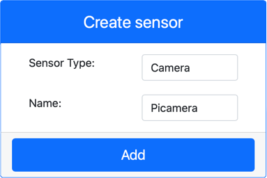

<!--
CO_OP_TRANSLATOR_METADATA:
{
  "original_hash": "3ba7150ffc4a6999f6c3cfb4906ec7df",
  "translation_date": "2025-08-28T12:28:13+00:00",
  "source_file": "4-manufacturing/lessons/2-check-fruit-from-device/virtual-device-camera.md",
  "language_code": "sl"
}
-->
# Zajem slike - Virtualna IoT strojna oprema

V tem delu lekcije boste svoji virtualni IoT napravi dodali senzor kamere in iz njega prebrali slike.

## Strojna oprema

Virtualna IoT naprava bo uporabljala simulirano kamero, ki pošilja slike bodisi iz datotek bodisi iz vaše spletne kamere.

### Dodajanje kamere v CounterFit

Za uporabo virtualne kamere jo morate dodati v aplikacijo CounterFit.

#### Naloga - dodajte kamero v CounterFit

Dodajte kamero v aplikacijo CounterFit.

1. Na svojem računalniku ustvarite novo Python aplikacijo v mapi z imenom `fruit-quality-detector` z eno datoteko z imenom `app.py` in Python virtualnim okoljem ter dodajte CounterFit pip pakete.

    > ⚠️ Po potrebi si lahko ogledate [navodila za ustvarjanje in nastavitev CounterFit Python projekta v lekciji 1](../../../1-getting-started/lessons/1-introduction-to-iot/virtual-device.md).

1. Namestite dodaten Pip paket za namestitev CounterFit shima, ki lahko komunicira s senzorji kamere s simulacijo nekaterih funkcij [Picamera Pip paketa](https://pypi.org/project/picamera/). Prepričajte se, da to nameščate iz terminala z aktiviranim virtualnim okoljem.

    ```sh
    pip install counterfit-shims-picamera
    ```

1. Prepričajte se, da je spletna aplikacija CounterFit zagnana.

1. Ustvarite kamero:

    1. V polju *Create sensor* v podoknu *Sensors* izberite spustni meni *Sensor type* in izberite *Camera*.

    1. Nastavite *Name* na `Picamera`.

    1. Izberite gumb **Add**, da ustvarite kamero.

    

    Kamera bo ustvarjena in se bo pojavila na seznamu senzorjev.

    

## Programiranje kamere

Virtualna IoT naprava je zdaj pripravljena za programiranje za uporabo virtualne kamere.

### Naloga - programirajte kamero

Programirajte napravo.

1. Prepričajte se, da je aplikacija `fruit-quality-detector` odprta v VS Code.

1. Odprite datoteko `app.py`.

1. Dodajte naslednjo kodo na vrh datoteke `app.py`, da povežete aplikacijo s CounterFit:

    ```python
    from counterfit_connection import CounterFitConnection
    CounterFitConnection.init('127.0.0.1', 5000)
    ```

1. Dodajte naslednjo kodo v datoteko `app.py`:

    ```python
    import io
    from counterfit_shims_picamera import PiCamera
    ```

    Ta koda uvozi nekaj potrebnih knjižnic, vključno s `PiCamera` razredom iz knjižnice counterfit_shims_picamera.

1. Dodajte naslednjo kodo pod to, da inicializirate kamero:

    ```python
    camera = PiCamera()
    camera.resolution = (640, 480)
    camera.rotation = 0
    ```

    Ta koda ustvari objekt PiCamera, nastavi ločljivost na 640x480. Čeprav so podprte višje ločljivosti, slikovni klasifikator deluje na veliko manjših slikah (227x227), zato ni potrebe po zajemanju in pošiljanju večjih slik.

    Vrstica `camera.rotation = 0` nastavi rotacijo slike v stopinjah. Če morate sliko iz spletne kamere ali datoteke zasukati, to nastavite ustrezno. Na primer, če želite spremeniti sliko banane na spletni kameri v ležečem načinu v pokončni način, nastavite `camera.rotation = 90`.

1. Dodajte naslednjo kodo pod to, da zajamete sliko kot binarne podatke:

    ```python
    image = io.BytesIO()
    camera.capture(image, 'jpeg')
    image.seek(0)
    ```

    Ta koda ustvari objekt `BytesIO` za shranjevanje binarnih podatkov. Slika se prebere iz kamere kot JPEG datoteka in shrani v ta objekt. Ta objekt ima kazalec položaja, ki označuje, kje se nahaja v podatkih, tako da se lahko po potrebi doda več podatkov na konec. Vrstica `image.seek(0)` premakne ta kazalec nazaj na začetek, da se lahko kasneje preberejo vsi podatki.

1. Pod to dodajte naslednjo kodo za shranjevanje slike v datoteko:

    ```python
    with open('image.jpg', 'wb') as image_file:
        image_file.write(image.read())
    ```

    Ta koda odpre datoteko z imenom `image.jpg` za pisanje, nato prebere vse podatke iz objekta `BytesIO` in jih zapiše v datoteko.

    > 💁 Slika se lahko zajame neposredno v datoteko namesto v objekt `BytesIO` tako, da se ime datoteke posreduje klicu `camera.capture`. Razlog za uporabo objekta `BytesIO` je, da boste kasneje v tej lekciji sliko poslali svojemu slikovnemu klasifikatorju.

1. Konfigurirajte sliko, ki jo bo kamera v CounterFit zajela. Lahko nastavite *Source* na *File*, nato naložite slikovno datoteko, ali pa nastavite *Source* na *WebCam*, in slike bodo zajete iz vaše spletne kamere. Prepričajte se, da ste po izbiri slike ali spletne kamere izbrali gumb **Set**.

    

1. Slika bo zajeta in shranjena kot `image.jpg` v trenutni mapi. To datoteko boste videli v raziskovalcu VS Code. Izberite datoteko, da si ogledate sliko. Če jo je treba zasukati, posodobite vrstico `camera.rotation = 0` po potrebi in posnemite novo sliko.

> 💁 To kodo lahko najdete v mapi [code-camera/virtual-iot-device](../../../../../4-manufacturing/lessons/2-check-fruit-from-device/code-camera/virtual-iot-device).

😀 Vaš program za kamero je bil uspešen!

---

**Omejitev odgovornosti**:  
Ta dokument je bil preveden z uporabo storitve za strojno prevajanje [Co-op Translator](https://github.com/Azure/co-op-translator). Čeprav si prizadevamo za natančnost, vas prosimo, da upoštevate, da lahko avtomatizirani prevodi vsebujejo napake ali netočnosti. Izvirni dokument v njegovem izvirnem jeziku je treba obravnavati kot avtoritativni vir. Za ključne informacije priporočamo strokovno človeško prevajanje. Ne prevzemamo odgovornosti za morebitna nesporazumevanja ali napačne razlage, ki izhajajo iz uporabe tega prevoda.