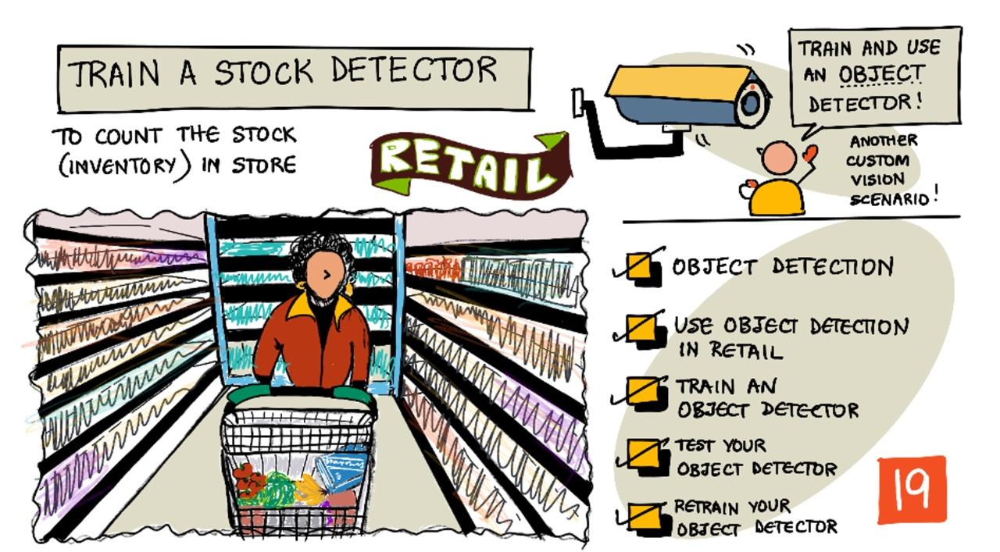

<!--
CO_OP_TRANSLATOR_METADATA:
{
  "original_hash": "8df310a42f902139a01417dacb1ffbef",
  "translation_date": "2025-08-28T14:23:23+00:00",
  "source_file": "5-retail/lessons/1-train-stock-detector/README.md",
  "language_code": "sl"
}
-->
# Učite se zaznavanja zalog

> Sketchnote avtorja [Nitya Narasimhan](https://github.com/nitya). Kliknite na sliko za večjo različico.

Ta video ponuja pregled zaznavanja objektov s storitvijo Azure Custom Vision, ki bo obravnavana v tej lekciji.

> 🎥 Kliknite na zgornjo sliko za ogled videa

## Predhodni kviz

[Predhodni kviz](https://black-meadow-040d15503.1.azurestaticapps.net/quiz/37)

## Uvod

V prejšnjem projektu ste uporabili AI za treniranje klasifikatorja slik – modela, ki lahko ugotovi, ali slika vsebuje nekaj, na primer zrelo ali nezrelo sadje. Drug tip AI modela, ki se lahko uporablja s slikami, je zaznavanje objektov. Ti modeli ne klasificirajo slike z oznakami, temveč so usposobljeni za prepoznavanje objektov in jih lahko najdejo na slikah, ne le zaznajo, da je objekt prisoten, ampak tudi kje na sliki se nahaja. To omogoča štetje objektov na slikah.

V tej lekciji boste spoznali zaznavanje objektov, vključno s tem, kako se lahko uporablja v trgovini na drobno. Prav tako se boste naučili, kako trenirati zaznavalnik objektov v oblaku.

V tej lekciji bomo obravnavali:

* [Zaznavanje objektov](../../../../../5-retail/lessons/1-train-stock-detector)
* [Uporaba zaznavanja objektov v trgovini na drobno](../../../../../5-retail/lessons/1-train-stock-detector)
* [Treniranje zaznavalnika objektov](../../../../../5-retail/lessons/1-train-stock-detector)
* [Testiranje zaznavalnika objektov](../../../../../5-retail/lessons/1-train-stock-detector)
* [Ponovno treniranje zaznavalnika objektov](../../../../../5-retail/lessons/1-train-stock-detector)

## Zaznavanje objektov

Zaznavanje objektov vključuje zaznavanje objektov na slikah z uporabo AI. Za razliko od klasifikatorja slik, ki ste ga trenirali v prejšnjem projektu, zaznavanje objektov ni namenjeno napovedovanju najboljše oznake za celotno sliko, temveč iskanju enega ali več objektov na sliki.

### Zaznavanje objektov vs klasifikacija slik

Klasifikacija slik se osredotoča na klasifikacijo celotne slike – kakšne so verjetnosti, da celotna slika ustreza vsaki oznaki. Rezultat so verjetnosti za vsako oznako, ki je bila uporabljena za treniranje modela.

V zgornjem primeru sta dve sliki klasificirani z modelom, ki je bil usposobljen za klasifikacijo posod z indijskimi oreščki ali pločevink paradižnikove paste. Prva slika je posoda z indijskimi oreščki in ima dva rezultata klasifikatorja slik:

| Oznaka          | Verjetnost |
| ---------------- | ---------: |
| `indijski oreščki` | 98.4%     |
| `paradižnikova pasta` | 1.6%     |

Druga slika je pločevinka paradižnikove paste, rezultati pa so:

| Oznaka          | Verjetnost |
| ---------------- | ---------: |
| `indijski oreščki` | 0.7%      |
| `paradižnikova pasta` | 99.3%     |

Te vrednosti bi lahko uporabili z odstotnim pragom za napovedovanje, kaj je na sliki. Kaj pa, če slika vsebuje več pločevink paradižnikove paste ali tako indijske oreščke kot paradižnikovo pasto? Rezultati verjetno ne bi dali želenega odgovora. Tukaj pride v poštev zaznavanje objektov.

Zaznavanje objektov vključuje treniranje modela za prepoznavanje objektov. Namesto da mu podate slike, ki vsebujejo objekt, in mu poveste, da je vsaka slika ena oznaka ali druga, označite del slike, ki vsebuje določen objekt, in ga označite. Lahko označite en sam objekt na sliki ali več. Na ta način se model nauči, kako izgleda sam objekt, ne le kako izgledajo slike, ki vsebujejo objekt.

Ko ga nato uporabite za napovedovanje slik, namesto da dobite seznam oznak in odstotkov, dobite seznam zaznanih objektov, z njihovim okvirjem in verjetnostjo, da okvir ustreza dodeljeni oznaki.

> 🎓 *Okvirji* so škatle okoli objekta.

Zgornja slika vsebuje tako posodo z indijskimi oreščki kot tri pločevinke paradižnikove paste. Zaznavalnik objektov je zaznal indijske oreščke in vrnil okvir, ki vsebuje indijske oreščke, z odstotno verjetnostjo, da okvir vsebuje objekt, v tem primeru 97.6%. Zaznavalnik objektov je zaznal tudi tri pločevinke paradižnikove paste in zagotavlja tri ločene okvirje, enega za vsako zaznano pločevinko, pri čemer ima vsak odstotno verjetnost, da okvir vsebuje pločevinko paradižnikove paste.

✅ Pomislite na različne scenarije, za katere bi želeli uporabiti modele AI, ki temeljijo na slikah. Kateri bi potrebovali klasifikacijo, in kateri zaznavanje objektov?

### Kako deluje zaznavanje objektov

Zaznavanje objektov uporablja kompleksne ML modele. Ti modeli delujejo tako, da sliko razdelijo na več celic, nato preverijo, ali je središče okvirja središče slike, ki ustreza eni od slik, uporabljenih za treniranje modela. To si lahko predstavljate kot nekakšno izvajanje klasifikatorja slik na različnih delih slike za iskanje ujemanj.

> 💁 To je drastično poenostavljeno. Obstaja veliko tehnik za zaznavanje objektov, o katerih lahko preberete več na [strani o zaznavanju objektov na Wikipediji](https://wikipedia.org/wiki/Object_detection).

Obstaja več različnih modelov, ki lahko izvajajo zaznavanje objektov. Eden posebej znanih modelov je [YOLO (You only look once)](https://pjreddie.com/darknet/yolo/), ki je izjemno hiter in lahko zazna 20 različnih razredov objektov, kot so ljudje, psi, steklenice in avtomobili.

✅ Preberite več o modelu YOLO na [pjreddie.com/darknet/yolo/](https://pjreddie.com/darknet/yolo/)

Modele za zaznavanje objektov je mogoče ponovno usposobiti z uporabo prenosa učenja za zaznavanje prilagojenih objektov.

## Uporaba zaznavanja objektov v trgovini na drobno

Zaznavanje objektov ima več uporab v trgovini na drobno. Nekatere vključujejo:

* **Preverjanje zalog in štetje** – prepoznavanje, kdaj je zaloga na policah nizka. Če je zaloga prenizka, se lahko pošljejo obvestila osebju ali robotom za ponovno polnjenje polic.
* **Zaznavanje mask** – v trgovinah s politiko nošenja mask med javnozdravstvenimi dogodki lahko zaznavanje objektov prepozna ljudi z maskami in brez njih.
* **Samodejno zaračunavanje** – zaznavanje predmetov, vzetih s polic v avtomatiziranih trgovinah, in ustrezno zaračunavanje strankam.
* **Zaznavanje nevarnosti** – prepoznavanje zlomljenih predmetov na tleh ali razlitih tekočin, obveščanje čistilnih ekip.

✅ Raziskujte: Katere so še nekatere uporabe zaznavanja objektov v trgovini na drobno?

## Treniranje zaznavalnika objektov

Zaznavalnik objektov lahko trenirate z uporabo Custom Vision, na podoben način kot ste trenirali klasifikator slik.

### Naloga - ustvarite zaznavalnik objektov

1. Ustvarite skupino virov za ta projekt z imenom `stock-detector`.

1. Ustvarite brezplačen vir za treniranje Custom Vision in brezplačen vir za napovedovanje Custom Vision v skupini virov `stock-detector`. Poimenujte ju `stock-detector-training` in `stock-detector-prediction`.

    > 💁 Imate lahko le en brezplačen vir za treniranje in napovedovanje, zato se prepričajte, da ste počistili projekt iz prejšnjih lekcij.

    > ⚠️ Če potrebujete, se lahko sklicujete na [navodila za ustvarjanje virov za treniranje in napovedovanje iz projekta 4, lekcija 1](../../../4-manufacturing/lessons/1-train-fruit-detector/README.md#task---create-a-cognitive-services-resource).

1. Zaženite portal Custom Vision na [CustomVision.ai](https://customvision.ai) in se prijavite z Microsoftovim računom, ki ste ga uporabili za svoj Azure račun.

1. Sledite [oddelku Ustvarjanje novega projekta v hitrem začetku za gradnjo zaznavalnika objektov na Microsoft Docs](https://docs.microsoft.com/azure/cognitive-services/custom-vision-service/get-started-build-detector?WT.mc_id=academic-17441-jabenn#create-a-new-project), da ustvarite nov projekt Custom Vision. UI se lahko spremeni, zato so ti dokumenti vedno najbolj ažurna referenca.

    Poimenujte svoj projekt `stock-detector`.

    Ko ustvarite svoj projekt, se prepričajte, da uporabljate vir `stock-detector-training`, ki ste ga ustvarili prej. Uporabite tip projekta *Object Detection* in domeno *Products on Shelves*.

    

    ✅ Domena izdelkov na policah je posebej namenjena zaznavanju zalog na trgovinskih policah. Preberite več o različnih domenah v [dokumentaciji o izbiri domene na Microsoft Docs](https://docs.microsoft.com/azure/cognitive-services/custom-vision-service/select-domain?WT.mc_id=academic-17441-jabenn#object-detection)

✅ Vzemite si čas za raziskovanje UI Custom Vision za vaš zaznavalnik objektov.

### Naloga - trenirajte svoj zaznavalnik objektov

Za treniranje modela boste potrebovali niz slik, ki vsebujejo objekte, ki jih želite zaznati.

1. Zberite slike, ki vsebujejo objekt za zaznavanje. Potrebovali boste vsaj 15 slik, ki vsebujejo vsak objekt za zaznavanje iz različnih kotov in v različnih svetlobnih pogojih, vendar več je bolje. Ta zaznavalnik objektov uporablja domeno *Products on shelves*, zato poskusite postaviti objekte, kot da so na trgovinski polici. Potrebovali boste tudi nekaj slik za testiranje modela. Če zaznavate več kot en objekt, boste želeli nekaj testnih slik, ki vsebujejo vse objekte.

    > 💁 Slike z več različnimi objekti štejejo k minimalnim 15 slikam za vse objekte na sliki.

    Vaše slike naj bodo png ali jpeg, manjše od 6MB. Če jih ustvarite z iPhone, na primer, so lahko visoko ločljive HEIC slike, zato jih bo treba pretvoriti in morda zmanjšati. Več slik je bolje, in imeti bi morali podobno število zrelih in nezrelih.

    Model je zasnovan za izdelke na policah, zato poskusite fotografirati objekte na policah.

    Nekaj primerov slik, ki jih lahko uporabite, najdete v mapi [images](../../../../../5-retail/lessons/1-train-stock-detector/images) za indijske oreščke in paradižnikovo pasto.

1. Sledite [oddelku Naloži in označi slike v hitrem začetku za gradnjo zaznavalnika objektov na Microsoft Docs](https://docs.microsoft.com/azure/cognitive-services/custom-vision-service/get-started-build-detector?WT.mc_id=academic-17441-jabenn#upload-and-tag-images), da naložite svoje slike za treniranje. Ustvarite ustrezne oznake glede na vrste objektov, ki jih želite zaznati.

    

    Ko rišete okvirje za objekte, jih držite tesno okoli objekta. Lahko traja nekaj časa, da obkrožite vse slike, vendar orodje zazna, kaj meni, da so okvirji, kar proces pospeši.

    

    > 💁 Če imate več kot 15 slik za vsak objekt, lahko trenirate po 15 in nato uporabite funkcijo **Predlagane oznake**. To bo uporabilo trenirani model za zaznavanje objektov na neoznačenih slikah. Nato lahko potrdite zaznane objekte ali jih zavrnete in ponovno narišete okvirje. To lahko prihrani *veliko* časa.

1. Sledite [oddelku Treniranje zaznavalnika v hitrem začetku za gradnjo zaznavalnika objektov na Microsoft Docs](https://docs.microsoft.com/azure/cognitive-services/custom-vision-service/get-started-build-detector?WT.mc_id=academic-17441-jabenn#train-the-detector), da trenirate zaznavalnik objektov na svojih označenih slikah.

    Dobili boste izbiro vrste treniranja. Izberite **Quick Training**.

Zaznavalnik objektov se bo nato treniral. Treniranje bo trajalo nekaj minut.

## Testiranje zaznavalnika objektov

Ko je vaš zaznavalnik objektov treniran, ga lahko testirate tako, da mu podate nove slike za zaznavanje objektov.

### Naloga - testirajte svoj zaznavalnik objektov

1. Uporabite gumb **Quick Test**, da naložite testne slike in preverite, ali so objekti zaznani. Uporabite testne slike, ki ste jih ustvarili prej, ne pa nobene od slik, ki ste jih uporabili za treniranje.

    

1. Poskusite vse testne slike, ki jih imate na voljo, in opazujte verjetnosti.

## Ponovno treniranje zaznavalnika objektov

Ko testirate svoj zaznavalnik objektov, morda ne bo dal pričakovanih rezultatov, enako kot pri klasifikatorjih slik v prejšnjem projektu. Svoj zaznavalnik objektov lahko izboljšate tako, da ga ponovno trenirate s slikami, pri katerih se zmoti.

Vsakič, ko izvedete napoved z možnostjo hitrega testiranja, se slika in rezultati shranijo. Te slike lahko uporabite za ponovno treniranje modela.

1. Uporabite zavihek **Predictions**, da poiščete slike, ki ste jih uporabili za testiranje.

1. Potrdite vse natančne zaznave, izbrišite napačne in dodajte manjkajoče objekte.

1. Ponovno trenirajte in ponovno testirajte model.

---

## 🚀 Izziv

Kaj bi se zgodilo, če bi uporabili zaznavalnik objektov s podobnimi predmeti, kot so pločevinke iste znamke paradižnikove paste in sesekljanega paradižnika?

Če imate kakšne podobne predmete, jih preizkusite tako, da dodate njihove slike v svoj zaznavalnik objektov.

## Zaključni kviz
[Post-lecture quiz](https://black-meadow-040d15503.1.azurestaticapps.net/quiz/38)

## Pregled in samostojno učenje

* Ko ste trenirali svoj detektor objektov, ste videli vrednosti za *Precision*, *Recall* in *mAP*, ki ocenjujejo ustvarjeni model. Preberite več o teh vrednostih v [razdelku Evaluate the detector v hitrem vodiču za izdelavo detektorja objektov na Microsoftovi dokumentaciji](https://docs.microsoft.com/azure/cognitive-services/custom-vision-service/get-started-build-detector?WT.mc_id=academic-17441-jabenn#evaluate-the-detector)
* Preberite več o zaznavanju objektov na [strani o zaznavanju objektov na Wikipediji](https://wikipedia.org/wiki/Object_detection)

## Naloga

[Primerjajte domene](assignment.md)

---

**Omejitev odgovornosti**:  
Ta dokument je bil preveden z uporabo storitve za strojno prevajanje [Co-op Translator](https://github.com/Azure/co-op-translator). Čeprav si prizadevamo za natančnost, vas prosimo, da upoštevate, da lahko avtomatizirani prevodi vsebujejo napake ali netočnosti. Izvirni dokument v njegovem izvirnem jeziku je treba obravnavati kot avtoritativni vir. Za ključne informacije priporočamo strokovno človeško prevajanje. Ne prevzemamo odgovornosti za morebitna nesporazumevanja ali napačne razlage, ki izhajajo iz uporabe tega prevoda.